Output of Section
===========

Two types of section output are available.

First is the time history output ``/TH/SECTIO`` consisting of the sum of
the force and moments acting on the section. The output can be in the
global system or the local system with the most commons output being
the variable groups, GLOBAL, LOCAL, and CENTER.

The second type of output is displacements and optional force and
moment for every node in the section written to the section output
data ``SC01`` file. This file can then be read as an imposed displacement
applied to a second cut section model. RD-E: 5400 Cut Methodology is
an example of the cut section methodology that can be used. In this
case, a full model is run with *I*\ :sub:`SAVE` =1 or 2 to save
displacement and optionally the resultant section forces/moments in
the file ``file_nameSC01``.

Next, the second cut model (submodel) is created with a section
defined using the option *I*\ :sub:`SAVE` =100 or 101 to read the
displacement of the nodes the section file. The section’s local
system defined by the three nodes *node_ID*\ :sub:`1`,
*node_ID*\ :sub:`2`, and *node_ID*\ :sub:`3` or *frame_ID* must be
the same one used when saving the data (*I*\ :sub:`SAVE` =1 or 2) and
reading the data (*I*\ :sub:`SAVE` =100 or 101).

If *I*\ :sub:`SAVE` =2 is used in the full model and *I*\ :sub:`SAVE` =101 is
used in the cut model, then PRADIOSS outputs the difference between
resultant section forces and moments in full and cut model in the
section (``/TH/ SECTIO``).

To improve solution times and decrease memory needed, it is
recommended to set *I*\ :sub:`SAVE` =0 if no cut modeling methodology is
needed.

Filter
--------

When reading and applying the displacements to a cut section model,
the displacement can be filtered using an exponential moving average
filter. For example, the filtered displacement in the x-direction
would be:

.. math:: x_{f}=\alpha x(t)+(1-\alpha)x(t-dt)   \tag{49}

Where,

:math:`x_{f}`     Filtered displacement

:math:`\alpha`    Exponential moving average filtering constant

:math:`x(t)`      Unfiltered displacement at the current time

:math:`x(t-dt)`   Displacement at the previous time step

Recommendations are:

:math:`\alpha =\frac{2\pi dt}{T}`    for filtering -3dB

:math:`\alpha =\frac{2\pi dt}{\sqrt{3T}}`   for filtering -6dB

Where,

:math:`T`   Filtering period

:math:`dt`   Model time step

The filtering period :math:`T = 10\Delta t` is often used making :math:`\alpha =\frac{2\pi}{10}` = 0.62832 for a -3dB filter.

Materials
=========

Different material tests could result in different material mechanic
character.

The typical material test for metal is tensile test. With this test
strain-stress curve, yield point, necking point and failure point of
material could be observed.

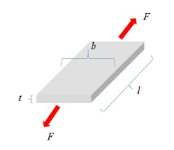

*Figure 131: Force (F) and Length (l) are Measured*

Engineer strain-stress curve could be generated by:

.. math:: \sigma_{e}=\frac{F}{S_{0}}   \tag{50}

.. math:: c_{e}=\frac{\Delta I}{I_{0}}   \tag{51}

Where,

:math:`S_{0}`   Section area in the initial state

:math:`I_{0}`   Initial length

In this Force-elongation curve or engineer stress-strain curve, three
points are important.

1. Yield point: where material begin to yield. Before yield you can assume material is in elastic state (the Young's modulus *E* could be measured) and after yield, material plastic strain which is nonreversible.

   -  Some material in this test will first reach the upper yield point (R\ :sub:`eH`) and then drop to the lower yield point (R\ :sub:`eL`). In engineer stress-strain curve, lower yield stress (conservative value) could be taken.

   -  Some material can not easily find yield point. Take the stress of 0.1 or 0.2% plastic strain as yield stress.

2. Necking point: where the material reaches the maximum stress in engineer stress-strain curve. After this point, the material begins to soften.

3. Failure point: where material failed.

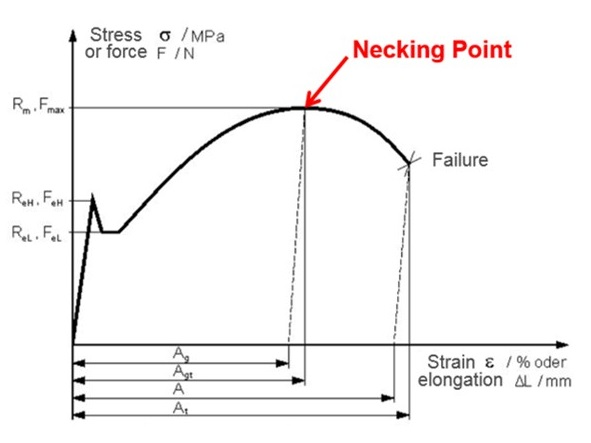

*Figure 132:*

:math:`\mathbf{R_{m}}`   Maximum resistance

:math:`\mathbf{F_{max}}` Maximum force

:math:`\mathbf{R_{eH}}`  Upper yield level

:math:`\mathbf{R_{eL}}`  Lower yield level

:math:`\mathbf{A_{g}}`   Uniform elongation

:math:`\mathbf{A_{gt}}`  Total uniform elongation

:math:`\mathbf{A_{t}}`   Total failure strain

True stress-strain curve which is requested in most materials in
PRADIOSS, except in ``LAW2``, where both engineer stress-strain and true
stress-strain are possible to input material data.

In Figure 133, find engineer stress-strain curve (blue) by using:

.. math:: \sigma_{tr}=\sigma_{e}\text{exp}\Big{(}\varepsilon_{tr}\Big{)}    \tag{52}

.. math:: \varepsilon_{tr}=\text{ln}\big{(}1+\varepsilon_{e}\big{)}     \tag{53}

The result is true stress-strain curve (red). Plastic true
stress-strain curve is shown in green, which plastic strain begin
from 0. This green plastic true stress-strain curve is what you need,
as in ``LAW36``, ``LAW60``, ``LAW63``, and so on.

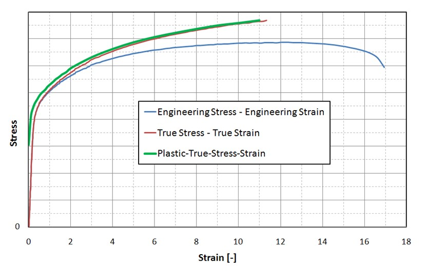

*Figure 133:*

The true stress-strain curve is valid until the necking point of the
material. After the necking point, the material curve has to be
defined manually for hardening. Using a different material law,
PRADIOSS will extrapolation the true stress-strain curve to 100%.

   -  Linear extrapolation: If stress-strain curve is as function input (``LAW36``), then stress-strain curve is linearly extrapolated with a slope defined by the last two points of the curve. It is recommended that the list of abscissa value be increased to a value greater than the previous abscissa value.

   -  Johnson-Cook: After necking point, Johnson-Cook hardening is one of the most commonly used to extrapolate the true stress-strain curve. 
  
.. math:: \sigma_{y}=a+b\varepsilon_{pn}

However, it may overestimate strain hardening for automotive steel, In this case, combination of swift-voce hardening is more accurate.

   -  Swift and Voce: After necking point, use one of the following equations to extrapolate the true stress-strain curve.

       :**Swift model**: :math:`\sigma_{y}=A\left(\varepsilon_{p}+\varepsilon_{0}\right)^{n}`

                        :math:`A\text{ and } n \text{ are positive.}`

       :**Voce model**: :math:`\sigma_{y}=k_{0}+Q\left[1-\exp\left(-B\varepsilon_{p}\right)\right]`

                        :math:`k_{0,}Q and B` are positive

| **Combination of Switch and**
| **Voce model (LAW84 and LAW87)**     

:math:`\sigma_{y}=\alpha\big{[}A\big{(}\overline{\varepsilon}_{p}+\varepsilon_{0}\big{)}^{n}\big{]}+(1-\alpha)\big{\{}{k_{0}+Q\big{[}1-exp\big{(}-B\overline{\varepsilon}\{p}\big{)}\big{]}\big{\}}`

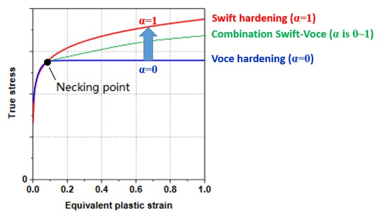

*Figure 134:* 

Here, α is weight of Swift hardening and Voce hardening. Here one
Compose script as example to fit the Swift hardening parameters :math:`A,\varepsilon_{0}, n` 
and Voce hardening parameters :math:`k_{0,} Q, B` with input stress-strain curve.

| **See Also**
| /MAT/LAW84 (Starter)
| /MAT/LAW87 (BARLAT2000) (Starter)

Hyperelastic Materials
------------

Hyperelastic materials are used to model materials that respond
elastically under very large strains. These materials normally show a
nonlinear elastic, incompressible stress strain response which
returns to its initial state when unloaded.

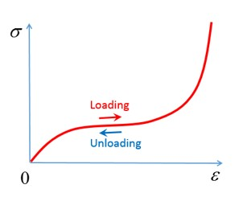

*Figure 135:*

Hyperelastic materials are a specific case of Cauchy material where
the stress only depends on the current deformation. Meyer’s kinetic
theory describes how these materials consist of flexible chain like
structure which rotates and straightens when deformed. This led to
the theory that a strain energy density function could be written as
a function of the deformation.\ :sup:`3` The strain energy density can
then be differentiated to obtain the stress strain behavior of the
material.

The most common hyperelastic materials are elastomers or rubbers.
Some properties of elastomers include.\ :sup:`2`

-  The material is nearly ideally elastic and deformation is reversible with stress being a function onlyof current strain and independent of history or rate of loading, if deformed at constant temperature or adiabatically.

-  The material incompressible and strongly resists volume changes. The bulk modulus which is aratio of volume change to hydrostatic component of stress is comparable to that of metals.

-  The material is very weak in shear with a shear modulus 10\ :sup:`-5` times small than most metals.

-  The material is isotropic its stress-strain response is independent of material orientation.

Element Property Recommendations
~~~~~~~~~~

When using hyperelastic material laws, there are some recommended
element property settings. When using solid elements, it is always
better to mesh with 8 node ``/BRICK`` elements, if possible. If not, then
``/TETRA4`` or ``/TETRA10`` elements can be used. Recommended ``/PROP/SOLID`` for
8 nodes brick are, :math:`I_{smstr}` =10, :math:`I_{cpre}` =1, with
:math:`I_{solid}` =24. If hourglassing occurs, then :math:`I_{solid}` =17 with
:math:`I_{frame}` =2 can be used.

3. Treloar, L. R. G. "The elasticity and related properties of rubbers." Reports on progress in physics 36, no. 7 (1973): 755
4. Bower, Allan F. Applied mechanics of solids. CRC press, 2009

Ogden Materials
-----------

Hyperelastic materials can be used to model the isotropic, nonlinear
elastic behavior of rubber, polymers, and similar materials. These
materials are nearly incompressible in their behavior and can be
stretched to very large strains.

In PRADIOSS, material laws LAW42, LAW62, LAW69, LAW82, and LAW88
utilize different strain energy density functions of the Ogden
material model\ :sup:`5` to model hyperelastic materials.\ :sup:`6`

Material Definition
~~~~~~~~~~~~~

Stretch (also called *stretch ratio*) :math:`\lambda` is the ratio of final length
and initial length. It is used for materials with large deformations.
For a cube in tension:

:math:`\varepsilon_{1}=\frac{\Delta I}{I_{01}}`  Engineering strain (also called nominal strain) in direction 1

:math:`\lambda_{1}=\frac{I_{1}}{I_{01}}`         Strength in direction 1

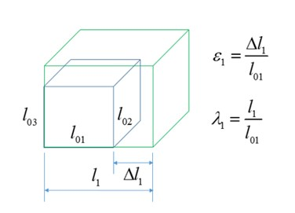

*Figure 136:*

Thus, strain and stretch are related as:

.. math:: \lambda= 1 + \varepsilon  \tag{113}

Principal stretch :math:`\lambda_{i}` can be used to describe the volumetric deformation
by calculating the relative volume, J, computed as:

.. math:: J=\frac{V}{V_{0}}=\frac{I_{1}\cdot I_{2}\cdot I_{3}}{I_{01}\cdot I_{02}\cdot I _{03}}=\lambda_{1}\cdot\lambda_{2}\cdot\lambda_{3}    \tag{114}

For an incompressible material the volume should not change and thus
=1 and thus, the stretch can be calculated for the following material
tests.

-  Uniaxial test:

:math:`\lambda_{1}=\lambda\text{ and }\lambda_{2}=\lambda_{3}2=\frac{1}{\lambda}`

-  Biaxial test:

:math:`\lambda_{1}=\lambda_{2}=\lambda and (\lambda_{3}=\lambda^{-2})`

-  Planer (shear) test:

:math:`\lambda_{1}=\lambda; \lambda_{3}=1 and (\lambda_{2}=\lambda^{-1})`

*/MAT/LAW42 (Ogden)*
^^^^^^^^^^^^^^^^^^

This material model defines a hyperelastic, viscous, and
incompressible material specified using the Ogden, Neo-Hookean, or
Mooney-Rivlin material models. This law is generally used to model
incompressible rubbers, polymers, foams, and elastomers. This
material can be used with shell and solid elements.

LAW42 uses the following strain energy density representation of the
Ogden material model.

.. math:: W\big{(}\lambda_{1},\lambda_{2},\lambda_{3}\big{)}=\sum_{p=1}^{5}\frac{u_{p}}{\alpha_{p}}\big{(}\vec{\lambda}_{1}\alpha_{p}+\vec{\lambda}_{2}\alpha_{p}+\vec{\lambda}_{3}\alpha_{p}-3\big{)}+\frac{K}{2}\big{(}J-1\big{)}^{2}

Where,

:math:`W`   Strain energy density 
   
:math:`\lambda_{1}`   :math:`i_{th}` principal engineering stretch

:math:`J`   Relative volume defined as:  :math:`J=\lambda_{1}\cdot\lambda_{2}\cdot\lambda_{3}=\frac{\rho_{0}}{\rho}`

:math:`\vec{\lambda}_{i}=J^{\frac{1}{3}}\lambda_{i}`  Deviatoric stretch

:math:`\alpha_{p} and mu_{p}`    Material constants coefficient pairs.

Up to 5 material constant pairs can be defined.

The initial shear modulus and bulk modulus (K) are given by:

.. math:: \mu=\frac{\sum_{p=1}^{5}\mu_{p}\cdot\alpha_{p}}{2}    \tag{58}

and

.. math:: K=\mu\cdot\frac{2\big{(}1+v\big{)}}{3\big{(}1-2v\big{)}}   \tag{59}

Where, :math:`v` is the Poisson's ratio and is only used for computing the bulk
modulus.

Material Parameters
'''''''''''''''''''

Parameters :math:`\alpha` and :math:`\mu` must be chosen so that initial shear modulus is:

.. math:: \mu=\frac{\sum_{p=1}^{5}\mu_{p}\cdot\alpha_{p}}{2}>0   \tag{60}

For material stability, it is required that each material constant pair    

.. math:: \mu_{p}\cdot\alpha_{p}>0   \tag{61}

In general, the Ogden model can be used for strains up to 700%. The
number of terms material pairs, :math:`\alpha` and :math:`\mu`, needed depends on the range of
experimental data that is fit and curve fitting accuracy

desired. In practice, 3 material pairs fit most data. If the material
pairs are not known for a particular material, then a curve fit of
uniaxial test data can be done in PRADIOSS using LAW69 or via separate
fitting software.

Neo-Hookean Model
'''''''''''''''''

A simple case of the Ogden material model is the Neo-Hooken model
represented using the following equation for the strain energy
density function:

.. math:: W=C_{10}(I_{1}-3)  \tag{62}

Where,

:math:`I_{1}`   The first invariants of the right Cauchy-Green Tensor

:math:`C_{10}`   Material constant

This representation can be derived from the LAW42 Ogden strain energy
density function when:

:math:`\mu_{1}=2\cdot C_{10}:\alpha_{1}=2, and\mu_{2}=\alpha_{2}=0`

The Neo-Hookean model is a simple model that is typically only
accurate for strains less than 20%.

Mooney-Rivlin Model
'''''''''''''''''''

A slightly more complex case of the LAW42 Ogden material model is the
Mooney-Rivlin model, which can be represented using the following
equation for the strain energy density function: 

.. math:: W=C_{10}(I_{1}-3)+C_{0}(I_{2}-3) \tag{63}

Where,

:math:`I_{1}` **and** :math:`I_{2}` The first and second invariants of the right Cauchy-Green Tensor

:math:`C_{10}` **and** :math:`C_{01}`  Material constants

This representation can be derived from the LAW42 Ogden strain energy
density function when:

:math:`\mu_{1}=2\cdot C_{10},\mu_{2}=-2\cdot C_{01}, \alpha_{1}=2, and \alpha_{2}=\cdot 2`

Mooney-Rivlin constants are available from a material supplier or
testing company. If they are not available, then a curve fit of
uniaxial test data can be done in PRADIOSS using LAW69 or via separate
fitting software. The Mooney-Rivlin material law is accurate for
strains up to 100%.

Poisson's Ratio and Material Incompressibility
''''''''''''''''''''''''''''''''''''''''''''''

If a material is truly incompressible, then :math:`v` = 0.5. However, in practice is
not possible to use because that would result in an infinite bulk
modulus, an infinite speed of sound, and thus an infinitely small
solid element Time Step.

.. math:: K=\mu\cdot\frac{2\left(1+v\right)}{3\left(1-2v\right)}=\mu\cdot\frac{2\left(1+v\right)}{3\left(1-2*0.5\right)}=\infty  \tag{64}

The effect of different Poisson’s ratio input can be seen in Figure 137.
The largest difference in the results is at higher amounts of strain.
The results will match the test data better when (v=0.4997) but this
results in a time step that is 4 times lower than (v=0.495). Thus, to
balance the computation time and accuracy it is recommended to use
(v=0.495) for incompressible rubber material.

The effect of Poisson’s ratio and Bulk modulus are similar in other
Ogden material law.

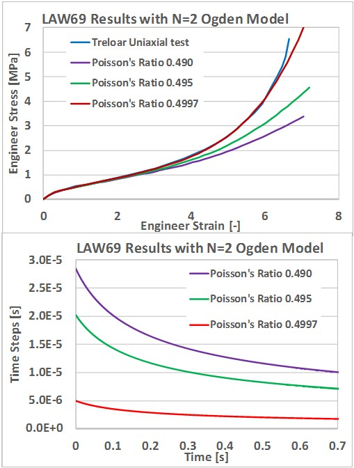

*Figure 137:*

Higher values of the Poisson’s ratio may lead to a very small time
step or divergence for explicit simulations.

In LAW42, material incompressibility is provided by using a penalty
approach, which calculates the pressure proportional to a change in
density.

.. math:: P=K\cdot Fscale_{blk}\cdot\mathrm{f}_{blk}(J)\cdot(J-1)   \tag{65}

Where,

:math:`K`   Bulk modulus

:math:`J=\frac{V}{V_{0}}=\frac{m\rho_{0}}{m\rho}=\frac{\rho_{0}}{\rho}`   Relative volume which simplifies to relative density if mass is constant

:math:`\mathrm{f}_{blk}(J)`   Bulk coefficient scale factor versus relative volume function

:math:`Fscale_{blk}`   Abscissa scale factor for function  :math:`F_{blk}(J)`

The bulk modulus (*K*) of hyperelastic materials is generally a very
high value which provides the needed pressure-resistance to maintain
the incompressibility condition (*J=1*). But if a material starts to
compress (*j < 1*) then the bulk modulus can be increased by including
the *fct_ID*\ :sup:`blk` input function which allows the scaling of the bulk
coefficient value as a function of . By default, there is no scaling
and; thus, if the function identifier is zero and the value of the
bulk scaling function is equal to 1. It is advisable to output
(``/ANIM/BRICK/DENS``) and review the material density of LAW42
components to make sure that the density variation is small, that is
the value of *J* is close to 1 and the material is incompressible.

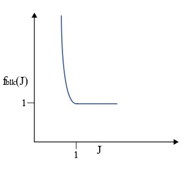

*Figure 138: Bulk Modulus Scale Factor Function fct_ID*\ :sup:`blk`

Viscous (Rate) Effects
'''''''''''''''''''''

Viscous (rate) effects are modeled in LAW42 using a Maxwell model, which
can be described in a simplified manner as a system of
:math:`\eta` springs with stiffness’ :math:`G_{i}` and dampers
:math:`\eta_{i}`:

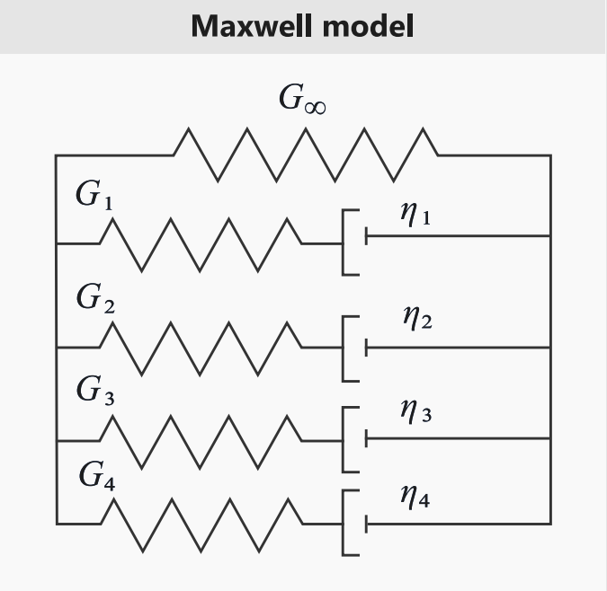

*Figure 139: Maxwell Model*

The Maxwell model is represented using Prony series inputs
(:math:`G_{i},\tau_{i})`. The hyperelastic initial shear
modulus :math:`\mu` is the same as the long-term shear modulus
:math:`G_{\infty}` in the Maxwell model, and
:math:`\tau_{i}` is the relaxation time:


.. math:: \tau_{i}=\frac{\eta_{i}}{G_{i}}   \tag{66}

The :math:`G_{i} and \tau_{i}` values must be positive.

*/MAT/LAW62 (VISC_HYP)*
~~~~~~~~~~~~~~

A hyper visco-elastic material law in PRADIOSS that can be used to
model polymers and elastomers.

The hyperelastic behavior in this material law is defined using the
following strain energy density function:

.. math:: W(\lambda_{1},\lambda_{2},\lambda_{3})=\sum_{i=1}^{N}\frac{2\mu_{i}}{\alpha_{i}!}\Big{(}\lambda_{1}\alpha_{i}+\lambda_{2}\alpha_{i}+\lambda_{3}\alpha_{i}-3+ \frac{1}{\beta}(J^{-\alpha_{i}\beta}-1)\Big{)}  \tag{67}

Where,

:math:`W` Strain energy density

:math:`\lambda_{i}`  :math:`i_{th}` principal stretch

:math:`J` Relative volume defined in Equation 67

:math:`\beta=\frac{v}{(1-2v)}`

:math:`\alpha_{i}` **and** :math:`\mu_{i}`  Material constants coefficient pairs.

   Up to 5 material constant pairs can be defined.

Poisson’s ratio must be (0<v<0.5). This law can be used to model
compressible or sometimes called *hyperfoam materials* by defining a low
Poisson’s ratio value.

|image1| **Note:** The :math:`\mu_{i}` material coefficients are
different, but can be converted using:

.. math:: \mu_{i}^{LAW62}=\frac{\mu_{i}^{LAW42}\cdot a_{i}^{LAW42}}{2}   \tag{68}

Viscous (Rate) Effects
~~~~~~~~~~~~~~~~

Viscous (rate) effects are modeled in LAW62 using a Maxwell model which
can be described in a simplified manner as a system of n springs with
stiffness’ :math:`G_{i}` and dampers :math:`\eta_{i}`.


*Figure 140: Maxwell Model*

The Maxwell model is represented using a Prony series with inputs.
The initial shear modulus is:

.. math:: G_{0}=\sum_{i=1}^{N}\mu_{i}  \tag{69}

The sum of :math:`\mu_{i}` should be greater than 0.

.. math:: G_{0}=G_{\infty}+\sum_{i}G_{i}   \tag{70}

The stiffness ratio is:

.. math:: \gamma_{\infty}=\frac{G_{\infty}}{G_{0}}=1-\sum_{i}\gamma_{i}  \tag{71}

.. math:: \gamma_{i}=\frac{G_{i}}{G_{0}}    \tag{72}

With,

.. math:: \gamma_{i}\in\left[0,\,1\right]\sum_{i}\gamma_{i}<1    \tag{73}

and the ground shear modulus

.. math:: G_{0}=G_{\infty}+\sum_{i}G_{i}    \tag{74}

The relative time, :math:`\tau_{i}`  must be positive:

.. math:: \tau_{i}=\frac{\eta_{i}}{G_{i}}   \tag{75}

|image1| **Note:** When viscosity is included, the shear modulus in LAW62 is the
initial shear modulus
:math:`G_{0}=\sum_{i=1}^{N}\mu_{i}` which
includes viscosity, but in LAW42 the shear modulus is the long-term
shear modulus, which does not include viscosity
:math:`G_{\omega}=\frac{\sum_{p=1}^{5}\mu_{p}\cdot a_{p}}{2}`.

*/MAT/LAW69*
----------

This law, like ``/MAT/LAW42 (OGDEN)`` defines a hyperelastic and
incompressible material specified using the Ogden or Mooney-Rivlin
material models. Unlike LAW42, where the material parameters are
input, this law computes the material parameters using test data from
a uniaxial engineering stress-strain curve.

This material can be used with shell and solid elements.

The strain energy density formulation used depends on the *law_ID*:

-  *law_ID* = 1 (Ogden law):

.. math:: W\big{(}\lambda_{1},\lambda_{2},\lambda_{3}\big{)}=\sum_{p=1}^{5}\frac{\mu_{p}}{a_{p}}\big{(}\lambda_{1}a_{p}+\lambda_{2}a_{p}+\lambda_{3}a_{p}-3\big{)}+\frac{K}{2}\big{(}J-1\big{)}^{2}   \tag{76}

-  *law_ID* = 2 (Mooney-Rivlin law):

.. math:: W=C_{10}\big{(}I_{1}-3\big{)}+C_{0}\big{(}I_{2}-3\big{)}   \tag{77}

Material Parameters
~~~~~~~~~~~~~~

After reading the stress-strain curve (*fct_ID*\ :sub:`1`), PRADIOSS
calculates the corresponding material parameter pairs using a
nonlinear least-square fitting algorithm. For the classic Ogden law,
(*law_ID*\ =1), the calculated material parameter pairs are and where
the value of *p* is defined via the *N_pair* input.

The maximum value is *N_pair*\ =5 with a default value of 2. Usually
no more than *N_pair*\ =3 is needed for a good fit.

For the Mooney-Rivlin law (*law_ID* =2), the material parameter :math:`C_{10}` and :math:`C_{01}`
are calculated for the LAW42 Ogden law can be calculated using this
conversion:

:math:`\mu_{1}=2\cdot C_{10},\mu_{2}=-2\cdot C_{01},\alpha_{1}=2, and (\alpha_{2}=)-2`

The minimum test data input should be a uniaxial tension engineering
stress strain curve. If uniaxial compression data is available, the
engineering strain should increase monotonically from a negative
value in compression to a positive value in tension. In compression,
the engineering strain should not be less than -1.0 since -100%
strain is physically not possible.

To improve the quality of the nonlinear least square fit, it is
recommended that:

-  The experimental data curve represents a smooth monotonically increasing function with uniform distribution of abscissa points. The number of data points in the experimental data curve should be greater than the number of parameter pairs (*N_pair*).

-  The engineering strain is negative in compression and positive in tension. For compression test data, the engineering strain should be greater than -1.0 (100% compression maximum) but tension only stress strain data can also be used.

-  If *N_pair* ≥ 3, then the test data should cover at least 100% of the tensile strain and/or 50% of the compressive strain.

-  *N_pair* should not be set to a very large value to avoid instabilities in the fitting procedure.

This material law is stable when
:math:`\mu_{p}\alpha_{p}>0` (with (p)=1,…5) is
satisfied for parameter pairs for all loading conditions. By default,
Radios tries to fit the curve by accounting for these conditions
(:math:`I_{check}=2)`. If a proper fit cannot be found, then Radios uses a
weaker condition (:math:`I_{check}=1`:), which ensures that the initial shear
hyperelastic modulus (:math:`\mu`) is positive.

To determine how well the calculated material parameters represent
the input test data, the PRADIOSS Starter outputs an “averaged error
of fitting” value which is recommended to not exceed 10%. For visual
comparison, the stress-strain curve calculated from the strain energy
density and calculated material parameters is also output by the
PRADIOSS Starter.

Due to the friction involved in a uniaxial compression test, it is
usually more accurate to take equal biaxial tension test data and
convert it to uniaxial compressive data using these formulas :sup:`7`
which are valid for incompressible materials.

.. math:: \varepsilon_{c}=\frac{1}{\left(\varepsilon_{b}+1\right)^{2}}-1   \tag{78}

.. math:: \sigma_{c}=\sigma_{b}\left(1+\varepsilon_{b}\right)^{3}   \tag{79}

Where,

:math:`\varepsilon_{c}`  Uniaxial engineering compressive stain

:math:`\varepsilon_{b}`   Equal biaxial engineering tension strain

:math:`\sigma_{c}`  Uniaxial engineering compressive stress

:math:`\sigma_{b}`  Equal biaxial engineering tension stress

Material Incompressibility
~~~~~~~~~~~~

Material LAW69 uses the same method to maintain incompressibility as
LAW42. For additional information, refer to Poisson's Ratio and
Material Incompressibility in LAW42.

Viscous (Rate) Effects
~~~~~~~~~~~~

/VISC/PRONY must be used with LAW69 to include viscous effects.
Alternatively, LAW69 could be used to extract the Ogden or
Mooney-Rivlin parameters and then those parameters can be used in
LAW42 with viscosity added.

*/MAT/LAW82*
-----------

This material model defines a hyperelastic, and incompressible
material specified using the Ogden, Neo-Hookean, or Mooney-Rivlin
material models. This law is generally used to model incompressible
rubbers, polymers, foams, and elastomers.

This material can be used with shell and solid elements. As compared
to LAW42 or LAW62, this law uses a different Ogden strain energy
density formulation given in Equation 80. The LAW82 strain energy
density formulation matches what is used in some other finite
elements solver’s hyperelastic model and; thus, the material
parameters for this form of the Ogden strain energy density are
sometimes available from material suppliers or other sources.

.. math:: W=\sum_{i=1}^{N}\frac{2\mu_{i}}{\alpha_{i}^{2}}\big{(}\overline{\lambda}_{i}\alpha_{i}+\overline{\lambda}_{2}\alpha_{i}+\overline{\lambda}_{3}\alpha_{i}-3\big{)}+\sum_{i=1}^{N}\frac{1}{D_{i}}\big{(}J-1\big{)}_{2i}   \tag{80}

Where,

:math:`W` Strain energy density 

:math:`N`  Number of material constants :math:`\alpha_{i},\mu_{i}` and :math:`D_{i}`

:math:`\overline{\lambda}_{i}=J^{\frac{1}{3}}\lambda_{i}`  Deviatoric   stretch

:math:`J`  Relative volume as defined in Equation 56

The initial shear modulus:

.. math:: \mu=\sum_{i=1}^{N}\mu_{i}   \tag{81}

The Bulk Modulus is calculated as :math:`K=\frac{2}{D_{1}}` based
on these rules:

-  If :math:`v=0`, :math:`D_{1}` should be entered.

-  If :math:`v\neq 0`, :math:`D_{1}` input is ignored and will be recalculated and output in the Starter output using:

.. math:: D_{1}=\frac{3(1-2v)}{\mu(1+v)} \tag{82}

-  If :math:`v=0` and :math:`D_{1}` =0, a default value of :math:`v=0.475` is used and :math:`D_{1}` is calculated using Equation 82

Neo-Hookean Model
~~~~~~~~

Like LAW42, LAW82 can also be simplified to a Neo-Hooken model by using:

:math:`\mu_{1}=2\cdot C_{10},\alpha_{1}=2) and \mu_{2}=\alpha_{2}=0`

Mooney-Rivlin Model
~~~~~~~~

Like LAW42, LAW82 can also be simplified to a Mooney-Rivlin model by using:

:math:`\mu_{1}=2\cdot C_{10},\mu_{2}=2\cdot C_{01},\alpha_{1}=2 and \alpha_{2}=-2`

Viscous (Rate) Effects
~~~~~~~~~~

``/VISC/PRONY`` must be used with LAW82 to include viscous effects.

*Drücker Condition Stability Check*
~~~~~~~~~~~~~~~

In LAW42 and LAW69, the Drücker stability is automatically calculated
by the PRADIOSS Starter.

The Drücker stability condition checks if the change in the Kirchhoff
stress corresponding to the infinitesimal change in the logarithmic
strain (true strain) satisfies the following inequality.

.. math:: \sum_{i=1}^{3}d\tau_{i}de\_{i}>0   \tag{83}

Where, *i* =1,2,3 principal direction.

With the change in logarithmic strain

.. math:: de_{i}=\frac{d\lambda_{i}}{\lambda_{i}}   \tag{84}

:math:`d\tau_{i}=J\cdot d\sigma_{i}`  The change of Kirchhoff stress

:math:`d\tau=\mathbf{D}:d\varepsilon` Relationship between Kirchhoff stress and logarithmic strain

The Drücker stability condition will be:

.. math:: \sum d\varepsilon :\mathbf{D}:d\varepsilon > 0   \tag{85}

Here :math:`\mathbf{D}` is tangential material stiffness matrix
and it is also the slope of stress-strain curve:

.. math:: \tag{86}
.. math:: \mathbf{D} =\left [ \begin{matrix} D_{11}&D_{12}&D_{13} \\ D_{21}&D_{22}&D_{23} \\ D_{31}&D_{32}&D_{33} \end{matrix}\right]

For a stable material, it requests tangential material stiffness
:math:`\mathbf{D}` be positive (slope of stress-strain curve is
positive). The tangential material matrix :math:`\mathbf{D}` is
positive if following conditions satisfied:

.. math:: I_{1}=tr(\mathbf{D})=D_{11}+D_{22}+D_{33}>0  \tag{87}

.. math:: I_{2}=D_{11}D_{22}+D_{22}D_{33}+D_{33}D_{11}-D_{23}-D_{13}{}^{2}-D_{12}{}^{2}>0 \tag{88}

.. math:: I_{3}=\det(\mathbf{D}`)>0   \tag{89}

The Kirchhoff stress for Ogden model is:

.. math:: \tau_{i}=\sum_{p}\mu_{R}\Big{[}\overline{\lambda}_{\alpha p}-\frac{1}{3}\big{(}\overline{\lambda}_{I,p}+\overline{\lambda}_{2,p}+\overline{\lambda}_{3,p}\big{)}\Big{]}+K\big{(}J^{2}-J\big{)}   

Since :math:`D_{ij}=\frac{\partial\tau_{i}}{\partial\lambda_{j}}`,
then for a given Ogden parameter :math:`\alpha_{p}`,
:math:`\mu_{p}` with conditions :math:`I_{1}>0, I_{2}>0 and I_{3}>0`, 
the strain range of material in Drucker stability could then
be calculated.

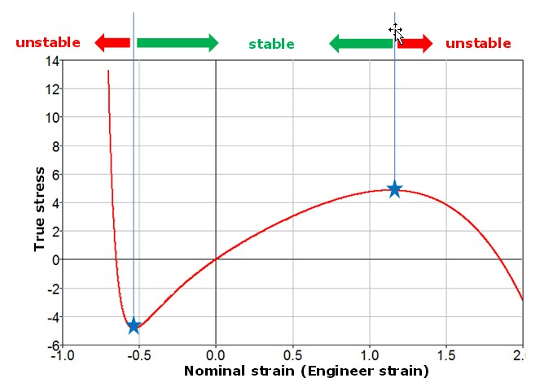

*Figure 141:*

The Drücker stability criterion calculates the strain range where the
material model will remain stable given a set of material parameters.
This stability check cannot be made for every deformation but instead
is commonly used to check material stability under uniaxial, biaxial
and planar strain loading.

For example, using the following Ogden parameters:

:math:`\mu_{1}` = 13.99077258830  :math:`\alpha_{1}` = 3.78819292935039

:math:`\mu_{2}` = 9.13454532223 :math:`\alpha_{2}` = 7.17617341059

:math:`\mu_{3}` = 8.904655103235  :math:`\alpha_{3}` = 7.27028137148

Then the Drücker stability will be automatically checked in PRADIOSS
Starter, and results printed in Starter output file ``*0.out``. This
shows the strain at which instability can occur for the given Ogden
parameters::

 CHECK THE DRUCKER PRAGER STABILITY CONDITIONS
        -----------------------------------------------
      MATERIAL LAW = OGDEN (LAW42)
      MATERIAL NUMBER = 1
       TEST TYPE = UNIXIAL
        COMPRESSION:   UNSTABLE AT A NOMINAL STRAIN LESS THAN -0.3880000000000
        TENSION:       UNSTABLE AT A NOMINAL STRAIN LARGER THAN 0.9709999999999
       TEST TYPE = BIAXIAL
        COMPRESSION:   UNSTABLE AT A NOMINAL STRAIN LESS THAN -0.2880000000000
        TENSION:       UNSTABLE AT A NOMINAL STRAIN LARGER THAN 0.2780000000000
       TEST TYPE = PLANAR (SHEAR)
        COMPRESSION:   UNSTABLE AT A NOMINAL STRAIN LESS THAN -0.3680000000000
        TENSION:       UNSTABLE AT A NOMINAL STRAIN LARGER THAN 0.5829999999999

|image1| **Note:** For a Neo-Hookean material with :math:`C_{10}!>!0 (or \mu_{1}!>!0)`, 
the material is always stable and thus no
critical value is found by the Drucker stability check.                                               

For a Mooney-Rivlin material, the Drucker stability should be checked
since :math:`C_{01} or \mu_{2}` could be negative, which
leads material instability.

*/MAT/LAW88*
~~~~~~

This law utilizes a tabulated uniaxial tension and compression
engineering stress and strain test data at different strain rates to
model incompressible materials. It is only compatible with solid
elements.

The material is based on the following Ogden’s strain energy density
function but does not require curve fitting to extract material
constants like most other hyperelastic material models. :sup:`8`

.. math:: W=\sum_{i=1}^{3}\sum_{j=1}^{m}\frac{\mu_{j}}{\alpha_{j}}\Big{(}\lambda_{i}\alpha_{j}-1\Big{)}+{K(J-1-ln J)}   \tag{91}

Instead, this law determines the Ogden function directly from the
uniaxial engineering stress strain curve tabulated data.

Unlike other Ogden material laws, the Bulk Modulus must be input from
either test data or extracted from Starter output of the LAW69 Ogden
curve fit. When comparing results between LAW42 or LAW69 to LAW88,
the same bulk modulus must be used.

Unloading Behavior
~~~~~~~~~~

Unloading can be represented using an unloading function or by
providing hysteresis and shape factor inputs to a damage model based
on energy.

If using the damage model, the loading curves are used for both
loading and unloading and the unloading stress tensor is reduced by:

.. math:: \sigma=\big{(}1-D\big{)}\sigma  \tag{92}

with

.. math:: D=\big{(}1-Hys)\bigg{(}1-\bigg{(}\frac{W_{cur}}{W_{\max}}\bigg{)}^{Shape}\bigg{)}   \tag{93}

Where,

:math:`W_{cur}` Current energy

:math:`W\_{\max}`    Maximum energy corresponding to the quasi-static behavior

Hys **and** *Shape*   Input by user

If an unloading curve is provided, these options are available:

**Tension** **Loading and Unloading**

**= 0**

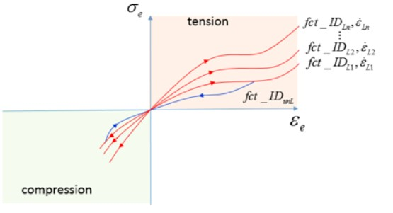

*Figure 142:*

Loading use loading function *fct_ID*\ :sup:`Li`

Unloading use unloading function *fct_ID*\ :sup:`unL`

**= 1**

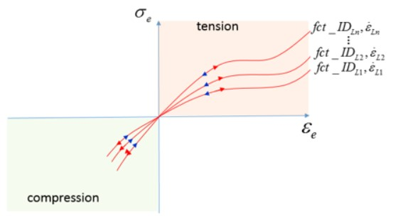

*Figure 143:*

Loading and unloading all use loading function *fct_ID*\ :sup:`Li`

**= -1**

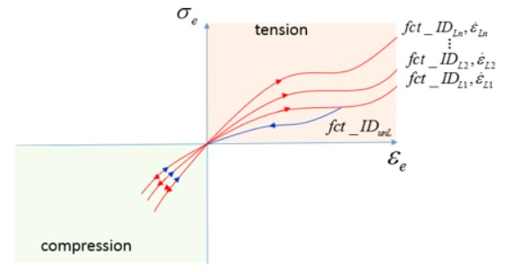

*Figure 144:*

Loading use loading function *fct_ID*\ :sup:`Li`

   • Tension

Unloading use unloading function *fct_ID*\ :sup:`unL`

   • Compression

Unloading use loading *fct_ID*\ :sup:`Li`

Viscous (Rate Effects
~~~~~~~~~~

Strain rate effects can be modeled by including engineering stress
strain test data at different strain rates. This can be easier than
calculating viscous parameters for traditional hyperelastic material
models.

*Conclusion*
~~~~~~~~~~~~

Make sure to use the material law that best fits the test data
available.

For example, if minimal test data is available and the strains are
not too large than the LAW42 NeoHookean Model could be used. If the
loading state is known, then it is important to have test data that
represents that stress state and make sure the material model fits
that test data.

5. Ogden, R. W., and Non-linear Elastic Deformations. "Ellis Horwood." New York (1984)

6. Miller, Kurt. "Testing Elastomers for Hyperelastic Material Models in Finite Element Analysis" Axel Products, Inc., Ann Arbor, MI (2017). Last modified April 5, 2017

Arruda-Boyce (/MAT/LAW92)
------------

LAW92 describes the Arruda-Boyce material model, which can be used to
model hyperelastic behavior. This model is based on the statistical
mechanics of a material with a cubic representative volume element
containing eight chains along the diagonal directions.

It assumes that the chain molecules are located on the average along
the diagonals of the cubic in principal stretch space.

Material Parameters
~~~~~~~~~~~

The strain energy density function is:

.. math:: W=\mu\sum_{l=1}^{5}\frac{c_{i}}{(\lambda_{m})^{2i-2}}({l_{1}^{i}}-3^{i})+\frac{1}{D}\big{(}\frac{J^{2}-1}{2}+\ln(J)\big{)}  \tag{94}

The material constant, :math:`c_{i}` are:

:math:`c_{1}=\frac{1}{2}, c_{2}=\frac{1}{20}, c_{3}=\frac{11}{1050}, c_{4}=\frac{19}{7000}, c_{5}=\frac{519}{673750}`

:math:`\overline{I_{1}}=\overline{\lambda_{1}^2}+\overline{\lambda_{2}^2}+\overline{\lambda_{3}^2}`   First strain invariant

:math:`\lambda_{i}`  :math:`i_{th}` principal engineering stretch

A material with LAW92 can be defined in two different ways:

   • Parameter Input

      Shear modulus, bulk modulus and strain stretch (:math:`\mu,D,\lambda_{m})`

      Where, only the above 3 parameters with clear physical meaning are
      necessary to define the material.

      :math:`\mu` is shear modulus at zero strain.

.. math:: D=\frac{2}{K} \tag{95}

Where,

:math:`K`  Bulk coefficient at zero strain 

:math:`\lambda_{m}` Defines the limit of stretch

7. Axel Products, Inc. "Compression or Biaxial Extension", Ann Arbor, MI (2017). Last modified November 12, 2008

8. Kolling, S., P. A. Du Bois, D. J. Benson, and W. W. Feng. "A tabulated formulation of hyperelasticity with rate effects and damage." Computational Mechanics 40, no. 5 (2007): 885-899

            Also called *locking stretch*. It specifies the beginning of the
            hardening phase in tension (locking strain in tension). Default = 7.0.

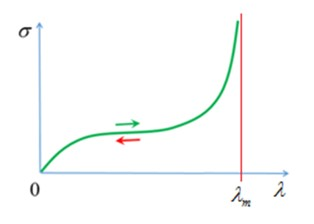

*Figure 145:locking Stretch* :math:`\lambda_{m}`

In parametric input, Poisson’s ratio is computed as:

.. math:: v=\frac{3K-2\mu}{6K+2\mu}   \tag{96}

• When using function input, Poisson ratio and *Itype* must be defined. *Itype* defines which type of engineering stress strain test data that is being used as input.

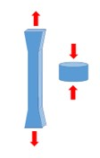

*Figure 146: Itype = 1: Uniaxial data test*

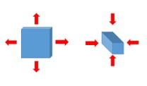

*Figure 147: Itype = 2: Equibiaxial data test*

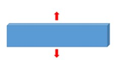

*Figure 148: Itype = 3: Planar data test*

Poisson's Ratio and Material Incompressibility
~~~~~~~~~~~~~~~~

If function input is defined, then parameters :math:`\mu,D,\lambda_{m}` are ignored and PRADIOSS
will calculate the material constant by fitting the input function. A
nonlinear least squares algorithm is used to fit the ArrudaBoyce
parameters by PRADIOSS. The curve fitting is performed using the
assumption that Poisson’s value is close to 0.5, which means the
material is incompressible. Similar to the other hyperelastic
material models, Poisson ratio values closer to 0.5 result in high
bulk modulus and a lower timestep. For a good balance between
incompressibility and a reasonable timestep, a Poisson’s ratio value
of 0.495 is recommended.

The material fitting information can be found in the Starter output
file (``*0000.out``).

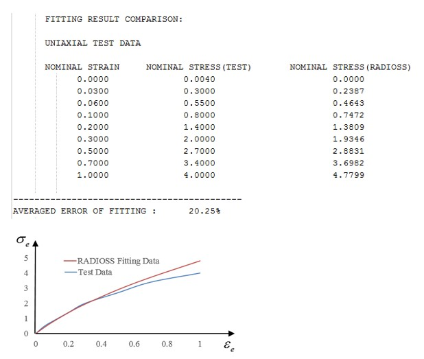

*Figure 149: LAW92 function example*

The fitting error and fitted material parameters are printed in the
Starter output file.

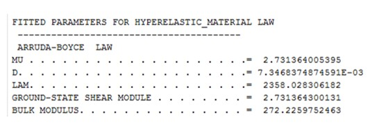

*Figure 150:*

Viscous (Rate Effects
~~~~~~~~~~~~

``/VISC/PRONY`` must be used with LAW92 to include viscous effects.

Yeoh (/MAT/LAW94)
-------------

LAW94 is a hyperelastic material model that can be used to describe
incompressible materials.

The strain energy density function of LAW94 only depends on the first
strain invariant and is computed as:

.. math:: W=\sum_{i=1}^3\left[C_{i0}(I_{i}-3)^i+\frac{1}{D_{i}}(J-1)^2i\right]     \tag{97}

Where,

:math:`\overline{I_{1}}=\overline{\lambda_{1}^2}+\overline{\lambda_{2}^2}+\overline{\lambda_{3}^2}`   First strain invariant

:math:`\overline{\lambda_{i}}=J^{-\frac{1}{3}}\lambda_{i}`  Deviatoric stretch  

The Cauchy stress is:

.. math:: \sigma_{i}=\frac{\lambda_{i}}{J}\frac{\partial W}{\partial\lambda_{i}}

Material Parameters
~~~~~~~~~~~~~

For incompressible materials with =1 only and are input and the Yeoh
model is reduced to a NeoHookean model.

9. Arruda, E. M. and Boyce, M. C., 1993, “A three-dimensional model for the large stretch behavior of rubber elastic materials”, J. Mech. Phys. Solids, 41(2), pp. 389–412

:math:`C_{10}C_{20}C_{30}`   Material constants specify the deviatoric part (shape change) of the material

:math:`D_{1,}D_{2,}D_{3}`  Parameters specify the volumetric change of the material

These six material constants need to be calculated by curve fitting
material test data. RD-E: 5600

Hyperelastic Material with Curve Input includes a Yeoh fitting
Compose script for uniaxial test data. The Yeoh material model has
been shown to model all deformation models, even if the curve fit was
obtained using only uniaxial test data.

The initial shear modulus and the bulk modulus are:

.. math:: \mu=2\cdot C_{10}    \tag{99}

and

.. math:: K=\frac{2}{D_{1}}   \tag{100}

Poisson's Ratio and Material Incompressibility
~~~~~~~~~~~~~~~~~~~~~

LAW94 is available only as an incompressible material model.

If = *D*\ :sub:`1` 0, an incompressible material is considered where, *v* = 0.495 *D*\ :sub:`1` is calculated
as:

.. math:: D_{1}=\frac{3(1-2\nu)}{\mu(1+\nu)}   \tag{101}

Bergstrom-Boyce (/MAT/LAW95)
---------------------

This law is a constitutive model for predicting the nonlinear time
dependency of elastomer like materials. It uses a polynomial material
model for the hyperelastic material response and the Bergstrom-Boyce
material model to represent the nonlinear viscoelastic time dependent
material response.

This law is only compatible with solid elements.

The response of the material can be represented using two parallel
networks A and B. Network A is the equilibrium network with a
nonlinear hyperelastic component. In Network B, a nonlinear
hyperelastic component is in series with a nonlinear viscoelastic
flow element, and hence, is time-dependent network.

10.  Yeoh, O. H. "Some forms of the strain energy function for rubber." Rubber Chemistry and technology 66, no. 5 (1993): 754-771

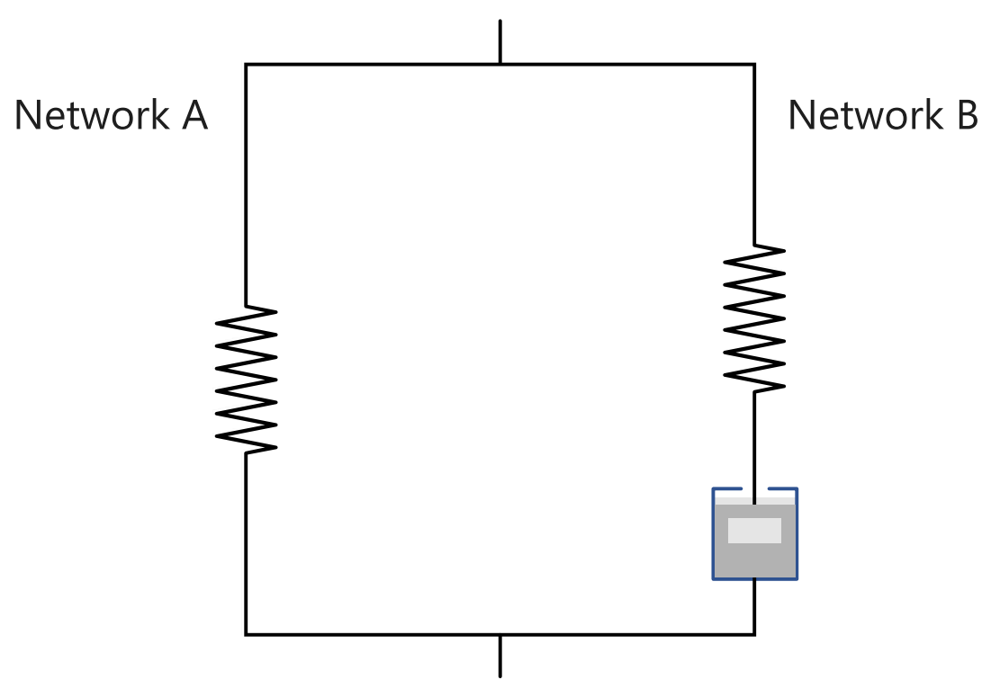

*Figure 151:*

Material Parameters
~~~~~~~~~~~~~~~~

The same polynomial strain energy density formulation is used for the
hyperelastic components in both networks. In Network B, it is scaled
by a factor *S*\ :sub:`b`. The strain energy density is then written for the
hyperelastic component of the network.

.. math:: W_{A}=\sum_{i+j=1}^{3}C_{ij}\big{(}I_{1}-3\big{)}^i\cdot\big{(}I_{2}-3\big{)}^J+\sum_{i=1}^{3}\frac{1}{D_{i}}(J-1)^2i    \tag{102}
   
and

.. math:: W_{B}=S_{b}\cdot W_{A}   \tag{103}

Where, 

:math:`\overline{I_{1}}=\overline{\lambda_{1}^2}+\overline{\lambda_{2}^2}+\overline{\lambda_{3}^2}`

:math:`\overline{I_{2}}=\overline{\lambda_{1}^{-2}}+\overline{\lambda_{2}^{-2}}+\overline{\lambda_{3}^{-2}}`

:math:`\overline{\lambda_{i}}=J^{-\frac{1}{3}}\lambda_{i}`

:math:`C_{ij}` **and** :math:`D_{i}`  Material Parameters 

The hyperelastic component the Cauchy stress is computed as:

.. math:: \sigma_{i}=\frac{\dot{\lambda}_{i}}{J}\frac{\partial W}{\partial\dot{\lambda}_{i}}   \tag{104}

The total stress is the summer of stress in network A and network B.

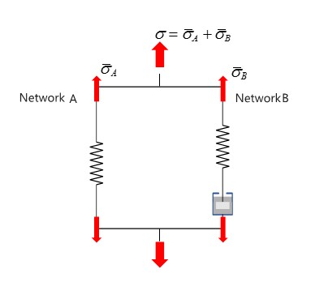

*Figure 152:*

:math:`\overline{\sigma}=\overline{\sigma_{A}}+\overline{\sigma_{B}}`

Since :math:`W_{B}=S_{b}\cdot W_{A}`, then :math:`\overline{\sigma}_{B}=S_{b}\cdot\overline{\sigma}_{A}` and total stress is :math:`\sigma=(1+S_{b})\cdot\overline{\sigma}_{A}`

For example, in one tensile test. If use *S*\ :sub:`b`, then the stress is 3 times
of the one without considering viscous (which means only considered
hyperelastic).

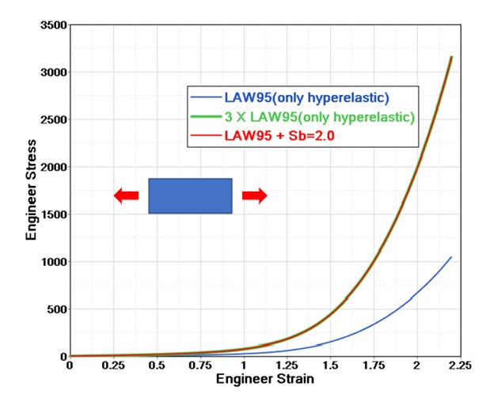

*Figure 153:*

For special values of , the polynomial model can be reduced to the
following material models.

   • Yeoh:

   *J*=0

   Where, :math:`C_{10,}C_{20,}C_{30,}` are not zero.

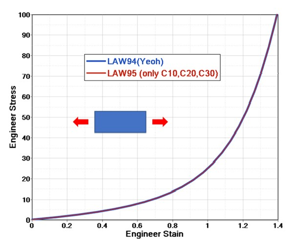

*Figure 154:*

   • Mooney-Rivlin:

:math:`i+j=1`

Where, :math:`C_{10}` and :math:`C_{01}` are not zero and :math:`D_{2}=D_{3}=0.`

   • Neo-Hookean:

Only :math:`C_{10}` and :math:`D_{1}` are not zero.

Where,

:math:`C_{ij}` **and** :math:`D_{i}`  Material parameters which can be calculated by completing a curve fit for quasi-static material test data.

RD-E: 5600 Hyperelastic Material with Curve Input, contains a curve
fit example for Mooney-Rivlin and Yeoh material models. can be
calculated from the bulk modulus or left blank.

The initial shear modulus and the bulk modulus are computed as:

.. math:: \mu=2\big{(}S_{b}+1\big{)}\big{(}C_{10}+C_{01}\big{)}   \tag{105}

and

.. math:: K=\frac{2}{D_{1}}\big{(}1+S_{b}\big{)}   \tag{106}

If the bulk modulus of the material is known, *D*\ :sub:`1` can be calculated, or
if *D*\ :sub:`1` =0, an incompressible material is assumed.

Viscous (Rate) Effects
~~~~~~~~~~~~~~

The effective creep strain rate in Network B is given by:

.. math:: \dot{\varepsilon}_{B}^{\nu}=A(\overline{\dot{\lambda}}-1+\dot{\varepsilon}g)^{C}\frac{\overline{\sigma}_{B}}{\tau_{ref}}^{M}  \tag{107}

Where,

:math:`\overline{\dot{\lambda}}=\sqrt{\frac{T_{1}}{3}}`

:math:`\overline{\sigma}_{B}` Effective stress in Network B.

:math:`A, \bar{\varepsilon}, M, C` **, and** :math:`\tau_{ref}` Input material parameters.

The material constants A, M and C are limited to a specific range
of real values as defined in the *Reference Guide*. If limited data is
available, a trial and error method\ :sup:`11` could be used to determine
these constants. Start with the default values of
:math:`\bar{\xi}, M, C, S_{b}` =1.6; and
*A*\ =5. Next, compare model predictions with experimental data for at
least one strain rate and adjust A to get a fit for the strain rate
data.

11.  Bergström, J. S., and M. C. Boyce. "Constitutive modeling of the large strain time-dependent behavior of elastomers." Journal of the Mechanics and Physics of Solids 46, no. 5 (1998): 931-954

Elasto-plastic Materials
------------------

Johnson-Cook (/MAT/LAW2)
------------------------

In LAW2 there are three parts to the stress calculation.

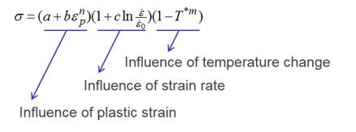

*Figure 155:*

-  Influence of plastic strain

-  Influence of strain rate

-  Influence of temperature change

Material Parameters
~~~~~~~~~~~~~~~~~~~

There are two ways to input material parameter for LAW2.

-  *Iflag*\ =0: Classic input for Johnson-Cook parameter a, b, n is active

-  *Iflag*\ =1: New, simplified input with yield stress, UTS (engineering stress), or strain at UTS *Iflag= 0*

.. math:: \sigma=a+b\cdot\varepsilon_{pn}   \tag{108}

Where,

       :*a*: The yield stress which could be read from material test and converted to true stress.

       :*b* **and** *n*: The material parameters. Fitting the material stress-strain curve (for example, Laduga Compose script) can result in these two parameter.

       :**Iflag = 1**: With this new input, you will need yield stress Ultimate tensile engineer stress (UTS) and engineer strain at necking point. With this new input, PRADIOSS automatically calculates the equivalent value for a, b and n.  

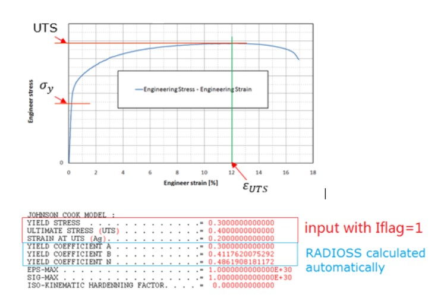

*Figure 156: Tension Test*

Strain Rate
~~~~~~~~~~~

Strain rate has a major effect of material character on
crash performance in tensile or in fracture. In Johnson-Cook theory,
the yield stress is affected directly by the strain rate and is
described as:

.. math:: \sigma=\left(a+b\cdot\varepsilon_{p\eta}\right)\left(1+c\ln\frac{\xi}{\xi_{0}}\right)   \tag{109}

Generally, yield stress increases with increasing the test strain rate.
With the strain rate coefficient, c, you can scale the factor of yield
stress increase. No effect of strain rate could also be defined, if
*c* =0; or with :math:`\xi_{0}=10^{30} or \xi\leq\xi_{0}).`

.. image:: vertopal_75794439f47d439ba01f734ac3f4dcc1/media/image27.jpg
      :width: 2.9836in
      :height: 3.0836in

*Figure 157:*

Temperature Change
~~~~~~~~~~~~~~~~~~

Yield stress decreases with increasing temperature. In LAW2 influence is
considered with :math:`\left(1-T^{\*m}\right).`

.. math:: \sigma=\left(a+b\cdot\varepsilon_{p}n\right)\left(1+c\ln\frac{\dot{\varepsilon}}{\dot{\varepsilon}_{0}}\right)\left(1-T^{\*m}\right)   \tag{110}

with

.. math:: T^{\*}=\frac{T-T_{r}}{T_{melt}-T_{r}}   \tag{111}

Where,

:math:`T_{melt}` Melt temperature in unit Kelvin.

:math:`T_{r}` Room temperature in unit Kelvin.

With *T* computed as:

.. math:: T=T_{i}+\frac{E_{int}}{\rho C_{p}\left(Volume\right)}    \tag{112}

Where,

:math:`E_{int}` Internal energy.

Change of internal energy will affect the yield stress in Johnson-Cook
law.

Hardening Coefficient
~~~~~~~~~~~~~~~~~~~~~

Metal deformed up to yield and then generally hardened (yield stress
increased). Different materials show different ways of hardening
(isotropic hardening, kinematic hardening, etc.). This is also a very
important material character (for spring-back).

In LAW2, use option :math:`C_{hard}` (hardening coefficient) to describe
which hardening model is used for the material. This feature is also
available in material LAW36, 43, 44, 57, 60, 66, 73 and 74.

The value of :math:`C_{hard}` is from 1 to 0. :math:`C_{hard}` =0 for isotropic
model, :math:`C_{hard}` =1 for kinematic Prager-Ziegler model, or between 1
and 0 for hardening between the above two models.

:math:`C_{hard}` = 0: Isotropic Model

      In a one dimension case, material strengthens after yield stress. The
      maximum stress of the last tension is the yield in the subsequent
      loading, and this new yield stress is the same in subsequent tension and
      compression.

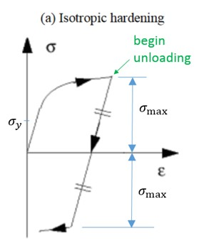

*Figure 158:*

:math:`C_{hard}` = *1: Kinematic Prager-Ziegler Model*

      To model the Bauschinger effect (after hardening in tension, there is
      softening in a subsequent compression which mean yield in compression
      is decreased), use kinematic hardening.

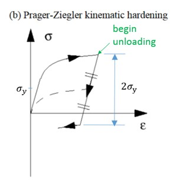

*Figure 159:*

Elastic Plastic Piecewise Linear Material (/MAT/LAW36)
-------------------------------

In LAW36, the numbers of plastic stress-strain curves can be directly
defined for different strain rates.

Plastic stress-strain of high strain rate should always be above the
lower plastic stress-stain curve.

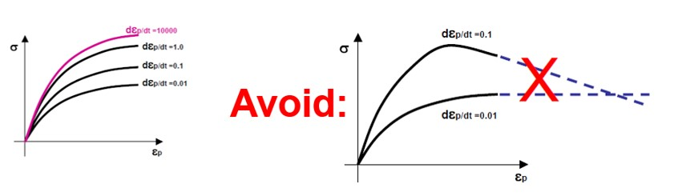

*Figure 160:*

Young's Modulus
~~~~~~~~~~~~~~~

Young's modulus can be updated (decreased) in unloading with options
*fct_ID*\ :sub:`E`, *E*\ :sub:`inf` and *C*\ :sub:`E`. Using this feature improves the
accuracy of spring-back (in unloading phase) for high strength steel.
This feature is also available in material LAW43, LAW57, LAW60, LAW74
and LAW78.

   • Use *fct_ID*\ :sub:`E` to update the Young's modulus (*fct_ID*\ :sub:`E` ≠ 0):

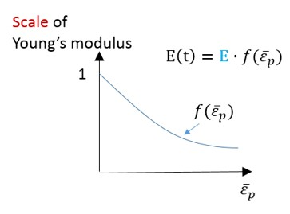

*Figure 161:*

   • Use *E*\ :sub:`inf` and *C\ E* to update the Young's modulus (*fct_ID*\ :sub:`E` = 0):

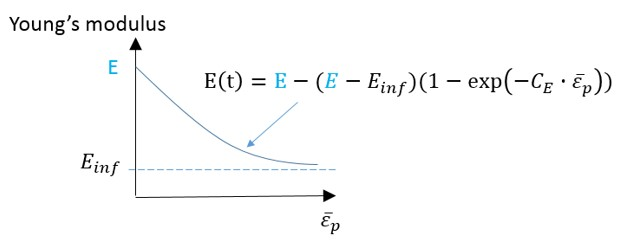

*Figure 162:*

Material Behavior
~~~~~~~~~~~~~~~~~

*fct_ID*\ :sub:`p` is used to distinguish the behavior in tension and
compression for certain materials (pressure dependent yield). The
effective yield stress is then obtained by multiplying the nominal
yield stress by the yield factor corresponding to the actual
pressure.

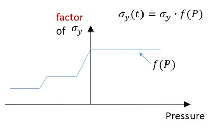

*Figure 163:*

| *See Also*
| /MAT/LAW2 (PLAS_JOHNS) (Starter)
| RD-E: 1101 Elasto-plastic Material Law Characterization

HILL Materials
--------------

In PRADIOSS material laws LAW32, LAW43, LAW72, LAW73, LAW74, LAW78 and
LAW93 use HILL criteria.

HILL Criteria
~~~~~~~~~~~~~

The typical HILL criteria is:

• 3D equivalent HILL stress:

.. math:: f=\sqrt{F\big{(}\sigma_{yy}-\sigma_{zz}\big{)}^{2}+G\big{(}\sigma_{zz}-\sigma_{xx}\big{)}^{2}+H\big{(}\sigma_{xx}-\sigma_{yy}\big{)}^{2}+2L\sigma_{yz}^{2}+2M\sigma_{xx}^{2}+2N\sigma_{xy}^{2}}  \tag{113}    
      
.. math:: =\sqrt{(G+H)\sigma_{xx}^{2}+(F+H)\sigma_{yy}^{2}+(F+G)\sigma_{zz}^{2}-2H\sigma_{xx}\sigma_{yy}-2F\sigma_{yy}\sigma_{zz}-2G\sigma_{zz}\sigma_{xx}+2L\sigma_{yz}^{2}+2M\sigma_{xx}^{2}+2N\sigma_{xy}^{2}} 

• Shell element:

.. math:: f=\sqrt{F\sigma_{yy}^{2}+G\sigma_{xx}^{2}+H\big{(}\sigma_{xx}-\sigma_{yy}\big{)}^{2}+2N\sigma_{xy}^{2}}=\sqrt{(G+H)\sigma_{xx}^{2}+(F+H)\sigma_{yy}^{2}-2H\sigma_{xx}\sigma_{yy}+2N\sigma_{xy}^{2}}   \tag{114}

Where, F, G, H, L, M and N are six HILL anisotropic
parameters. For shell elements, only F, G, H and N are the
four HILL parameters needed. 

In LAW78, the HILL criteria is:

.. math:: \varphi(A)=\frac{1}{G+H}\cdot A_{xx}^{2}-\frac{2r_{0}}{\frac{1+r_{0}}{2H}}A_{xx}A_{yy}+\frac{r_{0}(1+r_{90})}{\frac{r_{90}(1+r_{0})}{F+H}}A_{yy}^{2}+\frac{r_{0}+r_{90}}{\frac{r_{90}(1+r_{0})}{2N}}A_{xy}^{2}   \tag{115}

There are two ways to determine HILL parameters by using Lankford parameters.

◦ Strain ratio :math:`r_{00}, r_{45}, r_{90}` (LAW32, LAW43, LAW72, LAW73)

◦ Yield stress ratio :math:`R_{1}, R_{22}, R_{33}, R_{12}, R_{13}, R_{23}` (LAW74, LAW93)

Strain Ratio
~~~~~~~~~~~~

The Lankford parameters :math:`r_{\alpha}` is the ratio of
plastic strain in plane and plastic strain in thickness direction
:math:`\varepsilon_{33}`.

.. math:: r_{\alpha}=\frac{d\varepsilon_{\alpha\neq 2}}{d\varepsilon_{33}}    \tag{116}

Where, :math:`\alpha` is the angle to the orthotropic direction 1.

:math:`r_{\alpha}` could be measured with different samples
which cut in different angle with orthotropic direction 1. Like
:math:`r_{00}` measured from tensile test in which the loading direction is
along the orthotropic direction 1. :math:`r_{90}` measured from tensile test
in which the loading is perpendicular to orthotropic direction 1.

The strain ratio is the strain in width direction of sample to strain in
thickness direction of sample.

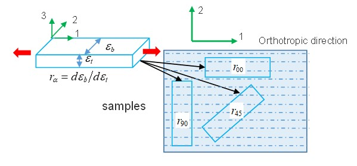

*Figure 164:*

In this case, the HILL parameters are:

.. math:: F=\frac{r_{00}}{r_{90}(r_{00}+1)}   \tag{117}

.. math:: G=\frac{1}{(r_{00}+1)}  \tag{118}
   
.. math:: H=\frac{r_{00}}{(r_{00}+1)} \tag{119}
   
.. math:: N=\frac{(1+2r_{45})(r_{00}+r_{90})}{2r_{90}(r_{00}+1)}   \tag{120}

Here, *G+H*=1.

In LAW32, LAW43, and LAW73, the HILL criteria is:

.. math:: \sigma_{eq}=\sqrt{A_{1}\sigma_{1}^{2}+A_{2}\sigma_{2}^{2}-A_{3}\sigma_{1}\sigma_{2}+A_{1}\sigma_{12}^{2}}   \tag{121}

:math:`R=\frac{r_{00}+2r_{4.5}+r_{90}}{4}`  :math:`H=\frac{R}{1+R}` 

:math:`A _{1}=H\Big{(}1+\frac{1}{r_{00}}\Big{)}`    :math:`A_{2}=H\Big{(}1+\frac{1}{r_{90}}\Big{)}`

:math:`A_{3}=2H`           :math:`A_{12}=2H(r_{4.5}+0.5)\Big{(}\frac{1}{r_{00}}+\frac{1}{r_{90}}\Big{)}`

They all request Lankford parameter (strain ratio) :math:`r_{00}, r_{4.5}, r_{90}``
and the HILL parameter :math:`A_{i}` is automatically
computed by PRADIOSS.

Yield Stress Ratio
~~~~~~~~~~~~~~~~~~

In LAW93, the yield stress ratio used is:

.. math:: R_{ij}=\frac{\sigma_{ij}}{\sigma_{0}}   \tag{122}

To get yield stress ratio :math:`R_{ij}`, yield stress in two loading cases need to be
measured.

-  Yield stress :math:`\sigma_{11,}\sigma_{22,}\sigma_{33}` from tensile test

-  Yield shear stress :math:`\sigma_{12,}\sigma_{13,}\sigma_{23}` from shear test

In LAW93, if parameter input is used, then take initial stress parameter
:math:`\sigma_{y}` as reference yield stress
:math:`\sigma_{0}`. If curve input is used, then take the yield
stress from curve as reference yield stress :math:`\sigma_{0}`.

Four HILL parameters for shell are automatically computed by PRADIOSS.

.. math:: F=\frac{1}{2}(\frac{1}{R_{22}^{2}}+\frac{1}{R_{33}^{2}}\frac{1}{R_{11}^{2}})  \tag{123}

.. math:: H=\frac{1}{2}(\frac{1}{R_{22}^{2}}+\frac{1}{R_{11}^{2}}-\frac{1}{R_{33}^{2}})   \tag{124}

.. math:: \tag{125}

.. math:: N=\frac{3}{2R_{12}^{2}}   \tag{126}

In LAW74, yield stress ratio :math:`R_{ij}` is used with yield stress
:math:`\sigma_{11,}\sigma_{22,}\sigma_{33,}` and :math:`\sigma_{12,}\sigma_{13}\sigma_{23}`
input directly, and then six HILL parameters for solid are automatically
computed by PRADIOSS.

:math:`F=\frac{1}{2}\Bigg{(}\frac{1}{\sigma_{22}^{2}}+\frac{1}{\sigma_{33}^{2}}-\frac{1}{\sigma_{11}^{2}}\Bigg{)}`    
:math:`G=\frac{1}{2}\Bigg{(}\frac{1}{\sigma_{22}^{2}}+\frac{1}{\sigma_{33}^{2}}-\frac{1}{\sigma_{11}^{2}}\Bigg{)}`

:math:`H=\frac{1}{2}\Bigg{(}\frac{1}{\sigma_{22}^{2}}+\frac{1}{\sigma_{33}^{2}}-\frac{1}{\sigma_{11}^{2}}\Bigg{)}`
:math:`L=\frac{1}{2\sigma_{23}^{2}}`

:math:`M=\frac{1}{2\sigma_{31}^{2}}`
:math:`N=\frac{1}{2\sigma_{12}^{2}}`

For shell element, take *M=N* and *L=N*.

Concrete and Rock Materials
---------------

In PRADIOSS these materials can be used to represent rock or concrete
materials.

These materials use a Drücker–Prager yield criterion\ :sup:`12`,
which is a pressure-dependent model for determining whether a
material has failed or undergone plastic yielding.

Concrete Material (/MAT/LAW10 and /MAT/LAW21)
--------------------

Drücker-Prager Yield Criteria
~~~~~~~~~~~~~~~~~~~~~~~~~~~~~

The material has failed or undergone plastic yielding is determined
by pressure using:

.. math:: F=\frac{J_{2}}{J_{2}part}-\frac{(A_{0}+A_{1}P+A_{2}P^{2})}{I_{1}part}    \tag{127}

Where,

:math:`J_{2}` Second stress invariant (von Mises stress) of the deviatoric
part of the stress and :math:`P=-\frac{I_{1}}{3}`.

:math:`I_{1}` First stress invariant (hydrostatic pressure).

:math:`I_{1}=\sigma_{1}+\sigma_{2}+\sigma_{3}=-3P`

:math:`J_{2}=\frac{1}{6}\bigg{[}\big{(}\sigma_{1}-\sigma_{2}\big{)}^{2}+\big{(}\sigma_{2}-\sigma_{3}\big{)}^{2}+\big{(}\sigma_{3}-\sigma_{1}\big{)}^{2}\bigg{]}=\frac{1}{3}{\sigma_{VM}2}`
in a uniaxial test.

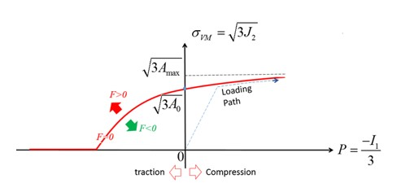

*Figure 165: Drücker-Prager Yield Criteria*

A polynomial equation is used to describe the pressure
:math:`A_{0}+A_{1}P+A_{2}P^{2}` at the Drucker-Prager yield surface of the
material:

.. math:: \sigma_{VM}=\sqrt{3\big{(}A_{0}+A_{1}P+A_{2}P^{2}\big{)}}   \tag{128}

The constants of the polynomial :math:`A_{0}, A_{1}, A_{2}` are
determined by:

-  If :math:`F<0, J_{2}<A_{0}+A_{1}P+A_{2}P^{2}` the material is under yield surface and is in the elastic region.

-  If :math:`F=0, J_{2}=A_{0}+A_{1}P+A_{2}P^{2}` and the material is at the yield surface.

-  If :math:`F>0, J_{2}>A_{0}+A_{1}P+A_{2}P^{2}` and the material is past the yield surface and has failed.

-  If :math:`A_{1}=A_{2}=0,\sigma_{VM}=\sqrt{3J_{2}}=\sqrt{3A_{0}}`, which is the von Mises criterion.

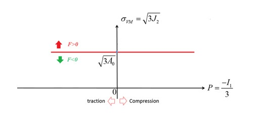

*Figure 166:*

Pressure Computation
~~~~~~~~~~~~~~~~~~~~

In LAW10, a polynomial equation with input parameters
:math:`C_{0}C_{1}C_{2}C_{3}`
is used to describe the pressure. The pressure can be plotted as a
function of volumetric strain.

.. math:: \mu=\frac{\rho}{\rho_{0}}-1   \tag{129}

-  If :math:`P_{ext}=0`, the pressure is :math:`P=\Delta P` and the pressure limit is :math:`P_{\min}=\Delta P_{\min}`.

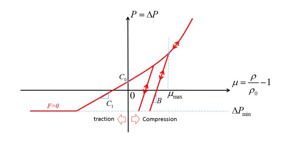

*Figure 167: Pressure curve without external pressure*

-  If :math:`P_{ext}\neq 0`, the pressure is shifted by :math:`P_{ext}, then P=P_{ext}+\Delta P` and the pressure limit is :math:`P_{\min}=P_{ext}+\Delta P_{\min}`.

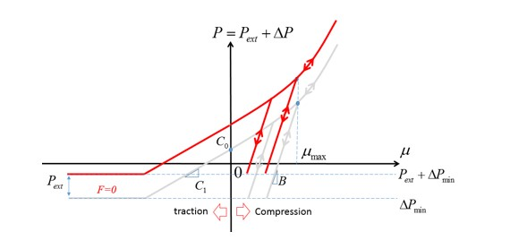

*Figure 168: Pressure curve with external pressure*

Here,

.. math:: \Delta P=\left \{ \begin{matrix}\max\{\Delta P_{\min}\ C_{0}+C_{1}\mu+C_{2}\mu^{2}+C_{3}\mu^{3}\}if&\mu\geq 0compression \\ \max\{\Delta P_{\min}C_{0}+C_{1}\mu\}&if&\mu<0traction\end{matrix}\right|

-  In traction or tension the pressure is linear and limited by :math:`\Delta P_{\min}`.

-  In compression the pressure is nonlinear also limited by :math:`\Delta P_{\min}`.

The only difference between the material laws is that in LAW10 the
material constants :math:`C_{0} C_{0} C_{2} C_{3}` are used to describe
the pressure versus volumetric strain (:math:`P-\mu` curve). In
LAW21 you can describe this curve via function input *fct_IDr*.

Load and Unload
~~~~~~~~~~~~~~~

In LAW10 and LAW21 different loading and unloading paths of the
:math:`P-\mu` curve can be considered by using the parameters
:math:`\mu_{\max}` and B.

-  In Tension (:math:`\mu<0)`

   -  For LAW10, linear loading and unloading with :math:`P=C_{1}\mu` (Figure 167).

   -  For LAW21, loading is defined using the input function *fct_IDr* and linear unloading with :math:`P=K_{1}\mu`.

-  In Compression :math:`\mu > 0`, for both LAW10 and LAW21:

   -  If neither B and :math:`\mu_{\max}` are defined, the loading and unloading path are identical.

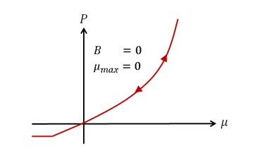

*Figure 169: Identical loading and unloading for LAW10 and LAW21*

   -  If either B or :math:`\mu_{\max}` is defined:
  
      1. If only B is defined, :math:`\mu_{\max}` is the volumetric strain where the tangent of :math:`P-\mu`  curve is equal to B with :math:`B=\frac{dP}{d\mu}\Big{|}_{\mu_{\max}}`.

      2. If only :math:`\mu_{\max}` is defined, then B is the tangent of :math:`P-\mu` curve at :math:`\mu_{\max}`. The loading and unloading in compression is: 
   
         - If :math:`\mu>\mu_{\max}`, loading and unloading path are identical.

         - If :math:`\mu<\mu_{\max}`, loading and unloading path are different, it is linear unloading with slope B.

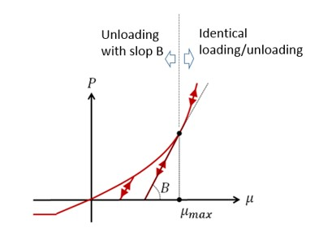

*Figure 170: Different loading and unloading treatment for LAW10 and LAW21*

Concrete Material (/MAT/LAW24)
------------------------------

LAW24 uses a Drücker-Prager criteria with or without a cap in yield
to model a reinforced concrete material. This material law assumes
that the two failure mechanisms of the concrete material are tensile
cracking and compressive crushing.

Concrete Tensile Behavior
~~~~~~~~~~~~~~~~~~~~~~~~~

In LAW24, the options :math:`H_{t}, D_{sup}`, and
:math:`\varepsilon_{\max}` can be used to
describe tensile cracking and failure in tension.

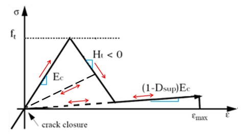

*Figure 171: LAW24 tensile loading*

In the initial very small elastic phase, the material has an elastic
modulus :math:`E_{c}`.

Once tensile strength, :math:`f_{t}` is reached, the concrete starts to
soften with the slope :math:`H_{t}`. The maximum damage factor, :math:`D_{sup}`,
is significant because it enables the modeling of residual stiffness
during and after a crack.

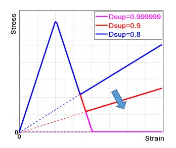

*Figure 172: Maximum Damage Factor Effects*

The residual stiffness is computed as:

.. math:: E=\left(1-D_{\text{sup}}\right)\cdot E_{c}   \tag{131}

When there is crack closure, the concrete becomes elastic again, and the
damage factor (for each direction) is conserved.

The bearing capacity of concrete in tensile is much lower than in
compression. It is normally considered elastic when in tension.

It is recommended to choose a :math:`D_{sup}` value close to 1 (default is
0.99999) in order to minimize the current stiffness at the end of the
damage and consequently avoid residual stress in tension, which can
become very high if the element is highly deformed due to tension. This
will happen if the force causing the damage remains.

It is possible to adjust the :math:`D_{sup} (and H_{t})` in order to
simulate and fit the behavior of concrete reinforced by fibers. The
concrete material fails once it reaches the total failure strain
:math:`\varepsilon_{\max}`.

Concrete Yield Surface in Compression
~~~~~~~~~~~~~~~~~~~~~~~~~~~~~~~~~~~~~

For concrete, the yield surface is the beginning of the plastic
hardening zone which is between the failure surface, :math:`r_{f}`, and the
yield surface.

The yield surface is assumed to be the same as the failure surface in
the tension zone. In compression, the yield surface is a scaled down
failure surface using the factor
k(:math:`\left(\sigma_{m},k_{0}\right))`.
The yield in LAW24 for concrete is:

.. math:: f=\frac{r}{J_{2}}-\frac{\text{k}\left(\sigma_{m},k_{0}\right)\cdot r_{f}}{I_{part}}=0    \tag{132}

-  For :math:`I_{cap}` =0 or 1 (without a cap in yield) the yield curve is:

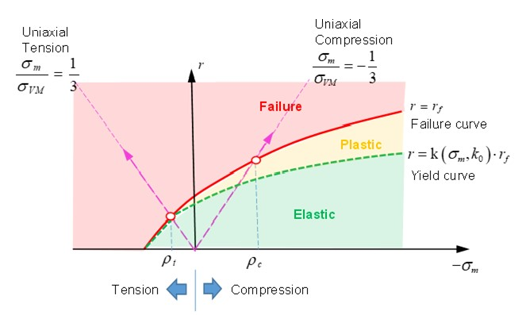

*Figure 173: Drücker-Prager Criteria without a Cap in Yield*

-  For :math:`I_{cap}` =2 (with cap in yield) the yield is:

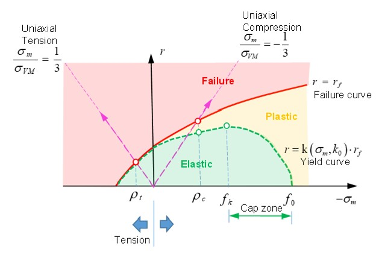

*Figure 174: Drücker-Prager Criteria with Cap in Yield*

:math:`r<k\big{(}\sigma_{m},k_{0}\big{)}\cdot r_{f}`  (green area in Figure 174)

   The material is under yield in the elastic phase.

:math:`r\geq r_{f}` (red area in Figure 174)

   The material has failed.

:math:`k\big{(}\sigma_{m},k_{0}\big{)}\cdot r_{f}<r<r_{f}`  (yellow area in Figure 174)

   The material is above yield and below the failure surface which is the plastic hardening phase.

The input parameter :math:`\rho_{t}` is the hydrostatic failure
pressure in a uniaxial tension test and :math:`\rho_{c}` is the
hydrostatic pressure by failure in a uniaxial compression test.

The scale factor
:math:`k\big{(}\sigma_{m},k_{0}\big{)}` is a function of mean stress :math:`\sigma_{m}`
and can be described as:

-  When
   :math:`\sigma_{m}\geq\rho_{t}` (in tension) the scale factor :math:`k\big{(}\sigma_{m},k_{0}\big{)}=1)`. In this case, the yield surface equals the failure surface, :math:`r=r_{f}`.

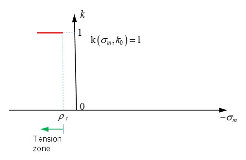

*Figure 175: k function in the tension zone*

-  In the tension-compression region, :math:`\rho_{t}>\sigma_{m}\geq\rho_{c,}` then

:math:`\mathrm{k}\big{(}\sigma_{m} k_{0}\big{)}=1+\frac{\big{(}1-k_{0}\big{)}\cdot\Big{[}\rho_{t}\big{(}2\rho_{c}-\rho_{t}\big{)}-2\rho_{c}\sigma_{m}+\sigma_{m}\Big{]}}{\big{(}\rho_{c}-\rho_{t}\big{)}^{2}} \mathrm{with} k_{y}\leq k_{0}\leq 1`

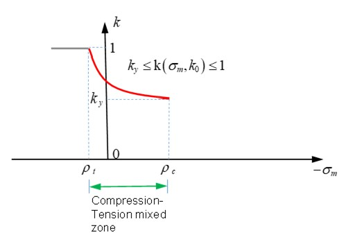

*Figure 176: k function in the Compression-Tension zone*

-  The rest of the curve depends on the :math:`I_{cap}` option and the different scale factors :math:`k\big{(}\sigma_{m},k_{0}\big{)}` used.

   ◦ For :math:`I_{cap}` =0 or 1 and :math:`\sigma_{m}<\rho_{c}` (in compression), then :math:`k\big{(}\sigma_{m},k_{0}\big{)}=k_{y}`

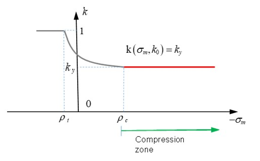

*Figure 177: K function in the compression zone*

   ◦ For :math:`I_{cap}` =2 (with cap in yield) and :math:`\rho_{c}<\sigma_{m}<f_{k}` (in compression), then :math:`k\big{(}\sigma_{m},k_{0}\big{)}=k_{y}`

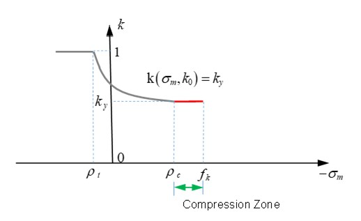

*Figure 178: K funtion in Drücker-Prager criteria without a cap*

   ◦ In :math:`f_{k}<\sigma_{m}<f_{0}` (in cap zone)

:math:`\mathrm{k}\big{(}\sigma_{m},k_{0}\big{)}=k_{0}\bigg{[}1-\bigg{(}\frac{\sigma_{m}-f_{k}}{f_{0}-f_{k}}\bigg{)}^{2}\bigg{]},\mathrm{with} 0\leq k_{0}\leq k_{y}`

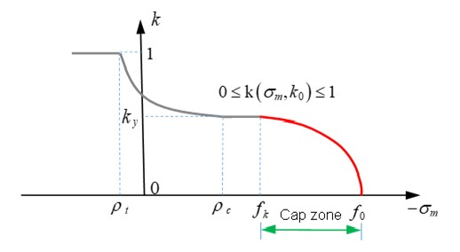

*Figure 179: K funtion in Drücker-Prager criteria without a cap*

The material constant :math:`k_{y}` should be
:math:`0\leq k_{y}\leq 1`. A higher value of
:math:`k_{y}` results in a higher yield surface. For example, if :math:`I_{cap}=2`
(yield with cap), the difference of yield surface between :math:`k_{y}=0.8`
and :math:`k_{y}=0.6` (Figure 180). The default value of :math:`k_{y}` in LAW24 is 0.5.

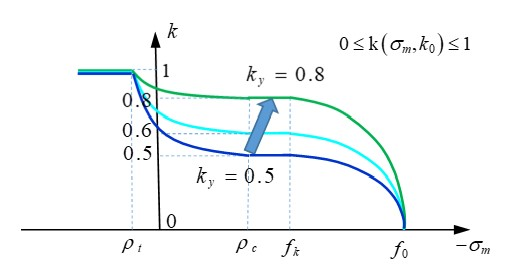

*Figure 180: After of different K function values*

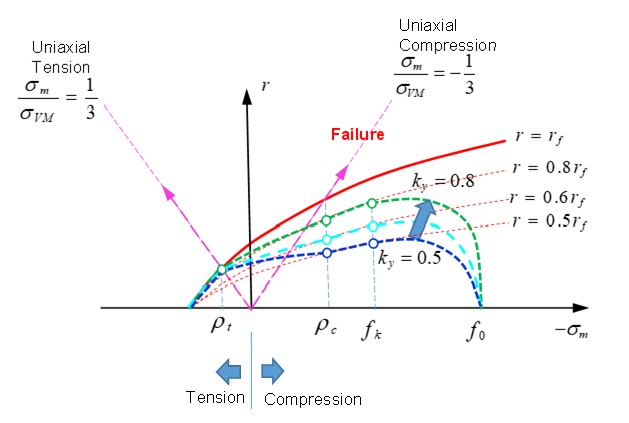

*Figure 181: Drücker-Prager criteria with different K funtion values*

Concrete Plastic Flow Rule in Compression
~~~~~~~~~~~~~~~~~~

A non-associated plastic flow rule is used in LAW24. The plastic flow
rule is:

.. math:: g=\alpha I_{1}+\sqrt{J_{2}}    \tag{133}

Where,

:math:`\alpha` Plastic dilatancy.

:math:`\alpha=\frac{\partial g}{\partial I_{1}}`
Governs the volumetric plastic flow.

:math:`I_{1}` First stress invariant (hydrostatic pressure).

Experimentally, :math:`\alpha` is a linear function of :math:`k_{0}`:

.. math:: \alpha=\frac{\big{(}1-k_{0}\big{)}\alpha_{y}+\big{(}k_{0}-K_{y}\big{)}\alpha_{f}}{1-K_{y}}   \tag{134}

**If**\ :math:`k_{0}=K_{y}` then,
:math:`\alpha=\alpha_{y}` which means the material
is in yield.

**If**\ :math:`k_{0}<K_{y}` then, :math:`\alpha` becomes negative is
the cap region.

**If**\ :math:`k_{0}=1` then, :math:`\alpha=\alpha_{f}`
which means the material has failed.

The values of :math:`\alpha_{y}, \alpha_{f}` are used to
describe the material beyond yield, but before failure. It is
recommended to use -0.2 and -0.1 for
:math:`\alpha_{y}, \alpha_{f}` in LAW24. If very
small values of :math:`\alpha_{y}, \alpha_{f}`
are used, there is no volumetric plasticity (no cap region).

Concrete Crushing Failure in Compression
~~~~~~~~~~~~~~~~~~~~~~~~~~

Failure surface is given by:

.. math:: f=r-r\_{f}(\sigma_{mp} \theta)=0 \tag{135}

Where,
:math:`r=\sqrt{2J_{2}}\left/\int_{c}\sigma_{m}=I_{1}\right/3f_{c}`. and :math:`\theta` is Lode angle, such as:

.. math:: \mathrm{cos}3\theta=\frac{J_{3}}{2}\bigg{(}\frac{3}{J_{2}}\bigg{)}^{3/2}  \tag{136}

An Ottosen surface is built to design this surface using:

.. math:: r_{f}(\sigma_{m} \theta)=\frac{1}{a}\Big{(}-b+\sqrt{b^{2}-a(\sigma_{m}-c)}  \Big{)}   \tag{137}

Where, :math:`a, b_{c}, b_{i} and c` are 4 values which shape the surface
and

.. math:: b(b_{c}, b_{p}, \theta)=\frac{1}{2}\Big{[}b_{c}(1-\mathrm{cos}3\theta)+b_{1}(1+\mathrm{cos}3\theta)\Big{]}  \tag{138}

For concrete, the compression failure curve :math:`r_{f}` can be defined with
a strength of:

:math:`f_{t}` Uniaxial tension (triaxiality is 1/3)

:math:`f_{c}` Uniaxial compression (triaxiality is -1/3)

:math:`f_{b}` Biaxial compression (triaxiality is -2/3)

:math:`f_{2}` Confined compression strength (tri-axial test)

:math:`s_{0}` Under confined pressure

The best way to fully determine the 3D failure envelope is to get
experimental data for all of these values,
:math:`f_{c} f_{f} f_{b} f_{2} s_{0}` which are schematically illustrated
in Figure 182.

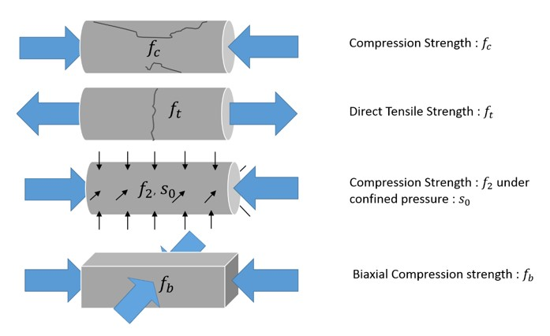

*Figure 182: Failure Parameters that Fully Determine 3D Failure Envelope*


Figure 183 and Figure 184 show the points that determine the failure
surface.


*Figure 183: Trace of failure surface with planar stress plane*


*Figure 184: Failure trace with several cut plan which are normal to the hydrostatic axis*

From these plots that the failure envelope is not a convex surface.
Figure 185 shows this behavior.


*Figure 185: Influence of the biaxial compressive strength value with all other characteristic failure points fixed*


*Figure 186: Influence of the compressive strength value with all other characteristic failure points fixed*


*Figure 187: Influence of the tensile strength value with all other characteristic failure points fixed*

In this particular case, the compressive strength is changing but all
other ratios are fixed

   . This leads to an envelope scaling, as shown in Figure 188.


*Figure 188: Influence of compressive strength value*

*All other ratios are fixed.*

Here with same strength in LAW24, but different confined compression
strength :math:`f_{2}`


Figure 189: Failure envelope on the plane stress surface influenced by the triaxial failure point

:math:`\left(\sigma_{1,}\sigma_{2,}\sigma_{3}\right)=\left(f_{2,}s_{0,}s_{0}\right)`

:math:`f_{c}` and the ratios :math:`f_{t}/f_{c}` and :math:`f_{b}/f_{c}` in the :math:`r-\sigma_{m} space (used to define the concrete failure) are: 


*Figure 190: Different tests (uniaxial tension, uniaxial compression, and biaxial compression) to determine failure curve*

Where the failure curve is defined using
:math:`r=\sqrt{2J_{2}}=\sqrt{\frac{2}{3}} \sigma_{YM}`
and :math:`\sigma_{m}=\frac{I_{1}}{3}` is the mean
stress (pressure), then :math:`I_{1}` and :math:`J_{2}` are the first and second
stress invariants.

The material fails once it reaches the failure curve :math:`r_{f}`.

Concrete Reinforcement
-----------------

In PRADIOSS there are two different ways to simulate the reinforcement in
concrete.

-  One way is to use beam or truss elements and connect them to the concrete with kinematic conditions.

-  Another way is to use the parameters in LAW24 along with the orthotropic solid property ``/PROP/ TYPE6`` to define the reinforced direction. Parameters :math:`a_{1}, a_{2}, a_{3}` in LAW24 are used to define the reinforcement cross-section area ratio to the whole concrete section area in direction 1, 2, 3.

.. math:: a_{i}=\frac{Area_{steel}}{Area_{concrete}}  \tag{138}

Where, :math:`\sigma_{y}` is the yield stress of the
reinforcement. If steel is used as a reinforcement, then
:math:`\sigma_{y}` is the yield stress of steel and :math:`E_{t}` is
the modulus of steel in the plastic phase.


*Figure 191: Stress-Strain Curve of Reinforcement (steel)*

Concrete Material (/MAT/LAW81)
-----------------

LAW81 can be used to model rock or concrete materials.

Drücker-Prager Yield Criteria
~~~~~~~~~~~~~~~~

LAW81 uses a Drücker–Prager yield criterion where the yield surface and
the failure surface are the same. The yield criteria is:

.. math:: F=\frac{q}{J_{2}\,\text{part}}-\frac{\text{r}_{c}(p)\cdot\big{(}\text{ptan}\phi+c\big{)}}{I_{1}\,\text{part}}=0  \tag{140}

Where,

:math:`q` von Mises stress with :math:`q=\sigma_{VM}=\sqrt{3J_{2}}`

:math:`p` Pressure is defined as :math:`p=\frac{1}{3}I_{1}`

12.  Han, D. J., and Wai-Fah Chen. "*A nonuniform hardening plasticity model for concrete materials.*" Mechanics of materials 4, no. 3-4 (1985): 283-302


*Figure 192: Yield Surface (LAW81)*

The yield surface can be described in two parts:

     - The linear part |image7| (:math:`p\leq p_{a})`, where the scale function is :math:`\mathrm{r}_{c}(p)=1` which leads to the von Mises stress being linearly proportional to pressure:

.. math:: q=p\mathrm{tan}\phi +c \tag{141}

Where,

:math:`c` Cohesive and is the intercept of yield envelope with the shear strength.

   If :math:`c` =0, the material has no strength under tension.

:math:`\phi` Angle of internal friction, which defines the slope of the yield envelope.

:math:`c` and :math:`\phi` are also used to define the Mohr-Coulomb yield surface. The
Drücker-Prage yield surface is a smooth version of the Mohr-Coulomb yield surface.

   • The second part |image8| (:math:`p_{a}<p<p_{b})` of the yield surface simulates a cap limit. An increase of pressure in a rock or concrete material will increase the yield of the material; but, if pressure increases enough, then the rock or concrete material will be crushed. The Drücker-Prager model with the cap limit can be used to model this behavior. The cap limit defined in part |image9| and uses the scale function:

.. math:: \mathrm{r}_{c}\big{(}p\big{)}=\sqrt{1-\left(\frac{p-p_{a}}{p_{b}-p_{a}}\right)^{2}}  \tag{142}

The von Mises stress is:

.. math:: q=\sqrt{1-\left(\frac{p-p_{a}}{P_{b}-\overline{p}_{a}}\right)^{2}}\cdot\left(p\text{tan}\phi+c\right) \tag{143}

Where,

:math:`P_{b}` Curve is defined using the :math:`fct_ID_{Pb}` input

:math:`p_{a}` Computed by PRADIOSS using the input :math:`a` ratio value.

:math:`p_{a}=\alpha\cdot P_{b}` with :math:`0<\alpha <1`.

Where, :math:`P_{0}` is the maximum point of yield curve, where :math:`\frac{\partial F}{\partial p}\left(p_{0}\right)=0`

If :math:`p=p_{b}`, then :math:`r_{\text{c}}\left(p_{b}\right)=0`
and the yield function is then,

:math:`q=0:\cdot\left(p\text{tan}\phi+c\right)=0`
which means the material is crushed.

The input parameters
:math:`\phi, c, p_{b^{\prime}}\alpha`
need to determine for the Drucker-Prager yield surface. At least four
tests are needed to fit these parameters. In the simplest case, uniaxial
tension and uniaxial compression can be used to determine the linear
part, :math:`\phi, \text{and} c`. To determine
:math:`p_{b^{\prime}` and :math:`\alpha` biaxial
compression tests and compression/compression tests are needed (refer to
CC00 and CC01 in RD-E: 4701 Concrete Validation with Kupfer Tests).


*Figure 193: Yield Surface of LAW81 Showing Different Load Conditions*

For most materials such as metal, the plastic strain increment could be
considered normal to yield surface. However, if the plastic strain
increment normal to yield surface is used for rock or concrete
materials, the plastic volume expansion is overestimated. Therefore, a
non-associated plastic flow rule is used in these materials. In LAW81
the plastic flow function *G* defined as:

-  :math:`G=q-p\cdot\tan\psi=0 if p\leq p_{a}`

-  :math:`G=q-\tan\psi\left(p-\frac{\left(p-p_{a}\right)^{2}}{2\left(p_{0}-p_{a}\right)}\right)=0 if p_{a}<p\leq p_{0}`

-  :math:`G=F if p>p_{0}`

Since the pressure is :math:`p_{0}`, the yield function *F* and plastic flow
function *G* are the same and the following condition is fulfilled:

.. math:: G(p_{0})=F(p_{0}) \tag{144}

.. math:: \frac{\partial G}{\partial p}|{p_{0}}=\frac{\partial F}{\partial p}|{p_{0}}=0 \tag{145}

The pressure :math:`p\_{0}` can be calculated using the yield surface where
:math:`\frac{\partial F}{\partial p}| p_{0}=0`. With *G*
defined as:

.. math:: G=q-\tan\psi\left(p-\frac{\left(p-p_{a}\right)^{2}}{2\!\left(p_{0}-p_{a}\right)}\right)=0   \tag{146}

The parameter :math:`\psi` can be determined using the von Mises
stress at pressure, :math:`p_{0}` in the function.


*Figure 194: Yield Surface of LAW81 with plastic flow*

Failure
=======

Ductile
---------

The ``/FAIL/BIQUAD``, ``/FAIL/JOHNSON``, and ``/FAIL/TAB1`` failure models define
material failure by relating the plastic strain at failure to the stress
state in the material.

These failure models are often used to describe the ductile failure of
materials. The state of stress in the material can be defined by using
stress triaxiality.

Stress Triaxiality (Normalized Mean Stress)
~~~~~~~~~~~~~~~~~~~~

For ductile materials, the state of stress (compression, shear, tension,
etc.) of the material affects the plastic strain value at which the
material will fail. An important and useful characteristic to describe
the state of stress, stress triaxiality is defined as:


.. math:: \sigma^{*}=\frac{\sigma_{m}}{\sigma_{VM}}   \tag{147}

Where,

:math:`\sigma_{m}=\frac{1}{3}\big{(}\sigma_{1}+\sigma_{2}+\sigma_{3}\big{)}` Mean (hydrostatic) stress

:math:`\sigma_{VM}=\sqrt{\frac{1}{2}\big{[}\big{(}\sigma_{1}-\sigma_{2}\big{)}^{2}+\big{(}\sigma_{2}-\sigma_{3}\big{)}^{2}+\big{(}\sigma_{3}-\sigma_{1}\big{)}^{2}\big{]}}` Mises stress 

Triaxiality values for some commons stress states can be derived as:

-  In pure tension:

   :math:`\sigma_{2}=\sigma_{3}=0` then :math:`\sigma^{*}=\frac{\sigma_{m}}{\sigma_{VM}}=\frac{1}{3}`

-  In biaxial compression:

   :math:`\sigma_{1}=\sigma_{2}`, and :math:`\sigma_{3}=0`, then :math:`\sigma^{*}=\frac{\sigma_{m}}{\sigma_{VM}}=-\frac{2}{3}`

Stress triaxiality for various stress states:

**Stress Triaxiality** :math:`\sigma^{*}` **Stress State**

:math:`-\frac{2}{3}` Biaxial compression

:math:`-\frac{1}{3}` Uniaxial compression

:math:`\textbf{0}` Pure shear 

:math:`\frac{1}{3}` Uniaxial tension 

:math:`\frac{1}{\sqrt 3}` Plain strain

:math:`\frac{2}{3}` Biaxial tension

/FAIL/JOHNSON
-----------

The Johnson-Cook failure model is often used to describe the ductile
failure of metals. It uses a Johnson-Cook equation to define failure
strain as a function of stress triaxiality.

In the Johnson-Cook failure model, there are three parts to the failure
model;

.. math:: \varepsilon_{f}=\big{[}D_{1}+D_{2} exp(D_{3}\sigma^{*})\big{]}\big{[}1+D_{4}in(\varepsilon^{*})\big{]}\big{[}1+D_{5}T^{*}\big{]}   \tag{148}

Where,

:math:`\varepsilon_{f}`   Plastic failure strain

:math:`\varepsilon^{*}=\frac{\varepsilon}{\varepsilon_{0}}` Current strain rate divided by the input reference strain rate

:math:`T^{*}` Computed in the material law or /HEAT/MAT

Ignoring the influence of strain rate and temperature a plot of the
Johnson-Cook failure is:


*Figure 195: Example Plot of a Johnson-Cook Failure Model*

Plastic strains above the curve represent material fracture and below
the curve no material fracture.

In a simple case where only the triaxiality influence is considered, the
failure strain is:

.. math:: \varepsilon_{f}=\mathrm{D}_{1}+\mathrm{D}_{2}\cdot\exp\bigl{(}\mathrm{D}_{3}\cdot\sigma^{\bullet}\bigr{)}  \tag{149}

Using 3 failure data points from test:

:math:`\varepsilon_{f}=0.1585` by uniaxial tension (:math:`\sigma^{\bullet}=1/3)`

:math:`\varepsilon_{f}=0.19` by pure shear (:math:`\sigma^{\bullet}=0)`

:math:`\varepsilon_{f}=0.2419` by uniaxial compression (:math:`\sigma^{\bullet}=-1/3)1`

The parameters :math:`\mathrm{D}_{1}, :math:`\mathrm{D}_{2}` and :math:`\mathrm{D}_{3}` could
be calculated analytically by solving the following equations:

.. math:: \tag{150}
.. math:: \left \{ \begin{matrix} 0.1585=\mathrm{D}_{1}+\mathrm{D}_{2}\cdot\exp\bigl{(}\mathrm{D}_{3}\cdot \tfrac{1}{3}\bigr{)} \\  0.19=\mathrm{D}_{1}+\mathrm{D}_{2}\cdot\exp\bigl{(}\mathrm{D}_{3}\cdot 0\bigr{)} \\ 0.2419=\mathrm{D}_{1}+\mathrm{D}_{2}\cdot\exp\bigl{(}\mathrm{D}_{3}\cdot-\tfrac{1}{3}\bigr{)}\end{matrix}\right|

Element Failure treatment
~~~~~~~~~~~~~~~~~~~~~~~~~

A cumulative damage method is used to sum the amount of plastic strain
that has occurred in the element using:

.. math:: D=\sum\frac{\Delta\varepsilon_{p}}{\varepsilon_{f}}\geq 1\tag{151}

What happens when :math:`D\geq 1` depends on the values of
element failure flags (:math:`I_{fail_sh} and I_{fail_so})` and XFEM
formulation flag (:math:`I_{\textit{xfem}})`. When the XFEM
formulation is not used (:math:`I_{\textit{xfem}})=0`, the
following table summarizes the different element failure flag options:

Table 18: Element failure option 

+---------+---------------------+----------------+--------------------+
| Element | Element failure     |If              |Failure behavior    |
|         | flag                |:math:`D\geq 1` |                    |
+=========+=====================+================+====================+
| Shell   | :math:`I_{fail_sh}` | In 1 IP or     | Element deleted    |
|         | =1 (Default)        | layer          |                    |
+---------+---------------------+----------------+--------------------+
| Shell   | :math:`I_{fail_sh}` | In 1 IP or     |stress tensor set to|
|         | =2                  | layer          |zero im IP or layer |
+---------+---------------------+----------------+--------------------+
| Shell   | :math:`I_{fail_sh}` | ALL IP or      | Element deleted    |
|         | =2                  | layer          |                    |
+---------+---------------------+----------------+--------------------+
| Solid   | :math:`I_{fail_sh}` | In 1 IP        | Element deleted    |
|         | =1 (Default)        |                |                    |
+---------+---------------------+----------------+--------------------+
| Solid   | :math:`I_{fail_sh}` | In 1 IP        |stress tensor set to|
|         | =2                  |                |zero im IP          |
+---------+---------------------+----------------+--------------------+
| Solid   | :math:`I_{fail_sh}` | ALL IP         |stress tensor set to|
|         | =2                  |                |zero in element     |
+---------+---------------------+----------------+--------------------+

Details on the XFEM formulation (:math:`I_{\textit{xfem}})=1)`,
can be found in ``/FAIL/JOHNSON``.

The damage, *D*, can be plotted in animation files using
``/ANIM/SHELL/DAMA`` or ``/ANIM/BRICK/DAMA``. This will show the risk of
material damage.

/FAIL/BIQUAD
----------

In PRADIOSS, ``/FAIL/BIQUAD`` is the most user-friendly failure model for
ductile materials. It uses a simplified, nonlinear strain-based failure
criteria with linear damage accumulation.

The failure strain is described by two parabolic functions calculated
using curve fitting from up to 5 user input failure strains.

By default, ``/FAIL/BIQUAD`` (``S-Flag``=1) uses two parabolic curves to
describe the plastic failure strain :math:`\varepsilon_{f}`, as
a function of stress triaxiality :math:`\sigma`. The two
parabolic curves use:

.. math:: f_{2}(x)=dx^{2}+ex+f  \tag{152}

Where,

:math:`a, b, c, d, e,` **and** :math:`f`  Parabolic coefficients

:math:`x`  Stress triaxiality

:math:`f_{1}(x)` **and** :math:`f_{2}(x)` Plastic failure strain


*Figure 196:* ``/FAIL/BIQUAD`` *Failure Strain Curve Made of 2 Parabolic*

The parabolic coefficients :math:`a, b, c, d, e,` and :math:`f` are computed by PRADIOSS using a
curve fit based on the plastic failure strain *c1*-*c5* input values. If
the calculated parabolic failure strain curves have negative failure
strain values, these negative values will be replaced by a failure
strain of 1E-6 which results in a very high damage accumulation and
brittle behavior. The results of the curve fit are in the Starter
``*0000.out file``.

::

       Bi-Quadratic FAILURE
         - - - - - - - - - - - - - -
    c1. . . . . . . . . . . . . . . . . . .= 0.2419E+00 
    c2. . . . . . . . . . . . . . . . . . .= 0.1900E+00 
    c3. . . . . . . . . . . . . . . . . . .= 0.1585E+00 
    c4. . . . . . . . . . . . . . . . . . .= 0.1437E+00
    c5. . . . . . . . . . . . . . . . . . .= 0.1394E+00
       COEFFICIENTS OF FIRST PARABOLA
         - - - - - - - - - - - - - -
    a . . . . . . . . . . . . . . . . . . .= 0.9180E-01 
    b . . . . . . . . . . . . . . . . . . .= -0.1251E+00 
    c . . . . . . . . . . . . . . . . . . .= 0.1900E+00
       COEFFICIENTS OF SECOND PARABOLA
         - - - - - - - - - - - - - -
    d . . . . . . . . . . . . . . . . . . .= 0.3753E-01 
    e . . . . . . . . . . . . . . . . . . .= -0.9483E-01 
    f . . . . . . . . . . . . . . . . . . .= 0.1859E+00

The *c1*–*c5* plastic failure strains definitions are:

       :**c1**:   Plastic failure strain in uniaxial compression

       :**c2**:   Plastic failure strain in shear

       :**c3**:   Plastic failure strain in uniaxial tension

       :**c4**:   Plastic failure strain in plane strain tension

       :**c5**:   Plastic failure strain in biaxial tension

M-Flag Input Options
~~~~~~~~~~~~

Depending on the *M-Flag* input option, there are three different
ways to define the *c1*-*c5* values.

MI. - *M-Flag*\ =0, User-defined Test Data  For this case, you must enter *c1*-*c5* which represents the plastic failure strain for the 5 different stress states. Ideally this data would be obtained from test or the material supplier.

MII. - *M-Flag*\ =1-7, Predefined Material Data  If failure strain data is not available, you can pick from 7 predefined materials. Figure 197 shows the plastic strain at failure curves for the 7 materials.

|image12| **Note:** The predefined values are supplied for early design exploration and it is your responsibility to verify that their material has the same properties.


*Figure 197: Predefined Material Failure Curves*

   • *M-Flag*\ =99, Plastic Failure Strain Ratio Input, *r1*-*r5*

   The last input method is to enter the plastic failure strain in
   uniaxial tension, *c3*, and plastic failure strain ratios for the
   other four stress states. These ratios are defined as:

       :**r1**: Failure plastic strain ratio, Uniaxial Compression (*c1*) to Uniaxial Tension (*c3*), so :math:`c1=r1\cdot c3`

       :**r2**: Failure plastic strain ratio, Pure Shear (c2) to Uniaxial Tension (*c3*), so :math:`c2=r2\cdot c3`

       :**r4**: Failure plastic strain ratio, Plane Strain Tension (*c4*) to Uniaxial Tension (*c3*), so :math:`c4=r4\cdot c3`

       :**r5**: Failure plastic strain ratio, Biaxial Tension (*c5*) to Uniaxial Tension (c3), so :math:`c5=r5\cdot c3` 

Using this method, it is easy to change the failure curve by
adjusting the single plastic failure strain in uniaxial tension
value, *c3*.


*Figure 198: Changes in Plastic Failure Strain Curve  by increasingthe uniaxial tension failure, c3, with the same failure plastic strain ratios*

Default Behavior
~~~~~~~~~

By default, values different than 0 need to be entered for *c1* to
*c5*. However, specific default behaviors exists, in case failure
information are missing.

-  In case the material failure behavior is unknown, *c1* to *c5* are set to 0.0 and the mild steel behavior (*M-Flag*\ =1) is used.

-  If only the tensile failure value is known, *c3* is defined (c1=c2=c4=c5=0.0). The mild steel behavior is used and scaled by the user- defined *c3* value.

-  In case the material behavior is known, *M-Flag* is defined and *c3* can be used to adjust the failure model according the expected tensile failure. The selected material behavior is scaled by the userdefined *c3* value.

-  For all other cases, all *c1* to *c5* are intended to be defined and default value of 0.0 is used.

Element Failure Treatment
~~~~~~~~~~~~~

A cumulative damage method is used to sum the amount of plastic
strain that has occurred at each integration point in the element
using:

.. math:: D=\sum\frac{\Delta\varepsilon_{p}}{\varepsilon_{f}}\geq 1 \tag{154}

Where,

*D* Damage

:math:`\Delta\varepsilon_{p}` The change in plastic strain of the integration point

:math:`\varepsilon_{f}` Plastic failure strain for the current stress triaxiality

In shell elements after an integration point reaches *D*=1, the
integration point’s stress tensor is set to zero. The element fails
and is deleted when the ratio of through thickness failed integration
points equals *P_thickfail*. In solid elements, the element is
deleted when any integration point reaches .

Plane Strain as Global Minimum
~~~~~~~~~

The *S-Flag*\ =2 option can be used to force the global minimum of
the plastic failure strain curve to occur at the plane strain stress
triaxiality location, *c4*. This is accomplished by splitting the
second equation into 2 separate quadratic sub-functions.

Modeling Material Instability (Localized Necking)
~~~~~~~~~~~~

In materials such as sheet metal, thickness thinning and diffuse
necking may appear during tensile loading of the material. This is
called *localized necking* and normally occurs in the stress
triaxiality range of :math:`\frac{1}{3}\leq\sigma^{\bullet}\leq\frac{2}{3}:`


*Figure 199:*

In ``/FAIL/BIQUAD`` it is possible to simulate this localized necking using
the option, S-*Flag*\ =3 and *Inst_start*. This option uses the same
plastic failure strain curve as S-*Flag*\ =2 and adds two additional
quadratic functions that define a curve that represents the start of
localized necking between stress triaxiality :math:`\frac{1}{3}`
and :math:`\frac{2}{3}`. The minimum value of this curve is a
user-defined value in the *Inst_start* field and occurs at plane strain
tension :math:`\sigma^{*}=\frac{1}{\sqrt{3}}`.
Using this localized necking curve, a second localized necking damage
value is calculated and failure due to necking only occurs when all
integration points reach :math:`D=\mathrm{I}`. The localized
necking criteria is based on the Marciniak-Kuczynski analysis.\ :sup:`13`


*Figure 200: Default Failure Strain Curve with additional localized necking curve (blue)*

When using *S-Flag*\ =1 or 2, the damage accumulation begins once the
plastic strain reaches in failure curve (red in Figure 201).

If *S-Flag*\ =3is used to describe the localized necking, damage
accumulation begins once the plastic strain reaches in the localized
necking curve (blue curve in Figure 201). For localized necking, the
element is deleted when all integration points reach damage, *D*=1,
whereas element deletion not due to localized necking is defined by
*P_thickfail*.


*Figure 201:*

Perturbation of the Failure Limit
~~~~~~~~~~~~~~~

Due to a materials imperfection or production process, a material’s
failure strain may not be exactly the same everywhere and thus very
small perturbations of failure limit may exist. When using *M-Flag*>0
with ``/PERTURB/FAIL/BIQUAD``, a statistical distribution of the failure
limit is applied to each element assigned the failure model. This is
accomplished by calculating the normal or random distribution of a
failure scale factor which is applied to ``/FAIL/BIQUAD``, *c3*. The two
different distributions methods are shown in Figure 202 and Figure 203.


*Figure 202: Random Distribution Idistri=1, of the failure limit in the Starter* ``0.out file``


*Figure 203: Normal (Gaussian) Distribution Idistri=2, of the failure limit in the Starter* ``*0.out`` *file*

``/FAIL/BQUAD`` uses small perturbations of *c3* generated by
``/PERTURB/FAIL/BIQUAD`` to scale the entire failure curve using the
strain ratio values for the predefined materials or user-defined
ratios, *r1*, *r2*, *r4* and *r5*, depending on the value of
*M-Flag*.


*Figure 204:*

Reference
~~~~~~~~~~~

Tabulated Failure Model /FAIL/TAB1
----------------

In PRADIOSS, ``/FAIL/TAB1`` is the most sophisticated failure model for
ductile material. The plastic failure strain can be defined as a
function of: stress triaxiality, strain rate, Lode angle, element
size, temperature, and instability strain.

Damage is accumulated based on user-defined functions. The
functionality of this failure model will be described starting with
the most basic input to the most complex options.

Plastic Failure Strain
~~~~~~~~~~~

Similar to ``/FAIL/JOHNSON`` and ``/FAIL/BIQUAD``, it is possible to define a
curve that represents the plastic failure strain, :math:`\varepsilon_{f}`, as a function of
stress triaxiality, :math:`\sigma_{*}`. Unlike ``/FAIL/JOHNSON`` and ``/FAIL/BIQUAD`` where the
failure strain curve is defined using parameters in predefined
equations, in ``/FAIL/TAB1`` any number of discrete points can be entered
to create an arbitrary function that represents the failure strain
curve. This curve is defined using the /TABLE entity and is
referenced in *table_ID*\ :sub:`1`. This method can be used for shell
and solid elements.

13.   Pack, Keunhwan, and Dirk Mohr. "Combined necking & fracture model to predict ductile failure with shell finite elements." *Engineering Fracture Mechanics* 182 (2017): 32-51


*Figure 205: Material Failure Curve Defined using Discrete Points with a Local Maximum*

Example ``/TABLE``, *dimension*\ =1

Input for failure plastic-strain versus triaxiality using *table_ID*\ :sub:`1`.

::

   /TABLE/1/4711
   failure plastic-strain vs triaxiality
   #dimension 
         1
   # Triaxiality  Failure_Strain 
      -0.7000     0.3386 
      -0.6000     0.3068 
      -0.5000     0.2794 
      -0.4000     0.2558 
      -0.3333     0.2419 
      -0.3000     0.2355 
      -0.2000     0.2180
      -0.1000     0.2029
      0.0000      0.1900
      0.1000      0.1789
      0.2000      0.1693
      0.3000      0.1610 
      0.3333      0.1585 
      0.4000      0.1539 
      0.5000      0.1478 
      0.6000      0.1425
      0.7000      0.1380

Strain Rate Dependency
~~~~~~~~~~~~~

``/FAIL/TAB1`` can also include the influence of strain rate on material
failure. For this case the /TABLE must be defined such that, the
first dimension is the function ID for the failure curve and the
second dimension is the strain rate where that failure curve is
applied.

Example ``/TABLE``, *dimension*\ =2

::

 /TABLE/1/4711
 failure plastic-strain vs triaxiality and strain rate  
 #dimension 
         2
 #   FCT_ID       strain_rate
      3000        1E-4 
      3001        0.1
      3002        1.0 
 /FUNCT/3000
 failure plastic-strain vs triaxiality
 #   Triaxiality  Failure_Strain 
      -0.7000     0.3386 
      -0.6000     0.3068 
      -0.5000     0.2794 
      -0.4000     0.2558 
      -0.3333     0.2419 
      -0.3000     0.2355 
      -0.2000     0.2180
      -0.1000     0.2029 
      0.0000      0.1900 
      0.1000      0.1789 
      0.2000      0.1693 
      0.3000      0.1610 
      0.3333      0.1585 
      0.4000      0.1539 
      0.5000      0.1478 
      0.6000      0.1425
      0.7000      0.1380 
 /FUNCT/3001
 failure plastic-strain vs triaxiality
 #   Triaxiality  Failure_Strain 
      -0.7        0.27088 
      -0.6        0.24544 
      -0.5        0.22352
      -0.4        0.20464 
      -0.3333     0.19352
      -0.3        0.1884 
      -0.2        0.1744 
      -0.1        0.16232
      0           0.152 
      0.1         0.14312 
      0.2         0.13544
      0.3         0.1288 
      0.3333      0.1268
      0.4         0.12312 
      0.5         0.11824 
      0.6         0.114
      0.7         0.1104

*Lode Angle with Solid Elements*
~~~~~~~~~~~

For solid elements, the failure strain can also depend on the 3D
stress state defined using the Lode angle.

This can be included by adding failure strain as a function of Lode
angle parameter in the /TABLE entity referenced by *table_ID1*. For
shells elements, it is only necessary to define the failure strain as
a function of stress triaxiality. But for solid elements, it is more
accurate to include the failure strain as a function of stress
triaxiality and Lode angle.

In PRADIOSS, the Lode angle is entered using a normalized and
dimensionless Lode Angle parameter :math:`\zeta` and is defined here.

The stress state at a point, *P*, could be expressed with principle
stresses
(:math:`\sigma_{1},\sigma_2{},\sigma_{3})`
or could also be expressed using stress invariants
:math:`(I_{1},J_{2},J_{3})`.
The advantage of using stress invariants is that they are constant and
do not depend on the orientation of the coordinate system. In Figure
206, to correctly describe stress state of point
*P* :math:`\sigma_{1},\sigma_{2},\sigma_{3}`
using stress invariants, the magnitude of **OO**\ ’ as:

.. math:: \sqrt{3}\sigma_{m}=\frac{\sqrt{3}}{3},I_{1} \tag{155}

Where,

:math:`\sigma` Mean stress

:math:`I_{1}` First stress invariant :math:`I_{1}=\sigma_{1}\sigma_{2}\sigma_{3}`

**OO’** is in the hydrostatic axis, which means the principle stress in
this axis is the same (:math:`\sigma_{1}=\sigma_{2}=\sigma_{3})`.

**OO** is the hydrostatic pressure.


*Figure 206: Stress State of P*

The magnitude of **O’P** is:

.. math:: \sqrt{2J_{2}}=\sqrt{\frac{2}{3}} \sigma_{VM}  \tag{156}

Here, :math:`J_{2}` is the second invariant of deviatoric stress :math:`\mathbf{s(s=\sigma-p)}` with

:math:`J_{2}=\frac{1}{2}(S_{1}2+S_{2}2+S_{3}2)=\frac{1}{2}\Big{[}\big{(}\sigma_{1}-\sigma_{2}\big{)}^{2}+\big{(}\sigma_{2}-\sigma_{3}\big{)}^{2}+\big{(}\sigma_{3}-\sigma_{1}\big{)}^{2}\Big{]}`.

To identify the point *P*, the angle in the circular plane must be
calculated. This angle is called the Lode Angle :math:`\theta`:

.. math:: \cos\big{(}3\theta\big{)}=\frac{27}{2}\frac{J_{3}}{\sigma_{VM}^{3}}=\frac{3\sqrt{3}}{2}\frac{J_{3}}{J_{2}^{3/2}}  \tag{157}

with :math:`0\leq\theta\leq\frac{\pi}{3}` and :math:`J_{3}` is the third invariant of deviatoric stress calculated as:

.. math:: J_{3}=S_{1}S_{2}S_{3} \tag{158}

In ``/FAIL/TAB1`` a normalized and dimensionless Lode Angle parameter
:math:`\zeta` with the range :math:`(-1\leq\zeta\leq 1)`
is used and defined as:

.. math:: \zeta=\cos\left(3\theta\right)  \tag{159}


*Figure 207: Stress state with different lode angle*

The special character for lode angle :math:`\theta` and load angle parameter :math:`\zeta` are:

+----------------------+-----------------+------------------------------+
| load angle parameter | lode angle      | Strass State                 |
| :math:`\zeta`        | :math:`\theta`  |                              | 
+======================+=================+==============================+
|           1          |        0        |Uniaxial tension + hydrostatic|
|                      |                 |pressure (triaxial tension or |
|                      |                 |axisymmetric tension)         |
+----------------------+-----------------+------------------------------+
|           0          |       30        | Pure shear + hydrostatic     |
|                      |                 | pressure (plane strain)      |
+----------------------+-----------------+------------------------------+
|          -1          |       60        | Uniaxial compression +       |
|                      |                 | hydrostatic pressure         |
|                      |                 | (axisymmetric compression)   |
+----------------------+-----------------+------------------------------+

A failure strain surface can be created from the stress triaxiality
and Lode angle failure data.


*Figure 208: 3D Failure Surface*

The material failure surface could be created using the following material tests.


*Figure 209: Stress State and Lode Angle for Various Tests*

Example ``/TABLE``, *dimension*\ =3

Input for failure plastic-strain versus triaxiality, strain rate, and
Lode angle using *table_ID*\ :sub:`1`

::

  /TABLE/1/4711
  failure plastic-strain vs triaxiality and strain rate
  #dimension 
           3 

  #---1----|----2----|----3----|----4----|----5----|----6----|----7----|----8----|----9----|---10----|
  # FCT_ID                      strain_rate           Lode_angle 
      3000                            1E-4                   -1 
      3001                             0.1                    0 
      3002                             1.0                    1
  . . . . . . . . .


*Figure 210: Failure Surface when table_ID\ 1 references a* ``/TABLE`` *with dimension=3*

*Scaling Failure Strain*
~~~~~~~~~~~~~

Material failure based on temperature and element size can be
considering in ``/FAIL/TAB1`` by including functions that scale the
failure strain depending on the element size and/or temperature
using:

.. math:: \varepsilon_{f}=Xscale1\cdot f(\sigma^{*},\xi,\xi)\cdot factor_{el}\cdot factor_{T} \tag{160}

Where,

*Xscale1* General scaling factor

:math:`f actor_{el}` Scale factor based on element size

:math:`f actor_{T}` Scale factor based on temperature

Element Length Dependency
~~~~~~~~~~~~~~~~~~~~~~~~~

In numerical simulations, the element size will affect the material
failure. Using the same failure parameters, a coarse mesh will fail
earlier than a fine mesh.


*Figure 211: Influence of Element Mesh Size on Material Failure in Numerical Simulation*

To account for the variation in results based on mesh size, the
element size scale factor can be defined to scale the failure strain
based on mesh element size. The scale factor defined in Equation 160 is:

.. math:: f actor_{el}=Fscale_{el}\cdot\mathsf{f}_{el}\Big{(}\frac{Size_{el}}{EI_{-}ref}  \Big{)}   \tag{161}

Where,

:math:`F scale_{el}`  Element size function scale factor

:math:`\mathsf{f}_{el}\Big{(}\frac{Size_{el}}{EI_{-}ref}\Big{)}`
failure strain scale factor as a function of the normalized element size
(defined via :math:`fct_ID_{el}`), and *EI_ref* is the
reference element size used to normalize the element size

For example, a mesh size of 2mm was used in a material validation
simulation. After the initial validation, the same simulation is reran
using *EI_ref* =2 with different element sizes to determine the
correct scaling factor for each element size. Using the results of the
second validation, a failure strain scale factor function is constructed
as (Figure 212):


*Figure 212: Example of Element Size Scale Factor Function fct_ID\ el in* ``/FAIL/TAB1``

Temperature Dependency
~~~~~~~~~~~~~~~~~~~~~~

To account for how the temperature affects material failure, failure
strain values defined in Equation 160 can be scaled using a
temperature scale factor function:

.. math:: factor_{T}=Fscale_{T}\cdot\mathrm{f}_{T}(T_{start}) \tag{162}

Where,

:math:`F scale_{T}`  Temperature function scale factor

:math:`\mathrm{f}_{T}(T_{start})` Failure strain scale factor as a function temperature defined via :math:`fct_ID_{T}`

Scaling the failure strain based on temperature works with any material
that has ``/HEAT/MAT`` defined or materials that include thermos plasticity
such as ``/MAT/LAW2 (PLAS_JOHNS)``.

In :math:`fct_ID_{T}` the temperature is defined relative to the melting and initial temperature.

.. math:: T^{*}=\frac{T-T_{ini}}{T_{melt}-T_{ini}} \tag{163}


*Figure 213: Influence of Temperature on Material Failure with fct_ID\ T in /FAIL/TAB1*

Element Failure Treatment
~~~~~~~~~~~~~~

In ``/FAIL/TAB1`` an accumulative damage model is used. The damage can be
output for contour plotting using the Engine options,
``/ANIM/SHELL/DAMA`` or ``/ANIM/BRICK/DAMA``.

The accumulated damage is calculated by first calculating a damage increment:

.. math:: \Delta D=\frac{\Delta E_{p}}{\varepsilon_{f}}\cdot n\cdot D_{p}(\frac{1}{n})\tag{164}

Where,

:math:`\Delta\varepsilon_{p}` The change in plastic strain of the integration point

:math:`\varepsilon_{f}` Plastic failure strain for the current stress triaxiality

:math:`D_{p}` **and** *n*  Damage parameters

The accumulated damage is:

.. math:: D=\frac{\sum_{\Delta D}}{D_{crit}}\tag{165}

Where, :math:`D_{crit}` is defined in ``/FAIL/TAB1`` with a recommended between 0
and 1. The elements fail when :math:`D\geq 1` which means
:math:`\sum\Delta D\geq D_{crit}`.


*Figure 214: Influence of* :math:`D_{crit} in` * ``/FALL/TAB1``

It is also interesting to understand the influence of the damage
accumulation parameter, in Equation 164.

When *n*=1 damage is linear, otherwise the damage curve is nonlinear.


*Figure 215: Influence of damage parameter *n*

*Material Instability (Diffuse Necking)*
~~~~~~~~~~

In a tensile test, a material will reach a maximum engineering stress
and then the stress will decrease or sometimes called *soften*. This
maximum engineering stress point is called the *necking point*. After
necking, the true stress actually increases, due to the decrease in
the cross sectional area. This is called *diffuse necking*. In sheet
metal, thickness thinning or localized necking in diffuse area may
appear if the material continues to be loaded in the tensile
direction. The diffuse necking normally appears in stress
triaxiality ranges of :math:`0<\sigma^{*}\leq\frac{2}{3}` and
localized necking in the range of :math:`\frac{1}{3}\leq\sigma^{*}\leq\frac{2}{3}`.


*Figure 216: Sketch of Diffuse Necking and Localized*

In ``/FAIL/TAB1`` it is possible to account for the material instability
(diffuse necking) with options *table_ID*\ :sub:`2`, or *Inst_start
and *Fad_exp*

The material will start to weaken due to diffuse necking when the
instability strain is reached. The reduced stress in the material is:

.. math:: \sigma_{reduced}=\sigma\cdot\left(1-\left(\frac{D_{instability}-inst_start}{1- inst_start}\right)^{Fad_exp}\right)\tag{166}

Where,

.. math:: D_{instability}=\sum\frac{\Delta\varepsilon_{p}}{\varepsilon_{f}}\tag{167}

with :math:`\varepsilon_{f}` being the diffuse necking strain
based on the current stress triaxiality.

The strain at which instability starts could be either input with a
curve (blue curve in Figure 217) using *table_ID*\ :sub:`2` or input as
a constrain strain using the option *Inst_start*.

In a uniaxial tensile test :math:`\sigma^{*}=\frac{1}{3}`.

-  If material instability is not included then damage is calculated using the red failure curve in Figure 217

-  If material instability is included and modeled using the curve input (*table_ID*\ :sub:`2`) then:

   -  Damage due to diffuse necking starts when the plastic strain defined by the blue curve in Figure 217 is reached.

   -  Damage due to diffuse necking is linear if *Fad_exp*\ =1 is used. Increasing the *Fad_exp* leads to more energy dissipated during damage. Figure 217 shows the influence of *Fad_exp* from 1 to 10 in stress-strain curve. It is recommend to use a *Fad_exp* value of 5 to 10.

   -  Once the strain reaches the red curve the element fails.


*Figure 217: Influence of Parameter Fad_exp and Material Instability Region*

-  If only *Inst_start* is used without curve input in *table_ID*\ :sub:`2`, then the diffuse necking plastic strain is the constant value, *Inst_start*, for all stress triaxiality.


*Figure 218: Constant Inst_start Describing Diffuse Necking*

Currently diffuse necking (material instability) in ``/FAIL/TAB1`` can
only be used with material law numbers > 28.

14.   Wierzbicki, Tomasz, "*Addendum to the Research Proposal on Fracture of Advanced High Strength Steels*", page 19, January 2007.

15.   Wierzbicki, Tomasz. "*Fracture of AHSS Sheets–Addendum to the Research Proposal on Fracture of Advanced High Strength Steels*." Impact and Crashworthiness Laboratory, Massachusetts Institute of Technology (2007).

Composites
==========

Composite materials consist of two or more materials combined each
other. Most composites consist of two materials, binder (matrix) and
reinforcement. Reinforcements come in three forms, particulate,
discontinuous fiber, and continuous fiber.

Composite Material
------------------

In PRADIOSS the following material laws are used to describe composite
material:

-  ``LAW12`` and ``LAW14``

-  ``LAW15`` (recommended to use ``LAW25+/FAIL/CHANG``)

-  ``LAW25``

-  ``LAW19`` (For Fabric and with only ``/PROP/TYPE9``)

-  ``LAW58`` (For Fabric only with ``/PROP/TYPE16``)

table 19: Composite material, propert, failure model, and element type compatibility

+---------+---------------------------+---------------------------+--------------------+
|         | Shell Element             | Brick Element             | Failure Model      |
+=========+===========================+===========================+====================+
|``LAW12``|                           |``/PROP/TYPE6 (SOL_ORTH)`` |``/FAIL/HASHIN``    |
|         |                           |                           |                    |
|         |                           |``/PROP/TYPE21 (TSH_ORTH)``|``/FAIL/PUCK``      |
|         |                           |                           |                    |
|         |                           |``/PROP/TYPE22 (TSH_COMP)``|``/FAIL/LAD_DAMA``  |
+---------+---------------------------+---------------------------+--------------------+
|``LAW14``|                           |``/PROP/TYPE6 (SOL_ORTH)`` |``/FAIL/HASHIN``    |
|         |                           |                           |                    |
|         |                           |``/PROP/TYPE21 (TSH_ORTH)``|``/FAIL/PUCK``      |
|         |                           |                           |                    |
|         |                           |``/PROP/TYPE22 (TSH_COMP)``|``/FAIL/LAD_DAMA``  |
+---------+---------------------------+---------------------------+--------------------+
|``LAW15``|``/PROP/TYPE9 (SH_ORTH)``  |                           |``/FAIL/CHANG``     |
|         |                           |                           |                    |
|         |``/PROP/TYPE10 (SH_ORTH)`` |                           |                    |
|         |                           |                           |                    |
|         |``/PROP/TYPE11 (SH_SANDW)``|                           |                    |
|         |                           |                           |                    |
|         |``/PROP/TYPE17 (STACK)``   |                           |                    |
|         |                           |                           |                    |
|         |``/PROP/TYPE19 (PLY)``     |                           |                    |
+---------+---------------------------+---------------------------+--------------------+
|``LAW25``|``/PROP/TYPE10 (SH_ORTH)`` |``/PROP/TYPE6 (SOL_ORTH)`` |``/FAIL/CHANG``     |
|         |                           |                           |                    |
|         |``/PROP/TYPE11 (SH_SANDW)``|``/PROP/TYPE14 (SOLID)``   |``/FAIL/HASHIN``    |
|         |                           |                           |                    |
|         |``/PROP/TYPE17 (STACK)``   |``/PROP/TYPE20 (TSHELL)``  |``/FAIL/PUCK``      |
|         |                           |                           |                    |
|         |``/PROP/TYPE19 (PLY)``     |``/PROP/TYPE21 (TSH_ORTH)``|``/FAIL/LAD_DAMA``  |
|         |                           |                           |                    |
|         |``/PROP/TYPE51``           |``/PROP/TYPE22 (TSH_COMP)``|(for solid only)    |
|         |``/PROP/PCOMPP``           |                           |                    |
+---------+---------------------------+---------------------------+--------------------+
|``LAW19``|``/PROP/TYPE9 (SH_ORTH)``  |                           |                    |
|         |                           |                           |                    |
+---------+---------------------------+---------------------------+--------------------+
|``LAW58``|``/PROP/TYPE16 (SH_FABR)`` |                           |                    |
|         |                           |                           |                    |
+---------+---------------------------+---------------------------+--------------------+

LAW12 and LAW14
------------

Describes orthotropic solid material which use the Tsai-Wu
formulation. The materials are 3D orthotropic-elastic, before the
Tsai-Wu criterion is reached. ``LAW12`` is a generalization and
improvement of ``LAW14``.

Elastic Phase
~~~~~~~~~~

Both material laws require Young's modulus, shear modulus and Poisson
ratio (9 parameters) to describe the material orthotropic in elastic
phase.

.. image:: vertopal_75794439f47d439ba01f734ac3f4dcc1/media/image9-5.jpg
      :width: 3.50864in
      :height: 1.1251in

*Figure 219:*


Stress Damage
^^^^^^^^^^^^^


*Figure 220:*

Stress limits :math:`\sigma_{t1}` and
:math:`\sigma_{t2}` *and* :math:`\sigma_{t3}` (in
tensile/compression) are requested for damage. These stress limits could
be observed from a tensile test in 3 related directions.


*Figure 221:*

Once stress limit is reached, then damage to material begins (stress
reduced with damage parameter :math:`\sigma`). If Damage (:math:`D_{i}=D_{i}+\sigma)` reaches D=1, then
stress is reduced to 0.


*Figure 222:*

Tsai-Wu Yield Criteria
~~~~~~~~~~~~

In LAW12 (3D_COMP), the Tsai-Wu yield criteria is:

.. math:: F(\sigma)=F_{1}\sigma_{1}+F_{2}\sigma_{2}+F_{3}\sigma_{3}+F_{1}\sigma_{1}^{2}+F_{2}\sigma_{2}^{2}+F_{3}\sigma_{3}^{2}+F_{4}\sigma_{12}^{2}+F_{5}\sigma_{23}^{2}+F_{6}\sigma_{3}^{2}+2F_{1}\sigma_{1}\sigma_{2}+2F_{2}\sigma_{2}\sigma_{3}+2F_{1}\sigma_{1}\sigma_{3}  \tag{169}

The 12 coefficients of the Tsai-Wu criterion could be determined
using the yield stress from the following tests:

Tensile/Compression Tests

   • Longitude tensile/compression (in direction 1):


*Figure 223:*

.. math:: F_{1}=-\frac{1}{\sigma_{\rm ly}^{c}}+\frac{1}{\sigma_{\rm ly}^{t}} \tag{170}

.. math:: F_{1}=\frac{1}{\sigma_{\rm ly}^{c}\sigma_{\rm ly}^{t}}\tag{171}

-  Transverse tensile/compression (in direction 2):


*Figure 224:*

.. math:: F_{2}=-,\frac{1}{\sigma_{2y}^{c}}+\frac{1}{\sigma_{2y}^{t}}\tag{172}

.. math:: F_{22}=\frac{1}{\sigma_{2y}^{c}\sigma_{2y}^{t}}\tag{173}

-  Transverse tensile/compression (in direction 3):


*Figure 225:*

.. math:: F_{3}=-,\frac{1}{\sigma_{3y}^{c}}+\frac{1}{\sigma_{3y}^{t}}\tag{174}
   
.. math:: F_{33}=\frac{1}{\sigma_{3y}^{c}\sigma_{3y}^{t}}\tag{175}

Then the interaction coefficients can be calculated as:

.. math:: F_{12}=-,\frac{1}{2}\sqrt{\left(F_{11}F_{22}\right)}\tag{176}

.. math:: F_{23}=-,\frac{1}{2}\sqrt{\left(F_{22}F_{33}\right)}\tag{177}

.. math:: F_{13}=-,\frac{1}{2}\sqrt{\left(F_{11}F_{33}\right)}\tag{178}

Shear Tests

-  Shear in plane 1-2 test:


*Figure 226:*

:math:`\sigma^{t}_{12y}`, and :math:`\sigma^{c}_{12y}` can result from the sample tests below:


*Figure 227:*

.. math:: F_{44}=\frac{1}{\sigma^{c}_{12y}\sigma^{t}_{12y}}\tag{179}

• Shear in plane 1-3


*Figure 228:*

:math:`\sigma^{t}_{3,1y}` and
:math:`\sigma^{c}_{3,1y}`, can result from the sample tests below:

.. image:: vertopal_75794439f47d439ba01f734ac3f4dcc1/media/image10-5.jpg
      :width: 3.04193in
      :height: 1.63347in

*Figure 229:*

.. math:: F_{66}=\frac{1}{\sigma_{31y}^{c}\sigma_{31y}^{t}}\tag{180}

• Shear in plane 2-3:


*Figure 230:*

.. math:: F_{55}=\frac{1}{\sigma_{23y}^{c}\sigma_{23y}^{t}}\tag{181}

The parameters shown below in LAM12 and LAM14 are requested to calculate
the Tsai-Wu criteria:

|image16|

*Figure 231:*

The yield surface for Tsai-Wu is :math:`F(\sigma)=1`. As long as
:math:`\left(F(\sigma)\leq 1\right)`,
the material is in the elastic phase. Once
:math:`\left(F(\sigma)>1\right)`, the
yield surface is exceeded and the material is in nonlinear phase.

In these two material laws, the following factors could also be
considered for the yield surface.

   -  Plastic work :math:`W_{p}` with parameter *B* and *n*

   -  Strain rate :math:`\dot{\varepsilon}` with parameter :math:`\dot{\varepsilon}_{0}` and *c*.

.. math:: F\big{(}W_{p},\dot{\varepsilon}\big{)}=\big{(}1+BW_{p}^{n}\big{)}\Big{(}1+c\mathrm{ln}\frac{\dot{\varepsilon}}{\dot{\varepsilon}_{0}}\Big{)}\tag{182}

Then the yield surface will be :math:`F(\sigma)=F\big{(}W_{p},\dot{\varepsilon}\big{)}`.

-  Material will be in elastic phase, if :math:`F(\sigma)\leq F\big{(}W_{p},\dot{\varepsilon}\big{)}`

-  Material will be in nonlinear phase, if :math:`F(\sigma)>F\big{(}W_{p},\dot{\varepsilon}\big{)}`

This yield surface
:math:`F\big{(}W_{p},\dot{\varepsilon}\big{)}`
will be limited with :math:`f_{\mathrm{max}}(F\big{(}W_{p},\dot{\varepsilon}\big{)}\leq f_{\mathrm{max}})`,
where :math:`f_{\mathrm{max}}` is the maximum value of the
Tsai-Wu criterion limit.

:math:`f_{\mathrm{max}}=\Big{(}\frac{\sigma_{\mathrm{max}}}{\sigma_{y}}\Big{)}^{2}`

Depending on parameter *B*, *n*, *c* and
:math:`\dot{\varepsilon}_{0},` the yield surface is between 1
and :math:`f_{\mathrm{max}}`.


*Figure 232: Tsai-WU yield criteria in 1-2 plane*

LAW25 (Tsai-WU and CRASURV)
-------------------

LAW25 is the most commonly used composite material in PRADIOSS. It can
be used with shell and solid elements. The two formulations available
in LAW25 are the Tsai-Wu and CRASURV formulations.

Elastic Phase
~~~~~~~~~~~

In the elastic phase, Young's modulus (3 parameters), shear modulus
(3 parameters) and one parameter for Poisson ratio are required to
describe the orthotropic material.


Tsai-Wu Yield Criteria for :math:`\mathbf{I_{form}}` =0 and =1
~~~~~~~~~~~~~~~~~~

The Tsai-Wu yield surface in LAW25 is defined with 6 coefficient:

:math:`\mathbf{I_{form}}` **: Tsai-Wu**  
:math:`\mathbf{I_{form}}` **: CRASURV** :math:`\left(F(W^{*}_{\mathbf{p}},\varepsilon,\sigma)\leq 1\right)`

:math:`\left(F(\sigma)\leq F(W^{*}_{\mathbf{p}},\varepsilon)\right)`

To check if material in yield, in Tsai-Wu (:math:`I_{form}`=0)
:math:`F(\sigma)` will be compared with
:math:`F(W^{*}_{\mathbf{p}},\varepsilon)` at each
stress state and in CRASURV (:math:`I_{form}=1)`
:math:`F(W^{*}_{\mathbf{p}},\varepsilon)` will be
simply compared with 1 at each stress state.
These 6 coefficients could be determined with yield stress from these
tests:

   -  Tensile/compression tests

Longitudinal tensile/compression tests (in direction 1 which is fiber
direction):


**Here,** :math:`(W^{*}_{p}=\frac{W_{p}}{W^{ref}_{p}})`  in compression:

:math:`\sigma^{c}_{1y}\big{(}W^{*}_{p}\cdot\varepsilon\big{)}=\sigma^{c}_{1y}\big{(}1+b^{c}_{1}\big{(}W^{*}_{p}\big{)}^{n^{c}_{1}}\big{(}1+c^{c}_{1}\ln\Big{(}\frac{\varepsilon}{\varepsilon_{0}}\Big{)}\big{)})`

Here :math:`(W^{*}_{p}=\frac{W_{p}}{W^{ref}_{p}})` 

Transverse tensile/compression tests (in direction 2)


• Shear tests 

Shear in plane 1-2


:math:`I_{form}` **= 0: Tsai-WU** :math:`\left(F(\sigma)\leq F(W^{*}_{\mathbf{p}},\varepsilon)\right)`

:math:`I_{form}` = 1: CRASURV :math:`\left(F(W^{*}_{\mathbf{p}},\varepsilon,\sigma)\leq 1\right)`

:math:`F_{12}=-\frac{a}{2}\sqrt{F_{11}F_{22}}`

The default reduction factor, *a*-1, is typically used.

:math:`F\big{(}W_{p}^{*},\dot{\varepsilon}\big{)}=\big{(}1+b \big{(}W_{p}^{*}\big{)}^{n}\big{)}\cdot\Big{(}1+\mathrm{cln}\big{(}\frac{\dot{\varepsilon}}{\dot{\varepsilon}_{0}}\big{)}\Big{)}`

Here, :math:`(W^{*}_{p}=\frac{W_{p}}{W^{ref}_{p}})`

:math:`F_{12}\big{(}W_{p}^{*},\dot{\varepsilon}\big{)}=-\frac{a}{2}\sqrt{F_{11}\big{(}W_{p}^{*},\dot{\varepsilon}\big{)}F_{22}\big{(}W_{p}^{*},\dot{\varepsilon}\big{)}}`

The default reduction factor, *a*-1, is typically used.

Note that the relative plastic work :math:`W_{p}^{*}` is used in Tsai-WU to calculate the yield surface; whereas in CRASURV, the relative plastic work is used to calculate the yield stress.


**The  yield stress limit** :math:`F(W^{*}_{\mathbf{p}},\varepsilon)` **is range of 1 and**  :math:`f_{max}`

In ``LAW25`` (Tsai-Wu and CRASURV) damage is a function of the total
strain and the maximum damage factor.

If the total strain :math:`\varepsilon>\varepsilon_{t}` or out of plane strain
:math:`\gamma_{ini}<\gamma<\gamma_{\max}`,
then the material is softened using the following method:

.. math:: \sigma^{reduce}=\sigma\cdot(1-d_{i})\tag{184}

with *i* =1,2,3

Where, :math:`d_{i}` is the damage factor and is defined as:

.. math:: d_{i}=\min\left(\frac{\varepsilon_{i}-\varepsilon_{ti}}{\varepsilon_{i}}\cdot\frac{\varepsilon_{ini}}{\varepsilon_{ini}}, d_{\max}\right)\tag{185}

with *i* =1,2

.. math:: d_{3}=\min\left(\frac{\gamma-\gamma_{ini}}{\gamma_{\max}-\gamma_{ini}}\cdot\frac{\gamma_{\max}}{\gamma},d_{\max}\right)\tag{186}

in direction 3 (delamination)

   - If the total strain is between :math:`\varepsilon_{t}<\varepsilon_{t}<\varepsilon_{f}`, the material begins to soften, but this damage is reversible. Once :math:`\varepsilon>\varepsilon_{f}`, then the damage is irreversible and if :math:`\varepsilon\geq\varepsilon_{m})`, then stress in material is reduced to 0.

   - Damage could be in elastic phase or in plastic phase. It depends on which phase :math:`\varepsilon_{t}` and :math:`\varepsilon_{f}` are defined in.

   - Element deletion is controlled by :math:`I_{\mathit{off}}`. Select a different :math:`I_{\mathit{off}}` option to control the criteria of element deletion. For additional information, refer to :math:`I_{\mathit{off}}` in LAW25 in the *Reference Guide*.

LAW19 and LAW58 for Fabric
------------------

PRADIOSS has two material laws for modeling fabrics LAW19 and LAW58.
``LAW19`` is an elastic orthotropic material and must be used with
``/PROP/TYPE9``. LAW58 is hyperelastic anisotropic fabric material and must
be used with ``/PROP/TYPE16``.

Coupling between warp and weft directions could be defined in this
material law to reproduce physical interaction between fibers. Both
material laws are often used for airbag modeling.

In LAW58, two methods are provided to define the stress-strain behavior.

-  Nonlinear function (:math:`fct\_ID_{i}`) curve to define the warp, weft and shear behavior

-  Young’s modulus, soften coefficient (B), straightening strain :math:`S_{i}` and fiber bending modulus reduction factor :math:`\mathit{Flex}_{i}` 

   In warp and weft direction:

   :math:`\sigma_{ii}=E_{i}\varepsilon_{ii}-\frac{(B_{i}\varepsilon_{ii})}{2}\quad(i=1,2)\text{when}\frac{d\sigma}{d\varepsilon}>0`

   :math:`\sigma_{ii}=\max_{\varepsilon_{ii}}\left(E_{i}\varepsilon_{ii}-\frac{(B_{i}\varepsilon_{ii})}{2}\right)\quad(i=1,2)\text{when}\frac{d\sigma}{d\varepsilon}\leq 0`

   For in-plane shear in initial state, use :math:`G_{0}`. Once :math:`\alpha` (angle between wrap and weft) 
   reaches :math:`\alpha_{T}` (shear lock angle), then use :math:`G_{T}` to
   describe the strengthening.

:math:`\tau=G_{0}\text{tan}(\alpha)-\tau_{0}\text{if}\alpha\leq\alpha_{T}`

:math:`\tau =\frac{G_{T}}{1+\tan^{2}(\alpha_{T})}\text{tan}(\alpha)+\left(G_{0}-\frac{G_{T}}{1+\tan^{2}(\alpha_{T})}\right)\text{tan}(\alpha_{T})-\tau_{0}\text{if}\alpha>\alpha_{T}`


*Figure 233:*

For out-of-plane shear stress-stain is described with  :math:`G_{sh.}`


*Figure 234:*

For fabric, there is straight process at the beginning of tension. At
this phase, fiber shows very soft, due to not being tightened yet.


*Figure 235:*

In ``LAN58``, use :math:`Flex_{i}` to describe this behavior:

.. math:: E_{fi}=Flex_{i}*E_{i} \tag{187}

After the fabric is tight (strengthening strain :math:`S_{i}` is reached),
then normal fiber elasticity :math:`E_{i}` could be sed.


*Figure 236:*

Composite Modeling
------------

Composite modeling techniques used in PRADIOSS.

Each Layer with at Least One Solid
~~~~~~~~~~~~~

The model is large which leads to high accuracy results but need more
computation resource.


*Figure 237:*

Mixed Approach (Middle Layer Thick)
~~~~~~~~~~~~~~~~

Defines shells for top and bottom layer and solid for middle layer.


*Figure 238:*

Sandwich Shell Approach
~~~~~~~~~~~~~~~

Use only one shell element through the thickness. Use different
materials to define multiple layers.


*Figure 239:*

In composite shell modeling there are two types of problems.

-  The first is composite shell with isotropic layers (orthotropic in z direction). For example, by Windshield modeling. Where, material ``LAW27(PLAS_BRIT)`` or ``LAW36 (PLAS_TAB)`` can be used.

-  The second is composite shell with orthotropic layers (orthotropic in x, y and z). For example, Sandwich shell with external fiber glass layers and internal foam layer. Where, material ``LAW25 (COMPSH)`` and all shell formulation can be used, except for ``QEPH``.

Composite Properties
--------------------

Composite could be modeled with solid or shell element. Depending on
the element type, the following properties can be used in PRADIOSS to
model a composite.

Shell Elements
------------

Modeling composite in PRADIOSS could be defined by Layer based or Ply
based with different property.

-  Layer based modeling with ``/PROP/TYPE10 (SH_COMP)``, ``/PROP/TYPE11 (SH_SANDW)``

-  Ply based modeling with ``/PROP/TYPE17 (STACK)``, ``/PROP/TYPE51``, ``/PROP/PCOMPP+/STACK``, ``/PROP/ TYPE19 (PLY)`` and ``/PLY``


*Figure 240:*

For ply-based modeling, info (like material, thickness, anisotropic
angle, anisotropic axis angle and number of integration points) for
each ply defined in ``/PROP/TYPE19`` (or ``/PLY``) and assembled in ``/PROP/
TYPE17`` or ``/PROP/TYPE51`` (or ``/STACK``) with option **Pply_**:math:`D_{i}`.


*Figure 241:*

For ply-based modeling, the way of assemble plies could be “by ply”
or “by substack”. “By ply” is simply pile up plies one by one from
bottom to top. The way “by substack” need first pile up plies one by
one to create each substack, and then each substack could either be
combined or could also be stacked with substack connection
“\ *INT*\ ”.


*Figure 242:*


*Figure 243: Stack in* ``/PROP/TYPE51``

For composite property following topics are:

   -  Layer (ply) number and integration points each layer (ply)

   -  Anisotropy in layer (ply)

   -  Layer (ply) thickness and position

   -  Composite material used for Layer (ply)

+------------------------+----------------------------------------------+
|                        |    **Layer-based                             |
|                        |    Properties**                              |
+                        +-----------------------+----------------------+
|                        |    **/PROP/TYPE10     |    **/PROP/TYPE11**  |
|                        |    (SH_COMP)**        |                      |
|                        |                       |    **(SH_SANDW)**    |
+========================+=======================+======================+
| *N*                    |                       |                      |           
|                        |                       |                      |
| Layer Numbers          |    *N*=0~100          |    *N*=1~100         |
|                        |                       |                      |
| Or *Pply_ID\ i*        |                       |                      |
|                        |                       |                      |
| Ply Numbers            |                       |                      |
+------------------------+-----------------------+----------------------+
| IP of each layer/ply   |    1 per Layer        |    1 per Layer       |
+------------------------+-----------------------+----------------------+
| *Iint*                 |                       |                      |
|                        |                       |                      |
| Integration            |                       |                      |
| formulation            |                       |                      |
+------------------------+-----------------------+----------------------+
| :math:`\phi_{i}`       |                       |                      |
| + **V**                |                       |                      |
| Anisotropic            |    √                  |    √                 |
| direction              |                       |                      |
+------------------------+-----------------------+----------------------+
| :math:`\phi_{i}` + skew|                       |    √                 |
|                        |                       |                      |
| Anisotropic            |                       |                      |
| direction              |                       |                      |
+------------------------+-----------------------+----------------------+
| :math:`\theta_{drape}` |                       |                      |
| Ply orientation        |                       |                      |
| change                 |                       |                      |
+------------------------+-----------------------+----------------------+
| :math:`a_{i}`          |                       |                      |
| Angle between          |                       |                      |
| anisotropic axis       |                       |                      |
+------------------------+-----------------------+----------------------+
| :math:`t_{i}`          |                       |                      |
| Layer/Ply thickness    |                       |    √                 |
+------------------------+-----------------------+----------------------+
| :math:`I_{pos} + Z_{i}`|                       |    √                 |
|                        |                       |                      |
| Layer/Ply position     |                       |                      |
+------------------------+-----------------------+----------------------+
| :math:`I_{pos}` =2,3,4 |                       |                      |
|                        |                       |                      |
| Layer/Ply offset       |                       |                      |
+------------------------+-----------------------+----------------------+
| :math:`mat\_ID_{i}`    |    Use material       |    √                 |
|                        |    defined in /PART   |                      |
| Material for each      |                       |    Must use same     |
| layer/ply              |                       |    material type for |
|                        |                       |    all layers.       |
+------------------------+-----------------------+----------------------+
| Commonly used          |    15, 25 and user    |    15, 25 and user   |
| Composite              |    material           |    material          |
|                        |                       |                      |
| Material Law           |                       |                      |
+------------------------+-----------------------+----------------------+
| XFEM compatibility     |                       |  √                   |
| (crack propagation)    |                       |                      |
|                        |                       |  With                |
|                        |                       |  ``/FAIL/JOHNSON``,  |
|                        |                       |                      |
|                        |                       |  ``/FAIL/ TAB1`` and |
|                        |                       |  ``/FAIL/TBUTCHER``  |
+------------------------+-----------------------+----------------------+
| *Plyxfem*              |                       |                      |
|                        |                       |                      |
| Delamination between   |                       |                      |
| layer/ply              |                       |                      |
+------------------------+-----------------------+----------------------+
| *Minterply*            |                       |                      |
|                        |                       |                      |
| Material between       |                       |                      |
| layer/ply              |                       |                      |
+------------------------+-----------------------+----------------------+

+----------------+----------------------------------------------------+
|                |    **Ply-based                                     |
|                |    Properties**                                    |
+                +-----------------+-----------------+----------------+
|                | /PROP/TYPE17 + /| /PROP/TYPE51 + /| PROP/PCOMPP+/  |
|                | PROP/TYPE19     | PROP/TYPE19     | STACK+/PLY     |
+================+=================+=================+================+
| *N*            |                 |                 |                |
|                |                 |                 | :math:`Pply\_  | 
| Layer Numbers  | :math:`Pply\_   | :math:`Pply\_   | ID_{i}` 1~n    |
|                | ID_{i}` =1~200  | ID_{i}` =1~200  |                |
| Or             |                 |                 |                |
| :math:`Pply\_  |                 |                 |                |
| ID_{i}`        |                 |                 |                |
|                |                 |                 |                |
| Ply Numbers    |                 |                 |                |
+----------------+-----------------+-----------------+----------------+
| IP of each     | 1 per Ply       | 1~9 per Ply     | 1~9 per Ply    |
| layer/ply      |                 |                 |                |
|                |                 |                 |                |
|                | *Npt_ply*\ =1   | *Npt_ply*\ =1~9 | *Npt_ply*\ =1~9|
|                | in ``/PROP/``   | in /            | in ``/PLY``    |
|                |                 |                 |                |
|                | `TYPE19``       | ``PROP/TYPE19`` |                |
+----------------+-----------------+-----------------+----------------+
| *Iint*         |                 |    √            |    √           |
|                |                 |                 |                |
| Integration    |                 |    Uniformed or |    Uniformed   |
| formulation    |                 |    Gauss        |    or Gauss    |
+----------------+-----------------+-----------------+----------------+
|:math:`\phi_{i}`|                 |                 |                |
|+ **V**         |                 |                 |                |
|                |                 |                 |                |
|Anisotropic     |    √            |    √            |    √           |
|direction       |                 |                 |                |
+----------------+-----------------+-----------------+----------------+
|:math:`\phi_{i}`|    √            |    √            |    √           |
|+ skew          |                 |                 |                |
|                |                 |                 |                |
|Anisotropic     |                 |                 |                |
|direction       |                 |                 |                |
+----------------+-----------------+-----------------+----------------+
| :math:`\theta_ |    √            |    √            |    √           |
| {drape}`       |                 |                 |                |        
|                |    Defined in   |    Defined in   |    Defined in  |
| Ply            |    ``/PROP/``   |    ``/PROP/``   |    ``/PLY``    |
| orientation    |                 |                 |                |
| change         |    ``TYPE19``   |    ``TYPE19``   |                |
+----------------+-----------------+-----------------+----------------+
| :math:`a_{i}`  |                 |                 |                |
|                |                 |                 |                |
| Angle between  | √               | √               | √              |
| anisotropic    |                 |                 |                |
| axis           | in              | in              | in ``/PLY``    |
|                | ``/PROP/TYPE19``| ``/PROP/TYPE19``|                |
+----------------+-----------------+-----------------+----------------+
| :math:`t_{i}`  |                 |                 |                |
|                |                 |                 |                |
| Layer/Ply      |    √            |    √            |    √           |
| thickness      |                 |                 |                |
|                |    Different in |    Different in |    Different   |
|                |    ``/PROP/``   |    ``/PROP/``   |    in ``/PLY`` |
|                |                 |                 |                |
|                |    ``TYPE19``   |    ``TYPE19``   |                |
+----------------+-----------------+-----------------+----------------+
| :math:`I_{pos}`|    √            |    √            |    √           |
| + :math:`Z_{i}`|                 |                 |                |
|                |                 |                 |                |
| Layer/Ply      |                 |                 |                |
| position       |                 |                 |                |
+----------------+-----------------+-----------------+----------------+
| :math:`I_{pos}`|    √            |    √            |    √           |
| =2,3,4         |                 |                 |                |
+----------------+-----------------+-----------------+----------------+
| Layer/Ply      |                 |                 |                |
| offset         |                 |                 |                |
+----------------+-----------------+-----------------+----------------+
| :math:`mat\_   |    √            |    √            |    √           |
| ID_{i}`        |                 |                 |                |
|                |    Must use     |    Different    |    Different   |
| Material for   |    same         |    material     |    material    |
| each layer/    |                 |                 |                |
|                |                 |    type allows  |    type allows |
| ply            |    material     |    for each     |    for each    |
|                |    type for all |    ply.         |    ply.        |
|                |    plies.       |                 |                |
+----------------+-----------------+-----------------+----------------+
| Commonly used  |    25, 27, 36,  |    25, ≥28 and  |    25 and user |
|                |    60, 72, 93   |    user         |    material    |
| Composite      |    and user     |    material     |                |
| Material       |    material     |                 |                |
|                |                 |                 |                |
| Law            |                 |                 |                |
+----------------+-----------------+-----------------+----------------+
| XFEM           |                 |√                |                |
| compatibility  |                 |                 |                |
|                |                 |With             |                |
| (crack         |                 |``/FAIL/JOHNSON``|                |
| propagation)   |                 |                 |                |
|                |                 |and ``/FAIL``    |                |
|                |                 |``/TBUTCHER``    |                |
+----------------+-----------------+-----------------+----------------+
| *Plyxfem*      |    √            |                 |                |
|                |                 |                 |                |
| Delamination   |                 |                 |                |
| between        |                 |                 |                |
| layer/ply      |                 |                 |                |
+----------------+-----------------+-----------------+----------------+
| *Minterply*    | √               |                 |                |
|                |                 |                 |                |
| Material       | Only with       |                 |                |
| between layer/ | LAW1+/          |                 |                |
| ply            | ``FAIL/LAD_DAM``|                 |                |
+----------------+-----------------+-----------------+----------------+

Layer (Ply) Number N (:math:`Nply\_ID_{i}`) and Integration Points each Layer (Ply)
~~~~~~~~~~~~~~

For layer-based modeling which use ``/PROP/TYPE10``, ``/TYPE11``. N is the
number of layers through the shell thickness. For these properties,
there is one integration point (IP) each layer.

For ply-based modeling, which use ``/PROP/TYPE17``, ``/TYPE51`` and ``/PCOMPP``.
*Pply_ID* is the number ofplies through the shell thickness. Plies could
be combined until n plies for these properties.

For ``TYPE17`` only one integration point is allowed while for ``TYPE51`` and
``/STACKF`` until 9 integration points are allowed. Number of integration
point defined with option “*Npt_ply*” in property ``TYPE19`` or ``/PLY``.

Example (Ply) (``/PROP/TYPE51``)

In this example, *Npi\_ply=3* defined in ``/PROP/TYPE19``, means 3 integration points defined per ply and with option 
:math:`I_{int}` =1 defined in ``/PROP/TYPE51``, then these 3 integration points are uniformly distributed through each ply thickness. 
each ply thickness.


*Figure 244:*

If :math:`I_{int}` =1 in ``/PROP/TYPE51``, then integration points are
distributed follow Forces and Moments Calculation *Gauss Integration
Scheme* through each ply thickness.


*Figure 245:*

It is possible to print animation results (plastic strain, damage,
stress and strain tensor) in each specific integration point with
``/ANIM/SHELL/IDPLY/Keyword4/I/J`` (or ``/ANIM/SHELL/Keyword3/N/NIP``).

For instance, use ``/ANIM/SHELL/IDPLY/EPSP/2/3`` (or
``/ANIM/SHELL/EPSP/2/3```) to print plastic strain in third integration
point (red highlighted integration point in Figure 245) of second ply
(ply name Ply12). For additional print info about Integration points
through shell thickness for composite properties, refer to Shell
stress tensor output in animation. in the FAQs.

Anisotrophy in Layer (Ply)
~~~~~~~~~~~~~

-  The first anisotropic direction of material could be defined with
   angle :math:`\phi` and gloval vector
   :math:`\mathbf{V}(V_{x}),(V_{Y}),(V_{Z})`. It is also
   possible to use angle :math:`\phi` and skew. In this case,
   x-axis of skew replaced the global vector :math:`\mathbf{V}`.

   Project the global vector :math:`\mathbf{V}` in shell element
   and then rotate :math:`\phi` degree is the first anisotropic
   direction (also called Material direction 1). The positive direction
   of :math:`\phi` is coding to shell normal
   :math:`\mathbf{n}`. For example, in Figure 246 rotate
   counterclockwise :math:`\phi` degree is material direction 1.

The material direction 1 of the local element reference is normally the
fiber direction. Then the material character (E-Module, yield stress,
and so on) of direction 1 which defined in material law could be then
applied in the correct direction on local element reference.


*Figure 246:*

-  Composite material could be orthotropic or anisotropic. In Radios it
   is possible to describe this character with anisotropic axis angle
   :math:`\alpha_{i}` in ply-based properties. In case of
   :math:`\alpha_{i}=90^{\circ}`, then it
   describes orthotropic material. For layer based properties (TYPE10
   and TYPE11) which without this option :math:`\alpha_{i}`, so
   that only orthotropic material could be defined.


*Figure 247:*

Figure 248 shows an Example in ``/PROP/TYPE11`` which use skew to define
global vector **V**.


*Figure 248:*

For property TYPE11 and TYPE51, the anisotropic direction for some shell
could also be initialized with :math:`\phi` in keyword
``/INISHE/ORTH_LOC`` or ``/INISH3/ORTH_LOC``. For property ``TYPE51``, anisotropic
axis angle could also be initialized with these keywords.

- The orientation of anisotropy for specific shell elements or shell element groups could be change again with option *drape_ID* and def_orth in
``/PROP/TYPE19`` and ``/PLY``. *drape_ID* defined in ``/DRAPE``. With this feature,
angle of anisotropic direction could be changed with
:math:`\theta_{drape}`. 

  - If use def_orth\ =1: Angle:

   :math:`\phi_{r}` skew or global vector
   :math:`\mathbf{V}` will be ignored. Take shell local x-axis as
   vector :math:`\mathbf{V}_{*}` and then rotate
   :math:`\phi` degree is the first anisotropic direction.
   :math:`\phi_{s}` (defined in ``/SHELL`` or ``/SH3N``) is taken into
   account by compute angle :math:`\phi`.

.. math:: \phi=\phi_{s}+\Delta\phi+\theta_{drape}\tag{188}

- If use *def_orth*\ =2 (Default) 
 
Project the global vector
:math:`\mathbf{V}` in shell element to vector
:math:`\mathbf{V}^{*}` and then rotate :math:`\phi`
degree is the first anisotropic direction. The angle :math:`\phi`
is computed as:

.. math:: \phi=\phi_{i}+\Delta\phi+\theta_{drape} \tag{189}


*Figure 249:*

Layer (Ply) Thickness and Position
~~~~~~~~~~~~~~~~~

   • For ``/PROP/TYPE10``, layer thickness is simply averaged by layer number

.. math:: t_{i}=Thick/N \tag{190}

and layers are automatically overlying one by one from bottom to top.


*Figure 250:*

-  For property TYPE11, TYPE17, TYPE51 and ``/STACK``, layer (ply) position and thickness depend on option :math:`I_{pos}`

      ◦ If :math:`I_{pos}` =0

User layer (ply) thickness input will be taken, and layer (ply)
position will be automatically overlying one by one from bottom till
top; but if,

.. math:: \sum_{i}t_{i}\neq Thick \tag{191} 
   
Then, layer (ply) thickness will be adjusted to :math:`t_{i}^{new}`, so that

.. math:: \sum_{i}t_{i}^{new}= Thick \tag{192} 
   
Layer (ply) position will be then adjusted, as well. 

      ◦ If :math:`I_{pos}`=1 
      
User layer(ply) input of thickness :math:`t_{i}` and position :math:`Z_{i}` will be taken. Sum of layer
thickness will not be checked with (Thick). 

For additional information, refer to Layer thickness and position calculation. in the FAQs. 

- For property TYPE17, TYPE51 and ``/STACK``, it is also possible to offset the plies with :math:`I_{pos}`=2, 3, 4 

- :math:`I_{pos}` =2: the shell element mid-surface is at :math:`Z_{0}` from the bottom of the ply layout


*Figure 251:*

- :math:`I_{pos}` =3: the top of the ply layout is coincident with the element mid-surface


*Figure 252:*

- :math:`I_{pos}` =4: the bottom of the ply layout is coincident with the element mid-surface


*Figure 253:*

-  For ``/PROP/TYPE17``, ``/PROP/TYPE51`` and ``/STACK``, ply thickness could be changed by option in ``/DRAPE`` (which is used in ``/PROP/TYPE19`` or ``/PLY``). Then updated ply thickness is:

.. math:: t_{i}^{new}=t_{i}\cdot Thinning \tag{193}

Composite Material Used for Layer (Ply)
~~~~~~~~~~~~

Composite material LAW15 and LAW25 could be used for shell element.
Failure model ``/FAIL/HASHIN``,
``/FAIL/PUCK`` and ``/FAIL/LAD_DAMA`` with LAW25 and ``/FAIL/CHANG`` with LAW15
could be used to describe composite behavior for shell element. For
additional information, refer to Composite Material.

-  Material for layer (ply)

   ◦  For property TYPE10, composite used material defined in ``/PART``

   ◦ For property TYPE11 and TYPE17, composite used material defined in option *mat_* :math:`ID_{i}`. Different material ID could be defined for each layer (ply). But they must use same material type. If using LAW25, then several different LAW25 cards can be used for different layer (ply).

   ◦ For property TYPE51 and ``/STACK``, composite also used material defined in option *mat_* :math:`ID_{i}` and different material type or ID could be used for each ply.

-  Material between ply

   For property TYPE17, it is possible to define delamination between
   plies or stacks (with *Plyxfem*\ =2). 
   This is very useful for delamination is the main
   driven of composite failure. The
   material between plies defined with *Minterply*. For the moment,
   LAW1+ ``/FAIL/LAD_DAM`` could be used to describe three different type of
   ply delamination.


*Figure 254:*

And then in this case additional variable :math:`_{1},_{2},_{3} are added on each 
node of ply by computation to ply by computation to simulate the delamination failure between plies.


*Figure 255:*

Solid Element
------------

The new composite technology allows you to make parts production more
and thicker, as modeling those parts with shell elements is not
enough. Thick shell can solve this problem. Compare with shell
element, thick shell could direct connect with other solid part.

For Solid element, for the moment only layer-based modeling with
property ``/PROP/TYPE22 (TSH_COMP)`` is available. This solid property is
similar to shell property ``/PROP/TYPE11`` by define composite.

+----------------------+-----------------------+----------------------+
|                      |    **Layer-based                             |
|                      |    Properties**                              |
+                      +-----------------------+----------------------+
|                      |    **/PROP/TYPE22                            |
|                      |    (TSH_COMP)**                              |
+======================+=======================+======================+
| Layer Numbers        | :math:`I_{solid}` =14:| :math:`I_{solid}`    |
|                      |                       | =15:                 |
|                      | :math:`I_{int}` =9~200|                      |
+----------------------+-----------------------+----------------------+
| IP of each layer/ply | :math:`I_{npts}`      | :math:`I_{npts}`     |
|                      | =ijk=2~9              | =j=1~200             |
+----------------------+-----------------------+----------------------+
| Integration          |                                              |
| formulation          |                                              |
+----------------------+-----------------------+----------------------+
| :math:`\phi_{i}` +   |    √                                         |
| **V**,               |                                              |
| Anisotropic direction|                                              |
+----------------------+-----------------------+----------------------+
| :math:`\phi_{i}` +   |    √                                         |
| skew, Anisotropic    |                                              |
| direction            |                                              |
+----------------------+-----------------------+----------------------+
| :math:`\theta_       |                                              |
| {draper}`            |                                              |
| , Ply orientation    |                                              |
| change               |                                              |
+----------------------+-----------------------+----------------------+
| :math:`a_{i}` ,      |                                              |
| Angle between        |                                              |
| anisotropic axis     |                                              |
+----------------------+-----------------------+----------------------+
| :math:`t_{i}` ,      | √                                            |
| Layer/Ply            |                                              |
| thickness            | defined with                                 |
|                      | factor :math:`t_{i}/t`                       |
+----------------------+-----------------------+----------------------+
| :math:`I_{pos}` +    |    √                                         |
| :math:`Z_{i}`        |                                              |
| Layer/Ply position   |                                              |
+----------------------+-----------------------+----------------------+
| :math:`I_{pos}`      |                                              |
| =2,3,4,              |                                              |
| Layer/Ply offset     |                                              |
+----------------------+-----------------------+----------------------+
| :math:`mat\_ID_{i}` ,|    √                                         |
| Material for each    |                                              |
| layer/ ply           |    Different material                        |
|                      |    type allows for                           |
|                      |    each layer.                               |
+----------------------+-----------------------+----------------------+
| Commonly used        |    LAW12, LAW14,                             |
| Composite            |    LAW25 and user                            |
|                      |    material                                  |
| Material LAW         |                                              |
+----------------------+-----------------------+----------------------+
| *Plyxfem*,           |                                              |
| Delamination between |                                              |
| layer/ply            |                                              |
+----------------------+-----------------------+----------------------+
| *Minterply*,         |                                              |
| Material between     |                                              |
| layer/ply            |                                              |
+----------------------+-----------------------+----------------------+

-  Layer Number and Integration Points Each Layer

   The layer number defined using the option :math:`I_{int}`. :math:`I_{int}` is only
   used for :math:`I_{solid}` =14 when the number of layers > 9.

   In this case, the thickness direction integration point defined by
   :math:`I_{npts}` should be zero.

   Example, :math:`I_{cstr}` = 010; :math:`I_{npts}` = 202; :math:`I_{int}` = 100 for a
   number of 100 layers in "s" direction

-  Anisotrophy in Layer (Ply)

Similar to shell property ``/PROP/TYPE11``, reference vector **V** and angle
:math:`\phi` are used to define the material direction 1. The reference vector
**V** project to the middle surface of solid element and turn :math:`\phi`
degree is the material direction 1.


*Figure 256:*

-  Layer Thickness and Position

For solid element thickness and position defined by element mesh.

-  Composite Material Used for Layer

   ◦  With option *mat_ID\ i*, it is possible to use different material type for each layer

   ◦ Composite material LAW12, LAW14 and LAW25 could be used with this property

   ◦ Failure model ``/FAIL/HASHIN``, ``/FAIL/PUCK`` and ``/FAIL/LAD_DAMA`` with these composite material laws are also accounted for

   ◦ Material referred to in the corresponding ``/PART`` card is only used for time step and interface stiffness calculation

   ◦ For LAW25, it is assumed that (for solids and thick shells) the material is elastic in transverse direction (material direction 2 andv 1) and the *E33* value must be specified in such cases

For additional information, refer to “Composite material and
Composite failure”.

| **See Also**
| /DRAPE (Starter)
| Property and Elements (FAQ)

Composite Failure Model
----------------

In PRADIOSS the following composite failure models may be used to
describe composite material failure.

-  ``/FAIL/HASHIN``

-  ``/FAIL/PUCK``

-  ``/FAIL/LAD_DAMA``

-  ``/FAIL/CHANG``

16.   L. Gornet, “Finite Element Damage Prediction of Composite Structures"

A composite material consists of two different materials (matrix and
reinforcement fiber). Each material has a different failure behavior.
In PRADIOSS it is possible to use different failure models for matrix
and fiber in one composite element (for elements with property
TYPE11, TYPE16, TYPE17, TYPE51, PCOMPP or TYPE22). For example, you
may use ``/FAIL/HASHIN`` for fiber failure, ``/FAIL/PUCK`` for matrix failure
and ``/FAIL/LAD_DAMA`` for delamination between layers or plies (if there
is more than one layer or plies defined for the composite).

Besides the above typical composite failure models, ``/FAIL/FLD`` (used
for isotropic brittle composite materials in layers(plies) as in,
glass), ``/FAIL/ENERGY``, ``/FAIL/TBUTCHER`` and ``/FAIL/TENSSTRAIN`` may also be
used to describe failure for composite layers(plies).

/FAIL/HASHIN
-----------

In HASHIN failure, two primary failure modes are considered.

-  Fiber mode: composite fails, due to fiber rupture in tension or fiber
   buckling in compression. So, in ``/FAIL/HASHIN``, tensile/shear fiber
   mode, compression fiber mode and crush mode are the fiber modes. If
   direction 1 is the fiber direction, then plane 23 is the predominant
   failure plane for fiber mode.

-  Matrix mode: composite fails, due to matrix cracking from the fiber.
   Failure matrix mode (or shear failure matrix mode) and delamination
   mode are both matrix modes. The failure plane for matrix
   mode is parallel to the fiber, and stress :math:`\sigma` will
   not be considered in this mode.


*Figure 257: Fiber modes and matrix modes for uni-directional lamina model*

Fibers in uni-directional lamina model :sup:`17` are only in one
direction and in fabric lamina model are in two directions.

+-------------+---------------------------+---------------------------+
|             |    **Uni-directional      |    **Fabric Lamina        |
|             |    Lamina Model**         |    Model**                |
+=============+===========================+===========================+
| Damage      | If*D*=1, then failure.    | If*D*=1, then failure.    |
|             |                           |                           |
|             | If 0 :math:`\leq D<1`, *D*| If 0 :math:`\leq D<1`, *D*|
|             | then no failure.          | then no failure.          | 
|             |                           |                           |
| criteria    | With :math:`D=Max(F_{1},  | With :math:`D=Max(F_{1},  |
|             | F_{2},F_{3},F_{4})`       | F_{2},F_{3},F_{4})`       |
+-------------+---------------------------+---------------------------+
| Tensile/    | |image24|                 | |image25|                 |
| shear       |                           |                           |
| fiber       |                           |                           |
|             |                           |                           |
| mode        |                           |                           |
+-------------+---------------------------+---------------------------+
| Compression | |image26|                 | |image27|                 |
|             |                           |                           |
| fiber mode  |                           |                           |
+-------------+---------------------------+---------------------------+
| Crush mode  | |image28|                 | |image29|                 |
+-------------+---------------------------+---------------------------+
| Shear       |                           | |image30|                 |
| failure     |                           |                           |
|             |                           |                           |
| matrix mode |                           |                           |
+-------------+---------------------------+---------------------------+
| Failure     | |image33|                 |                           |
| matrix      |                           |                           |
|             |                           |                           |
| mode        |                           |                           |
+-------------+---------------------------+---------------------------+
| Delamination| |image34|                 | |image35|                 |
|             |                           |                           |
| mode        |                           |                           |
+-------------+---------------------------+---------------------------+
|             | |image36|                 | |image37|                 |
|             |                           |                           |
|             |                           |                           |
+-------------+---------------------------+---------------------------+

|image1| **Note:**\ :math:`\left\langle a\right\rangle=\begin{cases}a\ if\ a>0\\ 0\ if\ a<0\end{cases}`

In ``/FAIL/HASHIN``, material strength
:math:`\sigma_{1}^{t},\sigma_{2}^{t},\sigma_{3}^{t},\sigma_{1}^{c},\sigma_{2}^{c}` are derived from tension/compression test
for composite.

Crush strength :math:`\sigma_{c}` and fiber shear strength
:math:`\sigma_{12}^{f}` may be obtained from a quasi-static
punch shear test (QS-PST). [22] Crush strength
:math:`\sigma_{c}` from the span to punch ratio (SPR) =0 and
fiber shear strength :math:`\sigma_{12}^{f}` from SPR=1.1.

:math:`\phi` is the Coulomb friction angle. It is observed that
composite shear strength is higher if the composite is also under
compression (rather than under tension). This is due to the friction
between matrix and fiber.

The shear strength is assumed to be proportional to compression stress
and is computed as:

.. math:: S_{12}=\sigma_{12}^{m}+tan \phi\left\langle-\sigma_{22}\right\rangle \tag{194}

|image22| 

*Figure 258:*

Function angle :math:`\phi` may be fitted with an Off-Axis compression test with different angles :math:`\sigma` (for example, 30 :sup:`◦` , 45 :sup:`◦` , 60 :sup:`◦` , ...).


*Figure 259:*

:math:`\sigma_{12}^{m},\sigma_{13}^{m},\sigma_{23}^{m}` may be derived from a matrix shear test in three directions.

:math:`S_{del}` is the scale factor for delamination criteria. It may be fitted with
composite delamination experimental datain order for delamination failure to correlate with
the damage area in experiment.

/FAIL/PUCK
----------

In Puck failure, two types of failure are considered.

-  Fiber fracture: composite fails, due to the fiber reaching the tensile or compression strength limit.

-  Inter fiber failure (IFF): composite fails, due to the fiber matrix cracking.


+----------------+-----------------------------------------------------+
| Damage         |If *D* =1, then failure.                             |
| criteria       |If :math:`0\leq D<1 D`, then failure.                |
|                |                                                     |
|                |With                                                 |
|                |:math:`D=Max\big{(}e_{f}(tensile),e_{f}(compression),|
|                |e_{f}(ModeA),e_{f}(modeB),e_{f}(ModeC)\big{)}`       |
+----------------+-----------------------------------------------------+
| Fiber fraction | Tensile fiber failure mode: :math:`\sigma_{11}>0`   |
|                |                                                     |
| failure        | :math:`e_{f}(tensile)=\frac{\sigma_{11}}{\sigma}_   |
|                | {1}^{t}`                                            |
+                +-----------------------------------------------------+
|                |Compressive fiber failure mode: :math:`\sigma_{11}>0`|
|                |                                                     |
|                |:math:`e_{f}(compression)=\frac{|\sigma_{11}|}       |
|                |{\sigma_{1}^{c}}`                                    |
+----------------+-----------------------------------------------------+
| Inter fiber    | Mode A, if :math:`\sigma_{22}>0`                    |
| failure (IFF)  |                                                     |
|                | |image38|                                           |
| 18             |                                                     |
+                + *Figure 260:*                                       +
|                |                                                     |
|                | :math:`e_{f}(ModeA)=\frac{1}{\sigma_{12}}\big{[}    |
|                | \sqrt{\big{(}\frac{\sigma_{12}}{\sigma_{2}^{t}}     |
|                | \big{)}^{2}\sigma_{22}2+\sigma_{12}2}+p_{12}^{+}    |
|                | \sigma_{22}\big{]}`                                 |
+                +-----------------------------------------------------+
|                | Mode C, if :math:`\sigma_{22}<0`                    |
|                |                                                     |
|                | |image23|                                           |
|                |                                                     |
|                | *Figure 261:*                                       |
|                |                                                     |
|                | :math:`e_{f}(ModeС)=\big{[}\big{(}\frac{\sigma_{12}}|
|                | {2(1+p_{22})\sigma_{12}}\big{)}^{2}+\big{(}\frac    |
|                | {\sigma_{22}}{\sigma_{2}^{c}}\big{)}^{2}\big{]}     |
|                | \big{(}\frac{\sigma_{2}^{c}}{-\sigma_{22}}\big{)}`  |
+                +-----------------------------------------------------+
|                | Mode B:                                             |
|                |                                                     |
|                | |image39|                                           |
|                |                                                     |
|                | *Figure 262:*                                       |
|                |                                                     |
|                | :math:`e_{f}(ModeB)=\frac{1}{\sigma_{12}}\big{(}    |
|                | \sqrt{\sigma_{12}^{2}+\big{(}p_{12}\sigma_{22}      |
|                | \big{)}^{2}}+p_{12}\sigma_{22}\big{)}`              |
+----------------+-----------------------------------------------------+


In inter fiber failure, Mode A shows failure under tension in
transverse fiber direction (90 degrees to fiber direction), and in
this case, shear loading could reduce the failure limit.

If under compression in transverse fiber direction, at first
increasing compression will increase composite shear loading (Mode
B). If compression continues to increase, then shear loading will
decrease (Mode C).

Input Parameters
~~~~~~~~~~~~~~~~

For fiber fracture failure, you could obtain fiber strengths :math:`\sigma_{1}^{t},\sigma_{1}^{c}` from
tension and compression composite tests in the fiber direction.

For inter fiber failure, you could obtain strengths :math:`\sigma_{2}^{t},\sigma_{2}^{c}` from tension and
compression composite tests in the transverse fiber direction.

You could obtain shear strength :math:`\sigma_{12}` with a pure shear test (:math:`\sigma_{2}=\sigma_{1}=0`).

With :math:`\sigma_{2}^{t},\sigma_{2}^{c}\sigma_{12}`, then :math:`p_{22}` and :math:`p_{12}` for Mode C and Mode B may be determined.

With :math:`\sigma_{2}^{t},\sigma_{12}` and additional tension-shear tests in the transverse fiber
direction, :math:`p_{12}^{+}` may be determined. The additional tension-shear test in transverse fiber direction could
take equal tension-shear (by :math:`\sigma_{22}=\sigma_{12}`) loading.

Then you may derive the fracture curve in :math:`\sigma_{22}-\sigma_{12}` plane, as shown below.


*Figure 263: IFF fracture curve in* :math:`\sigma_{22}-\sigma_{12}` *plane* 

For :math:`p_{12}^{+},p_{12}^{-},p_{22}^{-}` parameters :sup:`19`. For carbon fiber composite, 
use :math:`p_{12}^{+}=0.35, p_{12}^{-}=0.3, p_{22}^{-}=0.2` and for
glass fiber composite, use :math:`p_{12}^{+}=0.3, p_{12}^{-}=0.25, p_{22}^{-}=0.2`.

/FAIL/LAD_DAMA
------------

``/FAIL/LAD_DAMA`` is used to describe delamination between composite
layers (damage propagation in the matrix). Assume that layers are
connected through a virtual interface (contact).


*Figure 264:*

For example, if composite is under loading, shown below, the traction :math:`\sigma`
and displacement in direction 3


*Figure 265:*

The area under the traction versus displacement curve is the absorbed
energy by delamination, which is also termed the *strain energy* of
the damage interface. The failure is governed by this strain energy
is described below, considering 3 Modes of delamination:

.. math:: E_{D}=\frac{1}{2}\Bigg{[}\frac{\left<\sigma_{3}\right>^{2}}{K_{3}(1-d_{3})}+\frac{\left<-\,\sigma_{3}\right>^{2}}{K_{3}}+\frac{\sigma_{3}z^{2}}{K_{2}(1-d_{2})}+\frac{\sigma_{3}z^{2}}{K_{3}(1-d_{3})}\Bigg{]}\tag{195}

Where, :math:`\sigma_{3},\sigma_{32},\sigma_{31}` are the stresses shown below in three modes
of delamination behavior.


*Figure 266:*

With strain energy of delamination :math:`E_{D}` , the thermodynamic force (contact
force of virtual interface), also termed *damage energy* release
rates may be calculated for these three modes:

-  Model I (DCB specimen:sup:`21`) 
 
:math:`Y_{d_{3}}=\frac{\partial E_{D}}{\partial d_{3}}\bigg{|}_{\sigma=\text{csf}}=\frac{1}{2}\frac{\left<\sigma_{3}y\right>^{2}}{K_{\frac{3}{3}}(1-d_{3})^{2}}`

-  Model II (ENF specimen:sup:`21`) 
  
:math:`Y_{d_{2}}=\frac{\partial E_{D}}{\partial d_{2}}\bigg{|}_{\sigma=\text{csf}}=\frac{1}{2}\frac{\sigma_{3}z^{2}}{K_{\frac{3}{3}}(1-d_{2})^{2}}`

-  Model III 
  
:math:`Y_{d_{1}}=\frac{\partial E_{D}}{\partial d_{1}}\bigg{|}_{\sigma=\text{csf}}=\frac{1}{2}\frac{\sigma_{3}z^{2}}{K_{\frac{3}{3}}(1-d_{1})^{2}}`


.. |image2| image:: vertopal_75794439f47d439ba01f734ac3f4dcc1/media/image26.jpg
   :width: 5in
   :height: 3.32663in
.. |image3| image:: vertopal_75794439f47d439ba01f734ac3f4dcc1/media/image41.jpg
   :width: 3.40863in
   :height: 2.42521in
.. |image4| image:: vertopal_75794439f47d439ba01f734ac3f4dcc1/media/image42.jpg
   :width: 4.01701in
   :height: 2.20019in
.. |image5| image:: vertopal_75794439f47d439ba01f734ac3f4dcc1/media/image50.jpg
   :width: 4.31704in
   :height: 2.36688in
.. |image6| image:: vertopal_75794439f47d439ba01f734ac3f4dcc1/media/image51.jpg
   :width: 4.36704in
   :height: 2.30019in


.. |image15| image:: vertopal_75794439f47d439ba01f734ac3f4dcc1/media/image97.jpg
   :width: 2.28353in
   :height: 1.9335in


.. |image19| image:: vertopal_75794439f47d439ba01f734ac3f4dcc1/media/image138.jpg
   :width: 3.23918in
   :height: 1.82269in
.. |image20| image:: vertopal_75794439f47d439ba01f734ac3f4dcc1/media/image139.jpg
   :width: 3.80161in
   :height: 2.1664in
.. |image21| image:: vertopal_75794439f47d439ba01f734ac3f4dcc1/media/image140.jpg
   :width: 6.0946in
   :height: 1.77108in


