Where, :math:`K_{3}, K_{2}, K_{1}`
are the stiffnesses of the virtual
interface, also called *interlaminar stiffness*. These values may be
computed as:

.. math:: K_{3}=\frac{2E_{33}}{t}\tag{196}
   
.. math:: K_{2}=\frac{2G_{23}}{t}

.. math:: K_{1}=\frac{2G_{13}}{t}

Where,

:math:`t` Thickness of the virtual interface. It may be assumed to be 1/5 layer thickness.

:math:`G_{13}, G_{23}, E_{33}` From upper or lower layer.

:math:`d_{i}` (with :math:`i` =1,2,3), the damage variable.

It has a range from 0~1. It starts to accumulate once the composit reaches :math:`Y_{0}`.

An example of Mode I, during traction in direction 3, at the beginning :math:`d_{3}` 
always remains 0 until thermodynamic force :math:`Y_{d_{3}}` reaches :math:`Y_{0}` (left figure).

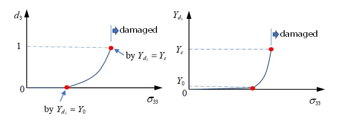
   
*Figure 267:*

After :math:`Y_{0}` is reached, the damage variable starts to increase and when it
reaches 1, :math:`d_{3}=1`
(thermodynamic force :math:`Y_{d_{3}}` at this point then becomes the critical damage
:math:`Y_{c}`). The composite could be considered as fully delaminated and may be
deleted immediately or the stress may be reduced. In PRADIOSS, the
option is used to simulate exponential function stress reduction nd
the stress at :math:`Y_{c}` is :math:`\sigma_{d}(t_{r})` (Stress Decrease in Damage).

The relation with thermodynamic force :math:`Y_{d_{i}}` and :math:`d_{i}` is:

-  If :math:`d\geq 1`, then take *d* =1

-  If *d* <1, then *d* is function of *Y* (damage evaluation law):

.. math:: d=w(Y)=\frac{\left\langle{\sqrt{Y}}-{\sqrt{Y_{0}}}\right\rangle}{\sqrt{Y_{c}}-\sqrt{Y_{0}}}\tag{197}

:math:`Y=Y_{d_{3}}+\gamma_{1}Y_{d_{1}}+\gamma_{2}Y_{d_{2}}\text{with}Y_{d_{i}}\left|=\sup Y_{d_{i}}\right|_{\leq t}`

Here, :math:`\gamma_{1},\gamma_{2}` are
scale factors to consider two other delamination modes. This may be
validated with experiments (DCB and ENF specimen test:sup:`21`). 
   
In the example of Mode I, :math:`\gamma_{1},\gamma_{2}` may be 0 as
this is pure delamination in direction 3 and then :math:`Y=Y_{d_{3}}`
the relation of :math:`Y_{d_{3}}` and :math:`d_{3}` is:

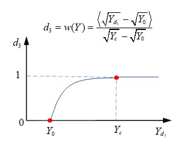

*Figure 268:*

How quickly will the damage variable increase? The damage velocity
:math:`d` (also called *damage evaluation law*) is computed as:

   -  If :math:`d=1`, then :math:`\dot{d}=\textit{const.}`

   -  If :math:`d<1`, then :math:`\dot{d}=\frac{k}{a}\big{[}1-\exp\big{(}-\alpha\big{(}w(Y)-d\big{)}\big{)}\big{]}`

:math:`\frac{k}{a}` is the maximum damage rate, which means
minimum duration of the failure phenomenon. Its reciprocal,
:math:`\frac{a}{k}` is called the *characteristic time*, which
may be obtained with a one-dimension tensile test.

23

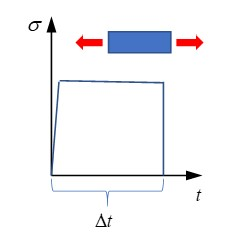

*Figure 269:*

Through tensile sample with different stress to find the minimum time of
composite damage :math:`\Delta `t, the
:math:`\sigma-\Delta t` curve is vertical asymptote
corresponding to the characteristic time :math:`\frac{a}{k}`.

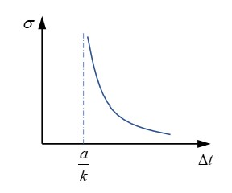

*Figure 270:*

Parameters (a) and (k) govern the damage evaluation law. For example,
with constant parameter (a) (here (a=1)), decreasing values of (k) leads
to more brittle failure of the composite.

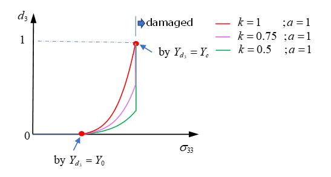

*Figure 271:*

With constant parameter (k) (here (k=1)), increasing values of (a) leads
to more brittle failure of the composite.

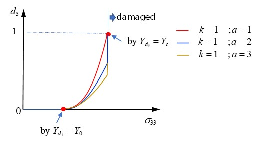

*Figure 272:*

/FAIL/CHANG
-------------

In Chang-Chang failure, two primary failure modes are considered.

-  Fiber mode: composite fails, due to fiber rupture in tension or fiber buckling in compression.

-  Matrix mode: composite fails, due to matrix failure under tension or compression.

This failure criteria is used only for shell elements.

+-------------+---------------------------+-----------------------------------------+
| Damage                                  | If *D* =1, then failure.                |
| criteria                                |                                         |
|                                         | If :math:`0\leq D<1` D,then no failure. |
|                                         |                                         |
|                                         | With :math:`D=Max(e_{f}2,e_{c}2,e_{m}   |
|                                         | 2,e_{d}2)`.                             |
+-------------+---------------------------+-----------------------------------------+
| Fiber       | Tensile fiber mode        | :math:`e_{f}2=\big{(}\frac{\sigma_{11}} |
|             | :math:`\sigma_{11}>0`     | {\sigma_{1}^{t}}\big{)}^{2}+\beta\big{(}|
|             |                           | \frac{\sigma_{12}}{\sigma_{12}}\big{)}  |
| breakage    |                           | ^{2}`                                   |
+             +---------------------------+-----------------------------------------+
|             | Compression fiber mode    | :math:`e_{c}2=\big{(}\frac{\sigma_{11}} |
|             | :math:`\sigma_{11}<0`     | {\sigma_{1}^{c}}\big{)}^{2}`            |
+-------------+---------------------------+-----------------------------------------+
| Matrix      | Tensile matrix mode       | :math:`e_{m}2=\big{(}\frac{\sigma_{11}} |
| cracking    | :math:`\sigma_{22}>0`     | {\sigma_{1}^{t}}\big{)}^{2}+\beta\big{(}|
|             |                           | \frac{\sigma_{12}}{\sigma_{12}}\big{)}  |
|             |                           | ^{2}`                                   |
+             +---------------------------+-----------------------------------------+
|             |                           | :math:`e_{d}2=\big{(}\frac{\sigma_{22}} |
|             |                           | {2\sigma_{12}}\big{)}^{2}+\big{[}\big{(}|
|             |                           | \frac{\sigma_{2}^{c}}{2\sigma_{12}}     |
|             |                           | \big{)}^{2}-1\big{]}\frac{\sigma_{22}}  |
|             |                           | {\sigma_{2}^{c}}+\big{(}\frac           |
|             | Compressive matrix mode   | {\sigma_{12}}{\sigma_{12}}\big{)}^{2}`  |
|             | :math:`\sigma_{22}<0`     |                                         |
+-------------+---------------------------+-----------------------------------------+

Where,

**direction 1** Fiber direction.

:math:`\sigma_{1}^{t},\sigma_{1}^{c}` Fiber tensile/compressive strength.

:math:`\sigma_{2}^{t},\sigma_{2}^{c}` Matrix strength.
Tensile or compressive loading in direction 2 (transverse to direction 1).

:math:`\sigma_{12}` Shear strength in composite ply plane.

:math:`\beta` Shear scale factor, which can be determined experimentally.

Stress Decrease in Damage
~~~~~~~~~~

After reaching the damage criteria:

   • HASHIN:

   :math:`D=Max(F_{1},F_{2},F_{3},F_{4})\geq 1`

   • PUCK:

   :math:`D=Max(e_{f}(tensile),e_{f}(compression),e_{f}(ModeA),e_{f}(ModeB),e_{f}(ModeC))\geq 1`

   • LAD\_DAMA:

   :math:`d\geq 1`

   • CHANG:

   :math:`D=Max(e_{f}2,e_{c}2,e_{m}2,e_{d}2)\geq 1`

Stresses start decreasing and decrease gradually by using an
exponential function to avoid numerical instabilities.

.. math:: \sigma(t)=\sigma_{d}(t_{r})\cdot\text{f}(t)\tag{198}

:math:`=\sigma_{d}(t_{r})\cdot\exp\Big{(}-\frac{t-t_{r}}{t_{\max}}\Big{)}`

with, :math:`t\geq t_{r}`

The option :math:`\tau_{\max}` controls how
gradually the stress is decreased in damage.

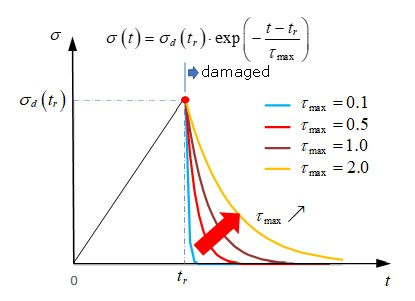

*Figure 273:*

Where,

:math:`\sigma_{d}(t_{r})` Stress components when damage is reached :math:`D\geq 1`.

:math:`t_{r}` Time of :math:`\sigma_{d}(t_{r})`.

:math:`t_{max}`  Time of dynamic relaxation.

   The higher the value of :math:`t_{max}`, the slower stress decreases during damage.
   Normally, it takes 10~20 time step.

17.  Hashin, Z., "Failure Criteria for Unidirectional Fiber Composites," Journal of Applied Mechanics, Vol. 47, 1980, pp. 329-334.

18.  A. Puck, J. Kopp, and M. Knops., “Failure analysis of FRP laminates by means of physically based phenomenological models”. Composites Science Technology, 62. pp. 1633-1662. 2002.

19.  A. Puck, J. Kopp, and M. Knops. “Guidelines for the determination of the parameters in Puck's action plane strength criterion”. Composites Science Technology 62. pp. 371-378. 2002.

20.  L. Gornet, “Finite Element Damage Prediction of Composite Structures”.

21.  Ladevèze, P., Allix, O., Douchin, B., Lévêque, D., “A Computational Method for damage Intensity Prediction in a Laminated Composite Structure”, Computational mechanics—New Trends and Applications In: Idelsohn, S., Oñate E., and Dvorkin E., (eds.) CIMNE, Barcelona, Spain (1998).

22.  Gama B.A., Gillespie J.W., Punch Shear Behavior of Composites at Low and High Rates[M]// Fracture of Nano and Engineering Materials and Structures. Springer Netherlands, 2006.

23.  Allix, O. & Deü, Jean-François. (1997). Delay-damage modeling for fracture prediction of laminated composites under dynamic loading. Engineering Transactions. 45. 29-46.

Connections
============

Spotweld (Bolt or Adhesive Connection)
---------------

There are three different ways of modeling spotwelds:

-  Nodal connection

-  Spring (``/PROP/TYPE13``) connection

-  Solid connection

Spring (``/PROP/TYPE13``) connection and solid connection may also be
used to model a bolted or adhesive connection (glue).

Nodal Connection
~~~~~~~~~~~~

A single interface TYPE2 with the first surface as the main side and
some nodes from the second surface as secondary nodes: With this
solution the mesh of the main surface can be independent of the
spotweld location. Hourglass problems disappear on the main surface.
On the second shell, the surface mesh must respect the spotweld
location and the hourglass problem will remain. The main problem with
this modeling approach is the undeformability of the connection and
its infinite strength.

.. image:: vertopal_7197fe79ded4471fa6ba70c4c62a5530/media/image10.jpg
      :width: 6.40544in
      :height: 3.09336in

*Figure 274: Example of Connection between 2 Shell Surfaces*

Spring (/PROP/TYPE13) Connection
~~~~~~~~~~~~~~~~~~~

Two tied interfaces and a spring: The use of two tied interfaces will
provide a full symmetrical solution allowing a free mesh on the two
surfaces and avoiding hourglass. The spotweld is modeled with a beam
type spring element. The spring element uses independent nodes not
connected directed to the shell elements. One of the two nodes is
located on the first surface (or near to it, there is no need to be
located exactly on the shell surface) and the second node is located
on the second surface. One tied interface connects one spring node
with the first surface and a second tied interface does the same for
the second node on the second surface.

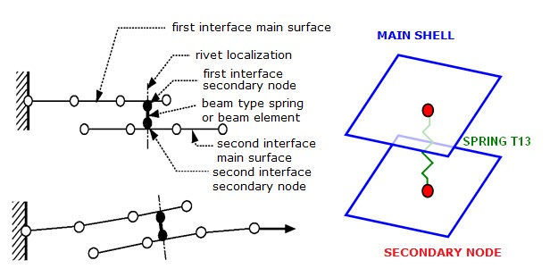

*Figure 275: Spotweld Modeling*

To create a spotweld using this method is a good alternative solution
with this approach the connection location is independent from the
shell mesh. It is more accurate than the above node connection
modeling, since the spotweld properties are input directly for the
spring TYPE13.

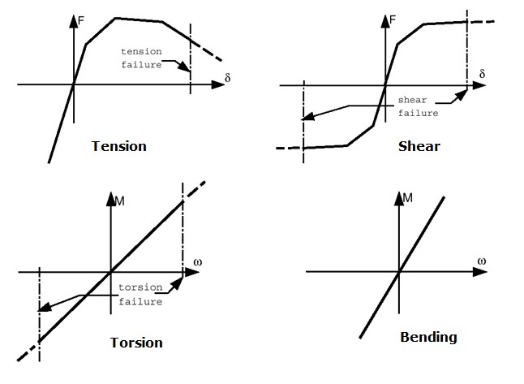

*Figure 276: Spring TYPE13 - Typical Input for Spotweld*

Moreover, there are two different ways to model rupture of the spotweld:

1. Use failure criteria which are available for a spring TYPE13. For more details, see the comments for failure criteria in /PROP/TYPE13 (SPR_BEAM).

2. Use :math:`Spot_{flag}` = 20, 21, or 22 in the Tied Contact (Tied Contact (/INTER/TYPE2)).

      |image1| **Note:** The spring TYPE13 modeling technique for spotwelds
      can also be used for other kinds of connections such as welding 
      lines, hemming, glue and bolts. For bolt modeling, the use of a tied
      interface is not necessary, as the shell nodes can be put directly in
      the rigid bodies. 

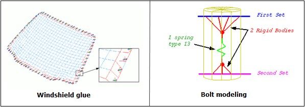

*Figure 277: Glue and Bolt Modeling Examples*

      |image2| **Note:** With a tied interface, the secondary node mass is
      transferred to the main nodes, if :math:`Spot_{flag}` is set to 1. The
      secondary node inertia is equally distributed over the main nodes by
      adding mass, so that the induced inertia (at the center of the main 
      surface) is equal to the inertia of the secondary node. If the main 
      surface is a perfect square, the added mass is computed as:

:math:`l_{s}=4\Delta m\cdot L^{2}`

      :math:`\Delta m`   : added mass

      :math:`L` : distance between the main node and the center

      :math:`l_{s}`   : inertia of the secondary node

As long as the secondary node inertia is realistic, the added mass
will be very small. A large added mass is observed if the secondary
node is too great a distance from the main surface. The ideal is for
the secondary node to lie on the main surface plane, right at its
center. If this is not the case, the secondary node has inertia at
the center of the shell surface:

:math:`l_{s}=m_{s}\cdot L_{s}2`

      :math:`m_{s}` Secondary node mass

      :math:`L_{s}`  Distance between the secondary node and the center

      :math:`l_{s}`  Inertia of the secondary node

Consequently, a new added mass is set to the main nodes, so that the
inertia (due to this new added mass) is equal to the inertia, due to
the off-centering of the secondary node.

.. math:: 4\Delta m\cdot L^{2}=m_{s}\cdot L_{s2}\tag{199}

If :math:`Spot_{flag} =0` , there is no added mass, since the secondary node
inertia instead is transferred as inertia to the main node. An added
inertia that is too large will seriously decrease the accuracy.

| **See Also**
| RD-E: 4802 Solid and Spring Spotweld in Crash Box

Solid Spotweld
------------

Uses 8-node brick element (with ``/PROP/TYPE43``) and
``/MAT/LAW59``+ ``/FAIL/CONNECT`` (or ``/MAT/LAW83``+ ``/FAIL/SNCONNECT``) to model
solid spotwelds, which may provide more accurate results.

Solid Element and Property
~~~~~~~~~~~~~~

The brick element uses ``/PROP/TYPE43`` and it has 4 integration points
on the shear plane, which is between plane (1, 2, 3, 4) and plane (5,
6, 7, 8). There is one integration point in normal direction *t*.

This element type does not have a time step itself and its stability
is ensured by its nodal connections. This means that the thickness of
spotweld can be very small. This characteristic is very useful for
modeling glue.

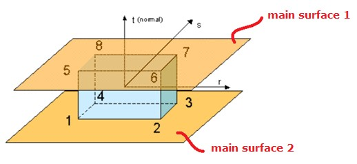

*Figure 278:*

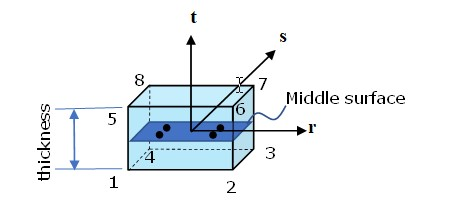

*Figure 279:*

Connected to Shell Sheet
~~~~~~~~~~~~~~~~~~~~~~~~

``/INTER/TYPE2`` may be used to connect solid spotwelds with two (upper
and lower) main surfaces. Nodes of plane (1,2,3,4) tied on one shell,
and nodes of plane (5,6,7,8) tied on another shell. It is not allowed
to have any other plane (for example, plane (1,4,8,5)) tied on a shell.

Material and Failure Model
~~~~~~~~~~~~~~~~~~~~~~~~~~

Solid spotwelds in PRADIOSS may be modeled with
``/MAT/LAW59``+ ``/FAIL/CONNECT`` (or ``/MAT/LAW83``+ ``/FAIL/SNCONNECT``). This
material model should be validated with four load cases of spotweld
tests.

-  Shear test (angle of loading and spotweld upper surface is 0 degrees below named 0 degree test)

-  Normal tensile test (90 degree test),

-  Shear and normal combined test (for example, 30 degree test, 45 degree test or 90 degree test)

-  Moment test (peel test)

E-Modulus
~~~~~~~~~

The stiffness of the spotweld in different tests is different. In the
normal test, it is lower than in the shear test, due to deformation
of the upper and lower sheets. Therefore, normally the stiffness
measured is taken from true stress versus displacement curve of the
shear test.

/MAT/LAW59+/FAIL/CONNECT
~~~~~~~~~~~~~~~~~~~~~~~~

-  Material yield curve:

      In LAW59, spotweld material yield curves in normal direction and in
      shear direction are requested. The yield curve (:math:`Y\_fct\_ID_{N}`) in
      normal direction may be determined from the normal tensile test (90
      degree test) and the yield curve (:math:`Y\_fct\_ID_{T}`) in shear direction
      may be determined from the shear test (0 degree test).

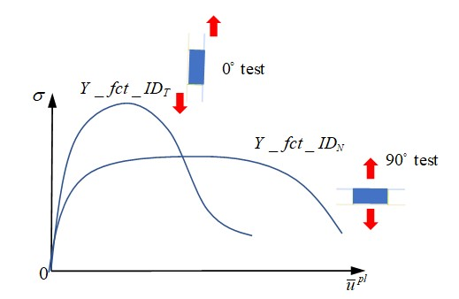

*Figure 280:*

   In this case, the maximum stress is also described inside the curves.
   Given the reference displacement rate :math:`SR_{ref}`  of the input yield curve,
   PRADIOSS will consider the displacement rate effect with respect to
   this reference displacement rate.

-  Spotweld failure:

   Solid spotweld damage and failure may be considered with
   ``/FAIL/CONNECT``. Displacement criteria and/or energy criteria may be
   used to describe the failure of the spotweld.

   ◦ For displacement criteria, failure occurs when the normal displacement or shear displacement is reached according to 2 alternative behavior types:

      ∙ Uncoupled failure (:math:`I_{fail} =0`: uni-directional failure)

.. math:: \overline{n}_{i}\cdot\mathrm{f}(\overline{u})>\overline{n}_{maxi}\tag{200}

with *i* = 33 for normal direction and *i* = 13 or 23 for tangent directions.

In the normal tensile test (90 degree test), element fails once
user-defined maximum displacement :math:`\overline{n}_{max N}` is reached.

In the shear tensile test (0 degree test), element fails once
user-defined maximum displacement :math:`\overline{n}_{max T}` is reached.

   .. image:: vertopal_7197fe79ded4471fa6ba70c4c62a5530/media/image18.jpg
      :width: 3.65865in
      :height: 2.32521in

*Figure 281:*   

In a combined mode test (for example, 30 degree test or 60 degree
test), failure in the solid spotweld does not consider shear and
normal combined stress effect. Failure in each direction is
considered separately. The element fails as soon as either of these
two stresses reaches its corresponding maximum displacement. To
consider combined stresses, instead set :math:`I_{fail} =1` and combined
stress effect will be then considered.

∙ Coupled failure (:math:`I_{fail} =1`: multi-directional failure)

.. math:: \left\|\frac{\overline{n}_{N}}{\overline{n}_{\max N}}\cdot\alpha_{N}\cdot \mathrm{f}_{N}(\overline{u}_{N})\right\|^{\exp_{N}}+\left\|\frac{\overline{n}_{T}}{\overline{n}_{\max_{T}}}\cdot\alpha_{T}\cdot\mathrm{f}_{T}(\overline{u}_{T})\right\|^{\exp_{T}}>1 \tag{201}

With :math:`I_{fail} =1`, in combined mode test, the element fails before
reaching the maximum stress or which is closer to reality. To
describe the curve failure surface you need at
least 4 different combined tests to fit the parameters :math:`a_{N},a_{T},\exp_{N},\exp_{T}.`

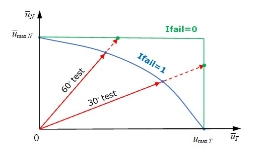

*Figure 282: Failure surface*

   ◦ For energy criteria, failure occurs when the internal energy in normal direction or internal energy in shear direction is reached, corresponding to maximum internal energy :math:`EN_{max},ET_{max}.`

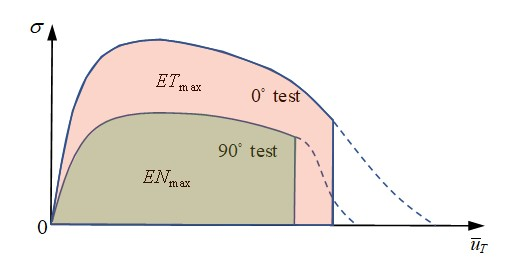

*Figure 283:*

In a combined mode test, element failure is also considered with
respect to the multi-direction effect on internal energy. If internal
energy in normal direction and in shear direction are input, the
element fails, if satisfied via:

.. math:: \left(\frac{En}{EN_{\text{max}}}\right)^{N_{n}}+\left(\frac{Et}{ET_{\text{max}}}\right)^{N_{t}}\geq 1\tag{202}

To input only total internal energy :math:`EI_{max,}` , the element fails, if satisfied via:

.. math:: \frac{E(t)}{EI_{\text{max}}}\geq 1\tag{203}

If both :math:`EI_{max}` and :math:`EN_{max,}ET_{max}` are  input, the element fails, due to whichever of these two
criteria is reached first.
Both displacement criteria and energy criteria may be defined. The
element fails, due to whichever criteria is reached first. The
element deletion occurs when one integration point reaches the
failure criteria, if :math:`I_{solid} =1` or when all integration points
reach the failure criteria, if :math:`I_{solid} =2`.

   • Spotweld softening:

After reaching the failure criteria (either displacement criteria or
energy criteria) stress is reduced to 0 directly or may be gradually
controlled with parameters :math:`T_{max}` and :math:`N_{soft}` with:

.. math:: \sigma=\sigma_{f}\left(1-\frac{D}{T_{\text{max}}}\right)^{N_{soft}}\tag{204}

|image3|

*Figure 284:*

Figure 285 shows the effect of different :math:`T_{max}`and :math:`N_{soft}` on stress reduction behavior. 

.. image:: vertopal_7197fe79ded4471fa6ba70c4c62a5530/media/image24.jpg
      :width: 6.66667in
      :height: 1.6244in

*Figure 285:*

/MAT/LAW83+/FAIL/SNCONNECT
~~~~~~~~~~~~~

   • Material yield curve:

In LAW83, the spotweld material curve may be input with
:math:`fct\_ID_{1}`. Where in LAW59 input, two yield curves for normal
direction and shear direction are required, LAW83 uses just one
curve. This curve should take the yield curve from shear test.
Furthermore, the yield curve :math:`fct\_ID_{1}` for LAW83 is not
defined as true stress versus plastic displacement (as in LAW59), but
should be a normalized stress versus plastic displacement curve.
Yield stress is normalized by maximum stress which are input as
parameters :math:`R_{N,}R_{S}` in LAW83

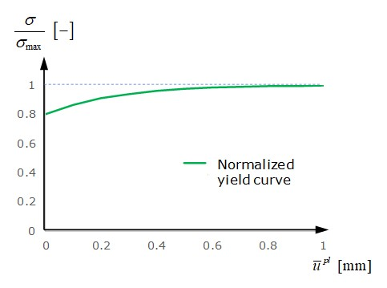

*Figure 286:*

The yield curve is different due to different combinations of normal
stress and shear stress in the spotweld. This may be described with
parameter :math:`\beta` in LAW83 (it is not considered in LAW59). The normalized
yield stress in LAW83 is:

.. math:: \sigma_{y}=\left[\left(\frac{\sigma_{n}}{R_{N}\cdot\mathrm{f}_{N}(1-\alpha\cdot\mathrm{sym})}\right)^{\beta}+\left(\frac{\sigma_{s}}{R_{S}\cdot\mathrm{f}_{S}}\right)^{\beta}\right]^{\frac{1}{\beta}}\tag{205}

In cases where the moment effect is not considered, the normalized
yield stress in LAW83 is:

.. math:: \sigma_{y}=\left[\left(\frac{\sigma_{n}}{R_{N}\cdot\mathrm{f}_{N}}\right)^{\beta}+\left(\frac{\sigma_{s}}{R_{S}\cdot\mathrm{f}_{S}}\right)^{\beta}\right]^{\frac{1}{\beta}}\tag{206}

Figure 287 shows the difference of normalized maximum stress in
combined tests between LAW83 and LAW59.

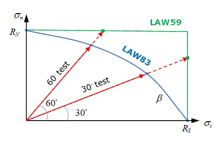

*Figure 287:*

Figure 288 shows the effect of varying :math:`\beta` on normalized maximun stress in combined tests using LAW83.

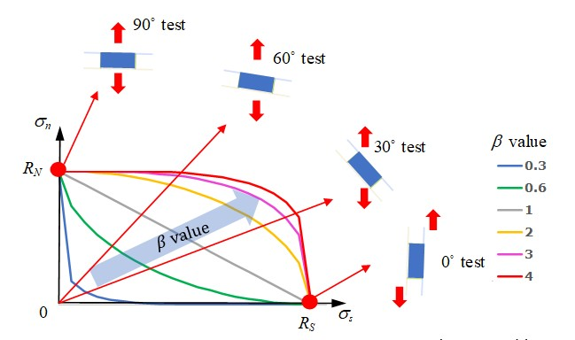

*Figure 288:*

Parameter *a* is used to describe the moment effect in the spotweld.

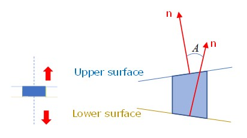

*Figure 289: Non-central tensile test (peel test)*

Use *a* to reduce the maximum stress of peel test. is the sin of the
angle between the spotweld upper surface and lower surface. It is
changed during spotweld deformation and is in range of [-1,1]. The
parameter may be fitted with a simple FEM model to match the real
experiment data. :sup:`24`

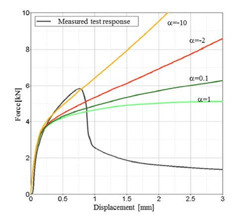

*Figure 290: Different a effects on peel test on force versus displacement*

   The displacement rate effect on the material yield curve may also be
   considered with curve inputs :math:`fct\_ID_{N}` and :math:`fct\_ID_{S}`.

   • Material damage and failure:

   For spotweld failure, ``/FAIL/SNCONNECT`` may be used. In this failure  
   model, the plastic displacement (in both normal and shear directions)
   of damage beginning and failure are needed.

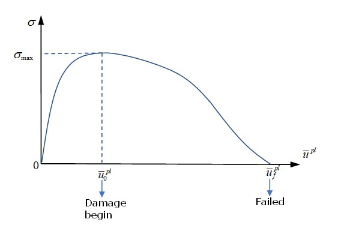

*Figure 291:*

For a combined mode test, similar to maximum stress in LAW83, is needed
to describe plastic displacement at damage beginning and to
describe plastic displacement at failure.

|image4|

*Figure 292:*

For spotwelds with moment (peel test), similar to maximum stress in
LAW83, :math:`\beta_{0}` is needed to describe plastic displacement at damage beginning
during the peel test and :math:`\beta_{f}` to describe plastic displacement at failure of
peel test.

*Table 20: General Capability of the Two Spotweld Modeling Approaches*

+-----------+-------------+-------------+-------------+---------------+
|                         | **/MAT/LAW59              |               |
|                         | +/FAIL/CONNECT**          |               |
|                         |                           | **/MAT/LAW    |
|                         |                           | 83+/FAIL/**   |
|                         |                           |               |
|                         |                           |               |
|                         |                           | **SNCONNECT** |
+===========+=============+=============+=============+===============+
| Yield curve             |    Two                    | One normalized|
|                         |    yield                  |               |
|                         |    curves                 | yield curve   |
|                         |    (in                    | with          |
|                         |    normal                 |               |
|                         |    and                    | maximum stress|
|                         |    shear                  | :math:`R_{N,} |
|                         |    directions)            | R_{S}`        |
+-----------+-------------+-------------+-------------+---------------+
| Maximum                 |    Normal                 | Use *a* to    |
| stress in               |    and                    | consider      |
| combined                |    shear                  |               |
| mode test               |    effect                 | normal and    |
|                         |    in                     | shear         |
|                         |    combined               |               |
|                         |                           | effect in     |
|                         |    test not               | combined      |
|                         |    considered.            |               |
|                         |                           | mode tests.   |
+-----------+-------------+-------------+-------------+---------------+
| Failure   | Failure     | Displacement| Un          | Displacement  |
|           | criteria    |             | i-direction | criteria,     |
|           |             | criteria    | failure     |               |
|           |             |             |             |               |
|           |             |             |             |               |
|           |             |             | Mult        | Mult          |
|           |             |             | i-direction | i-direction   |
|           |             |             | failure     | failure       |
+           +             +-------------+-------------+               +
|           |             | Energy      | Un          |               |
|           |             | criteria    | i-direction |               |
|           |             |             | failure     |               |
|           |             |             |             |               |
|           |             |             | Mult        |               |
|           |             |             | i-direction |               |
|           |             |             |             |               |
|           |             |             | failure     |               |
+           +-------------+-------------+-------------+---------------+
|           | Failure in  | Pro portionally controlled|               |
|           |             |                           |               |
|           | combined    | with :math:`a_{T},a_{N},  |               |
|           | mode test   | \exp_{T},\exp_{N}` in     |Controlled with|
|           |             | displacement              |:math:`\beta   |
|           |             |                           |_{0},\beta_{f}`|
|           |             | criteria and with :math:`N|               |
|           |             | _{n},N_{t}` in energy     |               |
|           |             | criteria.                 |               |
+           +-------------+-------------+-------------+---------------+
|           | Moment      | No                        | Controlled    |
|           | effect      | control in input          | with          |
|           | (peel test) |                           | :math:`a_{0}, |
|           |             |                           | a_{f}`        |
+           +-------------+-------------+-------------+---------------+
|           | Softening   | With                      | With reference|
|           |             | (stress                   |               |
|           |             | curve decreases)          | to damage     |
|           |             |                           | displacement  |
|           |             |                           |               |
|           |             |                           | and failure   |
|           |             |                           | displacement  |
|           |             |                           |               |
|           |             |                           | (stress       |
|           |             |                           | linear        |
|           |             |                           | decrease)     |
+-----------+-------------+-------------+-------------+---------------+

24.    Pasligh, N., Schilling, R., and Bulla, M., "Modeling of Rivets Using a Cohesive Approach for Crash Simulation of Vehicles in PRADIOSS," SAE Int. J. Trans. Safety 5(2):2017, doi:10.4271/2017-01-1472

Bolt Modeling for Crash
------------

There are different ways for modeling bolt connection, and more
detailed model accuracy of the results:

-  Rigid bolt

-  Rigid bolt with spring (and pretension)

-  Deformable bolt with spring and pretension

-  Deformable bolt with initial stress

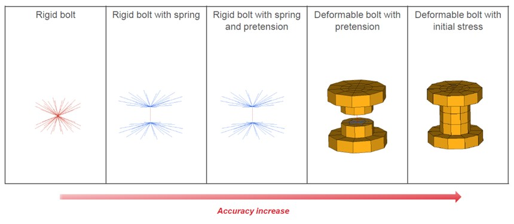

*Figure 293: Bolt Modeling Methods*

Rigid Bolt
~~~~~~~~

Use one rigid body (``/RBODY``) connected to the parts where the bolt is
linked is the simplest method. Although this method is very stable
and easy to modeling, you cannot consider pretension, elastoplastic
and rupture behavior for bolt, and there is no force output and model
the bolt head passing through the hole is not possible.

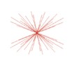

*Figure 294: Rigid Bolt Modeling Method*

         |image5| **Note:** The main node should be a free node. 

Rigid Bolt with Spring (and Pretension)
~~~~~~~~~~~~~~~~~~~

Use two rigid bodies (``/RBODY``) connected to each set of parts which
are linked with the bolt and then set one spring element
(``/PROP/SPR_BEAM``) between both rigid bodies. With this method it is
possible to describe the elasto-plastic behavior rupture behavior in
any direction, and the force passing through the bolt (normal force,
shear force, moments) could be output, using ``/TH/SPRING``. This method
is often used in the automotive crash analysis, but it has limited
capability to model the pretension.

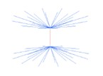

*Figure 295: Rigid Bolt with Spring*

   |image6| **Note:** 

            1. The main node should be a free node.

            2. The spring element is attached to the rigid bodies as secondary node. 

To describe pretension with this method another two spring elements
(``/PROP/SPR_PRE`` and ``/PROP/ SPR_BEAM``) need to be added. ``/IMPDISP`` or
``/CLOAD`` could be used to simulate preloading. Auto-balance state is
calculated by PRADIOSS.

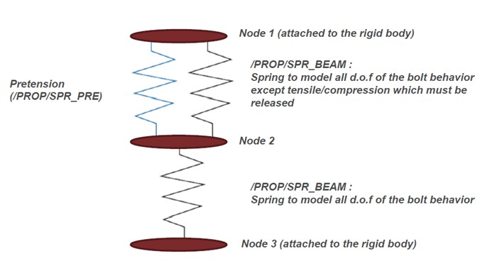

*Figure 296: Modeling Pretension with Springs*

Deformable Bolt with Spring and Pretension
~~~~~~~~~~~~~~~

Meshed bolt with solid elements (``/BRICK`` or any other solid element
type) and cut in the middle.
Two rigid bodies connected to each side of meshed bolt and spring
series (two springs with ``/PROP/SPR_BEAM`` and one spring with
``/PROP/SPR_PRE``) like above between rigid bodies are used to describe
the pretension. With this more detailed model, the bolt head passing
through the hole could be considered in simulate.

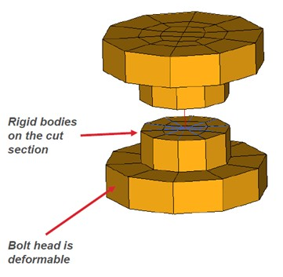

*Figure 297: Deformable Bolt with Spring and Pretension*

Deformable Bolt with Initial Stress
~~~~~~~~~~~~~~~~~

With this method, bolt is fully-meshed with solid elements (``/BRICK``),
which is more realistic, and the material and failure character could
be easily defined. Use ``/SECT`` to get section force/moment (``/TH/SECT``)
in bolt. To define the pretension, initial stress (``/INIBRI/STRS_F``) is
needed to get an initial analysis (tensile test on the bolt).

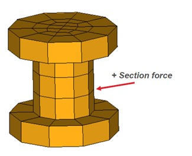

*Figure 298: Fully-meshed Deformable Bolt*

   |image7| **Note:** 

            1. The rupture and stress accuracy depend of the mesh size.

            2. Section force in the bolt is necessary to measure the forces passing through the hole. 

Kinematic Constraints
------------

In PRADIOSS, a kinematic condition is a nodal constraint applied to a
set of nodes.

There are several different types of nodal constraints:

-  Rigid Wall

-  Rigid Body

-  Boundary Conditions

-  Tied Interface

-  Cylindrical Joint

-  Rigid Link

-  Gear Type Joint

Numerical methods available in PRADIOSS that apply to the kinematic conditions are:

    :Penalty method: Rigid walls

    :Main secondary kinematic condition: Interface TYPE2, rigid body

    :Local kinematic condition: Rigid link, cylindrical joint

    :Lagrange multiplier: Old and new interfaces, rigid wall, rigid body, etc.

Rigid Body (/RBODY)
-------------------

A rigid body is defined by a set of secondary nodes and a main node.
It can be compared to a part with an infinite stiffness. No relative
displacement is allowed between secondary nodes, and the general
motion of the rigid body manages the main node.

As a kinematic condition is applied on each secondary nodes and for
all directions, no other nodal constraint is allowed. However, in the
case of the Lagrange Multiplier method, the solution can be found if
no incompatible kinematic conditions are applied.

Four options are available to position the center of gravity of the rigid body:

    :Case 1:  COG is computed with secondary and main nodes mass and coordinates Rigid body mass is the sum of the added  mass and secondary node mass

    :Case 2: COG is computed with secondary nodes mass and coordinates only Rigid body mass is the sum of the added mass and secondary node mass

    :Case 3: COG is set at main node's coordinates 

    :Case 4: Rigid body mass is the sum of the added mass and secondary node mass COG is set at main node's coordinates Rigid body mass is equal to the added mass 

It is strongly recommended to use an artificial node (not part of an
element) as a main node, since PRADIOSS Starter is likely to move the
main node. The main node is moved by PRADIOSS Starter to the center of
gravity; unless the *ICoG* flag is set to 3 or 4. It is advised to
set *ICoG* to 2 to get the most realistic behavior; the center of
gravity is then computed taking into account only the secondary
nodes. If *ICoG* is set to 1, the main node, with its own mass, is
included to compute the center of gravity.

If the main node is initially set to the center of gravity, the
behavior using *ICoG* = 1 or 2 is similar.

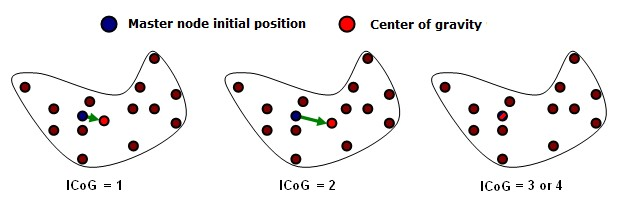

*Figure 299: Center of Gravity Computation*

In a car crash simulation, rigid bodies are largely used and three
typical uses of rigid bodies can be distinguished:

-  Rigid body covering a part of a finite element model, including shells, solids or other elements: In this case, the mass of secondary nodes gives the total rigid body mass and no added mass is needed. The main node can be located anywhere, and it will be moved to the center of mass. This kind of rigid body saves a large amount of CPU time.

-  Rigid body representing a non-modeled component connected on some structural nodes: In this case, only a few number of secondary nodes are used to connect the rigid body to the finite element model. The mass and inertia are added and the main node is located at the component center of mass. The main node will only move a little, taking into account the mass of the secondary nodes. In some cases, a dummy mesh is used to visualize the rigid body or to simulate the contacts, but if the dummy elements have a small mass, the previous remarks are still true.

-  Rigid body used to connect two or more parts together: For these rigid bodies no added mass is needed and the main node can be located anywhere. A spherical inertia must be used for these rigid bodies; as these rigid bodies are usually very small (4 to 8 nodes), the inertia is often very small in one direction and very large for one specific direction. This may lead to instability; therefore, through the use of spherical inertia, inertia will be identical for any direction.

Activation/Deactivation
~~~~~~~~~~~~

Rigid bodies can be activated or deactivated with ``/SENSOR`` or using
the ``/RBODY/ON`` or ``/RBODY/OFF`` Engine options.

To activate two rigid bodies with the main node 1 and 2, add the
following option in ``Rootname_0001.rad``:

    :/RBODY/ON: 1 2 

                All elements included in both rigid body are deactivated. 
                To deactivate one rigid body whose main node ID is 3, add:

    :/RBODY/OFF:  3 

                  All elements are reactivated, strains and stresses are those from previous deactivation time. 

Rigid Body Motions
~~~~~~~~~~~~

One of the main uses of rigid body activation and deactivation
concerns the roll-over motions, as in rollover simulations. During
the free flight of the car, the elements deformation can be
neglected. A large part of CPU time can be saved if the whole
structure is replaced with a temporary rigid body during the fly.
Before the impact on the ground, this rigid body is deactivated and
eventually activated again after rebound. 
   
Engine

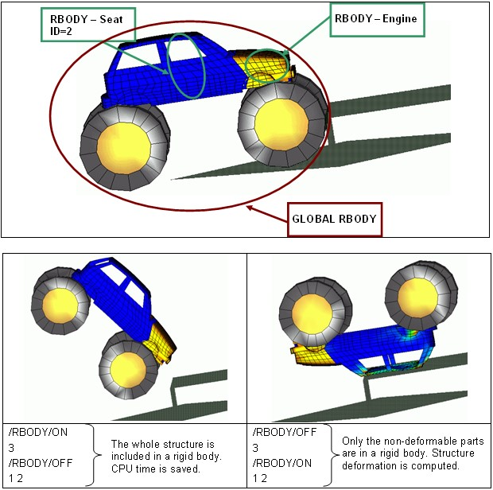

*Figure 300: Activation - Deactivation of Rigid Bodies in a Roll-Over Example*

Initial Static Equilibrium
~~~~~~~~~~~ 

Another use of rigid body activation and deactivation is for initial
static equilibrium, where only gravity is applied. In a crash
analysis, it may be of interest to set the whole car in equilibrium
over the suspension, and the dummy on the seat. For an explicit
analysis, it takes a long time to reach a static equilibrium;
consequently using a large rigid body allows a solution to be
obtained faster. However, in this case the deformation in a car or in
a dummy under gravity is neglected and validity of this assumption
needs to be carefully watched.

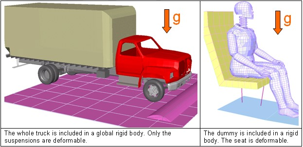

*Figure 301: Static Equilibrium Examples*

Merge Rigid Bodies
~~~~~~~~~~~~~

The /MERGE/RBODY option can be used to merge rigid bodies together or
add secondary nodes to an existing rigid body. The secondary entities
defined become secondary to a main rigid body. The secondary entities
can be rigid bodies, single nodes, or node sets. Multiple secondary
entities can be merged into one main rigid body by defining multiple
lines in ``/MERGE/RBODY``.

Some use cases include merging two different assemblies defined in
two separate include files by defining the merge in the main input
file. This can also be useful when separate parts defined as rigid
need to be merged into one rigid body to model a complex component
like an engine.

The main rigid body defined in ``/MERGE/RBODY`` can be defined as a
secondary rigid body in another

``/MERGE/RBODY``. However, complex hierarchies should be avoided as they
can become difficult to debug. The secondary entities can only be
defined in one /MERGE/RBODY and not in any ``/RBODY``; otherwise,
incompatible kinematic conditions occur.

Before merging, the inertia, mass, and center of gravity of each the
secondary and main rigid body is calculated based on their ``/RBODY``
properties. Next, the secondary entities are merged to the main rigid
body and new rigid body properties are calculated based on the
``/MERGE/RBODY`` *Iflag* option.

Rigid Wall (/RWALL)
--------------

A rigid wall is a nodal constraint applied to a set of secondary
nodes in order to avoid the node penetration to the wall. If contact
is detected, then the secondary node acceleration and velocity are
modified.

There is no gap to determine whether or not a secondary node is in
contact. Contact occurs only when the secondary node impacts the
rigid wall surface. The secondary node's tangential velocity can also
be modified depending on the flag *Slide*. The default value (=0)
enables the model pure sliding during contact. If set to 1, no
sliding is allowed, the secondary nodes are "tied" in the tangential
direction. If set to 2, friction based on Coulomb model is enabled.

Four types of rigid walls are available in PRADIOSS:

-  Infinite rigid wall

-  Infinite cylindrical wall

-  Spherical wall

-  Finite planar wall

The rigid walls can be *fixed* or *moving*. A fixed wall is a pure
kinematic condition on all impacted nodes; whereas a moving wall is
similar to a main secondary option. A main node defines the wall
position at each time step and imposes velocity on impacted secondary
nodes. Impacted secondary node forces are applied to main node. The
secondary node forces are computed with momentum conservation. The
mass of a secondary node is not transmitted to a main node, assuming
a large rigid wall mass compared to impacted secondary nodes mass.

Infinite Rigid Wall
~~~~~~~~~~~~~~~

An infinite rigid wall is a planar surface which extends to infinity.
It is defined by two points representing the rigid wall normal
(Figure 302).

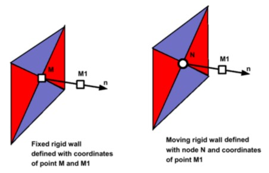

*Figure 302: Infinite Rigid Wall*

Infinite Cylindrical Wall
~~~~~~~~~~~~~~~~~~~~~~~~~

An infinite cylindrical wall is a cylinder which extends to infinity.
It is defined with two points (or one point and one node) and a
diameter.

      |image8| **Note:** contact is only possible from outside the cylindrical wall. 

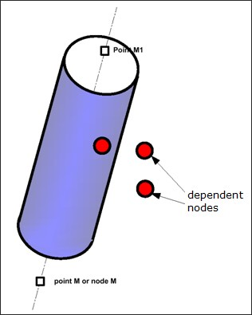

*Figure 303: Infinite Cylindrical Wall*

Spherical Wall
~~~~~~~~~~~~~~

A spherical wall is a sphere defined by a point *M* (or a node *N*)
and a diameter.

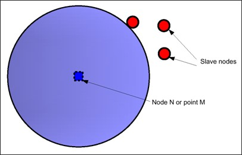

*Figure 304: Spherical Wall*

Finite Planar Wall
~~~~~~~~~~~~~~~~~~

A finite planar wall is a parallelogram defined by three points M, M1
and M2. In case of a moving wall, M will be considered as the main node.

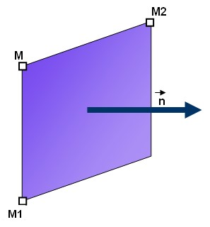

*Figure 305: Finite Planar Rigid Wall*

Comments
~~~~~~~~

1. During the simulation of a moving wall is following the main node *N* but the wall orientation remains constant and parallel to initial normal. A moving rigid wall does not respect the moment equilibrium, only force equilibrium is applied. An external moment is; therefore, applied from laboratory to the wall.

2. If the secondary nodes are defined with a distance from the wall only, the nodes with positive or zero distance are considered (that is the nodes behind the infinite wall or in the cylinder wall are not considered as secondary).

3. A node initially impacted into a wall cannot rebound; except if the rebound velocity is high enough to go out from the wall in only one cycle.

4. If a random noise is added to the node coordinates, the initial position of secondary nodes are modified and for a moving wall, the wall location is changed. Therefore, it is possible that some secondary nodes with zero or near zero distance from the wall move inside the wall. If secondary nodes are defined with a distance, these nodes are not secondary nodes. If these nodes are explicit secondary nodes, they will stay inside the wall without possible rebound.

5. With random noise (/RANDOM) the orientation of a moving wall is also affected. Location of main node *N* is moved with random value and the normal defined with node *N* and point M1 is changed. This is especially critical if point M1 is close to point *N*.

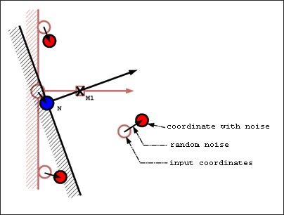

*Figure 306: Change in Wall Orientation, Due to Random Noise*

Tied Contact (/INTER/TYPE2)
-------------------

Interface TYPE2, also called *tied interface* is a nodal constraint
to rigidly connect a set of secondary nodes to a main surface. The
secondary nodes forces and moments are transferred to the main nodes,
and then secondary nodes are positioned kinematically according to
the motion of the main nodes.

This interface ensures a full force and moment equilibrium.

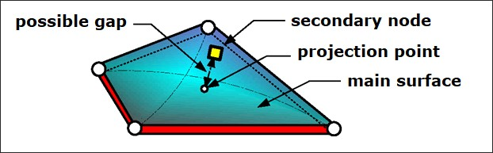

*Figure 307: Interface TYPE2 - Tied*

There are four formulations are available to describe this
connection.

-  Default spotweld formulation

-  Optimized spotweld formulation

-  Formulation with failure

-  Penalty formulation

Default Spotweld Formulation
~~~~~~~~~~~~~~~

:math:`Spot_{flag} =0`

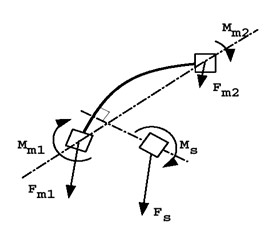

*Figure 308:*

When the flag is set to 0, the spotflag formulation is a default
formulation:

-  Based on element shape functions

-  Generate hourglass with under-integrated elements

-  Give a connection stiffness function of secondary node localization

-  Recommended with fully-integrated shells (main)

-  Recommended for connecting brick secondary nodes to brick main segments (mesh transition without rotational freedom)

Optimized Spotweld Formulation
~~~~~~~~~~~~~

:math:`Spot_{flag} =1`

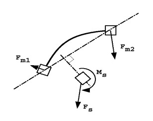

*Figure 309:*

When the flag is set to 1, the spotflag formulation is an optimized
formulation:

-  Based on element mean rigid motion

-  No hourglass problem

-  Constant connection stiffness

-  Recommended with under-integrated shells (main)

-  Recommended for connecting beam, spring, and shell secondary nodes to brick main segments

Formulation with Failure
~~~~~~~~~~~~

:math:`Spot_{flag}` =20, 21 and 22

Using these options, these two failure criteria can be defined:

*Rupt= 0 (independent rupture parameters):*

       Failure when *Max_N_Dist* or *Max_T_Dist* are reached (default)

*Rupt= 1 (coupled rupture parameters):*

       Failure when :math:`\sqrt{\left(\frac{N\_Dist}{Max\_N\_Dist}\right)^{2}+\left(\frac{T\_Dist}{Max\_T\_Dist}\right)^{2}}>1`

During the computation, a normal stress, shear stress, normal
displacement and tangential displacement are computed and compared to
the maximum values defined in the interface. As soon as the maximum
criteria have been reached, the normal stress and shear stress will
be set to 0.

Penalty Formulation
~~~~~~~~~~~~~

:math:`Spot_{flag} = 25`

The main goal for interface TYPE2 using penalty method is to tie
secondary node to main segment without any kinematic constraints.
Using the penalty method may avoid

+---------------------------------------+
| "INCOMPATIBLE KINEMATIC CONDITIONS"   |
|                                       |
|   .                                   |
+---------------------------------------+

Cylindrical Joint (/CYL_JOINT)
------------------

A cylindrical joint is like a rigid body, except that one specific
direction is defined with the first two secondary nodes. All nodes
are free to move along this direction and to rotate around it.

A kinetic condition is applied on all secondary nodes, including the
first two defining the privileged direction No main node is used.

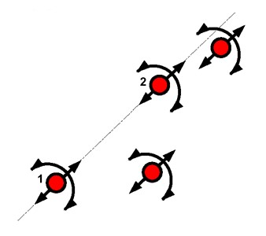

*Figure 310: Cylindrical Joint*

If all the secondary nodes are initially aligned, they will always
remain aligned. As visualized in Figure 310, the rotation freedom is
a local rotation for each node and not a global rotation around axis
1-2. Therefore, it is recommended to use a cylindrical joint with
aligned nodes.

.. image:: vertopal_7197fe79ded4471fa6ba70c4c62a5530/media/image55.jpg
      :width: 2.58301in
      :height: 2.40594in

*Figure 311: Door Hinge Example*

Figure 311 shows how a hinge could be modeled using a cylindrical
joint. The cylindrical joint is made of nodes 2, 5, 3 and 4. Note
that in hinge modeling nodes must be aligned to get a realistic
rotation, then beams or any other finite elements are used to connect
nodes 1-2, 2-5, 4-3 and nodes 3-6. Finally, it is possible to link
nodes 2-3 with a nonlinear elastic spring to improve the connection.

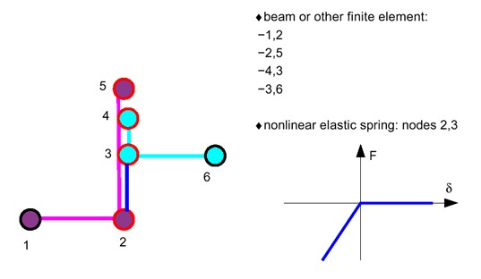

*Figure 312: Hinge Modelization*

Rigid Link (/RLINK)
------------

The rigid link option imposes the same velocity on all secondary
nodes for one or more directions.
Directions are defined to a skew or a global frame, velocity is
computed with momentum conservation.

No global moment equilibrium is respected. A rigid link is equivalent
to an infinite stiff spring TYPE8.

         |image9| **Note:** A rigid link is a PRADIOSS Engine input. A rigid link is alive only during the current restart run. For permanent rigid bodies, the input has to be repeated in each Engine input deck.

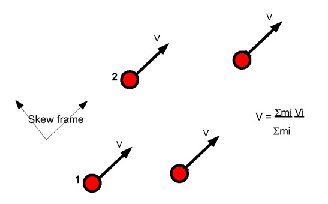

*Figure 313: Rigid Link Model*

Multi-Point Constraints (/MPC)
----------------

Gear type joints are more complex than other kinematic joints. They
use the Lagrange Multiplier method and are compatible with all other
Lagrange Multiplier kinematic conditions and incompatible with all
classical kinematic conditions.

Three examples of these joints are explained:

-  Rotational gear type joint

-  Rack and pinion joint

-  Differential gear joint

Mass and inertia may be added to all nodes. MPC joints impose
relations between nodes velocities. The MPC cannot be applied to the
translational degrees of freedom of a node without mass or the
rotational degrees of freedom of a node without inertia.

Rotational Gear Type Joint
~~~~~~~~~~~~~~~~~~~~

This joint is used to impose a rotational velocity relation between
input and output node as:

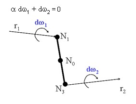

*Figure 314: Rotational Type Joint*

Translational velocities of gear joint nodes are constrained by a
rigid link relation. For the rotational degrees of freedom, a scale
factor is imposed between velocities of nodes *N*\ :sub:`1` and
*N*\ :sub:`2`, measured in their local coordinates. The corresponding
constraint equations are:

:math:`d\big{(}\Delta\omega_{1}\cdot r_{1}\big{)}+\big{(}\Delta\omega_{2}\cdot r_{2}\big{)}=0`

:math:`\Delta\omega_{1}\cdot s_{1}=0, \Delta\omega_{2}\cdot s_{2}=0\Delta\omega_{1}\cdot t_{1}=0, \Delta\omega_{2}\cdot t_{2}=0`

Where, :math:`\Delta\omega_{1}=\omega_{1}-\omega_{0},`
:math:`\Delta\omega_{2}=\omega_{2}-\omega_{0}`
are relative rotational velocities of nodes :math:`N_{1}` and :math:`N_{2}` in
respect of the rigid body rotational velocity.

Rack and Pinion Joint
~~~~~~~~~~~~~~~~~~~~~

This joint allows the rotational velocity of node to be transformed
to a translational velocity as:

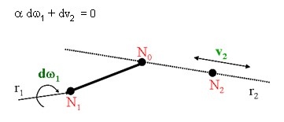

*Figure 315: Rack and Pinion Type Joint*

The constraint equations for these velocities are:

.. math:: \Delta\omega_{1}=\omega_{1}-\omega_{0}, \Delta\omega_{2}=\omega_{2}-\omega_{0}\tag{207}

.. math:: a\big{(}\Delta\omega_{0}\cdot s_{1}\big{)}+\big{(}\Delta V_{2}\cdot s_{2}\big{)}=0 \tag{208}

.. math:: a\big{(}\Delta\omega_{1}\cdot t_{1}\big{)}+\big{(}\Delta V_{2}\cdot t_{2}\big{)}=0 \tag{209}

Differential Gear Joint
~~~~~~~~~~~~~~~

This joint is used to impose rotational velocity relations between an
input node and two output nodes as:

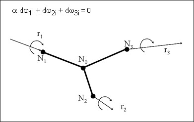

*Figure 316: Differential Joint Type*

The rotational velocities of a differential gear joint are constrained
by the relations:

.. math:: d\big{(}\Delta\omega_{1}\cdot r_{1}\big{)}+\big{(}\Delta\omega_{2}\cdot r_{2}\big{)}+\big{(}\Delta\omega_{3}\cdot r_{3}\big{)}=0\tag{210}

.. math:: d\big{(}\Delta\omega_{1}\cdot s_{1}\big{)}+\big{(}\Delta\omega_{2}\cdot s_{2}\big{)}+\big{(}\Delta\omega_{3}\cdot s_{3}\big{)}=0\tag{211}

.. math:: d\big{(}\Delta\omega_{1}\cdot t_{1}\big{)}+\big{(}\Delta\omega_{2}\cdot t_{2}\big{)}+\big{(}\Delta\omega_{3}\cdot t_{3}\big{)}=0\tag{212}

Methods to Apply Kinematic Conditions
----------------

Numerical methods available in PRADIOSS to apply the kinematic conditions
are:

| *Penalty Method (Rigid Walls)*
|      The node displacements are constrained by the application of penalty forces.

| *Main Secondary Kinematic Condition (Interface TYPE2 and Rigid Body)*
|      All secondary nodes lose their independence. The degrees of freedom of the secondary nodes are 
|      expressed as a function of a main node or element.

| *Local Kinematic Condition (Rigid Link and Cylindrical Joint)*
|      Constraint equations are applied to the nodes to satisfy local kinematic conditions. No main node is used.

| *Lagrange Multiplier (PRADIOSS V44)*
|      This method consists in the nonlinear resolution of the equilibrium
|      equations under constraints. This method is optional for some
|      classical kinematic conditions as: interfaces, rigid wall, rigid body
|      and boundary conditions. It is a unique method that is available for
|      some new kinematic conditions, such as: gear joints and interface
|      TYPE16 and TYPE17.
|
|      This method is generally used when other methods are not applicable.
|      For example, when the kinematic condition must be satisfied exactly
|      while a node contacts a surface. On the other hand, as the method is
|      based in the nonlinear resolution of equations by Newton-Raphson
|      method, its efficiency may be poor for a general case.
    
Incompatible Kinematic Conditions
----------------------

As nodal constraints are based on kinematic conditions applied on nodal
DOF, therefore it is not allowed to apply two nodal constraints to the
same set of nodes, unless the induced kinematic conditions are perfectly
orthogonal (for example: boundary condition in the X-direction and rigid
link in the Y-direction).

PRADIOSS Starter will issue the following warning each time two nodal
constraints are applied to the same set of nodes.

+-----------------------------------------------------------------------+
| WARNING ID: 147                                                       |
|                                                                       |
| \*\*\* WARNING: INCOMPATIBLE KINEMATIC CONDITIONS                     |
|                                                                       |
| 2 KINEMATIC CONDITIONS ON NODE xxxxxx,                                |
|                                                                       |
| IN DIRECTION TRANSLATION X, FOR:                                      |
|                                                                       |
| - Nodal constraint 1 (e.g. BOUNDARY CONDITION)                        |
|                                                                       |
| - Nodal constraint 2 (e.g. RIGID WALL)                                |
+-----------------------------------------------------------------------+

It is of very important to take all warnings about incompatible
kinematic conditions into account. True incompatible kinematic
conditions (that is, nodes belonging to several rigid bodies) can
generate energy and local instability. In such a case, accuracy of the
results will be seriously decreased.

PRADIOSS Starter does not check if the kinematic conditions are really
incompatible. If they are strictly orthogonal, or if they are not
applied simultaneously, just ignore the warning. Figure 317 illustrates
two cases: in the first case, a node is secondary on a rigid wall and
has a boundary condition in a non-orthogonal direction. If the rigid
wall is fixed, there are no possible incompatible conditions (the node
cannot impact on the wall). If the wall is moving, it is impossible
after impact to respect both conditions. Therefore, the boundary
condition is not applied and the reaction forces on the wall are
incorrect. In the second case, a node is defined as a secondary for two
parallel walls. If the two rigid walls are fixed, there are no possible
incompatible conditions, as the node cannot impact the two walls at the
same time. If one wall is moving, that results no problem, as long the
moving wall is not crossing the fixed wall.

.. image:: vertopal_7197fe79ded4471fa6ba70c4c62a5530/media/image61.jpg
   :width: 6.13465in
   :height: 2.79132in

*Figure 317: PRADIOSS Warning for Kinematic Conditions*

On a multi-processor PRADIOSS version, a run executed twice can give
different results if some kinematic conditions are incompatible. This is
still true if option ``/PARITH/ON`` is being used. For example, if a
secondary node impacting on two non-orthogonal rigid walls, as shown in
Figure 318, the results obtained on a multi-processor can be arbitrary.
If rigid wall 1 is computed before rigid wall 2, velocity V0 is replaced
with velocity V12. If rigid wall 2 is computed before rigid wall 1,
velocity V0 becomes V21. On multi-processor computers, the order in
which rigid walls and other kinematic conditions are applied is
arbitrary and can be changed from one cycle to the next and from one run
to another.

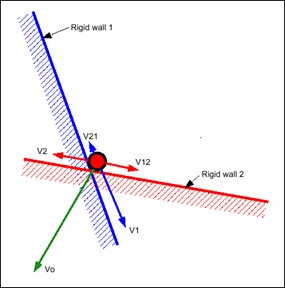

*Figure 318: Arbitrary Results with Incompatible Kinematic Conditions*

The Langrange Multiplier method allows applying several nodal
constraints to the same set of nodes as it resolves a global system of
equations with all Langrange Multiplier constrains. However, it is not
allowed to mix both methods for the same set of nodes. Nevertheless,
both methods can be used successfully in a model, as long as they are
applied to different nodes.

Interfaces
==========

Several interfaces are available in PRADIOSS, this section deals with
contact interfaces only. Each interface is distinguished with a type
number.

Interface TYPE2 is a kinematic condition used to connect two Lagrange
meshes and is not detailed in this section (refer to Kinematic
Constraints). A brief overview of the contact interfaces are shown in
Table 21.

Each of these interfaces was developed for a specific application field,
but this field is not the only choice criteria. Some limitations of the
different algorithms used in each interface can also determine your
choice.

The algorithm limitations mainly concern the search of the impacted
segment. This search can be done directly (interface TYPE7, TYPE10 and
TYPE11) or via the search of the nearest node (other interface types).
The nearest node search is done with a cheap, but limited algorithm
(interface TYPE3, TYPE5 and TYPE6).

Interface TYPE3, TYPE5 and TYPE6 also have some limitations concerning
the choice between the segments connected to the nearest node. Normal
orientation is one limitation for these interfaces.

Interface TYPE23 defines a contact interface for airbag fabrics. This is
a soft penalty contact which can deal with penetrations and
intersections often coming in the folded airbag mesh.

Interface TYPE24 use constant penalty stiffness and therefore the time
step is not affected.

Heat friction could be computed using interface TYPE7 and TYPE21.

*Table 21: Interfaces in PRADIOSS*

+---------+-------------------+-------------------+-------------------+
|         |                   |                   |    **Contact      |
| **Type**|   **Description** |   **Application** |    Treatment**    |
+=========+===================+===================+===================+
| 1 / 9   |    ALE/LAG with   |                   |    Main-Secondary |
|         |    sliding        |   Fluid-structure |                   |
|         |                   |   interaction     |                   |
+---------+-------------------+-------------------+-------------------+
| 2       |    Tied interface |    Change of mesh |    Main-Secondary |
|         |                   |    density        |    or LM          |
|         |                   |                   |                   |
|         |                   |    (solid)        |                   |
+---------+-------------------+-------------------+-------------------+
| 3 & 5   |    Contact impact |    Use of TYPE7   |    Penalty        |
|         |    between two    |    is recommended |                   |
|         |    parts          |                   |                   |
+---------+-------------------+-------------------+-------------------+
| 6       |    Contact impact |    User-defined   |    Penalty        |
|         |    between two    |    contacts       |                   |
|         |    rigid bodies   |                   |                   |
+---------+-------------------+-------------------+-------------------+
| 7       |    General        |    Solid contact  |    Penalty or LM  |
|         |    purpose        |    impact at all  |                   |
|         |    contact impact |    speeds         |                   |
|         |                   |                   |                   |
|         |    between two    |                   |                   |
|         |    parts          |                   |                   |
+---------+-------------------+-------------------+-------------------+
| 8       |    Drawbead       |    Stamping       |    Penalty        |
|         |    contact        |    applications   |                   |
+---------+-------------------+-------------------+-------------------+
| 10      |    Like TYPE7,    |    Special        |    Penalty        |
|         |    but tied       |    purpose        |                   |
|         |    contact        |    interface      |                   |
+---------+-------------------+-------------------+-------------------+
| 11      |    Impact between |    For beams,     |    Penalty        |
|         |    two lines      |    bars or        |                   |
|         |                   |    springs        |                   |
+---------+-------------------+-------------------+-------------------+
| 12      |    Fluid / fluid  |    Fluid to fluid |    Penalty        |
|         |    contact        |    contact        |                   |
+---------+-------------------+-------------------+-------------------+
| 16 & 17 |    Contact        |    Meshes with    |    LM             |
|         |    between nodes  |    8-node or      |                   |
|         |    to quadratic   |    16node         |                   |
|         |    shape solids   |                   |                   |
|         |    and            |                   |                   |
|         |                   |    thick-shell or |                   |
|         |    solid-shells   |    20 bricks      |                   |
|         |    or between     |                   |                   |
|         |    quadratic      |                   |                   |
|         |    shapes         |                   |                   |
+---------+-------------------+-------------------+-------------------+
| 18      |    CEL Lagrange / |                   |    Penalty        |
|         |    Euler          |   Fluid-structure |                   |
|         |    interface      |   interactions    |                   |
+---------+-------------------+-------------------+-------------------+
| 19      |    Combination of |    Solid contact  |    Penalty        |
|         |    interface      |    impact at all  |                   |
|         |                   |    speeds and For |                   |
|         |                   |                   |                   |
|         |    TYPE7 and      |    beams, bars or |                   |
|         |    TYPE11         |    springs        |                   |
+---------+-------------------+-------------------+-------------------+
| 21      |    Specific       |    For stamping   |    Main-Secondary |
|         |    interface      |                   |                   |
|         |    between a      |                   |                   |
|         |    non-deformable |                   |                   |
|         |                   |                   |                   |
|         |    main surface   |                   |                   |
|         |    and a          |                   |                   |
|         |    secondary      |                   |                   |
|         |    surface        |                   |                   |
+---------+-------------------+-------------------+-------------------+
| 23      |    Soft penalty   |    For airbag     |    Soft penalty   |
|         |    contact        |                   |                   |
+---------+-------------------+-------------------+-------------------+
| 24      |    General        |    This contact   |    Penalty        |
|         |    contact        |    interface can  |    stiffness is   |
|         |    interface,     |    replace        |    constant and;  |
|         |                   |                   |                   |
|         |    optional       |    interface      |    therefore, the |
|         |    single surface |    TYPE3, 5, 7    |    time step is   |
|         |    or surface to  |                   |    not affected   |
|         |                   |                   |                   |
|         |    surface or     |                   |                   |
|         |    nodes to       |                   |                   |
|         |    surface        |                   |                   |
|         |    contacts       |                   |                   |
+---------+-------------------+-------------------+-------------------+

Contact Treatment
----------------

There are two approaches that deal with contact:

-  Penalty Method is the most commonly used in explicit codes and can be found in most of the PRADIOSS interfaces

-  Lagrange Multiplier Method (``/LAGMUL`` and ``/INTER/LAGMUL``) is used in special case studies

Penalty Method
~~~~~~~~~~~~

Interfaces using the penalty method are based on mainr/secondary
treatment. Contact can only occur between a set of secondary nodes and a
set of main segments. Main segments are defined depending on the type of
element they lie on. If it is a 3-node or a 4-node shell, the segment is
the surface of the element. If it is a solid element, the segment is
defined as a face. Finally, if it is a 2D solid element (quad), the
segment is a side.

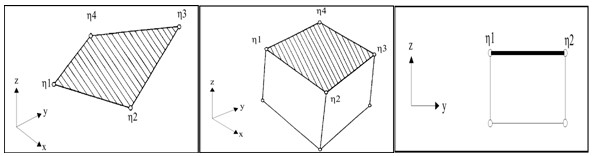

*Figure 319: Segment Definition*

A gap distance is defined to determine whether or not a node is in
contact with a segment.

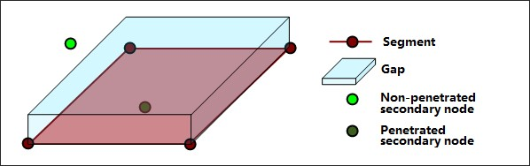

*Figure 320: Gap and Penetration*

As soon as a node penetrates into the gap, an elastic spring is added
between the secondary node and the main segment. Therefore, a resistant
force will tend to reject the secondary node.

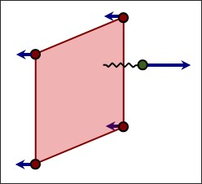

*Figure 321: Reaction Force in Interface*

The time step may be affected by the interface stiffness. During the
penetration, as a spring is connected to the secondary node, the spring
stiffness must be added to the overall stiffness acting on the node
(stiffness from all elements connected to this node). The nodal time
step must be reduced to account for the spring stiffness.

.. math:: dt=\sqrt{\frac{2M_{node}}{K_{node}+K_{spring}}}\tag{213}

Contact ends when the penetrated node is completely pushed out of the
gap. Therefore, the elastic spring and the reaction force are removed.

It is worthwhile to note that the contact interfaces with penalty method
are fully compatible will all kinematic conditions (for example, rigid
body, imposed velocity, etc.).

Lagrange Multiplier Method (/LAGMUL and /INTER/LAGMUL)
~~~~~~~~~~~~~~

Contrary to the penalty method, the Lagrange Multiplier method is purely
mathematical and does not require physical elements (springs) to model
contact. A nonlinear system of equations is solved to account for
contact conditions. Therefore, there is no time step collapse due to
high interface stiffness, but it takes more CPU time to do one cycle as
new equations need to be solved by a nonlinear solver. The method has
the advantage to stop secondary nodes at the contact surface (the
contact condition is precisely satisfied); however the friction cannot
be computed.

Symmetric Interface (/INTER/TYPE3)
----------------

This interface is used to simulate symmetric impacts between two
surfaces.

Both surfaces are defined through the use of oriented segments;
therefore, contacts can only occur on one side. Each node on both
surfaces is considered as a secondary node, and each surface is
considered as a main segment.

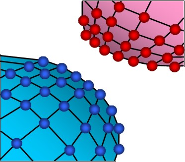

*Figure 322: Interface TYPE3*

Contrary to interface TYPE5, interface TYPE3 has two main surfaces;
therefore, the contact algorithm is performed twice. The first pass
solves the penetration of nodes from the first surface with respect of
the second surface. The second pass solves the penetration of nodes from
the second surface with respect of the first surface. This leads to
higher accuracy compared to interface TYPE5, but more CPU time is
needed.

When contact is detected, an elastic spring is added and the spring
stiffness is calculated using both surfaces stiffness. Based on material
and geometric properties, stiffness is attributed to each surface, then
the overall interface stiffness is computed:

.. math:: K=s\frac{K_{1}K_{2}}{K_{1}+K_{2}}\tag{214}

The default value for the stiffness scale factor(s) is 0.2, for
stability reason this value should not be modified. However, if the
ratio of :math:`K_{1}` over :math:`K_{2}` is greater than 100 (or lower than 0.01), it is
recommended to increase the stiffness scale factor to avoid too many
penetrations. The spring stiffness is constant, allowing secondary nodes
to pass through the mid-plane of the main segment.

This interface does not enable auto-contact simulation, as a node cannot
belong to both surfaces.

+-------------------------------------------------------------------------------+
| |image10| **Note:** This interface is mainly used for shell plates            |
|           initially in contact. If the two plates are modeled with a gap      |
|                                                                               |
|           between the two meshes, it is better to use interface TYPE7; unless,|
|           if the two plates are modeled without a gap, interface TYPE3 is a   |
|           good choice.                                                        |
+-------------------------------------------------------------------------------+

Non-Symmetric Interface (/INTER/TYPE5)
-------------------

This interface is used to simulate impacts between a main surface and a
list of secondary nodes.

The interface is oriented; therefore, contact can only occur on one side
of the main segments. Thus, main segments normal must be oriented
towards the secondary nodes.

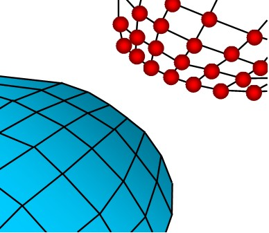

*Figure 323: Interface TYPE5*

The main surface mesh has to be regular with a good aspect ratio. It is
not allowed to put the secondary node on the main surface. It works only
with main segments connected to solid or shell elements. One use of this
interface is to replace rigid wall. Replacing a rigid wall with
interface TYPE5 will allow you to simulate rigid body impacts.

With interface TYPE5, a gap is used to determine contact between a node
and a surface. This gap is user-defined and is located on the side
normal to the surface. It is recommended to use a small or zero gap.

When contact is detected, an elastic spring is added and the spring
stiffness is calculated using material and geometric properties of the
main segment only. For stability reason, a stiffness scale factor of 0.2
is applied to the main side stiffness. It is strongly advised not to
modify this factor unless the main side is very soft compared to the
secondary side. If that is the case, it is recommended to use the ratio
of the greater elastic modulus over the lower one as stiffness scale
factor.

As mentioned previously, the stiffness depends on the geometric and
material properties and also on the type of element. Figure 324
describes the way stiffness is computed according to the type of element
the segment is attached to. In case a segment is common to a brick and a
shell (for example: 3D part covered by a skin), the stiffness used is
the one associated with the shell element.

*Figure 324: Stiffness in Interface TYPE5*

The main drawback of interface TYPE5 is that contact cannot occur on
both sides of the main segment. For a problem with large rotations
(usually the case in a crash analysis), contact is likely to occur on
the wrong side of the surface; therefore, penetration will not be
detected. Consequently, for a complex contact problem, a good
understanding of the impact is necessary prior to the simulation to
properly define normal surfaces.

Another important drawback is that a node is not allowed to be a
secondary node and part of a main segment. Therefore, auto-contact
cannot be simulated through the use of interface TYPE5.

Common Problems in Interfaces TYPE3 and TYPE5
----------------

Interfaces TYPE3 and TYPE5 have some common problems.

-  Energy jumps

-  Bad contact treatment

-  Limited search algorithm

Energy Jumps
~~~~~~~~~~~~

The gap used in interface TYPE5 (and TYPE3) is one sided and does not
take into account the edges. This can lead to energy jumps in cases of a
large gap (Figure 325).

*Figure 325: Jump in Energy*

Bad Contact Treatment
~~~~~~~~~~~~~~~~~~~~~

Moreover, as the interface stiffness is constant, node penetration is
allowed. This point can lead to a huge error, especially if sliding
occurs during the penetration. Figure 326 illustrates how secondary
nodes are allowed to go through the shell mid-surface because of bad
contact treatment.

*Figure 326: Bad Contact Treatment*

Limited Search Algorithm
~~~~~~~~~~~~~~~~~~~~~~~~

With interface TYPE5 (and TYPE3), the detection of the closest main node
is limited to the segments topologically close to the previous one
(topologically limited search algorithm). The first search is done by
PRADIOSS Starter to determine the closest initial main node, then the
Engine determines the closest main node, taking into account only the
segments topologically close to the previous one. This method is rather
slow in CPU time, and it does not work very well, especially if high
curvatures are involved (Figure 327).

*Figure 327: Bad Detection of the Closest Main Segment*

Interface TYPE6 (/INTER/TYPE6)
------------------------------

Interface TYPE6 is used to simulate contact between two rigid bodies.

This interface is similar to interface TYPE3, except for the stiffness.
The relationship between the contact force and the penetration is
provided by a user-defined function. This interface is used particularly
in vehicle occupant simulations, for example: knee bolsters. The main
limitation of this interface is that surface 1 must be part of one rigid
body, and also for surface 2. Moreover, both surfaces must be oriented
so that normals are facing each others.

The stiffness used corresponds to the curve Force versus Penetration
input by you. The instantaneous interface stiffness is the slope of the
input curve at the given penetration; therefore, the time step can be
affected since the interface stiffness is used to compute a stable time
step:

.. math:: \Delta t=0.1\sqrt{\frac{M}{K}}\tag{215}

Where,

:math:`M` The min (Mass of the first rigid body and Mass of the second rigid body)

:math:`K`  Slope of Force versus Penetration curve

*Figure 328: Interface TYPE6 - Normal Orientation*

General Purpose Interface (/INTER/TYPE7)
----------------

Interface TYPE7 is a general purpose interface and can simulate all
types of impact between a set of nodes and a main surface. Contrary to
interface TYPE3 and TYPE5, interface TYPE7 is non-oriented and secondary
nodes can belong to the main surface. Therefore, this interface can
simulate self-impact, especially buckling during a high speed crash.

*Figure 329: Interface TYPE7*

Interface TYPE7 solves all problems and limitations encountered with
interface TYPE3 and TYPE5. The search for the closest segment is done
via a direct search algorithm; therefore, there are no search
limitations and all possible contacts are found. The energy jumps
induced by a node impacting from the shell edges are removed by the use
of a cylindrical gap around the edges.

Finally, the main advantage of interface TYPE7 is that the stiffness is
not constant and increases with penetration preventing the node from
going through the shell mid-surface. This solves many bad contact
treatments (common when using either interface TYPE3 or TYPE5).

The gap used in interface TYPE7 is rather different than those of the
previous interfaces. The gap used is on both sides of the shell
mid-surface, and a cylindrical gap is added around the edges (Figure 330).
The gap used is on both sides of the shell mid-surface, and a
cylindrical gap is added around the edges.

*Figure 330: Gap in Interface TYPE7*

The cylindrical gap allows getting rid of energy jumps, node impacting
from the edges follow the same path during the penetration and the
depenetration. Moreover, such a gap keeps the reaction force smooth
during sliding between segments.

*Figure 331: Sliding Between Segments*

Contrary to interface TYPE3 and TYPE5, a variable gap in space is
available. Depending on option :math:`I_{gap}`, variable gap is computed for
each impact as the sum of the main element gap (g\ :sub:`m`) and the
secondary node gap (g\ :sub:`s`).

If :math:`I_{gap}` =1, variable gap is computed as:

.. math:: \max\Bigl{[}Gap_{min},\Bigl{(}g_{s}+g_{m}\Bigr{)}\Bigr{]}\tag{216}

If :math:`I_{gap}` =2, variable gap is computed as:      

.. math:: \max\Bigl{\{}Gap_{min},\min\Bigl{[}Fscale_{gap}\cdot\Bigl{(}g_{s}+g_{m}\Bigr{)} Gap_{max}\Bigr{]}\Bigr{\}}\tag{217}

If :math:`I_{gap}` =3, variable gap is computed as:

.. math:: \max\Bigl{\{}Gap_{min},\min\Bigl{[}Fscale_{gap}\cdot\Bigl{(}g_{s}+g_{m},\Bigr{)} ,\text{%mesh_size}\cdot\Bigl{(}g_{s\_s}+g_{m\_l}\Bigr{)}, Gap_{max}\Bigr{]}\Bigr{\}}\tag{218}

*Table 22: Variable Gap Computation*

+----------------------+-----------------------+----------------------+
|    **Element**       | **Main Element Gap**  | **Secondary Node     |
|                      | g\ :sub:`m`           | Gap** g\ :sub:`s`    |
+======================+=======================+======================+
|                      | :math:`g_{m}=\frac{t} | :math:`g_{s}=\frac{t}|
|                      | {2}`                  | {2}`                 |
|                      |                       |                      |
| SHELL                | t: thickness of       | t: largest           |
|                      | the main segment      | thickness of         |
|                      |                       | shell elements       |
|                      |                       |                      |
|                      |                       | connected to the     |
|                      |                       | secondary node       |
+----------------------+-----------------------+----------------------+
| BRICK                | g\ :sub:`m` = 0       | g\ :sub:`m` = 0      |
+----------------------+-----------------------+----------------------+
|                      |                       | :math:`g_{s}=\frac{1}|
|                      |                       | {2}\sqrt{S}`         |
|                      |                       |                      |
| TRUSS and BEAM       | Non-applicable        | S: cross section     |
+----------------------+-----------------------+----------------------+

If a minimum gap for impact activation (:math:`Gap_{min}`) is also used, the
computed variable gap cannot be smaller than the minimum value. It is
also possible to apply a scale factor to the gap and define a maximum
gap value.

Initial Penetrations
------------------

In an FE model, initial penetrations are very common, are unavoidable
and result from the discretization during the meshing process (Figure 332).

*Figure 332: Initial Penetrations Due to Discretization*

*Inacti*
~~~~~~~~~

Special treatment for initial penetrations can be accomplished through
the use of the *Inacti* flag. It is possible to remove penetrated nodes
from the interface or to remove the main segments relating to the
penetrated nodes. Both treatments allow getting rid of initial
penetrations very easily, but they may lead to poor results if the
number of penetrated nodes is large.

Setting *Inacti* to 3 allows PRADIOSS Starter to automatically modify the
coordinates of penetrated nodes to avoid initial penetrations. Special
care must be taken when doing so, since this operation can lead to
initially constrained springs.

It is also possible to obtain a variable gap in time by setting *Inacti*
to 5. The illustration Figure 333 explains how the effective gap is
updated taking into account the previous penetrations.

*Figure 333: Variable Gap in Time*

At t=0, if a node is initially penetrated, its gap is automatically
corrected. Then this "*initial corrected gap*" will be increased every
time the node is moving away from the main segment. This option is
mainly used for unfolding the airbag, it allows a decent time step at
the beginning of the unfolding, whereas nodes are all highly penetrated.

*Figure 334: Time Step Using Inacti=5*

To avoid high frequency effects *Inacti* = 6 is recommended instead of
*Inacti* =5.

Fpenmax
~~~~~~

*Fpenmax* (maximum fraction of initial penetration), is used to deal
with big initial penetration. Node stiffness will be deactivated, 
if :math:`Penetration\geq F penmax\cdot Gap,` ,
whatever the value of *Inacti*.

Igap3 + %mesh_size
~~~~~~~~~

With :math:`I_{gap}` = 3 and **%mesh_size**, the size of the mesh can be taken
into account to avoid initial penetrations. In this case, the variable
gap is computed as:

.. math:: \max\Bigl{\{}Gap_{min},\min\Bigl{[}Fscale_{gap}\cdot\Bigl{(}g_{s}+g_{m},\Bigr{)} ,\text{%mesh_size}\cdot\Bigl{(}g_{s\_l}+g_{m\_l}\Bigr{)}, Gap_{max}\Bigr{]}\Bigr{\}}\tag{219}

Where,

:math:`g_{m\_l}` Length of the smaller edge of element

:math:`g_{s\_l}` Length of the smaller edge of elements connected to the secondary node

Irem_gap
~~~~~~~~

The option *Irem_gap* is used to deactivate secondary nodes which close
(Curvilinear :math:`Distance <\sqrt{2}\cdot Gap`) to elements. 
This option is useful for self-impact contact when mesh size is very small.

*Figure 335: -1: Irem_gap Definition*

+-----------------------------------------------------------------------+
| |image11| **Note:** When dealing with initial penetrations, it is     |
| strongly advised to remove initial penetrations during the creation   |
|                                                                       |
| of the FE model, using pre-processing tools like HyperMesh and        |
| HyperCrash depenetrators.                                             |
+-----------------------------------------------------------------------+

Interface Stiffness
-----------

Like the other interface types, when using the penalty method, the
interface has spring stiffness as a secondary node penetrates the gap;
however, the reaction force is computed with much better approximation.
The force variation versus penetration of a node is nonlinear, due to
the increasing stiffness.

*Figure 336: Interface Force Variation in Interface TYPE7*

The interface stiffness (*K*) is not constant, it increases with the
penetration. Moreover, there is a viscous damping acting on the rate of
penetration. The contact force is then computed as:

.. math:: F_{n}=K_{S}P+C\frac{dP}{dt}\left\{\begin{array} K_{S}=K_{0}\frac{Gap}{Gap-P} \\ C=VIS_{S}\sqrt{2K_{S}M}\end{array}\right. 

The instantaneous stiffness is then computed as:

.. math:: K_{t}=\frac{\partial F}{\partial P}=K_{0}\frac{Gap^{2}}{\left(Gap-P\right)^{2}}\tag{221}

Nodal time step can be seriously affected if penetration is large. The
stiffness, used to compute the nodal time step takes into account the
interface stiffness.

There are two ways to decrease the interface stiffness:

-  Increasing the gap

-  Increasing the initial stiffness (through the use of the flag *Stfac*)

Both methods allow absorbing more energy by contact and smoothing the
impact. Increasing the gap will allow nodes to slow down over a larger
distance, therefore the penetration is reduced.

Comments
~~~~~~~~~~~

1. Even if an elementary time step is chosen for the simulation, a nodal time step is automatically computed if there is an interface TYPE7. The lowest time step is applied for the simulation

2. Contrary to interface TYPE5, a *Stfac* smaller than 1.0 produces a large penetration at the first touch and results in high interface stiffness and reaction force. To avoid high penetration, a *Stfac* greater than or equal to 1.0 is recommended.

*Figure 337: Force versus Penetration Curves*

Although, increasing the initial stiffness leads to a smaller time
step at the beginning of the penetration, it will increase the time
step if penetration is large.

Friction
~~~~~~~~~~~~

Several friction formulations are available within PRADIOSS. The simplest
one, which is also the most used, is the Coulomb friction law. This
formulation provides accurate results in crash analysis and requires 
just one parameter (Coulomb friction coefficient, :math:`\mu`).

*Figure 338: Normal and Tangential Forces Applied to a Node*

*Figure 339: Adhesion Force Computation*

The default value for (:raw-latex:`\mu`) is 0 (no friction between
surfaces). To compute the friction force, the default friction penalty
formulation is a viscous one, based on the tangential velocity. During
sliding penetrate the node goes from position (C\_{0}) (contact point at
time (t)) to (C\_{1}) (contact position at time
(t+:raw-latex:`\Delta `t)). As the contact is viscous, a viscous
coefficient (C) is introduced to compute the adhesion force:

.. math:: F_{adh}=C\cdot V_{t} \tag{222}

Where,

:math:`C=VIS_{F}\cdot\sqrt{2KM}`

    :**K**: Instantaneous interface stiffness

    :**VIS**: :sub:`F` Critical damping coefficient on interface friction

    :**M**: Main node mass

Once the adhesion force (*F*\ :sub:`h`) is computed, if it is less than
:math:`mu F_{n,}`  the friction force is unchanged equaling *F*\ :sub:`h` and sticking will
occur. If the adhesion force is greater than :math:`mu F_{n,}` then the friction force
is reduced and equals :math:`mu F_{n.}`

.. math:: F_{t}=\min\bigl{(}\mu F_{n} F_{adh}\bigr{)}\tag{223}

*Figure 340: Friction Force Computation*

If sliding occurs at a very low speed (for example: quasi-static
simulation), the viscous formulation will not work, as the friction
force is computed upon the tangential speed. To overcome this
limitation, a new friction penalty formulation is available based on
tangential displacement (stiffness incremental formulation). This method
introduces an artificial stiffness, *K* to calculate the variation of
the friction force:

.. math:: \Delta F_{t}=K\cdot V_{t}\cdot\delta_{t}\tag{224}

Where,

:math:`\delta_{t}` Tangent displacement

Therefore, contrary to the previous formulation, the stiffness
formulation is able to compute the proper friction force even at a low
speed. Figure 341 illustrates this point. If an imposed displacement is
applied to a part (a 3D cube) at a low speed (0.01 m/s), the viscous
formulation will not work; whereas the stiffness formulation based on
the tangential displacement will.

*Figure 341: Viscous Formulation versus Stiffness Formulation*

Other friction formulations are available, their principle is similar to the
Coulomb friction law. PRADIOSS first computes an adhesion force, which is
then compared to :math:`\mu F_{n}`. Their differences lie in
the friction coefficient (:math:`\mu`) which is not constant
anymore, but function on the pressure of the normal force on the main
segment and on the tangential velocity of the secondary node. Depending
on the flag :math:`I_{\text{{{fric}}}}` three new friction
formulations are available:

*Generalized Viscous Friction Law*

.. math:: \mu=Fric+C_{1}p+C_{2}\cdot V+C_{3}p\cdot V+C_{4}\cdot p^{2}+C_{5}\cdot V^{2}\tag{225}

*Modified Darmstad Friction Law*

.. math:: \mu=Fric+C_{1}\cdot\dot{e}(C_{2}v)\cdot p^{2}+C_{3}\cdot\dot{e}^(C_{4}v)\cdot p+C_{5}\cdot\dot{e}^(C_{6}v)\tag{226}

*Renard Friction Law*

.. math:: \mu=C_{1}+\left(C_{3}-C_{1}\right)\cdot\frac{V}{C_{5}}\cdot\left(2-\frac{V}{C_{5}}\right)\tag{227}

if

.. math:: V\in\left[C_{5}\cdot C_{6}\right] \tag{228}

.. math:: \mu=C_{3}-\left(\left(C_{3}-C_{4}\right)\cdot\left(\frac{V-C_{5}}{C_{6}-C_{5}}\right)^{2}\cdot\left(3-2\cdot\frac{V-C_{5}}{C_{6}-C_{5}}\right)\right)\tag{229}

if

.. math:: V\in\left[C_{5}\cdot C_{6}\right] \tag{230}

.. math:: \mu=C_{2}-\frac{1}{\frac{1}{C_{2}-C_{4}}+\left(V-C_{6}\right)^{2}}\tag{231}

if

.. math:: V\geq C_{6} \tag{232}

.. math:: P=C_{1}\cdot\mu+C_{4}\cdot\rho\cdot C_{v}\cdot T=C_{1}\cdot\mu+\alpha_{v}\cdot T\tag{233}

+-----------------------------------------------------------------------+
| |image12| **Note:** Friction filtering is available for all friction  |
| formulations and allows you to                                        |
| smooth the friction force. Refer to PRADIOSS Starter Input for more    |
| details.                                                              |
+-----------------------------------------------------------------------+

*Figure 342: Graphical Representation of Renard Friction Model*

Heat Exchange
~~~~~~~~~~

In interface TYPE7 there are three heat exchanges: heat transfer,
radiation and heat friction are allowed by :math:`I_{the}` =1.

For heat transfer between secondary and main with *Iform_the*, two
different heat transfer can be defined. One is set constant temperature
in interface where, heat exchange is only between this interface and
shell secondary side. The other is heat exchange between all pieces in
contact.

If *Frad*\ ≠ 0, then radiation is computed inside of distance *Drad*
(max. distance for radiation computation). It is recommended to not set
too high of a value for *Drad* , otherwise PRADIOSS Engine performance
may be reduced.

Using *Fheat*\ :sub:`s` and *Fheat*\ :sub:`m` frictional sliding energy will be
converted into heat. Since friction heat is divided between secondary
and main side, generally *Fheat*\ :sub:`s` + *Fheat*\ :sub:`m` < 1.0. The frictional
heat *Q*\ :sub:`Fric` is defined:

If *I*\ :sub:`Form` =2 (a stiffness formulation):

Secondary side:

.. math:: Q_{Fric}=Fheat_{s}\cdot\frac{\left(F_{\textit{adh}}-F_{t}\right)}{K}\cdot F_{t} \tag{234}

Main side:

.. math:: Q_{Fric}=Fheat_{m}\cdot\frac{\left(F_{\textit{adh}}-F_{t}\right)}{K}\cdot F_{t} \tag{235}

(*Ithe_form*\ =1)

Here, K is Contact stiffness :math:`F_{adh}`

If *I*\ :sub:`Form` =1 (a penalty formulation):

Secondary side:

.. math:: Q_{Fric}=F heat_{s}\cdot C\cdot V_{t}2\cdot dt \tag{236}

Main side:

.. math:: Q_{Fric}=Fheat_{m}\cdot C\cdot V_{\ell^{2}}\cdot dt\tag{237}

Interface Time Step Control
===========================

The previous section explains that the time step can be seriously
reduced during contact since stiffness is added to all penetrated nodes.
Moreover, to prevent any node from going through the main segment during
one cycle, a kinematic time step is also computed. If the node impact
velocity is high enough to pass through the segment on one cycle,
PRADIOSS reduces the time step in order to apply the penalty force when
the node is in the gap distance. If *p* is the penetration distance, then *dp/dt* is
the penetration speed and the kinematic time step is necessary time for
the node to go over half of the distance between the node and the
segment. The nodal time step is also computed to ensure the numerical
stability. The smallest time step is then used for the simulation.

Nodal time step during contact:

.. math:: dt_{nodal}=\sqrt{\sum\bigl{(}K_{interface}+K_{element}\bigr{)}}\tag{238}

Kinematic time step:

.. math:: dt_{kin}=\frac{1}{2}\biggl{[}\frac{Gap-p}{dp/dt}\biggr{]}\tag{239}

+-----------------------------------------------------------------------+
| |image13| **Note:** Regarding the impact velocities in automobile     |
| crash simulations, kinematic time step cannot be activated.           |
|                                                                       |
| Its activation may be due to an incoherency in the model.             |
+-----------------------------------------------------------------------+

If for some reason a node is highly penetrated, either the nodal time
step or the kinematic time step may be very low. Then, it is possible to
release this node from the interface using the option ``/DT/ INTER/DEL`` in
the Engine file. All nodes reaching *dt*\ :sub:`min` will be removed from the interface.

+-----------------------------------------------------------------------+
| |image14| **Note:** This option may be useful in order to keep a      |
| decent time step during contact, but if the number of released nodes  |
|                                                                       |
| is too large, poor results can be expected. Take note of the          |
| following message displayed in the Engine output file:                |
|                                                                       |
|                                                                       |
|    \*\* WARNING MINIMUM TIME STEP XXX IN INTERFACE 1                  |
|                                                                       |
|    REMOVE SECONDARY NODE XXX FROM INTERFACE                           |
+-----------------------------------------------------------------------+

Increase in Mass
-------------

The use of mass scaling (``/DT/NODA/CST``) may lead to a mass instability.
As a node penetrates, its global stiffness increases (the instantaneous
interface stiffness, *K*\ :sub:`t` is added); therefore, its nodal time step
decreases. In order to match the minimum time step, PRADIOSS adds the
needed mass to the node. Unfortunately, this added mass increases the
kinetic energy and the penetration gets bigger.

*Figure 343: Effect of Mass Scaling on Interface TYPE7*

Unless the interface is able to stop the penetration, the added mass
(due to mass scaling) will keep on getting bigger and bigger. Therefore,
the computation is likely to stop, since the mass variation may get huge
very quickly (few cycles). If this is the case, the interface should be
modified:

-  Gap should be increased

-  Initial stiffness can be increased

-  Mesh should be modified to be refined and uniform in the contact zone

Soft Part against Hard Part
--------------

The default stiffness value computed by PRADIOSS is often suitable to
avoid very high penetration, leading to the time step dropping. When
contact occurs between similar materials, there is no problem using the
default stiffness; except when the materials are different. For
instance, when mild steel impacts soft foam, the default stiffness may
be too low to avoid a large penetration. When such contacts are willing
to occur, it is advised to first compute the ratio of the secondary
material stiffness over the main material stiffness. If this ratio is
greater than 100, a scale factor (*Stfac*) equal to this ratio should be
used to increase the interface stiffness.

*Figure 344: Impact Between Steel and Foam*

Figure 344 shows contact between mild steel and soft foam. The ratio of
stiffness is greater than 380, in such a case where the main side is the
soft side, the flag *Stfac* may be set to 380 to avoid very high
penetrations.

Edge to Edge Impact Locking
----------

Interface TYPE7 does not deal with edge to edge impact. The limitation
of this interface during the edge to edge contact is illustrated in
Figure 345.

*Figure 345: Edge to Edge Contact*

When the mesh is fine enough, edge to edge penetration is often followed
by a node to shell contact. The main problem with edge to edge impact is
the locking situations. If there is a change of load after edge
penetration, locking is unavoidable since a node to surface contact is
detected (Figure 346). This usually leads to high penetration;
therefore, the analysis comes to a standstill as time step is reduced.
If locking occurs, the use of interface TYPE11 in this area is necessary
to solve the problem.

*Figure 346: Locking After Edge Penetration*

Generation of Tangential Force
------------

A tangential force can be generated when a penetrated node is sliding
without friction. This behavior is due to the gaps overlapping around
the edges. Figure 347 illustrates that by the cylindrical gap around the
edges, the force is no longer normal to the shell mid-surface.

*Figure 347: Generation of Tangential Force*

+-----------------------------------------------------------------------+
| |image15| **Note:** No problems were observed in crash simulations,   |
| but in metal forming where friction is very important this can        |
| seriously decrease the accuracy.                                      |
+-----------------------------------------------------------------------+

Comments
~~~~~~~~~~~~~

1. It is always advised to post-process the contact forces. If they are too large, taking into account the physical understanding, the model must be checked.

2. To post-process the forces for symmetric contact, the interface can be split into four interfaces. For example, for two parts A and B, you can create:

   -  Interface 1 with A Secondary and B Main

   -  +Interface 2 with A Main and B Secondary

   -  +Interface 3 with A Main and Secondary

   -  +Interface 4 with B Main and Secondary

Auto-Contact Gap Warning
----------------

This warning should only be taken into account of a self-impacting
interface.

When simulating auto-contact, it is strongly advised to use a minimum
gap of at least one half of the smallest segment edge. The message means
that at least one element on the main side has a side length less than
twice the GAP, and there is an over-stiffening risk.

+-----------------------------------------------------------------------+
| WARNING ID: 94                                                        |
|                                                                       |
| \*\* WARNING IN INTERFACE GAP                                         |
|                                                                       |
| INPUT GAP 1.7                                                         |
|                                                                       |
| HOWEVER GAP IS RECOMMENDED TO BE LESS THAN 1                          |
+-----------------------------------------------------------------------+

Figure 348 illustrates a self-impacting interface for which the ``GAP``
equals half the side length of an element. If this element is compressed
more than 50%, the red node enters into the gap of the neighboring
element; a self-contact is then detected which should not be the case.
This leads to overstiffening of the structure.

*Figure 348: Recommended Gap When Modeling Auto-Contact*

If the side length, *L* of an element is lower than the ``GAP``, a
self-contact will even be computed from the beginning of the
computation.

Such a situation can be accepted if it is an exception, but not for
frequent cases over the self-impacting interface. It is possible to
localize the source of this message by using a pre-processor and
selecting the elements through size criteria.

Rupture
---------

When rupture is modeled and elements are expected to fail, it is
important to deal with failed elements defined either as a main segment,
or as secondary nodes.

When an element is deleted, its corresponding segment is still taken
into account and its nodes are still considered for contact. This
behavior can lead to a huge error, as deleted elements have no
stiffness; therefore, it is recommended to set the flag *I*\ :sub:`del` to 2
when failure is expected. This flag will remove any failed element from
the main surface and corresponding nodes will be removed from the
secondary nodes list.

+-----------------------------------------------------------------------+
| |image16| **Note:** The *I*\ :sub:`del` flag exists as of             |
| PRADIOSS V5.1. For older versions, refer to ``/DELINT/ON``.            |
+-----------------------------------------------------------------------+

Drawbead Interface (/INTER/TYPE8)
------------------

Interface TYPE8 is used to simulate drawbeads. This interface is mainly
used in the process industry to model metal forming. Drawbeads are used
to prevent the metal strip from sliding during the stamping process.

*Figure 349: Stamping Process*

The modeling of the drawbeads using interface TYPE8 consists in defining
a line of secondary nodes and a main surface. The set of secondary nodes
must be sorted since the input force is a force per unit length, and the
length is computed as the distance between two successive secondary
nodes. As soon as a secondary node projects onto a main surface, a
tangential force is applied to all main nodes to counter their
tangential velocity (Figure 350). Consequently the metal strip does not
slide.

*Figure 350: Drawbead Force*

+-----------------------------------------------------------------------+
| |image17| **Note:** The global force acting on the main surface       |
| cannot be greater than the drawbead force per unit length             |
|                                                                       |
| (user-defined) multiply by the distance of two successive secondary   |
| nodes. In that case, sliding of the metal strip will occur.           |
+-----------------------------------------------------------------------+

Common Problem
~~~~~~~~~~~~

In case the drawbead is not continuous, it is necessary to create
several TYPE8 interfaces, one interface for each continuous drawbead.
Otherwise, the drawbead force can be far too high between two successive
nodes that are not part of the same continuous drawbead.

Figure 351 illustrates this point. The grey part could be a car hood,
and three drawbeads are needed during the stamping process. If only one
interface TYPE8 is created, as the drawbeads are not continuous, the
distance between node N17 and N18 is much larger than the average
distance between two successive nodes. Therefore, the drawbead force
applied to nodes N17 and N18 could be too high, leading to unrealistic
deformation in these areas.

*Figure 351: Example of Hood Stamping*

Edge-to-Edge Interface (/INTER/TYPE11)
-------------------

Interface TYPE11 is used to simulate impact between lines for 1D mesh,
or edges in shell and solid meshes.

*Figure 352: Edge-to-Edge Contact*

In association with interface TYPE7, interface TYPE11 solves the locking
cases and uses the same penalty formulation and search algorithm as
interface TYPE7.

Interface TYPE 11 uses complicated mathematical algorithms; therefore,
it is strongly advised to use it only when necessary. A huge interface
TYPE11 can slow down the computation.

Quadratic Surface Contact (/INTER/LAGMUL/TYPE16 & /INTER/ LAGMUL/TYPE17)
--------------------------

Interface TYPE16 allows defining contact conditions between a group of
nodes (secondary) and a curve surface of quadratic elements (main part),
as shown in Figure 353 for a symmetric contact. The main part may be
made of 16-node thick shells or 20-node bricks. The Lagrange Multiplier
method is used to apply the contact conditions; therefore, no gap is
necessary to be applied. Some applications of this interface are sliding
contacts without gaps as in gear box modeling.

*Figure 353: Interface TYPE16 - Node to Quadratic Surface Contact*

Interface TYPE17 allows modeling contact between two quadratic surfaces
using the Lagrange Multiplier method. It is a generalized form of
interface TYPE16 in which the contact on the two quadratic surfaces are
directly resolved. The contact is supposed to be sliding or tied.

*Figure 354: Interface TYPE17 - Quadratic Surface to Quadratic Surface
Contact*

As defined above, both interfaces do not model friction effects. Contact
is either considered as tied or without friction (pure sliding).

+-----------------------------------------------------------------------+
| |image18| **Note:** When using interfaces with the Lagrange           |
| Multiplier method, it is not recommended to symmetrize the contact.   |
+-----------------------------------------------------------------------+

Tied Interface (/INTER/TYPE10)
-----------------

This interface is similar to interface TYPE7, except for the stiffness
which remains constant during the contact.

Moreover, after impact a secondary node becomes tied to the main surface
with or without rebound (flag :math:`I_{tied}`).

Stiffness
~~~~~~~~~~~

During impact, a mass-less spring with constant stiffness is added in
order to push the secondary node back. Moreover, as the secondary node
is tied, a second massless spring is used to maintain the secondary node
close to its impact point. Depending on whether or not rebound is
allowed, these two springs are maintained when the secondary node is no
longer penetrated.

*Figure 355: Interface TYPE10*

| **See Also**
| /INTER/TYPE10 (Starter)

Loads
=====

Preload
-------

The ability to preload a section of elements is available using the
/PRELOAD option. This can be used to model the pretension force in bolts
used in assemblies.

Bolt Tensioning
~~~~~~~~~~~~~~~

Details of the physical bolt tensioning problem.

A typical sequence.

*Figure 356: Pretensioned Assembly - Application of Pretensioning Loads (Step 1)*

In Step 1, upon preliminary assembly of the structure, the nuts on
respective bolts are tightened, usually by applying specified torque
(which translates into specified tension force according to the pitch of
the thread).

As the result, the working part of the bolt becomes shorter by a
distance :math:`\Delta L`. This distance depends upon the applied force, the compliance
of the bolt and of the assembly being pretensioned.

From the perspective of FEA analysis, it is important to recognize that:

-  Pretensioning shortens the working part of the bolt by removing a certain length of the bolt from the active structure (in reality this segment slides through the nut, yet the net effect is the shortening of the working length of the bolt). Since the bolt stretches, there is a smaller effective length of the bolt material to span the distance from the bolt mount to the nut

-  Calculation of each bolt's shortening :math:`\Delta L`, due to applied forces **f**, requires FEA solution of the entire model with the pretensioning forces applied. This is because the amount of nut movement due to given force depends on the compliance of the bolts, of the assembly being bolted and is also affected by cross-interaction between multiple bolts being pretensioned.

At the end of Step 1, the amount of shortening :math:`\Delta L` for each bolt is
established and "locked", simply by leaving the nuts at the position
that they reached during the pretensioning step.

In Step 2, with the shortening :math:`\Delta L` of all the bolts "locked", other loads
are applied to the assembly
(Figure 357). At this stage the stresses and strains in the bolts will
usually change, while the length of material removed :math:`\Delta L` remains constant each bolt. 

*Figure 357: Pretensioned Assembly - Application of Working Loads with "locked" Bolt Shortening (Step 2)*

Define a Preload
--------------

To create a preload in a bolt, the section option ``/SECT`` is first used to
define a set of elements where the preload will be applied.

The section ID is then referenced in the ``/PRELOAD`` input. To create the
preload, an initial tensile stress applied to the set of elements
referenced in the section causes the length of the bolt to shorten in
the local z axis of the defined ``/SECT``.

*Figure 358: Section which Defines a Group of Elements for Preload*

The preload amount can be entered as a force (default) or a stress
depending on the ``/PRELOAD``, :math:`I_{typ}` input option. If a force is entered,
the initial cross-section area of the ``/SECT`` is used to calculate a
stress that is applied to cause the preload. At the defined ``/PRELOAD``
:math:`T_{start}` time, the material stiffness of the elements defined in the
section is reduced and the tensile stress is applied to the defined
section elements which causes the elements to reduce in length resulting
in the required preload. Since the material stiffness is reduced, the
amount of strain created in the element is also reduced.

The preloading time between :math:`T_{start}` and :math:`T_{stop}` is when the
material stiffness goes from a reduced stiffness back to its originaal
material stiffness. As shown in Figure 359 , there is a constant reduced
stiffness, then a linear increase in stiffness to the original material
stiffness, followed by a constant stiffiness.

*Figure 359: Increase in Material Stiffness*

The preload can also be activated using a ``/SENSOR`` and in this case the
:math:`T_{start}` and :math:`T_{stop}` times are shifted based on the sensor
activation time.

A ``/TH/SECTIO`` should be created to output the pretension section force.
Depending on the assembly being bolted, contact gap between the bolt
parts and bolt material, the bolt pretension input may not exactly match
the output section force.

*Figure 360: Section Output and Bolt Stress*

Airbag Modeling
===============

Airbags are modeled as monitored volumes ``/MONVOL`` in several different
ways.

There are other monitored volume types used to model closed volumes
filled with gas or liquid such as; tires, gas tanks (sloshing ignored),
and LCD screens.

Monitored Volume (/MONVOL)
-------------

A monitored volume is defined with one or more shell (3-node or 4-node)
parts.

The defined surface must be closed (PRADIOSS Starter checks it and
outputs an error message, if the surface is not closed). The shells
normal must be oriented outside the volume. It is possible to reverse
the shells normal for a given part, set by entering a negative part
number (or by using an appropriate pre-processor to reverse them).

The following types of monitored volume may be used to model airbags:

-  AIRBAG1: uniform pressure classical airbag

-  AREA: a closed surface to output its volume and area of post-processing

-  COMMU1: uniform pressure chambers with communication

-  FVMBAG1: non-uniform pressure airbag solved by Finite Volume Method

-  GAS: used to model tire pressure or a simple fuel tank

-  LFLUID: linear fluid monitored volume to model an incompressible fluid

-  PRES: a simple uniform pressure monitored volume

The properties and material laws used to model the fabric could be:

-  ``/MAT/LAW19`` + ``/PROP/SH_ORTH`` - Used to model a fabric with a linear elastic behavior.

-  ``/MAT/LAW58`` + ``/PROP/SH_FABR`` - Used to model the behavior of a nonlinear elastic fabric.

Recommendations:

-  Fabric materials behave as a membrane and therefore, one integration point through the thickness is recommended, N=1.

-  The fabric may be modeled with 3-nodes shell element, using the default Standard triangle (C0) element formulation which does not hourglass or with 4-nodes shell using the QBAT element, :math:`I_{shell}` =12 with :math:`I_{smstr}` =11.

-  Although no longer recommended, if :math:`I_{shell}` =4 is used, then to avoid hourglass, define the shell membrane hourglass coefficient *hm* and the shell out of plane hourglass *hf* to be 10%.

-  To define the communicating surface for the COMMU1 type monitored volume, void materials and properties should be used ``/MAT/VOID`` and ``/PROP/VOID``).

-  The FVMBAG1 type may be used to model gas flow effects which is necessary with curtain airbags and Out Of Position (OOP) simulations.

-  Generally, to define an interface self-impact contact, you may define one auto-impacting interface TYPE7 and one edge-to-edge interface contact TYPE11. If there are some initial penetrations, then set *Inacti* =6. These two contacts can also be replaced by one TYPE19 contact.

AIRBAG1
------

Uniform pressure is assumed inside the volume. Perfect gas law and
adiabatic conditions are assumed. Injected mass (or mass flow rate) and
temperature are defined as a time function using the injector property.
A sensor can define the inflator starting time.

The deflation of the vent hole occurs after reaching a pressure (:math:`P_{def}`) or
time (:math:`t_{def}`) criteria.

*Figure 361:*

Numerical Damping
~~~~~~~~~~~

Viscosity, can be used to reduce numerical oscillations.

If :math:`\mu` =1, a critical damping (shell mass and volume stiffness) is used. A
viscous pressure, *q* is computed as:

:math:`q=-\frac{\mu}{A}\sqrt{\frac{PA\rho t}{V}} \frac{dV}{dt}if\frac{dV}{dt}<0`

:math:`q=0 if \frac{dV}{dt}>0`

Where,

:math:`t` Fabric thicknes

:math:`\rho` Destiny of the fabric

:math:`A` Bag surface

The applied pressure is:

.. math:: P-P_{ext}+q \tag{240}

Initial Conditions
~~~~~~~~~~~~~

To avoid initial disequilibrium and mathematical discontinuity for zero
mass or zero volume, the following initial conditions are set at time
zero (:math:`I_{equil}` =0) or at the beginning of jetting (if :math:`I_{equil}` =1).

-  :math:`P_{ext}=P_{ini}` external pressure

-  :math:`T_{0}=T_{ini}` initial temperature (295K by default)

-  If the initial volume is less than :math:`10^{-4}A^{3/2}`, a constant small volume is added to obtain an initial volume: :math:`V_{ini}=10^{-4}A^{3/2}`

-  Initial mass, energy and density are defined from the above values.

There is no need to define an injected mass at time zero.

Gases Definition
~~~~~~~~~~~

1. Initial and injected gas is defined with ``/MAT/GAS``. Four types of gas (MASS, MOLE, PREDEF, or CSTA) could be defined. Then the specific capacity per unit mass at constant pressure for the gas is: 
   
- MASS type

.. math:: C_{p}=\left(C_{pa}+C_{pb}T+C_{pc}T^{2}+C_{pd}T^{3}+\frac{C_{pe}}{T^{2}}+C_{pf}T^{4}\right) \tag{241}

- MOLE type

.. math:: C_{p}=\frac{1}{MW}\left(C_{pa}+C_{pb}T+C_{pc}T^{2}+C_{pd}T^{3}+\frac{C_{pe}}{T^{2}}\right)\tag{242}
   
Where, *MW* is the molecular weight of the gas. 
   
  - CSTA type

   User input :math:`C_{p}` and :math:`C_{V}` with the unit of :math:`\left[\frac{J}{kgK}\right]`. 
   
- PREDEF type 
 
   About 14 commonly used gases (N2, O2, Air, etc) predefined in PRADIOSS.

2. Injected gas 

   :math:`N_{jet}` defines the number of injectors by monitored
   volume. The material of the injected gas is defined with ``/MAT/GAS``.
   The injector properties (``/PROP/INJECT1`` or ``/PROP/INJECT2``) define the
   injected mass curve defined :math:`fct\_ID_{M}` and injected temperature
   curve defined :math:`fct\_ID_{T}`. 
   
   Injected mass curve and injection temperature can be obtained: 
   
   - From the airbag manufacturer 

   - From a tank test 
 
*sens_ID* is the sensor number to start injection.

3. Jetting effect :math:`I_{jet}` is used only for ``/MONVOL/AIRBAG1`` or ``/MONVOL/COMMU1 ``

   If :math:`I_{jet}\neq 0`, the jetting effect
   is modeled as an overpressure :math:`\Delta P_{jet}` applied
   to elements of the bag.

.. math:: \Delta P_{jet}=\Delta\text{P}(t)\cdot\Delta\text{P}(\theta)\cdot\Delta\text{P}(\delta)\cdot\max(\mathbf{n}\cdot\mathbf{m},0)  \tag{243}

*Figure 362:*

N\ :sub:`1`, N\ :sub:`2`, and N\ :sub:`3` are defined based on the
injector geometry (refer to the *PRADIOSS Starter Input Manual*)

:math:`\Delta P(t),\Delta P(\theta),\Delta P(\delta)` are empirical functions provided 
by the user via :math:`fct\_ID_{Pt},fct\_ID_{P\theta`}`, and :math:`fct\_ID_{P\delta}`

Vent Hole Definition
~~~~~~~~~~~~~

:math:`N_{vent}` defines the number of vent holes used.

:math:`sur f\_ID_{v}` is the surface identifier defining the vent hole

:math:`A_{vent}` is the vent area (if :math:`sur f\_ID_{v}` = 0) or a scale factor (:math:`sur f\_ID_{v}\neq 0)`

:math:`B_{vent}` = 0 (if :math:`surf\_ID_{v} = 0)` or a scale factor on the impacted surface (:math:`surf\_ID_{v}\neq 0)`

:math:`T_{stop}` is a stop time for venting

:math:`T_{start}` is the time at which leakage starts

:math:`\Delta P_{def}` is the relative vent deflation pressure

:math:`\Delta tP_{def}` is the time duration during which :math:`\Delta P>\Delta P_{def}`

:math:`fct\_ID_{v}` is the function identifier :math:`f_{p}(P-P_{ext})` for Chemkin model (:math:`I_{form}=2)`

.. math:: vent\_holes\_surface=A_{vent}\cdot A_{nom_impacted}\cdot f_{p}(I)\cdot f_{p}(P-P_{ext})\cdot f_{p}\left(\frac{A_{nom\_impacted}}{A_{0}}\right)\tag{244}

If :math:`fct\_ID_{v}\neq 0`, the outflow velocity, *v* is defined by Chemkin as:

.. math:: v=Fscale_{v}f_{v}(P-P_{ext}) \tag{245}

Where, :math:`Fscale_{v}` is the scale factor of the function :math:`fct\_ID_{v}`.

and the outgoing mass is computed as:

.. math:: \dot{m}_{out}=\rho\cdot A_{vent}\cdot\mathsf{f}_{v}\big{(}P-P_{ext}\big{)}\cdot FScal_{v}\tag{246}

Or, with the conservation of enthalpy between airbag and vent hole,
adiabatic conditions and unshocked flow, it is then possible to express
outgoing mass flow through vent holes as a function of
:math:`P_{ext}\rho, P_{vent}, u_{vent}` and :math:`A_{vent}`.

.. math:: \dot{m}_{out}=\rho_{vent}\cdot A_{vent}\cdot u=\rho\bigg{(}\frac{P_{ext}}{P}\bigg{)}^{\frac{1}{\gamma}}\cdot A_{vent}\cdot u\tag{247}

In the case of supersonic outlet flow, the vent pressure, :math:`P_{vent}` is
equal to external pressure, :math:`P_{ext}` for unshocked flow. For shocked
flow, :math:`P_{vent}` is equal to critical pressure, :math:`P_{crit}` and
velocity, *u* is bounded to critical sound speed:

.. math:: u^{2}<\frac{2}{\gamma+1}c_{2}=\frac{2\gamma}{\gamma+1}\frac{P}{\rho}\tag{248}

and

.. math:: P_{crit}=P\bigg{(}\frac{2}{\gamma+1}\bigg{)}^{\frac{\gamma}{\gamma+1}}\tag{249}

.. math:: P_{vent}=\max(P_{crit} P_{ext})\tag{250}

The outgoing mass flow of gas *i* is:

.. math:: \dot{m}_{out}(i)=\frac{V^{(i)}}{V}\dot{m}_{out}\tag{251}

Where, :math:`V^{(i)}` is the volume occupied by gas *i* and satisfies:

.. math:: V^{(i)}=\frac{\dot{n}(i)}{n}V \tag{252}

from :math:`PV^{(i)}=\dot{n}(i)RT` and
:math:`PV=\left[\sum_{i}\dot{n}(i)\right]RT`.

Then,

.. math:: \dot{m}_{out}(i)=\frac{\dot{n}(i)}{\dot{n}(i)}\dot{m}_{out}\tag{253}

Porosity
~~~~~~~

The isenthalpic model is also used for porosity. In this case, you can
define the surface for outgoing flow:

.. math:: A_{eff}=C_{ps}\cdot Area_{ps} \tag{254}

or,

.. math:: A_{eff}=\mathrm{C}_{ps}(t)\cdot Area_{ps}(P-P_{ext})

Where,

:math:`C_{ps}(t)` Function of :math:`fct\_ID_{cps}`

:math:`Area_{ps}(P-P_{ext})` Function of :math:`fct\_ID_{aps}`

It is also possible to define closure of the porous surface when
contacts occurs by defining the interface option :math:`I_{bag}` =1.

| **See Also**
| Monitored Volume (Theory Manual)

COMMU1
------

This option is used to simulate chambered airbags and may be used to
unfold an airbag.

Each ``COMMU1`` type monitored volume works like an ``AIRBAG1`` type monitored
volume with possible vent communication with some other ``COMMU1`` type
monitored volume. A chambered airbag is therefore designed with two or
more ``COMMU1`` type monitored volumes. 

Each monitored volume can have an inflator and vent holes.

Case 1: Folded Airbag
~~~~~~~~~~~~

To model a folded airbag, one ``COMMU1`` type monitored volume is used for
each folded part. The boundary between two folded parts is closed with a
void (dummy) property set. The area of communication is defined with
this void property set. The pressure in each folded part will be
different and the area of communication will increase during inflation.
With this modelization the volume with inflator will inflate first and
before the folded parts.

    :Volume 1: Prop. 1 + 4 + 5: Communication area: vol. 1 to 2: prop. 4 vol. 1 to 3: prop. 5

    :Volume 2: Prop. 2 + 4: Communication area: vol. 2 to 1: prop. 4 

    :Volume 3: Prop. 3 + 5: Communication area: vol. 3 to 1: prop. 5 

*Figure 363:*

Case 2: General Use
~~~~~~~~~

Monitored volume 1 can communicate with monitored volume 2 with or
without communication from 2 to 1. Communication area, deflation
pressure or time from 1 to 2 can be different than corresponding values
from 2 to 1. That way it is possible to model a valve communication.

Two communication monitored volumes can have common nodes or common
shell property set, but this is optional.

Volume 1 communicates with volume 2, and volume 2 with volume 1 and 3,
but there is no communication from 3 to 2.

*Figure 364:*

General Equations
~~~~~~~~~~

Same equations for ``AIRBAG1`` type monitored volume are used, but incoming
and outgoing enthalpy and kinetic energies will take into account the
communicating bags. For each communicating volume for which pressure is
lower than in current volume, a mass and energy flow is computed with
same equations for vent holes, the external pressure is just replaced by
the pressure of communicating volume:

.. math:: u^{2}=\frac{2\gamma}{\gamma-1}\frac{P}{\rho}\Bigg{(}1-\Big{(}\frac{P_{vent}}{P}\Big{)}^{\frac{\gamma-1}{\gamma}}\Bigg{)}\tag{256}

with,

.. math:: P_{vent}=\max\Big{(}P_{crip} P_{neighbor}\Big{)}\tag{257}

.. math:: \rho_{vent}=\Big{(}\frac{P_{vent}}{P}\Big{)}1\Big{/}\gamma \tag{258}

.. math:: \dot{m}_{out}=\rho_{vent}\cdot A_{vent}\cdot u=\beta\Big{(}\frac{P_{ext}}{P}\Big{)}^{\frac{1}{V}}\cdot A_{vent}\cdot u\tag{259}

.. math:: \dot{E}_{out}=m_{out}\frac{E}{\rho V}=\Big{(}\frac{P_{ext}}{P}\Big{)}^{\frac{1}{V}}A_{vent}u\frac{E}{V}\tag{260}

These mass and energy fluxes are removed from current volume and added
to communicating volume at the next cycle.

Inflator, Vent Hole, Initial Conditions
~~~~~~~~~~~~~

Inflator, atmospheric vent holes and initial conditions are identical to
``/MONVOL/AIRBAG1`` type monitored volume.

Specific Input
~~~~~~~~~~

The specific input for this type is:

:math:`\mu` is viscosity factor

:math:`P_{ext}` is external pressure

:math:`\Delta P_{def}` is relative vent deflation pressure

:math:`A_{vent}` is vent area (:math:`surf\_ID_{v}=0)` or discharge factor
(:math:`surf\_ID_{v}\neq 0`)

:math:`T_{start}` is time to deflate vent hole

Initial gas and injected gas defined with ``/MAT/GAS``.

Inject properties defined with ``/PROP/INJECT1`` or ``/PROP/INJECT2``.

:math:`fct\_ID_{M}` is injected mass curve (or mass rate)

:math:`Fscale_{M}` is scale factor for injected mass curve (or mass rate)

:math:`fct\_ID_{T}` is injected temperature curve

:math:`Fscale_{T}` is scale factor for injected temperature curve

*sens_ID* is sensor number to start injection

*Nvent* is number of vent hole

*Nbag* is the number of communicating volume

For each communicating volume (1 to *Nbag*):

*bag_ID* is the identification of communicating volume

:math:`surf\_ID_{c}` defines the communication area

:math:`\Delta P_{Cdef}` is the relative communication deflation
pressure

:math:`A_{com}` is the communication area (:math:`surf\_ID_{c}=0)` or discharge
factor (:math:`surf\_ID_{c}\neq 0)`

:math:`T_{com}` is the time to deflate communication area

In volume *j* input, the data for communication with volume *k* concerns
only the flow from *j* to *k*. The data concerning the flow from *k* to
*j* is defined in volume *k* input.

| **See Also**
| Monitored Volume (Theory Manual)

FVMBAG1
----------

A non-uniform pressure is assumed inside the volume. The gas flow in
``FVMBAG1`` is solved using a finite volume integration scheme which allows
the gas flow through the airbag to be correctly modeled.

Since the gas flow simulated, the unfolding and deployments behavior is
correct which is needed for out of position occupant simulations and
curtain airbag deployments.

Perfect gas law and adiabatic conditions are assumed. Injected mass,
velocity and temperature are defined as a time function. The injected
velocity is obtained using:

.. math:: v_{in}(t)=\frac{dm(t)/dt}{S\rho_{in}(t)}

Where, *S* is the injector surface.

A sensor may define the inflator starting time.

Deflation of vent hole is available after reaching a pressure (:math:`P_{def}`)
or time (:math:`t_{def}`) criteria.

In this version, heat gas capacity :math:`C_{p}` is assumed constant.

More further detail, refer to FVMBAG1 Airbag Modeling Guidelines.

GAS
-----

This monitored volume is typically used to model tire pressure or simple
fuel tank.

For tire model :math:`V_{i}` is zero and for fuel tank :math:`V_{i}` is the fuel
volume.

/MONVOL/GAS Examples
-------------

-  A tire model:

The inputs are:

◦ :math:`y = 1.4`

◦ :math:`\mu`

◦ :math:`P_{ext} = 10^{5}` Pa

◦ :math:`P_{ini}` = initial tire pressure

   Then, the pressure in the tire is :math:`P_{tire} = P_{ini} - P_{ext}`

◦ :math:`V_{inc} = 0`

-  A fuel tank model if the sloshing effect is neglected

   Only if the sloshing effect is neglected, pressure in a partial
   filled fuel tank can be modeled with a type GAS monitored volume. Use
   the following input:

◦ :math:`y = 1.4`

◦ :math:`\mu`

◦ :math:`P_{ext} = 10^{5}` Pa

◦ :math:`P_{ini} = 10^{5}` Pa

◦ :math:`V_{inc}` = volume of fuel

| **See Also** 
| GAS Type

LFLUID
--------

A linear fluid monitored volume which models a volume filled with fluid.

In the LFLUID monitored volume, the density and bulk modulus of the
liquid are defined. There are optional curves to define the mass flow
rate in and out over time. The bulk modulus can also be defined as a
function of time.

Additional pressure can be included by defining a function for the
pressure added versus time. Lastly, the maximum pressure in the volume
can be defined.

PRES
------

A simple perfect gas monitored volume where the relative pressure is a
function of relative volume or a function of time.

In the PRES monitored volume, the relative pressure is defined as
:math:`P_{rel}` = pressure inside of monitored volume - atmospheric pressure.

The relative pressure is defined using a function in one of two ways. By
default, the relative pressure is defined as a function of the relative
volume :math:`P_{rel}\frac{V_{o}}{V}`, or the pressure can be a function of time :math:`P_{rel}(t)`.

| **See Also**
| PRES Type

Monitored Volume Time Step
-------------

An "AIRBAG1" time step is estimated into the Engine, but this time step
will never control the time step during the run. If that is the case, it
means there is a non-physical airbag definition in the input deck.

Element Time Step Control
-------------------------

``/DT/AIRBAG``

|    Defines :math:`\Delta T_{sca}` and :math:`\Delta T_{min}` for airbags 
|       :math:`\Delta T_{sca}\Delta T_{min}`

``/DT/FVMBAG``

|    Defines :math:`\Delta T_{sca}` and :math:`\Delta T_{min}` for finite Volume Method airbag
|       :math:`\Delta T_{sca}\Delta T_{min}`

``/DT/FVMBAG``  is only used for monitored volumes type ``/MONVOL/FVMBAG1``. The
:math:`\Delta T_{sca}\Delta T_{min}` can be
defined to insure stability and a minimum time step size by triggering
additional finite volume merges when the FVMBAG1 entity penalizes the
computation. ``/DT/FVMBAG/1`` is used to merge finite volumes when :math:`dt<\Delta T_{min}`.

FVMBAG1 Airbag Modeling Guidelines
-----------

Application Field
~~~~~~~~~~

Present guidelines define modeling and validation requirements for
numerical airbag models in PRADIOSS with Finite Volume Method (FVM).

These guidelines are based on production PRADIOSS versions 2017.2.5,
2019.2.4, 2020.1, 2021.2 double precision which are used by many airbag
manufacturers. The single precision version of PRADIOSS cannot be used
for airbag calculations. The guideline requirements are based on the
common practice of airbag modeling. Some of the requirements are not
directly connected to the FVM but are recommended to create an airbag
model which is easy to understand and incorporate in crash simulations.

-  FVM - Finite Volume Method

-  FV - Finite Volume

-  UP - Uniform Pressure

General Airbag Model Requirements
~~~~~~~~~~~~

Airbag numerical models are created for the numerical simulation of
crash events related to occupant safety problems. Airbag models may
differ in the amount of detail and accuracy depending on their intended
application.

The airbag model should possess all the typical features of airbag
hardware: gas generator, housing, retainers, interchamber components,
vent holes, coated fabric definition, fabric porosity for non-coated
fabric, tethers, seams, etc.

The geometry, mass, inertia properties, and materials of the airbag
model should correspond to hardware and CAD data.

The different airbag parts such as airbag components, external surfaces,
internal surfaces, and vents, should be organized in assemblies /SUBSET.

Each airbag model should represent a model to be run independently and
used in other component or full vehicle models as include files.

The airbag model shall be provided in the design position. The airbag
positioning inside a component model or full car model should be
performed using the /TRANSFORM cards.

Meshing and Folding
~~~~~~~~~~

The airbag fabric should be meshed in the non-folded state using tria
elements with an average element size of 3 to 4mm. Mixed + tria mesh is
allowed starting in version 2021.2. Larger element sizes are
only acceptable for vent holes and other components that use a void
material (example, inter-chamber void component). All nodes of void
related elements should be attached to the surrounding fabric
components. Airbag fabrics have a low modulus of elasticity and
therefore normally the elements size does not affect time step.

External airbag fabric components should form a closed volume with
normal vectors directed outwards.

+-----------------------------------------------------------------------+
| |image20| **Note:** This limitation was released in version 2021, but |
| it is still recommended to have outward normal.                       |
+-----------------------------------------------------------------------+

Intersections between any airbag components (for example, external,
internal, inflator, or housing) are not allowed.

Airbag folding should be performed using pre-simulation according to the
CAD folding design. The folding model should use validated fabric
material definitions and contacts. PRADIOSS is the preferred solver for
pre-simulation folding (Airbag Solutions). This guarantees that the
folded model will work correctly with the airbag internal contact
definition listed in corresponding sections.

Reference Geometry
~~~~~~~~~~

Reference geometry should be represented as flat node based (``/XREF``) or
element based (``/EREF``) geometry.

In /EREF, the reference geometry parts of the airbag can be separate
parts that are not connected.

In some cases, /XREF can also be used to with reference geometry that is
not connected. In this case, each part referenced in the card should not
connect to itself in the actual airbag model.

Reference geometry should be parallel to global XY plane.

+-----------------------------------------------------------------------+
| |image21| **Note:** This is not a requirement of FVM approach but     |
| instead simplifies defining the orthotropic directions of airbag      |
| components.                                                           |
+-----------------------------------------------------------------------+

For reference geometry that is a closed volume:

-  the geometrical center of non-folded airbag should be at point X=0, Y=0, or Z=0

-  normal directions of components in reference geometry should be the same as in folded airbag model

-  intersections are not allowed in unfolded airbag reference geometry

For disconnected airbag reference geometry based on elements, ``/EREF``:

-  each component should be in the Z=0 plane

-  the components normal direction in the reference geometry should be the same as in folded airbag model

During design iterations, the reference geometry can be modified or
morphed in order to investigate the influence of minor airbag shape
variations to airbag characteristics.

+-----------------------------------------------------------------------+
| |image22| **Note:** When using reference geometry, the time step for  |
| the fabric is calculated based on the elements reference geometry     |
|                                                                       |
| size. Initial material anisotropic directions are also calculated     |
| based on the reference geometry.                                      |
+-----------------------------------------------------------------------+

Gas Generator
~~~~~~~~~

The gas generator model should represent all details available in CAD
data: gas generator, injector openings, and retainers.

The gas generator model should represent all the details available in
the CAD data: gas generator, injector openings, and retainers. The
injector opening is represented by elements on the inflator surface.
Inflator components are modeled as shell component with LAW2 material
and ``/RBODY`` rigid body spider. Mass and inertia properties of inflator
components should correspond to hardware.

*Figure 365: Inflator and Injector Elements*

The injection direction is opposite to element's normal. Elements from
different injectors should not share common elements. PRADIOSS will
assume that the element belongs to the last defined injector.

Elements from a vent hole or porous surface also should not share common
elements with injectors. PRADIOSS automatically excludes the elements
from vent or porous surface definition.

The injector surface can also be defined on an internal surface insideof
airbag volume. In this case the gas flow direction is opposite to the
internal surface element's normal.

The inflator property ``/PROP/INJECT1`` and ``/PROP/INJECT2`` define the
parameters of the injected gas composition. Each of the gas components
should be specified as a separate material card: ``/MAT/GAS/MASS``,
``/MAT/GAS/MOLE``, or ``/MAT/GAS/PREDEF``. In the latter case, the gas material
is built according to the keyword given in the ``/MAT/GAS/PREDEF`` card and
units specified in the ``/BEGIN`` card.

Example of gas material definition in kg, mm, ms (predefined, related to
mass, related to mole):

::

 #---1----|----2----|----3----|----4----|----5----|----6----|----7----|----8----|----9----|---10----|
 /MAT/GAS/MASS/1 
 INJECTOR MIXTURE
 #                           MW
                        .03300 
 #                         Cpa        Cpb          Cpc          Cpd          Cpe 
                        1070.00        0            0            0            0 
 #                         Cpf 
                            0 
 #---1----|----2----|----3----|----4----|----5----|----6----|----7----|----8----|----9----|---10----|

The molecular weight and coefficients of specific heat coefficient are
defined for each of injected gas components.

The heat capacity function.

.. math:: C_{p}=\left(C_{pa}+C_{pb}T+C_{pc}T^{2}+C_{pd}T^{3}+\frac{C_{pe}}{T^{2}}+P_{pf}T^{4}\right)\tag{262}

should be monotonically increasing for temperatures between ambient
temperature and the maximum temperature value given in the temperature
curves of the injector. When the function is not monotonically
increasing, PRADIOSS automatically corrects the :math:`C_{p}(T)` function to
keep it monotonic. This can happen when :math:`C_{pe} > 0` or one of
:math:`C_{pb}, C_{pc}, C_{pd}, C_{pf}` coefficients are negative.

The composition of the injected gas, injection mass flow and temperature
for each of the gas components are defined in the ``/PROP/INJECT1`` or
``/PROP/INJECT2`` cards.

Example of injector property definition::

 #---1----|----2----|----3----|----4----|----5----|----6----|----7----|----8----|----9----|---10----|
 /PROP/INJECT1/1
 Inflator 1 
 #    Ngases      Iflow       Ascale_T 
          5           1              1 
 #    mat_ID    fct_IDM        fct_IDT             Fscale_M             Fscale_T  
          1           2              1                    0                   0 
 #    mat_ID    fct_IDM        fct_IDT             Fscale_M             Fscale_T
          2           3              1                    0                   0 
 #    mat_ID    fct_IDM        fct_IDT             Fscale_M             Fscale_T 
          3           4              1                    0                   0 
 #    mat_ID    fct_IDM        fct_IDT             Fscale_M             Fscale_T
          4           5              1                    0                   0 
 #    mat_ID    fct_IDM        fct_IDT             Fscale_M             Fscale_T 
          5           6              1                    0                   0
 #---1----|----2----|----3----|----4----|----5----|----6----|----7----|----8----|----9----|---10----|

This card is then referenced in ``/MONVOL/FVMBAG1`` airbag card.

The injector Time to Fire (TTF) should be determined through a sensor in
``/MONVOL/FVMBAG1``, not through a shift of the mass and temperature curves.

When the inflator is determined correctly and referenced in
``/MONVOL/FVMBAG1``, the PRADIOSS Starter outputs the list of elements used
as the injector surface.

::

   ELEM:  92 <-> SH3N : 55261587 - INFLATOR : 1
   ELEM: 502 <-> SH3N : 55262048 - INFLATOR : 1
   ELEM: 622 <-> SH3N : 55261581 - INFLATOR : 1
   ELEM: 627 <-> SH3N : 55261568 - INFLATOR : 1
   ELEM: 633 <-> SH3N : 55262068 - INFLATOR : 1
   ELEM: 814 <-> SH3N : 55261601 - INFLATOR : 1

The inflator model should be validated using a tank test simulation. The
tank test report should include the pressure and temperature measured in
the test, injector mass flow for each of the gas components, and
temperature curves. The pressure and temperature from the test could be
compared to the average pressure and temperature in the simulation.

Initial Air inside of Airbag
~~~~~~~~~~~~~~

Material for the air inside of the airbag should be specified either
through ``/MAT/GAS/MASS``, ``/MAT/GAS/MOLE`` or ``/MAT/GAS/PREDEF``.

In the latter case, the gas material is defined in the ``/MAT/GAS/PREDEF``
card in the units defined in the ``/BEGIN`` card.

Generic material card for air (kg, mm, ms)::

 #---1----|----2----|----3----|----4----|----5----|----6----|----7----|----8----|----9----|---10----|
 /MAT/GAS/PREDEF/4 
 Initial gas 
 AIR 
 #---1----|----2----|----3----|----4----|----5----|----6----|----7----|----8----|----9----|---10----|
 /MAT/GAS/MASS/102 
 AIR, kg, mm, ms
 #                 MW 
 #                Cpa               Cpb                  Cpc                  Cpd                  Cpe 
               966.99                0                    0                     0                   0       
 #                Cpf
                    0
 #---1----|----2----|----3----|----4----|----5----|----6----|----7----|----8----|----9----|---10----|
 /MAT/GAS/MOLE/104 
 AIR, kg, mm, ms 
 #                 MW 
               0.028013 
 #                cpa               cpb                  cpc                  cpd                  cpe 
                27.088               0                    0                    0                    0 
 #                cpf 
                    0
 #---1----|----2----|----3----|----4----|----5----|----6----|----7----|----8----|----9----|---10----|

The same air material used in the airbag should also be used as air in
the tank test simulation for validation of injector.

Airbag Fabric Material
~~~~~~~~~~~~

The nonlinear anisotropic material LAW58 used be used as the airbag
material.

The material should be tested and validated using the following tests:
picture frame test, biaxial tension test, and uniaxial tension test in
the weft and wrap directions.

A picture frame test determines the fabric material behavior in shear.

*Figure 366: Picture Frame Shear Rig*

The shear stress as a function of the anisotropy angle in degrees should
be extracted from the force displacement curves from the picture frame
test and used as input curve in material ``LAW58``.

.. math:: \tau=\frac{F}{2\cdot t\cdot L\cdot\sin(\frac{\pi}{4}+\frac{\alpha}{2})} \tag{263}

Where,

:math:`\alpha=\left(\frac{\pi}{2}\right)-2\cdot\arccos\left(\frac{1}{\sqrt{2}}-\frac{D}{L}\right)\text{and}D`

Vertical displacement of the upper corner of the specimen

:math:`L`  Side length of the specimen

:math:`F`  Measured force

:math:`t`  Fabric thickness

*Figure 367: Picture Frame Simulation and Shear Stress as Function of Anisotropy Angle*

Cyclic loading and unloading picture frame tests can be performed to
extract the loading and unloading curves in shear. The curves can be
directly used as input in LAW58 material. The curves should be specified
both for the negative and positive values of anisotropic angle in
degrees.

The biaxial test determines the ``LAW58`` stiffness in weft and wrap
directions.

*Figure 368: Biaxial Simulation and Forces Displacement Curves in Warp and Weft Directions*

The force displacement curves for warp and weft direction can be
recalculated into stress and strain curves using size and thickness of
the specimen. Due to corner boundary effects, slight scaling or other
tuning of the input curves may be necessary.

Before the woven warp and weft fibers become straight, uniaxial test
data can be used to validate the initial fabric stiffness for LAW58.
During this phase, the fabric is normally softer. The strain
straightening parameters *S*\ :sub:`1` and *S*\ :sub:`2` define when the
strain at when the fibers are straight. *Flex*\ :sub:`1` and
*Flex*\ :sub:`2` are the scaling coefficients which reduce the stiffness
of the warp and weft curves while the fibers are not straight. In many
cases the phase is very short and it can be ignored by defining
*S*\ :sub:`1`\ =\ *S*\ :sub:`2`\ =1e-03.

The *Flex*\ :sub:`1` and *Flex*\ :sub:`2` parameters are also used to
scale down fabric stiffness in warp and weft direction in compression.
By default, *Flex*\ :sub:`1`\ =\ *Flex*\ :sub:`2`\ =\ *Flex*\ =0.01.

Uniaxial test data for 0, 90 and 45 degree fiber orientations can be
used to double check the airbag fabric LAW58 material data that was
validated using the picture frame test and biaxial test.

Airbag tethers are normally loaded in uniaxial tension. Uniaxial tension
tests should be completed and validated for these materials. Validation
of the 45 degree oriented specimens is also important for these
materials.

LAW58 materials can include the hysteresis effect in cyclic loading. The
stress strain curves for loading and unloading should be extracted from
the cyclic biaxial tension test.

Generic LAW58 materials in kg, mm, ms with loading and unloading option
with loading and unloading option.

::

 #---1----|----2----|----3----|----4----|----5----|----6----|----7----|----8----|----9----|---10----|
 /MAT/LAW58/2 
 Laduga test fabric law58 
 #              RHO_I              RHO_O 
                 8E-7                  0 
 #                E1                  B1                   E2                  B2                FLEX 
                0.380                  0                 0.380                  0                 1.0 
 #                G0                  GT                 AlphaT0              Gsh               sens_ID 
                0.0035            0.0055                  7.175                                    1 
 #                Df                  Ds                  Gfrot                               ZEROSTRESS 
                   0                   0                     0                                     1 
 #       N1        N2                  S1                   S2 
            1      1                   0                     0 
 #      Dir 1 
         500.          1.00
 #      Dir 2

         501.           1.00
 #      Dir12 
         502.           1.00
 #   FCT_ID4   FCT_ID5           Fscale4               Fscale5        FCT_ID6                   Fscale6 
         600       600                 1                     1            502                            1 
 /FUNCT/500 
 stress-strain curve dir 1
 # X Y 
 0.0000000000e+000 0 
 1.0000000000e-002 2.9343543750e-003 
 2.0000000000e-002 5.2630337500e-003 
 3.0000000000e-002 6.9235412500e-003 
 4.0000000000e-002 8.4176677083e-003   
 5.0000000000e-002 1.0120216458e-002 
 6.0000000000e-002 1.2102790000e-002 
 7.0000000000e-002 1.4219608542e-002      
 8.0000000000e-002 1.6595997708e-002 
 9.0000000000e-002 1.9202795833e-002 
 1.0000000000e-001 2.2040856250e-002     
 1.1000000000e-001 2.5270391667e-002 
 1.2000000000e-001 2.8711702083e-002 
 1.3000000000e-001 3.2558656250e-002   
 1.4000000000e-001 3.6676625000e-002 
 1.5000000000e-001 4.1031145833e-002      
 1.6000000000e-001 4.5697987500e-002    
 /FUNCT/600      
 unloading stress-strain curve dir 1, 2 
 #                 X                 Y 
 0.0000000000e+000 0.0000000000e+000 
 2.0000000000e-002 5.0000000000e-004 
 4.0000000000e-002 1.0000000000e-003 
 6.0000000000e-002 2.0000000000e-003 
 8.0000000000e-002 5.0000000000e-003 
 1.0000000000e-001 1.0000000000e-002 
 1.2000000000e-001 3.0000000000e-002     
 1.4000000000e-001 7.0000000000e-002 
 #---1----|----2----|----3----|----4----|----5----|----6----|----7----|----8----|----9----|---10----|
 /FUNCT/501 
 stress-strain curve dir 2
 #                 X                 Y 
 0.0000000000e+000 0 
 1.0000000000e-002 3.7475658333e-003 
 2.0000000000e-002 6.4746864583e-003 
 3.0000000000e-002 8.6433156250e-003 
 4.0000000000e-002 1.0769805833e-002   
 5.0000000000e-002 1.2923027083e-002 
 6.0000000000e-002 1.5325416250e-002 
 7.0000000000e-002 1.8090380208e-002    
 8.0000000000e-002 2.1231860417e-002 
 9.0000000000e-002 2.4870956250e-002 
 1.0000000000e-001 2.8884937500e-002    
 1.1000000000e-001 3.3246235417e-002 
 1.2000000000e-001 3.8027027083e-002 
 1.3000000000e-001 4.3127925000e-002   
 1.4000000000e-001 4.8519200000e-002 
 1.5000000000e-001 5.4217816667e-002          
 1.6000000000e-001 6.0077625000e-002  
 #---1----|----2----|----3----|----4----|----5----|----6----|----7----|----8----|----9----|---10----|
 /FUNCT/502  
 stress-strain curve dir 12 
 #                 X                  Y 
 -1.8803485061e+001 -1.5770466522e-003 
 -1.8097254117e+001 -1.5114614261e-003 
 -1.7387852291e+001 -1.4413505922e-003    
 -1.6675208927e+001 -1.3674267252e-003 
 -1.5959251230e+001 -1.2915012899e-003 
 -1.5239904181e+001 -1.2138769816e-003    
 -1.4517090425e+001 -1.1332172636e-003 
 -1.3790730171e+001 -1.0497187778e-003 
 -1.3060741077e+001 -9.6747019039e-004    
 -1.2327038129e+001 -8.8635494868e-004 
 -1.1589533515e+001 -8.0307143684e-004 
 -1.0848136486e+001 -7.1778894110e-004     
 -1.0102753220e+001 -6.4282044814e-004 
 -9.3532866620e+000 -5.8468504129e-004 
 -8.5996363643e+000 -5.2563223081e-004    
 -7.8416983143e+000 -4.6541585980e-004 
 -7.0793647491e+000 -4.0614312591e-004 
 -6.3125239587e+000 -3.6168074948e-004    
 -5.5410600764e+000 -3.1690734331e-004 
 -4.7648528535e+000 -2.7145205177e-004 
 -3.9837774194e+000 -2.2537031107e-004   
 -3.1977040240e+000 -1.8050370403e-004 
 -2.4064977614e+000 -1.3620800862e-004 
 -1.6100182740e+000 -9.1442121733e-005  
 -8.0811943303e-001 -4.6243379765e-005 
                 0                 0 
 8.0811943303e-001 4.6243379765e-005 
 1.6100182740e+000 9.1442121733e-005    
 2.4064977614e+000 1.3620800862e-004 
 3.1977040240e+000 1.8050370403e-004 
 3.9837774194e+000 2.2537031107e-004     
 4.7648528535e+000 2.7145205177e-004 
 5.5410600764e+000 3.1690734331e-004 
 6.3125239587e+000 3.6168074948e-004   
 7.0793647491e+000 4.0614312591e-004 
 7.8416983143e+000 4.6541585980e-004 
 8.5996363643e+000 5.2563223081e-004  
 9.3532866620e+000 5.8468504129e-004 
 1.0102753220e+001 6.4282044814e-004 
 1.0848136486e+001 7.1778894110e-004  
 1.1589533515e+001 8.0307143684e-004 
 1.2327038129e+001 8.8635494868e-004      
 1.3060741077e+001 9.6747019039e-004   
 1.3790730171e+001 1.0497187778e-003 
 1.4517090425e+001 1.1332172636e-003 
 1.5239904181e+001 1.2138769816e-003  
 1.5959251230e+001 1.2915012899e-003 
 1.6675208927e+001 1.3674267252e-003 
 1.7387852291e+001 1.4413505922e-003   
 1.8097254117e+001 1.5114614261e-003    
 1.8803485061e+001 1.5770466522e-003   
 #---1----|----2----|----3----|----4----|----5----|----6----|----7----|----8----|----9----|---10----|

The input curves in LAW58 should increase monotonically. Stress strain
curves in warp and weft direction should have exactly 2 intersection
points: at strain 0 and some positive strain. Shear stress versus
anisotropic angle curve should have 3 intersection points: at angle 0,
one positive and one negative angle. All loading and unloading curves
should be specified.

The material parameter *ZEROSTRESS*\ =1 should be set and a sensor
should be used in the material LAW58 definition for the activation of
airbag reference geometry. This should be the same sensor which is used
to start the first injection in ``/MONVOL/FVMBAG1``.

Property Cards for Airbag Fabric
~~~~~~~~~~~~~~~~~~~~~~~~~~~~~~~~

Property ``/PROP/TYPE16 (SH_FABR)`` should be used with ``LAW58``.

Generic ``/PROP`` card to be used with ``LAW58``, kg, mm, ms for airbag with
tria elements.

::

 #---1----|----2----|----3----|----4----|----5----|----6----|----7----|----8----|----9----|---10----|
 /PROP/TYPE16/1
 Shell 
 #   Ishell    Ismstr     Ish3n 
          4         4         2 
 #                 hm                  hf                  hr                 dm                  dn 
                    0                   0                   0                  0                   0
 #        N   Istrain               Thick              Ashear             Ithick      Iplas 
          1         0                 0.3                   0                  0          0 
 #                 Vx                  Vy                  Vz      Isk      Ipos 
                    1                   0                   0        0         0 
 #                Phi               Alpha               Thick                  Z        Mat 
                    0                   0                 0.3                  0          1
 #---1----|----2----|----3----|----4----|----5----|----6----|----7----|----8----|----9----|---10----|

For fabric there is no bending stiffness. Therefore the membrane
formulation N=1 should be used for the airbag fabrics property. The
airbags should be meshed with tria elements with these property options:
:math:`I_{shell} =4 `, :math:`I_{smstr} =4`, and :math:`I_{sh3n} =2`

Four node shells can be used from version 2021.2. :math:`I_{shell} =12`,
:math:`I_{smstr} =4` should be used in this case.

In the ``/PROP/TYPE16 (SH_FABR)`` property, the fabric material is defined
for each layer. This should be exactly the same material used in the
``/PART`` card definition.

The initial material directions are determined by specifying global
:math:`V_{x}, V_{y},` and :math:`V_{s}` vectors. The vectors are projected on each
element of the reference geometry of the airbag and are then rotated by
the angle of *Phi*. This gives the first material direction. The second
material direction is by default perpendicular to the first direction or
can be specified using the *Alpha* input.

+-----------------------------------------------------------------------+
| |image23| **Note:** The default parameters of the hourglass and       |
| damping coefficients :math:`h_{m}, h_{f}, h_{r}, d_{m},` and          |
| :math:`d_{n}` work  well when the quality of the airbag               |
| folding is good.                                                      |
+-----------------------------------------------------------------------+

Finite Volume Method Airbag Modeling
------------------------------------

In PRADIOSS the standard method for airbag calculation is the Finite
Volume Method (FVM).

The FVM models gas flow inside the airbag, including the interaction
with internal airbag components which could include internal walls,
baffles, etc. The airbag cards, ``/MONVOL/FVMBAG1`` and ``/MONVOL/FVMBAG2`` are
used to set up the FVM airbag. Uniform pressure airbags can be used for
debugging purposes to check unfolding, contacts, and global consistency
of gas dynamic parameters. ``/MONVOL/AIRBAG1`` can be used to activate a
uniform pressure airbag for debugging.

Generic /FVMBAG1 card::

 /MONVOL/FVMBAG1/46 
 FVMBAG1 
 #surf_IDex                         Hconv 
   666000001                            0  
 #              AscaleT           AscaleP           AscaleS           AscaleA              AscaleD 
                      0                 0                 0                 0                    0 
 #    mat_ID                                           Pext             T0        Iequi       Ittf 
   666400002                                           1E-4               296         1          3 
 # Njet
 1  
 # inject_ID   sens_IDsurf_IDinj 
   666400002 666000500 666200211  
 # fct_IDvel                    Fscalevel 
  666000200                             1  
 #    Nvent  Nporsurf 
          1         2  
 # surf_IDv     Iform               Avent             Bvent                             vent_title 
  666000015         1                   0                 0 
 #             Tstart               Tstop             dPdef            dtPdef              IdtPdef 
                    0                1E30                 0                 0                    0  
 #  fct_IDt   fct_IDP             fct_IDA           Fscalet           FscaleP              FscaleA 
          0         0                   0                 1                 1                    1 
 #  fct_IDt'  fct_IDP'            fct_IDA'          Fscalet'          FscaleP'             FscaleA'
          0         0                   0                 1                 1                    1 
 #surf_IDps   Iformps           Iblockage                                            surface_title 
  666000004         2                   0  
 #             Tstart               Tstop             dPdef            dtPdef              IdtPdef  
                    0                   0                 0                 0                    0  
 #  fct_IDv                       Fscalev  
  666000004                             1 
 #surf_IDps   Iformps           Iblockage                                            surface_title 
  666000003         2                   0 
 #             Tstart               Tstop             dPdef            dtPdef              IdtPdef 
                    0                   0                 0                 0                    0  
 #  fct_IDv                       Fscalev 
  666000003                             1
 # frame_ID     kmesh             Tswitch 
          0         4                  20  
 #                 L1                  L2                L3 
                    0                   0                 0  
 #      Nb1       Nb2       Nb3 grbric_ID    surf_IDin Iref
          0         0        0          0        0        0 
 #   Igmerg                        Cgmerg            Cnmerg             Ptole
          0                         1e-04              1E-4                 0  
 #                 qa                  qb              Hmin        delta_Tsca           delta_Tmin 
                    0                   0                 0                 0                    0 
 #   Ilvout    Nlayer     Nfacmax  Nppmax            Ifvani  
          1         0           0       0                 0   

Generic /FVMBAG2 card::

 /MONVOL/FVMBAG2/46
 FVMBAG2
 # surf_IDex surf_IDin              Hconv
   666000001                            0
 #    mat_ID                                           Pext                T0                 Ittf
   666400002                                          1e-04               296                    3
 #      Njet
           1
 # inject_ID sens_IDsurf_IDinj
   666400002 666000500 666200211
 #     Nvent  Nporsurf
           1         2
 #  surf_IDv     Iform              Avent             Bvent                             vent_title
   666000015         1                  0                 0
 #              Tstart              Tstop             dPdef            dtPdef              IdtPdef
                     0               1E30                 0                 0                    0
 #   fct_IDt   fct_IDP            fct_IDA           Fscalet           FscaleP              FscaleA
           0         0                  0                 1                 1                    1
 #   fct_IDt'  fct_IDP'           fct_IDA'          Fscalet'          FscaleP'             FscaleA'
           0         0                  0                 1                 1                    1
 # surf_IDps   Iformps          Iblockage                                            surface_title
   666000004         2                  0
 #              Tstart              Tstop             dPdef            dtPdef              IdtPdef
                     0                  0                 0                 0                    0
 #   fct_IDv                      Fscalev
   666000004                            1
 # surf_IDps   Iformps          Iblockage                                            surface_title
   666000003         2                  0
 #              Tstart              Tstop             dPdef            dtPdef              IdtPdef
                     0                  0                 0                 0                    0
 #  fct_IDv                       Fscalev
  666000003                             1
 #               Cmerg            Tswitch           Iswitch           Pswitch
                 1e-04               20.0                 0               0.0
 #                 CFL             DT_min
                   0.0                0.0

The ``/MONVOL/FVMBAG2`` card is available as of 2021.1. It is an exact
replication of the ``/MONVOL/FVMBAG1`` card. Obsolete and non-used input is
removed from ``/MONVOL/FVMBAG2``. This makes it simple and easy to use. Some
differences in the results between the ``/MONVOL/FVMBAG1`` and the
``/MONVOL/FVMBAG1`` card may come when injection velocity in
``/MONVOL//FVMBAG1`` is set different from 300m/s. This value is hard coded
in the ``/MONVOL/FVMBAG2`` card.

The closed airbag external surface should be defined using ``/SURF/PART``
and reference a set of shell components with normals directed outwards.

The scaling parameters, *Ascale_T*, *Ascale_P*, *Ascale_S*, *Ascale_A*,
and *Ascale_D* are not used.

Atmospheric values are defined for initial air material, initial
temperature, and initial pressure.

The parameter, :math:`I_{ttf}` should be set to 3. In this case, vents are
activated at TTF of the first injector given in the sensor referenced in
``/MONVOL/FVMBAG1`` and all time dependent parameters and curves controlling
vent openings and porosities will be shifted by the sense activation
time of the first injector

The number of injectors is specified by the :math:`N_{jet}` flag. Elements used
as an injection surface should be place into separate PART component,
which belongs either to the external or internal airbag surface.

Different injectors cannot use same elements for injector surfaces.

Time to fire (TTF) to start gas injection should be defined in ``/SENSOR``.
Global parameter definition ``/PARAMETER`` can be used to parametrize input
of the TTF and other airbag parameters.

The function for injection velocity should be set at a constant value of
approximately the velocity of sound of injected gas. This function does
not have significant impact to simulation results.

Option :math:`I_{equil}` =1 should be used. The option provides a simplified
FVM cycling before TTF.

The function for injection velocity should be set at a constant value of
approximately the velocity of sound of injected gas. This function does
not have significant impact to simulation results.

Internal surfaces (internal walls, baffles, etc.) shall be defined as a
collection of components and referenced in the :mat   h:`surf\_ID_{in}` field.

It is strongly recommended to close all important inter-chamber openings
using separate void components with all nodes attached to fabric
component. This should be done before the airbag folding to avoid
intersections with other airbag components. By adding these void
elements, the finite volumes which belong to different chambers of
airbag during deployment simulation will not be merged during the
simulation. This also allows the output and control mass flow between
different chambers of airbag to be monitored using ``/TH/SURF``.

+-----------------------------------------------------------------------+
| |image24| **Note:** External and internal airbag components,          |
| inter-chamber voids and void components that represent venting should |
|                                                                       |
| not have geometric intersections. The creation of the finite volume   |
| mesh is not possible when there is any intersection.                  |
+-----------------------------------------------------------------------+

*Figure 369: Simple sleeve Airbag with 2 chambers*

The Initial Finite Volume mesh is created automatically when the option
``/MONVOL/FVMBAG1`` *Kmesh*\ =14 is used and no manually created initial
tetra Finite Volume mesh is defined as described in the next section.
Next, the airbag is checked to make sure no intersections exist in the
airbag external and internal surfaces. If no intersections exist, the
Finite Volume mesh is created. If the Finite Volume mesh cannot be
created due to intersections in the airbag components, an error message
is written with the possible node/element numbers and positions that are
causing the problem with creation of Finite Volume mesh. When this
happens, HyperMesh can be used to inspect and correct the issues with
the airbag mesh. Use the **check 2Dmesh** option in the **tetramesh**
panel, with default setting to see if the external and internal airbag
components are acceptable for tetra mesh generation. Tetra mesh created
by PRADIOSS is output as PRADIOSS include file ``MONVOL``.

In case when four node shells are used (it is possible since 2021.2)
PRADIOSS performs so called “\ *smart split*\ ” to split four node shells
into three node shells without adding intersections. After splitting,
PRADIOSS creates tetra mesh as usual.

+-----------------------------------------------------------------------+
| |image25| **Note:** “\ *smart split*\ ” mesh is used only to create   |
| the tetra mesh. All simulation is performed using original four node  |
| shell and tria shell mesh in this case.                               |
+-----------------------------------------------------------------------+

HyperMesh can also be used to manually generate the initial Finite
Volume mesh as tetra elements. In this case, all external and internal
components of the airbag should be defined when creating the mesh. The
“\ **Fixed trias/quads to tetra mesh**\ ” option should be used to make
sure that the original surface mesh is not changed. Use the option
tetramesh option “\ **check 2Dmesh**\ ” with default setting allows to
check whether the external and internal airbag components are acceptable
for tetra mesh generation.

*Figure 370:*

The initial Finite Volume mesh ``/TETRA4`` elements should be place into a
separate ``/PART`` and assigned the material ``/MAT/VOID`` and property
``/PROP/VOID``. The mesh must completely fill the airbag volume.

Example of tetra component definition of initial Finite Volume mesh
inside of airbag::

 #---1----|----2----|----3----|----4----|----5----|----6----|----7----|----8----|----9----|---10----|
 /PART/8 
 TETRA4 
          8          8           0 
 /MAT/VOID/8 
 tetra  
 /PROP/VOID/8
 tetra 
 #---1----|----2----|----3----|----4----|----5----|----6----|----7----|----8----|----9----|---10----|

To make sure that the tetra mesh fills the entire internal airbag
volume, verify in the Starter output file that the INITIAL VOLUME OF
MONITORED VOLUME = SUM VOLUME OF FINITE VOLUMES listed in the same file.
Also, verify that the NUMBER OF FINITE VOLUMES (1568 in present case) is
the same as the number of tetras created in HyperMesh.

::

   INITIAL VOLUME OF MONITORED VOLUME. . .= 299199.9998912

   VOLUME NUMBER           1
   NUMBER OF SURFACE POLYGONS. . . . . . .=     1200
   NUMBER OF SURFACE TRIANGLES . . . . . .=     1200
   NUMBER OF COMMUNICATION POLYGONS. . . .=     2536
   NUMBER OF COMMUNICATION TRIANGLES . . .=     2536
   NUMBER OF FINITE VOLUMES. . . . . . . .=    *1568*
   MIN FINITE VOLUME VOLUME. . . . . . . .=  66.66666700000    (FINITE VOLUME ID 292)
   INITIAL MERGING VOLUME. . . . . . . . .=  19.08163264612
   SUM VOLUME OF FINITE VOLUMES. . . . . .=  299199.9998912
   SUM AREA SURFACE TRIANGLES. . . . . . .=  230031.1439046
   SUM MASS OF FINITE VOLUMES. . . . . . .=  3.9428379122204E-04

If the tetra mesh created in HyperMesh does not completely fill the
airbag volume, then PRADIOSS will try to fill the extra volume. When this
happens, the following warning message appears in the Starter output
file.

+-----------------------------------------------------------------------+
| WARNING ID : 631                                                      |
|                                                                       |
| \*\* WARNING IN FVMBAG DEFINITION                                     |
|                                                                       |
| DESCRIPTION :                                                         |
|                                                                       |
| -- MONITORED VOLUME ID : 1                                            |
|                                                                       |
| -- MONITORED VOLUME TITLE : SAB                                       |
|                                                                       |
| IN LOCAL FRAME DIRECTION 1                                            |
|                                                                       |
| GIVEN LENGTH 0.000000000000 IS SMALLER THAN BOUNDING LENGTH           |
| 301.4996942325                                                        |
|                                                                       |
| IT IS RESET TO 304.5146911748                                         |
|                                                                       |
| WARNING ID : 631                                                      |
|                                                                       |
| \*\* WARNING IN FVMBAG DEFINITION                                     |
|                                                                       |
| DESCRIPTION :                                                         |
|                                                                       |
| -- MONITORED VOLUME ID : 1                                            |
|                                                                       |
| -- MONITORED VOLUME TITLE : SAB                                       |
|                                                                       |
| IN LOCAL FRAME DIRECTION 2                                            |
|                                                                       |
| GIVEN LENGTH 0.000000000000 IS SMALLER THAN BOUNDING LENGTH           |
| 100.0000000000                                                        |
|                                                                       |
| IT IS RESET TO 101.0000000000                                         |
|                                                                       |
| WARNING ID : 631                                                      |
|                                                                       |
| \*\* WARNING IN FVMBAG DEFINITION                                     |
|                                                                       |
| DESCRIPTION :                                                         |
|                                                                       |
| -- MONITORED VOLUME ID : 1                                            |
|                                                                       |
| -- MONITORED VOLUME TITLE :                                           |
|                                                                       |
| SAB IN LOCAL FRAME DIRECTION 3                                        |
|                                                                       |
| GIVEN LENGTH 0.000000000000 IS SMALLER THAN BOUNDING LENGTH           |
| 1.535460483274                                                        |
|                                                                       |
| IT IS RESET TO 1.550815088107                                         |
+-----------------------------------------------------------------------+

The quality of tetra mesh is not important because the finite volumes
based on the tetra mesh will be merged according to the strategy
provided by the merging parameters. :math:`I_{gmerg,}C_{gmerg,}`, and :math:`C_{nmerg,}` can
be entered in ``/MONVOL/FVMBAG1``. However, it is recommended to deactivate
the merging process during
Starter initialization by setting :math:`C_{gmerg,} = C_{nmerg,}` 1e-04 and use an advanced merging
algorithm in the Engine, where the same parameters can be defined in
``/FVMBAG/MODIF`` or ``/DT/FVMBAG/Iflag``.

From version 2019.1, merging parameters and time step parameters can be
input directly in the ``/MONVOL/FVMBAG1`` and ``/MONOL/FVMBAG2`` cards.

If ``/MONVOL/FVMBAG1`` :math:`I_{f vani}` =1, then the animation file ``*A000`` shows the initial Finite
Volumes.

|image26|

*Figure 371: Representation of Initial Finite Volumes in* ``*A000`` *File*

The number of tetra elements depends on the complexity and the type of
airbag. For example, a side airbag can be about 30,000 – 50,000 tetras,
and a curtain airbag 250,000 – 500,000 tetras.

The automatic volume meshing option ``/MONVOL/FVMBAG1`` *Kmesh*\ =1, should
not be used. It is recommended to either use *Kmesh*\ =14 (HyperMesh
tetra mesher) or manually create the tetramesh in HyperMesh.

Vent Holes
~~~~~~~~~~

Each vent hole should be represented as a separate component in the same
position as in the CAD geometry.

The vent hole is modeled using a void material and property. All nodes
of the void vent components should be connected to a fabric component.
Density, Young’s modulus and thickness should be defined for the void
components using the same values as the fabric material of the airbag.
These values are important for the contact defined between void
components which helps to maintain the internal airbag volumes.

Material and property for vent void component::

 #---1----|----2----|----3----|----4----|----5----|----6----|----7----|----8----|----9----|---10----|
 /MAT/VOID/2 
 Material void  
 #                RHO                   E  
                 8E-7                0.38
 #---1----|----2----|----3----|----4----|----5----|----6----|----7----|----8----|----9----|---10----|
 Property void 
 /PROP/VOID/2  
 Property void 
 #              Thick  
                  0.3 
 #---1----|----2----|----3----|----4----|----5----|----6----|----7----|----8----|----9----|---10----|

If an element is referenced in two different vent or porous surface
definitions, then the element will be used in the last definition and
removed from the first definition (this limitation was removed in
2017.2.3).

*Figure 372: Blue- Airbag Fabric; Grey- Vent Hole; Red - Component That Separates Vent Hole from Rest of Airbag*

Definition of isenthalpic vent hole and threshold function to activate
the vent hole (kg, mm, ms)

::

 /MONVOL/FVMBAG1 
 ………. 
 #  Sid_vent         Ivent          Avent          Bvent 
   666000015             1              1              0 
 #                  Tstart          Tstop          dPdef          dtPdef         Idtpdef  
                      1E30              0          1E-06               0               0 
 #   fct_IDt       fct_IDP  fct_IDA              Fscalet         FscaleP         FscaleA  
           0           123        0                    0               0               0 
 #   fct_IDt'      fct_IDP' fct_IDA'             Fscalet'        FscaleP'        FscaleA'  
           0             0        0                    0               0               0 
 ………   
 /FUNCT/123
 1 vent area scaling function  
 #                       X              Y  
                        -1              0  
                         0              0  
                     1e-06              0   
                     2e-06              1  
                         1              1  

The vent hole can be activated at :math:`T_{start}` or when the overpressure
defined by :math:`\Delta P_{def}` is reached. To use only :math:`T_{start}` define a large :math:`\Delta P_{def}` value. To
use only :math:`\Delta P_{def}` define a large :math:`T_{start}` value. If using :math:`\Delta P_{def}` it is recommended to
use 1e-06GPa (1% atmospheric pressure).

The Starter outputs a list of elements which belong to each vent hole.

::

 ELEM: 46991 <-> SH3N : 55089506 - VENT HOLE: 1
 ELEM: 46992 <-> SH3N : 55089507 - VENT HOLE: 1
 ELEM: 46993 <-> SH3N : 55089508 - VENT HOLE: 1
 ELM:  46994 <-> SH3N : 55089509 - VENT HOLE: 1
 ELEM: 46995 <-> SH3N : 55089510 - VENT HOLE: 1
 ELEM: 46996 <-> SH3N : 55089511 - VENT HOLE: 1
 ELEM: 46997 <-> SH3N : 55089512 - VENT HOLE: 1

During the design process, the variation of the vent hole diameter can
be simplified by creating several circular components to fill the vent
hole area. The vent hole diameter can then be easily modified by
changing the parts that define the vent hole surface. When using this
method, the vent holes cannot be modeled using VOID properties because
not all of the vent hole elements are attached to the airbag fabric. The
simplified orthotropic LAW19 can be also used to represent the fabric
material of the circular vents but with a reduced stiffness.

*Figure 373: Vent Hole with Variable Diameter*

The edges of the slit vent can be connected using stiff springs
/PROP/TYPE4 to provide proper folding of the airbag in the area near the
slit vent. The springs can also be used to vary the length of the slit
vent. Closed edges of the vent should be modeled using stiff springs to
avoid opening.

|image27|\ |image28|

*Figure 374: Slit Vent Modeling*

Airbag Fabric Porosity
~~~~~~~~~~~

Porosity of airbag material is modeled by the addition of a porosity
card ``/LEAK/MAT`` to ``/MAT/LAW58`` card.

Generic /TYPE7 and TYPE11 contacts between airbag and housing (kg, mm, ms)

::

 #---1----|----2----|----3----|----4----|----5----|----6----|----7----|----8----|----9----|---10----| 
 /MAT/LAW58/1   
 Laduga test fabric law58  
 #        Init. dens.          Ref. dens.  
                 8E-7                   0 
 #                 E1                  B1                 E2                  B2                FLEX  
                0.380                   0              0.380                   0                 1.0 
 #                 G0                  GT             AlphaT                                  Sensor  
               0.0035              0.0055              7.175                                       1  
 #                 Df                  Ds              Gfrot                              ZeroStress  
                    0                   0                  0                                       1  
 #       N1        N2                  S1                 S2  
          1         1                   0                  0 
 #    Dir 1   
        500.               1.00  
 #    Dir 2 
        501.               1.00
 #    Dir12 
        502.               1.00 
 #  FCT_ID4   FCT_ID5             Fscale4            Fscale5     FCT_ID6           Fscale6 
        600       600                   1                  1         502                 1 
 /LEAK/MAT/1 
 Fabric  
 #    Ileak             AscaleT              AscaleP 
          1 
 #                 AC' fct_IDAC’  
 #                   LC                AC 
              1.0e-03             1.0e-03  
 #---1----|----2----|----3----|----4----|----5----|----6----|----7----|----8----|----9----|---10----|

The ``/LEAK/MAT`` specifies how the effective porous area of a component
having this material will vary as a function time or pressure. It is
determined by the value of *Ileakage*.

*Ileakage* =1:

.. math:: A_{eff}=\sum_{n}LC\cdot AC\cdot Area_{n}\tag{264}

*Ileakage* =2: 

.. math:: A_{eff}=\sum_{n}LC(t)\cdot AC(P)\cdot Area_{n}\tag{265}

*Ileakage* =3:  

.. math:: A_{eff}=\sum_{n}LC(t)\cdot AC(P-Pext)\cdot Area_{n}\tag{266}

*Ileakage* =4: 

.. math:: A_{eff}=\sum_{n}LC(Area_{n}/Area_{0})\cdot AC(P_{ext}/P)\cdot Area_{n}\tag{267}

*Ileakage* =5:

.. math:: A_{eff}=\sum_{n}\frac{Area_{0}}{L^{2}}\big{[}(C_{1}\Delta P^{C_{2}}-C_{3})(L-R)^{2}+C_{3}(L\lambda_{1}-R/\sqrt{\lambda_{2}})(L\lambda_{2}-R/\sqrt\lambda_{1})\big{]}\cdot \sin a_{12} \tag{268}

:math:`\Delta P=P/P_{ext}-1`

weft directions.

.. math:: A_{eff}=\sum_{n}Area_{0}(X_{0}+X_{1}r_{s}+X_{2}r_{p}+X_{3}r_{s}r_{p})   \tag{269}

With :math:`r_{s}=Area_{n}/Area_{0}` and :math:`r_{p}=p_{ext}/P.`

Parts with this material are considered porous, when referenced via a
surface ID using the ``/MONVOL/FVMBAG1`` *surf_ID\ ps* option.

Example of porosity definition in ``/MONVOL/FVMBAG1``.

::

 #---1----|----2----|----3----|----4----|----5----|----6----|----7----|----8----|----9----|---10----|
 /MONVOL/FVMBAG1/1  
 DAB 
 #     Isur
          4  
 #             Scal_T              Scal_P              Scal_S              Scal_A              Scal_D  
                    0                   0                   0                   0                   0  
 #   Mat_ID                            Mu                Pext                Tphi     Iequi      Ittf 
          4                           0.1          0.00010135                   0         0         3  
 #     Njet  
          1  
 #   Inj_ID   Isensor surf_IDinj 
         10         1            100  
 #    Nvent       Nps 
          0         1 
 #Sur_id_ps  Iform_ps 
          4         1  
 #             Tstart               Tstop               dPdef              DtPdef             ldtpdef  
 ….  
 #---1----|----2----|----3----|----4----|----5----|----6----|----7----|----8----|----9----|---10----|

The mass flow though the porous material is defined using
``/MONVOL/FVMBAG1`` :math:`Iform_{ps}` and has the following formulations:

:math:`Iform_{ps} = 1 m_{out}=A_{eff}\sqrt{2P\rho}Q^{\frac{1}{\gamma}}\sqrt{\frac{\gamma}{\gamma -1}\big{[}1-Q\frac{\gamma -1}{\gamma}\big{]}}` (Isentropic - Wang Nefske)

:math:`Iform_{ps} = 2 m_{out}=A_{eff}\rho\nu(P-P_{ext})`

Where, *v* is the outflow gas velocity (Chemkin)

:math:`Iform_{ps} = 3 m_{out}=A_{eff}\sqrt{2\rho(P-P_{ext})}` (Graefe)

The :math:`Iform_{ps}` =2 option is normally used to represent fabric porosity.
The outflow gas velocity as function of airbag overpressure comes from
test data.

*Figure 375: Porous Fabric (Yellow) is Separated from Permeable Seam (Red) by Blue Non-Vent Component*

Venting and Fabric Porosity Activation
~~~~~~~~~~

When there is no sensor to activate the gas injection, the vent holes
and porosity become active when :math:`T>T_{start,}`
or if the pressure :math:`P>\Delta P_{def}` value longer than the time given in , where all
these values are input using ``/MONVOL/FVMBAG1``.

When at least one of the injectors is activated by the sensor, then
activation of venting and porosity options is controlled by :math:`I_{ttf}`.

:math:`T_{inj}` is the time of the first injector to be activated by the
sensor.

:math:`I_{ttf} = 0`

+---------------------------+------------------------------+
|                           |    **Venting, Porosity**     | 
+===========================+==============================+
| Activation                | When :math:`P>\Delta P_{def}`|
|                           | longer than the time         |
|                           | :math:`\Delta t P_{def,}` or |
|                           | :math:`T>T_{start}`          |
+---------------------------+------------------------------+
| Deactivation              | :math:`T_{stop}`             | 
+---------------------------+------------------------------+
| Time dependent functions  | No shift                     | 
+---------------------------+------------------------------+

:math:`I_{ttf} = 3`

+---------------------------+--------------------------------------+
|                           |    **Venting,                        |
|                           |    Porosity**                        |
+===========================+======================================+
|    Activation             | When :math:`T>T_{inj}` and :math:`P> |
|                           | \Delta P_{def}` longer than the time |
|                           | :math:`\Delta t P_{def,}` or         |
|                           | :math:`T>T_{inj}+T_{start}`          |
+---------------------------+--------------------------------------+
|    Deactivation           | :math:`T_{inj} + T_{stop}`           |
+---------------------------+--------------------------------------+
|    Time dependent         | Shifted by :math:`T_{inj} + T_{stop}`|
|    functions              |                                      |
+---------------------------+--------------------------------------+

All other related curves are active when corresponding venting, porosity
or communication option is active.

Airbag Internal Contacts
--------------------

External and internal airbag components including inter-chamber voids
and void components used for vents should not have any geometrical
intersections.

A combination of ``/INTER/TYPE7`` and ``/INTER/TYPE11`` contact should be used
to represent internal airbag contact.

Generic ``/INTER/TYPE7`` airbag contact (kg, mm, ms)::

 #---1----|----2----|----3----|----4----|----5----|----6----|----7----|----8----|----9----|---10----| 
 /INTER/TYPE7/666700001  
 Airbag Selfcontact - 666700001 
 #  Slav_id   Mast_id      Istf      Ithe      Igap                Ibag      Idel     Icurv      Iadm 
  666100103 666100101         4         0         0                   1         0         0         0  
 #          GAP_SCALE             GAP_MAX             Fpenmax 
                    0                   0                   0  
 #              STMIN               STMAX          %MESH_SIZE               dtmin 
                    1                1E30                   0                   0 
 #              STFAC                FRIC             GAP_MIN              Tstart               Tstop 
                    1                   0                   1                   0                   0 
 #     I_BC                        INACTI               VIS_S               VIS_F              BUMULT 
        000                             6                   0                   0                   0 
 #    Ifric    Ifiltr               Xfreq     Iform  
          0         0                   0         2  
 /SURF/PART/666100101 
 Airbag External Surface by Part - 666100101 
 666000001 666000002 666000003 666000004 666000005 666000006 666000007 666000008 666000009 666000013 
 666000014 666000015 666000016 666000017 666000018 666000201 666000202 666000203 
 #---1----|----2----|----3----|----4----|----5----|----6----|----7----|----8----|----9----|---10----|

For ``/INTER/TYPE7`` contact:

-  All external and internal fabric components including inter-chamber voids and void components for vents should be defined in a self-contact where the components are listed as secondary nodes and main surfaces

-  :math:`I_{stf}` =4 provides correct contact stiffness

-  :math:`I_{bag}` =1 provides vent closure due to contact

-  :math:`St_{min}` =1KN/mm limits smallest contact stiffness

-  :math:`Gap_{min}` =1mm provides a smooth increase of contact force as secondary nodes are approaching main segment

-  Friction is set to 0

-  *Inacti*\ =6 deactivates initial penetrations

Initial penetration can be checked with HyperCrash's penetrations
checker. The airbag model should be depenetrated up to the physical
thickness of airbag fabric. For example, if the thickness of airbag
fabric is 0.3mm, the airbag should be depenetrated to 30% of :math:`Gap_{min}`
= 1 value.

Generic ``/INTER/TYPE11`` airbag contact (kg, mm, ms)::

 #---1----|----2----|----3----|----4----|----5----|----6----|----7----|----8----|----9----|---10----|
 /INTER/TYPE11/666800001 
 Airbag Selfcontact Edge - 666800001 
 #  Slav_id   Mast_id     I_stf               I_gap   Multimp                Idel  
  666100102 666100102         4                   0         0                   0  
 #              STmin               STmax           MESH_SIZE               dtmin    Iform    Sens_Id  
                    1                   0                   0                   0        2          0 
 #              STFAC                FRIC                 GAP              Tstart               Tstop  
                    1                   0                 0.9                   0                   0  
 #     I_BC                        INACTI               VIS_S               VIS_F              BUMULT  
        000                             6                   0                   0                   0 
 /LINE/SURF/666100102 
 Airbag Line by Surface - 666100102 
  666100101  
 #---1----|----2----|----3----|----4----|----5----|----6----|----7----|----8----|----9----|---10----|

For ``/INTER/TYPE11`` contact:

-  All external and internal fabric components including inter-chamber voids and void components for vents should be listed both on secondary and main side

-  :math:`I_{stf}` =4 provides correct contact stiffness

-  :math:`St_{min}` =1KN/mm limits smallest contact stiffness

-  :math:`Gap_{min}` =0.9mm provides a smooth increase of contact force as secondary nodes are approaching main segment. This contact gap is 90% of ``/INTER/TYPE7`` contact gap

-  Friction is set to 0

-  *Inacti*\ =6 deactivates initial penetrations

Initial penetration can be checked with HyperCrash penetrations checker.
The Airbag model should be depenetrated till 90% of :math:`Gap_{min}` value
which would result in a maximum penetration of 10% of the :math:`Gap_{min}`
value.

Assuming there are no initial intersections in the model, the definition
of a TYPE7 and TYPE11 contact prevent node-to-surface and edge-to-edge
intersections during airbag simulation. If initial intersections do
exist in the model, the model can be unstable because nodes can be stuck
on the wrong side of a main surface. In addition to this, the finite
volume mesh cannot be created when airbag components have intersections.
Therefore, it is important to remove all initial intersections.

When the ``/DT/INTER/DEL`` option is used in the Engine file, airbag
secondary nodes can be removed from the internal contacts causing local
intersections of airbag fabric and decreased accuracy of airbag
simulation. When this option is used, define a local *dtmin*\ =1e-5ms in
the ``/INTER/TYPE7`` and ``/INTER/TYPE11`` internal contacts definition which
will override the global ``/DT/INTER/DEL`` *dtmin* value.

+-----------------------------------------------------------------------+
| |image29| **Note:** Model time step should not be limited by the      |
| contact kinematic time step.                                          |
+-----------------------------------------------------------------------+

Airbag Housing
~~~~~~~~~~

The airbag housing should represent all details available in CAD data.

*Figure 376: Airbag housing*

When the airbag will be included in a full vehicle simulation, the mesh
size and quality should be similar to the full vehicle. Material laws
``LAW2`` and ``LAW36`` can be used to model elasto-plastic materials. Materials
with failure should be used to reproduce the opening of the airbag
cover.

Solid foam components should be modeled using ``LAW38`` or ``LAW70``, whereas
hyperelastic components are modeling using ``LAW42``.

Element properties for shell ``/PROP/TYPE1`` should use :math:`I_{shell}` =24 to
avoid hourglass effects. For solid foam or hyperelastic components, use
``/PROP/TYPE14`` with :math:`I_{solid}` =24 and :math:`I_{smstr}` =10.

Contact between Airbag and Environment
~~~~~~~~~~~~~

Contact between the airbag and environment should be separated into
specific contacts:

-  Airbag to inflator

-  Airbag to housing

-  Airbag to dummy

-  Airbag to seat structure

Generic ``/TYPE7`` and ``/TYPE11`` contacts between airbag and housing (kg, mm, ms)

::

 #---1----|----2----|----3----|----4----|----5----|----6----|----7----|----8----|----9----|---10----|
 /INTER/TYPE7/666710001
 Airbag vs. Housing  
 #  Slav_id   Mast_id      Istf      Ithe     Igap                Ibag      Idel     Icurv      Iadm  
  666100103 666200201         4         0        0                   1         2         0         0  
 #         Fscale_GAP             GAP_MAX            Fpenmax 
                    0                   0                  0  
 #              STMIN               STMAX         %MESH_SIZE               dtmin   
                    1                1E30                  0                   0 
 #              STFAC                FRIC            GAP_MIN              Tstart               Tstop  
                    1                  .1                  1                   0                   0 
 #     I_BC                        INACTI              VIS_S               VIS_F              BUMULT
        000                             6                  0                   0                   0  
 #    Ifric    Ifiltr               Xfreq     Iform  
          0         0                   0         2  
 #---1----|----2----|----3----|----4----|----5----|----6----|----7----|----8----|----9----|---10----|
 /INTER/TYPE7/666710002  
 Airbag vs. Housing  
 #  Slav_id   Mast_id      Istf      Ithe     Igap                Ibag      Idel     Icurv      Iadm  
  666100103 666200201         4         0        0                   1         2         0         0  
 #         Fscale_GAP             GAP_MAX            Fpenmax 
                    0                   0                  0  
 #              STMIN               STMAX         %MESH_SIZE               dtmin   
                    1                1E30                  0                   0 
 #              STFAC                FRIC            GAP_MIN              Tstart               Tstop  
                    1                  .1                  1                   0                   0 
 #     I_BC                        INACTI              VIS_S               VIS_F              BUMULT
        000                             6                  0                   0                   0  
 #    Ifric    Ifiltr               Xfreq     Iform  
          0         0                   0         2  
 #---1----|----2----|----3----|----4----|----5----|----6----|----7----|----8----|----9----|---10----| 
 /INTER/TYPE11/666810001  
 Airbag vs. Housing 
 # Slav_id   Mast_id       I_stf             I_gap   Multimp                Idel 
 666100102 666200203           4                 0         0                   2  
 #             STmin                STmax          MESH_SIZE               dtmin    Iform    Sens_Id  
                   1                    0                  0                   0        2          0 
 #              STFAC                FRIC            GAP_MIN              Tstart               Tstop  
                    1                  .1                  1                   0                   0 
 #     I_BC                        INACTI              VIS_S               VIS_F              BUMULT
        000                             6                  0                   0                   0 
 #---1----|----2----|----3----|----4----|----5----|----6----|----7----|----8----|----9----|---10----|

Normally two symmetric ``/INTER/TYPE7`` contacts and one ``/INTER/TYPE11`` edge
to edge contact should be specified. Use the following contact settings
for these contacts.

-  :math:`I_{stf}` =4, to provide proper contact stiffness

-  :math:`I_{bag}` =1, for vent closure

-  :math:`I_{del}` =2, to remove deleted elements from contact

-  :math:`St_{min}` =1KN/mm

-  :math:`I_{form}` =2

Time History and Animation Output
~~~~~~~~~~~~~

It is recommended to request the default (DEF) variable group for time
history output ``/TH/MONV`` which includes:

-  Global gas dynamic parameters: mass of gas, volume of airbag, area of airbag, pressure (average), temperature (average) and heat capacity coefficients (average).

-  For each vent hole: vent area, outflow velocity, and outflow mass. (Default starting in 2017.2.3)

-  Finite volume parameters: number of Finite Volumes (*NFV*) and smallest Finite Volume time step (*DTBAG*). For versions before 2017.2.4, the *NFV* and *DTBAG* options were not included in the default output and thus have to be defined when using older versions.

Generic time history output card with 5 vent holes

::

   #---1----|----2----|----3----|----4----|----5----|----6----|----7----|----8----|----9----|---10----|
   /TH/MONV/666000001
   Airbag MonVol Time History - 666
   #     var1      var2      var3     var4      var5      var6      var7      var8      var9     var10 
   DEF       NFV        DTBAG
   #     Obj1      Obj2      Obj3     Obj4      Obj5      Obj6      Obj7      Obj8      Obj9     Obj10 
    666000001
   #---1----|----2----|----3----|----4----|----5----|----6----|----7----|----8----|----9----|---10----|

The local pressure should be measured in the model by creating a
pressure ``/GAUGE`` using a node of the airbag fabric where the pressure was
measured near the injector in the test.

Generic time history output card for pressure gauge

::

 #---1----|----2----|----3----|----4----|----5----|----6----|----7----|----8----|----9----|---10----|
 /GAUGE/1 
 FWD 
 # node_ID                                          shell_ID                DIST  
  50050421  
 #---1----|----2----|----3----|----4----|----5----|----6----|----7----|----8----|----9----|---10----|
 /TH/GAUGE/1 
 TH GAUGE 
 #     var1      var2      var3     var4      var5      var6      var7      var8      var9     var10 
 DEF  
 #     Obj1      Obj2      Obj3     Obj4      Obj5      Obj6      Obj7      Obj8      Obj9     Obj10 
          1  
 #---1----|----2----|----3----|----4----|----5----|----6----|----7----|----8----|----9----|---10----|

The mass flow through any permeable internal airbag surfaces can be
output using the ``/TH/SURF`` card.

Generic time history output for area and massflow through a permeable
internal airbag surface

:: 

   #---1----|----2----|----3----|----4----|----5----|----6----|----7----|----8----|----9----|---10----|
   /TH/SURF/666000002
   Airbag MonVol Time History - 666
   #     var1      var2      var3     var4      var5      var6      var7      var8      var9     var10 
   AREA     MASSFLOW
   #     Obj1      Obj2      Obj3     Obj4      Obj5      Obj6      Obj7      Obj8      Obj9     Obj10 
   666000001
   #---1----|----2----|----3----|----4----|----5----|----6----|----7----|----8----|----9----|---10----|

The card should refer to surfaces defined by ``/SURF``.

The following cards should be defined in the Engine file for the
animation output of gas pressure, density, temperature, and fluid
velocities in airbag surface nodes.

   ``/ANIM/NODA/P`` or ``/H3D/NODA/P``

   ``/ANIM/NODA/DENS`` or ``/H3D/NODA/DENS``

   ``/ANIM/NODA/TEMP`` or ``/H3D/NODA/TEMP``

   ``/ANIM/VECT/FVEL`` or ``/H3D/NODA/FVEL``

Time Step and Merging Control
~~~~~~~~~~~~~~

The time step and number of finite volumes influence the run time of the
airbag simulation model. This section describes the options available to
influence the time step and number of finite volumes.

The time step for the finite volumes is based on the initial mesh and
calculated as:

.. math:: \Delta t_{fv} =\Delta T_{sca}\cdot\left(\frac{l_{c}}{v + C}\right)\tag{270}

Where,

:math:`\Delta T_{sca}` Time step scale factor entered in ``/DT/FVMBAG/1``, ``/MONVOL/ FVMBAG1``, or ``/MONVOL/FVMBAG2``

:math:`l_{c}` Characteristic length which is the minimum edge length of the initial
finite volume tetra mesh

:math:`v` Maximum gas velocity

:math:`C` Maximum sonic velocity

The characteristic length is calculated in the Starter based on initial
FV mesh and does not change during the simulation. The Polyhedra output
is for the *Kmesh*\ =1 mesh generation method which is no longer
recommended. The minimum length information listed after the ``“NUMBER OF
ADDITIONAL BRICKS”`` is for automatic mesh generation, *Kmesh*\ =14 or if
the finite volume elements are created manually in HyperMesh.

::

 FVMBAG: FINITE VOLUME MINIMUM LENGTH  
   ------------------------------------  
   VOLUME NUMBER 666000001  
   TOTAL NUMBER OF FINITE VOLUMES. . . . . . . .=     30610 
   NUMBER OF POLYHEDRA . . . . . . . . . . . . .=         0  
      MINIMUM LENGTH USED FOR TIME STEP. . . . .= 0.000000000000 
      MINIMUM LENGTH BASED ON VOLUME . . . . . .= 10000000000.00 
      MINIMUM LENGTH BASED ON NODAL DISTANCE . .= 1.0000000000000E+15 
   NUMBER OF ADDITIONAL BRICKS . . . . . . . . .=     30610     
      MINIMUM LENGTH BASED ON VOLUME . . . . . .= 0.7039415515349   
      MINIMUM LENGTH BASED ON NODAL DISTANCE . .= 0.5268862297298   
      MINIMUM LENGTH BASED ON VOLUME/AREA. . . .= 4.9347603553545E-02   

Since there is no gas motion, the initial time step is the
characteristic length divided by sonic velocity of air at a room
temperature. As the injection starts, the gas velocity and gas sonic
velocities increase and the time step normally drops during a short
phase after the time to fire. In this phase the time step may become
less than the target structural time step and thus control the time step
of the run. However, after some time (normally 5-10ms) the gas velocity
is decreasing and the time step and becomes higher than the structural
time step. It is important to minimize the length of time that the
airbag time step is the lowest time step in the simulation.

The characteristic length is underestimated in the simulation because it
is based on the minimum edge length of the folded airbag. Thus, the time
step can be increased by making :math:`\Delta T_{sca}` a value greater than 1 in ``/DT/FVMBAG/1``.

Since version 2017.2.4, the FVM time step is output by default when
``/MONVOL/FVMBAG1`` is used in the model. For older versions, the variable
*DTBAG* in ``/TH/MONV`` must be defined.

*Figure 377: Typical time step evolution for a model with FVM Airbag (red is the global time step, blue is the FVM time step)*

*FVM airbag is controlling the time step from 3.75ms to 7.5ms)*

During the simulation the FV are merged using the these methods.

-  Stability merging: this is default merging. A FV is always merged when its volume becomes negative.

-  Global merging: a FV is merged if its volume becomes less than factor *Cgmerg* multiplied by the average volume of all the finite volumes which is the airbag volume divided by the number of FVs. The parameter is specified in ``/FVMBAG/MODIF`` or in ``/MONVOL/FVMBAG1``, ``/MONVOL/FVMBAG2`` (as of 2019.1).

-  Neighborhood merging: a FV is merged if its volume becomes less than *Cnmerg* multiplied by the average volume of its neighbor finite volumes. The parameter is normally specified in ``/FVMBAG/MODIF`` card. This type of merging is difficult to control and therefore it is not recommended.

-  Time step merging: a FV is merged if its time step < dtmin defined in ``/DT/FVMBAG/1`` or in ``/MONVOL/ FVMBAG1``, ``/MONVOL/FVMBAG2`` cards (as of 2019.1)

The number of finite volumes reduces quickly during a simulation.
However, it is important to have a smooth reduction of number of finite
volumes and a sufficient number (1-10% of the initial number) of finite
volumes at the end of simulation. The easiest way to control the merging
of finite volume is to adjust the *Cgmerg* option. Normally the value
should be between 0.01 and 0.1.

PRADIOSS outputs the final number of FVs and number of merged FVs at the
end of simulation.

::

   ** FINITE VOLUME     24 MERGE STATISTICS **
      NUMBER OF REMAINING FINITE VOLUMES .....:     6999
      GLOBAL MERGE ...........................:    22730
      NEIGHBORHOOD MERGE .....................:        0
      STABILITY MERGE ........................:      885
      TIME STEP MERGE ........................:        2

Switch from FVM to Uniform Pressure (UP) Approach
~~~~~~~~~~~~

The ``/MONVOL/FVMBAG1`` and ``/MONVOL/FVMBAG2`` :math:`T_{switch}` parameter can be
used to switch from a FVM to UP calculation. The UP calculation is less
costly and thus saves simulation time. The switch should be performed at
a time point when pressure inside of airbag stabilize which occurs when
the locally measured pressure becomes the same as the average pressure.

Stability Run
-----------

A folded airbag model with the correct material, property, contact
definition, and specified reference geometry should not move before
activation of injector.

To check stability, set :math:`T_{delay}` =50ms in ``/SENSOR/TIME`` referenced by
``/MONVOL/FVMBAG1`` and run a simulation with the end time of 50ms. The
airbag model should not show any significant increase of stresses,
strains, and non-physical motion before TTF. If there is motion or
stress it is usually caused by contact or some issue with the reference
geometry. Do not use damping ``/DAMP``, contact activation, or make the
airbag model rigid to prevent airbag motion before TTF.

The airbag housing and inflator components should be included in the
stability run along with the contact definition between the airbag and
these components.

Uniform Pressure Run
--------------------

A uniform pressure run should be performed to make sure that gas dynamic
data, injector input, fabric materials, and contacts give physical
results.

To create a uniform pressure test:

-  Replace ``/MONVOL/FVMBAG1`` with ``/MONVOL/AIRBAG1`` keyword

-  Remove injector surface from injector definition

-  Comment off injector velocity curve input

-  Keep all vents as in finite volume airbag

-  Comment out information lines with input for finite volume bag meshing

Conversion of ``/MONVOL/FVMBAG1`` to ``/MONVOL/AIRBAG1``

::

 #---1----|----2----|----3----|----4----|----5----|----6----|----7----|----8----|----9----|---10----| 
 /MONVOL/AIRBAG1/1    
 SAB  
 #     Isur 
          4  
 #           Ascale_T            Ascale_P            Ascale_S            Ascale_A            Ascale_D  
                    0                   0                   0                   0                   0 
 #   Mat_ID                                              Pext                 T_0     Iequi      Ittf 
       5000                                         1.0135E-4                 296 
 #     Njet  
           1 
 #inject_ID    sens_IDsurf_IDinj   
 #     10001          22       19  
       10001          22
 ##fct_IDvel                   Fscalevel   
 #         4                           0    
 #    Nvent 
           0  
 ##   Iframe  
 #         0  
 ##                   l1              l2                   l3 
 # 
 ##      Nb1         Nb2    Nb3grbric_ID surf_IDin       Iref  
 #         0           0      0       21         20          0 
 ##   Igmerg                      Cgmerg                Cnmerg                Ptole  
 #         1                       1e-04                 1e-04                   0  
 ##                   qa              qb                  Hmin 
 # 0  
 ##   Ilvout      Nlayer   Nfacmax   Nppmax    ifvani 
 #         0           0         0        0         1
 /SURF/PART/4  
 AIRBAG EXTERNAL SURFACE   
           1           2         4        5         6        7 
 #---1----|----2----|----3----|----4----|----5----|----6----|----7----|----8----|----9----|---10----|

Results of simulations should be inspected visually to check for
realistic airbag deployment, absence of stuck or hanging nodes due to
contact intersections, time step development, energy balance, and energy
error.

The airbag parameters, mass, volume, pressure, and temperature should be
plotted and compared with the airbag volume and mass of the injected gas
physical specifications.

*Figure 378: Airbag parameters to control for /AIRBAG1 run*

For each vent, the vent area and vent outflow should be plotted and
compared to the physical size of the actual vent hole in the airbag.

*Figure 379:*

This data should be used as a basic comparison to the average gas
dynamic data from a ``/MONVOL/FVMBAG1`` simulation.

Standalone Run of FVM Airbag
~~~~~~~~~~~~~

FVM airbag should be run standalone to verify correct deployment
behavior and airbag characteristics. The FV merging parameters and time
step control can be modified to reduce simulation time while still
providing realistic results.

Typical FV parameters are entered in the Engine file as (can be also
added in ``/MONVOL/FVMBAG1``, ``/MONVOL/FVMBAG2`` cards as of 2019.1)::

 /DT/FVMBAG/1 
 1.5 1.0e-05  
 /FVMBAG/MODIF  
 666000001  
 1  0.010  0.001  1 

Variation of time step scaling coefficient and global merging parameter
may be necessary to provide proper time step and number of FV at the end
of the simulation.

Number of finite volumes and FV time step can be plotted in HyperGraph.

*Figure 380:*

The number of finite volumes should reduce smoothly to 2-10% of initial
number of finite elements. The merging strategy should also provide a
time step higher than the minimal time step required in crash
simulations.

The merging of FV should checked in Engine output file::

 2 0.6688E-03 0.2863E-03 FVBAG 666000001 0.0% 2.739 0.1415E-14 0.000   -0.8103E-19  
 0.000   
 ** MONITORED VOLUME ID: ********TIME STEP: 0.2878E-03 FINITE VOLUME: 21940  

 ** MONITORED VOLUME ID: ******** - FINITE VOLUME MESH UPDATE **
   NUMBER OF FINITE VOLUMES :    30605 
   SUM VOLUME FINITE VOLUMES :   155386.459  (VOLUME AIRBA 155386.459 )  
   SUM AREA SURFACE POLYGONS :   227440.887  (AREA AIRBAG 227440.887  )   

A reasonable number of finite volume are needed and finite volume
merging should not cause the number to drop immediately to one finite
volume.

The finite volume time step in the ``/DT/FVMBAG`` card should be less than
the initial finite volume time step output in Starter output. Merging
parameter *Cgmerg* in ``/FVMBAG/MODIF`` should not be very high to provide
smooth FV merging history.

The sum of finite volume volumes should be equal to the actual airbag
volume as::

 ** MONITORED VOLUME ID:      1 - FINITE VOLUME MESH UPDATE **  
 NUMBER OF FINITE VOLUMES :         1565   
 SUM VOLUME FINITE VOLUMES :     298121.912  (VOLUME AIRBA 298121.912) 
 SUM AREA SURFACE POLYGONS :     230093.158  (AREA AIRBAG   230093.158) 

Every time finite volumes are merged, this message appears in the Engine
output.

::

 44  0.1320       0.2865E-02 FVBAG         1    1.0%   7.222      0.1104   0.000     0.4265E-01    0.000 
 ** MONVOL ID        1 FINITE VOLUME MESH UPDATE - LOOPING - NUMBER OF   FINITE VOLUMES :    1564  
 ** MONVOL ID        1 FINITE VOLUME MESH UPDATE - LOOPING - NUMBER OF   FINITE VOLUMES :    1563  
 ** MONITORED VOLUME ID:   1TIME STEP:    0.4293E-02 FINITE VOLUME: 396  

The gas motion inside the airbag should be reviewed by contour plotting
the animation output of the temperature and velocity of the gas. The
motion should clearly develop from the inflator into the airbag volume
and account for the airbag topology (internal walls, baffles, vent
holes, etc.).

Airbag gas parameters should be compared to uniform pressure airbag run.
Significant differences should be inspected and explained.

*Figure 381: Comparison of airbag output for AIRBAG1 and FVMBAG1 simulations*

*Figure 382: Comparison of venting parameters for AIRBAG1 and FVMBAG1 simulations*

The vent area and vent outflow should be plotted for each vent and
controlled and compared to uniform pressure run.

Elimination of Bad Volume
~~~~~~~

Initial tetra shape is not very important for FVM calculation. The
volumes are merged with neighbors according to *Cmerge* global merging
parameters and *Tscale* parameter I for FVM time step definition.

Checklist
~~~~~~~~~~

Useful checklist for airbag modeling:

-  All airbag fabric components are meshed with tria elements according to meshing requirements (3-4mm average size)

-  Airbag is free from intersections

-  If the airbag will be used in a larger simulation, the entity ID numbering is correct based on requirements of the larger model

-  The airbag model is divided into ``/SUBSET`` representing the airbag external surfaces, vents, internal surfaces, housing, and inflator

-  Mass and inertia of the model matches the physical part

-  Fabric material data was validated using biaxial, picture frame and uniaxial tests

-  Vent holes are modeled

-  Porous fabric is modeled

-  Gas material for each gas component is modeled

-  Inflator is validated using a tank test simulation and comparing the mass flow and temperature curves to the tank test results

-  Gas injections starts at TTF defined in ``/SENSOR`` :math:`T_{delay}` not by offsetting massflow and temperature curves

-  The mass flow curve start with non-zero values

-  :math:`C_{p}(T)` function is increasing monotonically for each gas

-  Reference geometry is present either as nodal based ``/XREF`` or element based ``/EREF``

-  The same ``/SENSOR`` is used to activate injection and activate reference geometry in LAW58

-  Ambientand internal air material properties are specified

-  Either the ``/FVMBAG1`` or ``/FVMBAG2`` card is specified

-  Internal airbag contacts defined and HyperCrash penetration check shows no intersections and a maximum penetration amount of 10% of the contact gap

-  Stability run is done to check for motion before TTF

-  Uniform pressure run is completed, no anchoring of contact nodes

-  Stand-alone FVM run is completed, no anchoring of contact nodes and realistic unfolding

-  Model runs with required time step

-  Number of FV does not reduce to one

-  Visual development of the flow (temperature contour plot, fluid velocity vector) is realistic

Tank Test
~~~~~~~~~~~

By using data from a tank test output, it is possible to obtain the
temperature and the mass flow of the gas supplied, which can be used as
input to PRADIOSS.

With a tank test it is possible to measure the pressure at the injection
point or in the middle of the tank, the two values are equal so the
pressure variation is well known. Also, the amount of gas supplied and
the characteristics of the gas in the test are known.

For temperature, it is more difficult to get accurate test data because
the temperature gauges are often not accurate enough. Therefore, the
temperature from the tank test may be wrong.

*Figure 383: Unknown Mass Flow Rate*

The following cases take into account that you may or may not know the
injected temperature and the temperature in the tank.

In case the temperature at the injector and in the tank is not known:

   • Initial and injected gas composition

   Knowing the molecular weight (:math:`NW_{i}`) of each elements and the molar
   fraction (:math:`X_{i}`), it is possible to define the molar weight of the gas (*MW*):

.. math:: MW=\sum X_{i}\cdot MW_{i} \tag{271}

The average heat capacity, per mass unit of a mixture of gases is
given by the Amagat-Leduc equation:

.. math:: C_{p}(T)=\frac{\sum m_{i}\cdot C_{pa}}{\sum m_{i}}+\frac{\sum m_{i}\cdot C_{pb}}{\sum m_{i}}T+\frac{\sum m_{i}\cdot C_{pc}}{\sum m_{i}}T^{2}\tag{272}

Using the previous equation, the heat capacity coefficients (:math:`C_{p}(T)`) of the
initial and injected mixture may be defined.

Knowing the characteristics of the injected gas, the initial gas, and
the mixture, it is possible to find the mass flow and the temperature
for the inflator. The following basic equations are used to carry out
the analysis.

   • The perfect gas equation of state is:

.. math:: PV=nRT,n=\frac{m}{MW}\tag{273}

with :math:`R=8.314\frac{J}{mole\cdot K}`

   • And the adiabatic equation:

.. math:: H=const. \tag{274}

with *H* being the total enthalpy of the system (inflator + tank).

From the conservation of the energy, the basic energy equation of the
tank test can be written as:

.. math:: dE_{airbag}=-PdV+dH_{in}-dH_{out} \tag{275}

Here :math:`dH_{out}`=0, since the tank test is adiabatic. The constant volume of the tank test means :math:`dV` =0.

therefore, equation 275 is summarized sa:

.. math:: U_{f}-U_{0}=dH_{in}\tag{276}

|image30|

Inflator Temperature
~~~~~~~~~~

in Equation 276, the unknown variable is only :math:`T_{ini}`.

The other variable are known or could be determined using Equation 272 and Equation 273:

-  :math:`m_{(in)}m_{(air)}=MW\_{air}\frac{P_{0}V}{RT_{0}}` and :math:`n_{(mix)}=\frac{m_{(in)}}{MW_{in}}+\frac{m_{(air)}}{MW_{air}}`

-  for i = a to c: :math:`C_{pb(in)}C_{pd(air)}C_{pb(mix)}` are calculated with Equation 272, and

-  :math:`T_{mix}=\frac{P_{tank}V_{tank}}{n_{(mix)}R}`

Therefore, Equation 276 finds the temperature at the injector :math:`T_{in}` of the
injected gas by iterating on :math:`T_{in}`.
First, the temperature is guessed and six iterations are sufficient to
converge to the solution.

Mass Flow
~~~~~~~~~

Knowing the evolution of the pressure versus time at the top of the tank
test, it is possible to determine the mass flow rate with:

.. math:: m=\frac{\partial m}{\partial P}\frac{\partial P}{\partial t}\cong\frac{\Delta M}{\Delta P}\frac{\partial P}{\partial t}\tag{277}

With,

:math:`\Delta P` Total pressure variation during the experiment

:math:`\Delta M` Total injected mass

Equation 277 may be written if the variation of mass versus the
variation of the pressure is a function strictly growing, which is the
case.

*Figure 384: Mass Flow Curve - Evolution of the Mass Flow versus Time*

Inflator Gas Velocity
~~~~~~~~

Since the pressure is quickly uniform, the following equation may be
written: :math:`P_{in}=P(t)`, knowing :math:`T_{in}` the density may be expressed as a function of :math:`T_{in}` and :math:`P(t)`:

Airbag Setup Recommendation
--------------

Airbag Materials
~~~~~~~~~~~

Recommendations for fabric material model setup using LAW19.

+-----------------+-----------------------------+---------------------------+
| **LAW19         |    **Recommended Value**    |    **Recommended Option   |
| Option**        |                             |    Details**              |
+=================+=============================+===========================+
| *R\ E*          | 0.001 < :math:`R_{E}` < 0.01| If :math:`R_{E} > 0.01`   |
|                 |                             | the compression stiffness |
|                 |                             | is too high.              |
+-----------------+-----------------------------+---------------------------+
|                 | 1                           | Airbag pre-strain is      |
| *ZeroStress*    |                             | applied correctly.        |
+-----------------+-----------------------------+---------------------------+
| *sens_ID*       | Use the same sensor as      | Fabric pre-strain         |
|                 | used in /                   | through reference         |
|                 |                             | geometry must be          |
|                 | ``MONVOL`` card             | activated at time to      |
|                 |                             | fire.                     |
+-----------------+-----------------------------+---------------------------+

Recommendations for fabric material model setup using LAW58.

+-----------------+---------------------------+---------------------------+
| **LAW58         |    **Recommended Value**  |    **Recommended Option   |
| Option**        |                           |    Details**              |
+=================+===========================+===========================+
| *B*\ :sub:`1`   |    > 0                    |    *B*\ :sub:`1` and      |
| and             |                           |    *B*\ :sub:`2` values   |
| *B*\ :sub:`2`   |                           |    should be positive.    |
+-----------------+---------------------------+---------------------------+
| *Flex*          |    0.01                   |    The default value is   |
|                 |                           |    adequate.              |
+-----------------+---------------------------+---------------------------+
| *G*\ :sub:`0` < |    --                     |    Shear parameters       |
| *G*\ :sub:`T`   |                           |    should be consistent.  |
+-----------------+---------------------------+---------------------------+
| :math:`a_{T}`   |    Enter value in degrees |    Shear locking angle    |
|                 |                           |    shall be entered in    |
|                 |                           |    degrees.               |
+-----------------+---------------------------+---------------------------+
|                 |    1                      |    Airbag pre-strain is   |
| *ZeroStress*    |                           |    applied correctly.     |
+-----------------+---------------------------+---------------------------+
| *sens_ID*       |  Same sensor that is      |    Fabric pre-strain      |
|                 |  used in ``/MONVOL`` card |    through reference      |
|                 |                           |    geometry must be       |
|                 |                           |    activated at time to   |
|                 |                           |    fire.                  |
+-----------------+---------------------------+---------------------------+

Airbag Properties
~~~~~~~~~~~~

Recommendation in fabric properties ``/PROP/TYPE9 (SH_ORTH)`` and ``/PROP/TYPE16 (SH_FABR)``.

+------------------+-------------+-------------+---------------------------+
| **Property       | **RecommendedValue        |    **Recommended Option   |
| Option**         | (permaterial)**           |    Details**              |
+==================+=============+=============+===========================+
|                  | **LAW19**   | **LAW58**   |                           |
+------------------+-------------+-------------+---------------------------+
| :math:`I_{nh3n}` |    2        |    2        |    This is the default    |
| for trias        |             |             |    tria formulation.      |
+------------------+-------------+-------------+---------------------------+
| :math:`I_{smstr}`|    1        |    4        |    Best practice          |
| for trias        |             |             |    recommendation for 3   |
|                  |             |             |    node trias             |
+------------------+-------------+-------------+---------------------------+
| :math:`I_{shell}`|    12       |    12       |    This formulation       |
| for 4-node       |             |             |    avoids hourglassing.   |
| shells           |             |             |                           |
+------------------+-------------+-------------+---------------------------+
| :math:`I_{smstr}`|    11       |    11       |    Must be used with      |
| for 4-noded      |             |             |    :math:`I_{shell}`      |
| shells           |             |             |    =12, 4 node shells.    |
+------------------+-------------+-------------+---------------------------+
| *N*              |    1        |    1        |    Enable membrane        |
|                  |             |             |    formulation            |
+------------------+-------------+-------------+---------------------------+
| *Thick*          |    > 0      |    > 0      |    Thickness must be      |
|                  |             |             |    defined                |
+------------------+-------------+-------------+---------------------------+
| :math:`I_{plas}` |    0        |    0        |    Not relevant for       |
|                  |             |             |    fabric                 |
+------------------+-------------+-------------+---------------------------+
| :math:`I_{thick}`|    0        |    0        |    Not relevant for       |
|                  |             |             |    fabric                 |
+------------------+-------------+-------------+---------------------------+
| *Vx*, *Vy*,      |    Non-zero |    Non-zero |    This input defines a   |
| *Vz*             |    vector   |    vector   |    vector which           |
|                  |             |             |    determines first       |
|                  |             |             |                           |
|                  |             |             |    orthotropy direction.  |
|                  |             |             |    If not defined the     |
|                  |             |             |    Global X- axis is      |
|                  |             |             |    used.                  |
+------------------+-------------+-------------+---------------------------+
| *Idril*          |    0        |    0        |    Not relevant for       |
|                  |             |             |    fabric                 |
+------------------+-------------+-------------+---------------------------+

Airbag Self-Contact
~~~~~~~~~~

If all intersections can be removed from the airbag, then surface to
surface and edge contact and be defined using ``/INTER/TYPE19``. In some
advanced cases, it is better to define the two separate contacts,
``/INTER/TYPE7`` for node to surface and ``/INTER/TYPE11`` for edge contact.

+----------------+-----------------+-----------------------------------+
| **Interface    | Recommended     |    **Comments**                   |
| Options**      | Value for       |                                   |
|                |                 |                                   |
|                | contacts TYPE7, |                                   |
|                |                 |                                   |
|                | TYPE11 and      |                                   |
|                | TYPE19          |                                   |
+================+=================+===================================+
| Intersections  | No intersections|    No intersections are allowed.  |
+----------------+-----------------+-----------------------------------+
| Penetrations   | Penetrations <  |    All penetrations > 95% gap     |
|                | 95% gap         |    need to be removed.            |
+----------------+-----------------+-----------------------------------+
| :math:`I_{stf}`|    4            |    Interface stiffness is the     |
|                |                 |    minimum of the main and        |
|                |                 |                                   |
|                |                 |    secondary stiffness.           |
+----------------+-----------------+-----------------------------------+
|:math:`St_{min}`|    1            |    Avoids contact that is too     |
|(kN/mm)         |                 |    soft.                          |
+----------------+-----------------+-----------------------------------+
| :math:`I_{del}`|    0            |    Not relevant for airbag        |
|                |                 |    self-contact.                  |
+----------------+-----------------+-----------------------------------+
| :math:`I_{gap}`|    0            |    Constant gap is used as        |
|                |                 |    defined by *Gap\ min*.         |
+----------------+-----------------+-----------------------------------+
| :math:`Gap_    |    1.0 mm       |    For TYPE11, use                |
| {min}`         |                 |    :math:`Gap_{min}` =0.9mm       |
+----------------+-----------------+-----------------------------------+
| *Inacti*       |    6            |    Automatically remove initial   |
|                |                 |    penetrations by reducing the   |
|                |                 |    contact gap.                   |
+----------------+-----------------+-----------------------------------+
| *Fric*         |    0            |    No friction used in airbag     |
|                |                 |    self-contact.                  |
+----------------+-----------------+-----------------------------------+
| :math:`I_{bag}`|    1            |    Block vent holes and porous    |
|                |                 |    fabrics during contact.        |
+----------------+-----------------+-----------------------------------+

If it is not possible to remove intersections, then ``/INTER/TYPE23`` can be
used with these recommended values.

+----------------+-----------------+-----------------------------------+
| **Interface    |                 |    **Comments**                   |
| Options**      |   **Recommended |                                   |
|                |   Value for     |                                   |
|                |   TYPE23**      |                                   |
+================+=================+===================================+
| Penetrations   |    Penetrations |    All penetrations > 95% gap     |
|                |    < 95% gap    |    need to be removed.            |
+----------------+-----------------+-----------------------------------+
| :math:`I_{stf}`|    4            |    Interface stiffness is the     |
|                |                 |    minimum of the main and        |
|                |                 |                                   |
|                |                 |    secondary stiffness.           |
+----------------+-----------------+-----------------------------------+
| :math:`I_{del}`|    0            |    Not relevant for airbag        |
|                |                 |    self-contact.                  |
+----------------+-----------------+-----------------------------------+
| :math:`I_{gap}`|    0            |    Constant gap is used as        |
|                |                 |    defined by :math:`Gap_{min}`.  |
+----------------+-----------------+-----------------------------------+
| :math:`Gap_    |    Thickness of |    This value determines both     |
| {min}`         |    fabric       |    contact gap and contact depth, |
|                |                 |                                   |
|                |    material     |    too high values will mean that |
|                |                 |    intersected nodes will not be  |
|                |                 |                                   |
|                |                 |    released due to too high       |
|                |                 |    contact depth.                 |
+----------------+-----------------+-----------------------------------+
| *Inacti*       |    6            |    Automatically remove initial   |
|                |                 |    penetrations by reducing the   |
|                |                 |                                   |
|                |                 |    contact gap.                   |
+----------------+-----------------+-----------------------------------+
| *Fric*         |    0            |    No friction used in airbag     |
|                |                 |    self-contact.                  |
+----------------+-----------------+-----------------------------------+
| :math:`I_{bag}`|    1            |    Block vent holes and porous    |
|                |                 |    fabrics during contact.        |
+----------------+-----------------+-----------------------------------+

25.   Fabric material LAW19 is only compatible with ``/PROP/TYPE9 (SH_ORTH)``.

Airbag Deployment Debugging
-------------

The objective here is to provide some guidelines on how to troubleshoot
a simulation where the airbag does not deploy properly or crashes
because of the airbag.

There are many possible reasons for the deployment to fail or the
simulation to crash because of the airbag. Here, the most common issues
are the focus.

Unit System
~~~~~~~~~~~

Check the density and modulus of the different parts and verify that
they are in the same unit system. For example, Young's modulus, for
plastics and metallic parts should be in range of:

0.01 GPa < E < 210 Gpa

These values can be checked in HyperCrash from the contour check located
in the **Quality** pull-down menu.

Incorrect Contact Definition Missing Contacts
~~~~~~~~~~~~~~~~

To prevent the airbag from getting caught/locked during the deployment,
define the following contacts:

-  Airbag self-contact for surface and edge contact.

   ◦ TYPE19

   ◦ Alternative for some models that require different settings for surface and edge contact define TYPE7 + TYPE11

   ◦ Refer to Airbag Setup Recommendation for contact

-  Airbag to environment (IP, Steering wheel…)

   ◦ TYPE7: airbag is secondary, environment is main

   ◦ TYPE7 symmetric contact: environment is secondary, airbag is main

   ◦ TYPE11: airbag is secondary, environment is main

   ◦ Alternative is to define a single TYPE19 with airbag as secondary and environment as main

   ◦ Setting :math:`I_{del}` =1 (critical) when failure is defined

Penetration and Intersection

Intersections will prevent correct deployment of the bag and should be
removed. There should be no intersection on the self-impact contact of
the bag or between the bag and the environment. Intersection can be
checked in HyperMesh or HyperCrash.

Penetrations are common in the self-contact of a folded airbag. The
ideal case would be to have no penetration at all. The flag *Inacti*\ =6
adjusts automatically reduces the gap to prevent initial contact force
caused by penetrations. However, after the automatic reduction, there
still needs to be an adequate gap. Therefore, the maximum penetration
should be less than 95% of the contact gap. A penetration check can be
done in the HyperCrash or HyperMesh penetration checking tool.

26.  Fabric material LAW58 is only compatible with ``/PROP/TYPE16 (SH_FABR)``.

Sensor and Reference Geometry
~~~~~~~~~~~

The sensor defining the injection start time for the airbag (TTF),
``/MONVOL`` *sens_ID* should also be referenced in the material LAW19 or
LAW58 *sens_ID*. This sensor allows the solver to know when the
reference geometry should become active.

If the same *sens_ID* is not used, then unrealistic deformation of the
airbag, after the first few milliseconds of the deployment and erratic
behavior, can occur.

Incorrect Material
~~~~~~~~~~

Check the recommended values in Airbag Materials.

Incorrect Property
~~~~~~~~~~~

Since airbags geometry is very complex, trias (3-node shell) are also
commonly used. Some recommendations for properties used for airbag are:

-  ``/PROP/TYPE9`` (for LAW19)

   :math:`I_{sh3n} =2; I_{smstr} =1; N =1`

-  ``/PROP/TYPE16`` (for LAW58)

   :math:`I_{sh3n} =2; I_{smstr} =4; N =1`

Incorrect Reference Geometry
~~~~~~~~~~

If the simulation fails after the first few cycles and the initial
internal energy is very high, it could be due to an incorrect or
corrupted reference geometry. The reference geometry can be displayed in
HyperCrash. Check that all elements of the airbag are included, and they
do not look distorted.

If after 50ms the airbag is not smooth (Figure 385), check if the
reference geometry is defined on all the parts of the airbag.

*Figure 385:*

Incorrect Boundary Condition / Initial Velocity
~~~~~~~~~~~~~~

Check if there is a boundary condition applied on the canister of the
airbag. In a sled/full vehicle simulation, this may prevent the airbag
from moving with the vehicle. Those boundary conditions may come from
another airbag model simulation.

When running a sled case with an initial velocity, remember to check
that the airbag is included. A good practice in this case is to isolate
the vehicle and verify that all the nodes have an initial velocity > 0
at t=0.

Internal Nodes in Parts with VOID Materials
~~~~~~~~~~~~

Parts that have a void material assigned should not have any internal
nodes as VOID material has no stiffness. Void material is used sometimes
to define communication surfaces or vents.

*Figure 386: Left: Void Material with no Internal nodes; Right: Incorrect Void material has internal nodes*

Incorrect Normal Orientation
~~~~~~~~~~~~~~~

For a monitored volume, the normal of all the segments which defined the
surface must point outward. Otherwise, solver will print the error
message in the Starter output file.

::

 ERROR ID :             8   
 ** ERROR IN MONITORED VOLUME DEFINITION  
 DESCRIPTION :   
      --MONITORED VOLUME ID :       6620000  
      --MONITORED VOLUME TITLE :       PAB 
 OPEN VOLUME OR WRONG ELEMENT ORIENTATION    
 SOLUTION :  
   VOLUME MUST BE CLOSED AND NORMALS OUTWARD-ORIENTED 

Check the normal of the elements that define the monitored volume in
HyperCrash or HyperMesh and adjust appropriately.

+-----------------------------------------------------------------------+
| |image32| **Note:** When the reference geometry is defined with       |
| ``/EREF``, as changing the normal of the elements may be dangerous,   |
|                                                                       |
| as it will create a disconnect between the element connectivity in the|
| reference and folded/scaled mesh.                                     |
+-----------------------------------------------------------------------+

Instead of changing the normal of the elements, a better solution is to
ask the solver to reverse the normal when generating the surface of a
particular component.

In the example below, the solver will reverse the normal of Part ID = 1.

::

 /SURF/PART/19 
 Airbag  
        -1      2      3      5      8      9  

Airbag Time Step, /DT/FVMBAG/1
~~~~~~~~~~~~

In the Engine file, time step treatment ``/DT/FVMBAG/1`` should be present.

For example::

 /DT/FVMBAG/1   
 0.9 0.0002  
 /FVMBAG/MODIF 
 #monvol_ID      
 2000    
 #  igmerg  cgmerg  cnmerge  ilvout
 1  0.01000  0.001000  1  

Static Deployment Test
~~~~~~~~~~

Before applying the airbag model in your vehicle model, it is
recommended to first run a static deployment test.

For this test, use:

-  The time step Engine file parameters (``/DT/NODA/CST``; ``/DT/INTER/DEL``, …) that you will be using in the full vehicle/sled simulation

-  The version of the solver that you will be using in the full vehicle/sled simulation

Verify that the airbag deploys properly. Check mass added, volume,
pressure, gas mass and gas mass out to verify that the airbag deploys as
expected. If the airbag does not deploy as expected here, there is
little chance it could deploy well in full vehicle.

Debugging Guidelines
====================

Car crash models are generally complex with a great number of elements,
materials, properties, springs, interfaces, and so on. If the numerical
results obtained do not match the physical behavior, or if the
computation stops with error messages, it is not always easy to find the
origin of the modeling problem. A method is needed to check models when
troubles occur.

The following guidelines help to correct a majority of problems; but not
all of them. Complex models with simplifying modeling assumptions are
difficult to correct and require an experienced user.

Potential problems in complex models can be tracked and resolved in
three steps:

-  Before computation

-  After PRADIOSS Starter compiling

-  During or after computation by help of post-processors 
 
The following sections describe the debugging method.

Model Preparation
-----------------

Dedicated Laduga pre-processor tools for crash integrate a large number
of model checkers. These tools also include automatic correction
algorithms. The most common checks before running a model are related
to:

-  Mesh quality

-  Spring definition

-  Intersections and penetrations in interface definition

-  Checking the incompatible kinematic conditions:

   ◦ No common secondary nodes between rigid bodies

   ◦ Only "free" main node

   ◦ Spherical inertia for the small ones

-  Mass and center of gravity

-  Thickness of the parts

-  Initial velocity value and direction

-  Rigid wall normal

-  Material law: units system consistency

-  Free nodes

-  Monitored volume:

   ◦ Closed volume

   ◦ Positive volume

-  Connectivity between parts

-  Mesh sizes between connected parts

Some basic rules to create a valid model are presented.

Mesh Quality
~~~~~~~~~

The Mesh Recommendations discussed in Finite Elements should be
respected. The shell mesh must be as homogenous as possible. It is not
recommended to use different shell formulations for a given physical
part. For very fine meshes, it is recommended to use fully-integrated
elements or a physical stabilization method (``/PROP/SHELL``). Triangle
shells are avoided. If the mesh includes triangles due to a difficult
mesh, it is recommended to reduce its number to 5% per part.

Material Check
~~~~~~~~~~

Some common material check questions asked are:

1. Is the material in the right unit system?

   • For metallic parts:

   40 GPa < Modulus < 210 GPa

   1.8e-6 kg/mm\ :sup:`3` < Density < 7.8e-6 kg/mm\ :sup:`3`

   • For plastic parts (PP, PC-ABS, PP GF30%...):

   0.9 GPa < Modulus < 13 GPa

   9e-7 kg/mm\ :sup:`3` < Density < 1.6e-6 kg/mm\ :sup:`3`

   • For foam:

   1e-8 kg/mm\ :sup:`3` < Density < 1e-7 kg/mm\ :sup:`3`

2. Is it a proven material from the material database?

   Realistic material data needs be input.

3. Check for these common problems in material.

   -  Negative slopes in stress-strain curve

   -  Elastic material being assigned to deformable parts

   -  Unrealistic yield stress (> 2 GPa)

   -  Failure is not defined and elements of plastic or metallic parts are stretching unrealistically (plastic strain > 1)

Some of the checks mentioned above can be performed in HyperCrash.

-  Unit consistency can be done with the contour check in the quality panel.

-  The check ``“Part is not integrated in rbody for LAW1”`` finds parts which are deformable and using material LAW1, which can become unstable, if the deformation becomes large.

*Figure 387:*

Solid and Shell Definition
~~~~~~~~~~~~~

Some materials it is recommended to use a special option in shell or
solid.

1. For parts using elastic-plastic material law (LAW2, LAW27, LAW36, etc.).

   -  :math:`I_{shell} =24, I_{smstr} =4, I_{plas} =1, I_{thick} =1, N =5`

2. For solid parts using elastic-plastic material law (LAW2, LAW27, LAW36, etc.).

   -  For hexahedral elements: :math:`I_{solid} =24, I_{smstr} =4`

   -  For first order tetra elements: :math:`I_{solid} =1, I_{tetra}` =0 or 1

   -  For second order tetra elements: :math:`I_{solid}` =1

3. For solid parts using hyperelastic material (LAW42, LAW69, etc.)

   -  For hexahedral elements: :math:`I_{solid} =24, I_{smstr} =10, I_{cpre} =1, I_{HKT} =2`

   -  For tetra elements: :math:`I_{solid} =1, I_{smstr} =10` 

4. For foam:

   -  Material LAW38: :math:`I_{solid} =24, I_{smstr} =10`

   -  Material LAW70: :math:`I_{solid}` =1 or 17, :math:`I_{smstr}` =1 or 11

   -  For foam modeled with tetra elements, :math:`I_{tetra}` should not be set to 1 as foam is highly compressible.

5. For fabric:

   -  LAW19 tria elements: :math:`I_{shell} =4, I_{smstr} =1, d_{m} =0.2, N =1`

   -  LAW58 tria elements: :math:`I_{shell} =4, I_{smstr} =4, d_{m} =0.2, N =1`

This can also be checked with HyperCrash Model Checker.

*Figure 388: LAW70*

*Figure 389: LAW42*

Spring Definition
~~~~~~~~~

Non-physical or bad definition of springs is a common problem in crash
models. In fact, the properties of springs must be consistent in mass,
inertia, stiffness and length. Actually, a spring must have a physical
behavior:

   - With regard to mass distribution over a one-dimensional bar, the inertia will have upper and lower limits:

.. math:: \frac{ml^{2}}{12}\leq I\leq\frac{ml^{2}}{4}\tag{280}

The lower limit is the inertia of a uniform mass distributed bar. The
upper limit gives the inertia of a bar with two extremity masses m/2.
As the springs are also used to model bolts and spot welds, you can
go beyond these limitations and write:

.. math:: 0.0ml^{2}\leq I\leq 100ml^{2}\tag{281}

-  The cross-section of a spring can be computed either by :math:`S=\frac{Kl}{E} or S=\frac{m}{\rho l}`. If the ratio between the two computed values is greater than 100, the inconsistency may result some trouble.

-  In the spring property, for a negative strain the force must be negative and for a positive strain, it must be positive. Otherwise, the spring generates energy during computation.

-  If the tangent stiffness is negative for a nonlinear elastic spring, there is a risk of instability especially if vibrating in the negative slope zone (energy error may become positive and increase).

-  If the maximum slope of the curve (so the maximum stiffness) is greater than the initial stiffness, unloading in the zone of maximum slope will be false (see Modeling Tools).

-  Very high stiffness in spring elements can cause low timestep and instability.

For example, the following check in HyperCrash allows to identify the
spring element that have unusually high stiffness in tension (1000
kN/mm) and rotation (10000 kN.mm/rad).

+-----------------------------------------------------------------------+
| |image33| **Note:** Property that is referenced in parts of the dummy |
| / barrier models should be ignored.                                   |
+-----------------------------------------------------------------------+

*Figure 390:*

Beam Consistency
~~~~~~~~~~

In addition to the beam assumption length/depth > 10, the following
recommendations define a consistent beam:

.. math:: L>\sqrt{A}\tag{282}

:math:`0.01A^{2}<I_{y}<100A^{2}`

:math:`0.01A^{2}<I_{z}<100A^{2}`

:math:`0.1\left(I_{y}+I_{z}\right)<I_{x}<10\left(I_{y}+I_{z}\right)`

Intersections and Penetrations in Interfaces
~~~~~~~~~~~~

Initial mesh intersections create unrealistic connections. Moreover,
this can cause locking situations leading to computation failure.

Initial penetrations are due to the interface gap definition. They lead
to unrealistic and uncontrolled internal forces which may cause local
plastic strains in the beginning of the computation. The structure is
then locally less stiff.

Laduga pre-processor tools can be used to detect and remove
intersections and initial penetrations. A model containing many initial
penetrations cannot be considered as valid. After corrections, if a few
number of initial penetrations remain, the flag *Inacti* =1 can be
activated in ``/INTER/TYPE7``. In this case, the interface stiffness for the
nodes initially penetrated is deactivated.

If only small initial penetrations remain (less than 5% of the gap), the
variable gap in time can be used by setting the flag *Inacti*\ =5; which
is better than *Inacti*\ =1.

- Best practice (recommended):

   ◦ For interface TYPE7, 11 and 19:

      ∙ :math:`I_{stf} =4, St_{min} = 1, I_{del}` = 1 or 2, :math:`I_{nacti} =6, I_{form} =2, Gap_{min} ≥ 0.49`

      ∙ There is no intersection in the areas where the simulation fails

      ∙ Penetrations are not too deep (check residual distance in HyperCrash/HyperMesh). It should not be below 0.1mm.

   ◦ For interface TYPE2:

      ∙ Use :math:`Spot_{flag}` = 28 if main is shell or secondary node has rotational DOF and main does not (solid)

      ∙ Use :math:`Spot_{flag}` = 27 if both secondary and main do not have rotational DOF (solid) :math:`I_{del}` should be set to 1 for all cases

Rigid Body Definition
~~~~~~~~~~~~

The following recommendations should be pointed out:

-  Never use a node of the mesh as a main node for a rigid body

-  A rigid body made of two secondary nodes requires using the spherical inertia flag (:math:`I_{spher}` =1 in ``/RBODY``)

-  Be aware that the main node may move when initializing the rigid body in PRADIOSS Starter

Most of rigid body definition problems can be detected and corrected
using Laduga pre-processor tools.

Incompatible Kinematic Conditions
~~~~~~~~~~~

Incompatible conditions may results in an increase of the total energy
and non-reproducibility of results in parallel computation even if
``/PARITH/ON`` is used. PRADIOSS Starter detects the potential incompatible
conditions that must be controlled by you.

Parallel Computation
~~~~~~~~

The option ``/PARITH/ON`` must be used when using multi-processors. If it is
not used, the problems will be difficult to reproduce and may appear and
disappear.

Comments
~~~~~~~~~

1. Using *Inacti* =1 makes the model softer.

2. Never put free nodes in the interfaces. The selection of surfaces in interface definition must be done with shells and solids elements (or parts) and not nodes.

Unit Consistency
----------------

In PRADIOSS, data for any unit system can be provided, but it is very
important to keep the unit consistency. If a model does not have unit
consistency, it will lead to incorrect results (unexpected behavior) or
may lead to an error in the calculation.

Basic Units
~~~~~~~~~~~

+--------+-------+-------+-------+-------+-------+-------+-------+
|        |       |       |       |       |       |       |       |
|        | SI    |       |       | CGS   | Hydro |  US   | Japan |
|        |       |       |       |       |       |       | ese   |
+========+=======+=======+=======+=======+=======+=======+=======+
| Length |    m  |    mm |    mm |    cm |    cm |    in |    mm |
+--------+-------+-------+-------+-------+-------+-------+-------+
| Mass   |    kg | Mg    |    kg |    g  |    g  |    lb |    kg |
|        |       | (Ton) |       |       |       |       |       |
+--------+-------+-------+-------+-------+-------+-------+-------+
| Time   |    s  |    s  |    ms |    s  |    µs |    s  |    ms |
+--------+-------+-------+-------+-------+-------+-------+-------+
| Plane  |       |       |       |       |       |       |       |
| angle  |   rad |   rad |   rad |   rad |   rad |   rad |   rad |
+--------+-------+-------+-------+-------+-------+-------+-------+
| Tempe  | K     | K     | K     | K     | K     | K     | K     |
| rature |       |       |       |       |       |       |       |
+--------+-------+-------+-------+-------+-------+-------+-------+
| Fre    | Hz    | Hz    | Hz    | Hz    | Hz    | Hz    | Hz    |
| quency |       |       |       |       |       |       |       |
+--------+-------+-------+-------+-------+-------+-------+-------+
|        | 9.81  |       |       |       |       | 386   |       |
| Gravity|       | 9.8   | 9.8   | 9.8   | 9.8   |       | 9.8   |
|        |       | 1E+03 | 1E-03 | 1E+02 | 1E-10 |       | 1E-03 |
+--------+-------+-------+-------+-------+-------+-------+-------+

SI Unit Example
~~~~~~~~~~~~~~~

    :Length: [m]

    :Mass: [kg]
   
    :Time: [s]

    :Plane angle: [rad] 

    :Temperature: [K]

    :Frequency: [Hz]

    :Rotational velocity: :math:`\big{[}\frac{rad}{s}\big{]}`

    :Area: :math:`[m^{2}]`

    :Volume: :math:`[m^{3}]`

    :Moment of area (inertia): :math:`[m^{4}]`

    :Consumption: :math:`[m^{2}]`

    :Speed: :math:`\big{[}\frac{m}{s}\big{]}`

    :Acceleration: :math:`\big{[}\frac{m}{s^{2}}\big{]}`

    :Tension: :math:`\big{[}\frac{m}{s}\big{]}`

    :Lineic mass: :math:`\big{[}\frac{kg}{m}\big{]}`

    :Surface mass: :math:`\big{[}\frac{kg}{m^{2}}\big{]}`

    :Volume mass: :math:`\big{[}\frac{kg}{m^{3}}\big{]}`

    :Mass flow: :math:`\big{[}\frac{kg}{s}\big{]}`

    :Volume flow: :math:`\big{[}\frac{m^{3}}{s}\big{]}`

    :Quantity of movement: :math:`\big{[}\frac{kg\cdot m}{s}\big{]}`

    :Kinetic moment: :math:`\big{[}\frac{kg\cdot m}{s}\big{]}`

    :Moment of inertial (l): :math:`\big{[}kg\cdot m^{2}\big{]}`

    :Moment of force: :math:`\big{[}N\cdot m^\big{]}`

    :Force: :math:`\big{[}N\big{]}`

    :Linear force: :math:`\big{[}\frac{N}{m}\big{]}`

    :Stiffness: :math:`\big{[}\frac{N}{m}\big{]}`

    :Rotational stiffness: :math:`\big{[}\frac{N\cdot m}{rad}\big{]}`

    :Rotational damping: :math:`\big{[}\frac{N\cdot m\cdot s}{rad}\big{]}`

    :Torsion damping: :math:`\big{[}\frac{kg\cdot m^{2}}{s\cdot rad}\big{]}`

    :Viscous damping: :math:`\big{[}\frac{kg}{s}\big{]}`

    :Damping for bending: :math:`\big{[}\frac{N\cdot s}{m}\big{]}`

    :Quadratic bulk viscosity: :math:`\big{[}\rho\alpha^{\lambda}\cdot s\big{]}`

    :Dynamic viscosity: :math:`\big{[}Pa\cdot s\big{]}`

    :Kinematic viscosity: :math:`\big{[}\frac{m^{2}}{s}\big{]}`

    :Density: :math:`\big{[}\frac{kg}{m^{3}}\big{]}`

    :Power: :math:`\big{[}W\big{]}`

    :Energy: :math:`\big{[}J\big{]}`

    :Enthalpy: :math:`\big{[}J\big{]}`

    :Entropy: :math:`\big{[}\frac{J}{K}\big{]}`

    :Strain rate: :math:`\big{[}\frac{1}{s}\big{]}`

    :Time relaxation: :math:`\big{[}s\big{]}`

    :Thermal expansion: :math:`\big{[}\frac{1}{K}\big{]}`

    :Thermal conductivity: :math:`\big{[}\frac{W}{m\cdot K}\big{]}`

    :Thermal resistance: :math:`\big{[}\frac{W}{m^{2}\cdot K}\big{]}`

    :Specific heat (Cp, Cv): :math:`\big{[}\frac{kg}{s^{2}\cdot m\cdot K}\big{]}`

    :Specific heat capacity (Cp): :math:`\big{[}\frac{J}{m^{3}\cdot K}\big{]}`

Verify Consistency
-----------------

Use basic units Mass, Length, or Time so you can get all other units you
need.

:math:`Force = Mass \cdot Acceleration = \frac{Mass\cdot Length}{Time^{2}}`

:math:`Pressure = \frac{Force}{Area} = \frac{Mass}{Length\cdot Time^{2}}`

:math:`Energy = Force\cdot Length\frac{Mass\cdot Length^{2}}{Time^{2}}`

:math:`Density = \frac{Mass}{Volume} =\frac{Mass}{Length^{3}}`

:math:`Acceleration = \frac{Length}{Time^{2}}`

:math:`Volume = Length^{3}`

For example, using base unit [kg], [mm], or [ms], will provide the following units force, pressure or Destiny.

:math:`Force = \frac{Mass\cdot Length}{Time^{2}}=\frac{[kg]\cdot [mm]}{[ms]^{2}}=10^{3}\frac{[kg]\cdot [m]}{[s]^{3}}=[kN]`

:math:`Pressure = \frac{Mass}{Length\cdot Time^{2}}=\frac{[kg]}{[mm]\cdot [ms]^{2}}=10^{9}\frac{[kg]}{[m]\cdot [s]^{2}}=[GPa]`

:math:`Energy = \frac{Mass\cdot Length^{2}}{Time^{2}}=\frac{[kg]\cdot [mm]^{2}}{[ms]^{2}}=\frac{[kg]\cdot [m]^{2}}{[s]^{2}}=[J]`

:math:`Density =\frac{Mass}{Length^{3}}=\frac{[kg]}{[mm]^{2}}=10^{6}\cdot\frac{[kg]}{[m]^{2}}`

Check Units
-----------

    :Property Card: Check the thickness unit in property if it is shell

    :Material Card: Check density unit, Check E-modulus, Check stress unit if possible

    :Load: Check force unit, Check gravity unit, if using /GRAV

    :Length: Measure the geometry length unit with HyperCrash or HyperMesh

All units must be consistent.

Most Popular Units (with steel examples)
--------------------------------

+------+------+------+---------+---------+------+-------+-------+-------+-------+
|      |      |      |         |         |      |       |       |       |Yield  |
| Mass |      | Time | Force   |         |      |       |Young's|       |stress |
|      |Length|      |         |Energy   |Stress| Densi |module |Gravity|       |
|      |      |      |         |         |      | ty    |       |       |       |
+======+======+======+=========+=========+======+=======+=======+=======+=======+
| kg   |    m |    s |    N    |    J    |      |       |       | 9     | 2     |
|      |      |      |         |         |   Pa | 7.8   | 2.1   | .81e  | .06e  |
|      |      |      |         |         |      | e+03  | e+11  | +00   | +05   |
+------+------+------+---------+---------+------+-------+-------+-------+-------+
| g    |      |      |    N    |         |      |       |       |       | 2     |
|      |   mm |   ms |         |   mJ    |  MPa | 7.8   | 2.1   | 9.81  | .06e  |
|      |      |      |         |         |      | e-03  | e+05  | e-03  | +02   |
+------+------+------+---------+---------+------+-------+-------+-------+-------+
|  kg  |   mm |   ms |   KN    |  J      |  GPa | 7.8   | 2.1   | 9.81  | 2.06  |
|      |      |      |         |         |      | e-06  | e+02  | e-03  | e-01  |
+------+------+------+---------+---------+------+-------+-------+-------+-------+
| Mg   |      |    s |    N    |         |      |       |       | 9     | 2     |
| (ton)|   mm |      |         |   mJ    |  MPa | 7.8   | 2.1   | .81e  | .06e  |
|      |      |      |         |         |      | e-09  | e+05  | +03   | +02   |
+------+------+------+---------+---------+------+-------+-------+-------+-------+
| g    |      |micros|:math:`10|:math:`10|      |       |       |       |       |
|      |   cm |      |^{7}` N  |^{5}` J  | Mbar | 7.8   | 2.1   | 9.81  | 2.06  |
|      |      |      |         |         |      | e+00  | e+00  | e-10  | e-06  |
+------+------+------+---------+---------+------+-------+-------+-------+-------+

Model Instrumentation
------------------

The outputs and storage frequencies must be set to get enough
information for post-processing results.

Variables To Save
~~~~~~~~~~

To find the origin of problems, you need output files with enough
information, especially for the most potentially problematic entities as
springs, interfaces and rigid bodies.

    :Springs: Save all spring and beam elements (except for spring of spot welds) ``/TH/SPRING`` Measure displacements and forces inside specific spring Example: engine mount, subframe, fixation, etc.  

    :nterfaces: Save all contact interfaces (except for TYPE 2) ``/TH/INTER`` Output the forces of the specific interfaces Example: dummy/belt     

    :Rigid Bodies: Measure the displacement and force inside specific rigid bodies Example: subframe fixations, engine mount, etc.

    :Section, Rigid Wall and Monitored Volume: Save all TH outputs

Set the PRADIOSS Engine deck to save variables in animation files:

    :Mass:                               /ANIM/MASS     

    :Nodal mass variation:                 /ANIM/NODA/DMAS      

    :Plastic Strain:                        /ANIM/ELEM/EPSP      

    :von Mises:                             /ANIM/ELEM/VONM      

    :Hourglass:                             /ANIM/ELEM/HOURG     

    :Specific energy:                       /ANIM/ELEM/ENER      

    :Velocity:                             /ANIM/VECT/VEL       

    :Contacts:                            /ANIM/VECT/CONT      

    :Force on rigid wall:                  /ANIM/VECT/FOPT      

In addition, /ANIM/VECT/ACC and /ANIM/VECT/FINT may be useful in case of
a problem.

+-----------------------------------------------------------------------+
| |image36| **Note:** Be sure to get an animation file when a run       |
| fails; you can use the ``/STOP`` option in the Engine file. If the    |
|                                                                       |
| computation stops, run another restart and write an animation in the  |
| first cycle.                                                          |
+-----------------------------------------------------------------------+

Model Checking by PRADIOSS Starter
----------------------

PRADIOSS Starter checks for consistency between format lines and prompts
errors and warnings, if they exist. The output file ``runname_0000.out``
contains useful information helping to debug models.

The following checks are useful in the output file:

*Errors and Warnings Messages*

   All errors must be corrected Warning to be corrected:

   -  Degenerated elements

   -  Initial penetrations

   -  Real incompatible kinematic conditions

*Check Time Step (element and nodal)*

   ow many elements control time step? If a few, then modify the mesh to
   optimize the time step.

*Check Mass and Inertias*

   Mass scaling causes instability. It is worthwhile to check the center
   of gravity computed by PRADIOSS. That should fit the physical center
   of gravity.

+-----------------------------------------------------------------------+
| |image37| **Note:** Small elements, beams, springs and spot welds     |
| need to be closely observed.                                          |
+-----------------------------------------------------------------------+

Computation Checks
-----------------

This is a method to check the quality of simulation results. Even if the
run does not fail, it needs to be verified that three fundamental
conservation laws are respected. The time step variation and the
qualitative evaluation of results may help to avoid modeling errors.

Energy Balance
~~~~~~~~~~~~~~~~~~

Taking into account the external works, the total energy must remain
constant or decrease slightly. The total energy can increase at the end
of the computation, during the spring back or at the beginning during
the first cycles.

Internal energy + Kinematic energy + Hourglass energy + Contact Energy +
… = Variation of the External Work

If under-integrated elements are used, the total hourglass energy must
remain lower than 10% of the total energy. If this is not the case, the
mesh should be reworked or elements with physical stabilization method
should be used.

The contact energy is not really physical. For each subset and for each
part the following limitation is recommended:

.. math:: \frac{E_{h}+E_{c}}{E_{t}}\leq 15%\tag{283}

Where,

:math:`E_{h}` Hourglass energy

:math:`E_{c}` Contact energy

:math:`E_{t}` Total energy

The energy error is computed by PRADIOSS as:

.. math:: %Error=100\left(\frac{E_{k}+E_{k}^{r}+E_{i}}{E_{k,1}+E_{k,1}^{r}+E_{i,1}+E_{wk}-E_{wk,1}}-1\right)\tag{284}

Where,

:math:`E_{k}` Translational kinetic energy

:math:`E_{k}^{r}` Rotational kinetic energy

:math:`E_{ih}` Internal energy

:math:`E_{wk}` External work

:math:`E_{k,1}` Initial translational kinetic energy

:math:`E_{k,1}^{r}` Initial rotational kinetic energy

:math:`E_{i,1}` Initial internal energy

:math:`E_{wk,1}` Initial external work

The error must be negative and decreasing (except for the first cycle or
in spring-back stage). The error must be less than 15% at the end of
computation (5% for a good model). If the error increases a little, then
decreases may be normal. If the error increases, this means that a
problem has occurred. Then, the error may grow to 99.9% with computation
failure message.

Mass Balance
~~~~~~~~~~~~

If the mass increases, its variation must remain smaller than 1% for
each subset and for each part
:math:`\big{(}\frac{dM}{M}` <1%. If the mass variation is between 1% to 3%, check if the nodes with
the added mass are moving or not. If this is the case, the added mass
results in an increase in kinetic energy. For more than 3% of variation,
the results are probably bad.

Momentum Balance
~~~~~~~~~~~~~~~~

The dynamic equilibrium of each node is satisfied by the Newton law at
the end of each cycle. As
PRADIOSS resolves the equilibrium equations at each cycle, normally the
momentum balance is satisfied. However in case of a problem, a
cross-check between nodal accelerations and the impactor forces
(interface, rigid wall, barrier, etc.) can help to better understand
problems.

.. math:: F_{wall}=\dfrac{M\text{onenturmariation}}{dt}\tag{285}

Time Step Evolution
~~~~~~~~~~~~~~~

If the time step decreases and then it goes up quickly, there is not a
problem. If it varies greatly from one cycle to another, it may be due
to the interface stiffness.

If the time step remains low, a problem has occurred. In this case, find
the node (or element) controlling the time step and try to understand
why the decrease occurred.

Visual Inspection of Deformed Parts
~~~~~~~~~~~~~~~~~~~~~~~~~~

After getting some animation files, the overall deformation of the
structure can be compared to the physical behavior. Inspect the deformed
shape to verify:

-  There are no flying nodes (parts)

-  The deformed shape is smooth

-  The chord angle between adjacent elements is sufficiently small

-  There are no intersections

Good physical behavior is obtained when:

-  The plastic strain is less than 30%

.. math:: \dfrac{E_{k}+E_{k}^{r}}{E_{t}}\leq 1%

Meaningless Results
~~~~~~~~~~~~~~

Contact forces, von Mises stress, nodal velocities, and accelerations
have to be checked carefully. If the values are meaningless (for
example: von Mises stress = 1 GPa), the first check may be the unit
system consistency. Refer to the Appendix for more information.

| **See Also**
| Results Checking (FAQ)

Model Debugging
--------------

Here are some guidelines to find the origin of computation problems.

First, note that PRADIOSS Explicit Solver allows resolving high nonlinear
dynamic problems; a computation may be wrong even if the run does not
fail. If the calculation goes to the end, it illustrates a good
numerical behavior but not inevitably a good physical response. However,
it is required to receive the message ``"Normal termination"`` at the end of
the Engine output file, to validate numerical resolution procedures.

The validity of results can be demonstrated by satisfying the following
conditions:

-  Numerical stability

-  Physical behavior

-  Physical reliability

The numerical stability is ensured if a message ``"Normal termination"`` and
energy and mass balance are verified.

If the prepared model does not really represent the physical problem,
the wrong results may be obtained. To understand the problem, first you
need to ask good questions, which should be answered to put in evidence
the reliability of results:

-  How dependent is the result on friction?

-  How dependent is the model on rupture phenomena?

-  How dependent is the result on unknown material parameters?

-  How dependent is the model on other phenomena that are difficult to simulate?

If the results are highly dependent to a given parameter, the
experimental test must be realized to use high precision values for
computation.

+-----------------------------------------------------------------------+
| |image38| **Note:** The best model is that for which you know the     |
| values of physical parameters!                                        |
+-----------------------------------------------------------------------+

Divergence
----------

Divergence occurs when one of the following conditions is observed:

-  Positive energy error (except for the first cycle)

-  Negative energy error by more than 15% (except for the first cycle)

-  Kinematic time step activation in interface TYPE7

-  Time step given by a rigid body

-  Unexplained changes in time step

-  Quick increase of mass

There are three types of divergence:

*Quick divergence*

   Energy error increase is often exponential. The calculation fails in
   few cycles. Potential causes are:

   -  Incompatible kinematic conditions

   -  Negative stiffness in spring

   -  Negative stiffness in tabulated material law

   -  Secondary nodes too far from the main surface in interface TYPE2

*Late divergence*

   Time step is too low. The structure is distorted and high
   penetrations in a lot of interfaces are observed.

   Potential cause is the mesh quality

*Slow divergence*

   The final error is not necessarily the cause of divergence. Potential
   causes:

   -  For a linear divergence, the cause can be the existence of incompatible kinematic conditions.

   -  For a sinusoidal divergence, it is typically liberated or generated energy (example: initial penetrations and spring stiffness functions).

   -  Too soft of a material can also be the cause.

It is important to find which event triggered the problem. The event
just before the divergence needs to be checked. If a strange behavior is
observed for a given part, the connected parts and previous events also
have to be studied.

Run Problems
------------

*Run Stops At Cycle 0*

   The data is not written in the Engine output file runname_0001.out.
   This is generally due to bad running procedure when the Restart file
   cannot be read properly.

*Run Stops After Few Cycles*

   The data is written in the Engine output file runname_0001.out. The
   origin of the problem can either be the incompatible kinematic
   conditions (for example: rigid bodies with a common secondary node)
   or out of bounds values in material or element properties; although,
   initial penetrations may be the cause.

*Run Stops During Computation*

   First check the required disk space, then the behavior just before
   and after divergence can be studied. The time step evolution and the
   energy error need to be observed.

-  An animation file before run terminates. This is very useful to identify areas:

      ◦ Where the velocity is out of range (>> 100 m/s)

      ◦ Mass is getting added

      ◦ Deformation is excessive (check plastic strain)

      ◦ Stress is unrealistic (> 2 Gpa)

      In HyperView, review the animation and check visually for any obvious
      issues:

         ∙ Velocity is not applied to all the nodes of the vehicle

         ∙ Incorrect boundary conditions

         ∙ Missing connections (seatbelt is not connected properly, etc.) 
         
         ∙ Review basic contours:

            1. von Mises Stress: check for values that are out of bounds

            2. Added Mass: check for very big mass

            3. Velocity: check for very big velocity In many cases, the nodes with the highest velocity or high mass added will be in the same area.

-  A point in the T01 file. This is useful to identify:

..

   ◦ The part which have sudden increase in internal/kinetic energy.
   Plot the internal and kinetic energy of all the parts in HyperGraph
   (you need to put all the parts in time history).

   ◦ Plot global energy balance to identify, if the divergence is due to
   the internal energy, kinematic energy, external work force.

-  Information at the end of the listing file (``_0001.out``).

   For example, in the case below, the information provided at the end
   of the ``_0001.out`` is very useful in trying to understand the area of
   the model causing the simulation to stop.

   The solver reports:

      ◦ Which parts have the highest kinetic (1) / internal energy (2)

      ◦ Which nodes have the highest velocity (3) / mass change (4)

*Figure 391:*

   For example, in the case below, before the simulation fails with an
   error termination, the following message may be printed in the
   ``_0001.out``:

+-----------------------------------------------------------------------+
| CYCLE TIME TIME-STEP ELEMENT ERROR I-ENERGY K-ENERGY T                |
|                                                                       |
| K-ENERGY R EXT-WORK MAS.ERR                                           |
|                                                                       |
| 62100 18.53 0.2985E-03 SOLID 230440718 -1.3% 0.3484E+05               |
|                                                                       |
| 0.1313E+06 109.7 1523.                                                |
|                                                                       |
| RUPTURE OF SOLID ELEMENT NUMBER 230025298                             |
|                                                                       |
| DELETE CONNECTION SOLID ELEMENT 110010956, ENERGY= 4.732011155E-05    |
|                                                                       |
| RUPTURE OF SOLID ELEMENT NUMBER 230024559                             |
|                                                                       |
| \*\*WARNING MINIMUM TIME STEP 0.5976E-05 IN INTERFACE NB              |
| 2300040(DTMIN= 0.1000E-04)                                            |
|                                                                       |
| SECONDARY NODES NB 230373002 230373019                                |
|                                                                       |
| MAIN NODES NB 230373003 230373004                                     |
|                                                                       |
| DELETE SECONDARY LINE FROM INTERFACE                                  |
+-----------------------------------------------------------------------+

   An initial intersection causes high distortion and eventually ERROR
   termination.

.. image:: vertopal_7197fe79ded4471fa6ba70c4c62a5530/media/image148.jpg
      :width: 4.41706in
      :height: 2.85858in

*Figure 392:*

   For example, in the case below, the run is killed, due to contact
   with a rigid causes the ERROR termination. The output file prints:

*Figure 393:*

*Figure 394:*

*Negative Volume Message*

   This is mainly due to high deformation of solid meshes.
   Fully-integrated brick elements are especially affected by this
   problem which may be caused by a bad interface behavior or bad
   material definitions. In any case, the use of co-rotational
   formulation is recommended to avoid bad shear deformation response.

   The Stress-Strain Computation Options (/PROP) assumption can be used
   with ``/DT/BRICK/CST`` to avoid negative volumes (refer to Time Step and
   Finite Elements for more details about this option).

Appendix
========

Basic Relations 
---------------

Hook Law 3D (principal stress and strain)
~~~~~~~~~~~~

:math:`\sigma = Dc`

:math:`\sigma_{1} = D_1\varepsilon_{1}+D_12\varepsilon_{2}+D_13\varepsilon_{3}`

:math:`\sigma_{1} =(\lambda+2\mu)\varepsilon_{1}+\lambda(\varepsilon_{2}+\varepsilon_{3})`

:math:`\sigma_{1} =\lambda(\varepsilon_{1}+\varepsilon_{2}+\varepsilon_{3})+2\mu\varepsilon_{1}`

:math:`\sigma_{1} =\varepsilon_{kk}+2\mu e_{1} with \varepsilon_{kk} = \varepsilon_{1}+\varepsilon_{2}+\varepsilon_{3} and e_{1} = \varepsilon_{1} - 1/3 (\varepsilon_{1}+\varepsilon_{2}+\varepsilon_{3})`

Hook Law 2D (plane stress)
~~~~~~~~~~~~

:math:`\sigma = C_{11}\varepsilon_{1}+C_{12}\varepsilon_{2}`

Unit Systems
------------

+------+-------+-------+---------+---------+---------+---------+---------+------+
|Length| Time  | Mass  | Force   | Pres    |         |         |Energy   |      |
|      |       |       |         | sure    | Veloc   |   *p*   |         |   G  |
|      |       |       |         |         | ity     |         |         |      |
+======+=======+=======+=========+=========+=========+=========+=========+======+
| m    |    s  |    Kg |         |         |         |         | Km      |      |
|      |       |       |  Kg     |  N/m2   |   m/s   | Kg/m3   | g2/s2   | 9.81 |
|      |       |       |  m/s2   |         |         |         |         |      |
+------+-------+-------+---------+---------+---------+---------+---------+------+
| m    |    s  |    Kg |    N    |    Pa   |         | m Kg/l  |    J    |      |
|      |       |       |         |         |   m/s   |         |         | 9.81 |
+------+-------+-------+---------+---------+---------+---------+---------+------+
| m    |    s  |    g  |    mN   |         |         | *u*     |    mJ   |      |
|      |       |       |         |   mPa   |   m/s   | Kg/l    |         | 9.81 |
+------+-------+-------+---------+---------+---------+---------+---------+------+
| m    |    s  | Mg    |    KN   |         |         |         |    KJ   |      |
|      |       | (ton) |         |   KPa   |   m/s   |  Kg/l   |         | 9.81 |
+------+-------+-------+---------+---------+---------+---------+---------+------+
| m    |    ms |    Kg |    MN   |         |         |         |    MJ   |      |
|      |       |       |         |   MPa   |  Km/s   |         |         | 9.8  |
|      |       |       |         |         |         | m Kg/l  |         | 1e-6 |
+------+-------+-------+---------+---------+---------+---------+---------+------+
| m    |    ms |    g  |    KN   |         |         |         |    KJ   |      |
|      |       |       |         |   KPa   |  Km/s   |  Kg/l   |         | 9.8  |
|      |       |       |         |         |         |         |         | 1e-6 |
+------+-------+-------+---------+---------+---------+---------+---------+------+
| m    |    ms | Mg    |    GN   |         |         |         |    GJ   |      |
|      |       | (ton) |         |   GPa   |  Km/s   |  Kg/l   |         | 9.8  |
|      |       |       |         |         |         |         |         | 1e-6 |
+------+-------+-------+---------+---------+---------+---------+---------+------+
| mm   |    s  |    Kg |    mN   |         |         |         |    mJ   |      |
|      |       |       |         |   KPa   |  mm/s   |         |         | 9.8  |
|      |       |       |         |         |         | M Kg/l  |         | 1e+3 |
+------+-------+-------+---------+---------+---------+---------+---------+------+
| mm   |    s  |    g  |    mN   |    Pa   |         |         |    nJ   |      |
|      |       |       |         |         |  mm/s   |         |         | 9.8  |
|      |       |       |         |         |         | K Kg/l  |         | 1e+3 |
+------+-------+-------+---------+---------+---------+---------+---------+------+
| mm   |    s  | Mg    |    N    |         |         |         |    mJ   |      |
|      |       | (ton) |         |   MPa   |  mm/s   |         |         | 9.8  |
|      |       |       |         |         |         | G Kg/l  |         | 1e+3 |
+------+-------+-------+---------+---------+---------+---------+---------+------+
| mm   |    ms |    Kg |    KN   |         |         |         |    J    |      |
|      |       |       |         |   GPa   |   m/s   |         |         | 9.8  |
|      |       |       |         |         |         | M Kg/l  |         | 1e-3 |
+------+-------+-------+---------+---------+---------+---------+---------+------+
| mm   |    ms |    g  |    N    |         |         |         |    mJ   |      |
|      |       |       |         |   MPa   |   m/s   |         |         | 9.8  |
|      |       |       |         |         |         | K Kg/l  |         | 1e-3 |
+------+-------+-------+---------+---------+---------+---------+---------+------+
| mm   |    ms | Mg    |    MN   |         |         |         |    KJ   |      |
|      |       | (ton) |         |   TPa   |   m/s   |         |         | 9.8  |
|      |       |       |         |         |         | G Kg/l  |         | 1e-3 |
+------+-------+-------+---------+---------+---------+---------+---------+------+
| cm   |    ms |    g  |         |:math:`10|         |         |    dJ   |      |
|      |       |       |   daN   |^{5}` Pa | dam/s   |  Kg/l   |         | 9.8  |
|      |       |       |         |bar      |         |         |         | 1e-4 |
+------+-------+-------+---------+---------+---------+---------+---------+------+
| cm   |    ms |    Kg |:math:`10|:math:`10|         |         |    hJ   |      |
|      |       |       |^{4}` N  |^{8}` Pa | dam/s   |         |         | 9.8  |
|      |       |       |(KdaN)   |(Kbar)   |         | K Kg/l  |         | 1e-4 |
+------+-------+-------+---------+---------+---------+---------+---------+------+
| cm   |    ms | Mg    |:math:`10|:math:`10|         |         |:math:`10|      |
|      |       | (ton) |^{7}` N  |^{11}` Pa| dam/s   |         |^{5}` J  | 9.81 |
|      |       |       |(MdaN)   |(Mbar)   |         | M Kg/l  |         | e-10 |
+------+-------+-------+---------+---------+---------+---------+---------+------+
| cm   |       |    g  |:math:`10|:math:`10|:math:`10|         |:math:`10|      |
|      |  *u*  |       |^{7}` N  |^{11}` Pa|^{4}` m/s|  Kg/l   |^{5}` J  | 9.81 |
|      |       |       |(MdaN)   |(Mbar)   |         |         |         | e-10 |
+------+-------+-------+---------+---------+---------+---------+---------+------+

Filtering
---------

Often it is useful to filter results in a material or failure law to
remove numerical noise. The most common filter is an exponential moving
average filter. This is especially important for material models that
include strain rate effects.

In most materials, the flag :math:`F_{smooth}` = 1 must be defined to enable
the filtering and the cutoff frequency entered using :math:`F_{cut}`. For the
case of filtering strain rates, use:

.. math:: \hat{c}_{filtered}(t)=\omega(t)+(1-\alpha)\hat{c}_{filtered}(t-dt)\tag{287}

Where,

:math:`\hat{c}_{filtered}(t)`

   Filtered strain rate.

:math:`\delta(t)`

   Strain rate at the current timestep before filtering.

:math:`\alpha`

   Degree of weighting decrease, a constant smoothing factor between 0
   and 1. A higher value discounts previous values faster which results
   in less filtering.

:math:`dt`

   Timestep of the simulation.

:math:`\hat{c}_{filtered}(t-dt)`

   Filtered strain rate at the previous time step.

For materials laws where :math:`F_{cut}` can be entered.

.. math:: \alpha=2\pi dt F_{cut}\tag{288}

Where, :math:`F_{cut}` is the cutoff frequency.

Thus,

.. math:: F_{cut}=\frac{\alpha}{2\pi dt}\tag{289}

The cutoff frequency is a function of the model timestep. Experience
shows that the speed of the deformation is important also. For slower
speeds, like a car crash, 1 – 10 kHz (1000 – 10,000 Hz) is a good value,
but for high-speed events, like ballistic, less filtering should be used
- so 1 – 10 GHz
is appropriate. Good engineering judgment should be used to determine a
reasonable value for each simulation. Refer to RD-E: 1102 Strain Rate
Effect for an example of strain rate filtering.

Implicit Structural Finite Element Analysis
===========================================

In PRADIOSS, both implicit and explicit time-integration schemes are
available to you. In an explicit scheme, velocities and displacements
are obtained by direct integration of nodal accelerations. With this
approach, the cycle time step is often small, due to stability
considerations. Therefore, for static or slow dynamic computations where
the duration of the study is long, many cycles are necessary to carry
out the simulation. An alternative to explicit method in such cases is
the implicit time-integration scheme. It can be shown that the implicit
scheme is unconditionally stable, resulting in a larger cycle time step
visa-vis the explicit method. However, in an implicit scheme, a global
stiffness matrix should be assembled and inverted, leading to higher
cost and greater memory requirements, per loading step.

An explicit approach is more appealing for fast dynamic problems with
highly nonlinear geometric and material behaviors. As all quantities may
be treated as vectors, low storage is needed. The number of cycles to
achieve simulation may be quite large, but global efficiency is
generally observed. The implicit method, on the other hand is more
efficient for static applications and/or long duration simulations.

The optimal solution is to have both implicit and explicit methods
readily available in the same code. In addition, implicit and explicit
solvers in PRADIOSS share the same routines for internal force
computation; thus enabling seamless switching between the two schemes
without an out-of-balance issue during the transition. Therefore, the
two schemes can be coupled to run multi-stage analyses. The two uses for
the implicit solution are spring-back (implicit) after sheet metal
forming (explicit), or gravity loading/initial state computations
(implicit) before crash simulations (explicit). It is recommended to use
OptiStruct for all other implicit simulations.

Although implicit scheme is unconditionally stable, it is not
unconditionally convergeable (nonlinear case). In fact, it is generally
less robust than explicit scheme and requires more user involvement.

In this section, available implicit features for different implicit
analyses are first presented; followed by a list of keywords required to
activate implicit simulation. In addition, some details are given to
better understand and to efficiently use the various implicit options.
Finally some Output Messages and Troubleshooting techniques are listed.

Implicit Features and Compatibility
===================

Not all explicit features are available for implicit analyses; actual
available features are presented in this section.

Element Formulations
----------------

In PRADIOSS implicit, the element formulations are used in two main
computations.

1. Stiffness Matrix which will determine the displacements:

   Available element formulations for this computation are given in the
   table below.

2. Strains, Stress and Internal Nodal Forces:

   Implicit and explicit analyses share the same coding and all
   formulations are available for this computation.

+-------------+-------------+-------------+-------------+-------------+
|  **/BRICK** | **/TETRA4** | **/TETRA10**| **/BRIC20** |Thick Shell  |
|             |             |             |             |/BRICK,      |
|             |             |             |             |/PENTA6      |
+=============+=============+=============+=============+=============+
|:math:`I_{   |:math:`I_{   |:math:`I_{   |:math:`I_{   |:math:`I_{   |
|solid}` =24  |tetra4}` =0  |tetra10}` =0 |solid}` =16  |solid}` =14, |
|             |             |             |             |15           |
|:math:`I_{   |             |             |             |             |
|solid}` =14  |             |             |             |             |
|             |             |             |             |             |
|(recommended)|             |             |             |             |
+-------------+-------------+-------------+-------------+-------------+

+-------------+-------------+-------------+-------------+-------------+
| **/SHELL**  |   **/SH3N** | **/SPRING** |   **/BEAM** |  **/TRUSS** |             
+=============+=============+=============+=============+=============+
| :math:`I_{  | :math:`I_{  |             |             |             |
| shell}` =24 | sh3n}` =1   |/PROP/TYPE4, | /PROP/TYPE3 | /PROP/TYPE2 |
| (QEPH)      |             |/PROP/TYPE8, | (BEAM)      | (TRUSS)     |
|             | :math:`I_{  |             |             |             |
| :math:`I_{  | sh3n}` =2   |             |             |             |
| shell}` =12 | (default)   |             |             |             |
| (QBAT)      |             |             |             |             |
|             |             |/PROP/TYPE12,|             |             |
|             |             |/PROP/TYPE13 |             |             |
+-------------+-------------+-------------+-------------+-------------+

Monitored Volume TYPE3, Orthotropic shell (TYPE9, 10, 11 and 17) are
also available.

Orthotropic solid (TYPE6) is also available from version 11. However,
the elements in the above table are strongly recommended, especially in
a nonlinear analysis.

Material Compatibility
~~~~~~~~~~~~~~~~~~~~~~

PRADIOSS uses only the elastic part of material parameters to build the
stiffness matrix (or Jacobian matrix for nonlinear analyses) for most of
the material laws.

For the hyper-elastic type laws (42, 62, 69, and 82), special treatments
have been done to avoid the divergence. The use of elastic matrix
(called initial stress method) results out slow convergence (consisting
tangent matrix development is ongoing); two Nonlinear Solution methods
are recommended in this case: Modified Newton and Quasi-Newton (BFGS).
For the viscous type laws used for quasi-static analysis, a long
duration time is recommended for the simulation (as there is no physical
sense for time in this case). In this way, there is no compatibility
issue with any PRADIOSS material, but converging issues might be
experienced, especially for the high nonlinear materials.

Kinematic Conditions
----------

Several kinematic conditions are supported.

The following available kinematic conditions are supported in PRADIOSS
Implicit:

-  Boundary conditions ``/BCS``

-  Imposed displacement ``/IMPDISP`` (velocity ``/IMPVEL``, and acceleration ``/IMPACC``)

-  Rigid bodies ``/RBODY``

-  Interface TYPE2 ``/INTER/TYPE2`` (not available with rupture or penalty methods)

-  Rigid walls ``/RWALL`` (not recommended due to performance reasons. Use contact interface, if possible.)

-  Adaptive meshing link ``/ADMESH``

-  Interpolation constraint element ``/RBE3``

-  Rigid element ``/RBE2``

Contact Interfaces
-----------

Only contact interface Types 5, 7, 10 and 11 are available and are
supported in PRADIOSS Implicit.

+-----------------------------------------------------------------------+
| |image39| **Note:** Some options of interface TYPE 7, such as         |
| :math`I_{fric} > 0, I_{adm}` are currently not available.             |
|                                                                       |
| Only the SMP version is available with interface TYPE 24 in           |
| implicit.                                                             |
+-----------------------------------------------------------------------+

Contact interfaces are treated through a penalty method (with fictitious
springs) and the contact stiffness will be stored in an independent
stiffness matrix. Information regarding this second stiffness matrix can
be printed out (if ``/IMPL/PRINT/NONLIN/n`` is defined) once contacts have
been detected.

Loads
~~~~~

Concentrated load ``/CLOAD``, pressure ``/PLOAD``, and gravity load ``/GRAV`` are
available. The loading definition is the same as in an explicit
simulation.

+-----------------------------------------------------------------------+
| |image40| **Note:** Additional attention should be brought to         |
| time-based loading functions in nonlinear implicit computations as    |
|                                                                       |
| this might influence the iteration convergence. In such computations, |
| the use of increasing time versus load function instead of a constant |
|                                                                       |
| function is recommended even for the gravity load and the imposed     |
| displacements.                                                        |
+-----------------------------------------------------------------------+

Thermal Analysis
~~~~~~~~~~~~~~~~

In PRADIOSS not all thermal options are currently available for implicit
analysis.

Implicit Analysis Types
^^^^^^^^^^^^^^^^^^^^^^^

The following analysis modules (types) are available:

-  Model Check: with ``/IMPL/CHECK``

-  Static or Quasi-static linear

-  Buckling mode analysis

-  Static or Quasi-static nonlinear

-  Dynamic nonlinear

-  Modal analysis

Implicit Analysis Activation
==============

The keywords required to launch a PRADIOSS Implicit Analysis are defined
in the Engine file and begin with ``/IMPL``.

The only exception is ``/EIG``, which is defined in PRADIOSS Starter for
running Modal Analysis. Most PRADIOSS output terms have the same meaning
for Implicit and Explicit Analysis.

For static problems, a time step is used. This has no physical meaning
and only serves to define the increments for loading and displacements;
that is the cycle number here will correspond to the increment number.

Therefore, there the change is minimal in the Engine input file. Review
the output, like ``/PRINT`` (for example: ``/PRINT/-1`` will print out at each
increment) and some output file frequencies, as large time step is used.

+-----------------------------------------------------------------------+
| |image41| **Note:** Keywords marked with an asterisk (*) in the       |
| following section are required.                                       |
+-----------------------------------------------------------------------+

Linear Analysis
~~~~~~~~~

The basic keywords for linear analyses are:

1. Linear Static:

..

   ``*/IMPL/LINEAR``: Static linear computation

   ``/IMPL/SOLVER/n``: Linear solver method, where n indicates the type of
   solver

   ``/IMPL/PRINT/LINEAR/Nprint``: Printout frequency for linear resolution

   The printout frequency keyword is used mainly for iterative solver
   (or mixed). When used with a direct solver, the relative residual
   will be printed.

   ``/IMPL/LINEAR/INTER``: Contacts can be taken into account in a Linear
   Analysis through a simple two-step linear approach: A linear first
   step that evaluates penetrations and generates interface reaction
   springs followed by a linear second step.

2. Linear Quasi-static:

..

   ``*/IMPL/QSTAT``: Quasi-static Analysis

   ``/IMPL/QSTAT/DTSCAL``: Scaling factor of adding inertial stiffness

   When ``/IMPL/QSTAT/DTSCAL`` is used with ``/IMPL/LINEAR/INTER``, the scaling
   factor is only applied to the second step.

3. Euler Buckling:

..

   ``*/IMPL/BUCKL``: Euler buckling modes

   ``*/IMPL/LINEAR``: Static linear computation

It becomes ``/IMPL/BUCKL/1`` and Lanczos solver (BCSLIB-EXT) is used for
buckling mode extraction. Buckling from restart or with pre-stresses is
also available (``/IMPL/BUCKL/2``).

Animation output files (``*Annn``) are special in the case of a Buckling
Analysis. Each file contains one buckling mode (where the critical
loading is presented by the time value). If a linear computation
precedes a Buckling Analysis, then the first two animation files (``*A001,
*A002``) contain results of linear structure computation and the buckling
modes are available starting from the third animation file (*A003).

Nonlinear Analysis
~~~~~~~~~~~~

Iterations are needed in an implicit Nonlinear Analysis. The simulation
is typically divided into several increments (steps) to manage the
nonlinearity that will be represented by the time step control.

A nonlinear solver (Newton-based method) is used to find the balanced
forces on the updated geometry (large displacement, large strain) at
each step.

Two types of control parameters should be defined:

-  Nonlinear solver (using ``/IMPL/NONLIN/n``)

-  Steps (using ``/IMPL/DT/n``, ``/IMPL/DTINI`` and ``/IMPL/DT/STOP``)

The basic keywords for Nonlinear Analysis are:

``*/IMPL/NONLIN/n``: Nonlinear solver method, where, n indicates the type
of nonlinear solver

``/IMPL/SOLVER/n: Linear solver method, where, n indicates the type of
linear solver

``/IMPL/PRINT/NONLIN/Nprint``: Printout frequency for nonlinear iterations

``*/IMPL/DT/n``: Time step control, where, n indicates the time step
control method

``*/IMPL/DTINI``: Initial time step

``/IMPL/DT/STOP``: Min-max time step values

``/IMPL/QSTAT``: Quasi-static implicit

``/IMPL/SPRBACK``: Spring-back computation

Implicit Solvers
================

Implicit Solvers with Parallel Version Compatibility Table
----------------------------------------------------------

+----------------+-----------------+---------------+--------------------+
|                |    **Option**   |**PRADIOSS SMP**|**PRADIOSS MPP SPMD**|
+================+=================+===============+====================+
|    Implicit    |  /IMPL/SOLVER   |              PCG                   |
|    Resolution  |                 |                                    |
+                +-----------------+---------------+--------------------+
|                |                 |    BCS        |        MUMPS       |
|                |  /IMPL/SOLVER/3 |               |                    |
+                +-----------------+---------------+--------------------+
|                |                 |    BCS+PCG    |        MUMPS+PCG   |
|                |  /IMPL/SOLVER/5 |               |                    |
+----------------+-----------------+---------------+--------------------+
|    Buckling    |  /IMPL/BUCKL/1  |    SuperLU    |        MUMPS       |
|    Modes       |                 |               |                    |
|                |  with           |               |                    |
|                |  *Isolv*\ =1    |               |                    |
+----------------+-----------------+---------------+--------------------+
|    Eigen Modes |  /EIG           |    SuperLU    |        MUMPS       |
|                |  (Starter)      |               |                    |
+----------------+-----------------+---------------+--------------------+

Acronyms:

    :PCG:    Iterative Preconditioned Conjugate Gradient

    :BCS:    Boeing Solver

    :MUMPS:  Massively Parallel Multi-Frontal Solver

Linear Solvers
--------------

Direct, Iterative and Mixed
~~~~~~~~~~~~~~~~~~~~~~~~~~~

Linear solver will be used in both Linear and Nonlinear Analyses, so it
is very important to choose an appropriate solver for your application.

The PCG (Preconditioned Conjugate Gradient) iterative solver has been
available from the first version of PRADIOSS Implicit. Direct solvers are
also available. The default solver is the PCG with Factored Approximate
Inverse preconditioning method.

Choosing the appropriate solver depends on the application model. In
general, an iterative solver is suited for well-conditioned models with
homogeneous stiffness (for example: solid element models); but
computationally more expensive for an ill-conditioned model with
heterogeneous stiffness. On the other hand, direct solvers provide more
accurate results and are less sensitive to matrix quality but require
more memory storage. When out-of-core memory is used, the performance of
direct solvers could be greatly reduced.

If you are not sure as to which solver to use for a particular
application, it is recommended to try a direct solver first, provided
that memory is not an issue. For large simulations, such as Full-Vehicle
Analysis, where memory might be an issue, the PCG method with higher
quality preconditioner (this is set using /IMPL/PREPAT/n, for example:
n=2) could be used instead.

For a Nonlinear Analysis, it is worth comparing the two methods on your
model by running a simple Linear Analysis before launching the actual
analysis.

Mixed solvers may provide better performance for simulations with
contact where the contact stiffness DOF is much lower than the total
DOF.

Nonlinear Solvers
-----------------

Modified Newton and Quasi-Newton Methods
~~~~~~~~~~~~~~~~~~~~~~~~~~~~~~~~~~~~~~~~

Once again, the choice of solver depends on the type of analysis.
Generally, the Quasi-Newton method is more suitable for an analysis with
a high degree of nonlinearity, but it requires more memory and costs
more per iteration.

Fluid-Structure Interaction Analysis with PRADIOSS and AcuSolve
==============================================================

+-----------------------------------------------------------------------+
| |image42| **Note:** Support for Direct Coupled Fluid-Structure        |
| Interaction (DC-FSI) PRADIOSS and AcuSolve has been discontinued. It   |
|                                                                       |
| is now recommended to use OptiStruct coupled with AcuSolve as         |
| described in Fluid-Structure Interaction in the *OptiStruct User      |
| Guide*.                                                               |
+-----------------------------------------------------------------------+

PRADIOSS and AcuSolve are fully-integrated to perform a Direct Coupled
Fluid-Structure Interaction (DCFSI) Analysis based on a partitioned
staggered approach. PRADIOSS and AcuSolve are both time domain simulation
codes that break the coupled simulation into a number of time steps.
Because the governing equations of both PRADIOSS and AcuSolve are
nonlinear, sub-iterations are typically required within each time step.
At each sub-iteration of FSI analysis, the fluid tractions in AcuSolve
are converted into nodal forces which are then transferred to the
structural interface mesh of PRADIOSS. These forces are used to calculate
the deformation of the structure using PRADIOSS. Note that in addition to
the load from the fluid flow tractions, additional structural loads can
also be applied. The resulting deformed shape of structure is passed
back to AcuSolve as the new fluid boundary. This FSI cycle is shown
below in Figure 395.

*Figure 395: Direct-Coupled Fluid-Structure Interaction (DC-FSI) Cycle*

Target Applications
~~~~~~~~~~

The DC-FSI capability aims at simulations of compliant structural
response to fluid flow and its complex interrelationship. This
capability is particularly suited for problems exhibiting nonlinear
structural response. It may also be used for linear structural response;
however, for linear structural response the P-FSI solution offered by
AcuSolve may be more effective in solving the linearized structural
response with the nonlinear flow solution. For further information on
the P-FSI method, refer to the AcuSolve Command Reference Manual. Most
PRADIOSS features including nonlinear materials, nonlinear geometric
effects, and contact are available for use. The interface domain can be
modeled with solid, shell, and beam elements. Most of the features in
AcuSolve can be used in DC-FSI simulations. These features may include,
namely laminar or turbulent flow, heat transfer, a rich set of material
options, freesurface and multi-species driven flows. The moving boundary
problems are modeled using Arbitrary Lagrangian-Eulerian (ALE) and
sliding mesh technologies. For further details, consult the AcuSolve
*Command Reference Manual*.

Primary applications targeted by this capability include:

-  Automotive: Hydraulically damped rubber mounts, door seals, shock absorbers, design of valves and rubber diaphragms and antilock braking systems

-  Oil/Gas: Long marine risers, moorings, free spans and drilling risers

-  Aerospace: Wing aero-elasticity, UAV and MAV

-  Wind turbine: Large deformation of blades

-  Consumer Goods: design and packaging

-  Bio-medical

| **See Also**
| Fluid-Structure Interaction

DC-FSI using PRADIOSS and AcuSolve
---------------------------------

The following workflow is strongly recommended for solving DC-FSI
problems:

1. Develop PRADIOSS structural model and an AcuSolve-only fluid model, and ensure that the uncoupled analyses run successfully.

2. Prepare the stand-alone models that include DC-FSI commands.

3. Run the coupled analysis.

4. Post-process the FSI solution.

This workflow ensures that both the PRADIOSS and the AcuSolve models are
defined properly prior to performing a coupled simulation. PRADIOSS and
AcuSolve do not require that the analysis be run with a particular unit
system, but both analyses need to use a consistent unit system. As a
rule, all quantities exchanged between the two solvers will be in
dimensional form, and the components of all vector quantities will be
resolved in the inertial frame. For consistency, identical inertial
frames must be selected for PRADIOSS and AcuSolve.

PRADIOSS Model
~~~~~~~~~~~~~

Preparing the PRADIOSS model for DC-FSI involves three steps:

1. Create input deck for PRADIOSS

2. Identify the interface region and the solution quantities exchanged

3. Define the communication scheme

The PRADIOSS FSI input data that has the Engine keyword ``/IMPL/DYNA/FSI`` is::

 /IMPL/DYNA/FSI
 ESET SSET PORT MINX MAXX TAG DATA MSG WAIT INIT
 FTOL DTOL TTOL XTOL

Each of the data items are discussed below under their relevant topic.

Damp Surfaces
~~~~~~~~~~~~~

The damp surface of the structural mesh must be specified in the PRADIOSS
FSI input data. The damp surface can either be specified by a group of
elements or a surface. Note that the structural mesh on the damp surface
does not have to match the interfacing fluid mesh. AcuSolve will
internally project the CFD tractions from the fluid interface mesh onto
a non-matching damp surface structural mesh. The mapping of nodal forces
is also supported for structural beam elements. For example, a rod, pipe
or blade can be modeled with simple beam elements in the structural
mesh. The corresponding fluid mesh will contain the actual
three-dimensional geometry of these beam elements.

If the damp surface is specified by a group of elements (``ESET``), use the
``/GRBEAM/BEAM/``, ``/GRSHEL/SHEL/``, or ``/GRSH3N/SH3N/`` data for beam, 4-node,
and 3-node shell elements, respectively. It is possible to specify the
damp surface of a solid by coating it with shell elements and then
assigning these elements zero material properties using the ``/MAT/LAW0``
data. If the damp surface consists of beam elements, then these must be
specified using the beam element group data. The ID of the element group
is the first item of the ``/IMPL/DYNA/FSI`` data.

The damp surface (SSET) can also be specified by the PRADIOSS ``/SURF`` data.
The ``/SURF`` data has many options that can be used to specify a surface.
The surface can be either the surface of a shell structure or the
surface of a solid mesh. The surface ID is the second item of the
``/IMPL/DYNA/FSI`` data. Beam elements cannot be specified using the ``/SURF``
data.

+-----------------------------------------------------------------------+
| |image43| **Note:** The damp surface can be defined by a combination  |
| of an element group and a surface.                                    |
+-----------------------------------------------------------------------+

The matching fluid surface is specified in the AcuSolve data using the
``EXTERNAL_CODE_SURFACE`` command.

In some cases a portion of the structural damp surface must be "tagged"
so that AcuSolve can associate it with the AcuSolve boundary surface.
This is done by specifying the PRADIOSS part ID as the ``external_code_tags
parameter`` in the ``EXTERNAL_CODE_SURFACE`` data.

Example::

 EXTERNAL_CODE_SURFACE( "Drill" ) {   
      ...   
         external_code_tags = {"10"}   
         ...  
 }  

Data is used to specify that this surface corresponds to the PRADIOSS
part with ID ``10``. Note that each individual surface must consist of
elements with the same part ID, and each separate surface must consist
of elements with separate part ID's. In order to apply a tag, the
surface of a solid structure, the solid must be coated with shell
elements and the property ID of these shell elements used as the surface
tag. To specify the use of surface tags, set item ``10`` of the
``/IMPL/DYNA/FSI`` data (TAG) to ``1``.

AcuSolve Model
~~~~~~~~~~~~~~

This section provides an overview for preparing the AcuSolve model for
DC-FSI. For detailed information on the commands, refer to the *AcuSolve
Command Reference Manual*. The three steps to prepare the AcuSolve model
are:

1. Set the analysis parameters to include an external field.

2. Define the solution strategy.

3. Define the external surface definition.

Analysis Parameter Setup to include an External Field
~~~~~~~~~~~~~~~~~~~~~~~~~~~~~~~~~~~~~~~~~~~~~~~~~~~~~

Use the ``EQUATION`` command to specify the solution fields available or the
system of equation that are present in the problem. To include a field
that is computed with an external solver, for PRADIOSS, set the
``external_code parameter`` to '``ON``'.

For example, when conducting a fluid-structure analysis in which
AcuSolve computes the flow and PRADIOSS computes displacements, turn ON
the ``external_code`` parameter and allow for arbitrary mesh movement by
setting the ``mesh`` parameter to ``arbitrary_lagrange_eulerian``.

::

 EQUATION {                                                            
 flow = navier_stokes                                                  
 mesh = arbitrary_lagrange_eulerian                                    
 external_code = on                                 
 }    

Define Solution Strategy
~~~~~~~~~~~~~~~~~~~~~~~~

In conjunction to the ``EQUATION`` command, which specifies the existence of
solution fields in the problem, you must use ``TIME_SEQUENCE`` and ``STAGGER``
commands to define time stepping and staggering strategy. The preferred
method is to use the ``AUTO_SOLUTION_STRATEGY`` command to have AcuSolve
generate the solution strategy commands. In order to highlight the
solution strategy commands, highlight the ``TIME_SEQUENCE`` and ``STAGGER``
commands.

The ``TIME_SEQUENCE`` command specifies the time stepping and staggering
strategy. In the following example, the external field is solved first
for structural displacements, which is then followed by the mesh
displacement (ALE) in which the fluid elements are adjusted. Then the
flow and turbulence equations are solved.

::

 TIME_SEQUENCE {                                           
 min_time_steps = 1                                  
 max_time_steps = 15                       
 :                                                                                                                     
 min_stagger_iterations = 1                           
 max_stagger_iterations = 20                           
 staggers = { "external_code",                        
 "mesh_displacement",                                  
 "flow",                                               
 "turbulence" }                                          
 }                                                       

For each of the fields being solved (each stagger defined in the
``TIME_SEQUENCE`` command), you need to define the nonlinear iteration and
linear solver parameters, using the ``STAGGER`` command. For example, the
``STAGGER`` commands are shown for ``external_code``, ``mesh_displacement``, and
``flow`` equations.

::

 STAGGER ( "external_code” ) {                          
   equation                            = external_code                                  
   min_stagger_iterations              = 1                                 
   max_stagger_iterations              = 10                                    
 }                                                            
 STAGGER( "mesh_displacement" ) {                               
   equation                            = mesh_displacement                                         
   min_stagger_iterations              = 1                                            
   max_stagger_iterations              = 5                                            
   convergence_tolerance               = 0.1                                           
   linear_solver                       = conjugate_gradient                                    
   min_linear_solver_iterations        = 10                                     
   max_linear_solver_iterations        = 1000                                   
   linear_solver_tolerance             = 0.001                                       
   projection                          = off                                                      
 }                                                                     
 STAGGER( "flow" ) {                                                   
   equation                            = flow                                                       
   min_stagger_iterations              = 1                                            
   max_stagger_iterations              = 2                                            
   convergence_tolerance               = 0.1                                           
   lhs_update_frequency                = 1                                              
   linear_solver                       = gmres                                                 
   linear_solver_tolerance             = 0.1                                         
 }                                                                     

Define Fluid-Structure Interface
~~~~~~~~~~~~~~~~~~~~~~~~~~~~~~~~

Use the ``EXTERNAL_CODE_SURFACE`` command to define the interface between
the fluid and structure. The command specifies the surface topology, as
well as the interface proprieties.

In the following example, the interface surface topology is read from
the file ``wall.ebc`` located in the
``MESH.DIR`` directory and consists of 3-node triangles. The ``velocity_type``,
``temperature_type``, and ``mesh_displacement_type`` define the interface
properties (boundary conditions) and are::

 EXTERNAL_CODE_SURFACE( "wall" ) {                          
   surfaces = Read( "MESH.DIR/wall.ebc" )                
   shape          = "three_node_triangle"                         
   element_set = "tet fluid"                               
   velocity_type = wall                              
   temperature_type = tied                                
   mesh_displacement_type = tied                           
   gap = 0                                             
   gap_factor = 0                                         
   external_code_tags = {}                                
 }                                                                  

The interface properties or boundary conditions are specified through
the ``mesh_displacement_type``, ``velocity_type``, and ``temperature_type``
parameters. The ``mesh_displacement`` parameter defines whether the fluid
mesh is tied to the solid mesh or allowed to slip against the solid mesh
surface. Set the ``mesh_displacement_type=tied`` to tie the fluid mesh to
the solid mesh, or ``mesh_displacement_type=slip`` to allow the fluid mesh
to slide against the solid surface, which acts as a guide surface.

The ``velocity_type`` specifies how the fluid velocity behaves in relation
to the structural mesh velocity.
Set ``velocity_type=wall`` to tie the fluid velocity to the mesh velocity,
or set ``velocity_type=slip`` for the normal component of the fluid velocity
to be tied to the solid mesh velocity.

There are four possible interface combinations based on the settings of
the ``mesh_displacement`` and ``velocity_type`` parameters. These are summarized
in Table 23.

*Table 23: Direct-Coupled Fluid-Structure Interaction Boundary Conditions*

+----------+-----------+-------------------------+------------------------+
| **Fluid-Solid**      | **Mesh Displacement**                            |
+                      +-------------------------+------------------------+
| **Interface          |    **Tied**             |    **Slip**            |
| Conditions**         |                         |                        |
+==========+===========+=========================+========================+
|          |    Wall   |:math:`x_{fluid}=x_{     |:math:`x_{fluid}\in S_{ |
| Velocity |           |solid}`                  |solid}`                 |
| Type     |           |                         |                        |
|          |           |:math:`u_{fluid}=\big{(} |:math:`u_{fluid}=\cdot  |
|          |           |x_{fluid}^{n+1}-x_{fluid}|n=\big{(}x_{fluid}^{n+1}| 
|          |           |^{n}\big{)}/\Delta t`    |-x_{fluid}^{n}\big{)}   |
|          |           |                         |/\Delta t\cdot n`       |
|          |           |                         |                        |
|          |           |                         |:math:`u_{fluid}\cdot t_|
|          |           |                         |{i}=\big{(}x_{fluid}^   |
|          |           |                         |{n+1}-x_{solid}^{n}     |
|          |           |                         |\big{)}/\Delta t\cdot t |
|          |           |                         |_{i}i=1,2`              |
+          +-----------+-------------------------+------------------------+
|          |    Slip   |:math:`x_{fluid}=x_{     |:math:`x_{fluid}\in S_{ |
|          |           |solid}`                  |solid}`                 |
|          |           |                         |                        |
|          |           |:math:`u_{fluid}\cdot n= |:math:`u_{fluid}=\cdot  |
|          |           |\big{(}x_{fluid}^{n+1}-  |n=\big{(}x_{fluid}^{n+1}|
|          |           |x_{fluid}^{n}\big{)}/    |-x_{fluid}^{n}\big{)}/  |
|          |           |\Delta t\cdot n`         |\Delta t\cdot n`        |
+----------+-----------+-------------------------+------------------------+

When the fluid is allowed to slide along the solid mesh, neighborhood
searches between the fluid and solid meshes are continuous performed.
The ``gap_factor`` parameter specifies a non-dimensional (with respect to
the length of the element face) maximum allowable gap and the gap
parameter specified a dimensional maximum gap distance between each
quadrature point of the AcuSolve surface to the closest surface given by
PRADIOSS to check for gaps. If the distance is greater than the gap, the
computation stops with an error message.

Communication between PRADIOSS and AcuSolve
------------------------------------------

PRADIOSS and AcuSolve can be run on heterogeneous and remote platforms
which are located on the same network domain. The communication between
PRADIOSS and AcuSolve is via sockets. To start a co-simulation between
PRADIOSS and AcuSolve, one of the analysis software needs to initiate the
communication process, while the other analysis software needs to
connect to the initiated communication process.

In PRADIOSS the socket port number (PORT) is specified by the third item
of the ``/IMPL/DYNA/FSI`` data. The default port number is 10000. This same
port number must be specified in the ``EXTERNAL_CODE`` data in the
``AcuSolve.inp`` file. If the machine that PRADIOSS is running on is named
``linux_mach``, then the ``EXTERNAL_CODE`` will look like::

   EXTERNAL_CODE { 
   communication = socket 
   socket_initiate = no
   socket_host = "linux_mach" 
   socket_port = 10000
   }

AcuSolve and PRADIOSS are started independently. AcuSolve will wait for
PRADIOSS to initiate the socket connection. The time that AcuSolve will
wait is determined by the ``WAIT`` parameter of the ``/IMPL/DYNA/FSI`` data.
The default value is 3600 seconds.

Before the start of time step loop, basic information about the
interface must be exchanged between the two codes. First, a number of
parameters controlling the interface strategy must be set for both
codes. Second, the physical parameters of the interface must be defined.
Typically, both AcuSolve and PRADIOSS start at the same time step;
however, if there is a desire to have AcuSolve start first (to allow for
the flow to develop), the ``INIT`` data of the ``/IMPL/DYNA/FSI`` data can be
set to the initial AcuSolve time step at which the coupled analysis will
start.

Time Steps and Data Exchanges
~~~~~~~~~~~~~~~~~~~~~~~~~~~~~

Both PRADIOSS and AcuSolve need to use the same time step size and the
total number of time steps should be the same. Also, the size of the
time step needs to remain constant in both PRADIOSS and AcuSolve. For
example, for ``1000`` time steps of ``0.001`` seconds the AcuSolve and PRADIOSS
data are::

   AUTO_SOLUTION_STRATEGY { 
   initial_time_increment = 0.001
   max_time_steps = 1000 
   min_stagger_iterations = 1
   max_stagger_iterations = 20 
   }

and

::

 /RUN/wing/1 
 1.0 
 /IMPL/DTINI 
 0.001 
 /IMPL/DT/2 
         12  0.0  120  1.0  1.0 

For the PRADIOSS input data ``/IMPL/DT/2``, items 4 and 5 specify the time
step scale factors. These need to be set to 1.0 in order to keep the
PRADIOSS time step constant.

At each time step, the forces and displacements are exchanged between
PRADIOSS and AcuSolve until they converge to a certain tolerance. Once
convergence is achieved, the analysis continues on to the next time
step. These exchanges are called "staggers" in AcuSolve. The minimum
number of staggers (exchanges) should be set to ``1`` in both sets of input
data. This is specified by the ``min_stagger_iterations`` parameter in the
AcuSolve ``AUTO_SOLUTION_STRATEGY`` data and the ``MINX`` data in the PRADIOSS
``/IMPL/DYNA/FSI`` data.

The maximum number of exchanges can be controlled by a combination of
force and displacement convergence criteria and a hard limit on the
maximum number of exchanges. The maximum number of exchanges is set by
the ``max_stagger_iterations`` parameter in the AcuSolve
``AUTO_SOLUTION_STRATEGY`` data and the MAXX data in the PRADIOSS
``/IMPL/DYNA/FSI`` data.

Force and displacement convergence tolerances are used to reduce the
number of exchanges to the number needed to receive stable and accurate
results. This can dramatically reduce run times while guaranteeing
accurate results. The force and displacement tolerances are specified by
the ``FTOL`` and ``DTOL`` data in the PRADIOSS ``/IMPL/DYNA/FSI`` data. These are
tolerances on the L2 norms of the force and displacement vectors. If
these tolerances are set high, the solution time will be reduced, but
solution accuracy may also be reduced.

Typically, only forces and displacements need to be exchanged. In
special cases, such as a spinning beam, you can request that moments and
rotations are also exchanged. This is done by setting the ``DATA`` parameter
to 2 of the PRADIOSS ``/IMPL/DYNA/FSI`` data.

Data Exchange Verification
~~~~~~~~~~~~~~~~~~~~~~~~~~

In order to verify that the correct data is being exchanged between
PRADIOSS and AcuSolve, the ``MSG`` parameter can be set to a non-zero value
of the PRADIOSS ``/IMPL/DYNA/FSI`` data. The higher the value, the greater
the amount of information that is written to the PRADIOSS ``.out`` file for
verification. This data includes the data communication control
parameters, as well as the actual values of the forces and moments being
exchanged.

Examples
~~~~~~~~

Typically, you only need to define the damp surface to run
Fluid-Structure Interaction Analysis with PRADIOSS and AcuSolve. If the
damp surface has a surface ID of ``10``, the input data would be::

   /IMPL/DYNA/FSI
   0 10 0 0 0 0 0 0 0 0 
   0 0 0 0

In this case, all of the other FSI parameters are set to their default
values. In PRADIOSS, ``0`` means the default value and not explicitly zero
(unless the default value is actually zero).

In order to reduce run times, you could set an upper bound on the number
of exchanges, as well as setting higher values for the force and
displacement convergence tolerances. For example, you could set the
maximum number of exchanges to ``5`` and the force and displacement
convergence tolerances to ``0.01`` and ``0.005`` respectively with the FSI data::

   /IMPL/DYNA/FSI
   0 10 0 0 5 0 0 0 0 
   0 0.01 0.005 0 0

In the case of a beam problem with tagged elements and the exchange of
moments and rotations, the input data would be::

   /IMPL/DYNA/FSI
   20 0 0 0 0 1 1 0 0 0\
   0 0 0 0

Where, ``20`` is the element set that contains all the beam elements. The
beam element tags are based on the beam property ID's.

PRADIOSS Structural FSI Data Setup
~~~~~~~~~~~~~~~~~~~~~~~~~~~~~~~~~

The structural analysis type is implicit dynamics and is solved using
the General Newmark method, so the PRADIOSS Engine Keyword is::

   /IMPL/DYNA/2

Suggested PRADIOSS time step convergence criteria are ``0.001`` for energy
and force and ``0.01`` for displacement, as set on the Implicit Nonlinear
Solution Control data::

   /IMPL/NONLIN/1
   123 0.001 0.001 0.01

Since the time step must remain constant, the Time Step Control method
must allow for many time iterations without changing the time step and
the scale factors on the time step must be ``1.0.`` The Time Step Control
method 2 data should be::

   /IMPL/DT/2
   12 0.0 120 1.0 1.0

Also, the number of allowable divergence iterations must be increased so
that the time step is not adjusted. This is done by setting the
Divergence Criterion to ``5`` with::

   /IMPL/DIVERG/5

Finally, to write the applied loads from the fluid tractions and the
resulting displacements to the PRADIOSS results animation files, use::

   /ANIM/VECT/FEXT 
   /ANIM/VECT/DISP

Model Locations
~~~~~~~~~~~~~~~

The PRADIOSS and AcuSolve models must be co-located. In other words,
fluid boundary mesh and the corresponding structural damp surface mesh
match each other as physical boundary. The gap between these meshes
should be small. To verify the conformity of exchange surfaces in
AcuSolve, consult the ``.Log`` file for the structural mesh information, as
shown below. Verify the number of damp surface elements and the minimum
and maximum coordinates of the damp surface, as well as for matching
bounding box and areas to help identify position, size and orientation
mismatch::

 acuSolve: No. external code nodes = 15050 
 acuSolve: No. external code tri3s = 0 
 acuSolve: No. external code quad4s = 15000 
 acuSolve: Min/Max x-coord = -3.812500e-02 3.812500e-02 
 acuSolve: Min/Max y-coord = -3.805000e-02 3.805000e-02 
 acuSolve: Min/Max z-coord = 0.000000e+00 3.812500e+00 
 acuSolve: Total surface area = 9.126732e-01 
 acuSolve: No. fluid damp surfaces = 5637
 acuSolve: Min/Max x-coord = -3.812499e-02 3.812500e-02 
 acuSolve: Min/Max y-coord = -3.812494e-02 3.812498e-02 
 acuSolve: Min/Max z-coord = 0.000000e+00 3.812500e+00 
 acuSolve: Total fluid surface area = 9.128247e-01

At each time step the damp surface deforms, due to the fluid flow load.
At the same time, the fluid mesh is moved to match the new damp surface.
The average and maximum gap between the meshes is shown for each time
step as::

   acuSolve: Ave distance = 2.842759e-05 
   acuSolve: Max distance = 1.182390e-04

The gap should remain small for a valid solution.

Coupled Simulation Post-processing
~~~~~~~~~~~~~~~~~~~~~~~~~~~~~~~~~~

There are a couple of options to post-process the coupled simulation:

-  Post-process the structural solution and interface response using HyperView and the fluid solution and interface response using a post-processor compatible with AcuSolve, such as HyperView.

-  Use a third-party post-processing software to post-process the combined structural and fluid solution.

Scaling of Quantities
~~~~~~~~~~~~~~~~~~~~~

You may apply a multiplier function in AcuSolve to the forces and/or
moments imported from PRADIOSS. Scaling fields may be useful when
starting a fluid-structure interaction simulation with high inertial
effects. Specify a multiplier function on the ``EXTERNAL_CODE`` command.

::

 MULTIPLIER_FUNCTION("ramp" ) { 
 type = piecewise_linear
 curve_fit_values = { 1, 0.0 ; 10 , 1 }
 curve_fit_variable = time_step
   }
      EXTERNAL_CODE {
      …
 multiplier_function = "ramp"
 …
   }

Parallel Execution of the Solvers
~~~~~~~~~~~~~~~~~~~~~~~~~~~~~~~~~

AcuSolve and PRADIOSS may be run in parallel on distributed memory
clusters.

Platform Support
~~~~~~~~~~~~~~~

AcuSolve runs on Windows (64-bit) and Linux (64-bit).

Limitations
~~~~~~~~~~~

-  If the damp surface contains beam elements, no other elements can be used to define the damp surface. In other words, beam elements cannot be mixed with other elements to define the damp surface.

-  Quadratic and modified tetrahedral elements are not supported

-  There must be a constant locked time step increment between two solvers

-  Thermal Analysis is not supported at this time

Quasi-static Analysis Notes
============

When running a Quasi-static Analysis (``/IMPL/QSTAT``), the positive
definite property of stiffness matrix will be reinforced by including
the inertia matrix. The extra stiffness is a function of masses, inertia
and the time step. Smaller time steps will add more stiffness. In
addition, a scaling factor can be defined for the added matrix through
the keyword ``/IMPL/QSTAT/DTSCAL`` (this factor is inversely proportional to
this added matrix just like time step). For Nonlinear Analysis, this
will only modify the convergence speed; whereas for Linear Analysis,
time step (one step) should be chosen carefully (neither too small, as
this will change the result significantly; nor too big, as this might
lead to a non-positive definite matrix).

This option is quite suitable for a model that consists of parts
connected only by contact interfaces and has failed with other analysis
types. A Linear Quasi-static Analysis can also be used for model
checking of high level (even for Explicit Analysis). When using a time
step that is not too large, results can always be obtained, whether the
model is well constrained or not.

As mentioned in Implicit Analysis Activation, when ``/IMPL/QSTAT/DTSCAL`` is
used with ``/IMPL/LINEAR/INTER`` (two steps), the scaling factor is only
applied in the second step. By carefully choosing this scaling factor
and the termination time, the correct contact in the first step can be
found and minimizes the error (due to added stiffness) on the final
step.

A typical example with this methodology is the initial state simulation
under gravity of a full car with dummies, in which dummies link the car
only by contact. A short stop time is defined, so that a large
displacement between the parts does not occur during the contact
research on the first step, and a large quasi-static scaling factor is
applied for the second step to get the static solution.

Nonlinear Implicit Analysis Notes
==============

In Nonlinear Implicit Analyses, when the element formulations are
different between the stiffness matrix building and the internal force
calculation (same as explicit one), convergence issues are often
observed; this is especially true for the reduced integration elements
with perturbation hourglass controls. On the other hand, it is possible
to obtain converged results with elements of similar formulations such
as ``QEPH`` and ``QBAT`` for shells, or ``HA8``, ``HC8``, ``S8`` and ``HEPH`` for solids. In any
case, same formulations are preferred.

As mentioned before, PRADIOSS uses only the elastic part of the material
parameters to build the stiffness matrix which allows working with all
available PRADIOSS materials. Another advantage of using the elastic
stiffness matrix is that convergence issues are avoided with certain
materials (such as elastoplastic). Some example tests have shown that
the elastic stiffness matrix associated with line-search provides
reasonable convergence for nonlinear material computations. Of course,
the Newton-Raphson (using tangent matrix) method could also be added in
the future.

The only exception to using the elastic part of material is in the case
of spring elements, which are not associated with any material laws.
When a nonlinear function is defined in the spring property for Implicit
Nonlinear Analyses, the tangent stiffness elementary matrix will be
computed. However, to avoid the convergence issues in Nonlinear
Analysis, the elastic stiffness matrix is still used for elastoplastic
springs (H>0). In Linear Analyses with spring elements, if nonlinear
stiffness functions have been defined, a linear stiffness is calculated
taking only the first points (besides 0, 0) of this function.

Convergence issues are frequently encountered in nonlinear analyses, in
which the control parameters play an important role. These parameters
are problem-dependent and the input values could determine the
convergence or failure of a computation. The best values are often a
good compromise between the quality and the performance.

First, control parameters for the nonlinear solver should be input.

The format for this keyword is::

   /IMPL/NONLIN/n 
   L_A Itol Tol

Two nonlinear solvers are available:

-  Modified Newton method (n=1)

-  Quasi-Newton (BFGS) method (n=2)

    :L_A: This parameter sets the maximum number of iterations for reforming the stiffness matrix; a value of 3 for iterative solver and a value of 6 for direct or mixed solver is recommended.

    :Itol: Criteria used for run termination.

            1. Relative residual in energy

            2. Relative residual in force

    :Tol: Tolerance value; iteration is considered to be converging if the relative residual value (residual value versus reference value) is equal to or less than the tolerance.

The reference values are computed at zero iteration (Output Messages).

With PRADIOSS, updated stiffness matrix has the sense mainly in geometry
(using elastic parameter for nonlinear materials); therefore, a small
value for *L_A* will provide faster convergence, depending on the
displacement increment level, but with more computation cost for
stiffness matrix reforming; that is especially true with direct solver.

Usually, stop criteria in force (*Itol* =2) provides a better result on
balance, which is the default criteria. Criteria in energy might
converge easily and is better suited for the simulation of
elasto-plastic materials under monotonically increasing loading; because
in this case, energy increases more strongly than the force (which is
yield by the plastic admissible stresses), the convergence becomes
easier due to the same evolutions of reference values (the higher the
reference value easier the convergence).

Second, time step control should be chosen when using the keywords
``/IMPL/DT/n`` and ``/IMPL/DTINI``. If a time step control method is not
defined, constant time step is used during the nonlinear simulation (not
recommended).

To manage time step more efficiently, two automatic time step control
methods are available (n=1 or
2). The first method is a line-search method that works only according
to converged iteration numbers. The second method is an arc-length like
displacement control method and is recommended for general use.

When automatic time step control is used at each step (cycle), the
PRADIOSS solver automatically adjusts the time step with the input scale
factors. If the iteration diverges, PRADIOSS will scale down the time
step and then restart the iteration.

The default scaling factors are 0.67 (for decreasing factor) and 1.1
(for max increasing that is maximum factor by which time step will be
increased).

Using a max increasing factor closer to one, for example: 1.01, will
enable easier convergence for difficult analyses, like buckling.

One should also define an initial time step using the keyword
``/IMPL/DTINI``. This provides an approximate number of steps needed for the
simulation.

An adequate number of steps may be needed (typically > 100) to run
nonlinear simulations because:

1. Models with geometric or contact nonlinearity converge easier with small steps.

2. Some material behavior, especially path-dependant ones, need small steps to be accurately integrated.

It is also very useful to set the Min and Max limits for the time step
using ``/IMPL/DT/STOP``.

    :DT_min: For stopping the computation in the event of divergence.

    :DT_max: Sets a ceiling on the time step. The computation will not stop upon reaching this value; but it isuseful forconvergence of highly nonlinear simulations or just for the output need.   

Restarting PRADIOSS is also available with implicit analysis. In this
case, different parameters can be defined for converging strategies.

Nonlinear Analysis with Contact
~~~~~~~~~~~~

The relative force residual (default) is recommended for Nonlinear
Analyses with contact.

Like Explicit Analysis, a larger gap for contacts leads to better
convergence. This is especially true for interface TYPE 11, where a
sufficient gap value has to be set in order to avoid termination of
computation due to decreased time step. For simulations with contact
(for example: initial state of stamping under gravity, parts constrained
by contacts) using interface TYPE 7 with a small initial gap, defining
:math:`Gap_{min}` slightly larger than the initial gap will lead to better
convergence. The initial penetrations will recover quickly.

If contact is defined with friction, then incremental stiffness
formulation (:math:`I_{form} =2`) is recommended.

Since it is difficult to choose an appropriate reference value in
analyses with contacts (especially in simulations involving rigid parts
with imposed displacement impacting a deformable part), PRADIOSS makes an
exception by modifying the reference value in the first iteration. If
the relative residual becomes too large (>>1), PRADIOSS will restart the
iteration with a smaller time step and a higher reference value. The
modified reference value is sometimes arbitrary and too high, so you
should examine this value (printout at zero iteration at each step), as
this may lead to convergence with the wrong result. This could also be
true when high initial penetrations are present in an interface
definition.

When interface TYPE 7 is used, the contact stiffness plays an important
role in convergence and therefore, :math:`I_{stf}` = 4 (which takes the minimum
of main and secondary stiffness's for contact) is recommended. This is
due to the reason mentioned in the previous paragraph and also because
the penalty contact force will be balanced with the internal force of
deformable impacted part. That means the stiffness near the effective
stiffness one will converge easier than a higher one. Sometimes, a
stiffness with a scaling factor reduction (for example: *Stfac* 0.01) or
reduction in impactor thickness (if rigid one) might reduce unbalanced
forces and improve convergence, particularly in shell structures under
bending where the effective stiffness is much lower than membrane
stiffness; but it should be noted that too low of a value could also
lead to divergence.

Fluid-Structure Interaction Analysis with PRADIOSS and AcuSolve
==============================================================

+-----------------------------------------------------------------------+
| |image44| **Note:** Support for Direct Coupled Fluid-Structure        |
| Interaction (DC-FSI) PRADIOSS and AcuSolve has been discontinued. It   |
|                                                                       |
| is now recommended to use OptiStruct coupled with AcuSolve as         |
| described in Fluid-Structure Interaction in the *OptiStruct User      |
| Guide*.                                                               |
+-----------------------------------------------------------------------+

PRADIOSS and AcuSolve are fully-integrated to perform a Direct Coupled
Fluid-Structure Interaction (DCFSI) Analysis based on a partitioned
staggered approach. PRADIOSS and AcuSolve are both time domain simulation
codes that break the coupled simulation into a number of time steps.
Because the governing equations of both PRADIOSS and AcuSolve are
nonlinear, sub-iterations are typically required within each time step.
At each sub-iteration of FSI analysis, the fluid tractions in AcuSolve
are converted into nodal forces which are then transferred to the
structural interface mesh of PRADIOSS. These forces are used to calculate
the deformation of the structure using PRADIOSS. Note that in addition to
the load from the fluid flow tractions, additional structural loads can
also be applied. The resulting deformed shape of structure is passed
back to AcuSolve as the new fluid boundary. This FSI cycle is shown
below in Figure 396.

*Figure 396: Direct-Coupled Fluid-Structure Interaction (DC-FSI) Cycle*

Target Applications
~~~~~~~~~~~

The DC-FSI capability aims at simulations of compliant structural
response to fluid flow and its complex interrelationship. This
capability is particularly suited for problems exhibiting nonlinear
structural response. It may also be used for linear structural response;
however, for linear structural response the P-FSI solution offered by
AcuSolve may be more effective in solving the linearized structural
response with the nonlinear flow solution. For further information on
the P-FSI method, refer to the AcuSolve Command Reference Manual. Most
PRADIOSS features including nonlinear materials, nonlinear geometric
effects, and contact are available for use. The interface domain can be
modeled with solid, shell, and beam elements. Most of the features in
AcuSolve can be used in DC-FSI simulations. These features may include,
namely laminar or turbulent flow, heat transfer, a rich set of material
options, freesurface and multi-species driven flows. The moving boundary
problems are modeled using Arbitrary Lagrangian-Eulerian (ALE) and
sliding mesh technologies. For further details, consult the AcuSolve
*Command Reference Manual*.

Primary applications targeted by this capability include:

-  Automotive: Hydraulically damped rubber mounts, door seals, shock absorbers, design of valves and rubber diaphragms and antilock braking systems

-  Oil/Gas: Long marine risers, moorings, free spans and drilling risers

-  Aerospace: Wing aero-elasticity, UAV and MAV

-  Wind turbine: Large deformation of blades

-  Consumer Goods: design and packaging

-  Bio-medical

| **See Also**
| Fluid-Structure Integration

Output Messages
===============

The following is part of a printout (in step 2 of the Engine output file
``_0001.out``) when the keyword /IMPL/PRINT/NONLIN/n is used in the Engine
file (``_0001.rad``)::

   CYCLE TIME TIME-STEP ELEMENT ERROR I-ENERGY K-ENERGY T K-ENERGY R EXT-W
   -------
    2 2.380    0.4802   SHELL    0.0%  5.117    0.000    0.000    5.117
      --SUPPLEMENTARY CONTACT STIFFNESS MATRIX IS CREATED--
       WITH DIM. : ND = 141 NZ = 1050 NB_MAX = 15
      NL_ITERATION= 0 INITIAL RESIDUAL NORM= 0.5913E+01 0.4613E+04 0.1600E+05
      --STIFFNESS MATRIX IS REFORMED --
      --SUPPLEMENTARY CONTACT STIFFNESS MATRIX IS CREATED--
       WITH DIM. : ND = 150 NZ = 1059 NB_MAX = 15
      NL_ITERATION= 1 RELATIVE RESIDUAL NORM= 0.1000E+01 0.8593E-01 0.5005E-01
      --SUPPLEMENTARY CONTACT STIFFNESS MATRIX IS CREATED--
       WITH DIM. : ND = 156 NZ = 1101 NB_MAX = 15
  CONVERGED WITH 2 ITERATIONS, |du|/|u|,|r|/|r0|,|dE|/|E|= 0.5915 0.4747E-01 0.1166

Each iteration contains a printout of the normalized (L2 Norm) initial
values (iteration zero) or relative one of displacement, force residual
and energy. So ``|du|/|u|`` is relative residual in displacement, ``|r|/
|r0|`` is relative residual in force and ``|dE|/|E|``  is relative residual
in energy.

Stiffness Matrix Setup
~~~~~~~~

At the start of every computation, the following message is printed::

 *--------- STIFFNESS MATRIX SETUP ---------*
 SYMBOLIC DIM : ND = 164202 NZ = 6047160 NB_MAX = 96 
 FINAL DIM    : ND = 154605 NZ = 5652417 NB_MAX = 96

Where,

    :ND: Dimension of the stiffness matrix (number of DOFs) 

    :NZ: Number of non-zero values of the strict triangular matrix (only ``ND+NZ`` values are stored due to the symmetry of matrix) 

    :NB_MAX: Maximum number of connected nodes in the model 

PRADIOSS eliminates all dependent nodes (this process is called
'condensation') before resolution, and so the ``SYMBOLIC`` and ``FINAL``
dimensions correspond respectively to the matrix dimension before and
after condensation.

If contact is taken into account, the stiffness matrix of penalty spring
is stored independently and information on this is printed (if
``/IMPL/PRINT/NONLIN/n`` is defined) once contacts are detected::

 --SUPPLEMENTARY CONTACT STIFFNESS MATRIX IS CREATED--
 WITH DIM. : ND   =  42 NZ    =  42 NB_MAX =       16

+-----------------------------------------------------------------------+
| |image45| **Note:** Only information of the final (after              |
| condensation) matrix information is printed out.                      |
+-----------------------------------------------------------------------+

In the PRADIOSS SPMD version, the sub-matrix of the main stiffness matrix
stored on each machine is printed; and for the supplementary contact
matrix, only the total final one is printed.

   • CPU information

   If the keyword ``/MON/ON`` is defined in the PRADIOSS Engine input file
   (``_0001.rad``), some detailed information regarding CPU processing time
   information for the implicit scheme is printed in the ``.out`` file::

   #PROC [K]SETUP [M]SETUP IMPL.SOLV IMPL.TOTAL
      1 .2484E+01 .1528E+02 .6742E+02 .8520E+02
    #PROC CONT.SORT CONT. F ELEMENT MAT KIN.COND. INTEGR. I/O TASK0 ASSEMB. RESOL
      1 .0000E+00 .0000E+00 .1875 .3125E-01 .0000 .0000E+00 .2188 .2188 .0000 .8561E+02 
   ----------
    ELAPSED TIME : 89.32 s

Where,

    :[K]:   Main stiffness matrix

    :[M]:   Pre-conditioning matrix (if iterative solver is used)

    :IMPL.SOLV: For the resolution of {x}=[K]-1{b}

The numerical values represent time.

Output Solving for each Iteration (/IMPL/SOLV and /IMPL/NONLIN/SOLVINFO)
~~~~~~~~~~~~

Output global solve information at each solving iteration. This command
creates three additional files:

    :Filename_implicit.info: For largest residuals (force and moment), largest displacement and rotation increments and largest corrections at each iteration and each increment. 

    :Filename_implicit.hist: Contains all data for plotting purposes in Laduga Simulation.  

    :Filename_implicit.tpl** ``tpl`` script for plotting in Laduga  Simulation the data from ``.hist`` file. 

Troubleshooting
===============

When the PRADIOSS stops with the one of following error messages:

If this error message is printed, two cases are possible.

::

STIFFNESS MATRIX IS NOT DEFINITE

1. The stiffness matrix (geometrical) is not definite. This can happen when some of the DOF values in stiffness matrix are zero (for example: one of the rotational stiffness of a spring TYPE 8 is defined as zero), or elastic modulus for a material is too small (often related to inconsistencies in the units used in the model).

2. The model still has rigid body modes even after boundary conditions have been applied. This is a more common source of this error. Examples include two parts that are connected only by contact interfaces or a 6 degrees of freedom spring connect to a 3 degrees of freedom solid element.

   Simulations fail due to the implicit resolution (matrix inverse), even
   with an iterative (PCG) solver.

   PRADIOSS implicit will automatically fix these free degrees of freedom
   in the first case (see *PRADIOSS Engine Input* for more details).

   To check the rigid body modes in the second case, employ one of the
   following methods by running:

   -  A model check (with ``/IMPL/CHECK`` in the Engine Input file). The results of this check will be listed in the ``*n.out`` file.

   -  A Linear Quasi-static Analysis (a direct solver is preferred) with a sufficiently large time step. The free part can be found by reviewing the animation files.

Some possible workarounds for eliminating such rigid body modes are:

-  Adding artificial springs with (small stiffness) to connect the free parts.

-  Creating slight initial penetration in the contacts, if interfaces are defined between the free parts.

-  Run a Quasi-static Analysis.

The error message below occurs when no loading has been defined in the
model or when loading is zero during the first step in a nonlinear
analysis.

::

 IMPLICIT STOPPED DUE TO LOADING DATA

The run terminates with the following PRADIOSS message::

 **PRADIOSS IMPLICIT STOPPED DUE TO LOADING DATA** 
 ISTOP =       0

A few suggested workarounds are:

1. Check loading in the model.

2. Increase the initial time step.

3. Creating a slight contact penetration in cases where loading is due to contact.

If the error message shown below is printed::

 TIMESTEP REDUCED DUE TO DE-ACTIVATION

The following warning could be printed in nonlinear simulations with
contact::

 **TIMESTEP WILL BE REDUCED TO AVOID DE-ACTIVATION IN INTERFACE**: 14

In such a case, PRADIOSS will try to restart the iteration with reduced
time step and eventually the run might fail, if the time step drops
below the prescribed minimum. This is usually seen in models with
interface TYPE 11 (edge to edge contact) with small gap.

::

 ** ERROR : PRADIOSS IMPLICIT STOPPED DUE TO MODELING DATA ** 
 ISTOP =      - 1

This message is generally following different modeling error messages:
"``STIFFNESS MATRIX IS NOT DEFINITE``", "``...TOO LARGE ENERGY VALUE``".

Often, it was about the constraint conditions or too large time step.

::

 **ERROR: PRADIOSS IMPLICIT STOPPED DUE TO TIMESTEP LIMIT** 
 ISTOP =       -2

When the time step is smaller than the input minimum one (see
``/IMPL/DT/STOP``), PRADIOSS will stop the run with this message.

The reason is generally due to the convergence issue (DT_min), if DT_min
was already small enough or not. There is no general workaround for
convergence issue, as outlined below:

1. Adding more printouts in out files (``/PRINT/n``, for example, *n*\ =1, ``/IMPL/PRINT/NONLIN/n``, for example, ``n=1``), and analyzing the reason of failing.

2. Check the model, constraint conditions, materials, contact interface defines and so on.

3. If the fail was due to instability, try ``/IMPL/DT/3`` (Riks method) for snap-thru type simulations or ``/IMPL/QSTAT`` for general instability case.

4. Switching other convergence criteria (refer to *Itol* in ``/IMPL/NONLIN``) or losing the tolerance, if possible.

5. Try ``/IMPL/NONL/SMDISP`` to see if the issue came from geometric nonlinear.

::

 IMPLICIT STOPPED DUE TO SOLVER ERROR

The run terminates with the following PRADIOSS message::

 "**ERROR: PRADIOSS IMPLICIT STOPPED DUE TO SOLVER ERROR** 
 ISTOP = -4"

Two suggested workarounds are:

1. Check which solve method is used in ``/IMPL/SOLVER``. Has the direct solver (BCS) been used in SMP run? If it is, then use another solve method.

2. Another frequent case is when the model is relatively large and the available free disk is not large enough. In that case, check the working space free volume (in ./ if ``TMPDIR`` is defined). If the issue came from memory management, you could also force PRADIOSS to use out-of-core resolution (``/IMPL/SBCS/OUTCORE``).

If this error is still there with the above workarounds, contact your
local Laduga Simulation support team.

If BCS or mix solver (using BCS) was used, BCS error IDs will printout
on the screen of running shell, report them to support team.

Appendix
========

Examples of Engine File for Implicit Analysis
---------------------------------------------

Linear Static Analysis
~~~~~~~~~~~~~~~~~~~~~~

::

 # PRADIOSS ENGINE /TITLE                            
 Implicit linear computation                       
 /RUN/PLABUCK/1 0.1 /VERS/140 /TFILE 0.0001 /PROC/1          
 /PRINT/-1                                          
 /ANIM/DT                                            
 0. 0.01                                          
 /IMPL/PRINT/LINEAR/-100                                  
 #Linear solver method (Direct solver MUMPS) /IMPL/SOLVE/2   
 # Iprec It_max Itol Tol 5 0 3 0.0 # 1 0 0 0. /IMPL/BUCKL/1    
 1.0e-10 0. 20 2 0 1.e-4                                
 /ANIM/VECT/DISP /ANIM/ELEM/ENER /ANIM/ELEM/EPSP /ANIM/ELEM/VONM   
 /ANIM/TENS/STRESS/MEMB                             
 /ANIM/TENS/STRESS/BEND                          
 /ANIM/GZIP                                 
 /MON/ON                                          
 Nonlinear Static Analysis                    
 # PRADIOSS ENGINE /TITLE                            
 Implicit computation                              
 /VERS/140                                          
 /RUN/pcompp_rad_s1/1                          
 0.1000000E+01 /ANIM/DT                               
 0.0000000E+00 0.1000000E+00 /TFILE             
 0.1000000E-01 /RFILE 5000                        
 /PRINT/-1                                         
 /MON/ON                                          
 /ANIM/VECT/DISP                                    
 /ANIM/ELEM/EPSP                                    
 /ANIM/GZIP                               
 #------------------------------------------------------ 
 # STATIC Non-Linear IMPLICIT OPTIONS #         
 #------------------------------------------------------ 
 # Printout frequency for nonlinear computation:        
 /IMPL/PRINT/NONL/-1                               
 # Static nonlinear computation (modified Newton 
 /IMPL/NONLIN/1                                       
 # L_a Itol Tol                                       
 0 2 0.5000000E-01 # Linear solver method (Mix):        
 /IMPL/SOLVER/5 #Initial timestep: /IMPL/DTINI        
 0.1000000E+00                                        
 # Min-max values for timestep: /IMPL/DT/STOP         
 # Dt_min Dt_max                                        
 0.1000000E-04 0.3000000E+00                               
 # Timestep control method 2 (arc-length + line-search):  
 /IMPL/DT/2                                      
 # It_w L_arc L_dtn Scal_dtn Scal_dtp_max          
 6 0.0000000E+00 20 0.6700000E+00 0.1100000E+01            
 /END/ENGINE                                            

Nonlinear Static Analysis
~~~~~~~~~~~~~~~~~~~~~~~~~

::

 #------------------------------------------------------  
 # STATIC Non-Linear IMPLICIT OPTIONS #            
 #------------------------------------------------------ 
 # Printout frequency for nonlinear computation:        
 /IMPL/PRINT/NONL/-1                          
 # Static nonlinear computation (modified Newton method):  
 /IMPL/NONLIN/1                                    
 # L_a Itol Tol                        
 0 2 0.5000000E-01                                         
 # Linear solver method (Mix):                          
 /IMPL/SOLVER/5                                       
 #Initial timestep:                                    
 /IMPL/DTINI                                     
 0.1000000E+00             
 # Min-max values for timestep:                   
 /IMPL/DT/STOP                                 
 # Dt_min Dt_max                             
 0.1000000E-04 0.3000000E+00                      
 # Timestep control method 2 (arc-length + line-search):    
 /IMPL/DT/2                  
 # It_w L_arc L_dtn Scal_dtn Scal_dtp_max                
 6 0.0000000E+00 20 0.6700000E+00 0.1100000E+01      
 /END/ENGINE                                             

Fluid and Fluid-Structure Simulation
================================

In this section, fluid and fluid-structure simulation is presented.

Arbitrary Lagrangian-Eulerian (ALE) and Computational Fluid Dynamics (CFD)
==========================================================================

With Arbitrary Lagrangian-Eulerian (ALE) and Computational Fluid
Dynamics (CFD) Simulation, the following phenomena can be modeled:

-  Transient Analysis

-  Laminar and turbulent flow ( model, LES Smagorinsky)

-  Compressible and semi-incompressible flow

-  Conductive heat transfer

-  Fluid/structure coupling

-  Multi-material

The most used fields of application are:

-  Classical fluid flow analysis

   ◦ Internal flows

   ◦ Aerodynamics

   ◦ Free surface

   ◦ Open channel with obstacles

   ◦ High speed tooling

-  Fluid/structure interaction

   ◦ Valves

   ◦ Exhaust noise source prediction

   ◦ Laser welding

   ◦ Nuclear accidents

   ◦ Defense

Summary of ALE Keywords
-----------------------

Usual PRADIOSS keywords will act on material at related grid points. All
the parameters starting with /ALE will directly act on the grid points.

Description
~~~~~~~~~~~

To activate ALE formulation with a given material law, add:

   -  /ALE/MAT

ALE formulation requires defining a grid formulation:

   -  /ALE/GRID/DONEA

   -  /ALE/GRID/DISP

   -  /ALE/GRID/SPRING

   -  /ALE/GRID/STANDARD (recommended)

   -  /ALE/GRID/ZERO

The Eulerian formulation can be defined in two ways. In this case, grid
points remain fixed.

   -  /ALE/MAT + /ALE/GRID/ZERO

   -  or /EULER/MAT

A modeling problem is well posed with boundary conditions on both
material and grid velocities:

   -  /BCS (constraining material velocity on nodes)

   -  /ALE/BCS (constraining grid velocity on nodes)

   -  /EBCS (constraining elementary state)

It is also possible to define Lagrangian nodes within an ALE part by
using /ALE/BCS or merging a Lagrangian element.

Define links on grid velocities with:

   -  /ALE/LINK/VEL

This is often used in FSI modeling to window a moving free structure
with an ALE grid. For example, in ditching, a limited ALE domain can be
linked to free interfaced structure. The advantage is that the water and
air inlets are constant, since it is initial state with no material
velocity.

The specific ALE interfaces are:

   -  /INTER/TYPE1 (ALE nodes on a Lagrangian surface)

   -  /INTER/TYPE9 (interfacing a Lagrangian surface with a given ALE free surface)

   -  /INTER/TYPE12 (enables the transmission of flow between 2 ALE surfaces (main and secondary side))

   -  /INTER/TYPE18 (coupling with Lagrange structure)

   -  /INTER/TYPE22 (cut cell method, BETA software release)

There are seven material laws compatible with the ALE or EULER
formulation:

*Multi-material laws*

   /MAT/LAW37 (BIPHAS) (bi-material liquid gas)

   /MAT/LAW20 (BIMAT) (general 2D bi-material law)

   /MAT/LAW51 (MULTIMAT) (general 3D multi-material law, scattered
   scheme)

*Multi-Phase material law*

   /MAT/LAW26 (SESAM) (SESAME-Johnson-Cook material)

   /MAT/LAW151 (MULTIFLUID) (general 3D multi-material law, collocated
   scheme)

*Boundary material law*

   /MAT/LAW11 (BOUND) (Inlet/Outlet material)

*Thermal law*

   /MAT/LAW18 (THERM) (Thermal material)

Besides the above ALE materials, the following material laws can be used
in ALE/EULER analysis:

   -  /MAT/LAW2 (PLAS_JOHNS)

   -  /MAT/LAW3 (HYDPLA)

   -  /MAT/LAW4 (HYD_JCOOK)

   -  /MAT/LAW5 (JWL)

   -  /MAT/LAW6 (HYDRO or HYD_VISC)

   -  /MAT/LAW10 (DPRAG1)

   -  /MAT/LAW11 (BOUND)

   -  /MAT/LAW16 (GRAY)

   -  /MAT/LAW21 (DPRAG)

   -  /MAT/LAW37 (BIPHAS)

   -  /MAT/LAW41 (LEE_TARVER)

   -  /MAT/LAW46 (LES_FLUID)

   -  /MAT/LAW49 (STEINB)

   -  /MAT/LAW51 (MULTIMAT)

   -  /MAT/LAW75 (POROUS)

   -  /MAT/LAW80

The second order MUSCL scheme for reconstruction of volumetric fractions
can be invoked through:

   -  /ALE/MUSCL

To define inlet/outlet:

   -  /EBCS

   -  /MAT/LAW11 (BOUND) (general case, except if using LAW37 or LAW51)

   -  /MAT/LAW37 (BIPHAS) (see elementary formulation when using multi-material LAW37)

   -  /MAT/LAW51 (MULTIMAT) (see elementary formulations when using multi-material LAW51)

The initial velocity for material located at grid point is defined with:

   -  /INIVEL (scattered scheme)

The initial velocity for collocated scheme (LAW151) can be defined with:

   -  /INIVEL/FVM

Non-reflecting outlet boundary condition for material LAW151 can be
setup with:

   -  /EBCS/FLUXOUT

Inlet boundary condition for material LAW151 can be setup with:

   -  /EBCS/INLET

The hydrostatic pressure field, due to gravity, can be initialized with:

   -  /INIGRAV

The initial volumetric fractions of materials LAW51 and LAW151
sub-materials can also be defined with:

   -  /INIVOL

Velocities and thermodynamic values can be mapped into the ALE domain by
using:

   -  /INIMAP1D (1D to 2D or 1D to 3D mapping)

   -  /INIMAP2D (2D to 3D mapping)

Specific rigid wall for ALE is:

   -  /RWALL/THERM

Finite Volume formulation for internal force calculation can be
activated with:

   -  /ALE/SOLVER/FINT *Iform*\ =2

It provides more accurate results for non parallelepipedic shapes. See
default formulation for underintegrated formulation in Reduced
Integration Method in the *Theory Manual*.

For detonics applications, the following keywords are available:

*High Explosive material laws*

   /MAT/LAW5 (JWL)

   /MAT/LAW41 (LEE_TARVER)

   /MAT/LAW51 (MULTIMAT)

   /MAT/LAW151 (MULTIFLUID)

*High Explosive Ignitions*

   /DFS/DETLINE (detonation line)

   /DFS/DETPLAN (planar wave)

   /DFS/DETPOINT (detonation point)

   /DFS/WAV_SHA (wave shaper)

For laser matter interaction, the following keywords are available:

   -  /DFS/LASER (LASER beam)

   -  /MAT/LAW26 (SESAM) (SESAME-Johnson-Cook material - only compatible material)

The following equation of states are available in PRADIOSS:

   -  /EOS/COMPACTION

   -  /EOS/OSBORNE

   -  /EOS/LINEAR

   -  /EOS/POLYNOMIAL

   -  /EOS/GRUNEISEN

   -  /EOS/PUFF

   -  /EOS/TILLOTSON

   -  /EOS/NOBLE-ABEL

   -  /EOS/IDEAL-GAS or /EOS/IDEAL-GAS-VE

   -  /EOS/STIFF-GAS

   -  /EOS/LSZK

   -  /EOS/MURNAGHAN

   -  /EOS/SESAME

Specified parts can be activated or deactivated from ALE computations
with:

   -  /ALE/ON

   -  /ALE/OFF

Choice of Formulation
---------------------

The kinematical description of the continuum determines the relationship
between the deforming continuum and the mesh of computing domain. The
studies of continuum mechanics usually make use of two classical
descriptions of motion:

-  Euler description

-  Lagrangian description

The Arbitrary Lagrangian-Eulerian description was developed later to
combine the advantages of the above classical kinematical descriptions,
while minimizing their respective drawbacks as much as possible.

Euler Formulation
~~~~~~~~~~~~~~~~~

The Eulerian formulation is classical in fluid mechanics. The mesh is
fixed and the material flows through the mesh. Equations are modified
with respect to Lagrangian formulation in order to take into account the
convective terms.

It can be activated for a specific part by a flag in material data::

 /EULER/MAT/mat_ID

Where,

    :mat_ID: Identification number of the material to be set Eulerian

The treatment of moving boundaries and interfaces is difficult with
Eulerian elements. The Eulerian formulation cannot be used in many cases
where the boundaries of the domain move.

Lagrangian Formulation
~~~~~~~~~~~~~~~~~~~~~~

The Lagrangian formulation is classical in structural analysis. The mesh
is tied to the material points and follows the material deformation. No
sliding between material (structure) and mesh is allowed. Loads and
boundary conditions can easily be applied to the material points
(nodes).

The Lagrangian description allows easy tracking of free surfaces and
interfaces between different materials. However, when the structure is
severely deformed, Lagrangian elements become similarly distorted since
they follow the material deformation. Therefore, in those cases the
accuracy and robustness of the Lagrangian simulations deteriorates
severely.

This is the default formulation in PRADIOSS, that is if a material is not
defined as Eulerian (``/EULER/MAT/mat_ID`` option), nor as ALE (``/ALE/mat_ID``
option), this material is Lagrangian.

ALE Formulation
~~~~~~~~~~~~~~~

*ALE* stands for Arbitrary Lagrangian-Eulerian formulation. Material
flows through an arbitrary moving mesh. Both the material and the mesh
move with respect to the laboratory. It looks like a combination of
Lagrangian and Eulerian formulations.

This formulation can be activated in PRADIOSS for a specific part by a
flag in the material data::

 /ALE/MAT/mat_ID

Where,

    :mat_ID: Identification number of the material to be set in ALE

*Figure 397: Arbitrary Grid Velocities and Displacements*

In practice, built-in algorithms determine smooth grid deformation
according to displacements of the ALE domain boundaries. Several
algorithms are available (DONEA, SPRINGS, DISP, and ZERO).

It is worthwhile to note that ALE formulation can be degenerated in
Lagrangian (w=u: the grid velocity is equal to the material velocity) or
in Eulerian (w=0: the grid velocity is set to zero).

*Figure 398: Eulerian, Lagrangian and ALE Meshes*

Boundary nodes between ALE and Lagrangian materials must be set to
Lagrangian: grid and material velocities are equal. Boundary nodes
between ALE and Eulerian materials must have their grid velocity set to
zero.

Both conditions are set using the ``/ALE/BCS`` option: You can specify
extended boundary conditions for ALE nodes (grid velocity components can
be set to 0 or to the material velocity). The grid velocities can be
imposed with ALE links to any nodes in a similar manner to classical
kinematic conditions (option ``/VEL/ALE`` in Engine).

+-----------------------------------------------------------------------+
| |image46| **Note:** When a solid element is connected to a shell      |
| element, the connected nodes are automatically set as Lagrangian.     |
+-----------------------------------------------------------------------+

Fluid/Structure Connection
--------------------------

At least one row of ALE elements should be used when fluid is in contact
with shells.

*Figure 399: Mesh for Fluid-Structure Interaction Example*

Methodology
-----------

The purpose of this section is to show the several steps for the
generation of a proper PRADIOSS ALE/CFD model.

CAD Cleaning
---------

Usually, one receives a CAD model according to which the model should be
built. The first task is to clean this CAD and perform simplifications:

-  Add surfaces to close volumes used by automatic tetrahedral mesh

-  Add surface to control mesh progression

-  Patch surfaces to prepare mesh zones

   ◦ Remove details whose size is smaller than what can be solved

   ◦ Remove line constraints on surfaces whenever possible

Mesh Generation
~~~~~~~~~~

Only hexahedron elements (or quad elements in 2D analysis) are
compatible with the ALE or Eulerian formulations. To create the mesh,
the usual technique consists in meshing at first outer surfaces of each
considered domain with triangles, then generating automatically an
internal volume tetrahedron mesh and finally split the tetra's in four
hexa each (watch closely the number of elements). Triangle mesh size
should be 3.5 times larger than the planned mesh size for tetrahedral.

*Figure 400: Tetrahedron Transformed to Hexahedron Mesh*

This remesh function is found in HyperWorks under “split”. To remesh
tetra element to hexahedron element, select **split into hexas**.

*Figure 401:*

Some extrusions are added whenever necessary, for example:

-  Outlet

-  Inlet

-  Non-reflective frontiers (NRF)

-  Tubes

Of course, any other technique is suitable if generating hexahedron
elements.

For boundary layers, the wall element size is determined as explained in
Wall Element Size. The mesh for boundary layer is generally obtained by
meshing the wall surface using triangles. Then, by extruding the surface
mesh, a solid pentahedron mesh is created. The pentahedron elements can
afterward be split easily to hexahedrons, as shown in Figure 402.

*Figure 402: Split of a Pentahedron Element to Three Hexahedrons*

Define Mesh Characteristics
~~~~~~~~~~~~~

Two aspects are involved when considering the mesh size:

-  Velocity and pressure gradients: Near turbulent walls the mesh size is governed by the y+ value, which can range from 100 to 1000 or even higher (In pipes, y+ values as high as 8000 provide accurate results). From there, geometric progression is generally used toward coarser regions.

-  Acoustic accuracy: A maximum size can be derived from the minimum wave length of interest. Generally use of 12 elements per wave length is acceptable.

Obviously the first condition will be governing region close to the
obstacle or wall and the second will constrain the maximum size in the
whole computational domain.

To build up a mesh, some trade-off is generally needed. The total time,
*Ttot* , to be simulated can be evaluated as:

:math:`Ttot ~20\cdot L/c`

Where,

    :L: Largest model size

The total CPU needed, which is the major criterion to establish a
trade-off between feasibility and accuracy can be estimated as:

   CPU = Ttot/dtc \* Number of element \* cpu/el/cycle

The generation of the mesh in order to perform the desired simulation
has to be carefully defined according to two criteria and a trade-off
between feasibility (CPU time available) and precision.

Criteria 1: Advection
~~~~~~~

-  10 elements minimum per vortex to be solved

-  Local Strouhal number not exceeding 1/6 for the frequency range of "interest" in regions of acoustic sources:

   Str = f h/v < 1/6

   For example: fmax =600 Hz, v=30m/s ≥ h ~ 8 mm

Criteria 2: Acoustic Propagation
~~~~~~~~~~

-  Critical in region away from acoustic sources

-  Six elements per wave length along direction of propagation

   For example: fmax = 600 Hz, c=300 m/s ≥ h ~ 8cm

Trade-off
~~~~~~

Between the available CPU total time to be simulated and the critical
time step; the time step will automatically be set to satisfy Courant's
condition:

   dt = Min (h) / c

Total time should be a multiple of the smallest frequency present in the
model. Total CPU time is proportional to the number of cycles (final
time divided by time step), the number of elements and the cost of each
element (depends on the computer): 

   T = Ncycle \* Nelem \* Cost / cycle / elem

Practically, it is advised to perform a timing on a couple of cycles (do
not forget to subtract the time of initialization) in order to know the
cost per cycle of the simulation before launching a large simulation.

Consider the case of airflow passing over an obstacle is studied (Figure
below) where the aim of the simulation is to measure the noise generated
by this flow in any location of the mesh. The mesh should have at least
four different regions (refer to Mesh Generation):

   -  Coarse mesh (all the computational domain except the immediate surroundings of the obstacle)

   -  Refined mesh (close to the obstacle)

   -  Inlet element (one row of elements)

   -  Outlet elements (one row of elements)

With l being the characteristic size of the obstacle in the flow, there
are typically three different mesh zones:

+----------+-----------------------+-----------------------------------+
| **Zone** |    **Typical Size of  |    **Note**                       |
|          |    Elements**         |                                   |
+==========+=======================+===================================+
| very     |    a                  |    Chosen such as the obstacle is |
| fine     |                       |    descretized with a minimum of  |
|          |                       |    20 cells in each direction.    |
+----------+-----------------------+-----------------------------------+
| fine     |    2a to 3a           |                                   |
+----------+-----------------------+-----------------------------------+
| course   |    4a to 6a           |    Make sure the course cells are |
|          |                       |    appropriate for convection of  |
|          |                       |    the highest frequencies of     |
|          |                       |    interest.                      |
+----------+-----------------------+-----------------------------------+

If the highest frequency of interest in the problem is f, then no cell
in the mesh should be bigger than:

   Size of element < C / 10.f

Where,

    :C: Speed of sound in the fluid

Inlet and outlet element thickness should be 1/10 of the neighboring
elements of the computational domain.

*Figure 403: Number of Elements for Typical Mesh for CAA Problems (may vary for specific applications)*

For problems with low Mach numbers (lower than 0.2), satisfactory
results can be obtained under the quasi-compressibility assumption. This
will save time on the computation. The compressibility implies that
Navier-Stokes equations include wave equation. Then, acoustics and fluid
flow can be treated at the same time, providing high numerical accuracy.
Quasi-compressibility means, transport terms except in the momentum
equation are neglected. Therefore, by reducing *C*\ :sub:`1` in
hydrodynamic material laws, the sound speed decreases and the time step
increases (for example by dividing the *C*\ :sub:`1` value by 10, the
time step can be multiplied by 3).

Time Integration
----------------

Explicit time integration based on Newmark method is conditionally
stable. The Courant condition also takes into account the flow of
material through the elements gives the stability condition as:

.. math:: \Delta t\leq S_{f}\ast\frac{\Delta t}{c+v-w}\tag{290}

.. math:: v-w=\sqrt{\frac{1}{N}\sum_{i=1}^{3}\sum_{l=1}^{N}\left(v_{i}^{l} -w_{i}^{l}\right)^{2}}\tag{291}

Where,

*N* Number of nodes for considered elements

The scale factor should be reduced to 0.7 and 0.5 for multi-physics
laws.

Space Integration
-----------------

Overall, the equation of motion for translational velocities with
anti-hourglass and contact forces is written as:

.. math:: M\frac{\partial v}{\partial t}=F_{ext}-F_{int}+F_{bod}+F_{hgr}+F_{cont}+F_{trm}\tag{292}

Where,

:math:`F_{trm}`   Transport momentum vector given as

.. math:: F_{trm}=\sum_{element} f^{trm}\tag{293}

.. math:: f_{il}^{trm}=(1+\eta_{I})\cdot\int_{v}\rho\cdot\Phi_{1}(w_{J}-v_{J})\cdot\frac{\partial v_{i}}{\partial x_{J}}dV

All matrices and vectors defined in the above equation are integrated
over the spatial domain. The mass matrix is not constant in time, since
the density and domain vary with time. It is shown that the solution of
the equation is oscillatory in space when a mesh parameter, known as the
Peclet number exceeds a critical value. This spatial stability can be
avoided by adding numerical diffusion to the scheme which otherwise is
generally under-diffusive and thus unstable. The momentum upwind
coefficient is defined in material input. The full upwind case
(*coef*\ =1) is the default value in PRADIOSS and is generally used.

One upwinding technique is available in PRADIOSS:

   • Streamline Upwinding by Petrov-Galerkin method (SUPG):

   SUPG consists in modifying the shape functions to take into account
   the momentum convection terms. Since version 2018, SUPG is activated
   by default. SUPG can be turned off by using the Engine file option::

   /UPWM/SUPG

ALE Grid Calculation
--------------------

In the ALE formulation, the freedom of moving the mesh is very appealing
as it helps to combine the respective advantages of Lagrangian and
Eulerian formulations. However, it is not easy to specify a grid
velocity well-suited to the particular problem under consideration. As a
consequence, the practical implementation of the ALE description
requires that an automatic mesh-displacement prescription algorithm be
supplied.

In PRADIOSS, the following automatic grid computations exist.

/ALE/GRID/DONEA
~~~~~~~~~~~~~~~

This is the standard method applicable to the most of problems. It is
based upon a combination of the material and grid velocities of the
neighboring nodes:

.. math:: W_{J}(t+\Delta t/2)=\frac{1}{N}\sum_{J}W_{J}(t-\Delta t/2)+\frac{1}{N^{2}}\frac{\alpha}{\Delta t}\sum_{J}L_{IJ}(t)\sum_{J}\frac{u_{J}(t)-u_{J}(t)}{L_{IJ}(t)}\tag{295}

Where,

.. math:: 1-\gamma\leq\frac{W}{\nu}\leq 1+\gamma \tag{296}

*N* Number of nodes connected to node

:math:`L_{IJ}` Distance between node *I* and node *J*

**a and**\ :math:`\gamma` The adimensional factors given in input

Therefore, the grid displacement is given as:

.. math:: u(t+\Delta t)=u(t)+w\left(\frac{t+\Delta t}{2}\right)\Delta t\tag{297}

/ALE/GRID/DISP
~~~~~~~~~~~~~~

The average displacement formulation calculates the average velocity to
determine the average displacement.

.. math:: w(t+\Delta t)=\frac{1}{N}\sum_{J}W_{J}(t)\tag{298}

/ALE/GRID/SPRING
~~~~~~~~~~~~~~~~

Each grid node is connected to neighboring grid nodes through a
nonlinear viscous spring, similar to that shown in Figure 404.

The stiffness of each spring is given by :math:`M\Delta t_{02}`
(where, *M* is the mass of the node and :math:`\Delta t_{02}` is
a user input typical time step), a viscosity and a ratio between shear
spring stiffness and traction-compression stiffness of the springs can
be defined.

It must be noted that those springs only affect the grid node velocity;
they have no influence on the material velocity.

This method is very accurate and robust, but highly expensive in terms
of CPU time.

*Figure 404: Spring Force Graph*

/ALE/GRID/ZERO
~~~~~~~~

No automatic grid calculation is performed for the grid. The grid
velocity is either constant (0 if no initial grid velocity is specified,
the formulation is therefore Eulerian) or imposed by Property TYPE15 for
parts with a rigid body movement.

ALE/CFD Materials
-----------

The following material laws are commonly used for ALE/CFD simulations
with PRADIOSS:

-  Newtonian or turbulent viscous fluid with a :math:`k-\varepsilon` model (activate LAW6 with /MAT/K-EPS)

-  Viscous fluid for computational domain of Large Eddy Simulations (LES) (activate LAW46 with /MAT/LAW46 (LES_FLUID))

-  Elementary boundary conditions (activate LAW11 with /MAT/LAW11 (BOUND))

-  Elementary boundary conditions for turbulent flow (activate LAW11 with /MAT/B-K-EPS)

-  Purely thermal materials (activate LAW18 with /MAT/LAW18 (THERM))

-  Bimaterial (activate LAW20 with /MAT/LAW20 (BIMAT))

-  Hydrodynamic bi-material liquid-gas (activate LAW37 with /MAT/LAW37 (BIPHAS))

-  Multi-material solid, liquid, and gas (activate LAW51 with /MAT/LAW51 (MULTIMAT))

-  Multi-fluid solid, liquid, and gas (LAW151 activated with /MAT/LAW151 (MULTIFLUID))

Many parameters are already defined by default and provide accurate
results. You do not need to redefine these parameters, but you can
adjust physical properties relevant to the material and units you are
using.

Turbulence with :math:`k-\varepsilon` Model
~~~~~~~~~~

The basic idea of turbulence (Reynolds equations) is to split the actual
fluid velocity into its average component and its fluctuations; velocity
fluctuations are assumed small with respect to average velocity. The
isotropic turbulence theory then demonstrates the equivalence of these
assumptions and the introduction of an additional viscous term to
turbulent viscosity (Boussinesq approximation).

L.E.S. Material
~~~~~~~~

Turbulent models based on the Reynolds equations separate the average
quantities from the fluctuations and by design, force a steady state
solution.

Whenever a flow contains large structures, fluctuations cannot be
neglected when compared to average quantities. Then the Reynolds
equations cannot handle accurately such situations.

The Large Eddy Simulation (LES) is different. No steady state or average
flow is searched. The grid mesh is assumed to partly resolve the
turbulence. At least the macro structures, whereas the smaller scales
are replaced by a viscous term (sub-grid scale), supposed to model the
mainly dissipative effects of the micro turbulence.

Material LAW46 is designed for Large Eddy Simulations. PRADIOSS can be
used with Smagorinsky's SubGrid-Scale model: (:math:`I_{sgs}` =1 or 2) or
without: (:math:`I_{sgs}` =0) (MILES approach). The equation of state is
linear compressible (constant compressibility), well suited for subsonic
cases.

All elements connected to a node, either fixed or Lagrangian, will
automatically be considered as wall elements and their viscosity will be
set consistently with a logarithmic velocity profile.

Density, speed of sound, molecular kinematic viscosity, sub-grid scale
model type (TYPE2 is recommended), and sub-grid scale constant (default
is 0.1) must be provided.

The table below outlines different materials available for different
usage.

+----------------+--------+----------+--------+---------+---------+-------+
|                         | **Multi-Material  |         |         |       |
|                         | Laws**            |**LAW20**|**LAW51**| **LAW |
|                         |                   |         |         | 151** |
+================+========+==========+========+=========+=========+=======+
| Mach Number             | Low      |        | √       | √       |       |
|                         | (M<<1)   |        |         |         |       |
+                         +----------+--------+---------+---------+-------+
|                         | High     |        | √       | √       | √     |
|                         | (M>>1)   |        |         |         |       |
+----------------+--------+----------+--------+---------+---------+-------+
| Solid Material          |Deviatoric|        | √       | √       |       |
| Involved                |stresses  |(Sand,  |         |         |       |
|                         |          |steel,…)|         |         |       |
+----------------+--------+----------+--------+---------+---------+-------+
| Analysis       | 2D     |  Quad    |        |         | √       | √     |
+                +        +----------+--------+---------+---------+-------+
|                |        |  Tria    | √      |         | √       |       |
+                +--------+----------+--------+---------+---------+-------+
|                | 3D     |  Tetra   |        |         |         | √     |
+                +        +----------+--------+---------+---------+-------+
|                |        |  Hexa    |        |         | √       | √     |
+----------------+--------+----------+--------+---------+---------+-------+
| Numerical                                   |Staggered|Staggered|       |
| Scheme                                      |         |         |Colloc |
|                                             |         |         |ated   |
+----------------+--------+----------+--------+---------+---------+-------+
| Resolution                                  | Hybrid  | Hybrid  | Full  |
| Method                                      |         |         | FVM   |
|                                             | FEM/FVM | FEM/FVM |       |
+----------------+--------+----------+--------+---------+---------+-------+
| Total Energy                                |         |         | √     |
| Conservation                                |         |         |       |
+----------------+--------+----------+--------+---------+---------+-------+
| Phases                                      |Phases   | Second  | Second|
| Discretization                              |         | Order   | Order |
|                                             |Interface|         |       |
|                                             |         | (MUSCL  | (MUSCL|
|                                             |         | algo    | algor |
|                                             |         | rithm)  | ithm) |
|                                             |Tracking |         |       |
+----------------+--------+----------+--------+---------+---------+-------+

√ : yes; blank: no

| **See Also**
| Materials/Failure (FAQ)

Quasi-Compressible Option
------------------

For a quasi-compressible option, density and energy are assumed to be
constant.

No convection-diffusion is computed:

.. math:: \frac{\partial\rho}{\partial t}=-\rho\nabla\mathbf{u}\tag{299}

Therefore, the performance is improved and less computation time is
needed.

The quasi-compressible option can be activated in the PRADIOSS Engine
file by /INCMP.

Using this option, the acoustic waves propagate as accurately as in the
compressible case. However, it cannot be combined with the 
:math:`k-\varepsilon` turbulence model.

Turbulent Wall
--------------

Turbulent wall elements define the closure of the system with :math:`k-\varepsilon` model
diffusive equations.

Turbulent wall conditions are set automatically in elements having at
least one node with fixed boundary conditions (111 ... ... ...) or with
Lagrangian conditions (... ... ... 111).

Lagrangian conditions must be explicitly declared in PRADIOSS input for
free nodes connected to shells; although these nodes are obviously
Lagrangian.

*Figure 405:*

Neglecting to declare nodal boundary conditions on the wall boundaries
of the system can lead to indetermination and to divergence. Using the
:math:`k-\varepsilon` model implies you must have at least one turbulent wall in your problem.

Wall Element Size
~~~~~~~~~

Usually, the value of :math:`\gamma_{2}^{+}` is considered as critical and for tubes, you get
good results for values of :math:`\gamma_{2}^{+}` as high as 3000. Reasonable values are
between 100 and 1000. Where,

.. math:: y_{2}^{+} = \left(u^{*}y_{2}\right)/v\tag{300}

Where,

:math:`u^{*}` Friction velocity

:math:`\gamma_{2}` Element size perpendicular to wall

*v* Laminar kinematic velocity

In PRADIOSS, :math:`\gamma_{2}^{+}` is also equal to:

.. math:: y_{2}^{+} = 4.77\left(\frac{v_{t}}{v}\right)\tag{301}

Where, :math:`v_{t}` is the turbulent kinematic viscosity.

Generally, meshes are built up with respect to affordability with some
kind of trade-off on the value of :math:`\gamma_{2}^{+}`. 
If this value is too high, it means that the boundary layer will be
poorly integrated. For open cases where the boundary layer often
detaches, the mesh size in the wake of the body is mainly governed by
the size of eddies. In this case, one can think accuracy is not governed
by the wall element size, but by the quality of the algorithm.

Nodal Boundary Conditions
--------------------

By default, kinematic constraints act on material velocities and
accelerations. In PRADIOSS, you can define a wide variety of such
constraints. For multi-physic and fluid applications, options are:

-  Fixed and full slip boundary conditions

-  Imposed velocities (imposed flux at inlet)

-  Rigid links (temporary adds during restarts)

-  Rigid bodies to model rigid structures and connections and also to compute drag and lift forces (fluid impulse on rigid body is stored in time history database)

Grid constraints act only on grid velocities. Specify:

-  Fixed and full slip grid conditions

-  Lagrangian conditions (grid and material velocity are equally set)

-  ALE links to maintain regular distribution of nodes

-  Imposed grid velocities (moving inlet and outlet)

If fixed node with ``/BCS``, then it means grid and material are fixed. If
``/ALE/BCS`` is used, then it is different. First 3 codes defined grid DOF,
the second 3 codes defined if node act like Lagrangian in the
corresponded direction.

*Figure 406:*

Example:

If set *Grilag*\ =010 000, it means just fix grid in Y direction,
material could move in Y direction.

If set *Grilag*\ =000 010, it means nodes are like Lagrangian in Y
direction, gird and material are tied on these nodes in Y direction.

If set *Grilag*\ =010 010, it means gird and material are tied on these
nodes in Y direction and fixed in Y direction. It is like trarot=010 000
in ``/BCS``.

*Figure 407:*

Elementary Boundary Conditions
--------------------

Boundary elements allow prescription of element values at domain
boundaries. They can be specified with two ways:

One with boundary elements (quads in 2D analysis and solids in 3D
analysis) with material:

-  ``/MAT/LAW11``

-  ``/MAT/LAW51``

-  ``/MAT/LAW18`` (in Purely Thermal Material cases)

The other way is with ``/EBCS`` assign on surface of boundary elements.

For each variable P, rho, T, k, epsilon, internal energy, the following
can be prescribed:

-  imposed varying conditions according to user function

-  continuity

-  smoothly varying predefined function

With PRADIOSS ALE/CFD any combination of the above options can be
specified; on the counterpart, the closure of the various convection and
diffusion equations has to be verified carefully by you.

Generally, the following types of elementary boundary condition are
used:

-  Inlet:

..

   Flux is imposed using imposed velocities ``/IMPVEL``; density, energy,
   turbulent energy (that is: k) are imposed as constants. Continuity is
   imposed for pressure (display purposes only) and for epsilon.
   Turbulent energy, rho k is set to zero for external flows and to
   1.5*rho*(0.06 V\ :sub:`in`)\ :sup:`2` for internal flows.

-  Outlet:

..

   Continuity for all variables except pressure, which is imposed. When
   using the Non-reflective frontiers (NRF) option, you provide a value
   for sound speed and a typical relaxation length, which must be
   greater than the largest wave length of interest.

-  Sides:

..

   Continuity for all variables with the Non-reflective frontiers (NRF)
   option or slip conditions without boundary elements. It ensures free
   field impedance to pressure and velocity fields.

If an element does not exist at boundary, continuity is assumed; but
kinematic conditions are necessary to disallow fluxes; otherwise the
convection equation is not closed and the program can diverge.

To specify the elementary variables at the boundary of the computational
domain.

-  In Material LAW11 below options used:

   ◦ *Ityp* = 0 specifies stagnation conditions for perfect gas (Bernoulli inlet).

   ◦ *Ityp* = 1 specifies stagnation conditions for a linear compressible material (Bernoulli inlet).

   ◦ *Ityp* = 2 imposes values (inlet/outlet).

   ◦ *Ityp* = 3 is for non-reflective frontiers (outlet).

-  In Material LAW51 below options used:

..

   ◦ *Iform*\ = 2 enables to impose sub-material states (density, energy, and volumetric fraction) which are also used to compute global material state. (inlet).

   ◦ *Iform*\ = 4 gas inlet conditions for multi-material ALE laws (Gas inlet stagnation).

   ◦ *Iform*\ = 5 liquid inlet conditions for multi-material ALE laws (Liquid inlet stagnation).

   ◦ *Iform*\ = 6 This boundary material enables you to simulate a non-reflecting outlet boundary for multi-material law ``/MAT/LAW51`` (NRF outlet).

For example, in the input deck, density and energy are imposed constant
at the inlet. Non-reflective frontiers are imposed at the outlet. The
flux is then injected at inlet through imposed velocities at nodal
points.

Non-Reflective Frontiers (NRF)
~~~~~~~~

*Ityp*\ =3 in LAW11 and *Iform*\ =6 in LAW51 are used to prevent
outgoing wave reflections on the boundaries of the domain.

Two possibilities are:

-  An average pressure is imposed via a function. A relaxation term is added to let the average pressure converge toward the imposed value. This is well suited for outlets.

-  An average pressure is calculated from the neighboring element pressure and the pressure converges toward this always changing value.

The impedance of the boundary is exactly the wave impedance of a
monopole radiating at distance :math:`2l_{c}` from the boundary, where
:math:`l_{c}` is specified in the input data for this law.

This non-reflective frontiers (NRF) is not effective when velocities are
imposed or when nodes are fixed.

Artificial Damping for Shock Waves
------------------

Quadratic bulk viscosity :math:`\mathrm{q_{a}}` and linear bulk
viscosity :math:`\mathrm{q_{b}}` are, by default, set to values
relevant for hydrodynamics and high speed impact problems involving
shock waves.

For fluid dynamics and acoustics, these coefficients are not required,
and most generally set to very small values to override the default.

Kinematic Constraints
-------------

Two kinds of kinematic conditions are available:

-  Conditions applied on the material velocities

-  Conditions on grid velocity (ALE)

By default, all kinematic conditions are applied to the material, not to
the grid. For ALE applications, options of interest are:

-  Fixed and full slip boundary conditions

-  Imposed velocities (for example: imposed flux at inlet)

-  Rigid links (temporary adds during restarts)

-  Rigid bodies to model rigid structures and connections and also to compute drag and lift forces (that is, fluid impulse on rigid body is stored in time history database).

Boundary Conditions
~~~~~~~~

ALE boundary conditions are activated by using ``/ALE/BCS`` keyword in the
input deck. Grid constraints act only on grid velocities. If a boundary
condition is not specified for grid velocity, nodes may move in any
arbitrary manner (ALE).

*Figure 408: ALE Boundary Condition Applications*

Rigid Body (/RBODY)
~~~~~~~~

A rigid body is defined by a main node M and a set of secondary nodes.
Rigid bodies are used in CFD application to compute reactive forces on
structures.

ALE Links (VEL/ALE)
~~~~~~~~~~

ALE link is a set of n nodes with grid velocity controlled by two main
nodes M1 and M2. Input data is done at each restart (temporary add).
Three options are available:

-  Velocity is linearly interpolated with respect to input order

-  Velocity is set to maximum absolute velocity of main nodes

-  Velocity is set to minimum absolute velocity of main nodes

Interfaces
-----------

Available contact algorithms in PRADIOSS are presented in Table 24.

*Table 24: PRADIOSS Interfaces Face-to-Face*

+----------------+-----------------+-----------------+----------------+
| **Type**       | **Description** | **Application** | **Contact      |
|                |                 |                 | Treatment**    |
+================+=================+=================+================+
| 1 & 9          |    ALE / LAG    | Fluid-structure | Main-Secondary |
|                |    with sliding | interaction     |                |
+----------------+-----------------+-----------------+----------------+
| 2              | Tied interface  | Change of mesh  | Main-Secondary |
|                |                 | density (solid) |                |
|                |                 |                 |                |
|                |                 |                 | or LM          |
+----------------+-----------------+-----------------+----------------+
| 3 & 5          | Contact impact  | Use of type 7   |    Penalty     |
|                | between two     | is recommended  |                |
|                | parts           |                 |                |
+----------------+-----------------+-----------------+----------------+
| 6              | Contact impact  | User-defined    |    Penalty     |
|                |                 | contacts        |                |
|                | between two     |                 |                |
|                | rigid bodies    |                 |                |
+----------------+-----------------+-----------------+----------------+
| 7              | General purpose | Solid contact   |    Penalty or  |
|                | contact impact  |                 |    LM          |
|                |                 |                 |                |
|                | between two     | impact at       |                |
|                | parts           | all speeds      |                |
+----------------+-----------------+-----------------+----------------+
| 8              | Drawbead        | Stamping        |    Penalty     |
|                | contact         |                 |                |
|                |                 | applications    |                |
+----------------+-----------------+-----------------+----------------+
| 10             | Similar to      | Special purpose |    Penalty     |
|                | type 7, but     | interface       |                |
|                | tied contact    |                 |                |
+----------------+-----------------+-----------------+----------------+
| 11             | Impact between  |    For beams,   |    Penalty     |
|                |                 |    bars or      |                |
|                | two lines       |    springs      |                |
+----------------+-----------------+-----------------+----------------+
| 12             | Fluid / fluid   |    Fluid to     |    Penalty     |
|                | contact         |    fluid        |                |
|                |                 |    contact      |                |
+----------------+-----------------+-----------------+----------------+
| 16 & 17        | Contact between |    Meshes with  |    LM          |
|                | nodes to        |    8-node or    |                |
|                | quadratic shape |    16-node      |                |
|                | solids          |                 |                |
|                |                 |                 |                |
|                | and             |    thickshell   |                |
|                | solid-shells    |    or 20 bricks |                |
|                | or between      |                 |                |
|                | quadratic       |                 |                |
|                | shapes          |                 |                |
+----------------+-----------------+-----------------+----------------+
| 18             | CEL Lagrange /  | Fluid-structure |    Penalty     |
|                |                 | interactions    |                |
|                | Euler interface |                 |                |
+----------------+-----------------+-----------------+----------------+
| 22             |    Lagrange     | Fluid-structure |    Penalty     |
|                |    surface and  | interactions    |                |
|                |    fluid domain |                 |                |
+----------------+-----------------+-----------------+----------------+

The specific interfaces for PRADIOSS ALE/CFD applications are:

-  TYPE1: to contact an ALE part to a Lagrangian part

-  TYPE12: for ALE/Euler bricks to contact moving or fix meshes

-  TYPE18 and TYPE22: to treat fluid-structure interactions

Fluid/Fluid Interface
~~~~~~~~~

Interface TYPE12 is designed to connect two non-conforming meshes. Its
use is restricted to a main/ secondary approach, that is, no more than
one main node is connected to a secondary segment.

+-----------------------------------------------------------------------+
| |image47| **Note:** The main/secondary search algorithm may fail      |
| where there are sharp angles. In this case, you must split the        |
| interface into several interfaces.                                    |
+-----------------------------------------------------------------------+

You also might detect an error when the closest main node of a given
secondary node does not belong to the segment in front a secondary node.
In this case, adjust the mesh locally to avoid ambiguous situations.

The interface is available for quasi-compressibility and compressibility
options.

Select Main and Secondary Sides in Fluid/Fluid Interface (Type 12)
~~~~~~~~~~~

**Rule 1:**

Every secondary node needs a main segment.

*Figure 409:*

This must remain true when interface is moving.

If a node has no projection on the main surface, the algorithm issues a
warning but still works, because the secondary node remains associated
to the nearest main segment.

**Rule 2:**

Every main node must receive contribution from at least a secondary
node.

*Figure 410:*

If a main segment does not have a secondary but its neighbors do, the
algorithm still works, because the above rule is satisfied. In
principle, it is nevertheless recommended that main segments have at
least one secondary node.

You can say that the secondary grid must be finer or equal to the main.

**Rule 3:**

When compressible, any segment (main or secondary) must be a surface of
one and only one ALE brick element.

*Figure 411:*

**Rule 4:**

Kinematic conditions on the secondary side are allowed only if
consistent with an identical condition on the main side.

*Figure 412:*

This has to remain true when interface slides.

Fluid/Structure Interaction (ALE/Lagrange Interface)
----------------------------------------------------

Three kinds of interfaces are available.

Interface TYPE1
~~~~~~~~~~~~~~~

Interface TYPE1 is used to define boundaries between ALE and Lagrange
domains. Full slip conditions are applied at the boundary between the
two domains, like full sliding wall. Normal material velocities of
Lagrange and ALE nodes are equally set.

*Figure 413: Fluid-Structure Interaction with Interface TYPE 1*

Interface TYPE9
~~~~~~~~~~~~~~~

This is an ALE/Lagrange interface with void opening and free surface
(that is, if the main and secondary sides are not in contact, there is
no interaction between them). An ALE part is defined as secondary and
the Lagrangian part is defined as main. The grid velocity is equal to
the material velocity in normal direction.

Interface TYPE18 (CEL)
~~~~~~~~~~~~~~~~~~~~~~

Interface TYPE18 creates contact between Euler/ALE nodes and a
Lagrangian main surface. Visco-elastic penalty method is used to impose
a relative material (fluid) velocity tangent to the main surface. The
grid velocity is not modified by this interface. The interface allows
the simulation of the penetration of a Lagrangian part (structure) into
an Euler/ALE mesh, for example in the case of ship slamming.

The quality of simulation results using this interface depends strongly
on the interface parameters and especially on the stiffness of the
interface.

A recommended stiffness factor of the interface for fluid structure
interaction problems can be obtained by:

.. math:: \mathit{Stfac}=\frac{\rho\cdot v^{2}\cdot S_{el}}{Gap}\tag{302}

Where,

:math:`\rho`  The (highest) fluid density

*v*  Velocity of the phenomenon (speed of the sound or higher for supersonic phenomenon)

:math:`S_{el}`   Surface of the Lagrangian elements

For aerodynamic problems, the recommendations are:

-  :math:`Gap=1.5L_{c}` with :math:`L_{c}` being the length of fluid element

*Figure 414:*

-  Constant stiffness with :math:`K=g\cdot P\cdot L_{c}`

-  Viscosity related to the interface stiffness:

.. math:: v_{s}=2a\cdot Gap^{2}\cdot\sqrt{yP\rho}\tag{303}

With :math:`\alpha=0.5` or :math:`\alpha=\gamma`

*P* and :math:`\rho` are the air characteristics

|image48|

*Figure 415: Fluid-Structure Interaction with Interface TYPE 18*

The recommended gap value is equal to 1.5 by the element size.

+-----------------------------------------------------------------------+
| |image49| **Note:** The interface needs a mesh fine enough to provide |
| appropriate results.                                                  |
+-----------------------------------------------------------------------+

Units
-----

PRADIOSS has built-in unit system for you to provide data in any consistent system.

To verify consistency, check that pressure = density x length\ :sup:`2`/ time\ :sup:`2`

Most popular units are (with steel examples):

+------+------+------+------+--------+--------+------+------+------+------+
|      |      |      |      |        |        |      |      |      |      |
|      | Time |      | Mass | Force  |        |      |      |      |Yield |
|Length|      |Stress|      |        |Energy  | Densi|Young | Gravi|Stress|
|      |      |      |      |        |        | ty   |'s    | ty   |      |
|      |      |      |      |        |        |      |      |      |      |
|      |      |      |      |        |        |      |Module|      |      |
+======+======+======+======+========+========+======+======+======+======+
| m    |    s |      |      |    N   |    J   |      |      | 9    |      |
|      |      |   Pa |   kg |        |        | 7.8  | 2.1  | .81e | 2.06 |
|      |      |      |      |        |        | e+03 | e+11 | +00  | e+05 |
+------+------+------+------+--------+--------+------+------+------+------+
| mm   |      |      |    g |    N   |        |      |      |      |      |
|      |   ms |  MPa |      |        |   mJ   | 7.8  | 2.1  | 9.81 | 2.06 |
|      |      |      |      |        |        | e-03 | e+05 | e-03 | e+02 |
+------+------+------+------+--------+--------+------+------+------+------+
| mm   |      |      |      |        |    J   |      |      |      |      |
|      |   ms |  GPa |   kg |   KN   |        | 7.8  | 2.1  | 9.81 | 2.06 |
|      |      |      |      |        |        | e-06 | e+02 | e-03 | e-01 |
+------+------+------+------+--------+--------+------+------+------+------+
| mm   |    s |      |      |    N   |        |      |      | 9    |      |
|      |      |  MPa |      |        |   mJ   | 7.8  | 2.1  | .81e | 2.06 |
|      |      |      | Mg   |        |        | e-09 | e+05 | +03  | e+02 |
|      |      |      | (ton)|        |        |      |      |      |      |
+------+------+------+------+--------+--------+------+------+------+------+
| cm   |      |      |    g |:math:`1|:math:`1|      |      |      |      |
|      |      | Mbar |      |0^{7}` N|0^{5}` J| 7.8  | 2.1  | 9.81 | 2.06 |
|      |micros|      |      |        |        | e+00 | e+00 | e-10 | e-06 |
+------+------+------+------+--------+--------+------+------+------+------+

| **See Also** 
| /UNIT (Starter)

Engine Input
------------

As an example, the following Engine deck options can be used in PRADIOSS
CFD.

Define Optional Commands to Control Time Step
~~~~~~~~~

::

   /DT/BRICK/STOP 
   1. 1.E-6 
   /DT/SHELL/CST 
   0.9 1.E-5

Define Commands to Determine Your Output Choices Time History File
~~~~~~~~

::

   /TFILE                  Output interval 
   1.e-4

Engine Output File
~~~~~~

::

   /PRINT/100              Cycle interval for output

Animation
~~~~~~

::

   /ANIM/DT                time settings
   0.09 0.000833           time for first animation file, interval

Elementary Variables Choice
~~~~~~

::

   /ANIM/ELEM/K            Turbulent energy
   /ANIM/ELEM/TVIS         Turbulent viscosity
   /ANIM/ELEM/P            Pressure

Nodal Vector Choice
~~~~~~~~

::

   /ANIM/VECT/VEL  velocity
   /ANIM/VECT/DISP displacement

Filtered Sampled Output
~~~~~~~~

::

   /@TFILE
   0. 1.E-4 Start time, interval nodes 
   2009 2010 2011 2012 2017 2018 2023 2024 2029 2030 
   2035 2036 2041 2042 2047 2048 2053 2054 2059 2060
   2065 2066 2071 2072 2077 2078 2153 2154 2157 2158 
   2161 2162 2165 2166 2169 2170 2173 2174 2177 2178 
   .....#

Troubleshooting
------------

The program fails typically whenever:

-  It stops with a floating exception error

-  Time step is dropping rapidly

In most cases program failure is caused by:

-  Divergence

-  Hourglass excitation

-  Incompatible boundary condition

Looking at time history curves like kinetic energy, turbulent energy,
rotational energy, hourglass energy, material variables, etc., try to
identify the time when an unexpected behavior can be observed.

If Starter does not go through with a clean message, open the output
file and look for the word ``"ERROR"``, which will define a more detailed
explanation of the problem.

If Starter crashes, open the Starter output (``Rootname_0000.out``) file and
go to the end. Review the data to see if it makes sense or not - most
likely 'not'. Then go backwards until you find data that does makes
sense. Go to your input deck and inspect the area close to the switch
between what makes sense and what does not make sense. There might be
too many or not enough cards there.

+-----------------------------------------------------------------------+
| |image50| **Note:** Any modification in the input deck must be        |
| reflected in the control cards, if necessary.                         |
+-----------------------------------------------------------------------+

If Engine stops with a negative density or time step problem or crashes:

-  Rerun a restart between your last restart file and "just before the divergence"

-  Run a new restart until the divergence with the following options in the Engine file::

 /PRINT/-1 
 /ANIM/DT 
 Ti 1.E-30 (where, Ti is the initial time of this run + epsilon)
 /TFILE/ 
 1.E-30 

..

   You will then have a printout in the listing, an animation file and a
   time history sample for every cycle. Use them to investigate your
   problem. Very often looking at the velocity field in the animation
   shows some irregularity; which can easily be connected with a hole in
   the boundary conditions.

Divergence
~~~~~~~

Divergence means some variable is getting too large. This might occur if
your problem is poorly defined (mathematically), or if the time step is
bigger than the theoretical critical time step (numerical).

Try to locate the problem in time and space by running the time history
and animation programs. Look for anomalous velocities, turbulent energy
and viscosity.

Check your boundaries:

-  Kinematic constraints

-  Elementary boundaries (material TYPE11)

Verify classical assumptions of fluid mechanics.

Look for leaks in your mesh (non-coincident nodes, non-plane symmetries,
omitted boundary conditions). If the turbulence model is being used,
verify you have at least one turbulent wall.

Look for hourglass velocity patterns. This might occur if you have
concentrated fluxes, elements with bad aspect ratios, or if the
hourglass coefficient is set to a very small value (see material
parameters).

Check to make sure you do not have a shell thicker than the element
size: flexural stability is a priority assumed in the code (not
calculated) and this assumption is conservative only as long as the
thickness does not exceed the length of the shell.

Smooth Particle Hydrodynamics (SPH)
===================================

The Smooth Particle Hydrodynamics method formulation is used to solve
the equations of mechanics, when particles are free from a meshing grid.

It is specially adapted to simulate phenomena with a very substantial
deformation, that is a range of applications where the Finite Element
method, with ALE and Lagrangian formulation, loses' its efficiency and
accuracy.

The SPH method built in the PRADIOSS code is compatible with most
functions. For instance, it is possible to cause two objects to
interact, one discretized by finite elements and the other by particles.

You can put the SPH formulation in an ALE model, only if the boundary
between SPH and ALE is Lagrangian. The SPH formulation is only available
in 3D analysis.

| **See Also**
| RD-E: 1300 Shock Tube Experiment
| RD-E: 2200 Ditching
| RD-E: 4900 Bird Strike on Windshield
| RD-E: 5500 Fan Blade Rotation Initialization and Impact
| SPH Cell Distribution (Theory Manual)

SPH Cells Distribution
====================

The particles should be created in a hexagonal compact, face centered
cubic or a cubic net packing.

The hexagonal compact net and face centered cubic are recommended for
use in PRADIOSS and give similar results. A face center cubic particle
distribution can be created using the HyperMesh SPH panel. A HyperMesh
Tcl macro to generate hexagonal compact net is available from the Laduga
Connect website.

Hexagonal Compact Net
~~~~~~~

A cubic centered faces net realizes a hexagonal compact distribution,
which can be useful to build the net.

*Figure 416: Local Views of the Hexagonal Compact Net*

*Figure 417: Perspective View of the Cubic Centered Faces Net*

The hexagonal compact net distribution can be created in HyperMesh using
a Tcl script available by searching in Laduga Connect for the Hexagonal
Compact Net Tcl script. When using this script, the pitch or distance
between any particle and its closest neighbor is entered as
*h*\ :sub:`0`.

The mass of the particle *m*\ :sub:`*p*` is defined in the property ``/PROP/SPH``.

The SPH particle mass relates to the material density :math:`\rho` and the pitch
*h*\ :sub:`0` of the hexagonal compact net.
This particle mass can be calculated as:

.. math:: m_{p}\approx\frac{h_{0}^{3}}{\sqrt{2}}\rho \tag{304}

Since the space can be partitioned into polyhedras surrounding each
particle of the net, each one with a volume:

.. math:: V_{p}=\frac{h_{0}^{3}}{\sqrt{2}}\tag{305}

Due to discretization differences in the volume, the mass can be more
accurately represented by:

.. math:: m_{P}=\frac{\rho V}{n}\tag{306}

Where,

*V*  Total volume filled by the particles.

*n*  Total number of particles distributed in the volume.

For hexagonal compact net, the recommended smoothing length *h* in
``/PROP/SPH`` is the pitch *h*\ :sub:`0` which is the smallest distance
between the particles. A smoothing length smaller than is this can only
be used when there is no tension physical problems material. If the
material does include tensile behavior, then a smoothing length larger
than *h*\ :sub:`0` can be used to increase stability but there will be
an increase in the computational cost.

The following table shows the number of neighbors with when different
smoothing lengths *h* in ``/PROP/SPH`` are used. The accuracy and
computational cost of the simulation improves as the smooth length
increases.

*Table 25: Number of Neighbors in a Hexagonal Compact Net*

+-----------------------+----------------------+----------------------+
| **Distance d**        | **Number of          | **Number of          |
|                       | particles at         | particles within     |
|                       | distance d**         | distance d**         |
+=======================+======================+======================+
| :math:`h_{o}`         | 12                   | 12                   |
+-----------------------+----------------------+----------------------+
|:math:`\sqrt{2}h_{2}`  | 6                    | 18                   |
+-----------------------+----------------------+----------------------+
|:math:`\sqrt{3}h_{2}`  | 24                   | 42                   |
+-----------------------+----------------------+----------------------+
| :math:`2h_{o}`        | 12                   | 54                   |
+-----------------------+----------------------+----------------------+
|:math:`\sqrt{5}h_{2}`  | 24                   | 78                   |
+-----------------------+----------------------+----------------------+

Face Centered Cubic
~~~~~~~~~~~~~~~~~~~

The face centered cubic arranges the particles in groups of 14, forming
the corners and the center of each face of a cube.

*Figure 418:*

Similar to hexagonal compact net, each particle has 12 neighbors and the
mass of a particle is:

.. math:: m_{P}=\frac{\rho V}{n}\tag{307}

For face centered cubic the recommended smoothing length *h* in
*/PROP/SPH* is the pitch entered when created the sph mesh in HyperMesh.
The pitch *h*\ :sub:`0` is the smallest distance between the particles.
A smoothing length smaller than *h*\ :sub:`0` can only be used when
there is no tension physical problems material. If the material does
include tensile behavior, then a smoothing length larger than
*h*\ :sub:`0` can be used to increase stability but there will be an
increase in the computational cost.

Simple Cubic Net
~~~~~~~~~~~~~

Let, *c* the side length of each elementary cube into the net.

.. image:: vertopal_7197fe79ded4471fa6ba70c4c62a5530/media/image178.jpg
   :width: 1.92685in
   :height: 2.031in

*Figure 419:*

The mass of the particles :math:`m_{p}` should relate to the density of the
material :math:`\rho` and to the size *c* of the net, with respect to the following
equation:

.. math:: m_{P}=c^{3}\rho \tag{308}

*Table 26: Number of Neighbors in a Cubic Net*

+----------------------+-----------------------+----------------------+
| **Distance d**       | **Number of particles | **Number of          |
|                      | at distance d**       | particles within     |
|                      |                       | distance d**         |
+======================+=======================+======================+
| c                    | 6                     | 6                    |
+----------------------+-----------------------+----------------------+
|:math:`\sqrt{2}c`     | 12                    | 18                   |
+----------------------+-----------------------+----------------------+
|:math:`\sqrt{3}c`     | 8                     | 26                   |
+----------------------+-----------------------+----------------------+
| 2c                   | 6                     | 32                   |
+----------------------+-----------------------+----------------------+
|:math:`\sqrt{5}c`     | 24                    | 56                   |
+----------------------+-----------------------+----------------------+
|:math:`\sqrt{6}c`     | 24                    | 80                   |
+----------------------+-----------------------+----------------------+
|:math:`\sqrt{2}c`     | 12                    | 92                   |
+----------------------+-----------------------+----------------------+
| 3c                   | 6                     | 98                   |
+----------------------+-----------------------+----------------------+

From experience using cubic net, a higher smoothing length compared to
face centered cubic or hexagonal compact net is needed to solve the
tension instability. This higher smoothing length increases the
computational cost since more neighbor particles have to be included in
the calculation for each particle.

For cubic net, a smoothing length *h* between 1.25c and 1.5c is
recommended in ``/PROP/SPH``.

Maximum Stored Number of Neighbors
============

When more than *Nneigh* neighbors are found within the security
distance, the program retains the only *Nneigh* closest points and
decreases the value of :math:`\alpha_{sort}`.

If all true neighbors lying inside the influence sphere of all particles
are still retained, then the results do not change.

In the other case, a message such as ``"Warning SPH Computation"`` is sent
to the PRADIOSS output file. Note that in the case of such a message, the
computation time increases since it becomes necessary to sort closest
particles at each cycle. Moreover, this kind of situation has to be
analyzed carefully since it is often put into an evidence (local)
instability.

SPH Symmetry Conditions
============

Multiple SPH Symmetry Conditions
~~~~~~~~~~~~~~~~~

An axi-symmetry condition can be modelized through the use of two
conditions with respect to two planes intersecting at the axis of
symmetry. A spheric symmetry condition can be modelized through the use
of three conditions with respect to three planes intersecting at the
center of symmetry.

Nevertheless, these kinds of symmetries are not treated the same way.

For instance, in case of an axi-symmetry condition, not all ghost
particles are built around the axis of symmetry. The only symmetric
particles of real particles with respect to the two symmetry planes are
built.

*Figure 420: Incomplete Multiple Symmetries*

Therefore, some characteristics of axi-symmetry (respectively spheric
symmetry) conditions can be closed to the axis of symmetry (respectively
the center of symmetry).

Nodes closed to the axis of symmetry (resp. the center of symmetry) and
lying on a symmetry plane (P) can get a normal to (P) velocity which is
non-zero, since their neighborhood is not symmetric with respect to
plane (P).

*Figure 421: Neighborhood of Particle N is not Symmetric with Respect to Plane (P) and N's Normal Velocity to Plane (P) can be Non-zero*

Kinematic Boundary Condition
~~~~~~~~~~~~~~~~~

With respect to the previous discussion: adding the kinematic boundary
condition an explicit way allows to enforce it.

A kinematic boundary condition will be added to the nodes belonging to
the nodes group specified into the ``/SPHBCS`` option, so that:

-  If "Slide" type, the velocity of the node in direction "Dir" is set to zero

-  If "Tied" type, the velocity of the node in all directions is set to zero

In case of several kinematic boundary conditions applied to the same
node through different SPH symmetry conditions, the kinematic boundary
conditions are composed automatically, even if the kinematic boundary
conditions are applied into non-orthogonal directions.

*Figure 422: Combination of Kinematic Boundary Conditions from Different SPH Symmetry Conditions*

Figure 422 indicates that if two kinematic boundary conditions are
applied to N through two symmetry conditions with respect to planes
(*P*\ :sub:`1`) and (*P*\ :sub:`2`), the two boundary conditions are
modified so that the velocity in the plane normal to common axis of
(*P*\ :sub:`1`) and (*P*\ :sub:`2`) will remain zero. Note that if one
of the two symmetry conditions is a type "Tied" condition, the velocity
of N in all directions is set to zero.

It also allows application to the same node, a kinematic boundary
condition through a SPH symmetry condition (``/SPHBCS``) and a standard
boundary condition (``/BCS``) at the same time, as long as the standard
boundary condition is not given in a moving skew system, but a fix skew
system or the global skew system. The two conditions are then composed
the same way.

Part Mass
~~~~~~~~~

You must be advised that when a particle lies on a symmetry plane at
time t=0, the mass and the initial volume considered for the particles
are respectively:

.. math:: m=\frac{m_{P}}{2},\quad V=\frac{m_{P}}{2\rho}\tag{309}

Where, :math:`m_{p}` is the mass specified into property set.

When a particle lies on *n* symmetry planes at time t=0,

.. math:: m=\frac{m_{P}}{n},\quad\quad V=\frac{m_{P}}{n_{\rho}}\tag{310}

Ghost particles built from this particle will get the same initial
volume and mass.

When *n*>2 , the previous equation may provide an error on mass and energies
output for the part the particles belong to, with respect to the
physical model.

Formulation Level
~~~~~~~~~

When a symmetry plane is defined, and even if a kinematic condition is
set for all particles lying on the symmetry plane, particles lying at
time zero inside the domain are theoretically able to cross the symmetry
plane.

This is specific to SPH for which stiffness between particles does not
increase to an infinite value when particles collapse. So it can occur
when the particles, which lie on the symmetry plane let the particles
which were inside the domain go through the symmetry plane.

*Figure 423: Formulation Level*

If *Ilev*\ =0, particles crossing the symmetry plane will be
(progressively) not taken into account anymore in the computation,
neither than their symmetric particles which then lie inside the domain.

If *Ilev*\ =1, particles which have crossed the symmetry plane rebound
an elastic way upon the symmetry plane: their velocity in the normal
direction to the plane is set the opposite.

+-----------------------------------------------------------------------+
| |image51| **Note:** When *Ilev*\ =1, it is strongly recommended to    |
| associate kinematic condition to all particles lying on symmetry      |
| plane at time zero, for computational time reasons.                   |
+-----------------------------------------------------------------------+

Maximum Created Number of Ghost Particles
~~~~~~~~~~~

Ghost particles are created at each search for neighbors time within the
security distance, and then destroyed when a new search occurs (a new
set of ghost particles is then created).

At any search time, all ghost particles which are inside the security
distance of any real particle are created.

In practice, some more particles, strictly necessary, are created: a
symmetric particle :math:`G_{i}` to particle :math:`N_{i}` is created, with respect to
symmetry plane P, if :math:`\exists J` neighbor of i:

:math:`d\big{(}N_{i}\big{(}P\big{)}^{2}\leq\big{(}1+a_{sort}\big{)}\cdot\max\big{(}d_{i}+d_{j}\big{)}^{2}`

With :math:`d_{i}` and :math:`d_{j}` are the smoothing lengths related to particle *i* and *J*.

As long as no real particles cross the symmetry plane (all real
particles lie on the same side of the symmetry plane), this criteria is
sufficient to get all ghost neighbors of all real particles inside the
security distance, since:

:math:`d\big{(}N_{i}\big{(}P\big{)}\big{)}\leq d\big{(}G_{i,}N_{i}\big{)}\text{ for }\forall\big{(}i,j\big{)}`

And, :math:`d\big{(}G_{i,}N_{i}\big{)}\leq\sqrt{1+a_{sort}}\cdot\max\big{(}d_{i}+d_{j}\big{)})`

:math:`\Rightarrow d\big{(}N_{i}\big{(}P\big{)}\big{)}\leq\sqrt{1+a_{sort}}\cdot \max\big{(}d_{i}+d_{j}\big{)}`

*Figure 424: Ghost Particle to be Created*

Particles, which one can expect to remain far from the symmetry plane
all along the simulation, will never be symmetrized. This gives a way to
over-estimate the number of particles which will be symmetrized at one
time.

When a particle *N\ i* has to be symmetrized with respect to n
conditions, the particle *N\ i* gives birth to n ghost particles. The
following quantity must remain less than *Maxsph* (since v14.0.220,
"*Maxsph*" is ignored and the memory is dynamically allocated).

.. math:: \sum\nolimits_{n=1}^{n}n_{particles}\tag{311}

Where,

*n* Number of conditions

:math:`n_{particles}` Number of particles to be symmetrized with respect to condition *n*

Anyway, the default value which is the number of SPH symmetry conditions
multiplied by the number of particles will be enough to treat any
problem.

Solid to SPH Options (Sol2SPH)
~~~~~~~~

The solid to SPH option (Sol2SPH) enables you to turn a solid element
into particles either in order to increase the time step/robustness of a
Lagrangian calculation, while not changing the physics.

Time Step
~~~~~~~

Two SPH time step methods are available in PRADIOSS:

-  Particle time step (``/DT/SPHCEL``)

-  Nodal time step (``/DT/NODA``)

In particle time step, stable time step is computed as:

.. math:: \Delta t=\Delta T_{sca}\cdot\min\left(\frac{d_{i}}{c_{i}\left(\alpha_{i}+\sqrt{\alpha_{i}2+1}\right)}\right)\tag{312}

Where,

:math:`d_{i}`   Smoothing length related to particle

:math:`c_{i}`   Sound speed at location

.. math:: \alpha_{i}=q_{a}+\frac{q_{a}\cdot\eta_{i}\cdot d_{i}}{c_{i}}\tag{313}

For time step scale factor :math:`\Delta T_{sca}`, it is recommended to set it to 0.3.

In nodal time step, stable time step is computed as:

.. math:: \Delta t=\Delta T_{sca}\cdot\sqrt{\frac{2m}{K^{*}}}\tag{314}

Where,

*m* Mass for particles

:math:`K^{*}` Stiffness based on SPH interaction

For time step scale factor :math:`\Delta T_{sca}`, it is recommended to set it to 0.67.

Thermal Analysis
~~~~~~~~~

Heat transfer is now available between SPH particles and finite elements
with :math:`I_{the}` =1 in ``/INTER/TYPE7`` and ``/INTER/TYPE21``; and with
``/THERM_STRESS/MAT``, thermal expansion in SPH is also possible.

Solid to SPH Option (Sol2SPH)
=============================

The solid to SPH option (Sol2SPH) enables you to turn a solid element
into particles in order to increase the time step/robustness of a
Lagrangian calculation, while not significantly changing the physics.

It is compatible with the solid property options ``/PROP/TYPE14 (SOLID)``
and ``/PROP/TYPE6 (SOL_ORTH)`` and is limited to:

-  :math:`I_{solid}` = 1, 2 or 24

-  :math:`I_{frame}` = 1 or 2

-  8-node bricks (``/BRICK`` including degenerated) and 4-node tetras (TETRA4), but not 10-node tetras.

The input is::

 #---1----|----2----|----3----|----4----|----5----|----6----|----7----|----8----|----9----|---10----|
 /PROP/SOLID/3                                
 Prop example                             
 #  Isolid    Ismstr                Icpre  Itetra10     Inpts   Itetra4    Iframe                  dn  
         1         2                    0         0         0         0         1                   0                             
 #               q_a                  q_b                   h            LAMBDA_V                MU_V                   
                   0                    0                   0                   0                   0                                   
 #            dt_min    istrain      IHKT               
                   0          0         0                                          
 #    Ndir  SPH_part                               
         1        10                                                  
 #---1----|----2----|----3----|----4----|----5----|----6----|----7----|----8----|----9----|---10----|

*SPH_part*

   Part number defining the SPH properties

*Ndir*

   Number of particles created for each direction, the maximum value is 9

*Table 27: 8 Nodes Brick*

+----------------+-----------------+-----------------+----------------+
| |image67|                                                           |
+================+=================+=================+================+
| *Ndir* = 1: 1  |    *Ndir* = 2:  |    *Ndir* = 3:  |    *Ndir* = 4: |
| particle is    |    8 particles  |    27 particles |    64          |
| created        |    are created  |    are created  |    particles   |
|                |                 |                 |    are created |
+----------------+-----------------+-----------------+----------------+

The particles are created according to a cubic net.

*Table 28: 4 Nodes Tetra*

+-----------------+---------------+-----------------+-----------------+
| |image68|                                                           |
+=================+===============+=================+=================+
| *Ndir* = 1: 1   |    *Ndir* =   |    *Ndir* = 3:  |    *Ndir* = 4:  |
| particle is     |    2: 4       |    10 particles |    22 particles |
| created         |    particles  |    are created  |    are created  |
|                 |    are        |                 |                 |
|                 |    created    |                 |                 |
+-----------------+---------------+-----------------+-----------------+

The transition from solid elements to SPH particles can be triggered by
contact or by brick deletion.

Sol2SPH Particle Behavior
-------------------------

All particles are created at the beginning of the calculation.

As long as their main element is not deleted, those particles are
unreleased.

When the main solid element is deleted, the particles are released and
behave like any other SPH genuine particle.

Unreleased particles kinematic is interpolated from their main element.
In turn, the forces applied to those particles are transmitted to their
corresponding solid nodes.

Those forces are:

-  Contact forces if they are secondary of a ``TYPE7`` interface or rigid walls

-  Interaction forces with released particles or genuine particles.

Particle Activation Process
~~~~~~~~~~~~~~~~~~~~~~~~~~~

Particles are fully activated based on the following criteria.

-  Their main brick is deleted either because:

   ◦ The minimum time step has been reached (``/DT/BRICK/DEL``)

   ◦ The failure criteria associated to the brick material law has been met

-  In case of contact:

..

   ◦ If an unreleased particle is secondary of a ``TYPE7`` interface and
   enters the gap of the main surface, the brick is deleted, and the
   associated particles are released provided the *I\ bag* flag of the
   interface is set to 1.

   ◦ If an unreleased particle is within interaction distance of any
   particle belonging to a different part (including unreleased
   particles), the main brick is deleted, and the associated particles
   are released. Therefore, no contact interface is required between two
   Sol2SPH parts.

   .. image:: vertopal_7197fe79ded4471fa6ba70c4c62a5530/media/image187.jpg
      :width: 1.9835in
      :height: 1.75015in

   *Figure 425: Orange Particles are Released as they are within Interaction Distance of the Yellow Particle*

   *(which belongs to another part)*

   ◦ If *Isol2sph* is set to 2 in ``/SPHGLO``, then particles are not
   released if the 2 parts belong to the same subset. This option can be
   useful to prevent unwanted activation of particles at the junction of
   parts belonging the same physical entities.

   .. image:: vertopal_7197fe79ded4471fa6ba70c4c62a5530/media/image188.jpg
      :width: 5.20833in
      :height: 1.31826in

   *Figure 426: Isol2sph = 1: Unwanted particles activation / Isol2sph = 2 + subset definition*

Particle properties are defined using ``/PROP/SPH`` option.

Typical Property for Sol2SPH Particles::

 #---1----|----2----|----3----|----4----|----5----|----6----|----7----|----8----|----9----|---10----|
 /PROP/TYPE34/10                                
 SPH prop example                               
 #                 mp                  qa                  qb             alpha_cs  skew_ID      h_ID               
                    0                   0                   0                    0        0         0                                  
 #    order                   h             xi_stab                          
          0               125.0                   0                                  
 #---1----|----2----|----3----|----4----|----5----|----6----|----7----|----8----|----9----|---10----|

The mass of the particles is automatically recalculated from the main
element to ensure mass conservation. For this type of SPH part, the
input mass may be 0.0.

The smoothing length must be input. A good value for a regular mesh is:

.. math:: h=\frac{1.5\cdot l}{Ndir}\tag{315}

Where,

*h* Smoothing length

*l* Size of the brick elements

*Ndir* Number of particles per direction for each solid elements

The material law can be ``/MAT/LAW2``, ``/MAT/LAW3``, ``/MAT/LAW4``, ``/MAT/LAW6``,
``/MAT/LAW12``, ``/MAT/LAW21``, ``/MAT/LAW24``, ``/MAT/LAW36``, ``/MAT/LAW49``, or
``/MAT/LAW81``.

Both material laws for solid and SPH must be of the same type.

The material parameters can be different, but make sure there is
consistency.

It is advised to keep the same parameters and change only the failure
values (failure criteria, max strain, Spalling pressure, ...).

Contact between Sol2SPH and Other Parts
---------------------------------------

Sol2SPH versus Finite Element Part
~~~~~~~~~~~~~~~~~~~~~~~~~~~~~~~~~~

The contact must be defined through interface ``TYPE7``.

The Sol2SPH part must be secondary and should be finer than the main
part.

The contact must be defined between the main (FE) part and the SPH
particles of the Sol2SPH part (the part number defined for instance in
*SPH_PARTID*).

Self-impacting interfaces are not possible, but because particles are
interacting with each other even when not activated, self-contact of a
Sol2SPH part is always taken into account.

The stiffness factors and gap definition follow the same rule as normal
SPH particles.

SOL2SPH particles may be automatically activated and their corresponding
brick element deleted when entering gap distance, if the :math:`I_{bag}` flag
of the interface is set to 1.0.

SOL2SPH versus SPH or SOL2SPH
~~~~~~~~~~~~~~~~~~~~~~

Contact is handled automatically, and no interface has to be created.

Other Modeling Guidelines
-------------------------

Limitations
~~~~~~~~~~

Sol2SPH is not compatible with SPHBCS and inlet/outlet options.

Mesh Sizes and Other SPH Parts
~~~~~~~~~~~~~~~~~~~~~~~~~~~~~~

All SPH and Sol2SPH parts should have the same pitch.

As Sol2SPH particle configuration is cubic, SPH parts should be also use
a cubic net.

/BRICK/DT/DEL
~~~~~~~~~~~~~

Using ``/DT/BRICK/DEL`` is the most CPU efficient way of using Sol2SPH.

The minimum time step should be around 20-30% less than the natural time
step.

It is recommended to use nodal time step for better SPH particles
stability.

After the deletion of a brick, the time step may be as low as:

.. math:: \Delta t=\frac{\Delta T_{\text{min}}}{Ndir}\tag{316}

Where,

:math:`\Delta T_{\text{min}}` Deletion brick time step as defined in ``/DT/BRICK/DEL``

*Ndir* Number of created particle per direction

Multi-Domain Technique
======================

The objective of the Multi-Domain technique (also referred to as
RAD2RAD) is to optimize the computing performances of large scale
PRADIOSS models.

The objective of the Multi-Domain technique (also referred to as
RAD2RAD) is to optimize the computing performances of large scale
PRADIOSS models that meet certain criteria:

-  Possibility of sub-dividing the whole model into a number of distinct subdomains with clearly defined interfaces/connections between them.

-  Different subdomains should be characterized by different mesh sizes and consequently very different minimal time step.

The goal is to improve prediction accuracy at reasonable, possibly
advantageous, computation time for models with domains of very different
time step sizes.

For example, it is appealing to use Multi-Domain technique to compute
large models that have one or more parts finely meshed to capture
specific local phenomena such as cracks localization/propagation.

It is even more appealing to use Multi-Domain technique to compute large
fluid-structure interaction models, as in aircraft ditching or landing
simulations, where fluid elements with high time steps are numerous
compared to Lagrange structure elements with very small time steps.

In the explicit integration scheme used by PRADIOSS crash solver, the
time step of the global model is penalized by the elements having the
smallest time step. The concept is to replace this global model with
physically equivalent subdomains, separating parts with different
minimal time step. Each subdomain is resolved as a distinct PRADIOSS
model using its own time step, the force and momentum transfers between
them being calculated by a separate main program (RAD2RAD), assuring
stability constraints.

*Figure 427:*

Multi-Domain efficiency is based on two types of discrepancies:

-  Time step sizes

-  Domains relative sizes

*Figure 428:*

It is particularly adapted to models with main and subdomains of:

-  very different mesh densities hence very different time steps

-  different formulations like Lagrange, ALE or Lagrange, and SPH, provided the ALE or SPH domain is larger than the Lagrange domain

Theoretical Speedup
===========

This efficiency of the multi-domain method can be measured by the
speedup coefficient. That is the ratio between the elapsed time of the
original computation and the elapsed time obtained with the
multi-domains method.

If the CPU cost of the main program (RAD2RAD) and time spent in
communications are negligible, and that the time step and the cost per
cycle of each domain are constant during the computation, an estimation
of the speedup can be computed in order to determine if the use of
multi-domains is relevant or not.

In the case of 2 domains, A and B, A being the domain with the smallest
time step, the speedup can be obtained using the following formula:

.. math:: Speedup=\frac{T_{MONO}}{T_{MULTI}}=\frac{\big{(}Ne_{A}C_{A}+Ne_{B}C_{B}\big{)}Nc_{A}}{Ne_{A}C_{A}Nc_{A}+Ne_{B}C_{B}Nc_{B}}\tag{317}

Where,

*Nc* Number of cycles for each domain

*Ne* Number of elements of each domain

(C) Average cost per element and per cycle for each domain

The formula can be rewritten as:

.. math:: Speedup=\frac{\zeta+(1-\zeta)\cdot\psi}{\zeta\cdot\gamma+(1-\zeta\cdot\gamma)\cdot\psi}\tag{318}

Where,

:math:`\zeta=\frac{C_{A}}{C_{B}}` Average cost per cycle ratio between domains

:math:`\gamma=\frac{Nc_{A}}{Nc_{B}}=\frac{dt_{B}}{dt_{A}}` Time step ratio

:math:`\psi=\frac{Ne_{A}}{Ne_{A}+Ne_{B}}` Percentage of elements in the domain with the smallest time step

If the average cost per cycle is the same in the 2 domains then the
formula becomes:

.. math:: Speedup=\frac{1}{\gamma+(1-\gamma)\cdot\psi}\tag{319}

Therefore, the speedup is very high when :math:`\gamma` and
:math:`\psi` are close to zero, meaning that domain A is small
compared to B and time step ratio is high. This is what is depicted in
Figure 428.

Model Setup
========

The two possible model setups are:

-  Single Input File Format

-  Multiple Input File Format

The PRADIOSS runs are completely independent and do not communicate
directly with each other. Each subdomain uses its own time step as
outlined below:

*Figure 429:*

The time step of each subdomain is arbitrary; but to allow the best gain
in terms of speedup they should be significantly different from each
other.

The best manual decomposition will be obtained by dividing global model
into parts with a large number of elements having a big time step on one
side, and a small number of elements with small time step on the other
side.

All communication, data transfers, time step synchronization,
equilibrium and stability conditions on the domain frontiers are assured
by the main program.

*Figure 430:*

New in 14.0
~~~~~~~~~

As of 14.0, Fluid-Structure Interaction simulations, including ALE
and/or SPH are possible.

New in 13.0
~~~~~~~~~~~~

As of 13.0, Multi-Domain is fully Hybrid-MPP compatible, i.e. enabling
multiple threading for RAD2RAD.

Hints
~~~~~

For better computational performances:

-  The subdomain should be less than 30% of the full domain (main \_ sub-domains) in terms of nodes or elements and the natural (or acceptable mass scaling) time step ratio between subdomain and main domains should be below 1/3.

-  Apply the same rule for pure Lagrange or FSI models, which is to put the parts with a significantly smaller time step in the subdomain.

-  For pure Lagrange Multi-Domain models, the RAD2RAD workload must be minimized as much as possible by reducing the communication flow between domains, with this aim, contact interfaces and connections between sub and main domains should be minimized as much as possible.

-  It is important to check that the subdomain is not part of a global contact interface, but has its own subdomain self-impact and to create cross domain contacts not larger than needed.

-  It is strongly recommended to symmetrize each created cross domain contact interfaces.

-  For Multi-Domain with ALE or SPH, there is no need to minimize the contact interfaces between fluid and structure.

-  For models with a subdomain having a relatively small amount of elements, the number of allocated CPU should respect the empirical rule of at least 2000 element per CPU and it is advised to use the maximum possible number of threads per node of the used cluster.

-  In one model, scattered parts with low time steps do not necessarily justify multiple subdomains. If these parts have similar low time steps, they must be put into one subdomain.

-  If connections between subdomains and main domains also have a small time step, these connections should be part of the subdomain.

-  Subdomains essentially composed of Lagrange 3D elements, make the Multi-Domain less efficient than if it was composed of 2D and 1D elements.

-  For Multi-Domain FSI, it is advised to use the fluid in the main domain and defined /DT/ALE with an elementary free time step with a scaling factor of 0.5 for ALE. In the Langrange subdomain a nodal time step /DT/NODA with a scaling factor of 0.9 should be used.

Single Input File Format
======================

Model Setup
----------

A multiple input format setup was first introduced in PRADIOSS
Multi-Domain technique. The main drawback of this setup is that it
implies a lot of work for the user who has to manually build several
independent input files. It can be very long, difficult and the source
of mistakes in the case of small domains extracted from very large and
complex models.

The purpose of the single input file setup is to simplify the task of
the user by building subdomains automatically. Only one Starter input
file is required that includes the entire model, like a classic
computation. Only the parts of the model to place in subdomains have to
be specified. Then, the Starter automatically extracts the specified
domains from the full model and generates one restart file for each
domain. When using this method there can only be one subdomain but that
subdomain can be made of multiple parts.

*Figure 431: Subdomain Setup Architecture*

Currently, only one domain can be specified, but this limitation can be
extended in the future.

Automatic Creation of Subdomain
~~~~~~~~~~~~~~~~~~~~~~~~~~~~~~~

The subdomain is simply defined by a list of parts.

Split Model
~~~~~~~~

The first step of the creation of a subdomain is the splitting of the
full model. This is achieved by launching one Starter child process per
domain. Each process only keeps the part associated to it and the
corresponding nodes and elements. Entity groups, such as ``/GRNOD``, ``/GRPART``
or ``/SURF`` are split as well, allowing a split of a lot of options (if an
option refers to nothing in one domain it is suppressed). Some options
are more complex to split and need a specific treatment which often
implies a modification of the domain definition. Some other options can
not be split. For more information about options incompatible with
Multi-Domains, refer to Current Limitations.
As a result, a subdomain is most of the time composed of the parts
specified by the user (with their related nodes and elements) and also
by some other elements or nodes that are automatically added because of
the split of some options.

Connections between Domains
~~~~~~~~

The second step is the detection of the interactions between domains.
The first type of interaction is the direct connection. The Starter
automatically detects the common nodes between domains and creates
Node-to-Node connections.

*Figure 432:*

Contact between Domains
~~~~~~~~~

The second type of interaction between domains is the contact. The
computation of contact forces between domains is based on the artificial
skin method. It means that the contacts are not computed by the external
program RAD2RAD but inside one of the two domains called main domain.

*Figure 433:*

With the single input file setup the contacts between domains are always
computed in the subdomain mainly because the quality of the coupling is
far better when the contact is treated in the domain with the smallest
time step.

Therefore, the surfaces of the main domain concerned by the contact with
a subdomain are automatically duplicated in this subdomain with a void
material having the same density and Young's modulus. A cross-domain
node-to-node coupling is then established between the nodes of the
artificial skin in the subdomain and the ones of the original surface in
the main domain.

*Figure 434:*

This implies that in order to get good performances, all the contacts
between main and sub-domain must be put in specific contact interfaces
with as small as possible contact surfaces but without missing potential
contacts. For example, if only one self-contact interface is used in a
model with one subdomain, the subdomain can potentially impact every
parts of the main domain, then, the main domain will be fully duplicated
with void material inside the sub-domain. The cost of the RAD2RAD will
be huge and the performances very poor.

+-----------------------------------------------------------------------+
| |image52| **Note:** If contact interfaces are badly defined, a        |
| warning message ``multidomain interface is too big`` is issued if the |
|                                                                       |
| size of the duplicated part is less than 50% of the size of the full  |
| model. If this percentage is bigger than 50% an error message is      |
| issued.                                                               |
+-----------------------------------------------------------------------+

Furthermore, it is strongly recommended to not have asymmetrically
defined cross domain contact interfaces where the subdomain is only
defined on either the secondary or the main side of the interface. In
this case, only a portion of the contact interface is computed in the
subdomain, what remains being computed in the main domain. In order to
avoid asymmetrical contact interfaces it is recommended to
systematically symmetrize the cross domain contact interfaces (by
defining the subdomain in both: main and secondary sides of the cross
domain contact or correcting already existing asymmetrical contacts by
adding a symmetric contact interface).

+-----------------------------------------------------------------------+
| |image53| **Note:** If a cross domains contact interface is split, a  |
| warning message ``multidomain split contact interface`` is issued.    |
+-----------------------------------------------------------------------+

PRADIOSS contact interfaces that are compatible with Multi-Domain are:

-  ``/INTER/TYPE5``

-  ``/INTER/TYPE7``

-  ``/INTER/TYPE11``

-  ``/INTER/TYPE18``

-  ``/INTER/TYPE24``, if (*surf_ID*\ :sub:`1` > 0, *surf_ID*\ :sub:`2` > 0) or (*surf_ID*\ :sub:`1` > 0, *surf_ID*\ :sub:`2` = 0). Not if (*grnd_ID\ s* > 0, *surf_ID*\ :sub:`1`\ = 0, *surf_ID*\ :sub:`2` >0).

User-defined Connections between Domains
~~~~~~~~~~~

Some kinematic conditions can also create connections between domains,
if they are defined across the Multi-Domains interface.

-  Rigid bodies: in the case of rigid bodies that connecting two domains, a specific treatment is applied. The rigid body is split in two, and a computation of mass, inertia matrix and position of the center of gravity is performed for each domain. Then, the two mai nodes of the two parts of the rigid body are coupled by RAD2RAD using a formulation similar to the one used for classical nodeto-node coupling but adapted to non-spherical inertia.

-  Tied interface: in the case of a tied interface TYPE2 with main elements on one domain and secondary nodes the other one, a different strategy is used. This strategy is similar to what is done for the contacts. The main elements are duplicated with void material in the domain containing the secondary nodes in order to have the tied interface fully defined in this domain. Then, the Multi-Domain coupling is only applied on the nodes of the main elements. If both domains contain secondary nodes, the duplication of main elements is performed on both sides.

-  Rigid Links, RBE3 and Cylindrical Joints: the same idea is applied to rigid link and RBE3. If one of these options has secondary nodes on two domains, all the missing secondary nodes are duplicated on both sides and all the secondary nodes are coupled by the RAD2RAD. The option is then computed on both sides.

Other connection types cannot be split. It means that these connections
can only be used inside one domain and away from the coupling zone.
These options are:

-  ``/MPC``

-  ``/RBE2``

-  ``/GJOINT``

Data Input
-----------

Starter Input File
~~~~~~~~

The sub-domains are specified by parts.

::

   /SUBDOMAIN/subdomain_ID 
   subdomain_title
   Part 1   Part 2   ...   Part n

Where,

    :Part:   Identifier of the parts that belong to the subdomain 

    :subdomain_ID:  Domain identifier 

    :subdomain_title:  Subdomain name (that will be the rootname of one Engine file) 

Engine Input File
~~~~~~~~

One Engine input file is required for each domain and in order to
activate the coupling, these files must contain the following directive::

   /RAD2RAD/ON

One Engine file name comes from the Starter input file rootname:
``"full_model_rootname"_0001.rad`` and the other Engine input file name
relating to the subdomain comes from the subdomain_title:
``subdomain_title_0001.rad`` given to the ``/SUBDOMAIN`` card in the Starter
input file.

RAD2RAD Input File
~~~~~~~~~

The RAD2RAD input file is a text file defining some additional
information required by the RAD2RAD program. With the sub-domain setup
the RAD2RAD input file is automatically generated by the Starter. One
can access it and modify it in order to change the parameters of the
Multi-Domain computation before launching the RAD2RAD and Engine
processes. The name of this file is based on the full model rootname
"``_model_rootname``"``_0000.r2r``.

+-----------------------------------------------------------------------+
| |image54| **Note:** For more information concerning the RAD2RAD input |
| file, refer to the online documentation of Multi-Domains.             |
+-----------------------------------------------------------------------+

Data Output
---------

Starter Output Files
~~~~~~~~~

Separate Starter output files are generated for each domain.

Time History Files
~~~~~~~~~

A single Time History file is generated containing all information from
both domains. This file has the same rootname as the Starter input file.
This file content is equivalent to what is obtained following a
classical monodomain computation.

All parameters for Time History output (type of time history, output
frequency, format, and so on) must be specified in the Engine file of
the main domain. If the parameters for time history are defined in the
sub-domain Engine input file, they will be ignored.

As the frequency for the printout of the TH file is defined by the main
domain, the minimum time interval allowed between two prints of a TH
file is the time step of the main domain. For better accuracy, it is
recommended to use a time frequency that is much higher than the time
step of the main domain.

ABF Files
~~~~~~

One ABF file is generated by each PRADIOSS Engine. Therefore, to plot the
whole model global variables, each domain's global variable of must be
added up.

Output File
~~~~~~~~

Global variables of the whole model can be computed by simply summing up
the global variables printed in the output file of each domain (each
Engine output).

There are two exceptions:

-  Energy error: The energy balance is computed in each domain independently from the other domain. It means that for each domain, the Multi-Domain coupling forces are considered as external forces and their work is added to the work of the external forces. This work is only used internally for the energy balance computation. It is not included in the value of the work of the external forces printed in the output file or in the time history.

-  Mass change: The mass change is also computed locally, meaning that it is the ratio of the added mass in the selected domain over the mass of this domain.

Animation Files
~~~~~~~~~

A set of animation files is generated by each Engine. With HyperView it
is possible to visualize the two domains simultaneously by simply making
an overlay.

RAD2RAD Output File
~~~~~~~~~~

The output file rad2rad.out is generated by the RAD2RAD executable. This
file contains useful information about the connections between domains
(number of common nodes, type of coupling, and so on).

SPEEDUP Estimation
-----------

As of version 14.0, an estimation of the speedup is computed in the
Starter in order to determine the potential efficiency of the
multi-domains method. The value is printed in the Starter output file of
the main domain. So, if during the computation the time steps change
drastically in one domain, the speedup estimation will be irrelevant.

Time step control options defined in the Engine input file
(``/DT/NODA/CST``, ``/DTIX``, ...) accounted for in the time step estimations in
the Starter.

CPU Allocation
-----------

The PRADIOSS domains are treated sequentially, which means that only one
PRADIOSS process is run at a time. The total CPU resource is
automatically allocated to the running process and the others are put in
a no CPU consuming waiting mode. With the subdomain setup, the same
number of SPMD domains is automatically allocated to all domains. For
better performances, the same number of SMP threads per SPMD domain
should be used for each domain when running in Hybrid-MPP.

As of version 12.0.210, the RAD2RAD executable is fully parallelized. It
means that RAD2RAD must be launched exactly like the Engine executables
(same ``mpi`` options) and that the same number of SPMD domains must be used
for both Engine and RAD2RAD processes.

Launch a Multi-Domain Analysis
-----------

There are two ways to launch a Multi-Domain computation: using the
Laduga Compute Console or manually.

1. The easiest way to launch a Multi-Domain computation is to use the Laduga Compute Console.

..

   a) Select the multi-domain Starter file as the input file and define the number of cores to be used in the simulation.

   The Compute Console will then run the Starter, Engine, and the
   RAD2RAD process. Refer to Laduga Compute Console (ACC) for more
   details about using the Laduga Compute Console with PRADIOSS.

2. To launch a Multi-Domain computation, use the command line to browse to the working directory containing the input files.

3. Launch the Starter in a terminal using the command:

    :Option:              **Description**                             

    :Linux:               ``<install_dir>/hwsolvers/bin/linux64/starter_version -i "rootname"_0000.rad``

    :Windows:             ``<install_d ir>\\hwsolvers\\bin\\win64\\starter_version -i "rootname"_0000.rad``                         

4. Launch RAD2RAD in a terminal using the command:

    :OptionL: **Description** 

    :Linux: <install_dir>/hwsolvers/bin/linux64/r2r_version "rootname"_0000.r2r 

    :Windows: <install_dir>\\hwsolvers\\bin\\win64\\r2r_version "rootname"_0000.r2r 

..

   RAD2RAD will then wait for PRADIOSS connections from the individual
   domains.

+-----------------------------------------------------------------------+
| |image55| **Note:** The file ``"rootname"_0000.r2r`` is automatically |
| created by the Starter.                                               |
+-----------------------------------------------------------------------+

5. Launch Engine for each domain in separate terminals.

    :Option: **Description**  

    :Linux: <install_dir>/hwsolvers/bin/linux64/engine_version -i "rootname"_0001.rad                         

    :Windows: <install_dir>\\hwsolvers\\bin\\win64\\engine_version -i rootname_of_the_subdomain"_0001.rad      

..

   All the PRADIOSS processes will then connect automatically to RAD2RAD.

6. Launch an SMP manual script.

::

   Linux : run_linux_SMD
   ./s_<version>_linux64 -i FULL_0000.rad
   ./e_<version>_linux64 -nt 4 -i FULL_0001.rad > out_1 &
   ./e_<version>_linux64 -nt 4 -i SUBDOM_0001.rad > out_2 &
   ./r2r_<version>_linux64 -nt 4 FULL_0000.r2r

::

   Windows : run_win_SMD.bat
   E:\\Rad2rad\\s_<version>_win64.exe -i FULL_0000.rad
   set KMP_STACKSIZE=64M
   start /B E:\\Rad2rad\\e_<version>_win64.exe -nt 4 -i FULL_0001.rad > out1 
   start /B E:\\Rad2rad\\e_<version>_win64.exe -nt 4 -i SUBDOM_0001.rad > out2 
   start /B E:\\Rad2rad\\r2r_<version>_win64.exe -nt 4 FULL_0000.r2r

::

   Windows (cygwin) : run_win_SMD
   ./s_<version>_win64.exe -i FULL_0000.rad;
   ./e_<version>_win64.exe -nt 4 -i FULL_0001.rad > out1&
   ./e_<version>_win64.exe -nt 4 -i SUBDOM_0001.rad > out2&
   ./r2r_<version>_win64.exe -nt 4 FULL_0000.r2r;

7. Launch an SPMD manual script.

::

   Linux : run_linux_SPMD
   ./s_<version>_linux64 -np 4 -i FULL_0000.rad
   mpiexec -n 4 ./e_<version>_linux64_impi -i FULL_0001.rad > out_1 &
   mpiexec -n 4 ./e_<version>_linux64_impi -i SUBDOM_0001.rad > out_2 &
   mpiexec -n 4 ./r2r_<version>_linux64_impi FULL_0000.r2r

::

   Windows : run_win_SPMD.bat
   E:\\Rad2rad\\s_12_main_win64.exe -np 4 -i FULL_0000.rad
   set KMP_STACKSIZE=64M
   start /B mpiexec -n 4 E:\\Rad2rad\\e_<version>_win64_impi.exe -i FULL_0001.rad> out1 
   start /B mpiexec -n 4 E:\\Rad2rad\\e_<version>_win64_impi.exe -i SUBDOM_0001.rad> out2
   start /B mpiexec -n 4 E:\\Rad2rad\\r2r_<version>_win64_impi.exe FULL_0000.r2r

::

   Windows (cygwin) : run_win_SPMD
   ./s_<version>_win64.exe -np 4 -i FULL_0000.rad;
   mpiexec -n 4 ./e_<version>_win64_impi.exe -i FULL_0001.rad > out1&
   mpiexec -n 4 ./e_<version>_win64 impi.exe -i SUBDOM_0001.rad > out2&
   mpiexec -n 4 ./r2r_<version>_win64 impi.exe FULL_0000.r2r;

Current Limitations
------------

Only one subdomain can be defined.

These options are not compatible with ``/SUBDOMAIN``:

-  ``/DFS/DETPOINT/NODE``

-  ``/FX_BODY``

-  ``/SPHBCS``

The following connections can only be used inside one domain, but cannot
be used in the coupling zone or across the Multi-Domain interface.

-  ``/GJOINT``

-  ``/MPC``

-  ``/RBE2``

Multi-Domain is incompatible with all kinematic conditions based on
Lagrange multipliers, due to incompatibility with the coupling
formulation.

Multi-Domain is not yet compatible with ``AMS`` (Advanced Mass Scaling),
Rayleigh Damping (``/DAMP``), Dynamic Relaxation (``/DYREL``), unless nodes are
not part of the cross-domain interface or contact, interfaces TYPE1.

The ``GAUGE``, ``INTER`` and ``RWAL`` type sensors are not yet synchronized between
domains. Meaning that if a sensor and all its associated features are
not confined in one domain, the behavior of this sensor may be
incorrect. Nevertheless, sensors of type ``DIST``, ``ACCE`` and ``TIME`` are fully
compatible with Multi-Domain and synchronized between domains.

Multiple Input File Format
==========================

Model Setup
-----------

The multiple input format setup was the first to be introduced in
PRADIOSS Multi-Domain technique. Each subdomain is built as a separate
complete PRADIOSS model, using its own complete input files. The coupling
between the PRADIOSS Engine computations is ensured by the RAD2RAD
program based on the connections between domains defined in each PRADIOSS
model.

*Figure 435:*

Connection between Domains
--------------------------

A connection (or link) between 2 domains is always defined by 2 groups
of nodes relating to the two corresponding meshes to be connected to
each other and the type of this connection. Below is a list of available
types of connections in RAD2RAD.

TYPE 1: Shell to Shell (Schur Dual Method)
~~~~~~~~~~~~~~~~~~~~~~~~~~~~~~~~~~~~~~~~~~

It may be used to link shell element meshes through Lagrange
multipliers. The meshes may be compatible or incompatible and the
interfaces may be open or closed.

*Figure 436:*

+-----------------------------------------------------------------------+
| |image56| **Note:** In the case of incompatible meshes and open       |
| interface, the beginning and the ending point of the two faces must   |
|                                                                       |
| coincide. Heading the same way, in the case of closed interface,      |
| there must be at least one common point between the two faces.        |
+-----------------------------------------------------------------------+

TYPE 2: Shell to Beam (Schur Dual Method)
~~~~~~~~~~~~~~~~~~~~~~~~~~~~~~~~~~~~~~~~~

This type of link is very similar to TYPE 1; but it is adapted to
beam/shell connection.

+-----------------------------------------------------------------------+
| |image57| **Note:** The restrictions on the shell part are the same   |
| as for TYPE 1 in the case of incompatible meshes.                     |
+-----------------------------------------------------------------------+

*Figure 437:*

TYPE 4: Node to Node (Schur Primal Method)
~~~~~~~~~~~~~~~~~~~~~~~~~~~~~~~~~~~~~~~~~~

In the case of compatible meshes, the connection between domains can be
reduced to simple node to node relations.

*Figure 438:*

This method is strictly equivalent to TYPE 1 for compatible meshes; but
consumes less CPU time, as no matrix assembly and no inversion have to
be performed. Furthermore, in this case, since only nodal data is
needed, it can be used to connect any type of nodes (attached to any
type of elements).

+-----------------------------------------------------------------------+
| |image58| **Note:** In the case of shell to solid connection, the     |
| continuity condition is applied only on translational degree of       |
| freedom.                                                              |
+-----------------------------------------------------------------------+

Contact between Domains
-----------------------

TYPE 5: Connection
~~~~~~~~~~~~~~~~~~

It is also possible to compute contact between domains using the
artificial skin method. The contacts are not computed by RAD2RAD, but
inside one of the two domains called main domain. Therefore, the part of
the secondary domain concerned by the contact must be duplicated in the
main domain with a void material having same density and Young's
modulus. The contact is then treated normally by PRADIOSS inside the main
domain and a node-to-node specific connection TYPE 5 (similar to
connection TYPE4) must be used to connect the nodes of the artificial
skin and the corresponding nodes of the secondary domain.

*Figure 439:*

In the Multi-Domain main input file, the definition of connection TYPE5
is similar to other connections; except that the nodes of the main
domain (nodes of the artificial skin) must be declared first::

   /LINK/TYPE5
   Main_Domain Link_Id1
   Second_Domain Link_Id2

PRADIOSS contact interfaces that are compatible with Multi-Domain are:

-  ``/INTER/TYPE5``

-  ``/INTER/TYPE7``

-  ``/INTER/TYPE10``

-  ``/INTER/TYPE11``

-  ``/INTER/TYPE18``

-  ``/INTER/TYPE24``, if (*surf_ID*\ :sub:`1`\ 1 > 0, *surf_ID*\ :sub:`2` > 1) or (*surf_ID*\ :sub:`1` > 0, *surf_ID*\ :sub:`2` = 0). Not if (*grnd_ID\ s* > 0, *surf_ID*\ :sub:`1` = 0, *surf_ID*\ :sub:`2` > 0).

+-----------------------------------------------------------------------+
| |image59| **Note:** The RAD2RAD connection TYPE5 is incompatible with |
| contact interfaces using Lagrange multipliers formulation.            |
|                                                                       |
| Mass and nodal stiffness are transferred by RAD2RAD connection        |
| TYPE5 from the secondary domain to the artificial skin. Therefore,    |
|                                                                       |
| modifications of mass and nodal time step may be observed in the      |
| main domain at the beginning of the computation.                      |
+-----------------------------------------------------------------------+

In the Multi-Domain main input file, the definition of connection TYPE5
is similar to other connections; except that the nodes of the main
domain (that is nodes of the artificial skin) must be declared first::

   /LINK/TYPE5
   Main_Domain Link_Id1
   Second_Domain Link_Id2

If kinematic constraints are applied on the part of the secondary domain
that is duplicated in the main domain, they must be duplicated, in case of:

-  A rigid body duplication, the main node must be specified in the RAD2RAD connection TYPE5.

-  Interface TYPE2 duplication, an additional flag ``/TIED`` must be specified in the RAD2RAD input file.

+-----------------------------------------------------------------------+
| |image60| **Note:** For rigid bodies or interfaces TYPE2, the         |
| secondary nodes can be removed from the RAD2RAD connection. Their     |
|                                                                       |
| behavior is defined only by their main nodes or main elements. That   |
| is why Multi-Domains will not have any effects on them.               |
|                                                                       |
| The RAD2RAD is incompatible with Lagrange multipliers kinematic       |
| conditions, such as interface ``/INTER/LAGMUL/TYPE2`` and             |
| ``/RWALL/LAGMUL``.                                                    |
+-----------------------------------------------------------------------+

Data Input
-------

Starter Input File
~~~~~~~~

Definition of connections (or links) between domains::

 /EXTERN/LINK/Link_ID 
 title 
 gr_ID 

Where,

    :gr_ID: Nodal group identifier defining frontier nodes with other domain(s) 

    :Link_ID: Link identifier 

The number of external links in a PRADIOSS model is not limited. The only
restriction is that different links should not contain common nodes.
Each link defines a distinct interface between current model and the
external world.

Engine Input File
~~~~~~~~~~~~~~~~~

One Engine input file is required for each domain. In order to activate
the coupling, all the Engine files must contain the following directive::

   /RAD2RAD/ON

The RAD2RAD input file is a text file defining some additional
information required by the RAD2RAD program. The names of the domains to
connect and the connections between domains must be specified in the
RAD2RAD input file. For each connection the identifier of the links that
are connected and the used connection types must be specified. Some
Multi-Domain specific parameters also have to be entered.

+-----------------------------------------------------------------------+
| |image61| **Note:** For more information concerning the RAD2RAD input |
| file, refer to the online documentation of Multi-Domain.              |
+-----------------------------------------------------------------------+

CPU Allocation
--------------

The PRADIOSS domains are treated alternately; which means that only one
PRADIOSS process is running at a time. The full CPU resource is
automatically allocated by the RAD2RAD to the running Engine process and
the other processes are put in a no CPU consuming waiting mode. It means
that all the same available CPU resources must be allocated to each
domain during its computation.

Launch a Multi-Domain Analysis
------------------------------

There are two ways to launch a Multi-Domain computation, manually and
through a script.

SMP Script Example

SPMD Script Example

1. To manually launch a Multi-Domain computation, use the command line to browse to the working directory that contain the input files of the individual domains (``_0000.rad`` and ``_0001.rad``) and the Multi-Domain main input file (``input.dat``).

2. Launch Starter for each domain in a terminal using the command:

    :Option: **Description**    

    :Linux: ``<install_dir>/hwsolvers/bin/linux64/s_version-i "filename"``

    :Windows: ``<install_dir>\\hwsolvers\\bin\\win64\\s_version -i "filename"``

3. Launch RAD2RAD in a terminal using the command:

    :Option: **Description**  

    :Linux: ``<install_dir>/hwsolvers/bin/linux64/r2r_version input.dat``

    :Option: **Description**  

    :Windows: ``<install_dir>\\hwsolvers\\bin\\win64\\r2r_version input.dat``

..

   RAD2RAD will then wait for PRADIOSS connections from the individual domains.

4. Launch Engine for the individual domains in separate terminals, as
   follows:

    :Option: **Description**    

    :Linux: ``<install_dir>/hwsolvers/bin/linux64/e_version -i "filename"``

    :Windows: ``<install_dir>\\hwsolvers\\bin\\win64\\e_version -i "filename"``

..

   All the PRADIOSS processes will then connect automatically to RAD2RAD.

An easier way to launch a Multi-Domain computation is to use a script.

5. Launch Starter for each domain the same way as described above.

6. Add a script called ``run_SMP`` or ``run_SPMD`` in your working directory.

7. In the script, change name of the input files, location of executables (MPI, RAD2RAD and PRADIOSS Engine) and the number of processors, if necessary.

8. Run the script in a terminal. SMP Example

::

   Linux : run_linux_SMP
   ./s_<versin> < PART1_0000.rad
   ./s_<version> < PART2_0000.rad
   ./e_<version> < PART1_0001.rad > out_1 &
   ./e_<version> < PART2_0001.rad > out_2 & 
   ./r2r_<version> input.dat

::

   Windows : run_win_SMP.bat
   E:\\Rad2rad\\s_<version>.exe -i PART1_0000.rad
   E:\\Rad2rad\\s_<version>.exe -i PART2_0000.rad
   set KMP_STACKSIZE=64M
   start /B E:\\Rad2rad\\e_<version>.exe -i PART1_0001.rad > out1 
   start /B E:\\Rad2rad\\e_<version>.exe -i PART2_0001.rad > out2 
   start /B E:\\Rad2rad\\r2r_<version>.exe input.dat

::

   Windows (cygwin) : run_win_SMP
   ./s_<version>.exe < PART1_0000.rad; ./s_<version>.exe < PART2_0000.rad;
   ./e_<version>.exe < PART1_0001.rad > out1&
   ./e_<version>.exe < PART2_0001.rad > out2&
   ./r2r_<version>.exe data4.dat;

SPMD Example

::

   Linux : run_linux_SPMD 
   ./s_<version> < PART1_0000.rad 
   ./s_<version> < PART2_0000.rad
   /opt/hpmpi/bin/mpirun -np 4 ./e_<version> < PART1_0001.rad > out_1 &
   /opt/hpmpi/bin/mpirun -np 4 ./e_<version> < PART2_0001.rad > out_2 & 
   ../exec/r2r_<version>_impi data4.dat 

::

   Windows : run_win_SPMD.bat
   E:\\Rad2rad\\s_<version>.exe -i PART1_0000.rad -n 4
   E:\\Rad2rad\\s_<version>.exe -i PART2_0000.rad -n 4
   set KMP_STACKSIZE=64M
   start /B mpiexec -n 4 E:\\Rad2rad\\e_<version>.exe -i PART1_0001.rad > out1 
   start /B mpiexec -n 4 E:\\Rad2rad\\e_<version>.exe -i PART2_0001.rad > out2 
   start /B E:\\Rad2rad\\r2r_<version>.exe input.dat

::

   Windows (cygwin) : run_win_SPMD  
   ./s_<version>.exe < PART1_0000.rad; 
   ./s_<version>.exe < PART2_0000.rad;
   mpiexec -n 4 ./e_<version>.exe < PART1_0001.rad > out1& 
   mpiexec -n 4 ./e_<version>.exe < PART2_0001.rad > out2& 
   ./r2r_<version>.exe data4.dat; 

RAD2RAD Parallelization
-----------------------

If the sizes of the Multi-Domain interfaces are big, the time spent in
RAD2RAD for computing the coupling forces can be long. It is now
possible to reduce this time by splitting the task of computing the
coupling among several processors. Contrary to single input file setup,
for the multiple input file setup only SMP parallelization of the
RAD2RAD is available. The number of processors that can be used must be
less than the number of cores available on the hardware node where
RAD2RAD is launched. For example, a good value is 6 for a machine with 8
cores. The number of threads for the RAD2RAD can be specified using ``-nt``
in the command line like for the Engines or directly in the RAD2RAD
input file using the keyword ``/PROC/nthread``.

+-----------------------------------------------------------------------+
| |image62| **Note:** The affect of the parallelization of the RAD2RAD  |
| on the CPU time is negligible if the number of nodes that are treated |
|                                                                       |
| by the RAD2RAD is low ( < Nb of Cpus x 1000).                         |
+-----------------------------------------------------------------------+

+-----------------------------------------------------------------------+
| |image63| **Note:** As the connected PRADIOSS Engines are sleeping     |
| when the RAD2RAD is active, the RAD2RAD parallelization is            |
|                                                                       |
| independent from the Engines parallelization. It means that one       |
| processor can be assigned to all the Engines as well as one processor |
|                                                                       |
| is assigned to the RAD2RAD. They will use it one after the other.     |
+-----------------------------------------------------------------------+

MPI Settings
~~~~~~~~~~~~

When using Multi-Domains and SPMD Engine executables, the following MPI
environment variables should be used in order to improve the
performances:

-  HP-MPI: *MPI_FLAGS* set to y0

-  Open-MPI: *OMPI_MCA_mpi_yield_when_idle* set to 1

-  Intel-MPI: Default settings can be used

Output Files
~~~~~~~~~~~~

-  PRADIOSS: Separate output files are generated by each PRADIOSS process.

-  RAD2RAD: A specific output file named ``rad2rad.out`` is generated by RAD2RAD.

Version Restrictions
~~~~~~~~~~~~~~~~~~~~

-  Each sub-domain is constructed as a complete. Separate PRADIOSS model, using its own complete input files.

-  The data transfers between PRADIOSS processes and main program use the pipe system method of communication. All PRADIOSS Engines and the RAD2RAD must be started on the same hardware node.

-  Kinematic conditions on common nodes between domains are compatible only with connection TYPE5.

-  The RAD2RAD program is not parallelized for multiple input files setup. This may lead to reduced performance in Multi-Domain computations with large subdomains running on a large number of CPU's.

-  Currently, the Multi-Domain calculus is not automatically executed by the main program. All PRADIOSS Starters must have been executed before the RAD2RAD program is launched. Although, batch execution is possible, RAD2RAD and all PRADIOSS Engine processes must be launched independently and in parallel, on the single hardware node.

-  For each PRADIOSS domain, the number of links is limited to 15 and the number of CPU's is limited to 128.

Example: RAD2RAD Input File
---------------------------

*Figure 440: Model*

RAD2RAD Input File
~~~~~~~~~~~~~~~~~~

::

 $===============================================================    
 $ RAD2RAD R8 INPUT FILE :                              
 $===============================================================   
 $ 1. PARTS DEFINITION                                   
 $===============================================================   
 /DOMAIN/PART1 1 2 3                                     
 /DOMAIN/PART2 4 5                                     
 /DOMAIN/PART3 9                                             
 $=============================================================== 
 $ 2. INTERFACES DEFINITION                          
 $===============================================================  
 /LINK/TYPE1 PART1 2                                 
 PART2 5                                         
 /LINK/TYPE1                                    
 PART1 1PART2 4                                 
 /LINK/TYPE5 PART3 9                             
 PART1 3                           
 $===============================================================  
 $3 OPTIONS                                          
 $===============================================================     
 /MLTPS/ON 0.1 0.1 /MESHL/MORFIN /RADIUS/1e-7              
 /END $=============================================================== 

Design Optimization
===================

Optimization in PRADIOSS was introduced in version 13.0. It is
implemented by invoking the optimization capabilities of OptiStruct and
simultaneously using the PRADIOSS solver for analysis.

Optimization in PRADIOSS provides PRADIOSS users an easy way to set up
optimization problems, and take advantage of optimization solutions in
OptiStruct. The equivalent static load method (ESLM) is used to perform
the optimization run.

Implementation
--------------

The optimization functionality in PRADIOSS requires an extra input file
apart from the usual Starter and Engine input files.

The extra file is an optimization input file termed ``<name>.radopt`` (the
Starter and Engine files are usually named as ``<name>_0000.rad`` and
``<name>_0001.rad``, respectively). The optimization input file
(``<name>.radopt``) defines optimization entities such as the optimization
objective, optimization constraints, design variables, optimization
responses and so on. The typical set of input data required to optimize
a model is listed as follows. The various optimization entries in
PRADIOSS that can be chosen to define the corresponding input data are
also described.

Optimization Objective
~~~~~~~~~~~~~~~~~~~~~~

The optimization objective defines the overall objective of the
optimization run. It is driven by the application requirements for the
model in the real world. For example, the overall objective of an
optimized automobile vehicle design can be to minimize the mass of the
vehicle. The optimization objective can be defined in PRADIOSS by
selecting an optimization response and specifying whether the response
is minimized or maximized. The ``/DESOBJ`` data entry is used to define the
optimization objective.

Optimization Constraint
~~~~~~~~~~~~~~~~~~~~~~~

The optimization constraint defines the upper and/or lower bound of a
specific optimization response. The model is therefore optimized such
that the value of the selected response lies within the defined bounds
or constraints. For example, for a structure with a minimum mass
objective, the stress response at a region of interest can be defined as
an optimization constraint. The stress in the selected region can be
constrained not to exceed a specific value (upper bound). The ``/DCONSTR``
data entry is used to define the optimization constraints in PRADIOSS.

Design Variables
~~~~~~~~~~~~~~~~

Design variables typically correlate the properties of a model to the
optimization run. They can be linked to the physical properties (for
example, shell thickness) of a system via ``/DVPREL1`` entries. The design
variables vary (within their defined bounds) based on the optimization
objective and the optimization constraints. Design variables are defined
by ``/DESVAR`` (for size optimization), ``/DTPL`` (for topology optimization),
``/DSIZE`` (for free-size optimization), ``/DSHAPE`` (for free-shape
optimization), and /DTPG (for topography optimization).

Refer to the respective data entry documentation for further information
regarding their usage in PRADIOSS. If you are an OptiStruct user, you
will find that the PRADIOSS optimization input entries are very similar
to the OptiStruct optimization entries of the same name (for example,
``/DTPL`` is similar to the ``DTPL`` Bulk Data Entry in OptiStruct).

Pass Bulk Data to OptiStruct Input File
~~~~~~~~~~~~~~~~~~~~~~~~~~~~~~~~~~~~~~~

Information can be passed from an RADOPT run to the intermediate
OptiStruct input file. The ``/BULK``, ``/BULKFMT``, ``/BULKMAT``, and ``/BULKPROP``
Block Format Entries are available.

Set Environment Variables
-------------------

The number of cores used by PRADIOSS during the optimization can be
defined using the OptiStruct script options ``-rnt`` and ``-rnp`` options.

If more advanced PRADIOSS options need to be used, such as single
precision or a specific version of PRADIOSS, set the following
environment variables.

**Linux (bash):**

::

   export PRADIOSS_SCRIPT=$Laduga_HOME/Laduga/scripts/PRADIOSS 
   export PRADIOSS_ARGS=” -np 24 -nt -2 -sp -v 2019”

**Windows:**

::

   set PRADIOSS_SCRIPT=%Laduga_HOME%\\hwsolvers\\scripts\\PRADIOSS.bat 
   set PRADIOSS_ARGS=” -np 24 -nt -2 -sp -v 2019”

The script defined via ``PRADIOSS_SCRIPT`` will be executed by OptiStruct
when the PRADIOSS outerloop simulation is done. The ``PRADIOSS_ARGS`` options
will be used as arguments to the ``PRADIOSS_SCRIPT``. The ``PRADIOSS_SCRIPT`` must
be a script that runs both the Starter and the Engine.

Run Optimization
-------------

The ``-radopt`` run option is used to run the ``<name>.radopt`` PRADIOSS
optimization input file in OptiStruct. OptiStruct then looks for the
PRADIOSS Starter and Engine files within the same working directory.

Use Solver GUI
~~~~~~~~

Set ``<name>.radopt`` as Input files and use "``-radopt``" as option.

To specify the number of SMP cores used by OptiStruct use the ``-nt``
option. For PRADIOSS, specify the cores using ``-rnt`` and ``-rnp`` which are the
same as the ``-np`` and ``-nt`` options when running a PRADIOSS simulation.

    :Using Solver Scripts (Linux machines): ``[optistruct@host~]$ $Laduga_HOME/scripts/optistruct <name>.radopt -radopt``

    :Using OptiStruct Solver Scripts (Windows machines): ``[optistruct@host~]$ $Laduga_HOME/hwsolvers/scripts/ optistruct.bat <name>.radopt -radopt``

    :Using PRADIOSS Solver Scripts    (Windows machines): ``[optistruct@host~]$ $Laduga_HOME/hwsolvers/scripts/ PRADIOSS.bat <name>.radopt -radopt``

    :Using Direct Calls to Executable (Linux machines): ``[optistruct@host~]$ $Laduga_HOME/hwsolvers/optistruct/ bin/linux64/<optistruct_executable> <name>.radopt -radopt``

    :Using Direct Calls to Executable (Windows machines): ``[optistruct@host~]$ $Laduga_HOME/hwsolvers/optistruct/  bin/win64/<optistruct_executable> <name>.radopt -radopt``

The Starter and Engine files (``<name>_0000.rad`` and ``<name>_0001.rad``)
should be located in the same directory as ``<name>.radopt``.

For MMO (Multi-Model Optimization) which with *MMOCID*\ =1 in ``/DTPL``,
then run with the command shown here.

::

   [optistruct@host~]$ $Laduga_HOME/hwsolvers/optistruct/bin/win64/<optistruct_executable> -mmo <name>.fem

For example:

Two Load cases need be considered in optimization. Then create PRADIOSS
Optimization file
``<name>.radopt`` for each load case and create an ``.fem`` file (in this
example is ``mmo_topo.fem``) as shown below to define MMO. Run MMO with::

   [optistruct@host~]$ $Laduga_HOME/hwsolvers/optistruct/bin/win64/<optistruct_executable> -mmo –mpi –np 3 – 
   rnt 2 mmo_topo.fem

*Figure 442:*

Optimization Process
~~~~~~~~~~~~~~~~~~~~

PRADIOSS parses all three decks (optimization, Starter and Engine decks)
to construct an optimization model. For each optimization iteration, an
updated/optimized Starter file (``<name>_rad_s#_i###_0000.rad``) and Engine
file (``<name>_s#_i###_0001.rad``) will be written out, where ### is the
optimization iteration number.

*Figure 443: Optimization in PRADIOSS Process Overview*

The updated PRADIOSS Starter and Engine files will be solved by PRADIOSS
and the results will be communicated to OptiStruct to update the
OptiStruct optimization model.

+-----------------------------------------------------------------------+
| |image64| **Note:** For Solid Topology Optimization using PRADIOSS     |
| Optimization, direct density control is used. After Linear static     |
|                                                                       |
| response topology optimization is complete, solid elements having     |
| values from 0 to 1 as topology design variables are updated in the    |
|                                                                       |
| finite element model. Each solid design element is directly assigned  |
| a filling percentage which has a value equal to the associated        |
|                                                                       |
| topology design variable. This utilizes the PRADIOSS option,           |
| ``/INIBRI/FILL``, to map the filling percentage with the topology     |
| design variable.                                                      |
+-----------------------------------------------------------------------+

Implementation Sequence
~~~~~~~~~

The following steps illustrate the sequential process used to implement
optimization in PRADIOSS:

1. Pass the optimization file ``<name>.radopt`` to OptiStruct using the syntax specified in Optimization Process. OptiStruct will automatically search for ``<name>_0000.rad`` and ``<name>_0001.rad`` in the same directory.

2. OptiStruct parses the PRADIOSS input files, constructs an equivalent OptiStruct model, and continues with the execution of this OptiStruct model.

3. OptiStruct applies the optimized design variables and writes out the updated/optimized PRADIOSS Starter/Engine files (``<name>_rad_s#_i###_0000.rad`` and ``<name>_s#_i###_0001.rad``). In the first outer loop, the design variables are not updated yet, and the Starter/Engine files will be identical to the initial user input.

4. PRADIOSS solves the updated Starter/Engine files generated in Step 3.

5. OptiStruct reads the PRADIOSS results obtained in Step 4 and starts the next optimization run (inner loop).

6. If the results from PRADIOSS vary beyond the threshold as compared to the previous outer loop, then the optimization process did not converge.

7. The optimization process is then continued (using the ESLM method) on the updated results from the PRADIOSS analysis and new optimized design variables are generated. Steps 3 to 6 are repeated to verify if the process converges after the subsequent iteration. If convergence is achieved, go to Step 8.

8. The process ends and optimized results are output.

..

   .. image:: vertopal_7197fe79ded4471fa6ba70c4c62a5530/media/image204.jpg
      :width: 5.49932in
      :height: 6.55126in

   *Figure 444: Optimization Sequence in PRADIOSS and OptiStruct*

Error Message Database
======================

This section is comprised of error messages in ascending numerical
order.

#1 through #299
---------------

Error 119
~~~~~~~~~~~~~

::

   ERROR ID :     119
   ** ERROR IN INTERFACE DEFINITION 
   DESCRIPTION :
      -- INTERFACE ID: 3
      -- INTERFACE TITLE: contact
      LAGRANGIAN SURFACE IS EMPTY

Description:

In 2D analysis (:math:`N_{2D3D}` =1 or 2 in ``/ANALY``), all mesh must be in YZ
plane, and must be in Y positive axis and Z positive axis. If mesh is in
Y negative axis or Z negative axis, surface is not found for contact,
and this error message will be printed.

Suggestions for Resolution:

In pre-processor (HyperMesh or HyperWorks) move all mesh in Y positive
axis and Z positive axis.

Error 189
~~~~~~~~~~~

::

   MESSAGE ID :      189
   ** ERROR : BEGIN IS NOT A VALID KEYWORD   
   MESSAGE ID :      189
   ** ERROR : MAT IS NOT A VALID KEYWORD

Description:

This message usually occurs when the single file input format is used,
and no Engine keywords are defined.

Head indicate ``“#PRADIOSS STARTER”`` used for Starter file and ``“# PRADIOSS”``
used for single file input (Starter and Engine in one file). Single file
input also need end Engine part with ``“/END/ENGINE”``.

*Figure 445:*

If head indicates ``“# PRADIOSS”``, but no Engine is defined, then error
message ID 189 occurs.

*Figure 446:*

Suggestion for Resolution:

Either use head ``“#PRADIOSS STARTER”`` or add Engine keywords.

Error 197
~~~~~~~~~

::

 ERROR ID :      197                                          
 ** ERROR IN INPUT DATA 
 DESCRIPTION :                 
 -- PROPERTY ID : 521003304                             
   -- PROPERTY TITLE : New PROP 521003304                  
   REFERENCE DIRECTION IS ALMOST NORMAL TO SHELL ID=662193988      

Description:

The Starter will print this message when the direction defined in the
property (reference vector / skew) is almost normal to a shell element.

The solver provides the property ID (in this example, 521003304) and the
shell element ID (in this example, 662193988) for which the reference
direction is almost normal to the shell element.

The solver projects the vector V (or the Direction X of the skew onto
the shell element) along the normal of the shell element (below left
figure). If the vector V is normal to the shell element, then the
projection of the vector onto the shell element fails (the project of
vector V project on shell is one point) and the solver is not able to
identify the direction 1 of orthotropy (below right figure) and this
error message appear.

*Figure 447:*

Suggestion for Resolution:

The direction of the vector in the property reported by the Starter
needs to be modified.

+-----------------------------------------------------------------------+
| |image65| **Note:** Changing the vector direction, changes the        |
| direction of orthotropy.                                              |
+-----------------------------------------------------------------------+

If the material is not really orthotropic (E11=E22 and
G12=G23=G31=E11/(2*(1+nu12)), changing the vector will not change the
results and an arbitrary vector can be given (VX=VY=VZ=1).

If the material is orthotropic, you need to identify what is the
direction of orthotropy and input this direction in the property. If the
part has a complex geometry, you may need to split the part in different
section and input deck vector.

.. image:: vertopal_7197fe79ded4471fa6ba70c4c62a5530/media/image208.jpg
   :width: 7.17563in
   :height: 2.30019in

*Figure 448:*

Error 223
~~~~~~~~~~

:: 

 ERROR ID: 223                      
 ** ERROR IN BEAM DEFINITION 

 DESCRIPTION :  
   IN BEAM ID=1, N1 and N3 HAVE SAME LOCATION     

 SOLUTION:                   
   CHANGE N1 OR N3 COORDINATES       

Description:

Beam elements need an orientation node (N3) to determine the initial
position of the local frame. The coordinates of this node (N3) needs to
be different than N1 and N2. It also cannot be on the axis defined by
N1N2.

*Figure 449:*

Suggestion for Resolution:

This issue can be corrected manually:

-  If the beam cross-section is circular or square (Iyy=Izz), then the same N3 can be assigned to all the beam elements. The main requirement is to pick a node that is valid for all the selected beams: N3 should not lie on the axis of any of the selected beams.

-  If Iyy≠Izz, same the node N3 can still be assigned to multiple beam elements if their local X-axis is similar (defined by N1-N2). If the beam local X-axis is not similar, then pick different N3 for different beam: N3 should not lie on the axis of the beam.

#300 through #699
---------------

Error 480
~~~~~~~~~~

::

 ERROR ID :           480             
 ** ERROR IN MATERIAL LAW 
 DESCRIPTION :  
 -- MATERIAL ID : 521002880      
 -- MATERIAL TITLE : Default MAT24 MAT_PIECEWISE_LINEAR_PLASTICITY.2  
 EPS_T MUST BE STRICTLY LESS THAN EPS_M               

Description:

In material LAW27 and LAW36, when the failure in tension is defined,
there are certain rules that should be followed. In this example the
solver is reporting that for material 521002880, which is not allowed.

Suggestion for Resolution:

LAW36 Example: Eps_t < Eps_m < Eps_f

*Figure 450:*

LAW27 Example:

EPS_t1 < EPS_m1 < EPS_f1

EPS_t2 < EPS_m2 < EPS_f2

*Figure 451:*

Error 592
~~~~~~~~~~~

::

 ERROR ID :           592                     
 ** ERROR IN STARTER INPUT DECK FORMAT 
 DESCRIPTION :     
 INPUT VERSION=0                       
 LINE : /VERS/2017 SOLUTION :              
 /BEGIN CARD IS COMPULSORY FOR STARTER INPUT VERSION >= 50   

Description:

The solver is expecting a ``/BEGIN`` card, but instead found a different
keyword. Example: ``/VERS/2017``

The most common reason for this message to occur are:

-  The header indicates separate Starter and Engine files, but the Engine file is present underneath the header.

-  ``/BEGIN`` or ``/END`` is missing.

Error 611
~~~~~~~~~~~~

::

 MESSAGE ID :           611                                 
 ** ERROR IN INITIAL PENETRATION IN INTERFACE         
 DESCRIPTION :           189                                   
 -- INTERFACE ID : 11                   
 -- INTERFACE TITLE : Global interface Gap 0.49 Shells Only 
 INACTI = 6 
 IMPOSSIBLE TO CHANGE NODE COORDINATES OF SECONDARY NODE : 823868424 
 ** INITIAL PENETRATION = 0.4900000e+00 IMPOSSIBLE TO CALCULATE NEW COORDINATES OF SECONDARY NODE********          

Description:

The solver will print this message when it cannot compute the new
possible coordinates of a node which is initially penetrating. The
solver will provide the following information:

-  Node ID for which a new position could not be computed (in this example: ``823868424``)

-  Interface ID (in this example: ``11``)

Suggestions for Resolution:

In HyperCrash or HyperMesh, check the initial penetration for the
interface ID for which the error occurs. Sort the initial penetration by
minimum residual distance (Res. Dist. Column).

In most cases, the nodes for which the Starter will not be able to
compute a new position will be nodes where the residual distance is
equal to 0. This means that the nodes are initially on the main segment.

Select these nodes in the list and highlight them in the display
(|image66| in HyperMesh).

*Figure 452:*

There are three common modeling errors that can lead to this type of
problem.

1. Springs that represent welds or bolts are included in the global contact. They should be removed.

..

   .. image:: vertopal_7197fe79ded4471fa6ba70c4c62a5530/media/image214.jpg
      :width: 4.54206in
      :height: 0.95008in

   *Figure 453:*

2. Mesh issue:

..

   In an area where there are some cracks in the mesh, the nodes should
   be equivalenced (with HyperMesh).

   .. image:: vertopal_7197fe79ded4471fa6ba70c4c62a5530/media/image215.jpg
      :width: 3.72532in
      :height: 1.11676in

   *Figure 454:*

   There is a skin on top of the solid mesh and the nodes of the
   skin/solid are not equivalenced. The nodes should be equivalenced
   (with HyperMesh).

   .. image:: vertopal_7197fe79ded4471fa6ba70c4c62a5530/media/image216.jpg
      :width: 3.72532in
      :height: 1.08343in

   *Figure 455:*

3. Solid to solid contact with 0 gap. This is not supported with interface TYPE7, TYPE11 or TYPE19. Either move the nodes to create a gap (0.1mm) or use interface TYPE24.

..

   .. image:: vertopal_7197fe79ded4471fa6ba70c4c62a5530/media/image217.jpg
      :width: 3.72532in
      :height: 1.25844in

   *Figure 456:*

#700 through #1199
==================

Error 953
---------

::

 ERROR ID :           953                                     
 ** ERROR WHILE READING PARAMETERS
 DESCRIPTION :    
 UNEXPECTED END OF FILE             
 ERROR ID :          968                           
 ** INPUT ERROR DESCRIPTION :           
 ERROR WHILE READING STARTER INPUT FILE          

Description:

This error occurs typically when parameters are present in the input and
``/END`` is missing at the end of the file.

In most cases, this occurs when the job was submitted before it finished
copying into the scratch directory.

Suggestions for Resolution:

Add ``/END`` at the end of the input file or finish copying all input files.

Error 958
---------

::

   ERROR ID :           958
   ** ERROR DURING PARAMETERS EVALUATION 
   ERROR ID :           952
   ** ERROR IN STARTER INPUT DECK FORMAT 
   DESCRIPTION :
   INPUT VERSION=0
   LINE : /PARAMETER/GLOBAL/INTEGER/6620015

Description:

This error occurs when the solver cannot evaluate the value of a
parameter. This usually happens when an expression is not complete
(check the value of the expression in HyperCrash) or there are some
parameters referenced in the expression and they are not defined in the
model.

Suggestion for Resolution:

The parameter ``“Time1”`` is equal to ``“ActTTF”`` + ``20``. The parameter ``“ActTTF”``
is not defined, so the solver cannot evaluate the value of ``“Time1”``.

*Figure 457: Example*

Error 1078
----------

::

 ERROR ID : 1078                   
 \*\* ERROR: TIED INTERFACE 
 DESCRIPTION :  
   -- INTERFACE ID: 1                 
   -- INTERFACE TITLE: new Contact           
   1 SECONDARY NODE(S) ARE DEACTIVATED FROM INTERFACE   
     SECONDARY NODE: 82               NO MAIN SEGMENT FOUND WITHIN 1.0000000000000E-02  

Description:

The solver will print this message when a node is included in an
interface TYPE2 and no main segment is found within the search distance
for this node and flag “\ *Ignore*\ ” is set to 1000.

The solver will provide the interface ID (in this example ``1``) and the
node ID (in this example ``82``) for which the solver did not find a main
segment within the search distance (1.0e-2 in this example).

The Model Checker of HyperCrash detects this type of error (Secondary
nodes no proj.).

*Figure 458:*

Suggestions for Resolution:

There are several ways to resolve this issue:

-  Use *Ignore* = 1, if those nodes do not need to be tied or remove these nodes from the interface TYPE2.

-  Translate the nodes that do not find a projection so that they fall within the search distance.

-  Increase the search distance slightly (:math:`D_{search}`).

*Figure 459:*

Error 1104
----------

::

   ERROR ID :           1104
   ** ERROR WHILE BUILDING SURFACE FROM SOLID PARTS 
   DESCRIPTION :
   -- SURFACE ID : 830005865
   -- SURFACE TITLE : New SURF 830005865
   UNAVALABLE OPTION /SURF/PART/Surf_ID FOR CREATING SURFACE 
   SOLUTION :
   FOR A PART OF SOLIDS
   USE /SURF/PART/EXT/Surf_ID or /SURF/PART/ALL/Surf_ID

Description:

The solver will print this message when a PART with solid elements is
included in the a ``/SURF/PART``. This keyword allows to build surfaces only
from 2D elements and not 3D.

Suggestions for Resolution:

1. Run the check named **Volumic Parts in Surf** in the HyperCrash Model Checker.

2. Select either **Switch to Surf Ext** or **Switch to Surf All** to automatically switch the keyword to ``/SURF/PART/EXT`` or ``/SURF/PART/ALL``.

..

   .. image:: vertopal_7197fe79ded4471fa6ba70c4c62a5530/media/image221.jpg
      :width: 2.7669in
      :height: 1.75849in

   *Figure 460:*

Error 1130
----------

::

 ERROR ID :          1130                     
 ** ERROR IN USER INTERFACE 
 DESCRIPTION :    
 OPTION : /MAT/USER1       
 USER INTERFACE OPTION USED, BUT NO USER INTERFACE ROUTINE IS FOUND 

Description:

The Starter will print this message when it reads a user material
(LAW29) and the user library defining the behavior and format of this
material is not defined.

Suggestions for Resolution:

Replace user material with any other compatible and supported PRADIOSS
material keyword.

Engine Error Messages
=====================

MASS OR ENERGY ERROR DUE TO CONTACT
-----------------------------------

::
   **WARNING MINIMUM TIME STEP 0.248E-04 IN INTERFACE    11(DTMIN= 0.2500E-04)
   REMOVED SECONDARY NODE 63086879 FROM INTERFACE

   MESSAGE ID :        206
   ** RUN STOPPED : ENERGY ERROR LIMIT REACHED

   *** NODE WITH HIGHEST MASS CHANGE

Description:

In several cases, the simulation can fail with ERROR termination because
too much mass is added to maintain a constant time step for the contact.

Why does mass need to be added to maintain stability of the contact?

   • Time step is constant when ``/DT/NODA/CST``, ``/DT/NODA/CST2`` or ``/DT/INTER/CST`` are used.

   • Interface time step is computed as :math:`\Delta t\frac{2m}{K}`

   Stiffness increases in function of the penetration :math:`K=K_{0}\frac{Gap^{2}}{(Gap-p)^{2}}`

   .. image:: vertopal_7197fe79ded4471fa6ba70c4c62a5530/media/image222.jpg
      :width: 7.48399in
      :height: 2.61689in

   *Figure 461:*

   As the penetration in the contact increases, stiffness increase leads
   mass to be increased to maintain time step constant.

   .. image:: vertopal_7197fe79ded4471fa6ba70c4c62a5530/media/i98mage224.jpg
      :width: 7.16729in
      :height: 3.98368in

   *Figure 462:*

   .. image:: vertopal_7197fe79ded4471fa6ba70c4c62a5530/media/image225.jpg
      :width: 7.34231in
      :height: 4.11703in

   *Figure 463:*

   For example, the tire stack up against the rigid barrier. Behind the
   tire, the brake disk (or caliber) compresses the tire against the
   barrier. The global contact is not stiff enough and leads to large
   penetrations.

      ◦ Stiffness increased

      ◦ Mass is added to maintain time step constant

Suggestions for Resolution:

A typical solution for this problem is to create a local contact with a
higher gap and stiffness. Increasing the initial stiffness leads to a
smaller time step at the beginning of the penetration, but it will
increase the time step, if the penetration is large.

*Figure 464: Local contact*

Contact between two rigid parts is possible with interface TYPE7 and
TYPE11 or TYPE19. The main issue is that it will generate deep
penetrations in the contact, which can lead to mass being added to
maintain the timestep to the value specified in ``/DT/NODA/CST`` or
``/DT/NODA/CST2``.

There are two solution to resolve this type of issue:

-  Switch at least one of the parts to deformable

-  Add a local contact with a higher gap and stiffness

**MASS OR ENERGY ERROR DUE TO HIGH DISTORTION**

::

   *** NODES WITH HIGHEST VELOCITY

   *** NODES WITH HIGHEST MASS CHANGE

Description:

When there is very large plastic deformation, the simulation can become
unstable and fail with ERROR termination, due to energy error or mass
error.

.. image:: vertopal_7197fe79ded4471fa6ba70c4c62a5530/media/image227.jpg
   :width: 7.24229in
   :height: 2.78357in

*Figure 465:*

Suggestion for Resolution:

Based on the results, there are different ways to resolve this issue:

-  Define proper strain failure

-  Material may be incorrect (unit system) or type (plastic instead of steel, yield point is too low…)

*Figure 466:*

Initially, there is an intersection that generates the local distortion.
To resolve this issue, correct the intersection and define proper strain
failure in the material.

**RIGID BODY BECOMES UNSTABLE**

::

 WARNING ID :          542                                   
 ** WARNING RIGID BODY INERTIA 
 DESCRIPTION :    
 -- RIGID BODY ID : 713264           
 -- RIGID BODY TITLE : NULL 
 UNPHYSICAL INERTIA :  
 PRINCIPAL INERTIA 150.0050404753 IS CREATER THAN THE SUM    
 OF THE 2 OTHER ONES 0.60340391378794E-02 + 0.3645995262784E-02    

Description:

When the rigid body inertia is not physical, the rigid body can become
unstable. When the rigid body inertia is not physical, PRADIOSS will
print the warning in the Starter.

If those warnings are not corrected, the following can occur:

-  The rigid body becomes unstable and is propelled at a very high speed in the vehicle

-  The rigid secondary nodes are still in the global contact and will generate unrealistic deformation 
      
-  Numerical issues as the impact velocity is very high (>1500 m/s)

Suggestion for Resoltuion:

Correct the unphysical rigid body inertia.

**NEGATIVE INERTIA OR STIFFNESS**

::

   NEGATIBE INERTIA ON NODE ID=823767293

Description:

This issue typically occurs more often in PRADIOSS v12.x than more recent
versions (2017.x). It occurs when the node of an interface TYPE2
projects outside of the closest main segment. The error is not related
to the height of the secondary node relative to the main segment, but
that its projection is outside of the main segment.

*Figure 467:*

A warning in the Starter is printed for the nodes that project outside
of the main segment.

::

   WARNING ID: 345
   ** WARNING : CHECK TIED INTERFACE 
   DESCRIPTION :
   -- INTERFACE ID : 557392358
   -- INTERFACE TITLE : CONNECTION.37
   8238684 2 823767497 823767293 823767296 823767504 -1.279664112565 -0.9934883789504 0.7066172931858

Use HyperCrash Model Checker to check “Secondary nodes no proj.” which
allows to identify the nodes that project out of the closest main
segment.

*Figure 468:*

Suggestion for Resolution:

There are several ways to resolve this issue:

   • Remove the nodes that project outside the closest main segment from the interface TYPE2 
   
   • Translate the nodes so that they do not project outside the segment anymore

*Figure 469:*

Warning Message Database
========================

This section is comprised of warning messages in ascending numerical
order.

#100 through #699
-----------------

Warning 194
~~~~~~~~~~~

::

   WARNING ID :           194
   ** WARNING IN HIERARCHY REFERENCE 
   DESCRIPTION :
   -- SURFACE ID : 8300005857
   -- INTER_group_830006186_of_PART_TITLE : PART
   REFERENCE TO UNEXISTING ID=600000000

Description:

The Starter will print this message when an object (node, element, part,
subset) is defined in a group of node, element, surface or line but does
not exist in the model.

In the example above, the part ID ``600000000`` is defined in the surface
``830005857``. This part does not exist in the model. The objects that are
referenced but not defined in the model will be shown in HyperCrash in
the Model Browser as “Unresolved IDs”.

*Figure 470:*

Suggestions for Resolution:

Either remove the group or select object to redefine the group.

Warning 542
~~~~~~~~~~~

::

| WARNING ID : 542                                    
| ** WARNING RIGID BODY INERTIA 
DESCRIPTION :        
| -- RIGID BODY ID : 136849917                    
| -- RIGID BODY TITLE : MAT_RIGID_1500016_PART_325 
UNPHYSICAL INERTIA : 
| PRINCIPAL INERTIA 249.2162969709 IS GREATER THAN THEN SUM   
| OF THE 2 OTHER ONES 112.70695453317 + 48.42692228428      

Description:

The Starter will print this message when the inertia is not physical. In
most cases this occurs when:

1. Inertia have been defined but incorrectly in the case of *Icog*\ =3 and 4.

2. Constant inertia has been defined (50) for Jxx, Jyy, Jzz, Jxy, Jxz and Jyz and *Isphere* is not set to 1.

This warning must be corrected as it could generate problems during the
Engine. This can be corrected in HyperCrash.

Suggestion for Resolution:

For the above case 2, a simple way to resolve is with HyperCrash.
Inertia column is displayed in the rigid body panel, select all the
rigid with Jxx, Jyy, Jzz =50 and set Jxy, Jyz, Jxz = 0.

*Figure 471:*

#700 through #1199
------------

Error 1079
~~~~~~~~

::

 WARNING ID : 1079                        
 ** WARNING: CHECK TIED INTERFACE 
 DESCRIPTION :    
   -- INTERFACE ID: 1           
   -- INTERFACE TITLE: new Contact 
   CONCERNING 1 NODE(S)       
    SECONDARY NODE: 82               NEAREST SEGMENT : 1                MAIN NODES: 146 145    
         142      143                                                  
               S = 1.400000000000 T = 1.160000000000 DIST = 2.9393876913398E-02 

Description:

This message means that the projection of secondary node ID ``82`` is
outside the main segment, but PRADIOSS treats the projection as moving
this secondary node onto the nearest edge of the segment. ``S`` and ``T`` are
the distance of local 's' and 't' direction.

*Figure 472:*

Index
=====

Special Characters
------------------

-check argument (Starter) *21*

-dylib [FILE] argument (Starter) *22*, *27*

-help argument

   Engine *23*

   Starter *19*

-HSTP_READ argument (Starter) *22*

-HSTP_WRITE argument (Starter) *22*

-mds libpath [PATH] argument (Starter) *22*, *27*

-norst argument (Engine) *26*

-notrap argument

   Engine *26*

   Starter *20*

-nspmd [spmd domain number] argument (Starter) *20*

-outfile argument

   Engine *26*

   Starter *21*

-rseed (seed] argument (Starter) *22*

-rxalea (xalea] argument (Starter) *22*

-version argument

   Engine *24*

   Starter *19*

**A**

ABF files *542* advanced mass scaling .out file examples *70* automotive
example *59* current capabilities and limitations *53* metal forming
example *70* recommended checklist *56*

advanced techniques *32* airbag model requirements *389* airbag modeling
debug deployment *429* element time step control *388* FVMBAG1
guidelines *389* monitored volume *379* setup recommendation *426* tank
test *422*

airbag, fabric material *393* airbag, finite volume method *399* airbag,
initial air inside *393*

ALE formulation *491*

580

ALE grid calculation *499*

ALE interfaces *508*

ALE keywords, summary *487* ALE/CFD materials *501* animation files
*542* appendix *453* application field *389* arbitrary
lagrangian-eulerian (ALE) *487* artificial damping for shock waves *507*
auto-contact gap warning *368* automatic creation of subdomain *538*

**B**

bad volume, elminate *421* balance energy *445* balance mass *445*
balance momentum *445* basic relations *453* bolt modeling for crash
*323* bolt tensioning *374*

**C**

check units *442* checkpoint file *35* classic beam elements
(/PROP/BEAM) *93* command line argument

   Engine *22*

Starter *18* common problems, interface TYPE3 and TYPE5 *350*
communication between AcuSolve and PRADIOSS *465*, *479* communication
between domains - single input file format *538* communication between
PRADIOSS and AcuSolve *470* composite failure model *294* material *265*
modeling *279* properties *280*

composite material

   LAW12 and LAW14 *266*

   LAW19 and LAW58 *277*

LAW25 (Tsai-WU and CRASURV) *272* composite properties shell elements
*280* solid element *292*

computational fluid dynamics (CFD) *487* computer cluster *29*

concrete materials

   /MAT/LAW10 and /MAT/LAW21 *212*

   /MAT/LAW24 *216*

/MAT/LAW81 *232* connection between domains, multiple input file format
*546* contact between domains, multiple input file format *548* contact
between Sol2SPH and other parts *531* contact interface time step
control *49*

contact interface, implicit structural finite element analysis *459*
contact treatment Lagrange multiplier method *345* contact treatment
penalty method *345* control file (C-File) *32* coordinate system

   material system *154*

CPU allocation multiple input file format *550* single input file format
*543*

current capabilities and limitations *53* current limitations, single
input file format *545* cylindrical joint *336*

**D**

dashpot - stiffness formulation *116* data input multiple input file
format *549* single input file format *541*

dc-fsi using PRADIOSS and AcuSolve *466* DC-FSI using PRADIOSS and
AcuSolve *465*, *479* debugging guidelines computation checks *445*
debug model *447* model checking *444* model instrumentation *443* model
preparation *433* unit consistency *438*

design optimization implementation *555* process *557* run optimization
*556* set environment variables *556*

different number of cores *30* differential gear joint *339* diffuse
necking, material instability *261* Drücker condition stability check
*187* ductile failure model

   /FAIL/BIQUAD *239*

   /FAIL/JOHNSON *237*

**E**

edge to edge impact locking *367* elastic plastic piecewise linear
material - /MAT/LAW36 *206* elasto-plastic materials *202*
elasto-plastic materials - Johnson-Cook (/MAT/LAW2) *202* element
failure treatment *259* element formulations, implicit structural finite
element analysis *458* element option guidelines *91*

element time step control *47*

elementary boundary conditions *505* elements solid *82* elements
solid-shell *84* energy balance *445*

engine file, implicit analysis examples *485*

Engine input

User Guide *515* error message database *560*, *577* Euler formulation
*491* exit codes (Starter and Engine) *17* explicit structural finite
element analysis *37*

**F**

failure models for ductile materials *236* failure, explicit structural
finite element analysis *236*

-input [file] argument

   Engine *24*

Starter *19* filtering, appendix *455* finite elements *82* first checks
during/after computation *445* fluid and fluid-structure simulation
*487* fluid-structure interaction analysis with AcuSolve and PRADIOSS
*465*, *479* fluid/structure connection *493* fluid/structure
interaction, ALE/Lagrange interface *512* force and moment - spring
stiffness *96* force and moment computation, modeling tools *164*
friction *360*

FVM airbag, standalone run *418*

FVMBAG1 airbag checklist *421* fabric porosity *406* housing *411*
internal contacts *409* stability run *416*

**G**

gas generator *391* general recommendations - time step *79* generation
of tangential force *367* global time step *39*

**H**

heat exchange *364* HILL materials - User Guide *208* hourglass
formulations *147* hyperelastic materials

   /MAT/LAW42 *178*

   /MAT/LAW62 (VISC_HYP) *182*

   /MAT/LAW69 *184*

   /MAT/LAW82 *186*

   /MAT/LAW88 *189*

   /MAT/LAW92 (Arruda-Boyce) *192*

/MAT/LAW92 (Yeoh) *195* Bergstrom-Boyce *196* conclusion *191* Ogden
*177* **I**

implementation, design optimization *555* implicit analysis activation
*461* implicit finite element analysis appendix *485* implicit finite
element analysis output messages *481* implicit finite element analysis
troubleshooting *483* implicit solvers w/parallel version, compatibility
*463* implicit structural finite element analysis *457* incompatible
kinematic conditions *342* inconsistent stiffness, springs *117*
increase computation speed and maintain accuracy *50* increase in mass
*365* initial penetrations *355* interface drawbead (/INTER/TYPE8) *369*
interface edge-to-edge (/INTER/TYPE11) *371* interface general purpose
(/INTER/TYPE7) *353* interface non-symmetric (/INTER/TYPE5) *348*
interface stiffness *358*

interface symmetric (/INTER/TYPE3) *347* interface time step control
*365* interface TYPE6 (/INTER/TYPE6) *352* interfaces explicit finite
element *344* interfaces, ALE *508*

**J**

Jacobian matrix *144*

**K**

kinematic conditions penalty method *341* kinematic conditions, implicit
structural finite element analysis *459* kinematic constraints *326*,
*507*

**L**

Lagrangian formulation *491* lauch multi-domain analysis multi-domain
input file format *550*

launch multi-domain analysis single input file format *543*

LAW12 and LAW14, composite material *266* linear solvers *463* loads,
implicit features and compatibility *459* local system of cutting plane,
modeling tools *163* lode angle, failure *251*

**M**

mass balance *445* material compatibility, implicit structure finite
element analysis *458* material instability, diffuse necking *261*
materials, explicit structural fea *172* mesh recommendations *144*
meshing and folding *389* methodology

CAD cleaning *494* methods to apply kinematic conditions *341* model
setup multi-domain *535* multiple input file format *546* single input
file format *537*

model size, multiple cores *30* modeling guidelines, Sol2SPH *531*
modeling tools, skew and frame *159* momentum balance *445*

monitored volume

   AIRBAG1 type *380*

   COMMU1 type *384*

   FVMBAG1 type *387*

   GAS type *387*

   LFLUID type *388* PRES type *388* time step *388*

most popular units *442* mpi and PRADIOSS options coherency *26*
multi-domain

   model setup *535*

multi-domain technique *533* multi-point constraints (/MPC) *339*
multiple cores *29* multiple engine files *34* multiple input file
format, PRADIOSS *546*

**N**

new beam elements (/PROP/INT_BEAM) *93* nodal boundary conditions *504*
nodal time step *38* nodal time step control *44* nonlinear analysis
with contact *476* nonlinear implicit analysis notes *476* nonlinear
solvers *464*

nspmd [spmd domain number] argument (Starter) *20*

**O**

other modeling guidelines, Sol2SPH *531* output data, single input file
format *542*

**P**

preload

   bolt tensioning *374* define *375*

pulley spring TYPE12 *129*

**Q**

quadratic surface contact *372* quasi-compressible option *503*
quasi-static analysis notes *475* quasi-static simulations - time step
*81*

**R**

rack and pinion joint *339* RAD2RAD input file example *553*

RAD2RAD output file *542* RAD2RAD parallelization *552* reference
geometry *390* rigid body, /RBODY *326* rigid link, /RLINK *338* rigid
wall, /RWALL *330* rotational gear type joint *339* run executables
directly *16* run options

   Laduga Simulation script *16*

   Compute Console *11*

HyperMesh *16* run PRADIOSS *11* rupture interface *369*

**S**

scaling failure strain *256* section cutting plane, modeling tools *161*
section output, modeling tools *170* sections (/SECT) *160* select main
and secondary sides, fluid/fluid interface *510* shell elements

   /PROP/SHELL *86*

single input file format *537* single precision computation *35* skew
and frame *159* smooth particle hydrodynamics (SPH) cell distribution
*518* maximum stored number of neighbors *522* symmetry conditions *523*

-nthread [smp thread number] argument

   Engine *25*

Starter *20* soft part against hard part *366* Sol2SPH particle behavior
*529* solid elements, /PROP/SOLID *82* solid to SPH option (Sol2SPH)
*528* solid-shell elements (/PROP/TSHELL) *84* solution process *27*
space integration *499* SPEEDUP estimation *543* sph, maximum stored
number of neighbors *522* spotweld bolt or adhesive *309* solid *313*

spring

   /PROP/KJOINT *135*

   /PROP/KJOINT2 *138* /PROP/SPR_AXI *144*

   /PROP/SPR_BEAM *131* /PROP/SPR_GENE *126*

   /PROP/SPR_PUL *129* /PROP/SPRING *124* coordinate system *118*
   failure *99* hardening *106* stiffness formulation *96*

spring type 25 *144* spring type 8 *126* spring type13 *131* springs,
inconsistent stiffness *117* stress-strain computation options - /PROP
*149* structural dynamic simulations - time step *79* structural FSI
data *465*, *479* symmetry conditions, SPH *523*

**T**

tabulated failure model

/FAIL/TAB1 *249* theoretical speedup, multi-domain technique *534*
thermal analysis, implicit analysis *460* tied contact, /INTER/TYPE2
*334* tied interface (/INTER/TYPE10) *373* time History files *542* time
integration *498* time step - stiffness formulation *99* time step
output from a model *40* time step scale factor *77* time step, explicit
structural fea *37* troubleshooting

ALE/CFD *516* troubleshooting, implicit FEA *483* turbulent wall *503*

**U**

uniform pressure run *416* unit systems *454* units, ALE *514*

**V**

vent holes *404* venting and fabric porosity activation *408* verify
consistency *441*

**W**

workstation single *29* three *30* two *30*

.. |image31| image:: vertopal_7197fe79ded4471fa6ba70c4c62a5530/media/image135.png
   :width: 6.51333in
   :height: 1.65in

.. |image34| image:: vertopal_7197fe79ded4471fa6ba70c4c62a5530/media/image144.png
   :width: 0.70667in
   :height: 8.29in
.. |image35| image:: vertopal_7197fe79ded4471fa6ba70c4c62a5530/media/image146.png
   :width: 4.07in
   :height: 2.82in

