**PRADIS**

**Утилита arm**

   **Программный комплекс для автоматизации моделирования нестационарных
   процессов в механических системах и системах иной физической
   природы**

   **Версия 4.3**

Назначение.
===========

С помощью процедуры обслуживания системного каталога PRADIS ARM можно:

-  получить краткую справку о текущем составе библиотек комплекса;

-  получать оперативную справочную информацию о различных компонентах
   комплекса;

-  получать встроенную справочную информацию по некоторым дополнительным
   темам (не относящимся к компонентам библиотек);

-  добавлять и удалять справочную информацию по темам и компонентам;

-  добавлять модули в библиотеки комплекса и исключать их из состава
   библиотек комплекса;

-  создать файл нового, пустого системного каталога PRADIS.

Требования.
===========

-  Windows 2000, или Windows XP;

-  MS Visual Studio 6.0 SP3 (C/C++ компилятор, service pack 3
   обязателен). При инсталляции должны быть установлены переменные
   окружения, необходимые для запуска в пакетном режиме (в частности,
   LIB, MSDevDir). Среда разработки необходима только для добавления
   модулей в библиотеки комплекса;

-  Digital Visual Fortran 6.0a (интегрируется c MS Visual Studio при
   инсталляции). Компилятор необходим только для добавления модулей в
   библиотеки комплекса;

-  не менее 100 Мб свободного места на жестком диске;

-  должен быть корректно установлен и работать Win32 PRADIS в
   конфигурации “консольный решатель”, или “оконный pradis32”. Должна
   быть установлена переменная окружения DINSYS, а также все необходимые
   ресурсы и исполняемые коды.

Использование утилиты.
======================

После инсталляции PRADIS, утилита ARM.EXE располагается в
%DINSYS%\dinama\pradis32, где %DINSYS% - значение переменной окружения
DINSYS, имя диска, где установлен PRADIS, например c:. При запуске без
параметров утилита выдает краткую информацию о возможных режимах работы
(первая строка содержит подсказку при вызове из командной строки сеанса
DOS)::

    c:\dinama\pradis32>arm.exe

**Использование: arm [<ключ> <имя1> [<имя2> [имя3 ... [имяN] ] ] ]**

**Процедура обработки бинарного каталога PRADIS.**

**<ключ>**

**? выводит справку по компонентам, содержащимся в бинарном каталоге**

**+ включает компоненты в бинарный каталог и строит**

**динамические плагин-библиотеки, если возможно.**

**Если не задано <имя1...N>, то пытается подключить шаблоны**

**из файла templet.txt в текущем каталоге.**

**p автоматически строит динамические плагин**

**библиотеки и включает компоненты в бинарный каталог.**

**u добавляет функции в пользовательскую библиотеку user.lib.**

**# просто строит динамические плагин-библиотеки, если возможно**

**! включает компоненты в бинарный каталог**

**Если не задано <имя1...N>, то пытается подключить шаблоны**

**из файла templet.txt в текущем каталоге.**

**- исключает компоненты из бинарного каталога**

**\* выводит содержимое встроенной помощи**

**<имя1...N> не применимо к этому ключу**

**n создаёт пустой бинарный каталог в текущей директории**

**<имя1...N> не применимо к этому ключу**

**<имя1...N>**

**имена запрашиваемых компонентов**

Как видно из справки, первым обязательным параметром при запуске утилиты
должен быть ключ режима, который может принимать одно из шести значений.
Далее (для ключей ?,+,#,! и -) могут следовать имена запрашиваемых
компонент или дополнительных тем справочной информации. Подробное
описание режимов использования дается в следующих пунктах.

Ключ n: создание нового каталога.
---------------------------------

При вызове с ключом n, утилита arm создает в текущей директории файл
пустого бинарного каталога PRADIS, называющийся armctlg. Если файл с
таким именем уже существует в текущей директории, будет выдано сообщение
об ошибке. Данный ключ может пригодиться только очень продвинутым
разработчикам библиотек комплекса. Созданный с его помощью файл armctlg
можно поместить в каталог %DINSYS%\dinama\sysarm\. Утилита ARM.EXE
извлекает справочную информацию из этого файла, поэтому после такой
замены справка окажется пустой (ключи ? и \*). После замены можно будет
заполнять каталог “с нуля”, с помощью ARM.EXE, вызывая ее с ключами + и
! (см. далее). При этом утилита ARM.EXE будет помещать справочную
информацию в файл %DINSYS%\dinama\sysarm\armctlg.

Ключи ? и \*: получение справочной информации.
----------------------------------------------

Для получения краткой информации о текущем составе комплекса можно
воспользоваться командами с ключами ? и \*. По команде::

    > ARM ?

на экране дисплея появляется краткая информация обо всех включенных в
состав комплекса модулях - моделях элементов, программах расчета
выходных переменных, программах реализации графических образов и
программах отображения. Кроме вывода на экран информация всегда
дублируется в текстовом файле SYSPRINT.TXT текущего каталога. Этот файл
может быть обработан стандартными средствами операционной системы
(например, текстовым редактором).

Приведем пример. Пользователю необходимо найти, как называется модель
элемента, реализующего балочный идеально упругий элемент, и получить
более подробную справочную информацию об этой модели. Получаем справку
обо всех включенных в системный каталог модулях. Фрагмент файла
SYSPRINT.TXT, интересующий пользователя в этом случае, выглядит
следующим образом::

    ..........
    Содержимое каталога моделей элементов:
    И м я К р а т к о е н а з н а ч е н и е
    ..........
    BAL3DK Пространственный упругий балочный элемент ("короткая" балка)
    BALKA Балочный идеально упругий элемент.
    BELT Характеристика ремня, задаваемая таблично
    ..........

Из полученной информации видно, что название интересующего нас элемента
- BALKA. Для получения более подробной информации по этой модели, введем
команду::

    > ARM ? BALKA

На экран и в файл SYSPRINT.TXT в этом случае будет выведена более
подробная информация о модели элемента BALKA.

Кроме получения информации по включенным в комплекс модулям имеется
возможность получить оглавление встроенного HELP'a (названия всех
возможных тем, по которым можно получить справочную информацию). По
команде::

    > ARM \

в файл SYSPRINT.TXT выводится список тем встроенного HELP'а. Фрагмент
этого списка выглядит следующим образом::

    ..........
    Список тем, по которым имеется справочная информация:**
    ..........
    ATRC BAL3DJ BAL3DK BALKA BELT
    BELTV BLOK BORDER BRK BUKA
    C CIL3DC CMASS COS3E CYLDR
    ..........

В этом списке, кроме перечисления всех модулей-компонент, включенных в
состав PRADIS и имеющих дополнительную справочную информацию, имеются
заголовки справочной информации и о некоторых других вопросах, например,
информация о программе интегрирования SHTERM, информация о режиме DEBUG
и т.д.

Дополнительную справочную информацию, например, о программе
интегрирования, можно получить, введя команду::

    > ARM ? SHTERM

Ключи ! и -: добавление и удаление справочной информации встроенного HELP.
--------------------------------------------------------------------------

Как было сказано выше, в справке ARM кроме информации о
модулях-компонентах, включенных в состав PRADIS и имеющих дополнительную
справочную информацию, имеется информация и о некоторых других вопросах.
Информацию по отдельным дополнительным вопросам можно удалять из справки
вызывая ARM с ключом -, например::

    > ARM - SHTERM

После этого вызова информация о теме SHTERM удаляется из справки и
перестает быть доступной для команд ARM \* и ARM ?. В последнем случае
(если с ключом ? запрашивается уже удаленная тема) будет выведено
сообщение о том, что информация о теме (например, SHTERM) отсутствует в
каталоге.

Для того чтобы добавить в справку информацию по некоторому
дополнительному вопросу, необходимо создать текстовый файл с добавляемой
информацией с расширением HLP. Первой строкой в файле должно идти
название добавляемой темы (совпадающее с именем файла), предваренное
подстрокой “C SYSTEM “ (обязателен пробел между SYSTEM и именем темы).
Имя темы должно быть к моменту добавления не занятым, то есть не должно
выдаваться по команде ARM \*. Далее должны следовать строки справки,
предваряемые подстрокой C HELP. Ни одна из строк в файле не должна
превышать 72 символа. Текст на русском должен быть кодировке WIN-1251.
Пример содержимого файла (SHTERM.HLP)::

    C SYSTEM SHTERM
    C HELP НАЗВАНИЕ: Программа интегрирования системы дифференциальных
    C HELP уравнений второго порядка методом Штермера.
    C HELP Из перечисленных ниже ключевых параметров обязательным
    C HELP является только параметр END. Значения остальных
    C HELP параметров могут быть приняты по умолчанию.
    C HELP
    C HELP ТАБЛИЦА КЛЮЧЕВЫХ ПАРАМЕТРОВ

+--------+-------+------------------------------------------+----------+
| **C    | **    | **Назначение параметра**                 | **       |
| HELP** | Имя** |                                          | Значение |
|        |       |                                          | по       |
|        |       |                                          | умо      |
|        |       |                                          | лчанию** |
+========+=======+==========================================+==========+
| **C    | **    | **время окончания интегрирования**       | **0.**   |
| HELP** | END** |                                          |          |
+--------+-------+------------------------------------------+----------+
| **C    | **    | **минимальный шаг вывода результатов     | **0.**   |
| HELP** | OUT** | расчета**                                |          |
+--------+-------+------------------------------------------+----------+
| **C    | **IGN | **указывает программе интегрирования,    | **0**    |
| HELP** | ORE** | учитывать /0/, или нет /1/ рекомендуемую |          |
|        |       | моделями элементов величину шага         |          |
|        |       | интегрирования**                         |          |
+--------+-------+------------------------------------------+----------+

После того, как файл с расширением HLP сформирован, необходимо вызвать
ARM с ключом !, за которым следует имя файла HLP без расширения. Вызов
ARM необходимо осуществлять, находясь в директории, где расположен HLP
файл. Пример вызова::

    > ARM ! SHTERM

Если вызов прошел успешно, информация из файла будет добавлена в
справку, и выведена на экран. После этого можно будет ее запрашивать,
например командой::

    > ARM ? SHTERM

Если утилита ARM не сможет добавить справочную информацию, будет
выведено только сообщение об ошибке, с описанием ее причин.

Ключи !, #, +: включение программ пользователя.
-----------------------------------------------

В комплексе PRADIS реализована технология загрузки встраиваемых (плагин)
компонент решателя: моделей элементов, программ расчета выходных
переменных и программ графических образов. Это означает, что
пользователь может по определенным правилам создать динамическую
библиотеку с реализацией компоненты (модели/ПГО/ПРВП) и зарегистрировать
ее в комплексе. После этого компонента станет доступной для
использования в комплексе наравне с компонентами входящими в стандартную
поставку. В настоящий момент комплекс позволяет автоматически
сгенерировать и добавить динамическую библиотеку компоненты
(модели/ПГО/ПРВП) на основе исходного FORTRAN файла, содержащего
реализацию процедуры компоненты. Включения в комплекс пользовательской
компоненты из исходного FORTRAN файла выполняется с помощью вызова
ARM.EXE с ключом +. В качестве аргумента передается имя FORTRAN файла
(без расширения) с исходным кодом процедуры компоненты. Файл должен
располагаться в текущей директории. Пример вызова::

    > ARM + BALKA

Перечислим кратко требования к FOR файлу, необходимые для создания и
включения в комплекс компоненты (дополнительные подробности даются в
последующих пунктах этого документа):

-  Файл должен начинаться со специального комментария описывающего тип
   компоненты (модель/ПГО/ПРВП), дополнительные описательные параметры
   (например, количество степеней свободы и т.п.), и массив строк
   справочной информации (будет включен в справку комплекса по
   компоненте). Подробнее создание комментария описано в файлах
   документации из pradis\res\lsv_pradis\pradis\docs\include\. Пример
   комментария::

    ..
    C MODEL BALKA: EXT=6, PAR=9, WRK=16, STR =1, ADR=1,IGN=2
    C
    C Программа создана 03/14/91 10:11am
    C Дата последней корректировки 02/06/96 11:48pm
    C
    C
    C HELP Балочный идеально упругий элемент.
    C HELP НАЗВАНИЕ: Балочный идеально упругий
    C HELP элемент с малыми деформациями.
    C
    C HELP ОБЛАСТЬ ПРИМЕНЕНИЯ : Механика.
    ..........
    C HELP СТЕПЕНИ СВОБОДЫ:
    C HELP 1 - поступательная в направлении оси OX точки A элемента.
    C HELP ОСОБЫЕ СИТУАЦИИ :
    C HELP В случае, если в ходе вычислений текущая длина элемента
    C HELP становится равной 0, осуществляется аварийный выход из
    C HELP модели.

-  Непосредственно за комментарием должна следовать FORTRAN директива
   включения заголовочного файла init.inc. При инсталляции комплекса
   этот исходный файл копируется в каталог
   %DINSYS%\dinama\sysarm\plugin, где %DINSYS% - значение переменной
   окружения DINSYS, имя диска, где установлен PRADIS, например c:.
   Включение файла необходимо для передачи в динамическую библиотеку
   компоненты переменных COMMON областей решателя, описанных в файлах
   документации из pradis\res\lsv_pradis\pradis\docs\include\. При
   сборке библиотеки компоненты утилитой ARM.EXE файл init.inc будет
   найден в директории инсталляции комплекса. Пример директивы включения
   init.inc::

    ..
    include 'init.inc'

-  Далее должен следовать заголовок процедуры реализующей
   пользовательскую компоненту (модель/ПГО/ПРВП). В текущей версии
   комплекса для каждого типа компоненты (модель/ПГО/ПРВП) имеется свой
   строго фиксированный набор параметров процедуры. Примеры заголовков
   процедур компонент, и описаний типов их параметров::

    ..

Модель::

    SUBROUTINE BALKA (I, Y, X, V, A, PAR, NEW, OLD, WRK)
    ..........
    REAL*8 I, Y, X, V, A, PAR, NEW, OLD, WRK

ПГО::

    SUBROUTINE AKLAB (NAMEX, I, X, V, A, INNER, EXT, PARX, WRKX,
    , PAR, WRK, PARLR2)
    ..........
    CHARACTER*8 NAMEX
    REAL*8 I, X, V, A, INNER, PARX, WRKX, PAR, WRK, PARLR2
    INTEGER*4 EXT

ПРВП::

    SUBROUTINE X (XOUT, PAR, NEW, OLD, WRK, A, DOFADDR, NDOF)
    ..........
    REAL*8 XOUT, PAR, NEW, OLD, WRK, A
    INTEGER*4 DOFADDR, NDOF

   Более подробно смысл аргументов процедур компонент описывается в
   файлах документации из pradis\res\lsv_pradis\pradis\docs\include\\ и
   ниже в этом документе.

-  Непосредственно после заголовка процедуры (до описания типов
   аргументов процедуры, комментариев и любых других директив!) должен
   следовать специальный DIGITAL-специфичный комментарий, обеспечивающий
   экспорт процедуры компоненты из динамической библиотеки. Без этого
   комментария процедуру вызвать будет невозможно. Пример комментария::

    ..
    !DEC$ ATTRIBUTES DLLEXPORT::BALKA

-  После заголовка процедуры компоненты и специального комментария, в
   разделе описания аргументов и переменных процедуры, должна находиться
   FORTRAN директива включения заголовочного файла common.inc. При
   инсталляции комплекса этот исходный файл копируется в каталог
   %DINSYS%\dinama\sysarm\plugin, где %DINSYS% - значение переменной
   окружения DINSYS, имя диска, где установлен PRADIS, например c:.
   Включение файла необходимо для корректного описания типов переменных
   COMMON областей решателя, описанных в файлах документации из
   pradis\res\lsv_pradis\pradis\docs\include\. При сборке библиотеки
   компоненты утилитой ARM.EXE файл common.inc будет найден в директории
   инсталляции комплекса. Таким образов, в текущей версии комплекса
   нельзя описывать переменные COMMON-областей самостоятельно, а можно
   только пользоваться ими в теле процедуры. Все необходимые переменные
   уже описаны в common.inc. Пример директивы включения common.inc::

    ..
    include 'common.inc'

-  Следует обратить внимание, что динамическая библиотека плагин
   компоненты будет собираться из единственного FORTRAN файла, без
   связывания с какими-либо пользовательскими вспомогательными
   библиотеками. Если процедуре компоненты необходимы какие-либо
   подпрограммы (за исключением стандартных, из runtime FORTRAN), код
   всех этих подпрограмм следует вставить в тот же исходный FORTRAN
   файл, где расположена процедура компоненты.

Итак, после вызова ARM с ключом + и именами исходных .FOR файлов в
качестве аргументов (например, имя1 .. имяN), ARM соберет из исходных
файлов отдельные динамические библиотеки компонент. Сборка
осуществляется вызовом MS Visual Studio 6 SP3 и Digital FORTRAN 6.0a.
Эти программы должны быть установлены. Также должна быть определена
переменная окружения MSDevDir, значением которой является путь к
каталогу bin, где расположен исполняемый файл msdev (например,
C:\Program Files\Microsoft Visual Studio\Common\MSDev98). Эта переменная
устанавливается при установке MS Visual Studio 6.0, если в конце ее
инсталляции подтвердить установку переменных окружения. В случае
успешной сборки, библиотеки имя1.dll…имяN.dll будут скопированы в
каталог %DINSYS%\dinama\pradis32. В текущем директории появятся файлы
имя1.log…имяN.log, содержащие вывод среды при сборке. На время сборки
библиотеки текущий директорий переустанавливается в
%DINSYS%\dinama\sysarm\plugin. При неудачной сборке в этом директории
останутся все файлы, генерируемые средой при сборке библиотеки, что
позволит диагностировать ошибку.

Кроме сборки библиотек по ключу + ARM.EXE производит необходимую
регистрацию компоненты и ее библиотеки в своих конфигурационных файлах.
Также в справке сохраняется информация из исходного .FOR файла (из
специального комментария в начале файла). После успешного завершения ARM
по ключу + эта информация будет выведена на экран, а также станет
доступной при вызове ARM с ключами \* и ?. В случае неуспешного
завершения ARM вместо этого будет выведено сообщение об ошибке.

Если при работе над пользовательской плагин компонентой, уже не
требуется пересоздавать из исходного файла динамическую библиотеку, а
нужно только лишь перерегистрировать справочную информацию, или
описательные параметры (например, количество степеней свободы и т.п.),
можно воспользоваться ARM с ключом !. Следует обратить внимание, что
вызывать ARM с ключом ! для FORTRAN файла с кодом компоненты следует
только в случае, если до этого ARM уже успешно вызывался с ключом + для
этого же файла! То есть ключ ! применим только, если необходимо заново
сообщить комплексу содержимое специального комментария в начале файла,
при условии, что библиотека уже была собрана и зарегистрирована и код на
FORTRAN не требует изменений. Пример вызова ARM с ключом !::

    > ARM ! BALKA

Наконец, если не требуется заново включать информационную часть FORTRAN
файла из специального комментария, а необходимо только лишь пересобрать
динамическую библиотеку после изменения кода на FORTRAN, можно
воспользоваться ARM с ключом #. Следует обратить внимание, что вызывать
ARM с ключом # для FORTRAN файла с кодом компоненты следует только в
случае, если до этого ARM уже успешно вызывался с ключом + для этого же
файла! Последовательный вызов для исходного файла ARM с ключами ! и # не
будет иметь того же эффекта, как вызов ARM с ключом +! При работе с
кодом процедуры компоненты всегда следует начинать с вызова ARM с ключом
+! Пример вызова ARM с ключом #::

    > ARM # BALKA

Ключ p: автоматическое добавление ПГО.
--------------------------------------

С помощью этого ключа можно добавлять в комплекс плагин ПГО, имея только
исходный файл ПГО на фортране. Все необходимые операции по генерированию
динамических библиотек и включению компонентов в бинарный каталог
выполняются автоматически.

Для корректной работы этого ключа системная переменная DINAMA_FORTRAN
должна содержать полное имя (с путём) компилятора фортрана.

Ключ u: добавление пользовательской функции.
--------------------------------------------

С помощью этого ключа можно добавлять в комплекс свои собственные
функции для использования в плагинах, имея только исходный файл на
фортране. Функции добавляются в библиотеку DINAMA\lib\user.lib.

Ключ -: удаление программ пользователя.
---------------------------------------

С помощью вызова ARM с ключом – можно не только исключать из справки
комплекса информацию о дополнительных вопросах (как описано выше), но и
полностью исключать из справки и конфигурации программы-компоненты
(модели/ПГО/ПРВП) пользователя, которые были ранее добавлены с помощью
ключа +. После вызова ARM с ключом - перестает быть доступна информация
о компоненте по ключам \* и ?, а также будет вызывать ошибку попытка
применить исключенную компоненту в тексте задания на PRADISlang.
Единственное чего не делает ARM – он не удаляет из каталога
%DINSYS%\dinama\pradis32 dll-файлы динамических библиотек исключенных
компонент. Сами библиотеки уже больше вызываться комплексом не будут, и
если необходимо пользователь может удалить их вручную. Пример вызова ARM
с ключом -::

    > ARM - BALKA

Дополнительные сведения о добавлении программ пользователя.
===========================================================

В данном пункте приведена некоторая расширенная информация, которая
может быть полезна при включении в комплекс пользовательских плагин
компонент (моделей/ПГО/ПРВП). В основном описываются принципы обработки
комплексом плагин библиотек, содержащих добавленные компоненты.
Понимание того, как комплекс работает с плагин компонентами, может
оказаться полезным при разрешении проблем возникающих при включении
пользовательских программ.

Общие сведения, принцип обработки “встраиваемых” библиотек.
-----------------------------------------------------------

Технология динамического встраивания в решатель PRADIS была разработана
для возможности добавлять новые модели элементов, ПГО, ПРВП без
изменения существующего кода решателя, и без его перекомпиляции.
Конфигурация встраиваемых библиотек комплекса содержится в файлах
%DINSYS%\dinama\sysarm\armctlg (бинарный каталог) и
%DINSYS%\dinama\sysarm\plugin_repository.xml (репозитарий plugin). В
файле каталога для всех компонент комплекса содержаться справочная
информация, а также различные описательные параметры компонент (такие
как количество степеней свободы и т.п.). Репозитарий в простом XML
формате содержит набор описаний встраиваемых динамических библиотек
(plugin), и компонент (моделей элементов, ПГО, ПРВП), которые в них
реализованы.

Принцип обработки встраиваемых компонент следующий. Перед стартом
расчета решатель загружает файл репозитария plugin. Затем выполняется
загрузка в адресное пространство процесса решателя dll файлов
динамических библиотек компонент, описанных в репозитарии. Файлы dll
библиотек ищутся в %DINSYS%\dinama\pradis32. Далее для описанных в
репозитарии моделей, ПГО и ПРВП строятся таблицы соответствия числовых
идентификаторов компонент (адресов записей из armcltg), и структур,
описывающих эти компоненты. Наиболее важный член в каждой структуре –
адрес глобальной процедуры, реализующей компоненту (модель элемента, ПГО
или ПРВП). При чтении из репозитария идентификатора и имени функции
компоненты, адрес соответствующей функции ищется в модуле уже
загруженной dll библиотеки, и регистрируется в таблице нужного типа
(модель/ПГО/ПРВП), со своим идентификатором. В процессе расчета перед
обращением к модели элемента, ПГО, или ПРВП выполняется поиск в
соответствующей таблице загруженных компонент по идентификатору. Если
соответствующая идентификатору компонента найдена – вызывается процедура
по соответствующему адресу.

Переменные COMMON областей решателя, файлы common.inc, init.inc.
----------------------------------------------------------------

Как описано в файлах документации из
pradis\res\lsv_pradis\pradis\docs\include\, компоненты комплекса
(модели/ПГО/ПРВП) могут пользоваться переменными COMMON областей
решателя (неименованной, NOTAT, GRCONF), которые могут понадобиться в
ходе расчета. Динамическая библиотека решателя и динамические библиотеки
компонент – разные модули, и имеют собственные версии глобальных
переменных (в частности COMMON областей). Из-за этого нельзя обычным
образом определить в исходном файле процедуры компоненты COMMON области,
аналогичные COMMON областям решателя, и ожидать, что значения их
переменных будут изменяться решателем по ходу расчета. Решатель работает
с COMMON областями (памятью), расположенной в его модуле.

Для того чтобы обеспечить в библиотеках компонент комплекса доступ к
переменным COMMON областей решателя используется следующий прием. В
исходном коде компоненты определяются COMMON области, аналогичные
областям решателя, но состоящие из указателей на переменные (FORTRAN
POINTER). Перед началом расчета для каждой динамической библиотеки
компонент решатель вызывает реализованную в ней специальную
инициализирующую функцию, в которую передает переменные своих COMMON
областей. Внутри функции переданные переменные “привязываются” к
указателям из COMMON областей, объявленных исходном коде компоненты.
Практически после этого переменные-указатели COMMON области плагин
библиотеки начинают указывать на память, в которой расположены
переменные соответствующей COMMON области решателя. Теперь переменными
COMMON областей можно обычным образом пользоваться внутри процедуры
компоненты.

Для того чтобы избавить пользователя от необходимости добавлять в
исходный код каждой компоненты объявления COMMON областей из указателей,
а также инициализирующей их функции реализованы файлы init.inc и
common.inc. Эти файлы копируются в каталог %DINSYS%\dinama\sysarm\plugin
при инсталляции комплекса. Пользователю достаточно включить init.inc в
исходный код процедуры компоненты до её заголовка, и в его библиотеке
будут объявлены COMMON области из указателей, и появиться стандартная
инициализирующая их функция, которую вызовет решатель. Чтобы
воспользоваться переменными COMMON областей в теле процедуры, необходимо
добавить в области описания переменных включение файла common.inc. Там
корректно описаны переменные-указатели COMMON областей. Данный файл
помогает избежать ошибок.

Аргументы вызова процедур-компонент пользователя (модель, ПГО, ПРВП).
---------------------------------------------------------------------

Как говорилось выше, процедуры компонент комплекса каждого типа (модель,
ПГО, ПРВП) имеют свой, строго фиксированный набор аргументов. Перечислим
аргументы, их типы и смысл в процедурах компонент.

Аргументы вызова модели элемента.
~~~~~~~~~~~~~~~~~~~~~~~~~~~~~~~~~

-  I: вектор сил (моментов) для элемента.

-  Y: якобиан модели элемента.

-  X: вектор перемещений узлов размерности EXT+ENT. Не используется при
   ADR=2, ADR=3.

-  V: вектор скоростей узлов размерности EXT+ENT. Не используется при
   ADR=3.

-  A: вектор ускорений узлов размерности EXT+ENT.

-  PAR: массив параметров модели.

-  NEW: вектор "нового состояния" модели.

-  OLD: вектор "старого состояния" модели.

-  WRK: рабочий массив для модели элемента.

Все аргументы имеют тип REAL \* 8. Подробнее о значении аргументов (за
исключением X, V, A), и параметрах паспорта модели элемента (EXT, ENT,
ADR) см. документацию по разработке компонент в pradis, расположенную в
pradis\res\lsv_pradis\pradis\docs\include\.

Аргументы вызова ПГО.
~~~~~~~~~~~~~~~~~~~~~

-  NAMEX: имя модели или ПРВП, связанной с ПГО. Массив пробелов, при
   значениях параметров паспорта VPS=0 и EXT=0 (неподвижный графический
   образ). Имеет тип CHARACTER \* 8.

-  I: вектор сил (моментов) для элемента. Имеет тип REAL \* 8.

-  X: вектор перемещений узлов модели, связанной с ПГО, размерности EXT.
   Не используется при значении параметров паспорта VPS=0 и EXT=0, а
   также при значении параметра UNV>0 (в этом случае используется вектор
   INNER). Имеет тип REAL \* 8.

-  V: вектор скоростей узлов модели, связанной с ПГО, размерности EXT.
   Не используется при значении параметров паспорта VPS=0 и EXT=0, а
   также при значении параметра UNV>0 (в этом случае используется вектор
   INNER). Имеет тип REAL \* 8.

-  A: вектор ускорений узлов модели, связанной с ПГО, размерности EXT.
   Не используется при значении параметров паспорта VPS=0 и EXT=0, а
   также при значении параметра UNV>0 (в этом случае используется вектор
   INNER). Имеет тип REAL \* 8.

-  INNER: вектор вещественных чисел имеющих смысл степеней свободы
   модели элемента, связанной с ПГО. Не используется при значении
   параметров паспорта VPS=0 и EXT=0, а также при значении параметра
   UNV=0 (в этом случае используются вектора X,V,A). Имеет тип REAL \*
   8.

-  EXT: количество степеней свободы модели элемента, связанной с ПГО
   (длина INNER). Имеет тип INTEGER \* 4.

-  PARX: вектор параметров модели, связанной с ПГО. Не используется при
   значении параметров паспорта VPS=0 и EXT=0. Имеет тип REAL \* 8.

-  WRKX: рабочий вектор модели, связанной с ПГО. Не используется при
   значении параметров паспорта VPS=0 и EXT=0. Имеет тип REAL \* 8.

-  PAR: вектор параметров ПГО. Имеет тип REAL \* 8.

-  WRK: рабочий вектор ПГО. Имеет тип REAL \* 8.

-  PARLR2: вектор параметров текущего слоя изображения. Имеет тип REAL
   \* 8.

Подробнее о значении аргументов (за исключением X, V, A), и параметрах
паспорта ПГО см. документацию по добавлению компонент в pradis,
расположенную в pradis\res\lsv_pradis\pradis\docs\include\.

Аргументы вызова ПРВП.
~~~~~~~~~~~~~~~~~~~~~~

-  XOUT: рассчитываемая выходная переменная или вектор рассчитываемых
   выходных переменных. Имеет тип REAL \* 8.

-  PAR: массив параметров ПРВП. Имеет тип REAL \* 8.

-  NEW: вектор "нового состояния" ПРВП. Имеет тип REAL \* 8.

-  OLD: вектор "старого состояния" ПРВП. Имеет тип REAL \* 8.

-  WRK: рабочий массив для ПРВП. Имеет тип REAL \* 8.

-  A: общий вектор вещественных переменных решателя. Имеет тип REAL \*
   8.

-  DOFADDR: массив адресов в векторе A, по которым располагаются
   необходимые ПРВП значения степеней свободы - перемещения, скорости,
   или ускорения. Если номер узла для ПРВП в PRADISlang задан как
   номер_узла – перемещения, если он задан как номер_узла’ -скорости, и
   если он задан как номер_узла”-ускорения. Имеет тип INTEGER \* 4.

-  NDOF: размер вектора DOFADDR. Имеет тип INTEGER \* 4.

Подробнее о значении аргументов (за исключением A, DOFADDR, NDOF), и
параметрах паспорта ПРВП см. документацию по добавлению компонент в
pradis, расположенную в pradis\res\lsv_pradis\pradis\docs\include\.

Отладка в MSVC 6 программ пользователя.
=======================================

В этом пункте описывается список шагов, которые необходимо выполнить
пользователю - разработчику компонент комплекса PRADIS, чтобы
воспользоваться MSVC 6 для более удобного поиска ошибок компиляции, а
также отладки своей процедуры компоненты в debug режиме.

6.1 Создание проекта библиотеки.
--------------------------------

Для работы над процедурой компоненты в среде MSVC 6 следует, прежде
всего, создать проект динамической компоненты библиотеки. Для этого
необходимо открыть программу “Microsoft Visual C++ 6.0”, а затем вызвать
меню File->New.

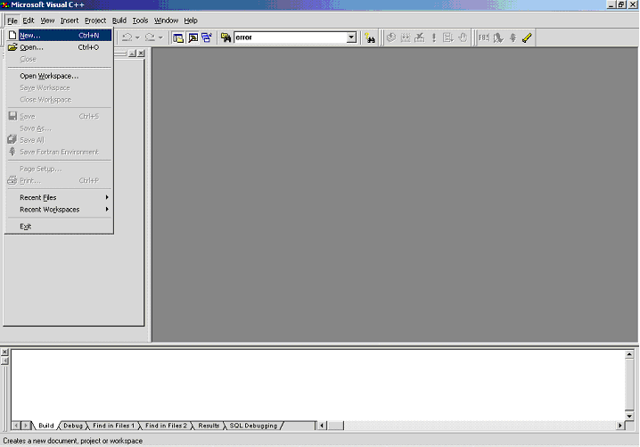

В появившемся диалоге “New”, во вкладке “Projects” следует выбрать пункт
“Fortran Dynamic Link Library”. В окне ввода “Location” по кнопке “…”
выбрать директорий, где будет расположен проект. В окне ввода “Project
name” ввести имя компоненты комплекса. Имя следует выбрать таким же, как
будет называться создаваемая компонента (модель/ПГО/ПРВП), и под которым
будет вызываться в PRADISlang. После указанных действий диалог “New”
должен выглядеть так:

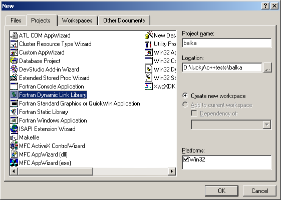

Если во вкладке “Projects” отсутствует пункт “Fortran Dynamic Link
Library”, значит не установлен корректно Digital Fortran 6.0a, и его
следует установить.

После указанного выбора следует нажать “OK” в диалоге “New”. В
появившемся затем промежуточном диалоге следует выбрать пункт “An empty
DLL application” и нажать “Finish”.

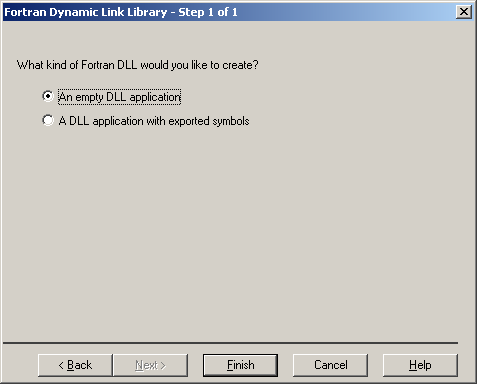

Затем следует нажать “OK” в диалоге “New Project Information”.

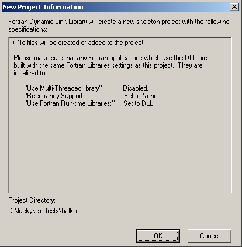

Добавить в проект файл с исходным кодом компоненты.
---------------------------------------------------

Перейти на вкладку “File View” в виде рабочего пространства MS Visual
C++ (левый клик мыши на надписи “File View”).

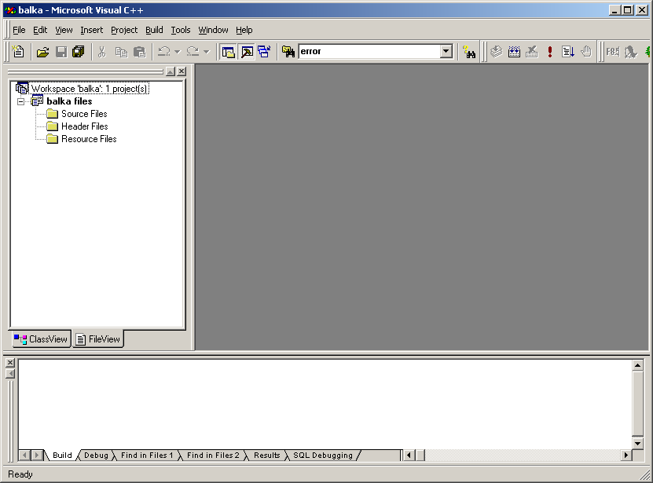

Затем следует выделить левым кликом мыши узел “Source Files”, вызвать на
нем контекстное меню (правый клик мыши на узле) и выбрать в нем пункт
“Add files to folder”.

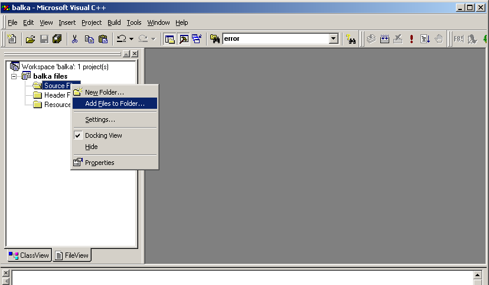

В открывшемся диалоге выбора файлов следует ввести имя файла с
расширением for. Имя должно совпадать с именем проекта. Следует
проследить, чтобы файл был создан в корректной директории (где
расположены остальные файлы проекта), а затем нажать OK.

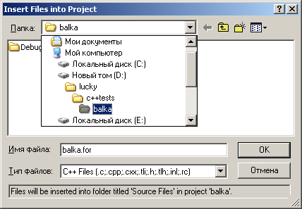

Далее, если файл не существовал ранее, возникнет предупреждение о том,
что файл не существует. В нем следует нажать “Да” (“Yes”). После этого
файл появится в дереве “File View” в узле “Source Files”. Следует
сделать на нем двойной левый клик мышью, и подтвердить предложение
студии создать файл (если он не существовал ранее). После этого файл
откроется, и студия будет выглядеть так.

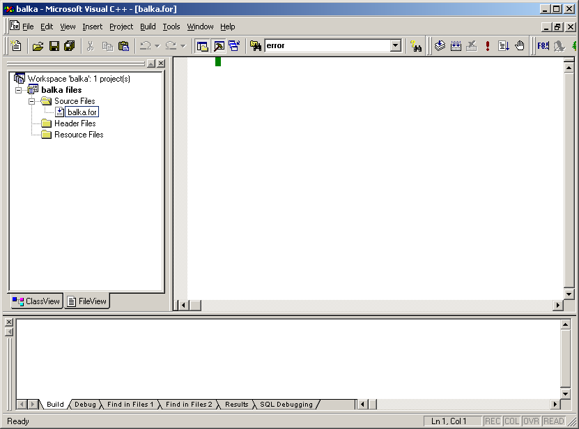

Обратите внимание, что в проект не следует добавлять никаких других
исходных файлов, кроме FOR файла, имя которого совпадает с именем
добавляемой компоненты. Иначе компоненту, возможно, не удастся собрать и
зарегистрировать с помощью утилиты ARM, поскольку утилита умеет
оперировать только одним исходным файлом.

В соответствии с ранее описанным пунктом “Ключи !, #, +: включение
программ пользователя.” в начало файла следует внести

-  специальный комментарий

-  затем включение файла init.inc

-  затем заголовок процедуры компоненты

-  затем специальный комментарий экспорта

-  затем описание аргументов процедуры компоненты

-  затем включение файла common.inc

-  затем тело процедуры и завершающий END

Затем сохранить файл сочетанием клавиш Ctrl+S. При этом студия будет
выглядеть так.

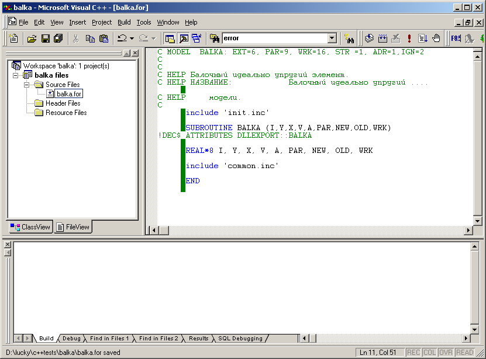

Регистрация компоненты с помощью arm.
-------------------------------------

Это действие необходимо для того, чтобы произвести корректную
регистрацию создаваемой процедуры компоненты в конфигурации комплекса.
Следует, например, в командной строке DOS перейти в каталог, где был
создан исходный файл процедуры компоненты. Затем вызвать arm с ключом +
и именем исходного файла без расширения в качестве аргумента. В случае
успешного вызова окно командной строки будет выглядеть так.

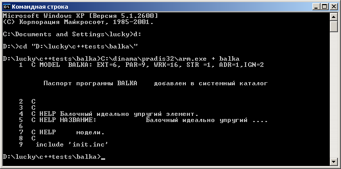

Настроить в проекте использование FORTRAN runtime, как многопоточной библиотеки.
--------------------------------------------------------------------------------

Сделать активным окно Visual C++ с открытым проектом компоненты, и
вызвать диалог настроек проекта сочетанием клавиш Alt+F7. Далее перейти
в диалоге “Project Settings” на вкладку “Fortran”, выбрать в комбобоксе
“Category” пункт “Libraries”, а затем включить чекбокс “Use
Multi-Threaded Library”. Следует проследить, чтобы настройки
устанавливались для отладочной конфигурации. При этом комбобокс
“Settings for” должен быть в положении “Win32 Debug”.

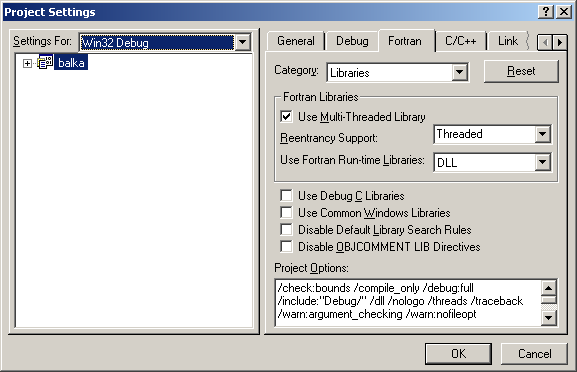

Далее следует нажать “OK” в диалоге “Project Settings”.

Добавить в проекте пути к включаемым файлам init.inc и common.inc.
------------------------------------------------------------------

Сделать активным окно Visual C++ с открытым проектом компоненты, и
вызвать диалог настроек проекта сочетанием клавиш Alt+F7. Далее перейти
в диалоге “Project Settings” на вкладку “Fortran”, выбрать в комбобоксе
“Category” пункт “Preprocessor”, а затем в конец поля ввода “INCLUDE and
USE Paths:” ввести подстроку “;c:/dinama/sysarm/plugin”, где “c:”
значение переменной окружения DINSYS (диск, где установлен PRADIS).
Следует проследить, чтобы настройки устанавливались для отладочной
конфигурации. При этом комбобокс “Settings for” должен быть в положении
“Win32 Debug”.

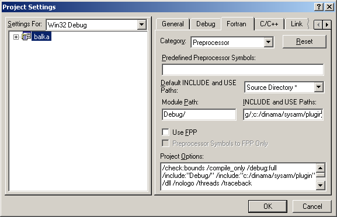

Далее следует нажать “OK” в диалоге “Project Settings”.

Добавить в проект связывание с библиотекой itgdll.lib.
------------------------------------------------------

Это действие необходимо, если в коде процедуры компоненты предполагается
использовать вспомогательные процедуры библиотек PRADIS, такие как вывод
ошибки (например, W_ERROUT) и т.п. Необходимо вызвать меню Project->Add
to project->Files. В появившемся диалоге “Insert files Into Project”
следует установить “Тип файлов” – “Library Files (.lib)”, а затем
выбрать файл c:/dinama/sysarm/plugin/itgdll.lib, где “c:” значение
переменной окружения DINSYS (диск, где установлен PRADIS).

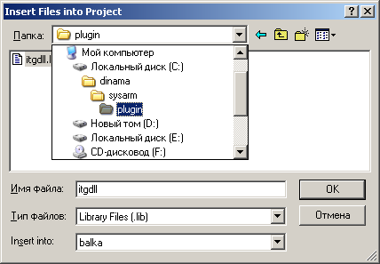

Далее следует нажать “OK” в диалоге “Insert files Into Project”.

Обратите внимание, что в проект не следует добавлять никаких
библиотечных файлов, кроме itgdll.lib. Иначе компоненту, возможно, не
удастся собрать и зарегистрировать с помощью утилиты ARM, поскольку
утилита при сборке динамической библиотеки компоненты не связывается ни
с какими другими библиотеками.

Настроить путь результирующего файла сборки в %DINSYS%/dinama/pradis32/.
------------------------------------------------------------------------

Сделать активным окно Visual C++ с открытым проектом компоненты, и
вызвать диалог настроек проекта сочетанием клавиш Alt+F7. Далее перейти
в диалоге “Project Settings” на вкладку “Link”, выбрать в комбобоксе
“Category” пункт “General”, а затем ввести в поле ввода “Output file
name” подстроку “c:/dinama/pradis32/” вместо префикса “Debug/”, где “c:”
значение переменной окружения DINSYS (диск, где установлен PRADIS).
Следует проследить, чтобы настройки устанавливались для отладочной
конфигурации. При этом комбобокс “Settings for” должен быть в положении
“Win32 Debug”.

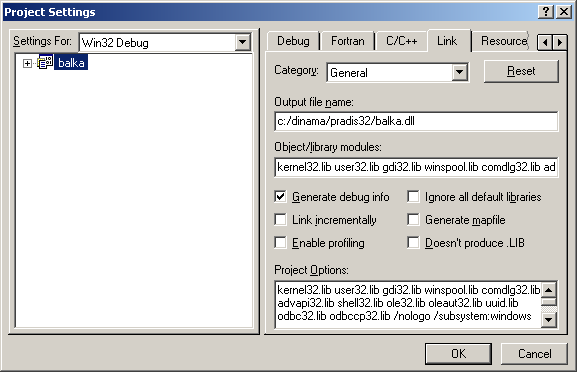

Далее следует нажать “OK” в диалоге “Project Settings”. Благодаря
выполненному действию проект будет помещать результирующий файл
динамической библиотеки после каждой его сборки там, откуда его будет
загружать комплекс. Теперь можно скомпилировать проект по клавише F7.
Предварительно следует убедиться, что для проекта активна отладочная
конфигурация. Для этого следует вызвать меню “Build->Set Active
Configuration”, и установить в диалоге “ Set Active Project
Configuration” конфигурацию “Win32 Debug”. В случае успешной сборки по
F7 (отсутствие ошибок –“errors” в нижнем окне студии), динамическая
библиотека компоненты будет замещена в установленном директории.

Установить консольный решатель в качестве отладочного приложения для библиотеки, а также аргументы его вызова.
--------------------------------------------------------------------------------------------------------------

Для того чтобы воспользоваться отладчиком студии для динамической
библиотеки, следует выбрать приложение, которое должно, запустившись,
загрузить библиотеку, а затем вызывать ее процедуру. В нашем случае
таким приложением является консольный решатель slang. Кроме того,
следует установить аргументы командной строки приложения. Для slang это
как минимум имя файла задания на PRADISlang. Без этого slang не
запустится, а только выдаст сообщение об ошибке. Итак, следует создать
файл задания на PRADISlang (обращающийся к создаваемой компоненте) и
разместить его в директории, где расположены файлы проекта. В нашем
примере это будет файл "D:\lucky\c++tests\balka\swing", в котором
присутствует обращение к BALKA.

Теперь следует сделать активным окно Visual C++ с открытым проектом
компоненты, и вызвать диалог настроек проекта сочетанием клавиш Alt+F7.
Далее перейти в диалоге “Project Settings” на вкладку “Debug”, выбрать в
комбобоксе “Category” пункт “General”, а затем ввести в поле ввода
“Executable for debug session” имя исполняемого файла консольного slang
с полным путем и расширением (exe). Можно нажать там на кнопку со
“стрелкой”, выбрать “Browse” и найти файл с помощью стандартного
диалога. После этого в поле ввода “Program arguments” следует ввести имя
расчетного задания “swing”. Следует проследить, чтобы настройки
устанавливались для отладочной конфигурации. При этом комбобокс
“Settings for” должен быть в положении “Win32 Debug”.

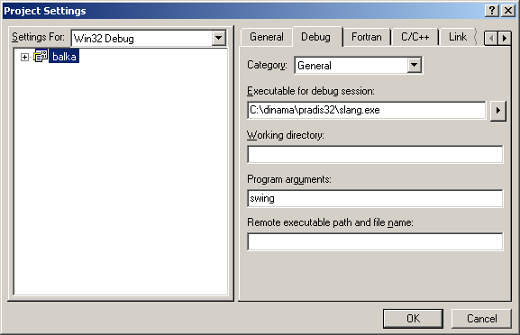

После нажатия на “OK” в диалоге можно будет отлаживать код процедуры с
отладчиком студии.

Использование отладчика.
------------------------

Отладчиком можно воспользоваться, только если проект успешно
компилируется (см. ранее). Прежде всего, следует установить в коде точку
прерывания. Для этого в исходном тексте процедуры компоненты следует
установить курсор на желаемой строке и нажать F9. В начале строки должен
появиться коричневый кружок. Затем для запуска отладочного приложения
следует нажать F5. В нашем случае запустится консольный решатель с
заданием, указанном в аргументах командной строки в предыдущем пункте.
Если в задании есть обращение к отлаживаемой компоненте, и все остальные
шаги этого пункта выполнены корректно, то консольный решатель загрузит
отладочную версию нашей динамической библиотеки, а затем выполнение
прервется, когда программа дойдет до точки прерывания.

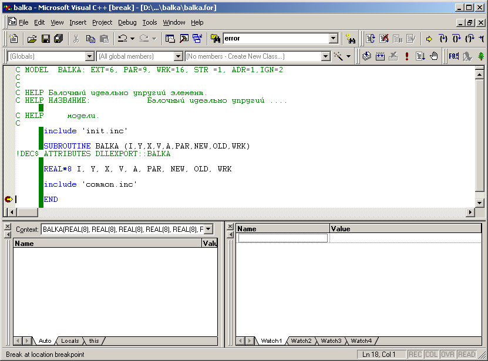

Далее можно смотреть текущие значения переменных, делать пошаговое
исполнение и использовать другие подобные возможности отладчика.

Сохранение проекта и пересоздание библиотеки компоненты с arm.
--------------------------------------------------------------

   После окончания работы с отладочной версией, которая заключается в
   редактировании исходного кода процедуры, перекомпиляции и отладки
   динамической библиотеки, следует сохранить проект, вызвав меню
   “File->Save All”. Затем им снова можно будет воспользоваться, открыв
   с помощью студии файл рабочего пространства с расширением dsw. Далее
   следует заново включить компоненту в комплекс из исходного файла,
   вызвав ARM с ключом +, как описано ранее в этом пункте. В результате
   в дистрибутиве комплекса вместо отладочной версии библиотеки вновь
   окажется ее оптимизированная Release сборка.
