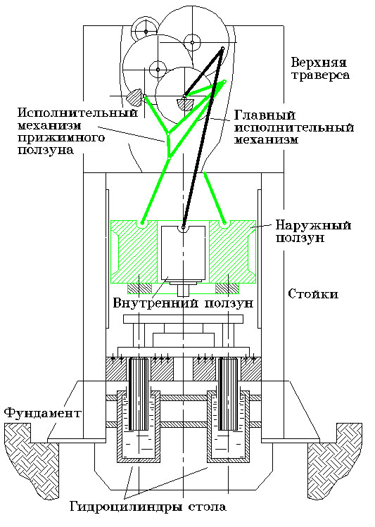
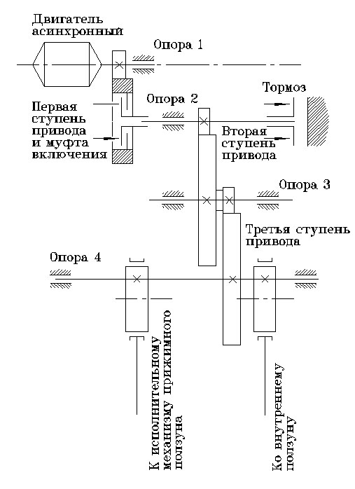
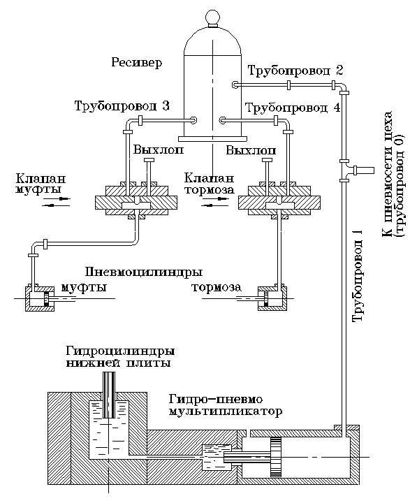
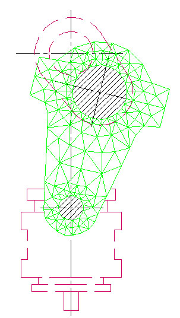
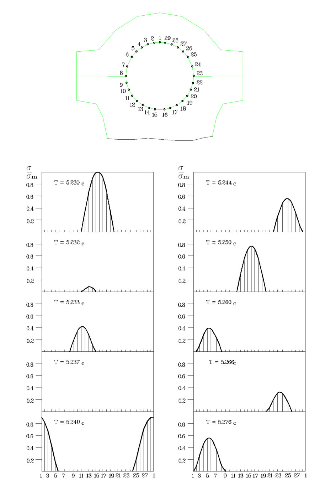
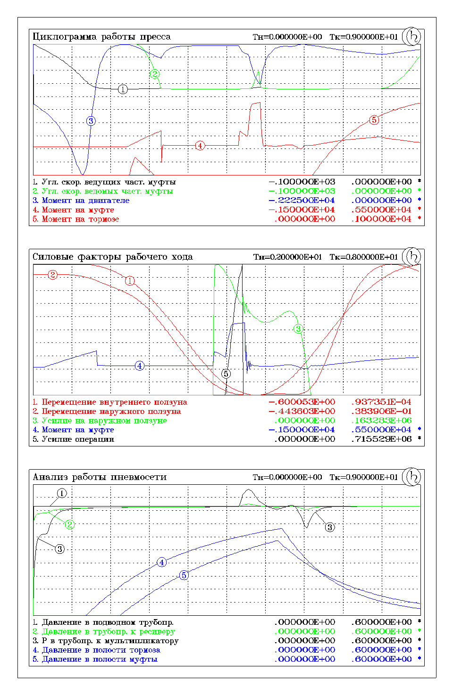
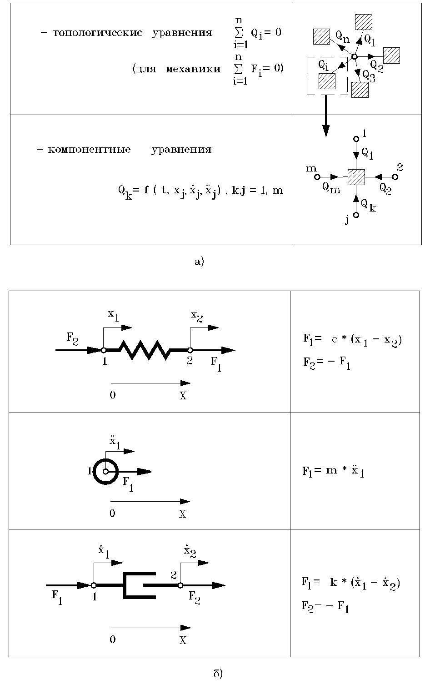
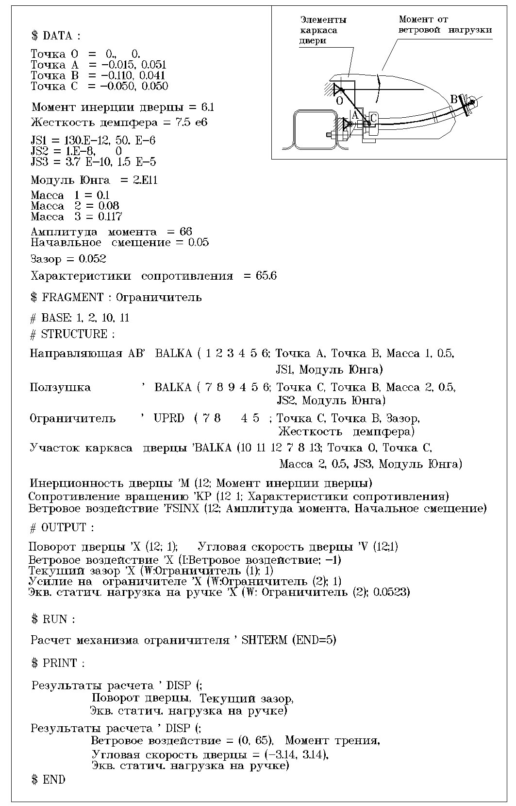
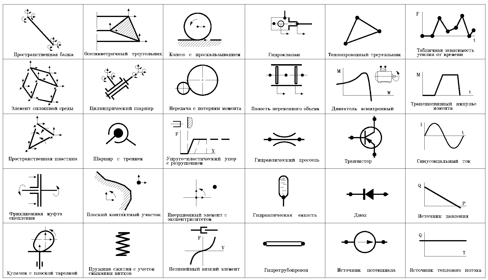

=====================
Общее описание PRADIS
=====================

Введение
========

   *"Наверное, нет нужды доказывать, что плохим инструментом нельзя
   прилично сделать работу даже и при хороших руках, в то время, как
   хороший инструмент выручает и не очень опытного мастера".*

   **Из учебника по столярному делу.**

В ходе проектирования технических систем важное место занимает
математическое моделирование динамических процессов в исследуемом
объекте. Необходимым условием для проведения таких работ является
наличие специального программного обеспечения (ПО), удовлетворяющего
определенным требованиям.

Поскольку в этом документе будет дано описание программной системы,
предназначенной для указанных целей (**PRADIS** - **PR**\ *\ ogram
for*\ **A**\ *\ nalysis of*\  **D**\ *\ ynam*\ **I**\ *\c*\  **S**\ *\ ystems*),
то естественно
предположить, что на момент осознания необходимости в новом программном
средстве у разработчиков не было удовлетворения от существующего
положения с программным обеспечением для динамических расчетов.

Основные соображения, которые определили как сам факт разработки
предлагаемого программного продукта, так и требования к нему, сводятся к
следующему:

1. Проектирование технических устройств включает решение задач разного
характера даже в пределах одной предметной области (например, в механике
- анализ механизмов, приводов, прочностной анализ конструкций и др.).
Для этих целей, как правило, используется набор достаточно
специализированных программных средств, каждое из которых отвечает за
свой участок фронта проектных расчетов. Поддержка всей совокупности
программ (обучение, сопровождение и проч.) требует затрат определенных
усилий высококвалифицированных специалистов, из-за чего надлежащую
поддержку всего необходимого программного обеспечения во многих случаях
трудно обеспечить.

2. Исследуемые технические объекты зачастую состоят из физически
разнородных подсистем (механическая часть, гидропневмосистемы,
электропривод), совместную работу и взаимное влияние которых необходимо
учитывать при расчете. Существенная часть таких задач вообще не решается
из-за отсутствия программное обеспечение с нужными функциональными
возможностями.

3. Не секрет, что все программы имеют ограниченные возможности по
представлению структуры и отражению свойств моделируемых объектов, по
составу рассчитываемых выходных характеристик, по форматам отображения
результатов. Печально, что в большинстве случаев расширение базовых
возможностей программы связано с перепрограммированием отдельных ее
частей. Эти действия требуют либо присутствия разработчиков, либо
подробной внутренней программной документации и исходных текстов. В
любом случае такая операция носит хирургический характер с высокой
трудоемкостью и вероятными осложнениями.

4. Часть программное обеспечение ориентирована только на определенную
вычислительную технику или операционную систему. Реально существующие у
пользователя ограничения (финансовые, технические, методические) на
возможность использования требуемой аппаратно-программной конфигурации
приводят к недоступности многих программ.

Приведенные соображения подводят к выводу, что желательна такая
организация выполнения проектных расчетов, при которой по возможности
используется единое программное средство, способное обеспечить решение
основной массы задач, расширяемое по мере необходимости и работающее на
любой доступной непосредственному специалисту вычислительной технике.

Этот вывод у разработчиков трансформировался в так называемую
**Парадигму Трех Китов**, включающую в себя систему обязательных
требований к программному обеспечению динамического анализа:

1. **Универсальность** по отношению к структуре анализируемого объекта и
   типу физических подсистем, в него входящих;

2. **Открытость** для расширения возможностей:

   -  по моделированию новых технических систем,

   -  по получению требуемых выходных характеристик,

   -  по отображению результатов расчета,

   -  по изображению объекта в процессе расчета.

3. Максимальная **переносимость** на любой компьютер.

Коснемся исторических корней разработки, во многом определивших ее
сущность. Базовое образование основной части коллектива разработчиков
(инженеры-механики в области обработки металлов давлением), их научная
специализация (динамические расчеты узлов кузнечнопрессовых машин,
моделирование технологических операций штамповки) и практическая работа,
связанная с расчетом узлов машин, определили прикладной инженерный
характер ПК PRADIS. Знакомство с программами автоматизации
схемотехнического проектирования, изучение опыта использования методов
решения типовых задач позволили очертить круг апробированных на практике
основных алгоритмов и численных методов, реализованных затем в
вычислительном ядре PRADIS. Наконец, желание сохранить наработки в части
механических приложений к программному комплексу ПА-6 (МВТУ им.
Н.Э.Баумана) привело к преемственности интерфейса моделей элементов и
сохранению общего подхода к формированию математической модели объекта.
Последним толчком, побудившим приступить к непосредственной реализации,
было весьма поучительное событие: смена вычислительной техники на ВЦ с
фактической утратой всего программного обеспечения, написанного на языке
ассемблера. Вот пример, когда радость встречи с новой техникой меркнет
перед горечью разлуки с привычными программными продуктами.

Назначение, круг решаемых задач
===============================

   *"Наши возможности довольно велики, они гораздо больше, чем полагают
   некоторые, не очень зоркие, люди".*

   **М. Булгаков. Мастер и Маргарита.**

Программный комплекс PRADIS предназначен для анализа динамических
процессов в механических системах и системах другой физической природы.

Предметом решения являются нелинейные нестационарные задачи. Расчет
проводится в функции времени в исходных координатах. Анализ статических
задач обеспечивается как частный случай динамического расчета.

Круг задач, которые могут быть решены с помощью PRADIS, достаточно
широк. Принципиально возможен анализ любых технических объектов, модели
поведения которых представимы системой дифференциальных уравнений (ДУ).
Практические возможности по анализу конкретных задач определяются
текущим составом библиотек комплекса, прежде всего библиотеки моделей
элементов. "Фундаментом" решения служит независимая от моделируемой
ситуации инвариантная часть комплекса, а наполнение модели объекта
осуществляется из подходящих "кирпичиков" библиотеки моделей элементов.
Благодаря приоритетному развитию библиотеки **механических** элементов
основным приложением PRADIS на сегодняшний день является анализ
механизмов и конструкций. Принимая это во внимание, можно перечислить,
какие результаты, интересующие пользователя чаще всего, могут быть
получены с помощью PRADIS при подобных расчетах.

1. **Кинематические характеристики:** положение звеньев механизма в
   различные моменты времени, линейные и угловые перемещения, скорости и
   ускорения точек, траектории движения, рабочие зоны механизмов,
   передаточные отношения.

2. **Силовые факторы** (усилия и моменты) в местах соединения элементов.

3. **Параметры напряженно-деформированного состояния** внутри
   деформируемых элементов: главные и эквивалентные напряжения,
   деформации, скорости деформаций, инварианты напряжений.

4. **Энергетика процессов:** перераспределение потоков энергии по узлам
   конструкции, потери на трение, поглощение энергии отдельными группами
   элементов, мощность приводов.

5. **Характеристики состояния** в узлах пневмогидросистем устройств:
   расходы, давления, потери.

Наряду с перечисленными типовыми выходными характеристиками, PRADIS
позволяет формировать другие необходимые пользователю специальные
показатели, например, биомеханические критерии травмируемости в задачах
пассивной безопасности автомобиля или показатели повреждаемости металла
в задачах обработки давлением.

Ниже приведен пример расчета, иллюстрирующий использование комплекса для
анализа динамических процессов при моделировании кривошипного
листоштамповочного пресса двойного действия.

Выбор именно этого примера определялся тремя факторами:

-  историческим местом рассматриваемой задачи как одной из первых,
   решенных с помощью PRADIS;

-  наличием в структуре объекта моделирования типовых элементов
   машиностроительных устройств, имеющих к тому же различную физическую
   природу;

На рис. 2.1 – 2.3 изображены элементы конструкции пресса: исполнительные
механизмы наружного и внутреннего ползунов, схема взаимодействия
механической и гидравлической подсистем пресса, кинематическая схема
привода, а также гидро- и пневмосхемы пресса. Кроме того, шатун главного
исполнительного механизма представлен изображенной на рис. 2.4 областью
конечных элементов, которая совместно с другими частями механизма
совершает плоское движение. Более подробное разбиение шатуна необходимо
для оценки напряженного состояния в теле шатуна при выполнении
технологической операции.

Рис.2.1.Общая схема пресса.       

Рис.2.2.Кинематическая схема привода пресса.

Рис.2.3.Пневматическая и гидравлическая схемы пресса.

Рис.2.4.Схема представления шатуна главного исполнительного механизма областью конечных элементов.

Математическая модель пресса в соответствии с конструктивной схемой
состоит из фрагментов гидро- и пневмосистем, привода, звеньев
кинематической цепи, рычажных исполнительных механизмов,
конечноэлементного фрагмента шатуна. Между опорной поверхностью большой
головки шатуна и эксцентриковым валом предусмотрен начальный радиальный
зазор для отслеживания контактных напряжений в процессе рабочего хода.

Один полный цикл работы пресса составляет 9 секунд.

**В промежуток времени 0-1.6** происходит наполнение пневмосети пресса,
включение двигателя и разгон ведущих частей муфты. На графике
"Циклограмма работы пресса" можно проследить характерную для
асинхронного двигателя зависимость момента от угловой скорости.

**Через две секунды после включения двигателя** включается клапан муфты.
Угловая скорость ведомых частей муфты растет и сравнивается с угловой
скоростью ведущих частей. Начинается перемещение наружного и внутреннего
ползунов вниз. В момент включения муфты за счет разгона неподвижных
инерционных элементов привода и исполнительного механизма угловая
скорость ведущих частей муфты падает, что приводит к всплеску момента на
валу двигателя.

**В нижнем положении (промежуток времени 4.3-5.7 секунды с момента
включения двигателя)** происходит выстой наружного ползуна. При этом
усилие прижима заготовки определяется взаимодействием наружного ползуна
через штамп с гидроцилиндрами стола.

**Промежуток времени 4.4 - 4.9 секунды** характеризуется выполнением
технологической операции. Виден значительный всплеск крутящего момента
на валу двигателя. Заметно падение угловой скорости ведущих частей
муфты. Отмечается расхождение ведомых и ведущих частей (проскальзывание
муфты), что говорит о недостаточности передаваемого муфтой крутящего
момента.

**В момент времени 6.5 секунды** отключается клапан муфты, а в момент
времени 6.55 секунды отключается клапан тормоза.

Рис. 2.5 иллюстрирует динамику перераспределения контактных напряжений в
большой головке шатуна в момент срыва технологической нагрузки.
Наблюдаются значительные скачки по амплитуде и местоположению
максимальных контактных напряжений.

На рис. 2.6 приводятся примеры графиков, иллюстрирующих основные
особенности работы пресса в различные моменты времени. Необходимо
подчеркнуть, что все приводимые результаты получены в ходе однократного
анализа цикла работы пресса.

Приведенный пример в некоторой степени характеризует возможности
программного комплекса по решению достаточно разнотипных задач. Можно
отметить, что PRADIS стирает традиционные, но во многом искусственные
различия между конечноэлементным расчетом и решением задач кинематики и
динамики механизмов, между анализом механизмов с твердыми звеньями и
расчетом устройств с гидравлическими, пневматическими или электрическими
элементами. У PRADIS нет ограничений на структуру связей между
элементами, на величину и характер перемещений отдельных точек, на
принадлежность элемента к какой-либо физической природе. Фактически
единственным объединяющим началом в задачах, доступных для решения с
помощью PRADIS, является выполнение фундаментальных физических законов
сохранения для исследуемой предметной области.

Рис.2.5.   Распределение контактных напряжений в большой головке шатуна во время срыва технологической нагрузки.

Рис.2.6.   Примеры графиков, иллюстрирующих основные особенности работы пресса в различные моменты времени.                          

Используемые математические методы
==================================

   *"Обвиняйте в убийстве меня, в колдовстве,*

   *В слабоумии, если хотите;*

   *Но в увертках сомнительных и в плутовстве*

   *Я никак не повинен, простите".*

   **Л. Кэрролл. Охота на Снарка.**

Для более детального представления о применимости PRADIS к анализу
каких-либо динамических процессов и предваряя описание возможностей
отдельных функциональных составляющих комплекса, имеет смысл дать
характеристику используемых математических методов. Поскольку этому
вопросу посвящен отдельный документ, здесь будет приведено лишь
необходимое для дальнейшего изложения краткое описание.

Как известно, анализ переходных процессов в моделируемом объекте
сводится к формированию и решению системы нелинейных дифференциальных
уравнений. В этой связи методы, реализованные в PRADIS, разделим
соответственно на две группы:

-  метод формирования математической модели объекта в виде системы
   дифференциальных уравнений;

-  последовательность методов решения получаемой системы
   дифференциальных уравнений.

Формирование исходной системы ДУ производится узловым методом. В
механике твердого тела ему соответствует метод перемещений, при
моделировании электрических схем он известен как метод узловых
потенциалов, в задачах анализа гидроприводов и гидропередач часто
именуется методом расчета на основе элементно-узловых структур.

Сущность узлового метода состоит в следующем. Моделируемая система
разделяется на отдельные элементы. Каждый элемент имеет определенное
количество степеней свободы (узлов), состояние которых характеризуется
двумя типами переменных: перемещение и усилие - в механических
элементах, давление и расход - в элементах пневмогидросхем, напряжение и
ток - в электрических элементах. Обобщенно эти две группы переменных
различают как потенциальные (перемещение, давление, температура,
электрическое напряжение) и потоковые (сила, расход, тепловой поток,
электрический ток). Модель любого выделенного элемента может быть
описана так называемыми компонентными уравнениями, в которых потоковые
переменные в узлах элемента определяются как функции потенциальных
переменных (рис.3.1).

Сборка компонентных уравнений всех элементов в одну систему ДУ
осуществляется в прямом соответствии со структурой связей между
элементами, точнее между узлами элементов. В узлах, являющихся общими
для нескольких элементов, выполняются определенные условия сохранения
для потоковых переменных, а именно: алгебраическая сумма значений
потоковых переменных равна нулю. Уравнения, отражающие эти условия
сохранения и называемые топологическими уравнениями, и позволяют,
собственно, связать компонентные уравнения отдельных элементов между
собой. В зависимости от физической природы элементов, объединяемых в
узле, законы сохранения могут представлять собой: в механических
элементах - условия динамического равновесия (принцип Даламбера), в
электрических - условие непрерывности токов (1-й закон Кирхгофа), в
элементах гидравлических, пневматических, тепловых цепей - условие
неразрывности потока. Результатом работы алгоритмов узлового метода
формирования математической модели является получение в общем случае
системы нелинейных ДУ, в которых могут присутствовать производные как по
пространственным координатам, так и по времени. Если задача приводит к
появлению уравнений в частных производных, то вопрос с дискретизацией
пространственной области решается на уровне моделей элементов и приводит
к алгебраизации компонентных уравнений. Здесь используется либо
конечно-разностный подход к аппроксимации производных, либо один из
методов аппроксимации базисными функциями.

Рис.3.1.     Узловой метод формирования математической модели           

                а) общая схема метода;                                  

		    	б) примеры компонентных уравнений для простейших элементов.                                              

В итоге исходная система ДУ преобразуется в систему обыкновенных
дифференциальных уравнений (ОДУ) второго порядка и имеет вид::

    F ( X, X', X'', T ) = 0

с начальными условиями для значений X и X'. Здесь X - вектор узловых
перемещений, T - время, X' = dX/dT, X'' = d(dX/dT)/dT.

Оговоримся, что под узловыми перемещениями здесь и далее должны
пониматься и другие потенциальные переменные для элементов
немеханической природы.

Численное интегрирование системы ОДУ осуществляется неявными
одношаговыми методами (методами Штермера или Ньюмарка) с контролем
точности и автоматическим выбором шага. Использование неявных методов
интегрирования диктуется требованием вычислительной устойчивости,
поскольку модели реальных динамических процессов в технических объектах
часто сводятся к "жестким" системам ДУ, когда на фоне медленно
протекающих процессов необходимо отследить быстрое изменение некоторых
характеристик.

В ходе численного интегрирования время как независимая переменная
представляется совокупностью дискретных значений. В результате
дискретизации по времени система ОДУ на каждом шаге интегрирования
сводится к системе нелинейных алгебраических и трансцедентных уравнений
(СнЛУ), которая для i-го момента времени (при T=Ti) имеет вид::

    F ( Xi, Xi', Xi'', Ti ) = 0,

где Xi, Xi', Xi'' - значения X, X', X'' при T=Ti.

Для решения получаемой системы нелинейных уравнений используется метод
Ньютона, который сводится к выбору начального приближения и организации
последовательности итераций. На каждой итерации определяются очередные
приращения к значениям неизвестных по схеме: линеаризация уравнений в
окрестности текущего приближения, вычисление якобиана системы (матрицы
частных производных) и правых частей, решение получаемой системы
линейных алгебраических уравнений (СЛАУ). Итерации заканчиваются, когда
очередное уточнение решения становится достаточно малым.

Важное место в этом алгоритме занимает процесс решения системы линейных
алгебраических уравнений, поскольку эта часто повторяющаяся стадия во
многом определяет вычислительные затраты всего этапа расчета. Система
линейных уравнений на каждой ньютоновской итерации имеет вид::

    [Y] \* {dX} = {I},

где [Y] - якобиан, являющийся матрицей коэффициентов СЛАУ;

{dX} - определяемый вектор приращений;

{I} - вектор правых частей.

Матрица коэффициентов структурно симметрична, но в общем случае не
обладает числовой симметрией и диагональным преобладанием. Решение
системы осуществляется методом прямого исключения по Гауссу и учитывает
высокую разреженность матрицы коэффициентов. Для максимального снижения
вычислительных затрат необходимо по возможности сохранить исходную
разреженность матрицы. Для этого используются несколько методов
оптимального упорядочения при обработке уравнений (алгоритм минимальной
степени, упорядочение по критерию минимального локального заполнения и
др.).

Состав комплекса. возможности функциональных составляющих
=========================================================

   *"Почтенный замок был построен,*

   *Как замки строиться должны:*

   *Отменно прочен и спокоен*

   *Во вкусе умной старины".*

   **А.С. Пушкин. Евгений Онегин.**

Можно выделить следующие основные составляющие программного комплекса
PRADIS:

-  Входной язык, транслятор с входного языка.

-  Вычислительное ядро, включающее:

-  программы интегрирования систем нелинейных дифференциальных уравнений
   2-го порядка;

-  пакет решения систем линейных алгебраических уравнений с учетом
   высокой разреженности матриц.

   -  Подсистема оперативного отображения текущих результатов расчета.

   -  Постпроцессор, предназначенный для анимации результатов
      моделирования в реальном и модельном масштабе времени, построения
      графиков и создания таблиц результатов.

   -  Библиотеки комплекса:

-  библиотека моделей элементов;

-  библиотека программ графических образов;

-  библиотека программ расчета выходных переменных;

-  библиотека программ отображения результатов.

   -  Процедуры управления заданиями, сервисные программы.

Подсистема ввода исходных данных
--------------------------------

   *"Без языка и колокол нем".*

   **Русская народная поговорка.**

Основным средством, обеспечивающим ввод исходных данных, является
входной язык комплекса **PradiSlang**. Пример текста на входном языке
изображен на рис. 4.1.

Рис.4.1. Пример текста задания на входном языке PRADIS для расчета механизма ограничителя двери автомобиля.

При описании структуры моделируемое устройство представляется
совокупностью элементов, соответствующих конструктивным узлам (рычаги,
шарниры, передачи, направляющие и др.). Модель исследуемого объекта
может быть образована как совокупностью отдельных элементов, так и
объединением других объектов и элементов, при этом вложенность объектов
друг в друга не ограничена. При необходимости отдельные детали
представляются с требуемой степенью подробности областями конечных
элементов.

В качестве входных параметров для элементов фигурируют данные
конструкторской документации: геометрические размеры конструктивных
элементов, характеристики узлов и свойства материалов, получаемые из
испытаний. Таким образом, язык позволяет оперировать терминами той
предметной области, к которой принадлежит моделируемое устройство.

Средствами языка обеспечивается и описание визуального представления
модели объекта в результате расчета. Задание на построение изображения
объекта предусматривает как режим "по умолчанию" с использованием
стандартных графических примитивов, так и "привязку" выбранных
пользователем графических примитивов к отдельным элементам модели.

Соответствующим вариантом описания задания можно обеспечить:

-  формирование и расчет новой модели объекта;

-  замену входных параметров для подготовленной модели без ее повторного
   формирования;

-  автоматическое сохранение состояния расчета с заданным шагом и
   восстановление состояния расчета с последней точки сохранения;

Заканчивая краткий обзор возможностей входного языка, уместно сделать
следующее замечание. В отдельных случаях, в частности при описании
достаточно сложных конечноэлементных фрагментов объекта, подготовку
данных по разбиению на элементы целесообразно осуществлять с помощью
специализированных графических препроцессоров, если таковые имеются в
распоряжении пользователя. В этом случае в состав утилит комплекса
необходимо включить программу, преобразующую результаты препроцессорной
обработки во фрагмент текста описания объекта на языке PRADIS или сразу
во внутреннее представление комплекса.

Вычислительное ядро комплекса
-----------------------------

Функция вычислительного ядра PRADIS - расчет переходных процессов в
технической системе в соответствии с заданием на анализ. Реализованные в
программе интегрирования математические методы были описаны выше.

Основные вычислительные возможности программы интегрирования:

-  возможность выбора базисной переменной (перемещение, скорость),
   относительно которой ведется решение;

-  выбор метода оптимального упорядочения уравнений для гауссовского
   прохода при решении СЛАУ;

-  предварительное тестирование подготовленной матричной структуры;

-  автоматический выбор шага интегрирования по критериям локальной
   погрешности и сходимости решения СнЛУ и возможность управления
   показателями точности по названным критериям;

-  автоматическое сохранение состояния расчета с последующим рестартом с
   точки сохранения;

-  демпфирование высокочастотных паразитных колебаний до заданной полосы
   частот.

Все используемые при расчете действительные переменные - двойной
точности.

Отладочные возможности:

-  пошаговая распечатка показателей локальной погрешности и (или)
   сходимости решения СнЛУ для всех узлов или отдельного узла на
   протяжении указанного интервала времени;

-  сообщения о последовательности действий программы при оценке
   завершенности итераций, при выборе значения очередного шага.

Временной интервал расчета может быть разбит на несколько этапов, для
каждого из которых возможно использование программы интегрирования со
своими параметрами.

Подсистема оперативного отображения текущих результатов расчета
---------------------------------------------------------------

Текущие результаты расчета могут отображаться на экране дисплея и
включают в себя статистику процесса расчета.

Подсистема отображения результатов расчета и визуализации
---------------------------------------------------------

В качестве подсистемы отображения результатов расчета и визуализации
используется постпроцессор, который предназначен для:

-  анимации результатов моделирования в реальном и модельном масштабе
   времени;

-  построения графиков, в том числе фазовых;

-  создания таблиц результатов с возможностью их последующего экспорта в
   EXCEL.

Библиотеки комплекса
--------------------

   *" - Мне очень приятно, - радостно сказал Пух, - что я догадался
   подарить тебе Полезный Горшок, куда можно класть какие хочешь вещи!"*

   **А.А. Милн. Винни-Пух и все-все-все.**

Для каждого типа библиотек комплекса (моделей элементов, программ
расчета выходных переменных, программ графических образов и программ
отображения) существует набор базовых компонент, достаточно
универсальных, чтобы во многих задачах ограничиваться только их
использованием. Однако большое разнообразие технических систем и
критериев оценки протекающих в них процессов требуют соответствующей
гибкости от программного обеспечения. Такая гибкость в ПК PRADIS
поддерживается возможностью включения новых компонент в библиотеки
комплекса. Поэтому состав библиотек динамичен и для текущей версии
комплекса зависит от конфигурации и предметной ориентации конкретной
поставки.

Модели элементов
~~~~~~~~~~~~~~~~

Вычислительные обязанности моделей элементов - программная реализация
компонентных уравнений и расчет якобиана. Применительно к механике - это
расчет усилий (сил и моментов) в узлах соединения элемента по
передаваемым в модель перемещениям, скоростям и ускорениям и вычисление
матрицы частных производных от усилий по перемещениям, скоростям и
ускорениям. Для, например, гидравлических элементов (или гидравлических
ветвей гидромеханических элементов) модель считает расходы в зависимости
от давления и соответствующие частные производные от расхода по
давлению.

С точки зрения пользователя, не отягощенного заботами о разработке
собственных моделей элементов, любая библиотечная модель элемента - это
компонента, которая отражает определенные физические свойства реального
элемента и должна быть правильно присоединена своими "концами для
подключения" к другим моделям элементов при описании структуры всего
объекта.

Примеры типовых элементов из библиотек моделей элементов PRADIS
приведены на рис. 4.2.

Рис.4.2. Примеры типовых элементов комплекса PRADIS.            

Программы расчета выходных переменных
~~~~~~~~~~~~~~~~~~~~~~~~~~~~~~~~~~~~~

Базовые возможности программ расчета выходных переменных наиболее часто
используются для получения перемещений, скоростей, ускорений, усилий,
энергии, мощности, расходов, давлений, суммы величин, изменения
расстояний, отслеживания минимальных и максимальных значений для
нескольких изменяющихся переменных. Расчет каких-либо специфических
показателей, необходимых в конкретной задаче (например, углы развала и
схождения колес, смазочное число в контакте кулачковой пары или индекс
степени опасности травмы головы при ударе) становится доступным, если
пользователь (или лицо, ответственное за сопровождение комплекса)
реализует формулу вычисления требуемой характеристики в виде
подпрограммы и включит ее по формальным правилам в пользовательскую
библиотеку.

Программы графических образов
~~~~~~~~~~~~~~~~~~~~~~~~~~~~~

Программы графических образов ответственны за визуальное представление
элементов объекта в результате расчета. Графические образы
"привязываются" либо к моделям элементов, либо изображают окружающую
обстановку. Существуют графические образы, отображающие элементы в
режиме "умолчания" и поэтому достаточно схематичные, и нестандартные
образы, предназначенные для придания выразительности формируемой
картинке. Поэтому степень прорисовки объекта зависит от желания
пользователя, а трудоемкость разработки новых нестандартных графических
примитивов сведена к минимуму.

Программы отображения результатов
~~~~~~~~~~~~~~~~~~~~~~~~~~~~~~~~~

Программы отображения результатов предназначены для постпроцессорной
обработки результатов расчета. Базовая библиотека включает следующие
программы отображения.

1) Программа отображения результатов в виде графиков на экране дисплея.
Обеспечивает получение графиков выходных переменных как в функции
времени, так и в зависимости от любой выходной переменной. Графики
выводятся для указанного интервала времени и в заданном масштабе.

2) Программа отображения результатов в виде таблицы числовых значений
используется при необходимости иметь информацию о выходных переменных в
цифровом виде и для определения экстремальных значений переменных на
указанном интервале времени.

Управляющие процедуры
---------------------

Процедурное обеспечение включает процедуру выполнения задания и
процедуру обслуживания системного каталога.

**Процедура выполнения задания** организует взаимодействие программных
составляющих комплекса между собой и с операционной средой в процессе
прохождения задания.

**Процедура обслуживания системного каталога** поддерживает операции
включения/исключения модулей в библиотеки комплекса и выдачу справочной
информации (встроенный HELP) по интересующей пользователя теме.

Последовательность прохождения задания
======================================

Опишем в целом последовательность работы основных программ комплекса при
прохождении задания.

Процесс в любом случае начинается с трансляции текста на входном языке
PRADIS. **Транслятор** проводит синтаксический и семантический анализ
текста, формирует необходимые структуры данных для последующей обработки
и помещает всю информацию в рабочий файл. В зависимости от содержания
текста, обработанного транслятором, возможны три альтернативы
дальнейшего прохождения задания.

1. Текст содержал описание объекта - необходим полный проход с
формированием математической модели объекта и списка выходных
переменных.

2. Текст содержал только директивы предрасчетной обработки и вызовы
программ интегрирования и отображения - в этом случае идет работа с уже
сформированной ранее моделью и исключаются этапы, связанные с
формированием новой математической модели объекта.

3. В тексте встретились только вызовы программ отображения - необходима
лишь обработка полученных ранее результатов расчета.

Пройдем по **первому**, наиболее полному, пути. **Программа
факторизации**, вступающая в действие после транслятора, отвечает за
подготовку оптимальной матричной структуры системы уравнений. На этом
этапе осуществляется предварительная сборка образа математической модели
объекта, проводится перенумерация узлов с целью минимизации
вычислительных затрат на стадии расчета, подсчитываются размеры основных
массивов, оцениваются затраты на один шаг решения.

**Программа управления базой данных** модели объекта размещает всю
информацию об объекте и задании на анализ.

После завершения работы программы управления базой данных проводится
расчет с использованием стандартной рабочей программы. Отображение
результатов расчета является последним этапом на пути прохождения
задания. Вид и последовательность отображения результатов определяются
составом **программ отображения**, включенных в описание задания.

**Второй** вариант прохождения задания включает исполнение директив
предрасчетной обработки и расчет с помощью уже сформированной рабочей
программы. Это позволяет путем замены исходных параметров как самой
математической модели, так и данных, ответственных за оперативное
отображение текущих результатов расчета (изображение объекта, графики
выходных переменных), проводить многовариантный анализ без излишних
накладных расходов. Такой проход используется и в том случае, когда
нужно просто продолжить расчет с момента последнего прерывания.

**Третий** вариант обработки задания особых комментариев не требует -
выполняется задание на отображение ранее полученных результатов расчета.

Требования к составу параметрам технических средств и программному окружению
=============================================================================

   *"Это был бы сон, волшебный сон,*

   *Каждый был бы просто чемпион,*

   *Если мог бы выбирать себе коней".*

   **А. Макаревич**

Текущие требования к окружению:

-  Операционная система: Windows 5.0 (2000), Windows 5.1 (XP) и выше ;

-  Процессор – архитектура x86 (Intel, AMD и т.п.) Частота 600 МГц и
   выше;

-  Оперативная память 1 Гб и выше;

-  Место на жестком диске 100 Мб и выше;

-  Графическая карта – уровня GeForce2 256Мб и выше;

-  MS Visual C++ 6.0 или Intel Fortran 9.0 для разработки собственных
   математических моделей.

Основные требования к аппаратному обеспечению диктуются графическим
постпроцессором.

На кого это рассчитано?
=======================

   *"У нас лозунг: лифт для всех. Невзирая на лица. Лифт должен
   выдержать прямое попадание в кабину самого необученного академика".*

   **Стругацкие А. и Б. Сказка о тройке.**

Из изложенного выше можно представить спектр действующих и потенциальных
пользователей ПК PRADIS.

1. Инженеры-механики средней и высокой квалификации, связанные по роду
своей деятельности с расчетами на стадиях проектирования, доводки или
эксплуатации промышленных изделий.

2. Аспиранты и научные работники, использующие универсальное ПО
динамического анализа для разработки своих приложений в плане научных
интересов и хозяйственных договоров с предприятиями.

3. Студенты и школьники старших классов, изучающие общие принципы
математического моделирования технических устройств и (или) использующие
PRADIS при выполнении курсовых работ по общеинженерным и специальным
дисциплинам.

Документация-по-системе
=======================

Перечень документации по системе включает:

а) инструкция по установке и сопровождению комплекса;

б) общее описание системы;

в) учебное пособие;

г) справочник по системе;

д) описание языка PradiSlang;

е) сообщения об ошибках;

ж) справочник по библиотеке элементов;

з) включение программ пользователя в библиотеки комплекса;

и) описание основных математических методов.

Кроме того, специализированное программное обеспечение, разработанное на
основе PRADIS, сопровождается конкретными методиками его использования.

О том чего не следует ожидать или то к чему нужно быть готовым
=================================================================

   *" - Будешь делать зарядку каждое утро! - сказал попугай. - И от этой
   зарядки ты будешь все время заряжаться, заряжаться... А потом - бах!
   - и станешь сильной.*

   *- А нельзя сразу - бах? - спросила мартышка.*

   *- Нельзя! "*

   **Г. Остер. Зарядка для хвоста.**

Не следует ожидать, что:

-  для знакомства с системой будет достаточно встроенного HELP'а,
   инженерного образования и навыков работы с текстовым редактором;

-  реальные задачи будут легко трансформироваться в текст задания на
   языке PRADIS;

-  все исходные параметры моделей элементов будут известны на момент
   расчета;

-  для разбиения пространственных конструкций на конечные элементы будет
   достаточно развитого пространственного воображения;

-  задача всегда "влезет" в доступную оперативную память;

-  время расчета будет соответствовать запасу терпения;

-  изображение объекта на экране будет иметь фотографический характер;

-  программа интегрирования с ключами по умолчанию будет одинаково
   хорошо считать колебания маятника, удар в бампер автомобиля и
   процессы в управляющих гидросистемах;

-  легко удастся проверить результаты расчета адекватным экспериментом;

-  после получения результатов моделирования Вы всегда будете способны
   ответить, зачем Вы это делали.

Поэтому нужно быть готовым к тому, что:

-  необходимым условием успешного использования PRADIS является
   специальное обучение (как минимум, полное знакомство с
   документацией);

-  многие задачи можно будет ставить только на уровне качественных,
   чтобы оценить направление изменения и порядок значений исследуемых
   характеристик;

-  решение задач, требующих разработки новых моделей элементов, может не
   уложиться в оптимистично отводимые сроки;

-  более быстродействующая вычислительная техника в конечном итоге не
   приведет к заметному увеличению производительности выполнения работ в
   целом, поскольку именно низкая производительность сдерживает
   размерность задачи;

-  разработка моделей нетривиальных объектов потребует неукоснительного
   выполнения заветов кота Василия из известной повести Стругацких
   ("Труд, труд и труд. Только труд.");

-  как и в любом деле, чувство свободного владения инструментом появится
   только после приобретения определенного опыта работы с системой.

Еще-раз о самом главном
=======================

   *"То, что окончательно ясно, следует указать".*

   **Автор изречения неизвестен.**

1. В этом документе речь шла об универсальном программном комплексе для
анализа переходных процессов в технических объектах, т.е. процессов,
характеристики которых изменяются во времени.

2. Универсальность рассматриваемого программного продукта определяется
его способностью:

-  анализировать объекты, состоящие из различных физических подсистем
   (механических, гидравлических, пневматических, электрических,
   тепловых);

-  решать задачи, традиционно относимые к разным классам даже в пределах
   одной предметной области (для механики - кинематический и силовой
   анализ механизмов, расчет напряженно-деформированного состояния,
   исследование ударных процессов, динамика и энергетика приводов и
   др.);

-  формировать по результатам расчета те выходные показатели, которые,
   по мнению пользователя, в наибольшей степени характеризуют
   анализируемый процесс.

3. Наряду с Универсальностью, важнейшими особенностями ПК PRADIS
являются Переносимость и Расширяемость.

4. На любой текущий момент времени возможности комплекса, определяющие
круг решаемых задач а также получение и отображение выходных показателей
исследуемых процессов, ограничены. Ограничения эти преодолеваются путем
расширения библиотек комплекса, а именно:

-  библиотеки моделей элементов;

-  библиотеки программ расчета выходных переменных;

-  библиотеки программ графических образов;

-  библиотеки программ отображения.

Включение новых компонент в библиотеки комплекса пользователь может
проводить сам, если это позволяет его уровень квалификации.

5. Непосредственно разработчиками PRADIS развивается направление,
связанное с анализом механизмов и конструкций, расчетом пневмо- и
гидромеханических устройств.

6. Для промышленного использования при проектировании конкретного класса
устройств комплекс позволяет создавать специализированные программные
приложения, обладающие всеми возможностями комплекса в части расчета и
отображения результатов. Такие автономные приложения значительно
компактнее, чем PRADIS целиком, и требуют от конечного пользователя
меньше усилий в освоении программного продукта.

7. Система поставляется документированной. Объем и содержание
документации позволяют надеяться, что затраченных пользователем часов на
ее освоение будет достаточно хотя бы для того, чтобы ценность
отведенного времени вызвала чувство жалости при попытках
(недоброжелателей) прервать Ваши добрые отношения с PRADIS.

Список сокращений
=================

ВЦ - вычислительный центр;

ДУ - дифференциальное уравнение;

ОДУ - обыкновенное дифференциальное уравнение;

ПО - программное обеспечение;

ПК - программный комплекс;

СЛАУ - система линейных алгебраических уравнений;

СнЛУ - система нелинейных (алгебраических и трансцедентных) уравнений.

