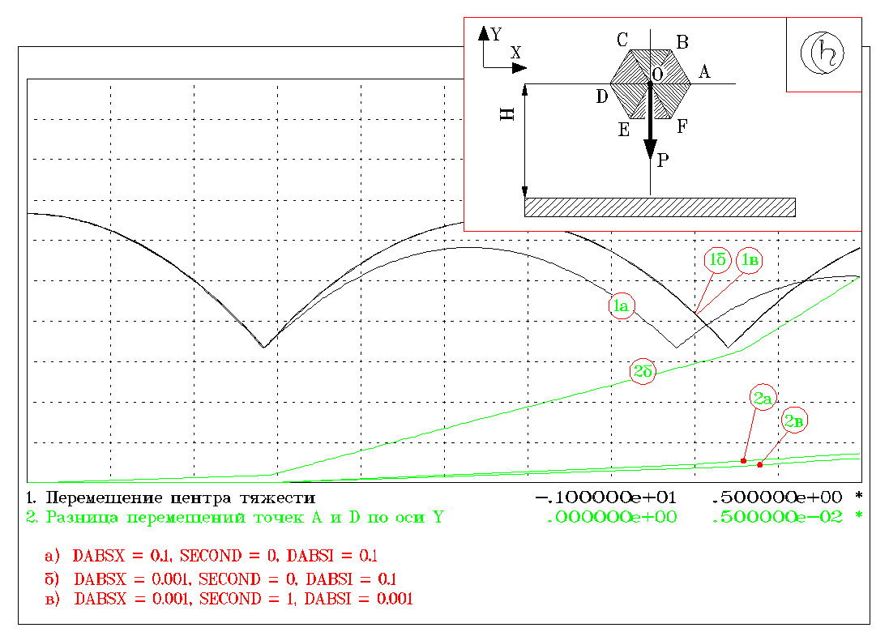

**Руководство к программе PRADIS**

Основные сведения о программном комплексе PRADIS
================================================

Последовательность изучения документации и общая схема работы с программным комплексом
--------------------------------------------------------------------------------------

Итак, на вашем компьютере установлен программный комплекс PRADIS. Это
достаточно развитое программное обеспечение, предназначенное для
проведения сложных расчетов переходных процессов. Изучение его
возможностей в полном объеме потребует, как и при работе с другим
аналогичным программным обеспечением, определенных усилий. При этом
может в значительной степени пригодиться опыт работы с
конечноэлементными программами. Однако нужно иметь в виду, что хотя
сферы применения PRADIS и конечноэлементных программ пересекаются в
какой-то степени, но не перекрываются полностью.

Основная особенность работы с PRADIS - это наличие в моделируемом
процессе протяженности по времени. Ни одна моделируемая задача не может
быть решена иначе, как в результате рассмотрения какого-либо процесса
той или иной продолжительности.

Авторы, создавая документацию по PRADIS, преследовали цель максимально
облегчить начинающему пользователю первые шаги в освоении пакета. По
нашему мнению, порядок изучения документации должен быть следующим:

-  *"Общее описание системы".* Этот несложный документ полезно прочитать
   еще до того, как вы займетесь установкой PRADIS на вашем компьютере.
   Он вам даст некоторое представление о назначении пакета, его основных
   составных частях, в какой-то степени позволит ознакомиться с
   терминологией, принятой в другой документации.

-  *"Инструкция по установке комплекса"*. Содержит все необходимые
   сведения по установке комплекса на ваш компьютер.

-  *"Руководство пользователя. Учебное пособие"*. Предназначено для
   экспресс-ознакомления с основными возможностями комплекса и быстрого
   начала работы с ним. Авторы настоятельно рекомендуют пользователю
   найти время, необходимое для изучения этого документа и выполнения
   приведенных там примеров.

-  Настоящий документ, справочники по библиотекам PRADIS, *"Справочник
   по ошибкам"* и *"Описание языка PradiSlang"* предназначены для
   ежедневной работы с комплексом и изучения некоторых вопросов, которые
   в каждый данный момент требуют более детальной проработки. После
   знакомства с первыми разделами каждого документа, содержащими общую
   информацию, и первичного беглого просмотра следует всегда держать их
   под рукой в качестве основных справочников. Вряд ли следует подробно
   изучать впрок эти документы, не имея перед собой какой-либо
   конкретной задачи, по которой у вас возникли вопросы.

-  *"Включение программ пользователя в библиотеки комплекса"* и
   *"Основные математические методы"* предназначены для
   квалифицированного пользователя. Они дают возможность разобраться с
   основными принципами работы вычислительного ядра PRADIS. Изучение
   этих документов позволит самостоятельно расширять возможности
   комплекса в той или иной сфере его применения.

Таким образом, настоящий документ кроме (возможно), его первой главы, не
предназначен для чтения начинающим пользователем. Если вы в настоящий
момент его изучаете, то вы, вероятнее всего, уже решили, по крайней
мере, несколько задач, описанных в *"Учебном пособии"*, и попытались
решить одну или несколько задач в вашей области деятельности. Вы
представляете себе, что для формирования математической модели
какого-либо процесса пользователь должен:

-  получить расчетную схему процесса;

-  описать на входном языке PRADIS исходные данные, структуру объекта и
   его изображение;

-  сформировать задание на расчет. При этом текст описания данных,
   объекта и изображения объекта должен предшествовать тексту описания
   задания; выполнить задание на формирование и расчет модели с помощью
   команды SLANG. В дальнейшем с помощью той же команды можно выполнять
   задания на расчет для уже сформированной модели.

Ниже более подробно рассмотрена файловая структура PRADIS и его основные
процедуры (SLANG, ARM).

Файловая структура
------------------

\****************************************\*

Библиотеки расширяемых компонент и файл системного каталога
-----------------------------------------------------------

Ключевым файлом в файловой структуре программного комплекса является
файл системного каталога (ARMCTLG). Он содержит всю необходимую
информацию для правильного формирования и анализа модели объекта. Кроме
того, в системном каталоге содержится необходимая справочная информация,
получаемая пользователем в режиме ONLINE по запросам с помощью процедуры
ARM.

Библиотечные программы подразделяются в соответствии с их назначением.
Программы, реализующие модели элементов, составляют библиотеку моделей
элементов. Программы, преобразующие результаты решения системы
дифференциальных уравнений в данные, непосредственно необходимые
пользователю, представляют собой библиотеку программ расчета выходных
переменных. Библиотека графических образов используется для описания
изображения объекта. Библиотека программ отображения содержит программы,
преобразующие результаты расчета для вывода на то или иное внешнее
устройство.

Компилятор PRADIS использует информацию, включенную в системный каталог,
для синтаксического контроля описаний вызовов тех или иных программ. При
этом информация относительно этих компонент переписывается из системного
каталога в рабочий файл и используется в дальнейшем для генерации
рабочей программы.

**Внимание!** С файлом системного каталога связаны некоторые вопросы
защиты авторских прав. Многие программы PRADIS в тех или иных ситуациях
могут использовать элементы системного каталога в качестве констант.
Поэтому для работы с системным каталогом (включения или исключения из
него информации) должна использоваться только штатная процедура
обслуживания системного каталога.

Процедуры PRADIS. Вызов процедур без параметров и проверка правильности установки комплекса
-------------------------------------------------------------------------------------------

Вызов процедур ARM и SLANG без параметров приведет к выдаче на экран
вашего дисплея справочной информации о допустимых вариантах вызова
процедур.

1. Процедура выполнения задания SLANG.

====================================================================

::

    Использование: slang [-m|-r] [-e|-s] [-pgoN] name1 [name2]
    Запустите решатель PRADIS в режиме симуляции.

    Параметры:
    name1   файл задания
            описание на языке PARDISland
    name2   имя предворительной задачи
            (когда работа повторяется с уже построенной моделью)

    Опции:
    -pgoN   запись графической 3D информации в файл
            (ПГО файл), N обозначает счётчик выводимых точек
            (выводить каждую N-ую точку), если N не задано,
            то N=1

    -e      использовать расширенный формат вывода на экран (по
            умолчанию)
    -s      использовать короткий формат вывода на экран
    -r      оценивать частоту вывода
            на экран в реальном времени (по умолчанию),
            значение частоты дисплея берётся
            из параметра PRTTIME решателя PRADIS (по умолчанию 30)
            текущее время должно показываться при условии
            текущее время-последнее показанное время>частота
    -m      оценивать частоту вывода
            на экран в модельном времени,
            значение частоты вывода на экран берётся,
            из параметра PRTTIME решателя PRADIS (по умолчанию 30),
            текущее время должно показываться при условии
            текущее время-последнее показанное время>частота

====================================================================

2. Процедура обслуживания системного каталога ARM.

====================================================================

::

    Использование: arm [<ключ> <имя1> [<имя2> [имя3 ... [имяN] ] ] ]

    Процедура обработки бинарного каталога PRADIS.

    <ключ>

    ? выводит справку по компонентам, содержащимся в

    бинарном каталоге
    
    + включает компоненты в бинарный каталог и строит

    динамические плагин-библиотеки, если возможно.

    Если не задано <имя1...N>, то пытается подключить

    шаблоны

    из файла templet.txt в текущем каталоге.

    p автоматически строит динамические плагин

    библиотеки и включает компоненты в бинарный каталог.

    u добавляет функции в пользовательскую библиотеку

    user.lib.

    # просто строит динамические плагин-библиотеки, если

    возможно

    ! включает компоненты в бинарный каталог

    Если не задано <имя1...N>, то пытается подключить

    шаблоны

    из файла templet.txt в текущем каталоге.

    - исключает компоненты из бинарного каталога

    \* выводит содержимое встроенной помощи

    <имя1...N> не применимо к этому ключу

    n создаёт пустой бинарный каталог в текущей директории

    <имя1...N> не применимо к этому ключу

    <имя1...N>

    имена запрашиваемых компонентов

====================================================================

Окончательно убедиться в правильности установки комплекса PRADIS можно
запуском программ из каталога DINAMA\TEST.

Командой::

    > SLANG SWING

запускается задание на расчет пружинно-стержневого маятника. При
выполнении этого задания на экране дисплея должны отображаться следующие
сообщения::

    M (S 700) Синтаксических ошибок не обнаружено.    

    M (P 088):(OUTMAP:-1)    
        Сообщения программы факторизации.    
            Структура модели после перенумерации.    
            Имя глобального фрагмента: ╠р Єэшъ    
            Модели элементов и степени свободы:    
    M (P 004):(TURBOF:-1)    
        Сообщения программы факторизации.    
            Статистика результатов символьной факторизации:    
            Размерность системы уравнений: 8.    
    M (P 005):(TURBOF:-1)    
        Общее количество ненулевых элементов: 52.    
            Вторичных ненулевых элементов: 0.    
            Заполнение якобиана(%): 81.25    
    M (P 006):(TURBOF:-1)    
        Ненулевых элементов после главной диагонали (параметр Q): 2.75    
        Затраты на решение системы уравнений:    
        миллионов операций с плавающей точкой - 0.218E-03    
    M (P 007):(TURBOF:-1)
        миллионов инструкций процессора (целочисленные операции, переходы и
    присваивания) - 0.360E-03    
        размер индексного массива (Кб) - 0.00    
    M (P 008):(TURBOF:-1)    
        Размеры сформированных векторов:    
        массив состояния расчета (Кб) - 5.18    
        адресный массив (Кб) - 2.25    
    Time information:    
     Model time = 0.000000000000e+000    
     Estimated time= 0.000000000000e+000    
     Expected finish time = ...    
    Current time step = 1.000000000000e-011    
    Time step information (Eyler):    
     Successful steps = 1    
     Unsuccessful steps:    
            Big local inaccuracy = 0    
            Absent convergence = 0    
            Bad results in models = 0    
            Bad Jakobian = 0    
    Iterative step information (Newton):    
     Successful iterations = 2    
     Unsuccessful iterations:    
            Big local inaccuracy = 0    
            Absent convergence = 0    
            Bad results in models = 0    
            Bad Jakobian = 0    
    Operative variables information:    
     Перемещение т.A по оси X = -2.489014957389e-034    
     Скорость т.A по оси X = -4.978029914778e-023    
     Ускорение т.A по оси X = -4.978029914778e-012    
    M (P 043):(MESSAG:-1)    
        Сообщения программы интегрирования.    
            Идентификатор программы: ╨рёўхЄ яЁєцшээюую ьр Єэшър    
    M (P 044):(MESSAG:-1)    
            Время начала интегрирования: 0.0000    
            Время окончания интегрирования: 3.0000    
            Размерность системы уравнений: 8.    
            Количество успешных шагов по времени: 357.    
    M (P 045):(MESSAG:-1)    
            Количество неудавшихся шагов по времени из-за:    
                - недопустимо большой локальной погрешности: 0.    
                - отсутствия сходимости процесса решения СнЛУ: 0.    
    M (P 046):(MESSAG:-1)    
                - неудовлетворительных результатов расчета в моделях элементов: 0.    
                - плохой обусловленности якобиана на шаге решения: 0.    
    M (P 047):(MESSAG:-1)    
            Общее количество успешных итераций: 1046.    
            Общее количество потерянных итераций из-за:    
                - недопустимо большой локальной погрешности: 0.    
    M (P 048):(MESSAG:-1)    
                - отсутствия сходимости процесса решения СнЛУ: 0.    
                - неудовлетворительных результатов расчета в моделях элементов: 0.    
    M (P 049):(MESSAG:-1)    
                - плохой обусловленности якобиана на шаге решения: 0.    
    M (P 043):(MESSAG:-1)    
        Сообщения программы интегрирования.    
            Идентификатор программы: ╨рёўхЄ яЁєцшээюую ьр Єэшър    
    M (P 044):(MESSAG:-1)    
            Время начала интегрирования: 3.0000    
            Время окончания интегрирования: 5.0000    
            Размерность системы уравнений: 8.    
            Количество успешных шагов по времени: 203.    
    M (P 045):(MESSAG:-1)    
            Количество неудавшихся шагов по времени из-за:    
                - недопустимо большой локальной погрешности: 0.    
                - отсутствия сходимости процесса решения СнЛУ: 0.    
    M (P 046):(MESSAG:-1)    
                - неудовлетворительных результатов расчета в моделях элементов: 0.    
                - плохой обусловленности якобиана на шаге решения: 0.    
    M (P 047):(MESSAG:-1)    
            Общее количество успешных итераций: 406.    
            Общее количество потерянных итераций из-за:    
                - недопустимо большой локальной погрешности: 0.    
    M (P 048):(MESSAG:-1)    
                - отсутствия сходимости процесса решения СнЛУ: 0.    
                - неудовлетворительных результатов расчета в моделях элементов: 0.    
                - плохой обусловленности якобиана на шаге решения: 0.    
    M (P 050):(MESSAG:-1)
    Список выходных переменных

                    N п/п Идентификатор Количество
                                        компонентов

Задание должно выполняться без каких-либо сообщений об ошибках.

Процедура выполнения задания (SLANG)
------------------------------------

Функции процедуры выполнения задания
~~~~~~~~~~~~~~~~~~~~~~~~~~~~~~~~~~~~

Программный комплекс PRADIS предназначен для анализа динамики
технических систем, что предполагает проведение вычислений значительной
продолжительности. Поэтому выполнение задания осуществляется в пакетном
режиме с возможностями интерактивного контроля за ходом вычислений.
Любое задание описывается на входном языке и далее запускается на
выполнение с помощью процедуры SLANG.

В функции этой процедуры входит:

-  проверка наличия минимально необходимого для выполнения задания
   свободного пространства на жестком диске и в оперативной памяти;

-  проверка наличия необходимых для выполнения задания файлов (в том
   числе файла задания, файлов выполняемых модулей, файла системного
   каталога и др.);

-  уничтожение файлов, находящихся в текущем подкаталоге, имена которых
   дублируют имена создаваемых PRADIS временных файлов;

-  вызов выполняемых модулей PRADIS в том порядке, в котором это
   предусмотрено заданием;

-  контроль корректности завершения вызываемых программ, выдача
   соответствующих сообщений об ошибках;

-  создание файла системной печати (SYSPRINT.TXT), в который попадает
   листинг анализируемого задания и сообщения всех отработавших
   программ. Если в текущем подкаталоге уже присутствовал файл
   SYSPRINT.TXT, то он переименовывается в файл SYSPRINT.BAK. Файл
   SYSPRINT.TXT содержит текстовую информацию, т.е. может быть
   обработан, например, текстовым редактором.

Различные варианты прохождения задания под управлением процедуры SLANG
~~~~~~~~~~~~~~~~~~~~~~~~~~~~~~~~~~~~~~~~~~~~~~~~~~~~~~~~~~~~~~~~~~~~~~

Существует три варианта прохождения задания под управлением процедуры
SLANG:

1 Вариант:

-  препроцессорная обработка и трансляция задания;

-  факторизация матричной структуры;

-  размещение информации в базе данных модели и, если это необходимо,
   генерация текста вызывающего модуля рабочей программы, его трансляция
   и сборка;

-  расчет переходного процесса с помощью сформированной или стандартной
   рабочей программы;

-  формирование файла с расширением .DAT для последующего отображения
   результатов.

2 Вариант:

-  препроцессорная обработка и трансляция задания;

-  обработка информации, имеющейся в базе данных сформированной модели;

-  расчет переходного процесса с помощью сформированной или стандартной
   рабочей программы;

-  формирование файла с расширением .DAT для последующего отображения
   результатов.

3 Вариант:

-  препроцессорная обработка и трансляция задания;

-  обработка информации, имеющейся в базе данных сформированной модели;

-  формирование файла с расширением .DAT для последующего отображения
   результатов.

Для реализации первого, полного варианта прохождения задания, в тексте
задания должны присутствовать разделы описания анализируемого объекта,
задания на расчет и отображение результатов. В этом случае при вызове
процедуры SLANG указывается имя файла, содержащего это задание::

    > SLANG <имя файла>

Другой вариант вызова процедуры SLANG используется в случае, если нужно
выполнить задание на расчет и/или задание на отображение полученных
результатов для уже сформированной модели объекта (второй или третий
варианты прохождения задания). Тогда при вызове процедуры выполнения
задания указывается имя файла, содержащего задание на расчет и/или
задание на отображение, и имя модели, для которой пользователь хочет
выполнить это задание::

    > SLANG <имя файла> <имя модели>

**Важно!** Файл, содержащий текст описания объекта, и файлы описания
заданий не должны иметь расширений.

Рассмотрим подробнее все варианты прохождения задания под управлением
процедуры SLANG.

Прохождение полного задания
~~~~~~~~~~~~~~~~~~~~~~~~~~~

Предположим, необходимо рассмотреть переходные процессы в простейшем
маятнике::

    $DATA:
    Масса = 1
    $ FRAGMENT:
    # BASE: 1
    # STRUCT :
    Масса 'M (2; Масса);
    Жесткость'K (2 1;10)
    Сила тяжести 'FG (2; Масса)
    # OUTPUT:
    Скорость'V (2; 1)
    $ RUN : Расчет 'SHTERM (END=1)
    $ PRINT : Результат 'DISP ()
    $ END

Этот файл содержит описание анализируемого объекта (раздел $ FRAGMENT),
задание на расчет (раздел $RUN), задание на отображение результатов
после выполнения расчетов (раздел $PRINT), т.е. предполагается первый,
наиболее полный путь прохождения задания.

Если текст программы содержится в файле TEST, то после выдачи команды::

    > SLANG TEST

задание будет последовательно обработано **текстовым препроцессором и
транслятором PRADIS**. Для успешной работы препроцессору и транслятору
должны быть доступны файлы системного каталога комплекса, текстов
сообщений об ошибках и, естественно, собственно задания на входном языке
PRADIS. Кроме формального синтаксического анализа транслятор проверяет
наличие в системном каталоге информации относительно той или иной
библиотечной программы, ссылки на которую имеются в обрабатываемом
задании. Если на этих стадиях не будет обнаружено синтаксических ошибок,
временные файлы, созданные транслятором, сохраняются и процедура
вызывает программу факторизации. В противном случае задание прерывается
с выдачей соответствующего сообщения. Напомним здесь, что библиотечная
программа состоит из объектного кода и информационной части.
Транслятором PRADIS проверяется только наличие информационной части
библиотечной программы и корректность ее описания в тексте
обрабатываемого задания. Наличие объектного кода библиотечной программы
в одной из объектных библиотек комплекса проверяется редактором связей
на этапе сборки рабочей программы.

**Программа факторизации** осуществляет оптимальную нумерацию уравнений
системы, обеспечивающую максимально возможное сохранение разреженной
структуры якобиана в ходе гауссовых исключений. Готовятся все
необходимые структуры данных для программы решения разреженных систем
линейных уравнений (они будут использованы на этапе работы программы
интегрирования). Программой факторизации определяется окончательная
длина всех необходимых рабочих массивов. Для успешной работы программе
факторизации должен быть доступен файл системного каталога, файл текстов
сообщений об ошибках и временные файлы, созданные транслятором. Если
работа программы факторизации была завершена успешно, процедура вызывает
программу управления базой данных модели. Новых временных файлов
программа факторизации не создает.

В случае успешного выполнения перечисленных этапов задания все временные
файлы уничтожаются. С этого момента модель объекта считается
сформированной и вне зависимости от результатов выполнения расчета в
данном конкретном задании пользователь может реализовать задания для уже
сформированной модели (использовать второй вариант вызова процедуры
SLANG).

После этого процедура переходит к реализации задания на расчет. На этом
этапе рабочая программа выполняет инструкции, содержащиеся в разделе
$RUN (т.е., осуществляет последовательный вызов программ интегрирования
в том порядке, в котором они описаны в разделе описания задания). В
случае успешного выполнения хотя бы одного шага интегрирования в текущем
подкаталоге появится файл результатов расчета TEST.RSL.

После завершения процедуры SLANG на диске будут сохранены файлы:

-  TEST.TRN - файл результатов трансляции (постоянная часть базы данных
   модели);

-  TEST.VAR - файл заменяемых параметров (переменная часть базы данных
   модели).

-  TEST.DAT - файл результатов расчета для последующего отображения
   программой POSTPROCESSOR

-  TEST.DIS, TEST.PNM, TEST.IID, TEST.MID, TEST.OID, TEST.RSL –
   служебные файлы.

Выполнение задания на расчет и подготовку файла для отображения результатов для уже сформированной модели
~~~~~~~~~~~~~~~~~~~~~~~~~~~~~~~~~~~~~~~~~~~~~~~~~~~~~~~~~~~~~~~~~~~~~~~~~~~~~~~~~~~~~~~~~~~~~~~~~~~~~~~~~

Второй путь прохождения задания может быть реализован для уже
сформированной модели. Примеры программ, реализующих второй путь
прохождения задания:

**Пример 1.** Задание на выполнение расчета на интервале времени от 0 до
1 с параметрами, определенными при формировании модели объекта, т.е.,
без изменения исходных данных::

    $ RUN :
    Расчет 'SHTERM (END=1)
    $ PRINT :
    Результат 'DISP ()
    $ END

**ПРИМЕР 2.** Задание, содержащее требование продолжить расчета с
последнего места сохранения::

    $ RESTORE :
    $ RUN :
    Расчет 'SHTERM (END=1)
    $ PRINT :
    Результат 'DISP ()
    $ END

Если файл результатов расчета отсутствует, то после выполнения
синтаксического анализа задания пользователь получит сообщение::

    E (R 020) Расчет не может быть продолжен с последней точки сохранения
    из-за отсутствия файла результатов.

Выполнение задания будет прервано.

**Пример 3.** Задание на расчет по уже сформированной модели, для
которой нужно заменить списки параметров, перечисленные в разделе $
REPLACE::

    $ REPLACE :
    Масса = 10
    $ RUN :
    Расчет 'SHTERM (END=1)
    $ PRINT :
    Результат 'DISP ()
    $ END

Как было сказано выше, все эти программы содержат задания на расчет и
подготовку фала для отображения результатов после выполнения расчета и
предполагают второй вариант прохождения задания. Если какое-либо из этих
заданий было записано в файл с именем "RUNFILE", запуск задания для уже
сформированной модели выполняется командой::

    > SLANG RUNFILE TEST

где RUNFILE - файл, содержащий текст задания на расчет и подготовку фала
для отображения результатов для уже сформированной модели;

TEST - имя уже сформированной модели (этим самым предполагается наличие
в текущем подкаталоге файлов TEST.TRN, TEST.VAR, и, возможно, TEST.INT -
если для анализа модели объекта нельзя использовать стандартную рабочую
программу).

В этом случае задание также будет обработано текстовым препроцессором и
транслятором. На этапе препроцессорной обработки и трансляции создаются
временные файлы. Если не будут обнаружены синтаксические ошибки,
временные файлы сохраняются для обработки программой управления базой
данных.

После этого процедурой вызывается программа управления базой данных. На
этом этапе выполнения задания используется переменная часть базы данных
модели, первоначальная копия которого получается из файла TEST.VAR. В
этот файл вносится информация:

-  о необходимости восстановления расчета с последнего места сохранения;

-  о параметрах, которые нужно заменить в уже сформированной модели для
   выполнения нового расчета;

-  о порядке вызова и значениях ключевых параметров программ
   интегрирования и программ отображения.

Полученный файл используется в текущем задании и после его выполнения
уничтожается. Поэтому нужно иметь в виду, что вся информация об
изменении параметров (раздел $REPLACE) после выполнения задания
утрачивается. Если после расчета с заменой параметров вновь повторить
расчет, на этот раз используя задание уже без раздела $REPLACE, в нем
будут использованы исходные параметры, заданные при формировании модели.

Поскольку этот вариант прохождения задания предусматривает наличие уже
сформированной модели объекта, то этап генерации и сборки рабочей
программы отсутствует. К этому моменту рабочая программа либо должна
быть уже сформирована, либо предполагается использование для анализа
объекта стандартной рабочей программы.

Как можно заметить из приводимой в этом пункте информации, количество
программ, работающих во втором варианте прохождения задания, по
сравнению с полным вариантом меньше.

Это экономит время при многократном анализе объектов одной и той же
структуры, различающихся только составом параметров. Для больших задач
появляется возможность избегать не только этапов повторного формирования
модели, но и повторять (или продолжать) расчет заново в тех случаях, для
которых он по тем или иным причинам не был доведен до конца.

Многократный рестарт с определенной точки сохранения с заменой параметров
~~~~~~~~~~~~~~~~~~~~~~~~~~~~~~~~~~~~~~~~~~~~~~~~~~~~~~~~~~~~~~~~~~~~~~~~~

Эта потребность может возникнуть для значительных по продолжительности
расчетов, когда модель объекта нужно "вывести" в определенное состояние
и в этом состоянии выполнить несколько расчетов, каждый из которых
определяется различным сочетанием параметров.

Рассмотрим для простоты пример из пункта 1.5.3 (анализ простейшего
пружинного маятника). Предположим, нам требуется провести анализ
колебаний маятника на протяжении секунды. После этого значение массы
скачкообразно уменьшается. Требуется проанализировать на интервале 1...2
с три расчетных случая:

1) масса уменьшается до 0.9 кг;

2) масса уменьшается до 0.8 кг;

3) масса уменьшается до 0.7 кг.

Вначале сформируем модель и проведем анализ колебаний маятника на
протяжении 1 секунды. После этого можно было бы выполнить задание с
заменой значения массы для 1-го расчетного случая и восстановлением
результатов расчета с последнего места сохранения. Если действовать этим
способом, то для 2-го расчетного случая нужно будет повторить
интегрирование с самого начала (с нулевого момента времени), поскольку
данные о состоянии системы в момент времени t=1c будут утрачены. Для
больших моделей такой подход может оказаться неэкономичным.

Здесь мы рассмотрим последовательность действий, необходимую для
сохранения результатов предварительного расчета и дальнейшего
многократного их восстановления с места сохранения с заменой параметров.

1. Выполним задание на формирование модели и расчет колебаний на
протяжении 1 секунды командой::

    > SLANG TEST

2. Скопируем полученные в результате выполнения этого задания файлы (см.
пункт 1.5.3) командой операционной системы::

    > COPY TEST.* TEST1.*

Полученные файлы TEST1.\* (звездочкой помечены все доступные расширения
для файла с одним именем), будут использованы для дальнейшего расчета с
заменой значения массы, а файлы TEST.\* сохранят информацию о состоянии
системы в момент времени t=1c.

3. Теперь сформируем задание на замену параметров и расчет с последней
точки сохранения T1::

    $ REPLACE :
    Масса = 0.9
    $ RESTORE :
    $ RUN :
    Расчет 'SHTERM (END=2)
    $ PRINT :
    Результат 'DISP ()
    $ END

4. Выполним задание на замену параметров и расчет с последней точки
сохранения для сформированной модели TEST1::

    > SLANG T1 TEST1

После выполнения этого задания база данных модели TEST1 будет
соответствовать случаю скачкообразного изменения массы в момент времени
t=1 и содержать результаты расчета маятника для интервала времени 0-2 с
. Заметим здесь также, что, как и в предыдущих случаях, выполнение для
TEST1 еще одного задания с заголовком $RESTORE, но без заголовка
$REPLACE приведет к еще одному скачкообразному изменению массы до
первоначального значения (1 кг) в момент времени t=2с.

5. Для выполнения расчета второго и третьего вариантов можно таким же
образом выполнить команды::

    > COPY TEST.* TEST2.*
    > COPY TEST.* TEST3.*

и создать задания на замену значения массы и восстановления результатов
расчета для второго и третьего вариантов, соответственно T2 и T3.

Если для выполнения этих действий у вас недостаточно дисковой памяти, то
все варианты расчетов с измененной массой можно проводить под именем
TEST1. Это сэкономит вам дисковое пространство, но не позволит вернуться
к анализу результатов расчета для первого варианта, поскольку они будут
замещены результатами расчета для второго, а затем и третьего вариантов.

Выполнение задания на формирование файла для отображения результатов для уже сформированной модели
~~~~~~~~~~~~~~~~~~~~~~~~~~~~~~~~~~~~~~~~~~~~~~~~~~~~~~~~~~~~~~~~~~~~~~~~~~~~~~~~~~~~~~~~~~~~~~~~~~

Третий вариант прохождения задания также может быть реализован только
для уже сформированной модели. Кроме того, подразумевается, что для этой
модели уже проводились расчеты. В общем случае, задания,
предусматривающие только формирование файла для последующего отображения
результатов, содержат только раздел $PRINT, например::

    $ PRINT :
    Результат 'DISP ()
    $ END

Если задание, например, записано в файл "OUTFILE", то запуск задания на
отображение результатов выглядит аналогично запуску задания на расчет и
отображение для уже сформированной модели::

    > SLANG OUTFILE TEST

где OUTFILE - файл, содержащий текст задания на формирование файла для
последующего отображения результатов для уже сформированной модели;

TEST - имя уже сформированной модели.

В этом случае задание также будет обработано текстовым препроцессором и
транслятором. На этапе препроцессорной обработки и трансляции создаются
временные файлы. Если не будут обнаружены синтаксические ошибки,
временные файлы сохраняются для обработки программой управления базой
данных.

После этого процедурой вызывается программа управления базой данных. На
этом этапе выполнения задания используется переменная часть базы данных
модели, первоначальная копия которого получается из файла TEST.VAR. В
этот файл вносится информация о порядке вызова и значениях ключевых
параметров программ отображения.

Этот вариант прохождения задания предназначен для представления
результатов в выбранной пользователем форме после выполнения расчета.

Процедура обслуживания системного каталога (ARM)
------------------------------------------------

Функции процедуры обслуживания системного каталога
~~~~~~~~~~~~~~~~~~~~~~~~~~~~~~~~~~~~~~~~~~~~~~~~~~

Процедура обслуживания системного каталога ARM предназначена для:

-  получения краткой информации о текущем составе библиотек комплекса;

-  получения оперативной справочной информации о различных компонентах
   комплекса;

-  добавления модулей в библиотеки комплекса и их исключения из состава
   библиотек комплекса.

Все действия по обслуживанию системного каталога выполняются утилитами
PRADIS. Процедура ARM обеспечивает:

-  проверку наличия файлов, необходимых для выполнения задания (в том
   числе файлов, имена которых были заданы при вызове процедуры в
   качестве параметров, файлов выполняемых модулей, файла системного
   каталога и др.);

-  уничтожение файлов, находящихся в текущем подкаталоге, имена которых
   дублируют имена создаваемых временных файлов;

-  вызов исполняемых модулей в том порядке, в котором это предусмотрено
   заданием;

-  контроль корректности завершения того или иного модуля, выдача
   соответствующих сообщений об ошибках;

-  создание файла системной печати (SYSPRINT.TXT), в который попадает
   листинг анализируемого модуля и сообщения всех отработавших утилит.
   Если в текущем подкаталоге уже присутствовал файл SYSPRINT.TXT, то он
   переименовывается в файл SYSPRINT.BAK. Как правило, информация,
   выдаваемая на экран в ходе работы процедуры обслуживания системного
   каталога, дублируется в файле SYSPRINT.TXT. Как и в случае с
   процедурой выполнения задания, файл SYSPRINT.TXT может быть обработан
   текстовым редактором и другими аналогичными средствами используемой
   операционной системы.

Краткая информация о текущем составе расширяемых библиотек
~~~~~~~~~~~~~~~~~~~~~~~~~~~~~~~~~~~~~~~~~~~~~~~~~~~~~~~~~~

Как уже было сказано выше, каждая из библиотечных программ состоит из
информационной части и объектного кода. Информационная часть программы
находится в файле системного каталога ARMCTLG. Поскольку в состав
комплекса входит несколько расширяемых библиотек, информация по модулям
каждой из библиотек объединяется в соответствующий ей каталог. Различают
каталог моделей, каталог программ расчета выходных переменных, каталог
графических образов и каталог программ отображения. Информацию о
содержимом этих каталогов можно получить по команде::

    > ARM ?

Структура справочной информации, получаемой по этому запросу::

    Справочная информация по системному каталогу
    Атрибуты системного каталога комплекса Pradis
    Номер версии 4.2
    Год создания 0706
    Серийный номер 101
    Идентификатор ***********
    Содержимое каталога моделей элементов:

    Имя Краткое назначение

    ...
    BELTV Характеристика ремня, задаваемая таблично с учетом вытяжки
    ремня
    BLOK Упругий восьмиугольный элемент (кирпичик)
    BRK Упругая связь с хрупким разрушением
    ...
    Содержимое каталога программ расчета выходных параметров:

    Имя Краткое назначение

    A Расчет ускорения узла
    ACSCUM Расчет критериев повреждения от замедления
    APRF Расчет аппроксимированного значения таблично заданной
    функции
    BUKA Расчет смасштабированного значения заданной переменной
    Содержимое каталога графических образов:
    ...
    Содержимое каталога программ отображения:

    Имя Краткое назначение

    ACAD Подготовка данных для отображения графиков в системе
    AutoCAD.
    DISP Отображение результатов в виде графиков на экране дисплее.
    GRAFCH Отображение результатов в виде символьных графиков.
    PA7TAB Построение таблицы результатов в формате ПА-7.
    TAB Отображение результатов в виде таблицы значений.
    TABL Отображение результатов в виде таблицы значений.

Полный перечень тем, по которым можно получить справочную информацию
~~~~~~~~~~~~~~~~~~~~~~~~~~~~~~~~~~~~~~~~~~~~~~~~~~~~~~~~~~~~~~~~~~~~

Кроме информации о библиотечных модулях в системном каталоге может
присутствовать и другая полезная справочная информация. Полный список
тем, по которым она имеется, (этот список содержит в том числе и список
расширяемых компонент комплекса, по которым имеется справочная
информация) можно получить по запросу::

    > ARM *

В ответ на этот запрос пользователь получает отсортированный по алфавиту
список тем, который выглядит примерно так::

    Справочная информация по системному каталогу.
    Атрибуты системного каталога комплекса Pradis
    Номер версии 4.2
    Год создания 0706
    Серийный номер 101
    Идентификатор **********

    Список тем, по которым имеется справочная информация::

    ...
    ATRC BAL3DJ BAL3DK BALKA BELT
    BELTV BLOK BORDER BRK BUKA
    C CIL3DC CMASS COS3E CYLDR
    DEBUG DEFORM DELR DFIA DFIB
    ...

Получение справочной информации по конкретной теме
~~~~~~~~~~~~~~~~~~~~~~~~~~~~~~~~~~~~~~~~~~~~~~~~~~

Для получения справочной информации по конкретной теме используется
такая форма вызова процедуры ARM::

    > ARM ? <тема запроса>

Полученная в результате запроса информация, например, по модели элемента
содержит:

-  название и краткое назначение элемента;

-  список степеней свободы модели;

-  список параметров модели;

-  информацию о структуре рабочего вектора модели;

-  паспорт модели.

Эта информация может быть полезна пользователям - разработчикам моделей
элементов.

Пример справочной информации по модели элемента (линейная упругая
одномерная безразмерная пружина)::

    Справка по модели элемента K :

    НАЗВАНИЕ: Упруга связь между двумя степенями свободы.

    область приминения : Механика.

    Степени свободы:

    1 - поступательна (вращательная) первого связываемого тела;

    2 - поступательна (вращательная) второго связываемого тела.

    Параметры:

    1 - величина коэффициента жесткости (K >= 0).

    Элементы рабочего вектора:

    1 - энергия, накопленная элементом.

    Паспорт модели элемента K ::

    EXT = 2, ENT = 0, PAR = 1, STR = 0, WRK = 1,
    VPR = 0, STP = 0, WRP = 0, ADR = 1, IGN = 23

По запросу ARM ? <имя темы> можно получить также краткую справку о
некоторых элементах вычислительного ядра. Например, справка о программе
интегрирования SHTERM::

    > ARM ? SHTERM

Еще раз нужно сказать, что справка, получаемая по запросу "ARM ?",
является краткой и предназначена для оперативного использования. Более
подробную информацию по тому или иному вопросу следует искать в
документации.

Включение программ пользователя в динамические и пользовательские библиотеки и исключение расширяемых компонент из библиотек PRADIS
~~~~~~~~~~~~~~~~~~~~~~~~~~~~~~~~~~~~~~~~~~~~~~~~~~~~~~~~~~~~~~~~~~~~~~~~~~~~~~~~~~~~~~~~~~~~~~~~~~~~~~~~~~~~~~~~~~~~~~~~~~~~~~~~~~~

Для получения объектного модуля, его включения в динамическую библиотеку
и включения справочной информации в системный каталог комплекса
используется команда ARM +. Например::

    > ARM + MODEL

Для того, чтобы эта команда была корректной, в текущем каталоге должен
присутствовать файл MODEL.FOR (MODEL.F), содержащий текст библиотечной
программы.

По этой команде процедура ARM осуществляет вызов компилятора с FORTRANа
(предполагается что пользователь уже имеет лицензионную копию
компилятора). В случае, если синтаксических ошибок не обнаружено, в
каталоге DINAMA/PLAGIN появляется файл MODEL.DLL

В файл SYSPRINT.TXT попадает листинг информационной части программы с
соответствующими сообщениями. Если в системном каталоге информация по
данному модулю отсутствовала, то выдается сообщение, что паспорт
программы добавлен в системный каталог. В противном случае сообщение
указывает, что паспорт программы замещается в системном каталоге.

Библиотечная программа, как правило, содержит справочную информацию,
предназначенную для включения в системный каталог. Если включение этой
информации проходит успешно, утилита выдает сообщение::

    M (I 001) Обработана и внесена в системный каталог справочная информация
    по включаемому модулю.

В случае отсутствия в обрабатываемом модуле справочной информации по
включаемому модулю, в SYSPRINT.TXT попадает сообщение::

    M (I 002) Включаемый в системный каталог модуль не содержит справочной
    информации.

Нормальное завершение утилиты включения сопровождается сообщением об
успешном завершении программы.

Если нужно только включить или заменить информационную часть программы в
системном каталоге (например, возникла ситуация, когда неверно был задан
паспорт программы), используется команда "ARM !"::

    > ARM ! MODEL

Наконец, если необходимо только получить и включить модуль в
динамическую библиотеку, используется команда "ARM #"::

    > ARM # MODEL

В этом случае после вызова компилятора и библиотекаря не будет вызвана
утилита включения модуля в системный каталог.

Исключение ссылки на библиотечную программу из каталога осуществляется
командой "ARM -" ::

    > ARM - MODEL

Добавление библиотечной программы графических образов GPROG
осуществляется командой::

    > ARM p GPROG

Для включения подпрограммы SUBPROG в пользовательскую библиотеку
USER.LIB с целью дальнейшего многократного ее использования в различных
программах моделей следует использовать команду::

    > ARM u SUBPROG

Каждая из описанных выше команд может быть использована для выполнения
одноименной операции одновременно для нескольких модулей, например::

    > ARM + MODEL PRVP TEST

После завершения операций включения/исключения модуля рекомендуется
проверить правильность сделанной работы, последовательно выполнив
команды получения справочной информации ("ARM \*", "ARM ?" и, например,
"ARM ? MODEL").

Управление работой вычислительного ядра
=======================================

В разделе описания задания на расчет PRADIS-программы (напомним, что это
раздел начинается заголовком $RUN) пользователь задает один или
несколько вызовов программ интегрирования. При описании этих вызовов он
имеет возможность управлять работой вычислительного ядра комплекса,
отображением результатов в ходе расчета, программой факторизации. Здесь
мы рассмотрим управление оперативным отображением результатов в ходе
расчета и работой вычислительного ядра. Возможности управления
визуализацией и программой факторизации рассмотрены в других разделах
настоящего руководства.

Описание вызова программы интегрирования и переменных, отображаемых в ходе расчета
----------------------------------------------------------------------------------

На следующем примере можно проследить основные элементы описания вызова
программы интегрирования::

    Расчет процесса 'SHTERM (END=10, DRLTX=0.05;
    Скорость A (2) =(,10),
    Скорость B = (-10,1),
    Скорость B = (1,-10),
    Скорость C(3),
    Скорость C = (-1.1,) )

Здесь "Расчет процесса" - идентификатор программы интегрирования. По
ходу расчета этот идентификатор отображается в верхней части экрана
дисплея.

"SHTERM" - имя программы интегрирования. В настоящее время в состав
комплекса PRADIS входят программы интегрирования SHTERM и NEWMARK.

"END=10, DRLTX=0.05" - ключевые параметры, задаваемые пользователем для
этой программы интегрирования. Значения остальных ключевых параметров
программы интегрирования принимаются по умолчанию.

После разделителя ";" следует список выходных переменных, графики и
текущие числовые значения которых должны отображаться в ходе работы этой
программы интегрирования. Каждая из выходных переменных в комплексе
PRADIS может быть простой или многокомпонентной. В случае отображения
многокомпонентной переменной должен указываться номер выводимой
компоненты. Если номер компоненты не указан, то подразумевается, что
должна выводиться первая компонента многокомпонентной переменной. В
нашем примере первой отображаемой переменной является многокомпонентная
переменная "Скорость A". Предусмотрен вывод второй компоненты этой
переменной.

Если при описании вызова программы интегрирования пользователь
потребовал отображать такое количество выходных переменных, которое
превышает максимально разрешенное, то будет отображаться максимально
разрешенное количество переменных. Из списка, указанного пользователем,
для отображения будут выбраны переменные, расположенные в начале списка.

Возможно описание вызова программы интегрирования без указания списка
отображаемых переменных::

    Расчет процесса 'SHTERM (END=10, DRLTX=0.05)

Такой вызов программы интегрирования эквивалентен требованию
пользователя отображать в ходе расчета все выходные переменные,
описанные в задании. Значения нижнего и верхнего пределов для этих
переменных принять по умолчанию. Если количество выходных переменных в
задании превышает ограничение по максимально возможному количеству
отображаемых переменных, то будет отображаться максимально возможное
количество переменных. На состав отображаемых переменных в этом случае
пользователь повлиять не может.

Необходимо иметь в виду, что отображение результатов по ходу расчета не
влияет на их отображение после расчета. Это означает, например, что если
количество выходных переменных в программе - десять, а по ходу расчета
отображалось три, то после выполнения расчета доступны для отображения
все десять описанных выходных переменных.

К переменным программ интегрирования (SHTERM, NEWMARK) добавлены:

-  PRTTIME – значение частоты вывода при расчете в секундах (по
   умолчанию раз в 30 секунд реального времени).

-  OUTPER

-  OUTVAR

Ключевые параметры программы интегрирования
-------------------------------------------

Управление работой программы интегрирования осуществляется с помощью
ключевых параметров. В таблице 2.1 приводится перечень всех допустимых
ключевых параметров программы интегрирования и кратко охарактеризовано
назначение каждого из них.

В графе "Ограничения на параметр" таблицы 2.1 указаны интервалы
допустимых значений соответствующего ключевого параметра. По-умолчанию
считается, что нижняя и верхняя границы интервала являются допустимыми
значениями ключевого параметра. В противном случае рядом с нижним или
верхним значением интервала указаны символы исключающих скобок
(соответственно ] или [). В качестве границ интервала могут
использоваться значения других ключевых параметров. Величина RLMAX,
указанная в качестве верхней границы интервала допустимых значений,
говорит о том, что значение этого ключевого параметра может быть сколь
угодно большим числом, разрешенным транслятором PRADIS. В этой же графе
в скобках указано значение этого ключевого параметра по умолчанию.
Например, для ключевого параметра END указан интервал допустимых
значений ]0 ... RLMAX (любое число, разрешенное транслятором PRADIS и
большее 0). Значение этого ключевого параметра по умолчанию - 0.
Заданное по умолчанию значение является недопустимым, поэтому при каждом
вызове программы интегрирования пользователь должен задавать значение
ключевого параметра END.

В вашей версии комплекса значения ключевых параметров программы
интегрирования, принимаемые по умолчанию, могут отличаться от
приведенных в этой таблице. Перечень и значения ключевых параметров
программы интегрирования для вашей версии комплекса PRADIS можно
получить по команде::

    > ARM ? SHTERM

**Таблица 2.1.** Перечень ключевых параметров программы интегрирования.

+----------+-------------------------------+-------------+------------+
| **Имя**  | **Назначение параметра**      | **          | **Пр       |
|          |                               | Ограничения | имечание** |
|          |                               | на          |            |
|          |                               | параметр**  |            |
+==========+===============================+=============+============+
| END      | время окончания               | ]0 ...      | О          |
|          | интегрирования                | RLMAX       | бязателен, |
|          |                               |             |            |
|          |                               | ( 0)        | подраздел  |
|          |                               |             | 2.3        |
+----------+-------------------------------+-------------+------------+
| OUT      | минимальный шаг вывода        | 0 ... RLMAX | подраздел  |
|          | результатов расчета           |             | 2.4        |
|          |                               | ( 0)        |            |
+----------+-------------------------------+-------------+------------+
| SMAX     | максимальный шаг              | 1.*10\      | подраздел  |
|          | интегрирования                | :sup:`-11`  | 2.6        |
|          |                               | ... RLMAX   |            |
|          |                               | (0.01)      |            |
+----------+-------------------------------+-------------+------------+
| SMIN     | минимальный шаг               | 1.          | подраздел  |
|          | интегрирования                | \*10\       | 2.6        |
|          |                               | :sup:`-11`  |            |
|          |                               | ... SMAX    |            |
|          |                               | (1*10)      |            |
|          |                               | :sup:`-11`  |            |
|          |                               |             |            |
+----------+-------------------------------+-------------+------------+
| ITR      | максимальное число итераций   | 1 ... RLMAX | подраздел  |
|          | на шаге интегрирования        |             | 2.9        |
|          |                               | (5)         |            |
+----------+-------------------------------+-------------+------------+
| SAVE     | шаг сохранения текущего       | 0 ... RLMAX | подраздел  |
|          | состояния расчета             |             | 2.10       |
|          |                               | (1e10)      |            |
+----------+-------------------------------+-------------+------------+
| DRLTX    | Относительная составляющая    | ]0... RLMAX | подраздел  |
|          | допустимой локальной          | (0.001)     | 2.5        |
|          | погрешности /ЛП/ на шаге      |             |            |
|          | интегрирования                |             |            |
+----------+-------------------------------+-------------+------------+
| DABSX    | Абсолютная составляющая       | ]0... RLMAX | подраздел  |
|          | допустимой локальной          |             | 2.5,2.11.3 |
|          | погрешности на шаге           | (0.1)       |            |
|          | интегрирования                |             |            |
+----------+-------------------------------+-------------+------------+
| DRLTU    | Относительная составляющая    | ]0... RLMAX | подраздел  |
|          | допустимой погрешности        | (0.001)     | 2.8        |
|          | определения аргумента в       |             |            |
|          | процессе решения системы      |             |            |
|          | нелинейных уравнений /СнЛУ/   |             |            |
+----------+-------------------------------+-------------+------------+
| DABSU    | Абсолютная составляющая       | ]0... RLMAX | подраздел  |
|          |                               | (0.01)      |            |
|          | допустимой погрешности        |             | 2.8        |
|          | определения аргумента в       |             |            |
|          | процессе решения СнЛУ         |             |            |
+----------+-------------------------------+-------------+------------+
| DRLTI    | Относительная составляющая    | ]0... RLMAX | подраздел  |
|          | допустимой невязки правой     | (0.001)     |            |
|          | части в процессе решения СнЛУ |             | 2.8        |
+----------+-------------------------------+-------------+------------+
| DABSI    | Абсолютная составляющая       | ]0... RLMAX | подраздел  |
|          | допустимой невязки правой     |             |            |
|          | части в процессе решения СнЛУ | (0.1)       | 2.8, 2.9   |
+----------+-------------------------------+-------------+------------+
| OPTIM    | степень оптимизации исходной  | 0 ... 4     | Управляет  |
|          | матричной структуры           |             | программой |
|          | сформированной модели         | /0,1,2,3,4/ | фа         |
|          |                               |             | кторизации |
+----------+-------------------------------+-------------+------------+
| SCHEME   | метод интегрирования: неявный | 0 ... 2     | Подраздел  |
|          | Штермера /0/, неявный         |             | 2.13       |
|          | Ньюмарка /1/, явный           | (0)         |            |
|          | Эйлера/2/. Значения SCHEME=2  |             |            |
|          | и CONTROL>0 несовместимы.     |             |            |
+----------+-------------------------------+-------------+------------+
| SECOND   | признак обязательности второй | 0 ... 1     | подраздел  |
|          | итерации при решении СнЛУ.    |             | 2.9        |
|          |                               | (0)         |            |
+----------+-------------------------------+-------------+------------+
| FLAG     | указывает, что принято за     | 1 ... 2     | подраздел  |
|          | базисную переменную при       |             | 2.13       |
|          | решении СнЛУ и оценке ЛП:     | (2)         |            |
|          |                               |             |            |
|          | перемещение /1/ или           |             |            |
|          | скорость/2/                   |             |            |
+----------+-------------------------------+-------------+------------+
| SCALE    | разрешает /1/ или запрещает   | 0 ... 1     | подраздел  |
|          | /0/ изменение в ходе расчета  |             | 2.13       |
|          | пределов построения графиков  | (0)         |            |
|          | отображаемых переменных, для  |             |            |
|          | которых эти пределы не заданы |             |            |
|          | явно                          |             |            |
+----------+-------------------------------+-------------+------------+
| CONTROL  | предел уменьшения шага по     | 0 ... SMAX  | подраздел  |
|          | критерию ЛП; требования на    |             | 2.6, 2.7,  |
|          | уменьшение шага по критерию   | (0)         | 2.11.3     |
|          |                               |             |            |
|          | ЛП ниже значения CONTROL      |             |            |
|          | игнорируются. Одновременно    |             |            |
|          | служит для принудительного    |             |            |
|          | демпфирования высокочастотных |             |            |
|          | колебаний                     |             |            |
+----------+-------------------------------+-------------+------------+
| WEIGHT   | весовой коэффициент,          | 0 ... RLMAX | по         |
|          | совместно с параметром        | (1.)        | драздел2.7 |
|          | CONTROL определяющий степень  |             |            |
|          | демпфирования высокочастотных |             |            |
|          | колебаний. Ориентировочно при |             |            |
|          | WEIGHT=1. за 1 период гасятся |             |            |
|          | колебания с периодом <        |             |            |
|          | 10*CONTROL.                   |             |            |
+----------+-------------------------------+-------------+------------+
| CHECKM   | разрешает /1/ или подавляет   | 0 ... 1     | под        |
|          | /0/ проверку инерционных      |             | раздел2.13 |
|          | свойств для всех степеней     | (1)         |            |
|          | свободы объекта на первой     |             |            |
|          | итерации первого шага.        |             |            |
+----------+-------------------------------+-------------+------------+
| PREDICT  | признак постоянного /0/ или   | (0)         | Подраздел  |
|          | линейного /1/ прогноза по     |             | 2.13,      |
|          | ускорениям в начале шага      |             | 2.11.2     |
+----------+-------------------------------+-------------+------------+
| MODE     | режим инициализации экрана:   | 1...2       | Подраздел  |
|          | текстовый/1/, графический/2/  |             | 2.13       |
|          |                               | (2)         |            |
+----------+-------------------------------+-------------+------------+
| CHANGE   | указывает, накладывать (1)    |             | Управляет  |
|          | /0/ изображения текущих       |             | п          |
|          | положений объекта при         |             | одсистемой |
|          | визуализации или на каждом    |             | ви         |
|          | шаге затирать /1/ предыдущее  |             | зуализации |
|          | изображение, заменяя его      |             | объекта    |
|          | текущим                       |             |            |
+----------+-------------------------------+-------------+------------+
| DRAWFCT  | отображать /1/ или нет /0/    | (1)         | Управляет  |
|          | процесс символьной            |             | программой |
|          | факторизации на экране        |             | фа         |
|          |                               |             | кторизации |
+----------+-------------------------------+-------------+------------+
| TIMER    | флаг, управляющий выводом на  | (1)         | Подраздел  |
|          | экран отметки времени         |             | 2.13       |
|          | интегрирования при отсутствии |             |            |
|          | графического режима           |             |            |
+----------+-------------------------------+-------------+------------+
| DEBUG    | признак отладочного вывода    | 0 ... RLMAX | Подраздел  |
|          |                               |             | 2.11       |
+----------+-------------------------------+-------------+------------+
| IGNORE   | указывает программе           | 0 ... 1     | подраздел  |
|          | интегрирования, учитывать(0)  |             | 2.13,      |
|          | или нет /1/ рекомендуемую     | /0/         | 2.11.3     |
|          | моделями элементов величину   |             |            |
|          | шага интегрирования           |             |            |
+----------+-------------------------------+-------------+------------+

Пользователь должен настраивать программу интегрирования на каждый
конкретный расчетный случай. При этом, как правило, принимается во
внимание большое количество факторов. Среди них важную роль играют такие
факторы, как требуемая точность решения, время, которое имеется у
пользователя на решение задачи, является ли расчет пробным (отладочным)
или окончательным, принципиальная возможность получения решения
(возможно, грубого) - для моделей большого размера. Как правило,
практически в каждом расчете должны определяться значения ключевых
параметров, определяющих локальную точность решения (DRLTX, DABSX).

Другими важными параметрами из рассматриваемых являются ключевые
параметры, определяющие время интегрирования (END; этот ключевой
параметр является обязательным), точность интегрирования высокочастотной
составляющей (CONTROL, WEIGHT) и параметры, накладывающие ограничения на
шаг интегрирования (SMIN, SMAX).

В этом разделе рассматривается та часть ключевых параметров программы
интегрирования, которая имеет отношение к управлению вычислительным
ядром. Как уже было сказано ранее, ключевые параметры, управляющие
работой программы факторизации и визуализацией объекта, будут описаны в
соответствующих главах настоящего руководства.

Задание интервала интегрирования (END)
--------------------------------------

Предполагается, что анализируемый процесс всегда начинается с нулевого
момента времени. Временной интервал процесса, подлежащий анализу,
задается с помощью ключевого параметра END. В простейшем случае в
разделе RUN задается вызов одной программы интегрирования. Тогда
параметр END, естественно, должен быть таким, чтобы все интересующие
пользователя события уместились на этом отрезке времени. Пример такого
вызова::

    Интересующий меня процесс 'SHTERM (END=1)

Анализируемый процесс может характеризоваться несколькими этапами,
интересующими пользователя в различной степени. Типичной ситуацией
является такая ситуация, при которой моделируется некоторый
подготовительный этап (разгон, наполнение, приближение и т.д.), потом
происходит сравнительно кратковременное и наиболее интересное для
пользователя действие (удар, рабочий ход, какое-либо внешнее
воздействие), и затем, возможно, определенный этап последействия (анализ
возникших в системе в результате воздействия переходных процессов).
Используемое в PRADIS автоматическое регулирование шага интегрирования
во многих случаях позволяет пользователю не утруждать себя заданием
параметров программы интегрирования на каждом этапе. Однако, нужно
всегда помнить, что если интервал интегрирования будет разбит на
несколько подынтервалов, то каждый из них, вероятнее всего, можно
проинтегрировать более рационально (с соответствующей точностью и
шагом).

В разделе $ RUN задания на расчет пользователь имеет возможность
определить вызов нескольких, следующих одна за другой, программ
интегрирования. При этом каждая последующая программа интегрирования
будет продолжать выполнение расчета с того места, на котором он был
прерван предыдущей программой. Поэтому задания на расчет в приведенных
ниже примерах практически идентичны::

    Пример 1.

    Расчет всего процесса 'SHTERM (END=1)

    Пример 2.

    Расчет этапа 1 'SHTERM (END=0.45)

    Расчет этапа 2 'SHTERM (END=0.55)

    Расчет этапа 3 'SHTERM (END=1)

Во втором примере первый вызов программы интегрирования приведет к
расчету процесса на интервале [0 - 0.45], второй вызов - на интервале
]0.45 - 0.55], третий - на интервале ]0.55 - 1]. Таким образом, будет
проанализирован тот же секундный интервал процесса, что и в первом
примере.

Однако, есть и несколько отличий:

1) Как уже говорилось выше, на каждом этапе интегрирования во втором
примере можно задавать свои требования к точности интегрирования.

2) Если программа интегрирования в Примере 2 на первом или втором этапе
по каким-либо причинам прервется, то рабочая программа не завершит
работу, а перейдет к следующему этапу интегрирования. При этом он
начнется с того момента, на котором предыдущий этап завершился
фактически.

3) Несущественные различия могут быть в моменты перехода с этапа на этап
интегрирования. Например, для обеспечения заданной точности, к концу
первого временного интервала (скажем, в момент времени 0.445), программе
интегрирования можно сделать шаг 0.01 с. В первом примере она сделает
шаг такой величины, и следующее решение будет получено для момента
времени 0.455, а во втором - только шаг, достаточный для завершения
интервала интегрирования (т.е., - 0.05). Второй интервал интегрирования
в этом случае будет также начат с шага 0.05.

4) При каждом вызове программы интегрирования графики отображаемых по
ходу расчета переменных строятся только для временного интервала,
анализируемого этой программой интегрирования. Кроме того, если вызовов
программ интегрирования в задании несколько, то для каждой из них
пользователь может задавать различные списки отображаемых по ходу
расчета переменных.

Не всегда перед выполнением расчета очевидно, до какого момента времени
нужно его выполнять (например, трудно заранее предсказать, когда
завершатся колебания в механической системе, вызванные ударным
воздействием). Поэтому нередки случаи, когда заданное в программе
интегрирования время не полностью охватывает интересующий пользователя
временной интервал. Похожая ситуация бывает и тогда, когда рабочая
программа была прервана или завершилась, не закончив интегрирования для
заданного интервала (например, не смогла продолжить интегрирование по
требованиям точности). В обоих случаях возникает необходимость
продолжить анализ процесса с того места, на котором он был прерван.
Тогда можно воспользоваться директивой RESTORE. Если в задании на расчет
указан заголовок $RESTORE, и в базе данных по анализируемой модели
остались данные от предыдущего расчета, то расчет будет продолжен с того
места, на котором он был прерван. Например, пользователь осуществил
интегрирование процесса на протяжении 1 секунды, задав следующий вызов
программы интегрирования::

    Расчет процесса 'SHTERM (END=1)

Выяснилось, что анализируемое событие на данном интервале времени еще не
завершилось, и требуется продолжить анализ на протяжении еще примерно
0.2 с. Тогда пользователь должен выполнить следующее задание на расчет
уже сформированной модели::

    $ RESTORE
    $ RUN :

    Расчет процесса ' SHTERM (END=1.2)

При условии, что на интервале [0, 1] интегрирование завершилось успешно,
это задание обеспечит анализ процесса на интервале ]1, 1.2].

**Важно!** Выполнение задания для уже сформированной модели без
заголовка $RESTORE ведет к потере результатов предыдущих расчетов (если
они есть). В этом случае расчет будет производиться с нулевого момента
времени.

Управление шагом вывода результатов для текущей программы интегрирования (OUT)
------------------------------------------------------------------------------

В PRADIS процесс расчета требуемых характеристик и окончательное их
оформление в виде выходных результатов разделены. Собственно расчет
выходных переменных происходит на каждом шаге интегрирования. Если
ничего не предпринимать, то значения всех выходных переменных для
каждого шага интегрирования будут сохранены в файле результатов \*.RSL.

В одной записи файла результатов хранится информация о текущем моменте
времени (8 байт) и значения всех выходных переменных, соответствующие
этому моменту времени. При этом объем файла результатов можно оценить по
следующей формуле:

    **V = (N+4) \* 8 \* (1 + J\ 1 + J\ 2 + ... + J\ n)**

где V - размер файла результатов в байтах,
N - количество шагов интегрирования,
J\ :sub:`i` - количество компонент для i-й выходной переменной.

Если объем вывода очень велик, и по соображениям экономии времени на
последующую обработку результатов (или в случае нехватки дискового
пространства) нет необходимости сохранять результаты расчета с тем
временным шагом, с которым проводилось интегрирование, то вывод можно
ограничить. Это обеспечивается заданием минимального шага вывода
результатов расчета с помощью ключевого параметра OUT. При этом точность
расчета не пострадает, но значения выходных переменных будут сохраняться
в файле результатов НЕ ЧАЩЕ, чем задано параметром OUT. Например,
требуется рассчитать процесс на протяжении 1 с, а получаемые результаты
выводить не чаще, чем через 0.1 с.

Соответствующий этому вызов программы интегрирования::

    Процесс 'SHTERM (END=1, OUT=0.1)

Информация о поведении объекта в промежутках между выведенными
значениями будет утрачена, и ее нельзя восстановить никакими другими
средствами, как только повторным проведением расчета с более подробным
выводом.

**ВАЖНО!** Файлы результатов большинства встречающихся на практике
расчетов не бывают чрезвычайно большими (как правило, десятки Кб). А
ситуация, когда реально требуется управлять процессом вывода в файл
сохранения результатов, достаточно редка. Это может случиться для
расчета, близкого к традиционному конечноэлементному, когда выводится
информация о состоянии всех или большинства степеней свободы и элементов
модели объекта. Поэтому на первых порах рекомендуется не злоупотреблять
использованием ключевого параметра OUT.

Наиболее типичные случаи:

1) Шаг интегрирования, определяемый точностью и вопросами сходимости,
очень мелкий и на несколько порядков меньше периода анализируемых вами
процессов. Либо шаг интегрирования не очень велик, но чрезвычайно велик
объем выводимых на шаге интегрирования данных. Тогда, видимо, вам
придется воспользоваться параметром OUT. При этом можно
руководствоваться такими соображениями. Чтобы нарисовать напоминающую
себя синусоиду, нужно использовать не меньше, чем 8-10 точек на половину
периода. Отсюда следует, что параметр OUT должен быть не больше, чем
1/15 ...1/20 от периода наиболее быстротекущего из интересующих вас
процессов.

2) Шаг интегрирования превышает параметр OUT. Сохранение данных
происходит с тем шагом, с которым идет расчет, т.е., в этом случае
параметр OUT игнорируется.

3) Параметр OUT слишком велик. Есть риск неверной интерпретации
результатов (рис. 2.1). Видно, что для случая OUT=0.02, показанном на
рисунке, результирующий график, построенный программой отображения, мало
похож на реальный процесс. И это несмотря на то, что ВСЕ ТОЧКИ, которые
были использованы для построения графика, соответствуют ТОЧНОМУ РЕШЕНИЮ.
Беда только в том, что было использовано мало этих точек.

    
   .. figure:: media/image1.png
     :alt: image1

Рис.2.1.Влияние ключевого параметра OUT на вывод результатов расчета.

Управление точностью интегрирования по времени (DRLTX, DABSX)
-------------------------------------------------------------

Алгоритм оценки и контроля точности
~~~~~~~~~~~~~~~~~~~~~~~~~~~~~~~~~~~

Математическая модель технического объекта представляется в виде системы
дифференциальных уравнений.

Рассмотрим здесь численное решение одного дифференциального уравнения

F (X, X', X", T) = 0 (2.1)

, имея в виду, что решение системы дифференциальных уравнений получается
аналогично. Как известно, решением уравнения (2.1) является большое
количество интегральных функций X(t), отличающихся друг от друга
произвольными постоянными. Эти постоянные должны быть определены из
начальных условий. Таким образом, получаем функцию, отвечающую
дифференциальному уравнению (2.1) и заданным начальным условиям (Xo и
X'о).

Погрешность численного решения определяется тем, что на каждом шаге
интегрируемая функция заменяется отрезком прямой. Эта погрешность
называется **локальной погрешностью** шага интегрирования. От шага к
шагу она накапливается, что ведет к увеличению расстояния между точным
решением и положением интегральной функции на текущем шаге - т.е. к
увеличению **накопленной погрешности** (или еще говорят - глобальной
погрешности) решения. Допустим, при решении какой-либо задачи было
сделано несколько шагов интегрирования и к N-му шагу интегрирования
накоплена **определенная погрешность**. После этого интегрирование стало
абсолютно точным. Даже при этих условиях накопленная погрешность решения
**не будет оставаться неизменной**. Ее величина **зависит от поведения
интегральной кривой в рассматриваемой точке**. Поэтому, в зависимости от
конкретных условий, локальная погрешность шага интегрирования может
по-разному влиять на накопленную погрешность. Если характер изменения
решения ДУ такой, что увеличение значения функции приводит к увеличению
значения ее производной (=уменьшение функции - к уменьшению производной,
т.е. знаки первой и второй производной совпадают), то расстояние между
интегральными кривыми увеличивается. Так ведут себя функции типа Y=X**N
при X > 0, Y=EXP(X) на всей области определения и т.д. В этом случае
накопленная погрешность решения больше суммы локальных погрешностей
каждого шага интегрирования. Естественно, что с увеличением крутизны
функции эта разница возрастает. Кроме того, величина накопленной
погрешности решения будет увеличиваться даже при отсутствии локальной
погрешности на очередных шагах интегрирования. Если же с увеличением
значения функции производная уменьшается (знаки первой и второй
производной различаются), то накопленная погрешность решения меньше
суммы локальных погрешностей всех шагов интегрирования. Так ведут себя
функции типа Y=X**N при X < 0, Y=SQRT(X) на всей области определения и
т.д.

В комплексе PRADIS, как правило, локальная погрешность решения
оценивается относительно скорости (здесь и ниже все рассуждения
проводятся в терминах механики, но остаются справедливыми и для других
предметных областей. Нужно только помнить, что аналогами скорости в
других предметных областях являются потенциалы, температуры, давления, а
аналогами сил - токи, расходы). Рис.2.2. иллюстрирует метод определения
локальной погрешности шага интегрирования.

  .. figure:: media/image2.png
     :alt: image2

Рис.2.2.К определению локальной погрешности на шаге интегрирования.

Для решения уравнения (2.1) в PRADIS используется один из неявных
одношаговых методов интегрирования (в технических приложениях основным
является метод Штермера, для учебных и исследовательских задач может
использоваться метод Ньюмарка). В любом случае, для неявного метода
характерно выполнение шага интегрирования в два этапа. На первом этапе
осуществляется **явный прогноз**, на втором - итерационно повторяющаяся
**коррекция**. В скобках заметим, что любой явный метод интегрирования
является частным случаем неявного, когда отсутствует коррекция решения.
Если говорить о геометрической интерпретации неявного метода
интегрирования (рис.2.2), то выполнение прогноза эквивалентно замене
интегральной кривой на интервале времени [t(i),t(i+1)] отрезком
касательной к ней в точке с абсциссой t(i). Второй этап сводится к
нахождению угла наклона касательной к интегральной кривой в точке с
абсциссой t(i+1) и замене интегральной кривой на интервале времени
[t(i),t(i+1)] отрезком этой касательной. С математической точки зрения
второй этап решения (**коррекция**) представляет собой итерационный
процесс решения системы нелинейных уравнений, которая получается на
каждом шаге интегрирования из исходной системы дифференциальных
уравнений после подстановки в эти уравнения неявных формул
интегрирования. Более подробно об алгоритме решения системы нелинейных
уравнений будет сказано ниже, а также в документе "**PRADIS. Основные
математические методы**".

Значение скорости, полученное явным прогнозом, обозначим Vp,
скорректированное значение скорости - Vc.

По построению, эти значения находятся по разные стороны от локально
точного значения скорости, лежащего на текущей интегральной кривой.
Заметим, что в случае, если на каждом шаге интегрирования получать
локально точное значение скорости, то мы не будем уклоняться от точного
решения. На самом деле получается погрешность, не превышающая в самом
неблагоприятном случае величины Vp - Vc. В качестве оценки абсолютного
значения локальной погрешности на шаге интегрирования в PRADIS
принимается величина:

    ∆\ :sub:`i+1` = \|(V\ :sub:`p`-V\ :sub:`c`)/2\| (2.2)

Из рисунка 2.2 видно также, что уменьшение шага интегрирования приводит
и к уменьшению величины локальной погрешности, так как разница между
прогнозом и коррекцией при меньшем шаге уменьшается (это утверждение
верно для большинства случаев, за исключением процессов, в которых
скорость по какой-либо степени свободы изменяется скачкообразно).
Поэтому, если текущая локальная погрешность превосходит допустимую,
заданную пользователем, то программа автоматически уменьшает шаг
интегрирования.

Однако, иногда бывает неудобно задавать допустимую погрешность в виде
некоторого абсолютного значения [∆]. Это будет происходить всегда, когда
абсолютное значение скорости велико. Тогда отличие между прогнозом и
коррекцией даже на десятые и сотые доли процента может привести к тому,
что абсолютная величина локальной погрешности будет слишком большой (и,
следовательно, это приведет к дроблению шага интегрирования). В таких
случаях для контроля точности можно было бы использовать оценку
относительной величины локальной погрешности:

    ε :sub:`i+1` = ∆ :sub:`i+1` / \|Vc\| (2.3)

Если получающаяся оценка относительной локальной погрешности
ε\ :sub:`i+1` меньше заданной пользователем допустимой величины [ε],
считается, что текущий шаг удовлетворяет требованиям точности.

Но и эта оценка не является универсальной. В области малых значений
скоростей даже при небольшой оценке абсолютной погрешности оценка
относительной погрешности будет получаться слишком большой, и
интегрирование будет проходить с неоправданно низким шагом. Хотя это,
как правило, не требуется. И действительно, обычно пользователя вряд ли
будет волновать вопрос, с какой точностью определено значение скорости -
1% или 100%, если ее текущая величина равна 0.00001 м/с, а амплитудное
значение для этого процесса - 1 м/c.

Итак, исходя из приведенных выше рассуждений, становится понятным, что в
области больших значений скоростей для контроля точности получаемого
решения предпочтительно использовать относительную погрешность, а в
области малых скоростей - абсолютную. Поэтому на каждом шаге
интегрирования и для каждой переменной программа интегрирования
вычисляет свое значение допустимой локальной погрешности. Эта величина
получается следующим образом:

1) Пользователь задает значения относительной и абсолютной составляющих
допустимой локальной погрешности (соответственно, [ε] и [∆]).
Соображения, которыми он должен руководствоваться при их выборе, будут
ясны из дальнейшего рассмотрения.

2) Допустимое значение локальной погрешности для каждой степени свободы
на текущем шаге интегрирования определяется программой интегрирования по
зависимости:

    [∆] = [∆] + [ε] \* \|V\ :sub:`c`\ \| (2.4)

3) Для оценки локальной точности шага интегрирования величина
∆\ :sub:`i+1` сравнивается с [∆]. Если выполняется соотношение ∆ (i+1) <
[∆], то считается, что требуемая точность достигнута.

Проанализируем выражение (2.4). Если абсолютная величина скорости \|Vc\|
велика, то второй член правой части этого выражения, характеризующий
влияние относительной погрешности, становится определяющим или
соизмеримым с заданной абсолютной составляющей допустимой погрешности
(конечно, если не задано, что абсолютная составляющая погрешности
решения превосходит максимальное значение скорости. Предполагается, что
[∆] задается в разумных пределах и не превосходит нескольких десятых
долей процента или нескольких процентов от амплитудного значения
скорости). Когда же величина скорости Vc мала, влияние этого члена
становится пренебрежимо малым, и на оценку погрешности будет оказывать
основное влияние абсолютная составляющая допустимой локальной
погрешности. Поэтому программа интегрирования имеет два ключевых
параметра, определяющих локальную погрешность - DRLTX и DABSX. DRLTX
задает **относительную** составляющую допустимой локальной погрешности,
а DABSX - **абсолютную** составляющую допустимой локальной погрешности.
Для определения допустимой абсолютной погрешности шага интегрирования в
зависимости от текущего значения скорости используется выражение (2.4),
которое с учетом введенных ключевых параметров будет иметь вид:

    [∆] = DABSX + DRLTX \* \|V\ :sub:`c`\ \| (2.4.а)

Еще одно лирическое отступление. Рис. 2.2. может создать впечатление,
что значение скорости, полученное прогнозом, точнее окончательного
решения, полученного коррекцией. Это происходит потому, что в точке с
абсциссой ti значение скорости, являющееся начальным для данного шага
интегрирования, уже отличалось от точного решения. При этом отклонение
было в ту сторону, которая характерна для неявного метода
интегрирования. Поэтому каждый последующий неявный шаг интегрирования
будет эту погрешность увеличивать. В случае, если бы интегрирование
проводилось явным методом, то скорость в точке с абсциссой ti также была
бы найдена с погрешностью. Однако, ее значение находилось бы по другую
сторону от интегральной кривой. Поэтому каждый явный шаг интегрирования
эту погрешность также увеличивал бы. Считается, что точности явного и
неявного методов интегрирования при использовании формул интегрирования
одного порядка одинаковы. Другое дело, что явный метод интегрирования
отличается некоторыми неприятными особенностями (неустойчивость метода и
неудобство оценки локальной погрешности интегрирования), из-за которых в
настоящее время он используется достаточно редко.

Ключевые параметры, определяющие значение допустимой локальной погрешности
~~~~~~~~~~~~~~~~~~~~~~~~~~~~~~~~~~~~~~~~~~~~~~~~~~~~~~~~~~~~~~~~~~~~~~~~~~

Исходя из сказанного в предыдущем пункте, для задания допустимой
локальной погрешности интегрирования пользователь может использовать два
ключевых параметра программы интегрирования - DRLTX и DABSX. DRLTX
задает значение ОТНОСИТЕЛЬНОЙ составляющей допустимой локальной
погрешности, а DABSX - значение АБСОЛЮТНОЙ составляющей допустимой
локальной погрешности.

Естественно, что ключевые параметры DABSX и DRLTX неявно управляют
величиной шага интегрирования - чем выше задаваемая точность решения,
тем меньше должен быть шаг интегрирования, чтобы эту точность
обеспечить.

Приведем пример анализа процесса, в котором скорость изменяется по
незатухающей синусоиде с амплитудой 1. Численное решение даст отклонения
от точного решения. Известно, что неявные схемы интегрирования, в том
числе, и используемые в PRADIS, обладают некоторыми "демпфирующими"
свойствами. Это значит, что решение для процесса идеальных свободных
колебаний без демпфирования, полученное численно с помощью неявных
методов, будет иметь затухающий характер. При этом скорость затухания
будет тем выше, чем больше шаг интегрирования по сравнению с периодом
собственных колебаний.

  .. figure:: media/image3.png
     :alt: image3

Рис.2.3.Сравнение результатов интегрирования при различных значениях ключевых параметров.

Проведем серию численных экспериментов, где будем задавать различные
значения абсолютной и относительной составляющих локальной погрешности и
изучать их влияние на получаемые результаты. Соображения, которыми мы
руководствуемся при задании погрешности в том или ином случае, примерно
следующие. Например, желательная относительная погрешность
интегрирования - 10 %. Вблизи амплитудного значения скорости это
определит погрешность решения примерно 0.1 м/с. Чтобы влияние абсолютной
погрешности на получаемый результат вблизи амплитудного значения
скорости было не слишком большим, зададимся в этом случае его величиной
0.01 м/c. Тогда результирующая допустимая погрешность в районе
максимального значения скорости будет 0.11 м/с. Если текущее значение
скорости будет 0.1 м/с, то допустимая погрешность составит 0.02 м/с (20%
от величины решения), при меньших значениях скоростей относительное
значение ошибки будет больше.

Результаты будем сравнивать по накопленной погрешности (амплитуда пятого
колебания) и вычислительным затратам. Полученные графики первых 5
колебаний для различных значений локальной погрешности приведены на
рис.2.3., численные результаты и статистика - в таблице 2.2.

Итак, как и следовало ожидать, чем больше допустимая погрешность шага
интегрирования, тем больше величина итоговой (накопленной) ошибки. Из
этого следует, что чем более длительный (по сравнению с периодом
характерных колебаний) процесс анализируется, тем жестче должны быть
требования к локальной погрешности решения. Кроме того, локальная
точность в значительной степени влияет на вычислительные затраты.

**Таблица 2.2.** Влияние ключевых параметров DRLTX и DABSX на точность
решения и вычислительные затраты.

+---------+-----------+----------------------+--------------------+------------+------+----------+
| N       | N графика | DRLTX                | DABSXM             | Амплитуда  | Шагов| Итераций |
| расчета | на        |                      |                    | 5-го       |      |          |
|         | рис.2.3.  |                      |                    | колебания  |      |          |
+=========+===========+======================+====================+============+======+==========+
| 1       |           | 1.* :math:`10^{-5}`  | 1.* :math:`10^{-6}`| 0.97205    | 8243 | 9468     |
|         |           |                      |                    |            |      |          |
|         |           |                      |                    |            |      |          |
|         |           |                      |                    |            |      |          |
|         |           |                      |                    |            |      |          |
+---------+-----------+----------------------+--------------------+------------+------+----------+
| 2       | 2         | 1.* :math:`10^{-4}`  | 1.* :math:`10^{-5}`| 0.91414    | 2624 | 4627     |
|         |           |                      |                    |            |      |          |
|         |           |                      |                    |            |      |          |
|         |           |                      |                    |            |      |          |
|         |           |                      |                    |            |      |          |
+---------+-----------+----------------------+--------------------+------------+------+----------+
| 3       |           | 5.1.* :math:`10^{-4}`| 1.* :math:`10^{-6}`| 0.81775    | 1184 | 2258     |
|         |           |                      |                    |            |      |          |
|         |           |                      |                    |            |      |          |
|         |           |                      |                    |            |      |          |
|         |           |                      |                    |            |      |          |
+---------+-----------+----------------------+--------------------+------------+------+----------+
| 4       |           | 1. :math:`10^{-3}`   | 1.* :math:`10^{-4}`| 0.75199    | 843  | 1634     |
|         |           |                      |                    |            |      |          |
|         |           |                      |                    |            |      |          |
|         |           |                      |                    |            |      |          |
|         |           |                      |                    |            |      |          |
+---------+-----------+----------------------+--------------------+------------+------+----------+
| 5       | 3         | 2. :math:`10^{-3}`   | 1.* :math:`10^{-4}`| 0.66763    | 600  | 1163     |
|         |           |                      |                    |            |      |          |
|         |           |                      |                    |            |      |          |
|         |           |                      |                    |            |      |          |
|         |           |                      |                    |            |      |          |
+---------+-----------+----------------------+--------------------+------------+------+----------+
| 6       | 4         | 1. :math:`10^{-2}`   | 1.* :math:`10^{-3}`| 0.40105    | 277  | 538      |
|         |           |                      |                    |            |      |          |
|         |           |                      |                    |            |      |          |
|         |           |                      |                    |            |      |          |
|         |           |                      |                    |            |      |          |
+---------+-----------+----------------------+--------------------+------------+------+----------+

В реальных расчетах следует всегда обращать внимание на принятые
значения ключевых параметров DABSX и DRLTX.

Значение DABSX по умолчанию (0.1) соответствует расчету со средней
точностью (DRLTX=0.1%) процесса, где скорости составляют десятки - сотни
метров в секунду (т.е., температуры составляют десятки - сотни градусов,
потенциалы - десятки - сотни вольт, давления - десятки - сотни МПа). Для
процессов, где скорости единицы - десятки метров в секунду, это значение
DABSX соответствует грубому расчету. При этом даже для амплитудных
значений скоростей заданное значение DRLTX не будет оказывать влияния на
формирование величины допустимой погрешности (определяющим станет
DABSX).

**Итак, настройка программы интегрирования по умолчанию соответствует
грубому расчету большинства реальных процессов**. Это сделано для того,
чтобы на первых стадиях работы над моделью можно было быстренько
прикинуть первые результаты и отладить модель. Поэтому мысль, что
программу интегрирования (особенно параметры, управляющие точностью
решения) в конечном итоге нужно настраивать на анализируемый процесс,
является очень и очень важной.

На величину задаваемых ключевых параметров DRLTX и DABSX в каждом
конкретном случае реальных расчетов будут влиять такие факторы, как
размер модели, длительность анализируемого процесса, требуемая точность
решения, время на решение задачи, имеющееся в распоряжении пользователя.
При задании ключевого параметра DABSX нужно учитывать амплитудные
значения наиболее характерных скоростей. Как правило, погрешность
задается для минимальных по амплитуде скоростей (или минимальных
амплитуд потенциальных переменных в смешанной задаче). Так, если
решается задача анализа гидромеханического устройства, потенциальные
переменные для гидравлических узлов (давления) скорее всего будут иметь
значения, меньшие по абсолютной величине, чем значения потенциальных
переменных для механических узлов. Поэтому значение ключевого параметра
DABSX в этом случае необходимо задавать, исходя из требуемой точности
получаемых результатов для гидравлических узлов.

Явные ограничения на шаг интегрирования (SMAX, SMIN, CONTROL)
-------------------------------------------------------------

Алгоритму автоматического выбора шага интегрирования нужно указать
некоторый диапазон, в пределах которого может выбираться очередной шаг.
Диапазон варьирования шага интегрирования определяется ключевыми
параметрами SMAX и SMIN.

Величина шага интегрирования ни при каких условиях не может превышать
шаг, определенный ключевым параметром SMAX, и быть меньше, чем задано
ключевым параметром SMIN.

Интегрирование всегда начинается с шага, определенного параметром SMIN
(делается два таких шага). По результатам двух первых шагов производится
оценка локальной погрешности. Если погрешность меньше, чем допустимая,
то программа увеличивает шаг интегрирования (однако, в любом случае его
величина не может превышать SMAX). В случае, если по ходу интегрирования
локальная погрешность превышает допустимую, то делается попытка
уменьшить шаг интегрирования. Когда минимальный шаг интегрирования не
обеспечивает заданную точность, происходит останов текущей программы
интегрирования с выдачей соответствующего сообщения::

    R 008 Заданная величина минимального шага интегрирования не

    обеспечивает требуемой точности.

    Поставляемые данные:

    текущее время : <значение>

Уменьшение текущего шага интегрирования происходит еще в двух случаях:
при несходимости процесса решения системы нелинейных уравнений на шаге
интегрирования и по рекомендациям моделей элементов.

Из ключевых параметров, ограничивающих диапазон возможного изменения
шага интегрирования, чаще используется SMAX. По умолчанию его величина
принимается равной 0.01 с, и естественно, что ее желательно изменять в
соответствии с длительностью анализируемого процесса (более высокие
значения ключевого параметра SMAX соответствуют более длительным
процессам). Однако беспредельное увеличение ключевого параметра SMAX
может в конце концов привести к ухудшению сходимости решения системы
нелинейных уравнений на шаге интегрирования и к большим временным
затратам на анализ.

Возможна ситуация, когда в ходе расчета программа интегрирования не
теряет шагов по несходимости процесса решения СнЛУ. Однако, в какой-то
момент по рекомендации одной из моделей элементов шаг дробится до
минимального и расчет завершается аварийно сообщением о несходимости
решения СнЛУ. Если это произошло, то некоторое увеличение минимального
шага интегрирования с помощью ключевого параметра SMIN может спасти
ситуацию. В остальных случаях увеличение параметра SMIN по сравнению с
заданным по умолчанию значением не рекомендуется.

Получение сообщения **R 008** (см. выше) может подтолкнуть пользователя
к уменьшению минимального шага интегрирования. Однако в большинстве
случаев эти действия не приводят к положительному результату. Появление
этого сообщения чаще всего связано с расчетом объектов, содержащих
степени свободы с неопределенными инерционными характеристиками. В
случае анализа механических систем появление такого рода моделей
обусловлено, как правило, пренебрежением не играющими большой роли
инерционными свойствами тех или иных степеней свободы объекта. Такая
идеализация может оказаться полезной - например, исключение паразитных
колебаний. Однако, пользователь должен четко представлять себе
последствия этого шага. Поскольку значение скорости для такой степени
свободы может изменяться **мгновенно**, у программы интегрирования будут
возникать проблемы с оценкой локальной точности для этих узлов. Эти
проблемы обусловлены тем, что прогноз по скоростям будет ориентироваться
на предыдущую величину ускорения, а скорректированное значение скорости
для такого узла достигается с бесконечно большим ускорением (мгновенно,
за нулевой промежуток времени). При этом дробление шага не спасает, если
величина получающегося скачка потенциала превышает допустимую локальную
погрешность.

В примере на рис. 2.4. i-й шаг интегрирования завершился в точке
скачкообразного изменения скорости. Следующий шаг интегрирования дает
слишком большую оценку локальной погрешности (Vpi+1 -Vci+1), превышающей
допустимую. На рисунке видно, что дробление величины шага вплоть до
минимального никак не сможет повлиять на эту оценку. Расчет такой
системы должен завершиться выдачей сообщения R 008 и прекращением
интегрирования.

    .. figure:: media/image4.png
     :alt: image4

Рис.2.4.Дробление шага интегрирования в случае скачкообразного изменения потенциала не приводит к улучшению оценки локальной погрешности.

Принципиально эта ситуация преодолевается двумя путями.

Первый - это, как следует из рис. 2.4., увеличение ключевых параметров
DABSX и DRLTX так, чтобы допустимая локальная погрешность шага
интегрирования превысила скачок скорости. Но после преодоления участка с
резким изменением скорости мы должны смириться с тем, что оставшееся
время расчета для программы интегрирования будет пройдено с этими
пониженными требованиями к точности, т.е., мы получим значительно
большую накопленную погрешность к концу расчета. Кроме того, сам подбор
таких значений DABSX, DRLTX, которые бы обеспечивали требуемую локальную
погрешность с небольшим "зазором", требует времени (см. пункт 2.11.3).

Для пользователя имеется и второй (рекомендуемый авторами) путь
преодоления возникших трудностей. Выбирая его, пользователь как бы
говорит программе интегрирования: *"Я хочу провести расчет процесса с
заданными требованиями по локальной точности, но в тех местах, где для
удовлетворения этим требованиям необходимо сильно дробить шаг
интегрирования, я не хочу опускаться ниже шага определенной величины и
готов при этом пойти на некоторое снижение точности, но только в этих
местах"*. Значение шага, ниже которого пользователь не хотел бы
опускаться при расчете в том случае, когда дробление шага диктуется
требованиями локальной точности, определяется ключевым параметром
CONTROL. Таким образом, CONTROL - это нижний предел уменьшения шага по
критерию локальной погрешности.

Несколько общих замечаний, касающихся этого параметра:

1. CONTROL ограничивает уменьшение шага только по критерию локальной
погрешности. По ходу расчета значение шага интегрирования может
опускаться ниже CONTROL (но не ниже SMIN), если это вызвано плохой
сходимостью решения СнЛУ или рекомендовано какой-либо моделью элемента.

2. Если явление резкого изменения скорости встречается на анализируемом
отрезке времени ограниченное количество раз, то при проходе таких
участков программа интегрирования вначале уменьшает шаг до значения
CONTROL, делает несколько шагов этой величины, а затем достаточно быстро
восстанавливает величину шага интегрирования до приемлемого значения.
Поэтому при первых расчетных прогонах новой задачи рекомендуется
задавать невысокое значение CONTROL (1e-6). В зависимости от результатов
этих расчетов значение CONTROL в дальнейшем может быть уменьшено или
увеличено.

Управление гашением высокочастотных колебаний (CONTROL И WEIGHT)
----------------------------------------------------------------

Часто встречается случай, когда требуется проанализировать длительный
процесс, имеющий несколько событий пикового характера (например,
соударения с несколькими отскоками), которые не обязательно считать с
большой точностью. Еще более распространенным на практике случаем
является анализ технической системы, имеющей широкий диапазон
собственных частот. При этом желательно анализировать с хорошей
точностью только те процессы, период которых превышает определенную,
наперед заданную величину. В этом случае пользователь может
"отстроиться" от высокочастотных паразитных составляющих, устанавливая
границу уменьшения шага по соображениям точности. Это обеспечивается
заданием ключевого параметра программы интегрирования CONTROL. Величина
шага может стать меньше, чем определено CONTROL, только при условии
несходимости процесса решения СнЛУ или по рекомендациям моделей
элементов. Кроме своей прямой функции - управление нижней границей шага
программы интегрирования по критерию локальной погрешности, параметр
CONTROL обеспечивает принудительное гашение высокочастотных колебаний.
Рассмотрим вначале влияние на статистические показатели расчета и
точность получаемых результатов ключевого параметра CONTROL.

Чтобы пояснить сказанное, рассмотрим тестовый пример системы, имеющей
достаточно большой диапазон собственных частот. Это набор пружинных
маятников, имеющих массу груза 1 килограмм, но пружины различной
жесткости:

+-----------------+-----------------------+---------------------------+
| **N маятника**  | **Жесткость пружины** | **Период колебаний**      |
+=================+=======================+===========================+
| **1**           | 4                     | 3.14 с = T                |
+-----------------+-----------------------+---------------------------+
| **2**           | 400                   | T/10                      |
+-----------------+-----------------------+---------------------------+
| **3**           | 40 000                | T/100                     |
+-----------------+-----------------------+---------------------------+
| **4**           | 1 \*10\ :sup:`6`      | T/500                     |
+-----------------+-----------------------+---------------------------+
| **5**           | 4 \*10\ :sup:`6`      | T/1000                    |
+-----------------+-----------------------+---------------------------+

Возбуждение маятников обеспечивается заданием начальной скорости, равной
1 м/с.

Предположим, что нас интересуют процессы, имеющие период колебаний T/10,
а процессы с частотой T/100 и выше являются паразитными и в реальной
системе будут быстро гаснуть из-за конструкционного демпфирования. Таким
образом, задача сводится к тому, чтобы проинтегрировать с заданной
точностью процессы с периодом T и T/10, лежащие в интересующем нас
частотном диапазоне. Игнорирование более высоких частот не является
самоцелью, но желательно, чтобы их присутствие не вызывало чрезмерных
вычислительных затрат.

Текст программы, описывающей данный тестовый пример::

    $ DATA :
    Жесткость Pi = 4 {T = 3.14 с}
    Жесткость Pi10 = 400 {T = 3.14/10 с}
    Жесткость Pi100 = 40000 {T = 3.14/100 с}
    Жесткость Pi500 = 1 E6 {T = 3.14/500 с}
    Жесткость Pi1000= 4 E6 {T = 3.14/1000с}
    Масса = 1; Начальная скорость = 1.
    $ FRAGMENT : Камертон
    # BASE : 1
    # STRUCT :
    Пружина 1'K (1 2; Жесткость Pi );
    Пружина 2'K (1 3; Жесткость Pi10);
    Пружина 3'K (1 4; Жесткость Pi100 );
    Пружина 4'K (1 5; Жесткость Pi500);
    Пружина 5'K (1 6; Жесткость Pi1000);
    'VN ( 2; Начальная скорость); 'VN ( 3; Начальная скорость);
    'VN ( 4; Начальная скорость); 'VN ( 5; Начальная скорость);
    'VN ( 6; Начальная скорость)
    Масса 1'M (2;Масса); Масса 2'M(3;Масса);
    Масса 3'M (4;Масса); Масса 4'M(5;Масса); Масса 5'M(6;Масса)
    # OUTPUT :
    Скорость 1' V(2; 1); Скорость 2' V(3; 1); Скорость 3' V(4; 1)
    Скорость 4' V(5; 1); Скорость 5' V(6; 1)
    $ RUN :
    Процесс колебаний 'SHTERM (END=3.1416,DRLTX=1.E-5,DABSX=1.E-5;
    Скорость 1=(-9,1),Скорость 2=(-7,3),
    Скорость 3=(-5,5),Скорость 4=(-3,7),Скорость 5=(-1,9))
    $ PRINT :
    Результаты 'DISP (;
    Скорость 1=(-9,1),Скорость 2=(-7,3),
    Скорость 3=(-5,5),Скорость 4=(-3,7),Скорость 5=(-1,9))
    $ END

Результаты расчета по этому примеру приводятся на рис. 2.5.а. В верхней
части поля построения графиков расположен наиболее низкочастотный
процесс. Каждый из графиков, расположенных ниже, соответствует процессу
большей частотности. В нижней части поля построения графиков - наиболее
высокочастотный процесс.

Как уже говорилось выше (пункт 2.3.2), затухающий характер получаемого
решения определяется выбранным методом интегрирования. На рис.2.5.а.
видно, что за время, соответствующее одному периоду самых низкочастотных
колебаний, гармоники с периодом T/1000 и T/500 гасятся полностью (т.е.,
накопленная погрешность для них становится равной величине
первоначальной амплитуды). Амплитуда колебаний с периодом T/100
уменьшилась примерно в 2 раза, а для гармоник T/10 и T практически не
изменилась.

По рис. 2.5а. необходимо сказать еще, что он получен с помощью программы
отображения ACAD. Поскольку из соображений экономии дискового
пространства для его построения используется ограниченное количество
точек, высокочастотные составляющие изображены не точно - кажущаяся
частота этих гармоник меньше, чем в действительности (этот эффект
аналогичен описанному в подразделе 2.4 эффекту от применения слишком
большого ключевого параметра OUT).

    .. figure:: media/image5.png
     :alt: image5

Рис.2.5.Результаты расчета тестового примера, содержащего несколько колебательных контуров с большим разбросом собственных частот:                                   

				а) параметр CONTROL не задан;

				б) параметр CONTROL соответствует 1/10 минимального периода собственных колебаний.

Для получения решения рис.2.5а было затрачено 280720 шагов
интегрирования (557258 итераций).

Теперь для сформированной модели выполним задание на расчет, где
определим параметр CONTROL (зададим его величину в 10 раз меньше частоты
самых низкочастотных колебаний)::

    $ RUN :
    Процесс колебаний'SHTERM(END=3.1416,DRLTX=1.E-5,DABSX=1.E-5,
    CONTROL=3.141592 E-4;
    Скорость 1=(-9,1),Скорость 2=(-7,3),
    Скорость 3=(-5,5),Скорость 4=(-3,7),Скорость 5=(-1,9))
    $ PRINT :
    Результаты 'DISP (;
    Скорость 1=(-9,1),Скорость 2=(-7,3),
    Скорость 3=(-5,5),Скорость 4=(-3,7),Скорость 5=(-1,9))
    $ END

Полученные результаты (рис.2.5.б) показывают, что погрешность расчета
колебаний с периодом T/10 от колебания к колебанию возрастает более
интенсивно. Накопленная за 10 колебаний с периодом T/10 ошибка составила
25% от первоначальной амплитуды (амплитуда десятого колебания - 0.745
м/с). Зато все высокочастотные составляющие были отфильтрованы
практически сразу, что сказалось на вычислительных затратах - 9961 шаг
(17743 итерации). Таким образом, затраты времени на решение уменьшились
в 30 раз. Плата за это улучшение в виде увеличения погрешности расчета
наиболее высокочастотной из интересующих нас гармоник не представляется
чрезмерной.

**Внимание!** Следует помнить, что значение минимального шага,
задаваемое ключевым параметром CONTROL, не может превышать величины,
задаваемой ключевым параметром SMAX. Задание величины CONTROL меньше
SMIN хоть и допустимо, но бессмысленно - в этом случае при попытке
программы интегрирования раздробить шаг, равный SMIN, расчет будет
остановлен и ключевой параметр CONTROL не сработает.

Одна из возможных проблем, которые могут стоять перед пользователем,
заключается в том, чтобы добиться максимально точного результата для
гармоник процесса с периодом больше определенной величины, по
возможности максимально "задавив" паразитные (более высокие) частоты, не
влияющие или незначительно влияющие на результат. Это достигается
определенным сочетанием ключевых параметров WEIGHT и CONTROL. По
умолчанию значение ключевого параметра WEIGHT равно 1 и обеспечивает
затухание за один период колебаний, период которых на порядок превышает
величину параметра CONTROL.

Чем меньше заданная величина ключевого параметра CONTROL, тем больше
должна быть величина WEIGHT, чтобы обеспечить гашение примерно той же
полосы паразитных частот. Для сохранения настройки на фильтрацию
ближайших высоких частот нужно придерживаться примерного правила

CONTROL\ :sup:`2` \* WEIGHT = const

Чем больше величина этого произведения, тем больший спектр частот и
более эффективно будет гаситься. При одинаковой величине произведения,
чем большей будет величина WEIGHT и меньше величина CONTROL, тем более
избирательным будет эффект гашения (тем точнее будут считаться низкие
частоты и сильнее гаситься высокие). Однако, этот эффект будет
сопровождаться определенным повышением вычислительных затрат.

Результаты сравнения решений для четырех различных сочетаний ключей
CONTROL и WEIGHT приведены в таблице 2.3.

Графики результатов первого расчета, как уже говорилось, приведены на
рис. 2.5.б, второго - на рис.2.6.а, четвертого - на 2.6.б.
Высокочастотные колебания здесь примерно соответствуют результатам рис.
2.5.б (на рис.2.6.б затухают несколько меньше). Результаты третьего
расчета визуально мало отличаются от рис. 2.6.а, поэтому на графиках они
не приводятся.

**Таблица 2.3.** Влияние ключевых параметров CONTROL и WEIGHT на
точность результатов и вычислительные затраты.

+---+----------+--------------------+-------+-----------------+------+----------+
| N | N        | C                  | WEIGHT| Амплитуда 10-го | Шагов| Итераций |
|   | рисунка  | ONTROL             |       | колебания 2-го  |      |          |
|   |          |                    |       | маятника        |      |          |
+===+==========+====================+=======+=================+======+==========+
| 1 | 2.5.б.   | T/ :math:`10^4`    | 1     | 0.745           | 9961 | 17743    |
|   |          |                    |       |                 |      |          |
|   |          |                    |       |                 |      |          |
+---+----------+--------------------+-------+-----------------+------+----------+
| 2 | 2.6.а.   | T/ :math:`10^5`    | 50    | 0.767           | 2    | 34938    |
|   |          |                    |       |                 | 2866 |          |
|   |          |                    |       |                 |      |          |
+---+----------+--------------------+-------+-----------------+------+----------+
| 3 |    -     | T/ :math:`10^6`    | 5000  | 0.829           | 2    | 39278    |
|   |          |                    |       | 5138            |      |          |
|   |          |                    |       |                 |      |          |
+---+----------+--------------------+-------+-----------------+------+----------+
| 4 | 2.6.б.   | T/ :math:`10^6`    | 1000  | 0.900           | 3    | 73238    |
|   |          |                    |       |                 | 8705 |          |
|   |          |                    |       |                 |      |          |
+---+----------+--------------------+-------+-----------------+------+----------+

Конечно, приведенный пример не охватывает всех возможных ситуаций при
реальных расчетах. Да и нельзя выдать универсальные рекомендации для
всех случаев. Возможно, что было бы лучше вообще не баловаться такого
рода экспериментами, а считать весь реальный спектр частот исследуемого
объекта. Однако, время решения полной задачи рис.2.5.а. в зависимости от
типа машины может достигать десяти минут, невзирая на дешевизну итерации
(всего 5 уравнений) и незначительный, по сравнению со многими реальными
задачами, спектр частот (3 порядка). При этом высокочастотные
составляющие все равно удавалось "спасать" не долго. Впечатляет
необходимое для получения результата количество итераций. Часто в
практических случаях параметр CONTROL может играть роль не столько
указателя на то, что "меня колебания с периодом меньше определенной
величины не интересуют", сколько признанием того, что "у меня нет
времени на исследование колебаний с периодом меньше определенной
величины".

Иногда величина CONTROL - результат компромисса между шагом
интегрирования и точностью. Задавая CONTROL, расчетчик как бы говорит
программе, чтобы она по возможности обеспечивала заданную точность. Но
как только величина потребного шага интегрирования станет слишком малой,
то принципиальную возможность получения каких-либо результатов на данном
участке процесса следует предпочесть точности интегрирования.

Роль ключевых параметров CONTROL и WEIGHT в расчетной практике
достаточно велика. Как правило, колебания высоких частот в реальной
конструкции затухают весьма быстро из-за демпфирования в материалах,
конструкционного демпфирования и т.д. Учет такого рода процессов в
моделях технических объектов чаще всего не представляется возможным, да
и не целесообразен, если не является предметом самостоятельного
исследования. Поэтому часто бывает не только полезным, но и очень
желательным исключить из рассмотрения паразитные частоты.

    .. figure:: media/image6.png
     :alt: image6

Рис.2.6. Результаты расчета тестового примера для различных значений CONTROL и WEIGHT:

				а) CONTROL равен 1/100 минимального периода, WEIGHT=50                                            |

				б) CONTROL равен 1/1000 минимального периода, WEIGHT=1000

В практических случаях, как нам кажется, следует пользоваться тем
фактом, что загрубление точности расчета в первую очередь сказывается на
высокочастотных составляющих процесса. Поэтому, проводя первые оценочные
расчеты, можно попробовать просто считать с невысокой точностью. Скажем,
устанавливать локальную точность не выше, чем 1-5 % от амплитудного
значения характерных скоростей (потенциалов). В дальнейшем увеличение
точности расчета может привести к тому, что программа интегрирования
начнет отслеживать более высокие частоты и "цепляться" за слишком
мелкие, по вашему мнению, значения шага интегрирования. Тогда следует
ввести в действие параметр CONTROL, задавая его величину примерно того
же порядка или несколько меньше, чем значения шага, за которые
"цеплялась" программа интегрирования. Или применять сочетания параметров
CONTROL и WEIGHT так, как об этом говорилось выше, т.е., задавать
CONTROL на один-два порядка меньше шага, за который "цеплялась"
программа интегрирования, с одновременным увеличением WEIGHT.

Алгоритм решения системы нелинейных уравнений на шаге интегрирования. ключевые параметры, управляющие процессом решения (DABSU, DRLTU, DABSI, DRLTI, ITR)
---------------------------------------------------------------------------------------------------------------------------------------------------------

На каждом шаге интегрирования система дифференциальных уравнений
преобразуется в систему нелинейных уравнений (СнЛУ) относительно
конечных приращений независимых переменных:

    F (U) = 0 (2.5)

Система нелинейных уравнений решается итерационно с использованием
метода Ньютона. Геометрическая интерпретация метода приводится на рис.
2.7.

    .. figure:: media/image7.png
     :alt: image7

Рис.2.7.Поиск решения нелинейного уравнения методом Ньютона.

Напомним, что для механики независимыми переменными в наших выкладках
будут являться скорости.

Ограничимся здесь рассмотрением одного уравнения, имея в виду, что
решение системы уравнений осуществляется аналогично. Где это необходимо,
будем делать обобщения на многомерный случай.

Ниже коротко описывается содержание алгоритма. Более подробное изложение
алгоритма формирования и решения системы нелинейных алгебраических
уравнений см. документ "**PRADIS. Основные математические методы**".

**Шаг 1. Выбор начального приближения - значения U\ 0.**

В качестве начального приближения к решению на первом шаге
интегрирования используются начальные условия решаемого
дифференциального уравнения (в случае системы уравнений - вектор
начальных условий). На каждом последующем шаге в качестве начального
приближения используется экстраполяция решения с предыдущего шага.

**Шаг 2. Вычисление правой части уравнения (расчет невязок на текущей
итерации).**

Для текущего значения независимой переменной в каждой из моделей
элементов подсчитываются значения сил (моментов) или других потоковых
переменных, если речь идет о решении задачи в другой предметной области.
Невязка определяется суммированием найденных значений сил моделей
элементов. Если решается система уравнений, т.е. модель имеет более
одной степени свободы, то невязки находятся для всех уравнений системы
при текущих значениях независимых переменных. На рис. 2.7. невязка для
первой итерации определяется значением функции F(u) в точке A. Найденное
значение невязки F(i) используется для нахождения приращений
независимой переменной dU(i) (**Шаг 3**) и для верхней оценки
погрешности решения нелинейного уравнения на текущей итерации (**Шаг
4**).

**Шаг 3. Определение новых значений независимой переменной.**

Приращение независимой переменной определяется из соотношения:

    dU(i) = - Σ F(i) / tg (α(i)) (2.6)

Как видно из рис. 2.7, величина tg (α) является производной функции F(u)
в точке U(i-1).

В случае решения системы уравнений dU является вектором и вычисляется по
формуле:

    dU(i) = - Σ F(i) \* [Y(i) :sup:`-1`] (2.6.a)

Здесь Σ F(i) - вектор невязок (правые части) уравнений системы;

Y(i) - якобиан системы, вычисленный для текущих значений независимых
переменных;

[Y(i) -1] - операция обращения якобиана.

Вся запись уравнения 2.6.а. представляет собой символическое
представление процесса решения системы линейных алгебраических уравнений
с матрицей коэффициентов Y(i), вектором неизвестных dU(i) и вектором
правых частей - ΣF(i).

Новое значение независимой переменной:

    U (i+1) = U (i) + dU(i) (2.7)

**Шаг 4. Контроль точности решения. Если точность решения недостаточна,
и количество разрешенных итераций не исчерпано, переход к Шагу 2.**

Точность решения контролируется как по величине невязок, так и по
величине приращений независимой переменной. Допустимая точность решения
определяется по тому же алгоритму, что и при контроле локальной
погрешности интегрирования.

Для формирования допустимой величины приращения независимой переменной
на данной итерации используются значения абсолютной и относительной
составляющих допустимой погрешности, заданные пользователем.:

    [dU(i)] = DABSU +|U(i)|\* DRLTU (2.8)

При оценке точности решения системы уравнений по величине невязок (что
фактически является контролем точности соблюдения условий равновесия),
имеется небольшая особенность. Дело в том, что при точном решении
системы нелинейных уравнений невязка  F(i) стремится к нулю (значение
U(*) на рис.2.7). Поэтому для обеспечения возможности задавать
относительную погрешность решения по невязкам, для каждой степени
свободы объекта вычисляется дополнительно сумма **модулей** сил
(моментов). Эта величина используется при определении относительной
части допустимой погрешности решения:

    [ΣF(i)] = DABSI + Σ|F(i)\| \* DRLTI (2.9)

Если достигнутое на данной итерации приращение независимой переменной dU
не превышает допустимого приращения (формула 2.8), т.е.:

    d U(i) < [ dU(i) ], (2.10)

и достигнутая невязка Σ¦F(i)¦ не превышает допустимого значения невязки,
т.е.:

    Σ|(F(i)\| < [ΣF(i)], (2.11)

считается что решение нелинейного уравнения получено. В процессе,
изображенном на рис. 2.7., заданная точность достигается на третьей
итерации.

Если достигнутое на данной итерации приращение независимой переменной dU
превышает величину, найденную по формуле (2.8) хотя бы для одной степени
свободы, или достигнутая невязка Σ|F(i)\| превышают допустимое значение
невязки, найденное по формуле (2.9), хотя бы для одного уравнения,
считается, что решение еще не достигнуто. В этом случае, если количество
совершенных итераций не превышает разрешенного пользователем (параметр
ITR), то осуществляется переход к **Шагу 2**. Если количество допустимых
итераций исчерпано, то происходит дробление текущего шага
интегрирования. Делается попытка совершить новый шаг интегрирования из
той же точки.

Как уже было сказано выше, процесс дробления шага как по причине слишком
большой локальной погрешности, так и по причине несходимости решения
СнЛУ, не может продолжаться бесконечно (минимально допустимое значение
шага интегрирования ограничено заданной величиной ключевого параметра
SMIN). Если программа интегрирования не достигает сходимости при решении
СнЛУ при минимальном значении шага интегрирования, то процесс
интегрирования прекращается с выдачей сообщения R 006 о несходимости
решения системы нелинейных уравнений (см. **Справочник по ошибкам**).
Как правило, если это сообщение получено, а величина ключевого параметра
SMIN установлена по умолчанию, то попытка уменьшить величину ключевого
параметра SMIN ситуацию не улучшит. Вообще, плохая сходимость метода
Ньютона чаще всего говорит о не вполне корректном описании структуры
модели технической системы. Во многих случаях, если в модели не
содержится нелинейностей типа контактных элементов или элементов,
воспроизводящих закон сухого трения, то по причине несходимости метода
Ньютона не должно теряться более нескольких десятых долей процента от
общего количества шагов, и количество потерянных шагов должно
уменьшаться с увеличением разрешенного количества итераций на шаг
интегрирования (параметр ITR, см. ниже).

Основные причины, которые могут привести к плохой сходимости процесса
решения СнЛУ:

-  слишком маленькое значение параметра ITR. Если заданная величина
   локальной погрешности позволяет программе интегрирования совершать
   достаточно большие по величине шаги интегрирования (грубое решение),
   то разрешенного количества итераций может не хватать для достижения
   сходимости. Признаком этой ситуации может являться периодическое
   резкое уменьшение шага интегрирования (в разы) с последующим его
   медленным ростом;

-  ошибка в описании структуры объекта (например, закрепленный узел, к
   которому прикладывается кинематическое воздействие, или ошибочное
   соединение вращательных степеней свободы одной модели с
   поступательными степенями свободы другой). Многие ошибки описания
   структуры могут быть выявлены с помощью простого теста, который для
   сложных расчетов может предшествовать всей последующей работе с
   моделью. Его алгоритм такой. Все закрепленные степени свободы модели
   освобождаются, к какому-либо узлу модели (он должен быть близок к
   центру масс системы) прикладывается сила, направленная, например,
   вертикально вверх. При этом должно наблюдаться движение всей модели
   вверх, согласно направлению приложенной силы. С помощью такого теста
   особенно хорошо выявлять ошибки описания структуры конечноэлементных
   фрагментов;

-  предельная величина параметров какой-либо из моделей. В этом случае
   параметры модели элемента таковы, что фактически сводят его поведение
   к расчетному случаю, не предусмотренному этой моделью элемента.
   Например, балочный элемент с неправдоподобно большими размерами
   поперечного сечения (весьма распространенная ошибка!) или сильно
   вытянутый треугольный конечный элемент. Эта ситуация может быть
   исправлена только улучшением описания структуры, при котором один
   вырожденный элемент заменяется несколькими элементами правильной
   формы или несколько вырожденных элементов заменяются одним элементом,
   отвечающим заданной расчетной схеме. К вырожденности параметров можно
   отнести и необоснованно высокие жесткости для деформируемых
   элементов, которые пользователь считает условно недеформируемыми. Для
   таких "абсолютно жестких" элементов следует, тем не менее, оценивать
   порядок величины реальной жесткости моделируемого тела;

-  модель технической системы содержит некоторое количество контактных
   элементов и элементов сухого трения. Попытки применения больших шагов
   интегрирования в таких случаях могут привести к плохой сходимости
   решения СнЛУ;

-  шаг интегрирования был уменьшен по требованию одной из моделей до
   величины минимального шага (или близкой к ней), и при этой величине
   шага не достигнута сходимость решения СнЛУ. Признаком этой ситуации
   является хорошая сходимость решения СнЛУ на всем остальном
   анализируемом временном интервале. В этом случае может помочь
   некоторое увеличение значения ключевого параметра SMIN (см. подраздел
   2.6);

-  ошибка в описании якобиана модели элемента. Эта ситуация особенно
   часто встречается у начинающих разработчиков моделей элементов,
   которые пренебрегают всесторонней предварительной численной проверкой
   якобиана модели, как это описано в документе "**Включение программ
   пользователя в библиотеки комплекса**". Ситуация не может быть
   сведена к более или менее удовлетворительной с помощью ключевых
   параметров программы интегрирования без соответствующего исправления
   ошибочной модели элемента.

В алгоритме программы интегрирования предусмотрено несколько ветвлений,
предназначенных для уменьшения вероятности несходимости решения системы
нелинейных уравнений. Очень неприятным в этом смысле является процесс,
который позволяет при заданной локальной погрешности делать большие шаги
по времени, но при осуществлении такого шага не может быть достигнута
сходимость решения системы нелинейных уравнений. В таком случае на
каждый успешный шаг интегрирования будет приходиться несколько шагов,
потерянных по несходимости решения системы нелинейных уравнений.
**Основное время работы программы интегрирования будет потрачено
бесполезно**. Поэтому, при потере шага включается ограничение на шаг
интегрирования по критерию локальной погрешности, не позволяющее шагу
интегрирования расти слишком быстро. Кроме того, программа
интегрирования ограничивает рост шага и в том случае, когда количество
итераций на шаг интегрирования превышает 80 % от разрешенного
пользователем количества итераций.

Резюмируя сказанное в этом подразделе, необходимо отметить, что
пользователем должны быть определены значения четырех параметров,
влияющих на точность решения системы нелинейных уравнений. Параметры
DRLTU и DABSU определяют допустимое приращение независимой переменной на
последней итерации метода Ньютона (точность решения системы нелинейных
уравнений по аргументу), а DRLTI и DABSI - допустимую невязку
(допустимое отличие от нуля правой части каждого из уравнений). При этом
нужно учитывать, что относительная часть допустимой невязки сил
(моментов) формируется умножением параметра DRLTI на сумму модулей сил
(моментов), подводимых к соответствующей степени свободы модели объекта
от моделей элементов.

Плохая сходимость метода Ньютона может быть причиной неоправданно
высоких вычислительных затрат как за счет потери шагов интегрирования,
так и за счет уменьшения величины шага интегрирования. Поэтому контроль
сходимости метода Ньютона для каждого расчета и управление сходимостью
является одним из важнейших вопросов, стоящих перед расчетчиком. Ниже
рассмотрим применение ключевых параметров, задающих точность, наряду с
другими ключевыми параметрами, управляющими процессом решения системы
нелинейных уравнений.

Управление процессом решения системы нелинейных уравнений с помощью ключевых параметров программы интегрирования
----------------------------------------------------------------------------------------------------------------

В этом подразделе рассмотрим простой пример расчета падения монеты
ребром на упругое основание. Монету диаметром 2 сантиметра можно грубо
представить в виде модели, состоящей из 6 упругих треугольников.
Считаем, что сила тяжести приложена к центру масс монеты. Сила упругого
взаимодействия монеты с основанием для упрощения формулировки задачи
также приложена к центру монеты. Будем выводить перемещение центра
тяжести монеты и разницу перемещений по оси Y между точками A и D
(поскольку задача по постановке абсолютно симметричная, то эта величина
во многом определяется погрешностью решения системы нелинейных
уравнений). Расчетная схема модели изображена в верхней правой части
рис.2.8., а текст задачи на входном языке PRADIS приведен ниже::

    $ DATA:
    Точка O = 0, 0 ; Точка A = 1.0 E-2, 0.
    Точка B = 0.5 E-2, 0.869 E-2 ; Точка C = -0.5 E-2, 0.869 E-2
    Точка D = -1.0 E-2, 0. ; Точка E = -0.5 E-2,-0.869 E-2
    Точка F = 0.5 E-2,-0.869 E-2
    Материал = 1.E-3, 2.E11, 0.3, 7800; Сила тяжести = - 0.025
    Параметры упора = 0.5, 1.E7
    $ FRAGMENT:
    # BASE : 15
    # STRUCT:
    Тр.1'TRGUL (1 2 3 4 5 6;Точка O,Точка A,Точка B,Материал);
    Тр.2'TRGUL (1 2 5 6 7 8;Точка O,Точка B,Точка C,Материал);
    Тр.3'TRGUL (1 2 7 8 9 10;Точка O,Точка C,Точка D,Материал);
    Тр.4'TRGUL (1 2 9 10 11 12;Точка O,Точка D,Точка E,Материал);
    Тр.5'TRGUL (1 2 11 12 13 14;Точка O,Точка E,Точка F,Материал);
    Тр.6'TRGUL (1 2 13 14 3 4;Точка O,Точка F,Точка A,Материал);
    Сила тяжести 'F (2; Сила тяжести);
    Упор ' UPRL (15 2; Параметры упора);
    Опора ' MD (15 15 15; 0, 0);
    # OUTPUT:
    Перемещение центра тяжести 'X (2; 1)
    Разница перемещений A_D y 'DX (4, 10; 1)
    $ RUN:
    Расчет 'SHTERM (END=1)
    $ PRINT :
    Результат 'DISP ()
    $ END

Рис.2.8.Тестовый пример для иллюстрации влияния на результаты расчета параметров DABSI, DABSX, SECOND.

Статистику решения этой задачи не так легко было предсказать заранее.
Было потеряно значительное количество шагов по причине несходимости
решения системы нелинейных уравнений. Шаг интегрирования в среднем не
превышал 3e-4, совершалось примерно 3.9 итераций на шаг интегрирования.
При этом ухудшение статистических показателей наблюдается после первого
отскока монеты от препятствия.

Причина этого явления заключается в следующем. После удара в теле монеты
начинаются упругие колебания. Незначительные неточности в определении
текущих значений перемещений по всем степеням свободы из-за высоких
жесткостных характеристик приводят к относительно высоким невязкам
усилий и, как следствие, к несходимости процесса решения системы
нелинейных уравнений. По своим жесткостным параметрам эта задача, вообще
говоря, уже близка к ограничениям, накладываемым разрядной сеткой
компьютера для представления чисел с двойной точностью. Конечно, можно
легко отфильтровать высокочастотную составляющую (использованием
соответствующего сочетания ключевых параметров CONTROL и WEIGHT).
Однако, это увеличит неизбежные погрешности, вносимые в расчет процесса
удара. Предположим, что в данном случае мы хотим избежать этих
дополнительных погрешностей.

Максимальное количество итераций на шаг интегрирования (ITR)
~~~~~~~~~~~~~~~~~~~~~~~~~~~~~~~~~~~~~~~~~~~~~~~~~~~~~~~~~~~~

Первое, что мы можем сделать - это разрешить большее количество итераций
на шаге интегрирования. Этим самым мы повысим вероятность успешного
завершения шага интегрирования.

В результате можно надеяться на улучшение расчетной статистики
(уменьшение общего количества шагов и итераций) за счет:

-  уменьшения количества потерянных шагов;

-  увеличения среднего шага интегрирования и уменьшения в результате
   этого общего количества шагов.

В таблице 2.4 приводится статистика результатов расчета тестового
примера при различных значениях параметра ITR. Резкое улучшение
статистических показателей расчета произошло при ITR=7, и при больших
значениях ITR статистика монотонно улучшается. Кроме того, начиная с
ITR=11, стало уменьшаться и реальное количество итераций на шаг
интегрирования. Это улучшение предположительно связано с существенно
возросшим шагом интегрирования (он стал увеличиваться до значения SMAX).
В результате сильнее проявились демпфирующие свойства метода
интегрирования (высокочастотная составляющая при большем шаге
интегрирования гасится быстрее).

В графе "итераций на шаг" таблицы 2.4 в числителе указано отношение
общего количества итераций к общему количеству шагов, в знаменателе -
количество успешных итераций к количеству успешных шагов.

В графах "Потеряно шагов" и "Потеряно итераций" в числителе приводятся
потери по локальной погрешности, в знаменателе - по несходимости решения
системы нелинейных уравнений.

**Таблица 2.4. Влияние параметра ITR на статистику результатов расчета
тестового примера.**

+-----+-----------+----------+-------------------+----------+------------+
|     | Общее     |          |                   | Потеряно |            |
|     | количество|          |                   |          |            |
+=====+===========+==========+===================+==========+============+
| ITR | шагов     | итераций | итераций на шаг   | шагов    | итераций   |
+-----+-----------+----------+-------------------+----------+------------+
| 5   | 4060      | 16431    | 4.05 / 3.90       | 6 / 539  | 15 /2695   |
+-----+-----------+----------+-------------------+----------+------------+
| 6   | 3717      | 16656    | 4.48 / 4.31       | 5 / 388  | 13 /2328   |
+-----+-----------+----------+-------------------+----------+------------+
| 7   | 788       | 4786     | 6.07 / 6.01       | 5 / 70   | 12 / 490   |
+-----+-----------+----------+-------------------+----------+------------+
| 8   | 719       | 4607     | 6.41 / 6.28       | 4 / 63   | 8 / 504    |
+-----+-----------+----------+-------------------+----------+------------+
| 9   | 458       | 3169     | 6.92 / 6.80       | 5 / 33   | 17 / 297   |
+-----+-----------+----------+-------------------+----------+------------+
| 10  | 435       | 3085     | 7.09 / 6.82       | 4 / 43   | 8 / 430    |
+-----+-----------+----------+-------------------+----------+------------+
| 11  | 301       | 2068     | 6.87 / 6.67       | 4 / 18   | 8 / 198    |
+-----+-----------+----------+-------------------+----------+------------+
| 12  | 273       | 1842     | 6.75 / 6.51       | 3 / 14   | 6 / 168    |
+-----+-----------+----------+-------------------+----------+------------+
| 13  | 251       | 1471     | 5.86 / 5.73       | 6 / 4    | 37 / 52    |
+-----+-----------+----------+-------------------+----------+------------+
| 14  | 201       | 1075     | 5.35 / 5.37       | 4 / 0    | 17 / 0     |
+-----+-----------+----------+-------------------+----------+------------+
| 15  | 194       | 1116     | 5.75 / 5.83       | 4 / 0    | 8 / 0      |
+-----+-----------+----------+-------------------+----------+------------+

В заключение разговора о ключевом параметре ITR хотелось бы отметить,
что не для всех задач увеличение разрешенного количества итераций на шаг
интегрирования может привести к улучшению статистических показателей
работы программы интегрирования. Так, в таблице 2.5 приводятся
статистика работы программы интегрирования для одной из реальных задач
при ITR=5 (значение по умолчанию) и ITR=9, ITR=15.

**Таблица 2.5. Статистика расчета гидроамортизатора автомобиля.**

+----+-----------------------------------------+----------+-----------+
| ITR| Общее                                   | Потеряно |           |
|    | количество                              |          |           |
+====+===========+==========+==================+==========+===========+
|    | шагов     | итераций | итераций на шаг  | шагов    | итераций  |
+----+-----------+----------+------------------+----------+-----------+
| 5  | 2234      | 7646     | 3.42 / 3.07      | 132/336  | 544/1680  |
+----+-----------+----------+------------------+----------+-----------+
| 9  | 3144      | 10618    | 3.38 / 2.96      | 578/ 16  | 2932/ 144 |
+----+-----------+----------+------------------+----------+-----------+
| 15 | 3252      | 11118    | 3.42 / 2.92      | 635/ 3   | 3443/ 35  |
+----+-----------+----------+------------------+----------+-----------+

Видно, что в этом случае увеличение допустимого количества итераций на
шаг интегрирования приводит к ухудшению статистики расчета из-за
увеличения потерь по локальной погрешности. Могут встретиться расчетные
случаи (сухое трение, ударные взаимодействия), где увеличение количества
итераций на шаг интегрирования вообще не приводит к какому-либо
уменьшению потерянных шагов по несходимости решения СнЛУ.

Для значительного количества реальных задач оптимальное значение
ключевого параметра ITR находится в интервале 5-7. Если наблюдается
большое количество шагов, потерянных по несходимости процесса решения
системы нелинейных алгебраических уравнений, можно попробовать большее
количество итераций на шаг интегрирования, чем это задается по
умолчанию.

Точность решения системы нелинейных уравнений и гарантированная вторая итерация (DABSI, SECOND)
~~~~~~~~~~~~~~~~~~~~~~~~~~~~~~~~~~~~~~~~~~~~~~~~~~~~~~~~~~~~~~~~~~~~~~~~~~~~~~~~~~~~~~~~~~~~~~~

Займемся здесь еще одним аспектом тестовой задачки рис.2.8., а именно
точностью решения системы нелинейных алгебраических уравнений. Как мы
уже договорились выше, эту точность можно оценивать по величине
переменной "Разница перемещений A_D y". Поскольку задача симметрична,
разница перемещений этих точек обусловлена погрешностью решения: в ходе
решения в узлах схемы остаются невязки, не превосходящие по абсолютной
величине допустимой погрешности. Эти случайные "усилия" приводят к
повороту монеты.

Как видно из рис. 2.8., суммарный поворот при расчете падения монеты с
параметрами локальной точности, заданными по умолчанию, находится в
удовлетворительных пределах. В случае расчета с более жесткими
требованиями к локальной погрешности решения (DABSX=0.001) погрешность
решения системы нелинейных уравнений резко возрастает.

При ужесточении требований к локальной погрешности программа
интегрирования уменьшает величину шага. Этим облегчаются условия для
получения решения на шаге интегрирования, и для обеспечения сходимости
методу Ньютона иногда требуется всего одна итерация. Параметры, задающие
точность решения системы нелинейных уравнений для такой задачи являются
достаточно грубыми. Этим и обусловлен резкий рост накапливаемой
погрешности решения системы нелинейных уравнений.

Наиболее простым решением вопроса, часто снимающим проблему, является
расчет с требованием обязательности второй итерации для метода Ньютона
(ключевой параметр SECOND=1). Этим проверяется сходимость метода, даже
если первое приближение удовлетворяет заданной погрешности, и попутно
уточняется решение (это тем более эффективно, что в близкой окрестности
решения метод Ньютона сходится сверхлинейно).

Этих же результатов можно было бы достичь ужесточением требований к
точности решения системы нелинейных уравнений (как правило, наиболее
эффективным является использование ключевого параметра DABSI).

Результаты расчетов тестовой задачи с различными сочетаниями ключевых
параметров программы интегрирования приводятся на рис.2.8.

Шаг сохранения состояния расчета (SAVE)
---------------------------------------

Параметр SAVE служит для промежуточного сохранения состояния расчета на
случай сбоя ЭВМ. Его полезно использовать в продолжительных расчетах,
когда вероятность сбоя ЭВМ, прекращения подачи электропитания и других
непредвиденных событий возрастает.

В случае, если был использован параметр SAVE, и на стадии работы
программы интегрирования произошел упомянутый сбой, для восстановления
задачи с последнего места сохранения требуется предпринять следующие
действия (допустим, имя задания - "TASK"):

1)если в текущем каталоге (где выполнялось задание) имеется файл INTEGR.EXE, нужно переименовать его в файл "TASK.INT";

2)файл VAR.DAT в случае отсутствия файла TASK.VAR переименовать в файл TASK.VAR;

3)файл TRANS.OUT переименовать в файл TASK.TRN;

4)файл RESULTAT.OUT переименовать в файл TASK.RSL;

5)создать задание на расчет по уже сформированной модели (допустим, это задание будет содержаться в файле "REST"). В этом задании перед заголовком $RUN указать заголовок $RESTORE;

6)выполнить задание для уже сформированной модели командой::

    > SLANG REST TASK

Расчет должен быть продолжен с последнего места сохранения.

В случае, если работа программы интегрирования завершается нормально (по
истечении заданного времени интегрирования или по требованию
пользователя, нажавшего <Alt-C>)), сохранение результатов происходит
автоматически.

Управление выводом отладочной информации по модели (DEBUG)
----------------------------------------------------------

Материал, приведенный в настоящем подразделе, важен, несмотря на то, что
ключевой параметр DEBUG вряд ли будет использоваться вами часто. Однако,
изучение предлагаемых здесь примеров позволит вам глубже "почувствовать"
применяемые в PRADIS вычислительные алгоритмы.

Кроме того, при получении сообщений о несходимости процесса решения
системы нелинейных уравнений или о потерях шагов по критерию локальной
погрешности, пользователь имеет возможность идентифицировать степень
свободы или модель, из-за которых это происходит. Эта информация
является незаменимой при включении в состав комплекса новых моделей
элементов. Она также может выявить те или иные некорректности в описании
структуры анализируемого объекта.

Отладочную информацию в процессе расчета можно выводить заданием
ключевого параметра программы интегрирования DEBUG. Поскольку весь
отладочный вывод использует внутреннюю нумерацию степеней свободы и
моделей, перед использованием ключевого параметра DEBUG необходимо
включить в последний раздел $FRAGMENT анализируемого объекта подраздел
#MAP и повторить процесс формирования модели объекта. В этом случае в
файл SYSPRINT.TXT попадет полный список моделей элементов, включенных в
структуру анализируемого объекта. Для нумерации моделей элементов в этом
списке будут использованы внутренние номера моделей элементов. После
идентификатора и имени модели выводятся внутренние номера степеней
свободы, с которыми связана данная модель элемента. Если предполагается
провести несколько расчетов для сформированной модели и есть
вероятность, что информация, выданная по запросу #MAP, может
понадобиться в дальнейшем, нужно сохранить полученный файл SYSPRINT.TXT,
переименовав или скопировав его командой операционной системы.

После этого можно выполнить расчет, для которого должен быть осуществлен
отладочный вывод. Ниже приводятся правила, следуя которым пользователь
может управлять содержанием и полнотой вывода отладочной информации.

Ключевой параметр DEBUG задается в форме::

    DEBUG = NNNNLP,

где NNNN - необязательная часть, определяющая номер узла, по которому
производится отладочный вывод. При отсутствии этой части или при NNNN=0
выводится отладочная информация по всем узлам.

L- необязательная (при отсутствии NNNN) часть, определяющая УРОВЕНЬ
вывода отладочной информации. При отсутствии этой части считается L=0.

P - признак СОДЕРЖАНИЯ отладочной информации.

Допустимые сочетания значений L и P:

   **P=1** - вывод отладочной информации по процессу решения системы
   нелинейных уравнений /СнЛУ/ на шаге интегрирования.

Уровень вывода:

   **L=0** - вывод на каждой итерации;

   **L=1** - вывод только при отсутствии сходимости за максимально
   допустимое число итераций;

   **P=2** - вывод отладочной информации по результатам контроля
   локальной погрешности /ЛП/ интегрирования.

Уровень вывода:

   **L=0** - вывод на каждом шаге интегрирования;

   **L=1** - вывод только при потере шага из-за недопустимо большой ЛП;

   **P=3** - объединенный вывод отладочной информации для P=1 и P=2.

Примеры использования ключевого параметра DEBUG:

**'SHTERM (END=1., DEBUG=2)** - Соответствует запросу отладочной
информации по результатам контроля ЛП на каждом шаге для всех узлов.

**'NEWMARK (END=1., DEBUG=11)** - Соответствует запросу отладочной
информации по процессу решения СнЛУ только при отсутствии сходимости на
шаге в каком-либо узле.

**'SHTERM (END=1., DEBUG=2413)** - Соответствует запросу отладочной
информации как по процессу решения СнЛУ при отсутствии сходимости на
шаге, так и по результатам контроля ЛП при выявлении недопустимой ЛП.
Вывод осуществляется только по узлу 24.

Отладочная информация, выводимая по ключевому параметру DEBUG, в любом
случае попадает в файл SYSPRINT.TXT. Если заданы текстовые режимы экрана
(значения ключевого параметра MODE=0 или MODE=1), то вывод отладочной
информации дублируется на экран.

Рассмотрим на примере из подраздела 2.9 информацию, получаемую
пользователем в файле SYSPRINT.TXT при использовании ключевого параметра
DEBUG.

Как уже говорилось выше, вновь осуществим сборку модели монеты, включив
в раздел описания объекта FRAGMENT подзаголовок MAP (он будет следовать
в конце текста описания объекта перед заголовком $RUN или заголовком
$SHOW). После осуществления сборки модели процесс расчета можно прервать
и проанализировать новое сообщение, появившееся в файле SYSPRINT.TXT::

    M (D 001) Сообщения программы факторизации.

    Структура модели после перенумерации.

    Имя глобального фрагмента :

    Модели элементов и степени свободы :

    1 Опора (MD ) 15 15 15

    2 Упор (UPRL ) 15 14

    3 Сила тяжести (F ) 14

    4 Тр.6 (TRGUL ) 13 14 6 5 9 8

    5 Тр.5 (TRGUL ) 13 14 4 7 6 5

    6 Тр.4 (TRGUL ) 13 14 2 1 4 7

    7 Тр.3 (TRGUL ) 13 14 11 3 2 1

    8 Тр.2 (TRGUL ) 13 14 10 12 11 3

    9 Тр.1 (TRGUL ) 13 14 9 8 10 12

Это информационное сообщение программы факторизации, которое содержит
сведения о внутренних номерах моделей элементов. В сообщениях об ошибке
в какой-либо модели элемента программа интегрирования ссылается именно
на эти внутренние номера элементов. Например, в сообщении::

    E (R 013) Значение параметра модели элемента

    лежит вне области допустимых значений.

    Поставляемые данные:

    имя модели элемента : TRGUL

    порядковый номер модели : 4

программа интегрирования ссылается на модель элемента из нашего примера
с идентификатором "Тр.6".

После номера модели распечатывается ее идентификатор в тексте описания
структуры (например, "Опора", "Упор"), после идентификатора в скобках
приводится имя модели (MD, UPRL, TRGUL), и далее - список степеней
свободы, с которыми модель элемента соединяется. Обратите внимание, что
в этом списке номера степеней свободы не соответствуют их номерам в
пользовательском описании структуры фрагмента. Поскольку программа
факторизации осуществляет оптимальную перенумерацию степеней свободы с
целью уменьшения заполнения якобиана (см. раздел 4 настоящего
руководства), в дальнейшем программа интегрирования будет оперировать
этими новыми (внутренними) номерами степеней свободы. Именно с этой
целью и приводится список моделей элементов и номеров степеней свободы.

Обобщив приведенную в тексте сообщения программы факторизации
информацию, получим следующее соответствие между степенями свободы в
исходном задании и внутренними номерами степеней свободы:

+-----------------------------------+--------------------+
| Исходные номера степеней свободы  | Внутренние номера  |
|                                   |                    |
| модели (обозначение точек рис.    | степеней свободы   |
|                                   |                    |
| 2.8.)                             |                    |
+===================================+====================+
| 1 2 (Точка O)                     | 13 14              |
+-----------------------------------+--------------------+
| 3 4 (Точка A)                     | 9 8                |
+-----------------------------------+--------------------+
| 5 6 (Точка B)                     | 10 12              |
+-----------------------------------+--------------------+
| 7 8 (Точка C)                     | 11 3               |
+-----------------------------------+--------------------+
| 9 10 (Точка D)                    | 2 1                |
+-----------------------------------+--------------------+
| 11 12 (Точка E)                   | 4 7                |
+-----------------------------------+--------------------+
| 13 14 (Точка F)                   | 6 5                |
+-----------------------------------+--------------------+

Теперь будем выполнять задание для уже сформированной модели, задавая
при вызовах программы интегрирования различные значения ключевого
параметра DEBUG.

Отладочная информация по процессу решения СнЛУ
~~~~~~~~~~~~~~~~~~~~~~~~~~~~~~~~~~~~~~~~~~~~~~

При появлении несходимости процесса решения СнЛУ для выявления ее
причины и списка степеней свободы, в которых эта несходимость
проявляется, задают вывод отладочной информации сначала со значением
DEBUG = 11. При этом задание на расчет для уже сформированной модели
будет выглядеть следующим образом::

    $ RUN:
    Расчет 'SHTERM (END=1, DEBUG=11)
    $ PRINT :
    Результат 'DISP ()
    $ END

После выполнения задания (его можно прервать после потери нескольких
шагов по причине несходимости процесса решения СнЛУ), начало файла
SYSPRINT.TXT будет выглядеть следующим образом:

<< Отладочная информация по процессу решения СнЛУ >>

::

    Обозначения:

    Time - модельное время;

    Step - величина шага;

    Nstep - номер шага;

    Niter - номер итерации;

    Px - показатель сходимости по значению аргумента;

    Pf - показатель сходимости по значению функции;

    X - значение аргумента;

    dX - приращение аргумента;

    f - значение функции (отклонение от 0.);

    Fs - масштабирующее значение для функции

    (сумма абс. значений составляющих правой части).

    Заданные предельно допустимые нормы погрешностей::

    DABSU=.100E-01 DRLTU=.100E-02
    DABSI=.100 DRLTI=.100E-02
    Time=.2869457 Step=.297E-03 NStep= 72 Niter= 5
    2 -> Px=.62E-02 Pf=1.6 X=-.47E-04 dX=-.62E-04 Fs= .16 f= .16
    3 -> Px=.87E-01 Pf=1.4 X= 3.0 dX=-.11E-02 Fs= .14 f=-.14
    5 -> Px=.87E-01 Pf=1.4 X= 3.0 dX= .11E-02 Fs= .14 f= .14
    7 -> Px=.95E-01 Pf=1.3 X= 3.0 dX=-.12E-02 Fs= .13 f= .13
    9 -> Px=.62E-02 Pf=1.6 X=-.22E-03 dX= .62E-04 Fs= .16 f=-.16
    12 -> Px=.95E-01 Pf=1.3 X= 3.0 dX= .12E-02 Fs= .13 f=-.13

Итак, для каждого случая отсутствия сходимости процесса решения СнЛУ в
этом случае в файл SYSPRINT.TXT выводится следующая информация:

-  текущее время моделируемого процесса (это время, соответствующее
   начальному моменту времени для текущего шага интегрирования, конец
   текущего шага интегрирования соответствует моменту времени
   TIME+STEP);

-  величина текущего шага интегрирования (при котором сходимость не была
   достигнута);

-  номер шага интегрирования;

-  номер итерации. Поскольку задан вывод отладочной информации только
   для потерянных по несходимости шагов интегрирования, то вывод
   осуществляется для последней итерации шага интегрирования.

Ниже этой строчки выведена информация по каждой из степеней свободы
модели, для которых не была достигнута сходимость на данном шаге.
Информация для каждой степени свободы приводится на отдельной строке в
следующем порядке:

-  внутренний номер степени свободы;

-  показатель сходимости по значению аргумента Px. Этот показатель
   вычисляется следующим образом. Для каждой степени свободы на каждой
   итерации метода Ньютона подсчитывается допустимое абсолютное
   приращение независимой переменной, исходя из заданных пользователем
   значений ключевых параметров DABSU и DRLTU, а также текущего значения
   независимой переменной X (по формуле 2.8). Показатель сходимости
   определяется как отношение достигнутого приращения независимой
   переменной к допустимому. Таким образом, если показатель сходимости
   превышает 1, то для данной степени свободы не достигнута сходимость
   по приращению независимой переменной;

-  показатель сходимости по значению функции. Для определения
   допустимого значения отклонения правой части от нуля используются
   значения ключевых параметров DABSI и DRLTI, а также сумма абсолютных
   значений составляющих правой части (формула 2.9). Если отношение
   достигнутого отклонения от нуля к допустимому для какой либо степени
   свободы превышает 1, то для данной степени свободы не достигнута
   требуемая точность выполнения закона сохранения для потоков (не
   выполнено условия равновесия);

-  текущее значение независимой переменной (X) и полученное приращение
   независимой переменной (dX) на данной итерации;

-  сумма абсолютных значений составляющих правой части Fs=Σ|F(i)\| и
   отклонение от нуля правой части f=ΣF(i) (алгебраическая сумма сил или
   моментов, подводимых от моделей элементов, подключенных к данному
   узлу).

Анализ информации, приведенной в рассматриваемом фрагменте файла
SYSPRINT.TXT, показывает, что впервые отсутствие сходимости решения
системы нелинейных уравнений было обнаружено на 72 шаге интегрирования
при величине шага интегрирования 0.297e-3 (текущее время процесса
.2869457 c). Несходимость была обнаружена для 2, 3, 5, 7, 9 и 12
степеней свободы объекта (т.е., степени свободы, описывающие движение по
оси X точек A и D, и движение по оси Y точек B, C, E и F - см.
соответствие внутренних степеней свободы объекта степеням свободы в
исходном тексте, полученное при анализе информации по запросу #MAP
выше). Все случаи несходимости - по параметру Pf (недопустимо высокое
отличие от 0 правой части).

При задании такого режима вывода отладочной информации не всегда
понятно, отсутствует ли сходимость процесса решения системы нелинейных
уравнений принципиально, либо программе интегрирования просто не хватило
разрешенного количества итераций для завершения получения решения. Для
более подробного анализа процесса сходимости можно задать требование
выводить отладочную информацию о процессе решения системы нелинейных
уравнений на каждой итерации метода Ньютона. Но при этом нужно иметь в
виду, что объем вывода значительно возрастет. Поэтому выполним следующее
задание для уже сформированной модели::

    $ RUN:
    Расчет 'SHTERM (END=.2866487)
    Расчет 'SHTERM (END=1, DEBUG=201)
    $ PRINT :
    Результат 'DISP ()
    $ END

Первый вызов программы интегрирования позволит нам вплотную подойти к
интересующему нас моменту времени, во втором вызове задан вывод
отладочной информации по процессу решения системы нелинейных уравнений
для второй степени свободы НА КАЖДОЙ ИТЕРАЦИИ МЕТОДА НЬЮТОНА. Для первой
программы интегрирования величина ключевого параметра END была найдена
как разность текущего модельного времени, для которого впервые была
отмечена несходимость, и текущего шага интегрирования.

В этом случае заголовок отладочной информации в файле SYSPRINT.TXT будет
таким же, поэтому он не приводится. Начало отладочной информации
соответствует 75 шагу интегрирования::

    ...
    Time=.2866487 Step=.159E-03 NStep= 75 Niter= 1
    2->Px=.27 Pf=.22E+03 X= .25E-03 dX= .27E-02 Fs= 28. f=-28.
    Требуемая точность не достигнута, переход на следующую итерацию.
    Time=.2866487 Step=.159E-03 NStep= 75 Niter= 2
    2->Px=.30 Pf=16. X= .29E-02 dX=-.30E-02 Fs=1.7 f=1.7
    Требуемая точность не достигнута, переход на следующую итерацию.
    Time=.2866487 Step=.159E-03 NStep= 75 Niter= 3
    2->Px=.22E-02 Pf=8.9 X=-.68E-04 dX= .22E-04 Fs=.90 f=.90
    Требуемая точность не достигнута, переход на следующую итерацию.
    Time=.2866487 Step=.159E-03 NStep= 75 Niter= 4 2->Px=.19E-04 Pf=.56E-03
    X=-.46E-04 dX=-.2E-06 Fs=.5E-03 f=.6E-04
    На итерации достигнута сходимость; переход к анализу погрешности
    интегрирования по времени.
    ...

Из приведенной информации следует, что процесс решения системы
нелинейных уравнений сходится, параметры несходимости Px и Pf от
итерации к итерации уменьшаются существенно и на 4 итерации входят в
допустимые пределы. Первая несходимость в данном случае была обнаружена
на 80 шаге (различие с предыдущим расчетным случаем заключается в том,
что интересующий нас интервал времени программа интегрирования шла с
более мелким шагом, чем в предыдущем случае). Увеличение шага до
примерно такой же величины (.256e-3) привело к несходимости::

    ...
    Time=.2876186 Step=.256E-03 NStep= 80 Niter= 1
    2 -> Px=1.4 Pf=.31E+03 X=-.20E-03 dX=.14E-01 Fs=46. f= 46.
    Требуемая точность не достигнута, переход на следующую итерацию.
    Time=.2876186 Step=.256E-03 NStep= 80 Niter= 2
    2 -> Px=.68 Pf=.27E+03 X=.14E-01 dX=-.68E-02 Fs=38. f= 38.
    Требуемая точность не достигнута, переход на следующую итерацию.
    Time=.2876186 Step=.256E-03 NStep= 80 Niter= 3
    2 -> Px=.56 Pf=98. X=.68E-02 dX=-.56E-02 Fs=11. f= 11.
    Требуемая точность не достигнута, переход на следующую итерацию.
    Time=.2876186 Step=.256E-03 NStep= 80 Niter= 4
    2 -> Px=.94E-01 Pf=69. X=.12E-02 dX=-.94E-03 Fs=7.4 f= 7.4
    Требуемая точность не достигнута, переход на следующую итерацию.
    Time=.2876186 Step=.256E-03 NStep= 80 Niter= 5
    2 -> Px=.18E-01 Pf=3.4 X=.28E-03 dX=-.18E-03 Fs=.34 f= .34
    Требуемая точность не достигнута, номер итерации предельный;
    возврат на 1-ю итерацию с уменьшением шага
    ...

В данном случае программе не хватило разрешенного количества итераций
для успешного завершения шага интегрирования (поскольку показатели
сходимости процесса решения существенно улучшались от итерации к
итерации). При таком характере сходимости, как в анализируемом случае,
увеличение допустимого количества итераций для решения системы
нелинейных уравнений может привести к улучшению статистических
показателей решения (что и было получено выше в пункте 2.9.1).

Отладочная информация по контролю локальной погрешности на шаге интегрирования и управление способом прогноза по ускорениям (DEBUG, PREDICT)
~~~~~~~~~~~~~~~~~~~~~~~~~~~~~~~~~~~~~~~~~~~~~~~~~~~~~~~~~~~~~~~~~~~~~~~~~~~~~~~~~~~~~~~~~~~~~~~~~~~~~~~~~~~~~~~~~~~~~~~~~~~~~~~~~~~~~~~~~~~~

Для вывода отладочной информации о потерянных шагах интегрирования по
критерию локальной погрешности задают ключевой параметр DEBUG=12.
Задание на расчет, где будет осуществляться такой вывод, выглядит
следующим образом::

    $ RUN:
    Расчет 'SHTERM (END=1, DEBUG=12)
    $ PRINT :
    Результат 'DISP ()
    $ END

После выполнения задания (его можно прервать после того, как несколько
шагов по критерию локальной погрешности будет потеряно), начало
отладочной информации в файле SYSPRINT.TXT будет выглядеть следующим
образом::

    <<Отладочная информация по контролю локальной погрешности (ЛП)>>

    Обозначения:

    Time - модельное время;

    Step - величина шага;

    Nstep - номер шага;

    Pv - показатель величины ЛП(норм. < 1.);

    Vold - значение контролируемой переменной на предыдущем шаге;

    Aold - производная от контролируемой переменной;

    Vp - явный прогноз величины контролируемой переменной;

    Vc - скорректированное на основе неявного решения

    значение контролируемой переменной.

    Заданные предельно допустимые нормы ЛП:

    DABSX=.100 DRLTX=.100E-02
    Time=.2851990 Step=.100E-01 NStep= 39
    1 -> Pv=34. Vold=-3.51 Aold=-12.3 Vp=-3.63 Vc= 3.51
    3 -> Pv=34. Vold=-3.51 Aold=-12.3 Vp=-3.63 Vc= 3.51
    5 -> Pv=34. Vold=-3.51 Aold=-12.3 Vp=-3.63 Vc= 3.51
    7 -> Pv=34. Vold=-3.51 Aold=-12.3 Vp=-3.63 Vc= 3.51
    8 -> Pv=34. Vold=-3.51 Aold=-12.3 Vp=-3.63 Vc= 3.51
    12 -> Pv=34. Vold=-3.51 Aold=-12.3 Vp=-3.63 Vc= 3.51
    14 -> Pv=34. Vold=-3.51 Aold=-12.3 Vp=-3.63 Vc= 3.51
    ...

Для каждого потерянного по критерию локальной погрешности шага
интегрирования в файл SYSPRINT.TXT выводится:

-  текущее время моделируемого процесса (как и в предыдущем случае, это
   - момент времени, соответствующий началу этого шага интегрирования);

-  величина текущего шага интегрирования (при котором сходимость не была
   достигнута);

-  номер шага интегрирования.

Ниже этой строчки выведен список степеней свободы модели, для которых
локальная погрешность шага интегрирования превышает допустимую.
Информация по каждой степени свободы приводится на отдельной строке в
следующем порядке:

-  внутренний номер степени свободы;

-  показатель сходимости по критерию локальной погрешности, который
   вычисляется следующим образом. Для каждой степени свободы на каждом
   шаге интегрирования подсчитывается допустимое значение локальной
   погрешности, исходя из заданных пользователем значений ключевых
   параметров DABSX и DRLTX, а также текущего значения контролируемой
   потенциальной переменной Vc (см. формулу 2.4.a). Показатель
   сходимости определяется как отношение текущей локальной погрешности
   шага (оценивается по значениям Vp и Vc - формула 2.2) к текущему
   значению допустимой локальной погрешности шага. Т.е., если показатель
   сходимости превышает 1, то локальная погрешность шага интегрирования
   превышает допустимую;

-  текущие значения контролируемой переменной и ее производной на
   предыдущем шаге интегрирования. По этим значениям вычисляется
   величина прогнозируемого на данном шаге интегрирования значения
   контролируемой переменной (она также зависит от заданного значения
   ключевого параметра PREDICT);

-  прогноз и скорректированное значения контролируемой переменной для
   данного шага интегрирования.

Как было сказано выше, прогнозируемое для данного шага интегрирования
значение контролируемой переменной определяется в зависимости от
текущего значения ключевого параметра PREDICT.

Если PREDICT = 0, то Vp = Vold + Aold \* STEP (используется постоянный
прогноз по ускорениям). Если PREDICT=1, то используется уже линейный
прогноз по ускорениям, т.е., прогноз ускорения данного шага вычисляется
по формуле:

    Ap = Aold + STEP \* DA,

где DA - скорость изменения ускорения.

Для вычисления прогноза по скорости используется уже это значение
ускорения. Начало отладочной информации при расчете с заданным значением
ключевого параметра PREDICT=1 приводятся ниже::

    ...
    Time=.2852140 Step=.559E-05 NStep= 61
    1 -> Pv=1.0 Vold=-1.57 Aold= .209E+06 Vp=-.61E-01 Vc=-.27
    8 -> Pv=1.0 Vold=-1.57 Aold= .209E+06 Vp=-.61E-01 Vc=-.27
    ...

Здесь видно, что значение прогнозируемой для данного шага скорости Vp
уже отличается от величины Vold + Aold*STEP. Это, в свою очередь,
оказало влияние на оценку локальной погрешности, величину шага
интегрирования и общие статистические показатели расчета. В данном
случае они ухудшились (сравнение можно провести для рассматриваемой
задачи, задав ключевой параметр ITR=10 с целью уменьшения влияния на
результаты статистического анализа случаев несходимости процесса решения
СнЛУ и рассчитав весь процесс на протяжении одной секунды). Однако,
общее ухудшение статистических показателей расчета для данного случая
нельзя назвать универсальным явлением. В некоторых случаях задание
ключевого параметра PREDICT может улучшить статистику расчетов.

Разбор простейшего примера со скачкообразным изменением потенциала для одной из степеней свободы (DABSX, IGNORE, CONTROL, DEBUG)
~~~~~~~~~~~~~~~~~~~~~~~~~~~~~~~~~~~~~~~~~~~~~~~~~~~~~~~~~~~~~~~~~~~~~~~~~~~~~~~~~~~~~~~~~~~~~~~~~~~~~~~~~~~~~~~~~~~~~~~~~~~~~~~~

Еще одним интересным, по нашему мнению, примером может стать иллюстрация
использования ключевого параметра CONTROL для расчета тех процессов, где
присутствуют мгновенные скачки потенциальных переменных.

Рассмотрим простейший пример. На рис. 2.9.а,б. изображены расчетные
схемы простейших механической и электрической систем, для которых
характерна рассматриваемая здесь проблема. В электрической системе
генерируемый источником потенциал 1-го узла, а в механической -
задаваемая скорость 1-й степени свободы имеют форму импульса
прямоугольной формы. Приведем программу для анализа процесса в
соответствующей механической системе::

    $ DATA:
    Жесткость = 1E5; Масса = 1; Вязкость = 1.E2
    Скорость = 0, 1, 0.5, 0, 0.2, 0, 1.e10
    $ FRAGMENT:
    #BASE:3
    #STRUCT :
    Индуктивность'K (2 3;Жесткость); Инерционность'M (2 ;Масса)
    Демпфер 'MU (1 2;Вязкость)
    Возбуждение 'VTR (1 3; Скорость)
    #OUTPUT:
    Скорость 1 'V (1;1); Скорость 2 'V (2;1)
    Номер шага 'STATNS ()
    Итераций на шаг'STATNI (); Логарифм шага 'STATST (;0)
    #MAP
    $ RUN :
    Расчет 'SHTERM (END=1)
    $ PRINT :
    Результат ' DISP (; Скорость 1, Скорость 2,
    Номер шага,
    Итераций на шаг, Логарифм шага)
    $ END

В этой программе для вывода текущих статистических параметров процесса
расчета используются программы STATNS (вывод номера текущего шага
интегрирования), STATNI (вывод количества итераций на данном шаге
интегрирования) и STATST (вывод величины текущего шага интегрирования).

Как и ожидалось, расчет завершился крахом. Для того, чтобы задать
целенаправленный вывод отладочной информации, проанализируем внутреннюю
нумерацию степеней свободы рассматриваемой модели, информация о которой
выведена в SYSPRINT.TXT (в глобальном фрагменте присутствует
подзаголовок #MAP)::   

    M (D 001) СООБЩЕНИЯ ПРОГРАММЫ ФАКТОРИЗАЦИИ.

    Структура модели после перенумерации.

    Имя глобального фрагмента :

    Модели элементов и степени свободы :

    1 Возбуждение (VTR ) 1 3

    2 Демпфер (MU ) 1 2

    3 Инерционность (M ) 2

    4 Индуктивность (K ) 2 3

Таким образом, нумерация узлов модели после факторизации осталась
прежней (как на рис. 2.9.). В этом примере нас более всего будет
интересовать отладочная информация о первой степени свободы, с которой
не связан ни один инерционный элемент. Кстати говоря, в файле
SYSPRINT.TXT имеется еще одно важное сообщение, которое диагностирует
описываемую нами ситуацию, а именно::

    W (R 031) В сформированной модели присутствует узел,

    инерционные характеристики которого не определены.

    Поставляемые данные:

    номер узла (после перенумерации): 1

Появление этого сообщения говорит о том, что в случае воздействий,
вызывающих скачкообразное изменение потенциальной переменной, для таких
узлов могут быть проблемы.

    .. figure:: media/image9.png
     :alt: image9

Рис.2.9.Сравнение различных способов моделирования процессов со скачкообразным изменением потенциальной переменной:

а) расчетная схема электрической и механической систем, потенциал 1-го узла изменяется скачкообразно;

б) результаты расчета механической системы, полученные путем увеличения допускаемой локальной погрешности;

в) результаты полученные использования ключевого параметра CONTROL.

Выполним следующее задание для уже сформированной модели::

    $ RUN :
    Расчет 'SHTERM (END=1, DEBUG=102)
    $ PRINT :
    Результат ' DISP (; Скорость 1, Скорость 2,
    Номер шага,
    Итераций на шаг,Логарифм шага)
    $ END

Параметр DEBUG=102 задает вывод отладочной информации по контролю ЛП для
первой степени свободы на каждом шаге интегрирования. Интересующий нас
фрагмент отладочной информации из файла SYSPRINT.TXT::

    ...
    Time=.4801106 Step=.100E-01 NStep= 53
    1 -> Pv=.00 Vold= .000 Aold= .000 Vp= .000 Vc= .000
    ЛП в пределах нормы.
    Переход на следующий шаг интегрирования. Выбор шага определяется
    требованием одной из моделей элемента.
    Time=.4901106 Step=.989E-02 NStep= 54
    1 -> Pv=.00 Vold= .000 Aold= .000 Vp= .000 Vc= .000
    ЛП в пределах нормы.
    Переход на следующий шаг интегрирования. Выбор шага определяется
    требованием одной из моделей элемента.
    Time=.5000000 Step=.100E-10 NStep= 55
    1 -> Pv=5.0 Vold= .000 Aold= .000 Vp= .000 Vc= 1.00
    ЛП превышает норму.
    Шаг минимальный. ОСТАНОВКА с сообщением об ошибке.
    E(R 008) Заданная величина минимального шага интегрирования не
    обеспечивает требуемой точности.
    Поставляемые данные:
    текущее время : .50000
    ...

Итак, произошло следующее. На величину шага интегрирования, выбранного
после завершения расчета для интервала времени Time=.4801106 ....
Time+Step = .4901106 (53-й шаг интегрирования), начало сказываться
"влияние" приближающегося фронта ударного импульса. Модель элемента (в
данном случае - VTR) "предупредила" программу интегрирования, что если
будет продолжено интегрирование с прежним шагом, то будет пропущено
начало ударного фронта (оно окажется внутри анализируемого интервала).
Это видно из сообщения программы интегрирования : "Выбор шага
определяется требованием одной из моделей элемента". В результате этого
программа интегрирования несколько уменьшила шаг интегрирования и своим
54 шагом "выбрала" оставшийся временной интервал до начала удара. Далее,
для того, чтобы преодолеть начало ударного фронта, был выбран
минимальный шаг интегрирования, но и он не помог справиться с локальной
погрешностью, поскольку новое значение скорости первой степени свободы
устанавливается мгновенно.

Можно попытаться проскочить начало ударного фронта "с налета", запретив
программе интегрирования реагировать на рекомендации модели по выбору
шага интегрирования::

    $ RUN :
    Расчет 'SHTERM (END=1, DEBUG=102, IGNORE=1)
    $ PRINT :
    Результат ' DISP (; Скорость 1, Скорость 2,
    Номер шага,
    Итераций на шаг,Логарифм шага)
    $ END
Если вы попытались воспроизвести это действие, то уже убедились, что это
не помогает. Фрагмент файла SYSPRINT.TXT::

    ...
    Time=.4801106 Step=.100E-01 NStep= 53
    1 -> Pv=.00 Vold= .000 Aold= .000 Vp= .000 Vc= .000
    ЛП в пределах нормы.
    Переход на следующий шаг интегрирования. Выбор шага определяется оценкой
    ЛП на текущем шаге.
    Time=.4901106 Step=.100E-01 NStep= 54
    1 -> Pv=5.0 Vold= .000 Aold= .000 Vp= .000 Vc= 1.00
    ЛП превышает норму.
    Возврат на начало шага с уменьшением величины шага.
    Time=.4901106 Step=.160E-02 NStep= 54
    1 -> Pv=.00 Vold= .000 Aold= .000 Vp= .000 Vc= .000
    ЛП в пределах нормы.
    Переход на следующий шаг интегрирования. Выбор шага определяется оценкой
    ЛП на текущем шаге.
    Time=.4917106 Step=.100E-01 NStep= 55
    1 -> Pv=5.0 Vold= .000 Aold= .000 Vp= .000 Vc= 1.00
    ЛП превышает норму.
    Возврат на начало шага с уменьшением величины шага.
    Time=.4917106 Step=.160E-02 NStep= 55
    1 -> Pv=.00 Vold= .000 Aold= .000 Vp= .000 Vc= .000
    ЛП в пределах нормы.
    Переход на следующий шаг интегрирования. Выбор шага определяется оценкой
    ЛП на текущем шаге.
    Time=.4933106 Step=.100E-01 NStep= 56
    1 -> Pv=5.0 Vold= .000 Aold= .000 Vp= .000 Vc= 1.00
    ЛП превышает норму.
    Возврат на начало шага с уменьшением величины шага.
    Time=.4933106 Step=.160E-02 NStep= 56
    1 -> Pv=.00 Vold= .000 Aold= .000 Vp= .000 Vc= .000
    ЛП в пределах нормы.
    Переход на следующий шаг интегрирования. Выбор шага определяется оценкой
    ЛП на текущем шаге.
    Time=.4949106 Step=.100E-01 NStep= 57
    1 -> Pv=5.0 Vold= .000 Aold= .000 Vp= .000 Vc= 1.00
    ЛП превышает норму.
    Возврат на начало шага с уменьшением величины шага.
    ...

Что происходило? В данном случае на 53 шаге по нашему требованию
программа интегрирования не послушалась рекомендаций модели элемента и
попыталась сделать 54 шаг интегрирования максимально большим. Получив
слишком большую локальную погрешность, она раздробила шаг до величины
0.0016 с, при этом шаг интегрирования закончился до начала ударного
фронта. Поэтому шаг завершился успешно. Поскольку в пределах этого шага
все было благополучно, программа интегрирования снова попыталась
увеличить шаг интегрирования (на 55 шаге), вновь получила слишком
большую оценку локальной погрешности и т.д., пока путем проб и ошибок не
завершила интегрирование на том самом временном интервале до начального
момента роста ударного фронта, который в предыдущем случае был преодолен
за один шаг интегрирования. Это произошло гораздо позже (79-й шаг
интегрирования). При этом шаг интегрирования был раздроблен до
минимально допустимого и программа завершилась аварийно, поскольку не
была обеспечена требуемая локальная точность. По крайней мере, этот
случай применения ключевого параметра IGNORE не является иллюстрацией
его успешного использования. (Да и вряд ли можно подобрать такую
иллюстрацию достаточно просто. Как правило, использование этого
ключевого параметра ухудшает статистические показатели расчета).

Как говорилось в подразделе 2.5, принципиально возможным (но не лучшим)
решением вопроса является увеличение допустимой локальной погрешности. В
нашем случае необходимо довести допустимую абсолютную локальную
погрешность шага до величины, несколько превышающей 0.5, поскольку
скачок скорости для первого узла будет 1 м/с, что даст оценку локальной
погрешности (1-0) / 2 = 0.5. Выполним этот расчет, задав соответствующее
значение ключевого параметра DABSX::

    $ RUN :
    Расчет 'SHTERM (END=1, DEBUG=102, DABSX=0.500001)
    $ PRINT :
    Результат ' DISP (; Скорость 1, Скорость 2, Номер шага,
    Итераций на шаг,Логарифм шага)
    $ END
Воздержимся пока от комментариев по поводу полученных результатов
расчета и повторим его, задав значение ключевого параметра CONTROL=1.E-8
вместо DABSX::

    $ RUN :
    Расчет 'SHTERM (END=1, DEBUG=102, CONTROL=1.E-8)
    $ PRINT:
    Результат ' DISP (; Скорость 1, Скорость 2,
    Номер шага,
    Итераций на шаг,Логарифм шага)
    $ END

На рис. 2.9.б. представлены результаты расчета и характер изменения
величины шага интегрирования для случая, когда расчетные трудности были
"преодолены" загрублением допустимой локальной погрешности. На рисунке
видно, что

-  шаг интегрирования в момент начала импульса уменьшился до величины
   минимально разрешенного. Допускаемая локальная погрешность в данном
   случае позволила продолжить расчет после прохождения фронта импульса.
   После этого процессом, который стал определять величину шага
   интегрирования, стали колебания по 2-й степени свободы;

-  величина шага интегрирования падала до минимально разрешенной два
   раза (при прохождении переднего и заднего фронта импульса);

-  колебания по второй степени свободы из-за большой погрешности
   интегрирования затухли за один период.

Повышение точности расчетов в данном случае возможно **только
уменьшением максимально разрешенной величины шага**, что фактически
эквивалентно переходу к схеме интегрирования с постоянным шагом (очень
расточительно).

Результаты рис. 2.9.в. получены вторым расчетом со значением ключевого
параметра CONTROL=1.e-8. В этом случае у пользователя остается
возможность управлять точностью решения, задавая требуемое значение
ключевого параметра DABSX (для получения приведенных на рисунке
результатов величина абсолютной составляющей допустимой локальной
погрешности равнялась 1e-5). При этом:

-  величина шага интегрирования падала до минимально разрешенной два
   раза (при прохождении переднего и заднего фронта импульса). После
   прохождения каждого из фронтов импульса величина шага интегрирования
   определялась колебаниями по второй степени свободы;

-  колебания по второй степени свободы в данном случае отслеживались с
   требуемой точности, поскольку в пределах анализируемого интервала (за
   исключением только переднего и заднего фронта импульса) величина шага
   интегрирования нигде не опускалась до заданного значения CONTROL.

Если подробнее проанализировать поведение программы интегрирования в
районе переднего фронта импульса, обратимся вновь к содержимому файла
SYSPRINT.TXT::

    ...
    Time=.4901106 Step=.989E-02 NStep= 54
    1 -> Pv=.00 Vold= .000 Aold= .000 Vp= .000 Vc= .000
    ЛП в пределах нормы.
    Переход на следующий шаг интегрирования. Выбор шага определяется
    требованием одной из моделей элемента.
    Time=.5000000 Step=.100E-10 NStep= 55
    1 -> Pv=.50E+05 Vold= .000 Aold= .000 Vp= .000 Vc= 1.00
    ЛП превышает норму.
    Переход на следующий шаг интегрирования. Выбор шага определяется
    значением параметра CONTROL.
    Time=.5000000 Step=.100E-07 NStep= 56
    1 -> Pv=.50E+06 Vold= 1.00 Aold=.100E+12 Vp=.100E+04 Vc=1.00 ЛП
    превышает норму.
    Переход на следующий шаг интегрирования. Выбор шага определяется
    значением параметра CONTROL.
    Time=.5000000 Step=.100E-07 NStep= 57
    1 -> Pv=.55E-13 Vold= 1.00 Aold=.101E-05 Vp=1.00 Vc=1.00
    ЛП в пределах нормы.
    Переход на следующий шаг интегрирования. Выбор шага определяется оценкой
    ЛП на текущем шаге.
    ...

В районе переднего фронта импульса скорости производная изменялась
скачкообразно два раза, поэтому программе интегрирования потребовалось
совершить два шага, равных заданному значению ключевого параметра
CONTROL (56 и 57 шаги интегрирования), после чего выбор шага
интегрирования стал производиться по требованиям локальной погрешности.
Очевидно, что применение ключевого параметра CONTROL в таких или похожих
случаях не только оправдано, но и является очень желательным с точки
зрения сохранения требуемой точности получаемого решения. Кроме того, в
отличие от расчета с увеличенным значением допустимой погрешности,
пользователь не лишает себя возможности регулировать точность
получаемого решения.

Редко используемые ключевые параметры программы интегрирования
--------------------------------------------------------------

Линейный прогноз по ускорениям в начале шага(PREDICT)
~~~~~~~~~~~~~~~~~~~~~~~~~~~~~~~~~~~~~~~~~~~~~~~~~~~~~

Обычно программа интегрирования в качестве начального приближения по
ускорениям в начале шага использует ускорение, полученное на предыдущем
шаге. В некоторых случаях удается улучшить статистические показатели
работы программы интегрирования, если делать линейный прогноз по
ускорениям в начале шага. Этого можно достигнуть заданием ключевого
параметра PREDICT=1.

Очень трудно дать какие-либо конкретные рекомендации по использованию
этого ключевого параметра. Можно попробовать его использовать в
нескольких расчетах, и если для ваших задач это приносит выгоду, лучше
его применять. Если наблюдается ухудшение статистики, вернитесь к
значению PREDICT по умолчанию.

Управление отметкой времени в текстовом режиме (TIMER)
~~~~~~~~~~~~~~~~~~~~~~~~~~~~~~~~~~~~~~~~~~~~~~~~~~~~~~

Если пользователя по каким-то соображениям не устраивает отметка
времени, выводимая на экран программой интегрирования в текстовом
режиме, он может отменить ее вывод (задать TIMER=0).

Выбор базисной переменной для оценки локальной погрешности (FLAG)
~~~~~~~~~~~~~~~~~~~~~~~~~~~~~~~~~~~~~~~~~~~~~~~~~~~~~~~~~~~~~~~~~

Оценка локальной погрешности может осуществляться по перемещениям или по
скоростям. В качестве независимой переменной при решении СнЛУ также
могут быть использованы как приращения скоростей, так и приращения
перемещений. По умолчанию осуществляется оценка локальной погрешности по
скоростям (FLAG=2). Если задано значение ключевого параметра FLAG=1, то
при оценке локальной погрешности и решении СнЛУ в качестве базисной
переменной принимать перемещение. При этом нужно иметь в виду, что
приведенные выше рекомендации по выбору значений ключевых параметров
программы интегрирования, отвечающих за точность, будут действительны
уже не всегда.

Выбор схемы интегрирования (SCHEME)
~~~~~~~~~~~~~~~~~~~~~~~~~~~~~~~~~~~

Выбор схемы интегрирования осуществляется обычно вызовом соответствующей
программы интегрирования (SHTERM или NEWMARK). Иногда это удобно сделать
заданием ключевого параметра SCHEME (особенно, если вдруг возникла
невероятная потребность перейти к явной схеме интегрирования).

Приведенные в каждом из трех примеров вызовы программ интегрирования
эквивалентны:::

    а) интегрирование методом Ньюмарка:

    Расчет 'SHTERM (END=1, SCHEME=1)

    Расчет 'NEWMARK (END=1)

    б) интегрирование методом Штермера:

    Расчет 'SHTERM (END=1)

    Расчет 'NEWMARK (END=1, SCHEME=0)

    в) интегрирование явным методом:

    Расчет 'SHTERM (END=1, SCHEME=2)

    Расчет 'NEWMARK (END=1, SCHEME=2)

Проверка инерционных свойств степеней свободы в начале расчета (CHECKM)
~~~~~~~~~~~~~~~~~~~~~~~~~~~~~~~~~~~~~~~~~~~~~~~~~~~~~~~~~~~~~~~~~~~~~~~

На первой итерации первого шага рабочая программа обычно проверяет
инерционные свойства всех степеней свободы объекта. Для механики эта
проверка представляет собой контроль наличия масс для поступательных и
моментов инерции для вращательных степеней свободы. В случае, если
инерционные свойства какого-либо из узлов не определены, то на экран и в
файл SYSPRINT.TXT выдается соответствующее сообщение.

Пользователь может подавить выдачу предупреждающего сообщения, задав при
вызове первой программы интегрирования ключевой параметр CHECKM=0. Это
может понадобиться в том случае, когда решается задача, в которой
подобная ситуация является нормальной (такие случаи часто встречаются,
например, при анализе электронных схем). Однако нужно помнить, что при
анализе объектов, содержащих степени свободы с неопределенными
инерционными свойствами, могут возникнуть проблемы с локальной
точностью. Высока вероятность того, что вам понадобится в этом случае
использовать ключевой параметр CONTROL.

Учет величины шага интегрирования, рекомендуемого моделями элементов (IGNORE)
~~~~~~~~~~~~~~~~~~~~~~~~~~~~~~~~~~~~~~~~~~~~~~~~~~~~~~~~~~~~~~~~~~~~~~~~~~~~~

На выбор величины очередного шага интегрирования влияют:

-  оценка локальной погрешности;

-  успешность и скорость сходимости процесса решения СнЛУ;

-  явные ограничения на шаг интегрирования.

Иногда возникают ситуации, когда с точки зрения той или иной модели
элемента, включенной в структуру анализируемого объекта, также
желательно ограничить величину шага интегрирования. По умолчанию эти
рекомендации учитываются программой интегрирования. Если пользователь
хочет игнорировать рекомендации модели по уменьшению шага
интегрирования, он должен установить значение ключевого параметра
IGNORE=1. Чаще всего ключевой параметр IGNORE может потребоваться
разработчикам моделей элементов для тестирования элементов с
возможностью прогноза шага. При использовании этого ключевого параметра
могут возникнуть некоторые нежелательные побочные эффекты, о которых
говорится ниже.

1. Модель источника силы (скорости), зависящего от времени и содержащего
   кусочно-линейные участки, устанавливает величину шага такой, чтобы
   программа интегрирования гарантированно попадала в точки излома
   зависимости усилия от времени. В случае задания ключевого параметра
   IGNORE=1 возможен "проскок" этих точек перегиба, что приведет к
   искажению формы сигнала. Если шаг интегрирования превышает длину
   импульса, исследуемый вами процесс может его "не заметить".

2. Модель контактного элемента или упора прогнозирует, что через
   промежуток времени, равный рекомендуемому шагу, может начаться
   процесс контактирования. Эта рекомендация делается для улучшения
   условий работы метода Ньютона, поскольку изменение условий
   контактирования неблагоприятно сказывается на его вычислительных
   характеристиках. Задание IGNORE=1 может привести к потерям шагов по
   несходимости решения системы нелинейных уравнений в те моменты, когда
   начинается контактирование тех или иных тел.

3. Модели некоторых элементов могут при данном шаге интегрирования
   "вырождаться" (длина, близкая к нулевой, неопределенные физические
   условия, приводящие к тому, что модель элемента теряет физический
   смысл и т.д.). Задание IGNORE=1 может привести к аварийному останову
   расчета.

Интерактивный контроль рабочей программы (<ALT-C>)
--------------------------------------------------

В PRADIS не предусмотрены возможности интерактивного диалога
пользователя с рабочей программой (как правило, такая потребность и не
возникает). Оперативное отображение некоторых переменных объекта
позволяют следить за расчетом (насколько он корректен и эффективен).

Может возникнуть необходимость прервать расчет (например, все
интересующие пользователя процессы уже завершились, или установлено, что
расчет некорректен и продолжать его не нужно. Возможна и ситуация, когда
требуется прервать расчет с корректным сохранением текущего состояния
расчета для возможного его продолжения в будущем). При нажатии клавиши
<Alt-C> работа текущей программы интегрирования будет прервана по
завершении текущего шага интегрирования (НЕ МГНОВЕННО, так что если
модель анализируемого объекта велика, то завершения шага можно прождать
достаточно долго!). Если в задании описан вызов еще одной программы
интегрирования, то управление передается этой программе, при этом она
начинает интегрирование процесса с того момента времени, на котором была
прервана предыдущая программа. Перед передачей управления следующей
программе интегрирования буфер клавиатуры очищается. Это сделано для
того, чтобы не вызвать немедленного завершения новой программы
интегрирования, если вы случайно нажали на <Alt-C> несколько раз.

Визуализация объекта по результатам расчета
===========================================

Общие положения
---------------

Визуализация объекта выполняется после расчета специальной программой
POSTPROCESSOR (см. соответствующий документ).

Перечислим основные возможности, имеющиеся у пользователя при подготовке
задания на изображение объекта:

-  изображение может быть сформировано автоматически по описанию
   структуры объекта, либо состав изображаемых элементов определяется
   пользователем явно;

-  на экране можно одновременно получить несколько проекций
   анализируемого объекта, каждую в произвольном масштабе и в любых
   сочетаниях изображаемых элементов;

-  вести наблюдение можно из подвижной системы координат, связанной с
   какой-либо движущейся частью объекта.

Единицей изображения является графический образ - элемент изображения,
отвечающий за отрисовку определенной части объекта. В силу этого
определения каждый графический образ должен быть связан с
соответствующей частью объекта, т.е. "скелетом" изображения является
структура модели объекта.

Существуют три основные разновидности графических образов, различающиеся
своим вызовом:

-  связываемые с моделями элементов по умолчанию;

-  связываемые с моделями элементов явно;

-  связываемые с обстановкой, т.е. служащие для изображения неподвижных
   частей объекта и его окружения.

Первая группа из перечисленных получила название стандартных графических
образов, причем каждой модели элемента может соответствовать только один
стандартный графический образ. Стандартные графические образы моделей
элементов используются чаще всего при автоматическом формировании
изображения по описанию структуры объекта, когда необходимо получить
изображение с минимальными затратами со стороны пользователя и, так
сказать, "без затей".

Вторая группа объединяет, соответственно, нестандартные графические
образы моделей элементов.

Графические образы этой группы используются, во-первых, для изображения
частей объекта, которые представлены моделями элементов, не имеющими
своих графических образов по умолчанию (т.е. не имеющими, как правило,
однозначного геометрического представления, например, инерционные
элементы, шарниры и т.п.).

Во-вторых, нестандартные графические образы помогают придать изображению
определенную специфичность, делающую изображение более узнаваемым, более
похожим на реальный объект. И, наконец, некоторые нестандартные
графические образы могут служить не столько для изображения текущей
геометрии, сколько для отражения внутреннего состояния объекта
(например, раскраска полей деформаций или напряжений).

С помощью графических образов третьей группы - графических образов
неподвижных элементов, пользователь имеет возможность изобразить важные
с его точки зрения неподвижной части объекта, не присутствующие явно в
описании структуры модели. Это может пригодиться как для элементарного
улучшения восприятия изображения, так и для визуального отслеживания
важных показателей работоспособности объекта (например, контроль
пересечения движущимися частями границ рабочей зоны).

Напомним, что первичную информацию о текущем составе библиотеки программ
графических образов пользователь может получить по запросу::

    > ARM ?

А для получения более подробной информацию о конкретном графическом
образе следует либо сделать аналогичный запрос с указанием имени образа,
либо обратиться к справочнику по программам графических образов.

Основным критерием пригодности выбранного графического образа для
привязки к конкретной модели элемента является совпадение количества и
типа степеней свободы модели и графического образа. Нельзя, к примеру,
использовать графический образ балки для изображения пластины. Но !
Программой контролируется только совпадение количества степеней свободы,
без контроля совпадения их типа. Контроль типа степеней свободы остается
за пользователем.

Планируя получить изображение на экране дисплея в виде одной или
нескольких проекций объекта, пользователь должен соответствующим образом
сгруппировать графические образы в образования следующего иерархического
уровня, называемые слоями.

Смысл объединения в слои состоит в том, чтобы часть параметров,
необходимых для получения изображения и являющихся общими для
совокупности нескольких графических образов, задавать не для каждого
графического образа, а непосредственно для их совокупности.

Каждый слой изображения характеризуется:

-  начальным расположением на экране;

-  масштабом;

-  цветом;

-  привязкой к подвижной системе координат.

В состав слоя может входить произвольное количество графических образов.
Количество слоев в изображении объекта также не ограничивается.

Раздел описания изображения объекта
-----------------------------------

Для изображения объекта на экране в ходе расчета необходимо включить в
текст задания раздел $SHOW. Этот раздел в программе всегда один и
следует за разделом $FRAGMENT. Если фрагментов несколько, то раздел
$SHOW расположен за последним из них.

Описание изображения объекта должно всегда соответствовать последнему
фрагменту задания в том смысле, что привязка графических образов
возможна только к тем моделям элементов, которые входят в последний
фрагмент (непосредственно или опосредованно - путем присутствия в
локальных фрагментах, входящих в итоге в последний фрагмент).

Поименованные списки параметров, используемые в разделе $SHOW, должны
быть описаны либо в разделе данных последнего фрагмента ($DATA
последнего фрагмента), либо в глобальном разделе данных (непоименованный
раздел $DATA).

Включение описания графических образов в описание слоя изображения
~~~~~~~~~~~~~~~~~~~~~~~~~~~~~~~~~~~~~~~~~~~~~~~~~~~~~~~~~~~~~~~~~~

Раздел #SHOW состоит из описания одного или нескольких слоев
изображения. Описание каждого слоя включает перечень входящих в него
графических образов, параметры слоя и, при необходимости, список
степеней свободы, с которыми связана подвижная система координат
наблюдателя.

Нами было выделено три разновидности графических образов. Рассмотрим
примеры их включения в описание слоя.

1) Стандартные графические образы - образы элементов по умолчанию. Имя
такого графического образа ищется программой автоматически по имени
модели элемента. Поэтому для включения стандартного графического образа
в изображение объекта достаточно указать только идентификатор элемента,
изображение которого нужно построить.::

    Например:

    Изображения некоторых элементов 'LAYER (

    Элемент 1, Элемент 13, Элемент 25;

    Параметры слоя)

Можно также потребовать изображения всех элементов объекта, имеющих
графические образы по умолчанию. В этом случае список элементов,
включаемых в изображение слоя, не указывается. Например::

    Все изображения по умолчанию 'LAYER (;Параметры слоя)

Не все модели элементов обладают графическими образами по умолчанию.
Поэтому при формировании слоя изображения, состоящего из стандартных
графических образов, программой будут приняты во внимание только
элементы, имеющие образы по умолчанию. Ссылки на элементы, у которых
свой стандартный графический образ отсутствует, будут проигнорированы.

Поскольку пользователь заранее не осведомлен, имеет ли элемент,
идентификатор которого он помещает в описание слоя, стандартный
графический образ, то он может обмануться в своих ожиданиях и получить
изображение этого элемента по умолчанию. Возникает вопрос: как узнать,
имеет ли данная модель элемента стандартный графический образ?

Имя стандартного графического образа формируется по определенным
правилам из имени соответствующей ему модели элемента. Поэтому, зная имя
модели элемента, можно получить единственно возможное имя графического
образа этого элемента по умолчанию и уточнить наличие графического
образа с таким именем в каталоге PRADIS.

Правила для образования имен графических образов, связанных с моделями
элементов по умолчанию, следующие:

-  если имя модели элемента содержит 4 или 5 символов, то имя
   стандартного графического образа является реверсированным именем
   модели элемента, например:

+--------------------------+-------------------------------------------+
| имя модели элемента      | имя графического образа по умолчанию      |
+==========================+===========================================+
| PLSTU                    | UTSLP                                     |
+--------------------------+-------------------------------------------+
| STRGN                    | NGRTS                                     |
+--------------------------+-------------------------------------------+
| KNTO                     | OTNK                                      |
+--------------------------+-------------------------------------------+

-  если имя модели элемента содержит 6 символов, то перед
   реверсированием имени последний символ отбрасывается, например:

+-------------------------+--------------------------------------------+
| имя модели элемента     | имя графического образа по умолчанию       |
+=========================+============================================+
| BALKA                   | AKLAB                                      |
+-------------------------+--------------------------------------------+
| BALKAN                  | AKLAB                                      |
+-------------------------+--------------------------------------------+
| BALKAD                  | AKLAB                                      |
+-------------------------+--------------------------------------------+

-  если имя модели элемента содержит 3 символа и менее, то перед
   реверсированием оно дополняется символами "G" до 6 символов,
   например:

+-------------------------+--------------------------------------------+
| имя модели элемента     | имя графического образа по умолчанию       |
+=========================+============================================+
| K                       | GGGGGK                                     |
+-------------------------+--------------------------------------------+
| MU                      | GGGGUM                                     |
+-------------------------+--------------------------------------------+

2) Нестандартные графические образы. Для включения нестандартного
графического образа в изображение объекта нужно указать идентификатор
изображаемого элемента, имя используемого для его изображения
графического образа и параметры графического образа. При использовании
нестандартных образов пользователь должен внимательно изучить
информацию, для изображения каких элементов может использоваться каждый
конкретный графический образ.

Пример описания слоя изображения, содержащего нестандартные графические
образы::

    Изображения некоторых элементов'LAYER

    ( Элемент 1 (IMAGE1;Параметры первого образа),

    Элемент 13 (IMAGE2;Параметры второго образа),

    Элемент 25 (IMAGE3;Параметры третьего образа);

    Параметры слоя)

3) Графические образы, связанные с окружением объекта (графические
образы неподвижных элементов). Образы этой группы не могут быть
использованы для изображения каких-либо движущихся элементов объекта.
Для включения в изображение графического образа, связанного с
окружением, нужно задать имя образа и его параметры.

Пример описания слоя, содержащего графические образы неподвижных
элементов::

    Окружение 'LAYER (

    (IMAGE1;Параметры первого образа),

    (IMAGE2;Параметры второго образа),

    (IMAGE3;Параметры третьего образа);

    Параметры слоя)

Отличие описания графического образа неподвижного элемента от описания
нестандартного графического образа состоит в отсутствии идентификатора
элемента.

Обобщим приведенную информацию.

Раздел $SHOW включается в программу для описания изображения объекта.

Он состоит из описания одного или нескольких слоев изображения. Состав
слоя изображения может быть самым разнообразным и включать в себя как
изображение всего объекта, так и отдельных его частей. Каждый слой
характеризуется своим масштабом изображения, своей точкой зрения
наблюдателя и своим цветом.

Основные элементы описания слоя изображения можно рассмотреть на
примере::

    Слой 1' LAYER (Модель 1,

    Модель 2 (PGO; Параметры образа),

    (PGO2; Параметры окружения);

    Параметры слоя; 1 2 3)

В этом описании:

"Слой 1" - идентификатор слоя изображения объекта;

"LAYER" - имя программы визуализации, используемой в PRADIS;

"Модель 1", "Модель 2" - идентификаторы имеющихся в составе модели
объекта элементов, изображения которых нужно включить в описание слоя.
Для изображения элемента с идентификатором "Модель 1" используется
графический образ, который соответствует этому элементу по умолчанию.
Для изображения элемента с идентификатором "Модель 2" используется
графический образ "PGO". Параметры этого образа определяются списком
параметров с идентификатором "Параметры образа";

PGO2 - имя графического образа, связанного с неподвижным окружением
объекта. Параметры этого образа задаются списком параметров с
идентификатором "Параметры окружения";

"Параметры слоя" - идентификатор списка параметров, определяющего
начальное пространственное положение наблюдателя. Различают два способа
описания пространственного положения наблюдателя, описанные ниже в
пунктах 3.2.2. и 3.2.3.;

"1 2 3" - необязательный список степеней свободы объекта, с которыми
связано изменение положения наблюдателя в пространстве. Если этот список
степеней свободы не указан, считается, что положение наблюдателя в
пространстве по ходу расчета не изменяется. Нужно обратить особое
внимание на то, что все степени свободы из этого списка должны
встречаться в подразделах #STRUCTURE или #BASE последнего из разделов
$FRAGMENT.

В состав слоя изображения может входить произвольное количество
графических образов. Количество слоев в изображении объекта также не
ограничивается. Имеется возможность описания изображения всех элементов
объекта, имеющих графические образы по умолчанию. В этом случае список
элементов и соответствующих им графических образов, включаемых в
описываемый слой изображения, не указывается.

Пример такого описания слоя::

    Слой 1' LAYER (; Параметры слоя; 1 2 3)

**Примечание.** В формируемое по этой инструкции изображение будут
включены графические образы всех элементов, которые имеют графические
образы по умолчанию и описание которых в структуре объекта содержит
идентификатор. Например::

    # STRUCT:
    Рычаг 1' BALKA (1 2 3 4 5 6; Параметры рычага 1)
    Рычаг 2' BALKA (4 5 6 7 8 9; Параметры рычага 2)
    ' BALKA (4 5 6 7 8 10; Параметры вспомогательного элемента)
    ...
    $ SHOW :
    Изображение объекта по умолчанию 'LAYER (;
    Параметры изображения)
    ...

В этом примере в слой "Изображение объекта по умолчанию" будут включены
графические образы элементов "Рычаг 1" и "Рычаг 2". Графический образ
элемента без идентификатора в изображение объекта включен не будет. Из
приведенной информации следует, что никакими средствами не может быть
изображен элемент структуры объекта, не имеющий идентификатора. Он не
может быть включен в изображение объекта, формирующееся по умолчанию. В
то же время он не может быть включен в состав изображения, формируемого
пользователем, так как на этот элемент не может быть сделана ссылка в
списке включаемых в состав слоя изображения элементов.

Иногда эту особенность удобно использовать для исключения из изображения
объекта, формируемого по умолчанию, изображений отдельных элементов.
Правда при этом "невидимый" элемент становится недоступным не только для
изображения, но и для вывода из него потоковых переменных и компонент
рабочего вектора.

Следует обратить внимание, что в случае формирования описания слоя
пользователем, т.е. путем явного перечисления необходимых для
отображения элементов, идентификаторы элементов должны быть уникальными.
Это важно учитывать при подготовке математической модели, состоящей из
однородных фрагментов. В таких фрагментах, несмотря даже на полную
идентичность структуры, идентификаторы моделей элементов, планируемых
для явного включения в описание изображения, следует сделать
различающимися.

Коснемся еще одной особенности привязки графических образов, достаточно
редкой, используемой чаще всего при оформлении изображения объекта "на
заказ" в совокупности с разработкой нового нестандартного графического
образа. Особенность эта заключается в возможности привязки
нестандартного графического образа к определенной группе внутренних
переменных. Такая возможность обеспечивает передачу в графический образ
информации о состоянии любой степени свободы объекта, любой потоковой
переменной и любой компоненты рабочего вектора какой-либо из моделей
элементов, входящих в модель объекта.

Включение описания такого графического образа в слой изображения
происходит по общим правилам для нестандартных графических образов. Но !
В качестве объекта привязки может служить не только модель элемента, но
и специально введенное образование, объединяющее необходимую группу
внутренних переменных и имеющее идентификатор, на который можно
ссылаться при привязке графического образа. Это образование по форме
является разновидностью программы расчета выходных переменных (ПРВП) с
переменным количеством передаваемых в нее внутренних переменных (поэтому
иногда такой способ привязки именуется привязкой к ПРВП). Имя этой ПРВП
- ZERO. В нее можно передать различное количество внутренних переменных
любого типа.

Графические образы, имеющие возможность привязки к ПРВП, можно отличить
по ненулевому значению паспортной величины UNV. Значения элементов
паспорта графического образа выдаются по запросу::

    > ARM ? <имя графического образа>

и располагаются в выдаваемом тексте в конце, после справочной
информации.

Пример обсуждаемого случая привязки нестандартного графического образа
заимствован из модели гидроамортизатора автомобиля::

    $FRAGMENT: AMORT
    #BASE: 1, 10, 20
    #STRUCT: . . . .
    # OUTPUT:
    Футляр для клапана сжатия 'ZERO (6,7,6)
    Футляр для таблицы 'ZERO (I:Полость над поршнем(1),
    I:Полость под поршнем(1),
    I:Полость гидробуфера(1),
    I:Гидро пневмо аккумулятор(1),
    I:Клапан сжатия (1),
    I:Калиброван.отв. клапана сжатия(1),
    I:Впускной клапан(1),
    I:Клапан отдачи(1),
    I:Калиброван. отв.клапана отдачи(1),
    I:Перепускной клапан(1) )
    . . . .
    $SHOW:
    Клапан сжатия 'LAYER (
    Футляр для клапана сжатия (IKLPSG;
    Точка O,
    Наружный диаметр плунжера,
    нар. диаметр внутренней трубы ,
    Наружный диаметр зап. элемента,
    Внутр. диаметр центр. отверстия,
    Внутр. диаметр опорной пов.сти,
    Диаметр осей цил. отв.,
    Диаметр цил. отверстий,
    Диаметр кольца,Диаметр диска,
    Высота корпуса,
    Высота запирающего тела,
    Высота дросселирующего кольца,
    Высота дисков клапана,Разрешенный ход диска,
    Высота шлицевого канала,
    Высота обоймы, Толщина обоймы,
    Ширина бокового отверстия,
    Цвеа элементов, 0);
    Труба 4, Цвет рамки 4)
    ' LAYER (Футляр для таблицы(TABLQ; Параметры гистограммы);
    Труба 0, 0) . . . .
    $END:

В приведенном примере графический образ клапана сжатия с именем IKLPSG
связан со степенями свободы 6, 7 и 6 посредством ZERO с идентификатором
"Футляр для клапана сжатия", а графический образ TABLQ, предназначенный
для изображения гистограммы расходов, связан с необходимым набором
потоковых переменных с помощью ZERO с идентификатором "Футляр для
таблицы".

Принципы позиционирования изображения слоя на экране поясняет рис. 3.1.

Наблюдатель видит объект через трубку прямоугольного сечения (рис.3.1a).
С наблюдателем и, соответственно, с трубкой, через которую ведется
наблюдение, связана локальная система координат X'Y'Z', которая в общем
случае может быть подвижной. Изображение объекта не искажается (т.е.,
масштабируется одинаково по всем осям координат, перспективное
сокращение размеров отдаленных элементов не производится). На экране
дисплея отображается проекция объекта, перпендикулярная оси трубы, т.е.
оси Z' (рис. 3.1б). На состав изображения не влияет, находится ли часть
объекта за предполагаемым положением наблюдателя или перед ним - весь
объект проецируется на плоскость, определяемую прямыми X' и Y'. При этом
порядок изображения элементов соответствует порядку их перечисления в
описании слоя, а порядок изображения слоев - порядку их перечисления в
разделе $SHOW.

    .. figure:: media/image10.png
     :alt: image10

Рис.3.1.Иллюстрация к принципам позиционирования изображения на экране.

Таким образом, **независимо от того, ближе или дальше к наблюдателю
находятся изображаемые элементы, видимость этих элементов определяется
порядком их описания в разделе изображения объекта**.

Для размещения изображения на экране дисплея в прямоугольном **поле
изображения объекта** руководствуются следующими простыми правилами
(рис. 3.1б):

1) Центр трубы (т.C) помещается в центр поля изображения объекта.

2) Ось X' связанной с трубой системы координат располагается
горизонтально (от точки C вправо), ось Y' - вертикально (от точки C -
вверх), ось Z' - перпендикулярно плоскости экрана (от точки C на
наблюдателя).

3) Поперечное сечение трубки точно совпадает с границей **поля
изображения объекта**. Поэтому нужное масштабирование изображения (т.е.
размер изображения на экране) достигается выбором соответствующего
значения диаметра вписанной в сечение трубки окружности (чем **больше**
диаметр, тем **меньшие** размеры будет иметь получающееся изображение).

Пользователь имеет возможность задавать начальное положение трубки и ее
движение в пространстве. Существуют два способа такого описания,
рассмотренные ниже в пунктах 3.2.2. и 3.2.3. Эти способы отличаются
количеством задаваемых для каждого слоя параметров и количеством
степеней свободы, описывающих движение наблюдателя.

Позиционирование изображения на экране и задание движения наблюдателя для плоского случая
~~~~~~~~~~~~~~~~~~~~~~~~~~~~~~~~~~~~~~~~~~~~~~~~~~~~~~~~~~~~~~~~~~~~~~~~~~~~~~~~~~~~~~~~~

Часто используется способ изображения объекта, при котором ось Z' трубки
совпадает с осью Z глобальной системы координат (рис. 3.2). Этот способ
особенно удобен для изображения объектов, совершающих плоское движение.

    .. figure:: media/image111.png
     :alt: image111

Рис.3.2.Позиционирование изображения на экране для плоского случая (оси Z’ и Z совпадают):

а) размер меньшей стороны экрана (Dт), координаты центра экрана (Xс, Yc), угол между осями X’ и X (φ);

б) изображение объекта на экране дисплея.

Для каждого слоя, использующего такой способ позиционирования
изображения, задается пять параметров в следующем порядке:

1) **диаметр окружности, вписанной в поперечное сечение трубки** -
определяет размер пространства, попадающего в поле изображения объекта.
Поскольку граница поля изображения объекта на экране дисплея точно
совпадает с прямоугольником поперечного сечения трубки, то для
определения размера изображения достаточно задать размер меньшей стороны
сечения трубки, равный диаметру вписанной в сечение окружности;

2,3) **абсцисса и ордината точки C** (в глобальной системе координат),
которая является центром поперечного сечения трубки и помещается в центр
поля изображения объекта;

4) **начальный угол** между осями X' и X в градусах;

5) **цвет изображения элементов**, принадлежащих слою.

Если для слоя изображения задано пять параметров, считается что ось Z'
трубки на протяжении всего расчета остается параллельной оси Z
неподвижной системы координат. Тогда изменение точки зрения наблюдателя
возможно только за счет движения точки C в плоскости XY (и синхронного с
ним движения точки A), а также поворота трубки вокруг своей продольной
оси. Таким образом, для изменения положения наблюдателя в пространстве
(связь наблюдателя с подвижной системой координат) необходимо задать
движение трубки по трем степеням свободы:

1) перемещение точки C по оси X глобальной системы координат;

2) перемещение точки C по оси Y глобальной системы координат;

3) поворот трубки вокруг продольной оси (т.е., вокруг оси Z).

Пример фрагмента программы, содержащей описание слоя изображения для
плоского случая::

    $ DATA:
    Размер трубки = 1
    Координаты точки C = 0, 0
    Начальный угол = 30
    Цвет изображения = 1
    . . . .
    $ FRAGMENT :
    #BASE : 1, 2, 3
    . . . .
    {описание структуры объекта и описание выходных переменных}
    . . . .
    $ SHOW:
    {Для слоя 1 задается перемещение наблюдателя по осям:
    X - 5-я степень свободы;
    Y - 6-я степень свободы. }
    Слой 1 ' LAYER (; Размер трубки,
    Координаты точки C,
    Начальный угол,
    Цвет изображения;
    5, 6,
    1 {поворот трубки относительно
    продольной оси запрещен} )
    {Для слоя 2 наблюдатель остается неподвижным } Слой 2 ' LAYER (; Размер
    трубки,
    Координаты точки C,
    Начальный угол,
    Цвет изображения)
    . . . .
    $ END

Позиционирование изображения на экране и задание движения наблюдателя для пространственного случая
~~~~~~~~~~~~~~~~~~~~~~~~~~~~~~~~~~~~~~~~~~~~~~~~~~~~~~~~~~~~~~~~~~~~~~~~~~~~~~~~~~~~~~~~~~~~~~~~~~

Этот способ позиционирования изображения является наиболее общим (рис.
3.3). Он позволяет описать произвольное начальное положение наблюдателя
в пространстве и связать подвижную систему координат наблюдателя с
элементами, совершающими любое сложное движение.

Для определения положения трубки в пространстве задаются координаты
следующих точек:

1) Точка C. Лежит на оси трубки и определяет центр связанной с ней
системы координат X'Y'Z'.

2) Точка A. Лежит на оси трубки (ось Z') и совместно с точкой C
определяет ее направление в пространстве.

3) Точка B. Определяет положение плоскости, проходящей через оси Z' и
X'. Заметим, что точка B не обязательно должна лежать непосредственно на
оси X', поскольку иногда бывает затруднительно задать координаты точек
A, C и B так, чтобы между осями X' и Z' выдерживался прямой угол.
Направление оси Y' определяется векторным произведением [CA] x [CB].

    .. figure:: media/image12.png
     :alt: image12

Рис.3.3.Позиционирование изображения на экране для пространственного случая.

Таким образом, список параметров, задаваемых для каждого слоя
изображения при описываемом способе позиционирования, включает в себя 11
параметров:

1) диаметр окружности, вписанной в поперечное сечение трубки;

2,3,4) начальные координаты центра трубки (точки C);

5,6,7) начальные координаты точки A;

8,9,10) начальные координаты точки B;

11) номер цвета слоя.

Список степеней свободы, описывающий перемещение наблюдателя в
пространстве, содержит номера девяти степеней свободы:

1) поступательное перемещение точки C по осям X, Y и Z;

2) поступательное перемещение точки A по осям X, Y и Z;

3) поступательное перемещение точки B по осям X, Y и Z.

Как и раньше, этот список степеней свободы является необязательным и,
если присутствует в описании слоя изображения, задается после списка
параметров для данного слоя.

Пример фрагмента программы, содержащей описание слоя изображения для
пространственного случая::

    $ DATA:
    Размер трубки = 1
    Координаты точки C = 0, 0, 0
    Координаты точки A = 1, 1, 1
    Координаты точки B = 1, 0, 0
    Цвет изображения = 0
    . . . .
    $ FRAGMENT :
    #BASE : 1, 2, 3
    . . . .
    {описание структуры объекта и описание выходных переменных }
    ...
    $ SHOW:
    {Для слоя 1 задается сложное перемещение наблюдателя } Слой 1 ' LAYER (;
    Размер трубки,
    Координаты точки C,
    Координаты точки A,
    Координаты точки B,
    Цвет изображения;
    {перемещение т.C} {перемещение т.A} {перемещение т.B}
    4,5, 1, 4,5, 1, 6,7,8 )
    { Для слоя 2 наблюдатель остается неподвижным }
    Слой 2 ' LAYER (; Размер трубки,
    Координаты точки C,
    Координаты точки A,
    Координаты точки B,
    Цвет изображения)
    . . . .
    $ END
.
    .. figure:: media/image13.png
     :alt: image13

Рис.3.4.Иллюстрация к случаю резкого изменения положения локальной системы координат, связанной с наблюдателем.

Связывать подвижную систему координат наблюдателя со степенями свободы
объекта необходимо аккуратно. Например, интересный эффект может
получиться, если в результате движения по указанным для связи степеням
свободы направление СВ, определяющее положение локальных осей X' и Y',
будет резко изменяться.

В качестве примера рассмотрим программу анализа малых колебаний маятника
(рис. 3.4). Наблюдатель находится в подвижной системе координат. Центр
трубки совмещен с положением движущегося конца маятника. Начальное
положение точки B близко к начальному положению центра трубки. В ходе
движения точка B остается неподвижной.

Текст примера на PradiSlang::

    $ DATA:
    Точка O = 0, 0;
    Точка C = -0.1,-1;
    Точка B = -0.05,-1;
    Сила = -9.8;
    Инерционность = 1., 0.5;
    Материал = 1.e-4, 2.e11;
    Диаметр шарнира = 0.1
    Параметры трубы = 2.5,
    Точка C, 0., Точка C, 1., Точка B,
    0., 0
    $ FRAGMENT: Маятник
    # BASE: 1, 2, 3
    # STRUCT :
    Маятник ' STRGN (1 2 4 5; Точка O, Точка C,
    Инерционность, Материал)
    Сила ' F (5; Сила)
    Шарнир неподвижный'MD (1 2 3; 0, 0)
    Шарнир подвижный'MD (4 5 6; 1, 1.)
    # OUTPUT:
    Перемещение конца маятника по X ' X (4; 1)
    Перемещение конца маятника по Y ' X (5; 1)
    $ SHOW:
    Маятник 'LAYER( (OPORAD; Точка O, 0,
    Диаметр шарнира,2,0),
    Маятник,
    Шарнир неподвижный (DOTD; Точка O,
    Диаметр шарнира, 1),
    Шарнир подвижный (DOTD; Точка C,
    Диаметр шарнира, 1);
    Параметры трубы;
    4 5 1 4 5 1 1 1 1)
    $ RUN:
    Малые колебания маятника 'SHTERM (END=1)
    $ PRINT :
    Результаты расчета 'DISP ()
    $ END

В приведенном примере конец маятника совершает малые колебания с
амплитудой, равной начальному отклонению от вертикальной оси. Однако
изображение на экране может быть интерпретировано как колебания с
размахом, равным длине маятника. Происходит это из-за резкого изменения
положения локальной оси X', проходящей через неподвижную точку B и
движущуюся точку C.

Заметим, что если векторное произведение [CA]x[CB] близко к нулю (в
начальном положении или в ходе движения), то направление осей X' и Y'
становится неопределенным. В этом случае подсистема визуализации
принимает направление осей локальной системы координат, связанной с
трубкой, ТАКИМ ЖЕ, как и направление осей глобальной системы координат.

Подобная ситуация возникает, если, например, точка A совпадает с точкой
B. Этот факт можно сознательно использовать, когда такая проекция
объекта устраивает пользователя (хотя бы для первых отладочных прогонов
программы) и (важно!) - когда положение наблюдателя в пространстве не
изменяется. В таком случае удобно задать только координаты центра трубы,
а для точек A и B, не задумываясь, задать нулевые координаты. При этом
получаемое на экране изображение соответствует проекции на плоскость XY.
При дальнейших уточняющих расчетах по этой модели необходимый ракурс
изображения можно подобрать путем замены параметров - координат точек A
и B.

Управление цветом изображения
-----------------------------

Пользователь может определять цвет, которым будут рисоваться элементы,
принадлежащие данному слою изображения. Напомним, что за цвет
изображения отвечает последний параметр в списке параметров, задаваемом
для данного слоя.

Этот параметр задает номер цвета в палитре PRADIS, который будет
использоваться для отрисовки элементов слоя.

Номера цветов в палитре PRADIS:

+---+----------------+---+-------------+---+-------------+------+------+
| N | Цвет           | N | Цвет        | N | Цвет        | N    | Цвет |
+===+================+===+=============+===+=============+======+======+
| 1 | желтый         | 5 | светлосиний | 9 | фиолетовый  | 13   | с    |
|   |                |   |             |   |             |      | ерый |
+---+----------------+---+-------------+---+-------------+------+------+
| 2 | яркозеленый    | 6 | белоголубой | 1 | т           | 14 и | б    |
|   |                |   |             | 0 | емнозеленый | выше | елый |
+---+----------------+---+-------------+---+-------------+------+------+
| 3 | св             | 7 | т           | 1 | св          |      |      |
|   | етлокоричневый |   | емнокрасный | 1 | етлокрасный |      |      |
+---+----------------+---+-------------+---+-------------+------+------+
| 4 | розовокрасный  | 8 | гр          | 1 | синий       |      |      |
|   |                |   | язнозеленый | 2 |             |      |      |
+---+----------------+---+-------------+---+-------------+------+------+

Если номер цвета задан равным 0, то для отрисовки слоя используется
номер цвета, равный порядковому номеру слоя в разделе описании
изображения объекта.

Если задан отрицательный номер цвета, то цвет отрисовки слоя будет
совпадать с цветом фона поля изображения объекта, т.е. слой станет
невидимым. Последнее может быть полезным для того, чтобы быстро (путем
замены параметра) "затереть" на экране изображение слоя.

В качестве примера назначения цвета рассмотрим фрагмент программы, в
которой изображение объекта состоит из пяти слоев::

    ...
    $ SHOW:
    Вид спереди 1 'LAYER (;
    Параметры позиционирования слоя 1,2)
    Вид слева 'LAYER (;
    Параметры позиционирования слоя 2,0)
    Вид сверху 'LAYER (;
    Параметры позиционирования слоя 3,5)
    Изометрия 'LAYER (;
    Параметры позиционирования слоя 4,0)
    Шарнир крупно 'LAYER (;
    Параметры позиционирования слоя 5,100)
    ...

В изображении этого объекта элементы слоя "Вид спереди" будут закрашены
вторым цветом (зеленым), поскольку цвет задан явно в параметрах слоя.
Элементы слоя "Вид слева" также будут зелеными, так как задан нулевой
номер цвета, а этот слой - второй в описании изображения. Элементы слоя
"Вид сверху" будут светло-синими (пятый номер цвета), а слоя "Изометрия"
– розово-красными (этот слой четвертый в описании изображения). Цвет
отрисовки элементов слоя "Шатун крупно" - белый, поскольку номер цвета
превышает 13.

В реальных приложениях часто необходимо изображать элементы разным
цветом в пределах одной проекции. В таком случае для получения этой
проекции описывается несколько слоев, списки параметров которых
различаются только последним параметром - номером цвета. Например::

    $ DATA:
    Вид спереди = 2, 0,0,0
    Цвет кривошипа = 5
    Цвет шатуна = 2
    Цвет ползуна = 3
    Цвет шарниров = 4
    ...
    $ SHOW:
    Кривошип 'LAYER ( Кривошип;
    Вид спереди, Цвет кривошипа )
    Шатун 'LAYER ( Верхняя часть шатуна,
    Низ шатуна;
    Вид спереди, Цвет шатуна )
    Шарниры 'LAYER ( Шарнир A(DOTD; Точка A, Диаметр шарнира A, 1),
    Шарнир B(DOTD; Точка B, Диаметр шарнира B, 1);
    Вид спереди, Цвет шарниров)
    ...

Еще одна возможность управления цветом кроется в параметрах некоторых
нестандартных графических образов. В таких образах в качестве параметров
присутствует, как правило, задаваемая цветовая гамма (пример - раскраска
полей распределения функции). При отрисовке таких графических образов
цветом управляют параметры самого образа.

Управление визуализацией
------------------------

Пользователю предоставляются следующие ограниченные возможности
управления изображением объекта:

-  изображать/не изображать объект;

-  вывести на экран идентификаторы слоев изображения;

-  установить режим изображения с наложением на предшествующие кадры;

-  модифицировать изображение путем замены параметров слоев и параметров
   графических образов.

Рассмотрим эти возможности более подробно.

Ключевые параметры программы интегрирования CHANGE и MODE
~~~~~~~~~~~~~~~~~~~~~~~~~~~~~~~~~~~~~~~~~~~~~~~~~~~~~~~~~

Наиболее употребительным случаем изображения объекта в ходе расчета
является режим отображения, аналогичный используемому при
мультипликации. При этом текущее изображение объекта полностью
обновляется от шага к шагу интегрирования.

Для обновления изображения объекта в ходе расчета PRADIS использует
двухстраничную технологию. Т.е., на странице, которая в данный момент
времени является невидимой, старое изображение объекта полностью
затирается. После этого рисуется текущее изображение объекта, и
невидимая страница становится видимой. На следующем шаге интегрирования
этот процесс повторяется для другой страницы и т.д.

Пользователь может потребовать сохранять изображение объекта на каждом
шаге интегрирования, т.е. накладывать кадр на кадр без затирания. Это
может понадобиться в некоторых задачах для сохранения траектории
движения того или иного элемента или для отслеживания возможного
пересечения подвижных частей объекта с неподвижными. Такая возможность
достигается заданием ключевого параметра программы интегрирования
CHANGE=0. При этом все изображения объекта, полученные при работе
текущей программы интегрирования, будут сохраняться на экране. При
переходе к следующей программе интегрирования, даже в пределах одного и
того же задания, изображение объекта обновляется.

Как уже было отмечено в предыдущих разделах настоящего документа,
ключевой параметр MODE управляет режимом инициализации экрана. Задав
MODE=0 или MODE=1, можно избежать инициализации графического режима и
тем самым отказаться как от визуализации объекта, так и от вывода
графиков в процессе расчета.

Кроме того, с помощью ключевого параметра MODE можно изменить
местоположение рамки с идентификаторами слоев изображения, выдаваемой
при нажатии клавиши <F1>. По умолчанию эти идентификаторы выводятся в
нижнем левом углу поля изображения объекта. Если задано MODE=23, то
рамка с идентификаторами слоев будет выведена в верхнем левом углу поля
изображения объекта. Это может понадобиться, когда рамка с
идентификаторами слоев мешает рассмотрению каких-либо деталей
изображения. Нужно только иметь в виду, что если описание изображения
состоит из множества слоев, то список их идентификаторов будет длинным и
изменение местоположения рамки с идентификаторами слоев не улучшит
ситуацию.

Использование средства замены параметров $ REPLACE
~~~~~~~~~~~~~~~~~~~~~~~~~~~~~~~~~~~~~~~~~~~~~~~~~~

В первой части настоящего руководства рассматривалась возможность
выполнения нового задания для уже сформированной модели. При этом
пользователь может использовать средство замены параметров $REPLACE.
Списки параметров, определенные в новом задании в разделе $REPLACE,
будут заменять соответствующие списки параметров в исходной модели. Эта
возможность в полной мере относится не только к спискам параметров,
перечисленным в разделе описания структуры объекта, но также и к спискам
параметров, присутствующим в разделе описания изображения объекта.

Таким образом, выполняя задание для уже сформированной модели,
пользователь может изменять:

-  геометрию объекта и, соответственно, геометрию его изображения;

-  параметры, непосредственно определяющие те или иные свойства
   конкретного геометрического образа;

-  параметры слоев изображения, т.е. фактически параметры
   позиционирования изображения на экране и цвет изображения;

Пример. Предположим, что пользователь выполнил с помощью процедуры SLANG
формирование следующей модели::

    $ DATA:
    {Параметры элементов маятника}
    Точка O = 0, 0 ;
    Точка A = 0.5, -0.5;
    Точка B = 1.0, -1.0;
    Точка C = -1.0, -0.5
    M = 1 ;
    J = 1
    Материал = 1, 0.5, 1E-6, 1E-4, 2E11
    Материал 2 = 0.1, 0.5, 1E-10, 2E11
    Сила тяжести = -20
    {Параметры графических образов }
    Размер опоры = 0.2;
    Угол 1 = 2;
    Угол 2 = 3
    Диаметр 1 = 0.1;
    Диаметр 2 = 0.1;
    Диаметр пружины = 0.1;
    Количество витков = 20;
    Длина стрелки = 0.2
    {Параметры слоев изображения}
    Размер экрана = 2
    Начальный угол = 0
    Координаты центра экрана = 0., -0.9, Начальный угол;
    Цвет 1 = 0;
    Цвет 2 = 0;
    Цвет 3 = 0;
    Цвет 4 = 0;
    Цвет 5 = 0
    $ FRAGMENT:
    #BASE:1
    #STRUCT:
    Маятник 1'BALKA (1 1 2 3 4 5; Точка O, Точка A, Материал)
    Маятник 2'BALKA (3 4 5 6 7 8; Точка A, Точка B, Материал)
    Пружина 'STERG (1 1 1 3 4 1; Точка C,0, Точка A, 0,Материал 2)
    Масса 'MD (6 7 8; M, J);
    Сила 'F (7; Сила тяжести)
    Державка 'MD (1 1 1;0,0)
    #OUTPUT:
    Скорость т.A по оси X' V (6; 1);
    Скорость т.A по оси Y' V (7;1)
    Угол поворота маятника' X (2; 1)
    Усилие на пружине 'X (I:Пружина;1)
    Усилие в опоре по оси X 'X (I:Маятник 1 ; 1)
    Усилие в опоре по оси Y 'X (I:Маятник 1(2); 1)
    $ SHOW :
    Опоры 'LAYER ( (OPORAD; Точка O, 0,
    Размер опоры,Угол 1,0),
    (OPORAD; Точка C, 0,
    Размер опоры,Угол 2,0);
    Размер экрана,
    Координаты центра экрана,
    Цвет 1)
    Шарниры'LAYER (Державка (DOTD; Точка O, Диаметр 1,1),
    Державка (DOTD; Точка C,
    Диаметр 1,1),
    Масса (DOTD; Точка B,
    Диаметр 2,1);
    Размер экрана,
    Координаты центра экрана,
    Цвет 2)
    Маятник'LAYER ( Маятник 1, Маятник 2;
    Размер экрана,
    Координаты центра экрана,
    Цвет 2)
    Пружина'LAYER ( Пружина(PRUG;Диаметр пружины,
    Размер экрана,
    Координаты центра экрана,
    Цвет 2)
    Сила 'LAYER ( Масса (ARROW; Точка B, Длина стрелки, 5);
    Размер экрана,
    Координаты центра экрана,
    Цвет 2)
    $ RUN :
    Расчет 'SHTERM (END=5, SCALE=1)
    $ PRINT :
    Колебания маятника 'DISP (;
    Скорость т.A по оси X,
    Угол поворота маятника)
    Усилия в опоре 'DISP (;
    Усилие в опоре по оси X,
    Усилие в опоре по оси Y)
    $ END

Теперь пользователь может выполнять задание на расчет для уже
сформированной модели, используя раздел замены параметров $REPLACE.
Здесь обсудим возможности замены только тех параметров, которые
относятся к разделу описания изображения объекта $SHOW.

Доступными для замены являются только поименованные списки параметров,
которые определены в разделе описания данных и явно присутствовать в
разделе описания изображения. Так, для графического образа шарнира::

    Державка (DOTD; Точка C, Диаметр 1, 1)

доступными для замены являются списки параметров "Точка C", "Диаметр 1".
Последний параметр, заданный непосредственно в описании параметров
образа (в данном случае он равен 1), является недоступным для замены с
помощью средства REPLACE, поскольку этот параметр не является
поименованным - у него отсутствует идентификатор.

Из списков параметров, предназначенных для описания параметров слоя,
непосредственно доступными для замены являются списки параметров "Размер
экрана", "Координаты центра экрана", "Цвет 2".

**ВАЖНО!** Обратите внимание, что список параметров "Координаты центра
экрана" является составным. В разделе описания данных этот список
параметров сформирован с использованием другого списка параметров -
"Начальный угол". Несмотря на это, список параметров "Начальный угол"
недоступен для непосредственной замены в разделе $REPLACE, так как не
присутствует явно в описании изображения объекта. Чтобы в данном случае
изменить значение начального угла ориентации наблюдателя, можно
использовать такое задание::

    $ DATA:
    Начальный угол = 30
    $ REPLACE:
    Координаты центра экрана = 0., -0.9, Начальный угол;
    $RUN:
    ...

Поскольку непосредственно доступным для замены является список
параметров "Координаты центра экрана", то его и нужно описать в разделе
$REPLACE. А список параметров "Начальный угол" можно задать в разделе
описания данных, а затем использовать для определения списка параметров
"Координаты центра экрана". В рассматриваемом случае можно было бы
поступить и проще::

    $ REPLACE:
    Координаты центра экрана = 0., -0.9, 30;
    $RUN:
    ...

И последнее, что хотелось бы сказать. Следующее задание::

    $ REPLACE:
    Начальный угол = 30
    Координаты центра экрана = 0., -0.9,
    Начальный угол;
    $RUN:
    ...

не противоречит синтаксису входного языка PRADIS. Поэтому его
синтаксический анализ будет завершен успешно, с выдачей сообщения
транслятора "Синтаксических ошибок не обнаружено". Однако, на этапе
работы программы управления базой данных модели список параметров
"Начальный угол", заданный для замены в этом задании, не будет обнаружен
в базе данных (поскольку он не присутствует явно в разделе описания
изображения). Будет выдано соответствующее сообщение программы
управления базой данных S 145, и задание будет завершено аварийно.

Пояснения к некоторым ситуациям
-------------------------------

Заканчивая рассмотрение основных возможностей изображения объекта,
авторы сочли необходимым дополнительно пояснить некоторые ситуации, с
которыми может столкнуться пользователь.

1) Раздел $SHOW присутствует в описании задания, тем не менее, поле
изображения объекта на экране - пустое, изображение объекта отсутствует.

Существуют три основные причины этой ситуации.

Во-первых, неправильное позиционирование. Можно порекомендовать для
начала увеличить сектор обзора, для чего увеличить на порядок значение
диаметра трубки наблюдения. Если после этого "потерявшееся" изображение
не появится на экране, то вероятно, ошибочно выбран ракурс, т.е.
направление оси трубки.

Во-вторых, ошибка в параметрах графических образов, связанных с
представлением их геометрических размеров.

Третья, более редкая причина отсутствия изображения, - в структуру
изображения не попал ни один графический образ. Это может произойти,
если изображение формировалось в предположении наличия для моделей
элементов, использованных в структуре объекта, стандартных графических
образов, а таковых не оказалось ни для одной модели элемента. Этот
случай легко диагностируется, поскольку будут выданы соответствующие
сообщения.

2) Один из элементов изображения вышел далеко за рамки поля изображения
объекта настолько далеко, что при пересчете его координат относительно
центра экрана произошло переполнение разрядов целого числа. Координаты
такого элемента становятся случайными, в том числе и вписывающимися в
поле изображения объекта, что визуально может сопровождаться появлением
на экране в пределах поля изображения объекта необъяснимых линий.

Такая ситуация может наблюдаться в двух случаях.

Во-первых, при попытке сильно увеличить размер изображения отдельных
деталей, "нацелив" трубку наблюдателя на интересующую деталь и приняв
размер сечения трубки очень малым по сравнению с габаритами окружающих
деталей.

Во-вторых, когда изображение, возможно даже присутствовавшее в начальный
момент на экране, с высокой скоростью “уезжает” за его пределы и
приобретает по ходу расчета запредельные координаты относительно центра
экрана. Нетрудно оценить, во сколько раз координаты наиболее удаленного
элемента, графический образ которого включен в описание слоя
изображения, должен превосходить задаваемый диаметр трубки, чтобы могло
возникнуть подозрение на описываемую ситуацию. Если размер поля
изображения объекта, соответствующий высоте сечения трубки наблюдателя,
составляет порядка 300 пикселов, а максимально представимое целое
двухбайтное число – порядка 32000, то превышение должно быть не менее,
чем в 100 раз.

Некоторые сведения о программе факторизации
===========================================

Эта глава освещает следующие вопросы.

1) Необходимость внутренней нумерации степеней свободы, краткая
характеристика алгоритмов оптимальной перенумерации.

2) Комментарии к поэтапной картине процесса символьной факторизации,
статистические показатели результатов работы программы факторизации.

3) Ключевые параметры программы интегрирования OPTIM, DRAWFCT,
управляющие процессом факторизации.

Алгоритмы перенумерации комплекса PRADIS. 
-----------------------------------------

Особенности алгоритмов перенумерации
~~~~~~~~~~~~~~~~~~~~~~~~~~~~~~~~~~~~

В тексте подраздела STRUCTURE, при описании степеней свободы объекта, к
которым подключается та или иная модель элемента, пользователь
использует номера степеней свободы (номера узлов). Номера узлов - это
целые положительные числа. Порядок их определения, наличие пропусков в
нумерации несущественны с точки зрения построения модели в комплексе
PRADIS.

В ходе синтаксического анализа транслятор PRADIS автоматически
осуществляет перенумерацию узлов. Существует несколько причин для
выполнения этой операции. Основные из них:

-  устранение пропусков в нумерации узлов и соответствующих им
   уравнений;

-  фрагменты, включаемые в текст текущего фрагмента, имеют свою
   нумерацию, и естественно, что эта нумерация не должна вступать в
   конфликт с нумерацией узлов текущего фрагмента.

Кроме того, для всех закрепленных узлов формируется единое уравнение
равновесия, поэтому все закрепленные узлы имеют единый внутренний номер.

После этапа трансляции осуществляется этап подготовки данных для решения
системы линейных алгебраических уравнений разреженной структуры (так
называемая символьная факторизация). На этом этапе PRADIS анализирует
структуру получаемой системы уравнений с целью уменьшения затрат на ее
решение во время интегрирования.

Чтобы разобраться, как достигается уменьшение затрат, обратимся к
примеру на рис. 4.1. Здесь изображена сетка с 25 узлами (4.1а). Будем
считать, что каждый из этих узлов соединен со всеми соседними узлами
резисторами. Как показали эксперименты с различными сетками такого рода,
этот случай является одним из наиболее неприятных для принятых в
комплексе алгоритмов перенумерации. Если на этапе трансляции внутренние
номера узлов останутся такими же, как на рис. 4.1.а., то структура
системы уравнений, соответствующей этой электрической схеме, будет иметь
портрет, изображенный на рис. 4.1.б. На этом рисунке каждому элементу
анализируемой системы уравнений соответствует определенная клеточка.
Пустая клеточка означает, что этот элемент имеет нулевое значение,
символ "X" внутри клетки - что данный элемент является ненулевым.

    .. figure:: media/image14.png
     :alt: image14

Рис.4.1.Результаты работы алгоритма решения системы линейных алгебраических уравнений для резистивной сетки:

а) тестовая резистивная сетка

б) расположение ненулевых элементов в первичной структуре якобиана

в) структура якобиана после выполнения прямого хода

Пользователь, знакомый с ленточными алгоритмами конечноэлементных
программ, может заметить здесь, что получаемая система уравнений имеет
чисто ленточную структуру (оптимальную для ленточных алгоритмов).
Типичная конечноэлементная программа оперирует только с лентой ненулевых
элементов. При этом нулевая часть системы уравнений в памяти не хранится
и в процессе анализа участия не принимает. Для решения систем линейных
уравнений программы анализа обычно используют метод Гаусса или его
эквивалент. При осуществлении прямого хода Гаусса портрет системы
уравнений приобретет вид, показанный на рис.4.1.в. (поскольку операции
для последнего уравнения, характеризующего равновесие закрепленного
узла, PRADIS не проводит, в дальнейшем не принимаем его во внимание).
Здесь, как и раньше, ненулевые элементы, которые присутствовали в
исходной матричной структуре, обозначены символом "X", а элементы,
возникающие при осуществлении прямого хода Гаусса хотя бы на одном шаге
исключений (вторичные ненулевые элементы), - символом "O". Вторичное
заполнение в данном случае несущественно с точки зрения ленточных
алгоритмов, поскольку не увеличивает ширины ленты.

Отметим важный момент, не учитываемый ленточными алгоритмами. В ходе
решения программа заранее обрекает всю внутреннюю часть ленты на
заполнение (можно было бы попытаться часть этих элементов спасти).
Ширина ленты в данном примере напрямую зависит от количества узлов на
стороне квадрата анализируемой сетки. Чем больше сторона квадрата, тем
больше ширина ленты. При этом общее количество обрабатываемых ненулевых
элементов будет ориентировочно N*sqrt(N), где N - размерность системы
уравнений, а затраты на осуществление прямого хода Гаусса -
ориентировочно N*N + 2*N*sqrt(N). Таким образом, необходимая для решения
системы уравнений память растет сверхлинейно, а затраты на решение -
квадратично. Для неквадратной сетки можно добиться лучших результатов.

Особенностью большинства конечноэлементных программ является то, что
процесс факторизации (разложения) матрицы системы уравнений выполняется,
как правило, один раз для каждой задачи. Поэтому любые накладные расходы
при выполнении разложения должны быть оправданы в течение этого
однократного разложения. С другой стороны, к конечноэлементным
программам обычно не предъявляют очень жестких требований по памяти.
Типичная такая программа может "виртуалить" - использовать жесткий диск
для моделирования необходимой оперативной памяти.

Особенностью программ, осуществляющих прямое интегрирование системы
дифференциальных уравнений неявным методом, является тот факт, что по
ходу анализа система линейных уравнений должна решаться многие сотни и
тысячи раз. Поэтому желательно построить максимально эффективный
алгоритм решения подобных систем уравнений как по памяти, так и по
времени решения (память здесь также является лимитирующим фактором,
поскольку вся программа должна уместиться в оперативной памяти машины.
Плохо, если при всех затратах на решение придется еще "виртуалить").
Один из подходов к такому улучшению - это прямой учет всех возможных
ненулевых элементов. В таком алгоритме затраты на хранение каждого
ненулевого элемента возрастут, поскольку для каждого из них нужно
запомнить, как минимум, его столбцовый или строчный индекс. Кроме того,
достаточно очевидно, что должно возрасти время на подготовку к решению
таким методом. Однако, общие вычислительные затраты должны уменьшиться
за счет значительно меньших затрат на хранение матрицы и решение системы
уравнений (она решается многократно на каждом шаге интегрирования). В
случае принятия такого подхода следует задачу минимизации ширины ленты
решаемой системы уравнений заменить задачей минимизации возникающего
вторичного заполнения.

В PRADIS используется несколько алгоритмов, предназначенных для
минимизации вторичного заполнения. Результаты работы трех из них
демонстрируются на рис.4.2.

Простейший алгоритм осуществляет перенумерацию узлов (и, соответственно,
уравнений в исходной системе) по критерию возрастания количества
ненулевых элементов в строке исходной матрицы. Результаты его работы
показаны на рис. 4.2.а. Недостатком алгоритма является неучет роста
заполнения в той или иной строке исходной матрицы уже по ходу
исключений.

Два других алгоритма - минимальной степени (рис.4.2.б) и минимального
локального заполнения (рис.4.2.в) - контролируют ситуацию после
выполнения каждого шага исключений. При этом алгоритм минимальной
степени на каждом последующем шаге исключений в качестве ведущей строки
выбирает строку с минимальным количеством ненулевых элементов, а
алгоритм минимального локального заполнения - строку, вызывающую
минимальное вторичное заполнение на данном шаге исключений.

Как показывает статистика проведенных расчетов, использование этих
алгоритмов позволяет получать после прямого хода исключений такую
структуру матрицы, при которой среднее количество ненулевых элементов в
строке после главной диагонали (Q) остается примерно постоянным для
каждого класса задач. Величина Q слабо зависит от размера решаемой
задачи. С учетом этого, затраты на хранение и решение системы уравнений
будут зависеть от размера решаемой задачи практически линейно (если
будут наблюдаться отклонения от линейности роста затрат, то время
решения будет расти быстрее, чем требуемая для задачи память).

В качестве иллюстрации этих рассуждений приведем статистику для двух
реальных задач.

Первая задача - это пластина, нагруженная внешним давлением (задача
топологически эквивалентна прямоугольной сетке, у которой для каждого
узла записывается три уравнения, и по одному уравнению на ребро, т.е.,
даже более неприятная, чем приведенный выше пример).

    .. figure:: media/image15.png
     :alt: image15

Рис.4.2.Результаты работы алгоритмов оптимальной нумерации узлов:

а) алгоритм упорядочения по критерию возрастания количества ненулевых элементов в строках исходного якобиана;

б) алгоритм минимальной степени;

в) алгоритм минимального локального заполнения.

Вторая задача - конечноэлементная модель коленчатого вала.

**Таблица 4.1. Статистика решения задачи, описывающей поведение пластины
под внешним давлением.**

+----------------------------+-----+-----+-----+-----+-----+-------+
| Кол-во ст.свободы          | 2   | 5   | 7   | 9   | 9   | 14402 |
|                            | 402 | 042 | 202 | 002 | 602 |       |
+============================+=====+=====+=====+=====+=====+=======+
| Память под массивы (Мб)    | 3   | 7   | 1   | 1   | 1   | 23.0  |
|                            | .29 | .24 | 0.5 | 3.5 | 5.0 |       |
+----------------------------+-----+-----+-----+-----+-----+-------+
| Кб/ст. свободы             | 1   | 1   | 1   | 1   | 1   | 1.60  |
|                            | .37 | .44 | .46 | .50 | .56 |       |
+----------------------------+-----+-----+-----+-----+-----+-------+

**Таблица 4.2. Статистика решения задачи, описывающей нагружение
фрагмента конечноэлементного вала.**

+----------------------------+-----+-----+-----+-----+------+------+
| Кол-во ст.свободы          | 1   | 2   | 4   | 9   | 1    | 2    |
|                            | 450 | 998 | 462 | 928 | 0498 | 3614 |
+============================+=====+=====+=====+=====+======+======+
| Память под массивы (Мб)    | 2   | 4   | 6   | 1   | 15.1 | 33.9 |
|                            | .07 | .27 | .40 | 4.2 |      |      |
+----------------------------+-----+-----+-----+-----+------+------+
| Кб/ст. свободы             | 1   | 1   | 1   | 1   | 1.43 | 1.44 |
|                            | .43 | .42 | .43 | .43 |      |      |
+----------------------------+-----+-----+-----+-----+------+------+

В первом из приведенных примеров рост размера массивов в зависимости от
размера задачи (n) подчиняется зависимости 0.00279 \* n \* ln n, во
второй размеры массивов растут линейно в зависимости от размера задачи.

Используемые в описанных выше алгоритмах структуры данных требуют на
хранение каждого элемента якобиана, кроме диагональных, 12 байт памяти
(8 байт - на хранение элемента матрицы при вычислениях двойной точности,
4 байта - на хранение его адреса). Для небольших задач получается
некоторый проигрыш по сравнению с ленточными алгоритмами, где на
хранение элемента требуется примерно 8 байт. Однако, для больших задач,
где выигрыш, получаемый алгоритмами минимальной степени и минимального
локального заполнения, должен быть значительным, ожидается и
существенная экономия затрат на хранение якобиана.

Уровни оптимизации матричной структуры (ключевой параметр OPTIM)
~~~~~~~~~~~~~~~~~~~~~~~~~~~~~~~~~~~~~~~~~~~~~~~~~~~~~~~~~~~~~~~~

Программа факторизации для каждой задачи определяет необходимый уровень
оптимизации заполнения по размеру этой задачи (по количеству степеней
свободы = количеству уравнений в формируемой системе уравнений):

**Таблица 4.3. Выбор алгоритма оптимизации заполнения в зависимости от
размера решаемой задачи.**

+----------+-------------+---------------------------------------------+
| Размер   | Уровень     | Алгоритм минимизации заполнения             |
| задачи   | оптимизации |                                             |
+==========+=============+=============================================+
| 1 - 2    | 0           | -                                           |
+----------+-------------+---------------------------------------------+
| 2 - 9    | 1           | упорядочение строк по возрастанию           |
|          |             |                                             |
|          |             | количества ненулевых элементов в начальном  |
|          |             |                                             |
|          |             | состоянии                                   |
+----------+-------------+---------------------------------------------+
| 10 - 49  | 2           | упорядочение строк по возрастанию           |
|          |             |                                             |
|          |             | количества ненулевых элементов,             |
|          |             |                                             |
|          |             | порождаемого каждой строкой в начальном     |
|          |             |                                             |
|          |             | состоянии                                   |
+----------+-------------+---------------------------------------------+
| 50 - 199 | 3           | минимальной степени (на каждом шаге         |
|          |             |                                             |
|          |             | исключений в качестве ведущей выбирается    |
|          |             |                                             |
|          |             | строка, содержащая минимальное количество   |
|          |             |                                             |
|          |             | ненулевых элементов)                        |
+----------+-------------+---------------------------------------------+
| > 199    | 4           | минимального локального заполнения(на       |
|          |             |                                             |
|          |             | каждом шаге исключений в качестве ведущей   |
|          |             |                                             |
|          |             | выбирается строка, порождающая минимальное  |
|          |             |                                             |
|          |             | количество новых ненулевых элементов)       |
+----------+-------------+---------------------------------------------+

Такая градация уровней оптимизации объясняется тем, что при малых
размерах задачи низшие уровни оптимизации дают результаты не намного
худшие, чем старшие, и при этом требуют меньших вычислительных затрат.
Начиная с границы примерно 100 уравнений старшие уровни оптимизации дают
уверенно лучшие результаты, при этом за счет уменьшения заполнения, рост
затрат для этих методов не такой существенный, как для оптимизации 1-го
и 2-го уровня.

Для задач любой размерности, как правило, результаты, даваемые методом
минимального локального заполнения, несколько лучше, чем результаты,
даваемые методом минимальной степени. Если размерность задачи - до 200
уравнений, этим выигрышем можно пренебречь, так как алгоритм
минимального локального заполнения работает несколько быстрее.

Вообще, затраты на выполнение одинакового шага исключений возрастают в
зависимости от уровня оптимизации. Т.е., они меньше для 0-го уровня и
максимально высоки для четвертого. Однако, вследствие того, что старшие
методы оптимизации значительно более эффективно борются с заполнением,
они выполняют значительно меньший объем работы (иногда на порядки). За
счет этого для больших задач они работают и эффективнее с точки зрения
уменьшения заполнения и быстрее.

Пользователь может явно задавать уровень оптимизации матричной
структуры, используя ключевой параметр программы интегрирования OPTIM.
При этом значение ключевого параметра OPTIM может быть задано в пределах
от 0 до 4 (в зависимости от требуемого уровня оптимизации). Если
требуемый уровень оптимизации задан пользователем явно, то он
принимается программой факторизации вне зависимости от размера решаемой
задачи.

**Важно!** Значение ключевого параметра OPTIM действительно только при
формировании новой модели. Во время запуска задания для уже
сформированной модели вызов программы факторизации не выполняется и
оптимизация заполнения не производится. Для изменения алгоритма
перенумерации необходимо выполнение нового задания на формирование
модели. Если в задании на формирование и расчет новой модели указан
вызов нескольких программ интегрирования, то принимается значение
ключевого параметра OPTIM для первой программы интегрирования.

Например, для формирования новой модели используется задание, содержащее
следующее задание на расчет::

    $ RUN:
    Первая программа 'SHTERM (END=1)
    Вторая программа 'SHTERM (END=1.2, OPTIM=3)
    ...

В этом случае для оптимизации заполнения якобиана будет использовано
значение ключевого параметра OPTIM по умолчанию (поскольку для первой
программы интегрирования он не задан). Значение параметра OPTIM для
второй программы интегрирования будет проигнорировано.

Программы отображения
=====================

Раздел задания на отображение результатов расчета. различие между выходной и отображаемой переменными. 
------------------------------------------------------------------------------------------------------

В каждой PRADIS-программе должен присутствовать раздел задания на
отображение результатов после выполнения расчета - раздел $ PRINT. Этот
раздел всегда завершает программу. Он предназначен для вывода
результатов после выполнения расчета на различные внешние устройства и
представление этих результатов в удобной для пользователя форме. В
разделе $PRINT программы отображения перечисляются в том порядке, в
котором они будут вызываться подсистемой отображения результатов
расчета.

Несколько слов о том, какие величины доступны для отображения после
выполнения расчета рабочей программой комплекса PRADIS.

Анализ процессов в моделях достаточно сложных технических систем
приводит к необходимости расчета большого количества (иногда десятки и
сотни тысяч) различных величин на КАЖДОМ шаге интегрирования.
Естественно, что сохранение всех результатов расчета для каждого момента
времени представляется невозможным. Поэтому в комплексе PRADIS
существует понятие выходной переменной. Выходные переменные описываются
в подразделах #OUTPUT фрагментов, включенных в описание текущего
объекта. В качестве результатов расчета на каждом шаге интегрирования
сохраняется информация только по выходным переменным. Эта информация
сохраняется на жестком диске в файле результатов расчета.

После выполнения расчета для представления результатов в нужной форме
можно использовать программы отображения результатов, описанные в
настоящем разделе. Естественно, что доступными для отображения являются
только величины, описанные как выходные переменные. Выходная переменная,
отображаемая в том или ином виде с помощью программы отображения,
называется здесь отображаемой переменной. Понятия отображаемой
переменной и выходной переменной являются достаточно близкими (все
отображаемые переменные должны быть выходными. Обратное не всегда верно
- часть выходных переменных может быть не востребована и не
отображаться).

При анализе результатов с помощью программ отображения следует иметь в
виду, что первая запись в файл результатов расчета осуществляется перед
началом расчета в момент времени T = 0 (точнее, после совершения
инициализирующего 0-го шага первой программой интегрирования). Поэтому в
большинстве случаев отсчет значений выходных переменных будет
производиться от нуля (или от значений, присвоенных выходным переменным
на 0-м шаге).

Общая информация по программам отображения. ключевые параметры, задающие отображаемый интервал времени (START, END). 
--------------------------------------------------------------------------------------------------------------------

В данном документе описаны две программы отображения:

DISP - программа подготовки данных для отображения результатов расчета
на экране дисплея в программе обработки результатов расчета
POSTPROCESSOR;

TABL - программа вывода таблицы результатов расчета в текстовый файл;

Управление программами отображения, как и программой интегрирования,
осуществляется с помощью ключевых параметров. Для каждой программы
отображения имеется свой набор ключевых параметров, зависящий от ее
назначения. Одинаковыми являются только ключевые параметры START и END.

С помощью ключевых параметров START и END пользователь может задавать
интервал времени отображения. Каждый из этих параметров является
необязательным. Для параметра START принято нулевое значение по
умолчанию, для END - величина 1.e10.

Значение, задаваемое пользователем для ключевого параметра END, должно
превышать значение, задаваемое для параметра START. В противном случае
программой отображения диагностируется ошибка, сообщение о которой
выводится на экран и в файл SYSPRINT.TXT. Пример такого сообщения::

    DISP: Недопустимое сочетание параметров программы

    отображения.

    Поставляемые данные:

    идентификатор программы : Перемещение точки A

    параметр START : 10.000

    параметр END : 10.000

Если значение ключевого параметра END лежит за верхним пределом реально
рассчитанного временного интервала, то будет отображаться интервал от
момента времени, заданного START, до последнего момента времени, для
которого имеются результаты расчета.

Если определяемый параметрами START и END интервал времени лежит за
пределами рассчитанного интервала, то программа отображения выдает
соответствующее сообщение и останавливается. Например::

    DISP: Заданный для построения графиков временной    

    интервал лежит вне области результатов расчета.

    ПОСТАВЛЯЕМЫЕ ДАННЫЕ:

    идентификатор программы : Усилия в опоре

    начало заданного интервала : 10.000

    конец заданного интервала : 20.000

    время первых результатов : .00000

    время последних результатов : 2.3785

В рассмотренных выше случаях диагностирования ошибки в ключевых
параметрах с выдачей соответствующего сообщения, программа отображения,
для которой была обнаружена ошибка, останавливается, и далее либо
управление передается следующей программе отображения (если она есть),
либо процедура обработки задания на отображение завершается.

Следует отметить, что в случае повторного использования одного и того же
ключевого параметра внутри одной программы отображения будет
использоваться последнее значение ключевого параметра, при этом никаких
диагностических сообщений не выдается. Например, в следующем случае::

    Результаты расчета ' DISP ( END=5, END=10 )

значение конечного времени будет принято равным 10 и эта программа
отображения продолжит работу.

Для каждой из программ отображения может указываться свой список
отображаемых переменных. Если этот список не указан, то программа
отображения выводит максимально возможное для используемого устройства
отображения (или для данной конкретной программы отображения) количество
отображаемых переменных.

Рассмотрим структуру вызова программы отображения на следующем примере::

    Результаты расчета ' DISP ( END = 5;
    Переменная 1 (2) = (10, 15),
    Переменная 2 = (, -15),
    Переменная 3 = (15, -15),
    Переменная 4)

В этом примере предусмотрен вызов программы отображения DISP. Программе
присвоен идентификатор "Результаты расчета". Из ключевых параметров
определен только ключевой параметр END, значения остальных ключевых
параметров задаются по умолчанию. В этом вызове программы выводится
четыре отображаемых переменных. Первая из них ("Переменная 1") является
многокомпонентной. Задается вывод второй компоненты этой переменной
(если для многокомпонентной переменной не указать явно номер выводимой
компоненты, то по умолчанию будет выведена первая компонента). Для
каждой из трех первых переменных задан список соответствующих этой
переменной параметров (в данном случае эти параметры определяют пределы
построения графика переменной). Для отображаемой переменной "Переменная
2" первый из параметров берется по умолчанию, для переменной "Переменная
4" оба параметра берутся по умолчанию.

Список параметров, соответствующий каждой отображаемой переменной, может
задаваться пользователем только в том случае, если это предусмотрено для
используемой программы отображения. В частности, программа TABL не имеет
такого списка параметров. Поэтому, если в приведенном выше примере
заменить вызов программы DISP на вызов программы TABL, ничего больше не
меняя, то такое описание будет ошибочным.

Случай отображения переменной, которая выводится из фрагмента,
включенного во фрагмент верхнего уровня, отличается от обычного случая
тем, что ссылка на отображаемую переменную должна быть составной и
включать как собственно идентификатор выходной переменной, так и
идентификатор фрагмента (или последовательность идентификаторов
фрагментов в случае "глубокого залегания" необходимой выходной
переменной). Идентификаторы отделяются друг от друга символом "/".

Приводим пример подобного случая, когда в программе TABL задано
отображение выходной переменной, которая выводится из фрагмента нижнего
уровня::

    { включаемый фрагмент }
    $ FRAGMENT: Аморт
    # BASE:
    # STRUCT:
    Пружина стойки амортизатора 'SV3KT ( 1 2 3 45 46 47;
    Точка A, Точка G,
    Начальная длина пружины,
    Характеристика сжатия пружины)
    . . . .
    # OUTPUT:
    Усилие на пружине 'X (W:Пружина стойки амортизатора(2);1)
    . . . .
    { головной фрагмент }
    $ FRAGMENT:
    # BASE: 1
    # STRUCT:
    Стойка амортизатора 'Аморт ( 12,13, ...., 34,35)
    ....
    $ PRINT :
    Результаты расчета 'TABL (;
    Стойка амортизатора/Усилие на пружине )
    $ END

Программа подготовки данных для отображения результатов расчета на экране дисплея (DISP). 
-----------------------------------------------------------------------------------------

Общие сведения о программе отображения DISP. 
~~~~~~~~~~~~~~~~~~~~~~~~~~~~~~~~~~~~~~~~~~~~

Это наиболее часто используемая программа отображения. С ее помощью
пользователь может получить графики изменения выходных переменных в
зависимости от времени или от другой выходной переменной непосредственно
на экране дисплея при использовании после окончания расчета программы
обработки данных POSTPROCESSOR.

При однократном вызове программы DISP можно вывести от 1 до 5
отображаемых переменных. Для каждой из них задается два параметра -
нижний и верхний пределы построения графика. Если какой-то из этих
параметров не заданы, то программа автоматически определяет значение
соответствующего предела построения графика по максимальному и
минимальному значению, рассчитанному либо за весь процесс (при SCALE=0),
либо за временной интервал отображения (при SCALE=1).

Если для отображения программе DISP передается список более 5
переменных, то будут отображаться первые 5 переменных этого списка, а
остальные переменные будут игнорироваться.

В случае вызова DISP без указания списка отображаемых переменных на
экране можно постранично просматривать графики ВСЕХ выходных переменных.
На каждой такой странице отображается до пяти графиков.

В таблице 5.1 приведен перечень ключевых параметров программы
отображения DISP с указанием назначения параметра, диапазона его
возможных значений и принимаемого значения по умолчанию (в скобках в
графе "Ограничения на параметр").

**Таблица 5.1.** *Перечень ключевых параметров программы DISP.*

+------+-------------------------------------------+--------------+-------------+
| Имя  | Назначение параметра                      | Ограничения  | Примечание  | 
|      |                                           | на параметр  |             |
+======+===========================================+==============+=============+
| START| время начала отображения                  | 0 ...        | подраздел   |
|      |                                           | 1*10         | 5.2         |
|      |                                           | \ :sup:`20`  |             |
|      |                                           |              |             |
|      |                                           | ( 0 )        |             |
+------+-------------------------------------------+--------------+-------------+
| END  | время окончания отображения               | 0 ...        | подраздел   |
|      |                                           | 1*10         | 5.2         |
|      |                                           | \ :sup:`20`  |             |
|      |                                           |              |             |
|      |                                           | (1.          |             |
|      |                                           | e\ :sup:`10`)|             |
+------+-------------------------------------------+--------------+-------------+
| FROM | порядковый номер переменной (в            |  0 ... 5     | подраздел   |
|      |                                           |              |             |
|      | списке отображаемых переменных            | ( 0 )        | 5.3.3       |
|      |                                           |              |             |
|      | этой программы), принимаемой за           |              |             |
|      |                                           |              |             |
|      | независимую; при FROM=0 графики           |              |             |
|      |                                           |              |             |
|      | строятся от времени                       |              |             |
+------+-------------------------------------------+--------------+-------------+
| SCALE| признак масштабирования                   | 0, 1         | подраздел   |
|      |                                           |              |             |
|      | графиков на интервале вывода;             | ( 0 )        | 5.3.4       |
|      |                                           |              |             |
|      | при SCALE>1 минимум-максимум              |              |             |
|      |                                           |              |             |
|      | определяются для указанного               |              |             |
|      |                                           |              |             |
|      | интервала                                 |              |             |
+------+-------------------------------------------+--------------+-------------+

Определение независимой переменной при построении графиков (FROM). 
~~~~~~~~~~~~~~~~~~~~~~~~~~~~~~~~~~~~~~~~~~~~~~~~~~~~~~~~~~~~~~~~~~

Обычно при построении графиков в качестве независимой переменной
принимается время. Для того, чтобы строить графики в зависимости от
одной из выходных переменных, используется ключевой параметр FROM. Он
задает номер этой переменной в списке отображаемых переменных, заданных
для данной программы отображения.

Рассмотрим, например, такой вызов программы DISP::

    Результаты расчета ' DISP (FROM=1;

    Перемещение груза,

    Перемещение груза = (-0.50, -.55),

    Усилие удара)

Здесь предусмотрено построение на экране дисплея графиков двух выходных
переменных: "Перемещение груза" (вторая переменная в списке, значения
верхнего и нижнего пределов отображения этой переменной определены
пользователем) и "Усилие удара" в зависимости от выходной переменной
"Перемещение груза". В этом же примере, в случае если будет задан
ключевой параметр FROM=2, в качестве независимой переменной будет
выбрана также переменная "Перемещение груза", но на этот раз пределы
отображения (т.е., левая и правая границы поля построения графиков)
будут заданы пользователем.

Параметр FROM игнорируется в двух случаях.

Во-первых, случай, когда список отображаемых переменных программы DISP
состоит из одной переменной.

Во-вторых, если значение параметра FROM превышает количество
отображаемых переменных, заданных для программы отображения (сюда
относится и случай вызова DISP с параметром FROM, но без списка
отображаемых переменных).

Автоматическое масштабирование графиков по минимальному-максимальному значению переменных на интервале отображения (SCALE). 
~~~~~~~~~~~~~~~~~~~~~~~~~~~~~~~~~~~~~~~~~~~~~~~~~~~~~~~~~~~~~~~~~~~~~~~~~~~~~~~~~~~~~~~~~~~~~~~~~~~~~~~~~~~~~~~~~~~~~~~~~~~

Обычно используются два способа определения пределов отображения
выходной переменной:

• автоматическое определение по максимальному и минимальному
достигнутому за время расчета значению переменной;

• явное определение пользователем.

Иногда бывает удобно использовать автоматическое определение пределов
отображения переменных не по максимальному и минимальному достигнутому
значению переменной за весь период расчета, а по максимальному и
минимальному значению переменной на отображаемом временном интервале.
Для этого используется ключевой параметр SCALE.

Если при вызове программы отображения DISP задано SCALE=1, то пределы
отображения тех переменных, для которых они не заданы явно, определяются
по минимальному и максимальному значению переменной на отображаемом
интервале. В противном случае (если не задан ключевой параметр SCALE,
или задано SCALE=0), пределы отображения для таких переменных
определяются по наибольшему и наименьшему достигнутым значениям этой
переменной за все время расчета.

Программа вывода таблицы результатов расчета в текстовый файл (TABL). 
---------------------------------------------------------------------

Общие сведения о программе отображения TABL. 
~~~~~~~~~~~~~~~~~~~~~~~~~~~~~~~~~~~~~~~~~~~~

Программу отображения TABL удобно использовать, когда нужны точные
значения какой-либо выходной переменной в конкретные моменты времени.
Программа создает текстовый файл с расширением GRF, в котором содержится
табличка изменения указанных отображаемых переменных в зависимости от
времени.

При однократном вызове программы TABL можно вывести от 1 до 14
отображаемых переменных. Параметры для отображаемых переменных не
задаются.

Если для отображения программе TABL передается список более 14 выходных
переменных, то будут отображаться первые 14 из них, а остальные
переменные будут игнорироваться.

В случае вызова TABL без указания списка отображаемых переменных
табличка результатов будет строиться для 14 выходных переменных. В этом
случае пользователь не имеет возможности управлять списком выходных
переменных (они выбираются программой TABL в зависимости от их
расположения в разделах # OUTPUT обрабатываемого задания. Как правило, в
таблицу результатов будут попадать последние 14 выходных переменных).

В таблице 5.2 приведен перечень ключевых параметров программы
отображения TABL с указанием назначения параметра, диапазона его
возможных значений и принимаемого значения по умолчанию (в скобках в
графе "Ограничения на параметр").

**Таблица 5.2\ . Перечень ключевых параметров программы TABL.**

+-------+--------------------------+----------------+-----------------+
| Имя   | Назначение параметра     | Ограничения на | Примечание      |
|       |                          | параметр       |                 |
+=======+==========================+================+=================+
| START | время начала отображения | 0 ...          | подраздел5.2    |
|       |                          | 1              |                 |
|       |                          | *10\ :sup:`20` |                 |
|       |                          |                |                 |
|       |                          | ( 0 )          |                 |
+-------+--------------------------+----------------+-----------------+
| END   | время окончания          | 0 ...          | подраздел5.2    |
|       | отображения              | 1              |                 |
|       |                          | *10\ :sup:`20` |                 |
|       |                          |                |                 |
|       |                          | (1*            |                 |
|       |                          | 10\ :sup:`10`) |                 |
+-------+--------------------------+----------------+-----------------+
| OUT   | шаг вывода по времени    | 1*             | подраздел5.4.3  |
|       |                          | 10\ :sup:`-20` |                 |
|       |                          | ...1           |                 |
|       |                          | *10\ :sup:`20` |                 |
|       |                          |                |                 |
|       |                          | (1*            |                 |
|       |                          | 10\ :sup:`10`) |                 |
+-------+--------------------------+----------------+-----------------+
| FORMF | флаг управления форматом | 0, 1           | подраздел 5.4.3 |
|       | вывода; при FORMF=1      |                |                 |
|       | формат вывода с          | (0 )           |                 |
|       | фиксированной точкой     |                |                 |
+-------+--------------------------+----------------+-----------------+

Пример использования программы и описание структуры вывода результатов расчета. 
~~~~~~~~~~~~~~~~~~~~~~~~~~~~~~~~~~~~~~~~~~~~~~~~~~~~~~~~~~~~~~~~~~~~~~~~~~~~~~~

Предположим, что в разделе $ PRINT программы пользователя присутствует
следующий вызов программы TABL::

    Результаты расчета ' TABL (OUT= 0.025; Усилие,

    Скорость,

    Ускорение)

Допустим также, что модель, для которой осуществляется вывод
результатов, называется TEST. Тогда, после выполнения задания на
отображение результатов, в текущем каталоге будет создан файл TEST.GRF.
Он содержит таблицу результатов расчета для трех указанных при вызове
программы TABL выходных переменных. Пример аналогичной таблицы приведен
на рис. 5.2.

В верхней части таблицы распечатывается список отображаемых в данном
случае выходных переменных. Для каждой такой переменной указаны :

• маркер (символ латинского алфавита, которым в таблице помечен столбец,
соответствующий данной выходной переменной);

• идентификатор выходной переменной;

• номер компоненты выходной переменной (этот столбец имеет значение
только для многокомпонентных выходных переменных);

• минимум и максимум значения переменной на заданном интервале вывода.
Интервал вывода обозначен вверху под словами "Минимум Максимум/ на
интервале:"в скобках.

В левом столбце таблицы, формируемой программой TABL, выводится время.
Шаг построения таблицы определяется ключевым параметром OUT (в данном
случае - 0.025 с).

    .. figure:: media/image100.png
     :alt: image100

Рис.5.2. Пример таблицы результатов расчета, построенной программой TABL

Шаг построения таблицы результатов (OUT) и управление форматом вывода (FORMF). 
~~~~~~~~~~~~~~~~~~~~~~~~~~~~~~~~~~~~~~~~~~~~~~~~~~~~~~~~~~~~~~~~~~~~~~~~~~~~~~

С помощью ключевого параметра OUT можно управлять шагом построения
таблицы результатов. По умолчанию его значение принимается равным 1.
\*10\ :sup:`10`. Если пользователь при вызове программы TABL не задает
параметр OUT или задает такую его величину, которая превышает временной
интервал отображения, то в файл с расширением GRF выдается только шапка
таблицы результатов (список отображаемых выходных переменных, их
максимальное и минимальное значения для отображаемого временного
интервала).

В противном случае, таблица результатов строится с шагом, задаваемым
параметром OUT. Пользователь должен иметь в виду следующий факт.
Поскольку, как правило, программа интегрирования использует для анализа
переменный шаг интегрирования, моменты времени, попадающие в таблицу
рис.5.2., не будут точно соответствовать моментам времени, для которых
эти результаты сохранялись. Поэтому данные, выводимые в таблицу,
получаются линейной интерполяцией соответствующих значений переменной из
файла результатов.

Еще одной особенностью программы TABL является наличие ключевого
параметра FORMF. Он позволяет перейти от не всегда удобной формы записи
чисел с плавающей точкой к записи чисел с фиксированной точкой по
формату FORTRANA F12.6 (всего для записи числа используется 12 позиций,
из них 6 - для записи дробной части). Для этого задается значение
ключевого параметра FORMF = 1. Если число не помещается в указанный
формат, на этом месте печатаются символы "*".

Вернемся к примеру рис. 5.2. Предположим, пользователя интересует более
подробный вывод результатов расчета для временного интервала 0.5...0.8
сек. с шагом, скажем, 0.01 с. При этом требуется использовать форму
представления чисел с фиксированной точкой. Тогда вызов программы TABL
будет выглядеть следующим образом::

    Результаты расчета ' TABL (START = 0.5, END=0.8,

    OUT = 0.01, FORMF = 1;

    Усилие, Скорость, Ускорение)

Таблица, построенная при таком вызове программы TABL, выглядит как на
рис. 5.3.

     .. figure:: media/image200.png
     
Рис. 5.3. Более подробный вывод результатов расчета для временного интервала 0.5...0.8. Значение ключевого параметра FORMF=1
