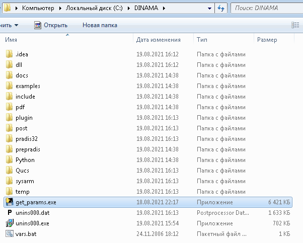
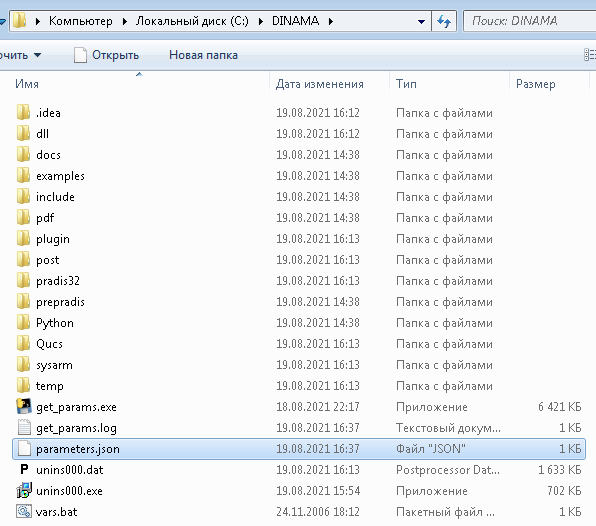
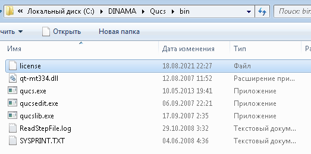
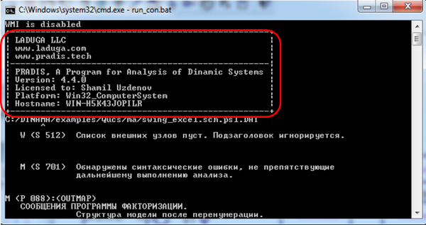
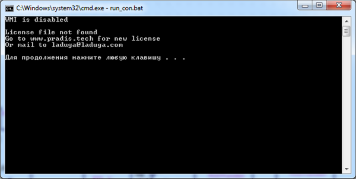
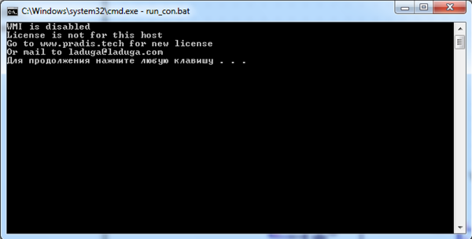

Запрос и установка лицензии
===========================

1. После перезагрузки, в папке DINAMA необходимо запустить файл ``get_params``.

2. Сгенерированный файл ``parameters.json`` необходимо передать по электронной почте
в техподдержку PRADIS или личному менеджеру, предоставившему дистрибутив PRADIS.
Контактные данные по вопросам предоставления лицензионного ключа: Авдеев Евгений Владимирович, aev@laduga.com

3. Полученный Файл ``license`` необходимо поместить в папку ``C:\DINAMA\Qucs\bin``

4. При корректной работе лицензии, во время выполнения расчета в консоли отображается таблица о статусе лицензии

Проверка лицензионного ключа
----------------------------

* Для проверки лицензионного ключа откройте файл модели majatnik2.sch, расположенного в папке
с примерами: ``[Диск установки]\DINAMA\examples\Qucs\majatnik2\``
* В открывшемся окне препроцессора PRADIS запустите расчет, нажав кнопку F2
* При успешном добавлении лицензионного ключа в окне решателя в самом начале журнала появится
таблица с информацией о действующей лицензии

Возможные ошибки:
-----------------

``License file not found`` - файл с лицензией отсутствует или добавлен в некорректную папку.

``License not for this host`` - файл лицензии некорректен, обратитесь в техподдержку PRADIS.

