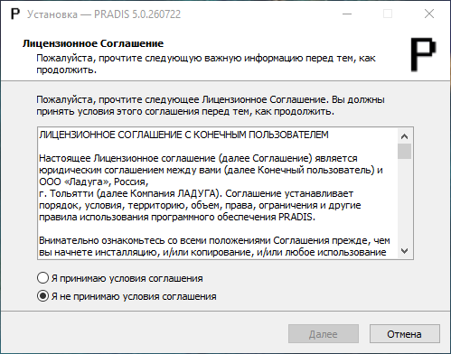
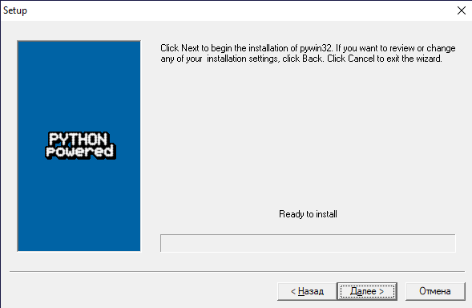

Установка PRADIS для Windows
============================

Порядок действий по установке и получению файла лицензии:

#. Получение дистрибутива PRADIS
#. Установка PRADIS
    * Запуск установщика PRADIS
    * Принятие условий Лицензионного Соглашения
    * Выбор места установки PRADIS
    * Сохранение (при необходимости) системного каталога от предыдущих версий
    * Ввод дополнительных параметров установки
#. Установка дополнительных модулей
#. Генерация файла с конфигурацией компьютера Пользователя
#. Передача файла конфигурации и получение файла лицензии

Получение дистрибутива PRADIS
-----------------------------

По предоставленной ссылке скачайте установочный дистрибутив необходимой версии PRADIS

Установка PRADIS
----------------

* Запустите файл установки PRADISSetup.ru.X.X.XXXXXX.exe.
* Выберите пункт «Я принимаю условия соглашения» и нажмите Далее.

* Выберите диск на который будет установлен PRADIS
(приложение обязательно должно быть установлено в корень диска) и нажмите Далее

* Выберите пункт (при необходимости) «Сохранять системный каталог» от предыдущих версий PRADIS и нажмите Далее

* Укажите параметры инсталляции для различных пользователей
* Выберите (при необходимости) пункт об удалении системного каталога при деинсталляции
* Нажмите Далее

* Проверьте параметры инсталляции и нажмите Установить

Установка модулей: Python 2.7.18
--------------------------------

* Укажите параметры инсталляции для различных пользователей и нажмите Next
* Укажите директорию установки и нажмите Next
* Выберите параметр «Will be installed on local hard drive» в пункте «Add python.exe to Path» и нажмите Next 
* Нажмите Finish

Установка модулей: pywin
------------------------

* Нажмите Далее
* Проверьте директорию размещения Python2.7 и нажмите Далее
* Нажмите Далее
* Нажмите Готово

.. figure:: ./media/pradis_installation_9.png
   :alt: pradis_installation_9.png

Установка модулей: scipy
------------------------

* Нажмите Далее
* Проверьте директорию размещения Python2.7 и нажмите Далее
* Нажмите Далее
* Нажмите Close

.. figure:: ./media/pradis_installation_13.png
   :alt: pradis_installation_13.png

.. figure:: ./media/pradis_installation_15.png
   :alt: pradis_installation_15.png

Установка модулей: matplotlib
-----------------------------

* Нажмите Далее
* Проверьте директорию размещения Python2.7 и нажмите Далее
* Нажмите Далее
* Нажмите Готово

.. figure:: ./media/pradis_installation_17.png
   :alt: pradis_installation_17.png

Завершение установки
--------------------

* Для завершения установки нажмите Завершить

