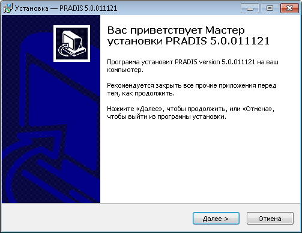
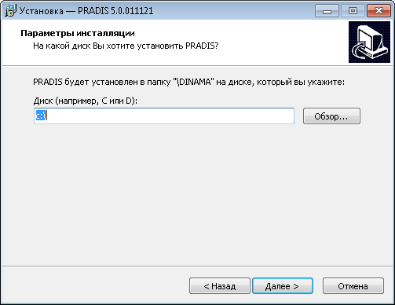
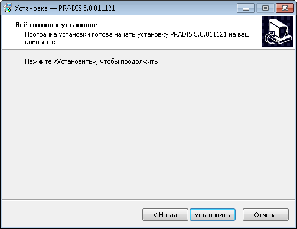
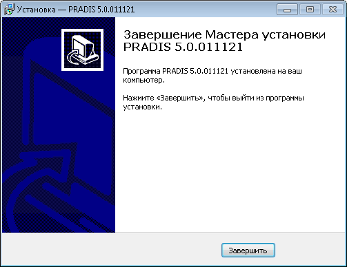

===========================
Установка обновления PRADIS
===========================

1. Запустите файл установки обновления PRADISUpdate.X.X.XXXXXX.exe.
2. В приветственном окне нажмите «Далее».

3. Выберите диск, на котором находится папка DINAMA в которой установлен PRADIS.

4. Нажмите «Далее».
5. Нажмите «Установить».

6. Для завершения установки нажмите «Завершить».

