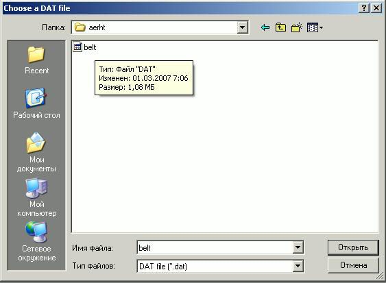

   **PRADIS**

   **Постпроцессор**

   **Программный комплекс для автоматизации моделирования нестационарных
   процессов в механических системах и системах иной физической
   природы**

   **Версия 4.4**

Назначение постпроцессора
=========================

Постпроцессор предназначен для:

-  анимации результатов моделирования в реальном и модельном масштабе
   времени;

-  построения графиков изменения выходных переменных, в том числе
   фазовых;

-  создания таблиц результатов с возможностью их последующего экспорта в
   табличные процессоры и непосредственно в сам постпроцессор.

Запуск постпроцессора
=====================

Запуск постпроцессора осуществляется двойным щелчком мыши по иконке
**post** на рабочем столе или с помощью файла **postprocessor.exe**,
находящегося в папке **DINAMA\\post\\**.

Для чтения результатов моделирования необходимо открыть DAT-файл,
содержащий результаты расчета вашей модели (File – Open).

Если в задании на расчет указано несколько операторов выполнения
задания, то для первого оператора результаты будут храниться в файле
TEST.DAT, для последующих – соответственно TEST1.DAT, TEST2.DAT … Здесь
TEST – имя файла задания.

Для дальнейшей работы с DAT-файлом ниже приведено подробное описание
функций постпроцессора.

Описание функций постпроцессора.
================================

Приведем краткое описание пунктов всех меню.

File
----

**File → Open** 

   .. figure:: media/image1.png
     :alt: image1
   .. figure:: media/image2.png
     :alt: image2

Позволяет выбрать и открыть файл результатов расчета.

**File → New diagram** 
   .. figure:: media/image3.png
     :alt: image3
   .. figure:: media/image4.png
     :alt: image4

Открывает новое окно диаграммы.     

**File → Import diagram**         

   .. figure:: media/image5.png
     :alt: image5

Открывает новое окно диаграмм с графиками, заданными таблично в текстовом файле.       

**File → Save** 

   .. figure:: media/image6.png
     :alt: image6
   .. figure:: media/image7.png
     :alt: image7

Сохраняет табличные данные графиков в файл. 

**File → Save As** 
   .. figure:: media/image8.png
     :alt: image8

Сохраняет табличные данные графиков в файл с указанным именем.     

**File → Exit**   
   .. figure:: media/image9.png
     :alt: image9

Осуществляет выход из постпроцессора.         

Edit
----

**Edit** 
   .. figure:: media/image10.png
     :alt: image10
   .. figure:: media/image11.png
     :alt: image11

Это меню содержит три стандартные команды: *Cut*, *Copy* и *Paste*.
Используются они при работе с табличными данными графиков. 
акже для этих команд есть кнопки на панели инструментов. 

View
----

**View** 
   .. figure:: media/image12.png
     :alt: image12
   .. figure:: media/image13.png
     :alt: image13    

Это меню, пункты которого (за исключением последнего) становятся
доступными при выделении какого-либо объекта в окне просмотра. 
У этого меню есть своя панель инструментов, слева в окне просмотра:   

Animation
---------

Это меню предназначено для управления анимацией в окне просмотра. У него
есть своя панель инструментов, в нижней части окна просмотра.

   .. figure:: ./media/image15.png

**Animation → Start**

   .. figure:: media/image116.png
     :alt: image116

  .. figure:: media/image177.png
     :alt: image177

Устанавливает просмотр на начальный момент времени.    

**Animation → Back Step** 
   .. figure:: media/image19.png
     :alt: image19
   .. figure:: media/image18.png
     :alt: image18

Делает один шаг назад по времени на величину указанную в поле *Time Step* на панели инструментов:      
   .. figure:: media/image20.png
     :alt: image20

**Animation → Back**   
   .. figure:: media/image22.png
     :alt: image22    
   .. figure:: media/image21.png
     :alt: image21 

Запускает анимацию назад по времени.                     

**Animation → Run**
   .. figure:: media/image24.png
     :alt: image24 
   .. figure:: media/image23.png
     :alt: image23

Запускает анимацию.         

**Animation → Forward step**       
   .. figure:: media/image26.png
     :alt: image26   
   .. figure:: media/image25.png
     :alt: image25

Запускает анимацию. Делает один шаг вперёд по времени на величину 
указанную в поле *Time Step* на панели инструментов: 
   .. figure:: media/image20.png
     :alt: image20

**Animation → End**
   .. figure:: media/image28.png
     :alt: image28
   .. figure:: media/image27.png
     :alt: image27

Устанавливает просмотр на конечный момент времени.   

**Animation → Stop**
   .. figure:: media/image30.png
     :alt: image30
   .. figure:: media/image29.png
     :alt: image29

Останавливает анимацию и возвращает в начальный момент времени.          

**Animation → Pause**
   .. figure:: media/image32.png
     :alt: image32
   .. figure:: media/image31.png
     :alt: image31

Останавливает анимацию.     

**Animation → Refresh** 
   .. figure:: media/image34.png
     :alt: image34
   .. figure:: media/image33.png
     :alt: image33

То же самое, что и *Stop*. Если расчёт ещё не окончен, загружает новые данные.             

Так же, на панели инструментов присутствует ещё 3 неописанных объекта.   
   .. figure:: media/image35.png
     :alt: image35               

Когда включено, анимация производится по реальному времени. Когда отключено, 
то по шагам расчёта. То есть при включенном, аниматор пропускает какие
то шаги, или наоборот растягивает, чтобы синхронизировать реальное и расчётное время.
А при выключенном, просто показывает все расчётные шаги подряд.              
   .. figure:: media/image36.png
     :alt: image36                    

Бегунок можно перемещать на любой нужный момент времени. Картинка анимации меняется 
соответственно положению бегунка. Так же можно задать момент времени точно с клавиатуры.
   .. figure:: media/image37.png
     :alt: image37

Этот бегунок регулирует скорость анимации.        

Diagrams
--------

Это меню предназначено для работы с диаграммами. У него есть своя панель
управления в верхней части окна диаграммы.

   .. figure:: media/image38.png
     :alt: image38

**Diagrams → Text table**

   .. figure:: media/image400.png
     :alt: image400
     
  .. figure:: media/image39.png
     :alt: image39

Открывает окно с табличными данными графиков изображённых в окне диаграммы. 

   .. figure:: media/image41.png
     :alt: image41

**Diagrams → Curve selection** 
   .. figure:: media/image43.png
     :alt: image43
   .. figure:: media/image42.png
     :alt: image42

Вызывает диалоговое окно.   

   .. figure:: media/image44.png
     :alt: image44

В нём можно выбирать, какие графики показывать (*Y Group*) и какую
переменную откладывать по оси Х (*X Group*). Таким образом, существует
возможность просматривать фазовые графики.

Кнопка *Select All* выбирает все пункты в группе *Y Group*

Кнопка *Reset All* убирает галочки во всех пунктах группы *Y Group*.

**Diagrams → Refresh**
   .. figure:: media/image46.png
     :alt: image46
   .. figure:: media/image45.png
     :alt: image45

Обновляет графики на диаграмме. То есть перерисовывает их с учётом 
последних данных, если расчёт ещё не был окончен. Так же этой командой можно 
пользоваться, если по каким-либо причинам изображение на диаграмме стало некорректным.  

**Diagrams → Screen short**
   .. figure:: media/image48.png
     :alt: image48
   .. figure:: media/image47.png
     :alt: image47

Сохраняет картинку графиков в файл.              

**Diagrams → Back Color**
   .. figure:: media/image50.png
     :alt: image50
   .. figure:: media/image49.png
     :alt: image49
     
Вызывает диалоговое окно для смены цвета фона.   

   .. figure:: media/image551.png
     :alt: image551

Так же на панели инструментов есть ещё один объект AutoScale: 

   .. figure:: media/image52.png
     :alt: image52

Когда AutoScale включено, все кривые рисуются именно в том масштабе, в
каком они существуют в реальности. Когда отключено, то кривые, у которых
не задан минимум и максимум, рисуются по-прежнему, а кривые, у которых
минимум и максимум заданы, рисуются в заданных пределах, но нормируются
от нуля.

Внизу окна диаграммы показывается, какой цвет, какую кривую рисует.

.. figure:: ./media/image53.png

Если графиков больше двух, то этот список можно листать, чтобы увидеть
названия всех нарисованных кривых. Нажав на названия кривой, можно
вызвать её свойства.

.. figure:: ./media/image54.png

Параметры *Min* и *Max* задают минимум и максимум графика по оси *Y*,
если установлена галочка справа от них. То есть позволяют масштабировать
график.

Кнопка *Color* позволяет выбирать цвет, которым рисуется график.

Так же здесь можно менять название, стиль, толщину линии. Если открыто
несколько окон с диаграммами, и в нескольких будет нарисован один
график, то при смене свойств этого графика на одной диаграмме,
автоматически будут меняться его свойства и на других диаграммах. Но
увидеть это можно, только нажав *Refresh* на панели инструментов того
окна, в котором Вы хотите увидеть эти новые свойства кривой.

Settings
--------

.. figure:: ./media/image55.png

Это меню содержит всего один пункт *Options*. Он вызывает диалоговое
окно:

Это предоставляется возможность менять кодировку ПП в поле *Encoding*: Windows или DOS.       

   .. figure:: media/image556.png
     :alt: image556

Поле *Deviation Coefficient* определяет гладкость отрисовки элементов поверхностей второго      
порядка и выше. Например, эллипсов и сфер. Чем меньше коэффициент, тем красивее и более гладко рисуется
объект. Пределы изменения: от 0.0001 до 0.1. Чем хуже качество отрисовки, тем выше производительность.                

   .. figure:: media/image57.png
     :alt: image57

Window
------

.. figure:: ./media/image58.png

Это стандартное меню для управления окнами.

Help
----

.. figure:: ./media/image59.png

Это меню содержит всего один пункт. Он выводит информацию о ПП.

.. figure:: ./media/image60.png

Это все меню, которые есть ПП.

PGO List
--------

Кроме всего перечисленного ПП имеет ещё одну возможность, управление ПГО. В правой части главного 
окна ПП расположено дочернее окно *PGO List*. 

Оно позволяет выбирать какие ПГО отображать в окне просмотра, а какие нет.      

Кнопка *Update View* отображает выбранные ПГО и убирает невыбранные. 

Кнопка *Select All* выбирает все ПГО.                            

Кнопка *Reset All* убирает все ПГО. 

   .. figure:: media/image61.png
     :alt: image61

Создание видеоролика
--------------------

Создание видеороликов возможно с помощью панели инструментов Video
Record Operations. Она располагается в верхней части 3D окна:

.. figure:: ./media/image62.png

Команда *Start Record* позволяет начать запись фрагментов на диск. При
этом пишется все изображение, находящееся в 3D окне: 3D объекты и любые
изображения поверх окна, кроме курсора (например, подсказки).

Во время записи можно интерактивно манипулировать объектами,
поворачивать, зуммировать, выполнять анимацию. Все, что происходит в
окне, будет записано на диск, а в дальнейшем в видеоролик. Таким
образом, можно записать не только анимацию решения, но и выполнить
предварительный облет модели, с указанием наиболее интересных мест.

Для окончания записи требуется нажать на кнопку *Stop Record*.

Конвертация изображений в видеоролик выполняется с помощью команды *Save
Record*. При этом будет создан видеоролик размером 640*480 с частотой 10
кадров в секунду.

Многовариантный анализ
----------------------

С помощью постпроцессора можно просмотреть результаты многовариантного
анализа. А именно, графически отобразить файл истории.

.. figure:: ./media/image63.png

Загрузить файл истории можно с помощью команды History diagram меню
Multi. В дальнейшем с загруженной диаграммой можно производить все те же
действия, что и с обычной диаграммой: выбор графиков для просмотра,
фазовые графики, создание таблицы значений, сохранение в виде картинки и
т.д.

Возможен импорт другого файла истории для сравнения.

