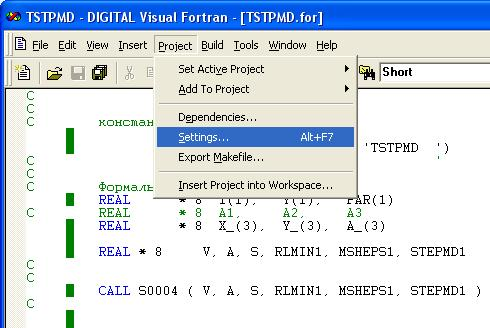
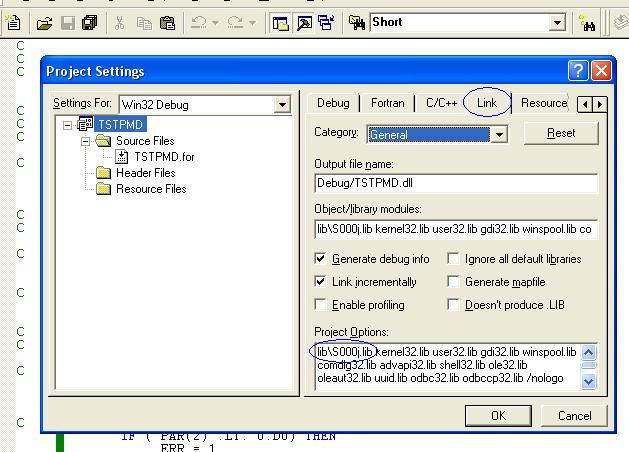

**PRADIS**

**Использование библиотеки S000J в проекте модели**

   **Программный комплекс для автоматизации моделирования нестационарных
   процессов в механических системах и системах иной физической
   природы**

   **Версия 4.3**

Описание
========

1. Создайте папку **lib** внутри папки вашего проекта, как это показано
   на рисунке. В данном примере проект модели называется **TSTPMD**:

..

   .. figure:: ./media/image1.png
      :alt: p0

2. Скопируйте в эту новую папку файл **S000J.lib**

3. Откройте проект своей модели в Visual Studio 6, выберите пункт меню
   **Project -> Settings…** как это показано на рисунке:

4. В появившемся диалоговом окне выберите закладку **Link**, как это
   показано на рисунке. В пункте **Project Options:** добавьте следующую
   строку\ **: lib\S000j.lib**. На рисунке эта дополнительная строка
   выделена синим овалом:

5. После этого можно компилировать проект.
