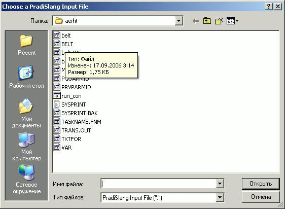
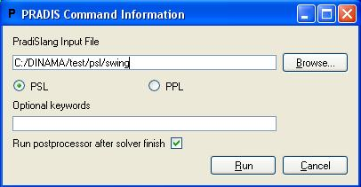
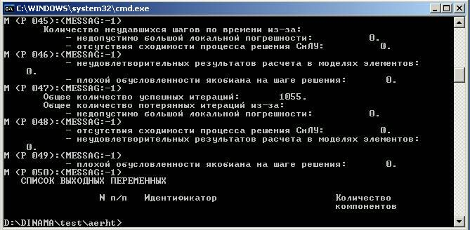

   **PRADIS**

   **Описание утилит**

   **Программный комплекс для автоматизации моделирования нестационарных
   процессов в механических системах и системах иной физической
   природы**

   **Версия 4.3**

 Использование утилиты консольного решателя SLANG.EXE
====================================================

Формат запуска
--------------

Формат запуска консольного решателя slang [options] имя_файла1
[имя_файла2]. Файлы, соответствующие именам имя_файла1 и имя_файла2,
должны указываться или с абсолютными путями, или с путями относительно
текущей директории. Если указаны два имени, все соответствующие файлы
должны располагаться в одной директории.

Имя_файла1 всегда должно присутствовать, это имя текста PRADISlang с
заданием на расчет, и возможно (если оно одно), описанием модели.

Имя_файла2 может отсутствовать. Если присутствует, то оно воспринимается
как имя ранее рассчитывавшегося текста PRADISlang (должны существовать
файлы имя_файла2.VAR, имя_файла2.TRN, имя_файла2.IID, имя_файла2.OID,
имя_файла2.MID).

Список и назначение ключей
--------------------------

Список опций (ключей) запуска, любой из которых может отсутствовать:

-  -pgoN – запись графической 3D информации в файл (ПГО файл), N
   обозначает счётчик выводимых точек (выводить каждую N-ую точку), если
   N не задано, то N=1

-  -s или –e (умолчание). Формат вывода при расчете (см. ниже). –s
   означает короткий формат, -e – расширенный формат. Если ни одна из
   опций не указана, выводится расширенный формат (-e).

-  -r (умолчание), или –m. Опция относится к частоте вывода при расчете.
   Если указано –r, частота вычисляется по реальному времени, если –m по
   времени модели. Вывод осуществляется в момент, когда время, прошедшее
   с момента последнего вывода превышает частоту вывода в секундах.
   Значение частоты вывода берется из параметра программы интегрирования
   PRTTIME в тексте PRADISLANG.

Информационный вывод в ходе расчета
-----------------------------------

Slang может осуществлять вывод или в коротком формате (опция –s,
выводится только время модели), или в расширенном формате (опция –e,
умолчание), выводятся:

-  текущее время модели;

-  реальное прошедшее время расчета;

-  ожидаемое реальное время до завершения расчета;

-  текущий шаг интегрирования по времени;

-  количества успешных и неуспешных итераций по Эйлеру;

-  количества успешных и неуспешных итераций по Ньютону;

-  текущие значения оперативно отображаемых переменных, которые указаны
   в параметрах программы интегрирования (PRADISLANG).

Выходные файлы
--------------

В ходе расчета решатель создает следующие выходные файлы (имена
совпадают с именем исходного файла описания модели):

-  RSL и PNM. Содержат данные выходных двумерных кривых и могут
   просматриваться с помощью постпроцессора.

-  PGO. Содержит 3D сцену, визуализирующую поведение модели во время
   расчета. Могут просматриваться с помощью плеера постпроцессора.

-  TRN, VAR, IID, MID, OID. Промежуточные бинарные файлы решателя.
   Необходимы для последующего расчета уже сформированной модели.

Прерывание расчета
------------------

Во время итераций по времени, возможно корректное завершение расчета с
помощью сочетания клавиш Ctrl+C. Выходные файлы RSL и PGO закрываются и
могут быть открыты для просмотра. После прерывания (как и после обычного
завершения) можно вызывать продолжение расчета (PRADISLlang с заданием с
наличием $RESTORE). Файлы будут дописываться с прерванного места.

Использование утилиты DELCOMMENT.EXE
====================================

С помощью утилиты DelComment можно автоматически удалять комментарии из
файлов задания на языке PradisLang.

Использование:

При запуске утилиты без параметров, на консоль выводится краткая
инструкция по её использованию::

     C:\DINAMA\pradis32>delcomment.exe

     Использование: delcomment <имя1> [<имя2> [имя3 ... [имяN] ] ] ]

Процедура удаления комментариев из файлов заданий.::

     <имя1...N> - имена файлов заданий.

Утилите можно задавать в качестве параметров несколько имён файлов. При
этом для каждого из них делается следующее:

1. Все комментарии в файле задания удаляются.

2. Новое задание записывается в файл del_<имя файла задания>

3. То же самое делается рекурсивно для всех $INCLUDE файлов в задании

4. Название файла в $INCLUDE также переименовывается

Пример:

В папке *DINAMA/TEST/KN3EF* содержится тестовое задание. «00-hello» - сам
файл задания для обсчёта утилитой Slang.exe. В нём вы можете найти
строчку::

     $INCLUDE:sq1.txt

А в файле «sq1.txt» Вы можете в конце увидеть строку::

     $INCLUDE: sq1f.txt

В этой папке задайте в командной строке команду «delcomment 00-hello».

После этого у вас появится 3 новых файла:

    del_00-hello

    del_sq1.txt

    del_sq1f.txt

В файле del_00-hello будет содержаться строка::

    $INCLUDE:del_sq1.txt

В файле del_sq1.txt будет содержаться строка::

    $INCLUDE:del_sq1f.txt

Полученное задание без комментариев del_00-hello можно так же давать на
расчёт утилите slang.exe.

Возможные ошибки:

Утилита Delcomment не обращает внимания на синтаксические ошибки в
задании, она только удаляет комментарии. Поэтому возможна только одна
ошибка – «файла задания с заданным именем не существует». Если Вы
ошибочно напишете в параметрах название файла задания, то delcomment
выдаст эту ошибку. Однако утилита продолжит работу, если был задан не
один файл задания.

Так же могут появиться два информативных сообщения о некорректных
комментариях::

    «В файле <taskname> неокончен комментарий»

    «В файле <taskname> лишняя скобка }»

Однако эти сообщения не прерывают работы delcomment, и файлы с префиксом
"del" всё равно появятся. Но их содержимое может не соответствовать
вашим ожиданиям.

Использование утилиты PRADISW.EXE
=================================

Утилита pradisw предназначена для запуска заданий на расчет в оконном
режиме.

Для запуска приложения необходимо запустить файл pradisw.exe с помощью
соответствующей иконки на рабочем столе. Далее – указать путь к файлу с
описанием задания на языке PSL или PPL и нажать «Открыть»:

В открывшемся окне выбрать язык задания (PSL или PPL). Если не надо
запускать Постпроцессор для результатов рассчета, то убрать галочку из
пункта «Run postprocessor after solver finish». Нажать кнопку «Run», для
запуска задания на расчет:

Выполнение расчета:

Использование утилиты OUTFILE
=============================

Утилита outfile предназначена для вывода в текстовый файл значений
выходных переменных ПРВП из DAT файла.

Первым параметром утилиты является путь к DAT файлу, вторым параметром
является путь к выходному текстовому файлу.

Например, если запустить команду:

outfile.exe C:\dinama\pradis32\swing.dat out.txt

То в результате ее работы в текущем директории будет создан текстовый
файл с именем out.txt, содержащий выходные данные задания SWING в
табличной форме.

Фрагмент файла out.txt::

    Расчет пружинного маятника

    Time (s) Перемещение т.A по оси X

    3.001927 -1.123834

    3.004446 -1.129830

    3.007756 -1.137682

    3.012654 -1.149243

    3.020344 -1.167239

    3.030344 -1.190343

    3.040344 -1.213088

    3.050344 -1.235454

    3.060344 -1.257418

    3.070344 -1.278961

    3.080344 -1.300064

    3.090344 -1.320711

    3.100344 -1.340883

    3.110344 -1.360565

    3.120344 -1.379744

    3.130344 -1.398406

    3.140344 -1.416538

    3.150344 -1.434130

    3.160344 -1.451171

    3.170344 -1.467652

    3.180344 -1.483565

    3.190344 -1.498903

    3.200344 -1.513659

    3.210344 -1.527827

    3.220344 -1.541403

    3.230344 -1.554383

    3.240344 -1.566763

    3.250344 -1.578541

    3.260344 -1.589714

    3.270344 -1.600281

    3.280344 -1.610240

    3.290344 -1.619591

    3.300344 -1.628333

    3.310344 -1.636466

    3.320344 -1.643991

Использование утилиты armdoc
============================

Введение.
---------

Утилита ARMDOC предназначена для ведения содержимого системного каталога
в виде XML структур (структура папок с xml-файлами), а так же
формирования документации в HTML формате по всем объектам системного
каталога. Это позволяет получить удобный доступ к любой информации по
любому объекту.

Далее в документе будет подробнее сказано об XML структуре системного
каталога и форматах xml файлов.

Структура системного каталога.
------------------------------

Вся информация в XML формате о системном каталоге хранится в каталоге
*DINAMA/sysarm/XML*. Там расположен основной файл *sysarm.xml*,
содержащий информацию о существующих модулях. Для каждого из
перечисленных там модулей создан свой каталог, названный именем модуля,
информацию о котором он содержит. Каталог модуля содержит xml файл,
названный именем модуля, описывающий элементы, содержащиеся в модуле, а
так же шесть каталогов: *Model*, *OVP*, *Image*, *Node*, *Parameter*,
*Object*. Эти каталоги соответственно содержат xml файлы с описанием
моделей, првп, пго, узлов, параметров и питон-объектов, имеющихся в
модуле.

Таким образом, мы имеем следующую структуру: системный каталог содержит
модули, модули содержат объекты, которые делятся на шесть типов.

Подробнее о структуре XML файлов будет сказано ниже.

Возможности утилиты
-------------------

При запуске без аргументов выдаётся инструкция по пользованию, кратко
говорящая о возможностях утилиты.::

    C:\DINAMA\pradis32>armdoc

    Использование: armdoc <ключ> <имя>

    <ключ>:

    -a Добавить объект или модуль.

    -r Удалить объект или модуль.

    -g Вывести описание модуля или объекта.

    -d Сгенерировать документацию по объекту или модулю.

    -h Вывести эту справку.

    <имя>: имя xml-файла модуля или объекта с расширением или без.

Из этой справки видно, что, используя утилиту, мы имеем возможность:

1. Добавить новый объект или даже новый модуль в системный XML каталог.

2. Удалить из него имеющийся объект или весь модуль целиком.

3. Получить краткое описание объекта или модуля и списки тех элементов,
   которые он содержит.

4. Сгенерировать HTML документацию по объекту или модулю.

5. И вывести эту справку.

К слову сказать, при указании некорректного ключа, Вы так же получите
эту справку по использованию утилиты.

Кроме ключа в параметрах утилиты есть строковый параметр *<имя>*. Стоит
подробнее остановиться на формате этого параметра.

При его использовании можно выделить три случая:

1. Он вообще не нужен при указании ключа "-h".

2. При указании ключа "-a" он является именем файла с расширением ".xml"
   или без него. Если задать имя файла без расширения, то утилита сама
   его добавит, когда будет искать нужный файл. При этом файл должен
   описывать объект системного каталога в XML формате, но имя файла
   может быть никак не связано с именем самого описываемого объекта.
   Например, модель *mymdl* из модуля *mymodule* может быть описана в
   файле *123.xml*

3. При указании остальных ключей этот параметр должен быть именем
   объекта системного каталога. О том, как выглядит это имя, мы
   расскажем подробно.

Объектом системного каталога может быть либо модуль, либо объект модуля.
Если мы хотим указать модуль, то просто указываем его название. Если же
мы хотим указать на объект какого-то модуля, то указываем имя модуля и
имя нужного нам объекта через точку ("."). В конце этого параметра так
же можно приписать расширение ".xml", утилита корректно это обработает.
Вот некоторые примеры имён объектов системного каталога:

-  *abcd*.\ *xml* - модуль *abcd*

-  *qwe*.\ *rty* - объект *rty* модуля *qwe*

-  *module_12.node_34.XmL* - объект *node_34* модуля *module_12*

Теперь расскажем о каждой из возможностей утилиты чуть подробнее.

Добавление.
===========

Добавлять в системный XML каталог можно объекты различных типов:

-  Модуль

-  Модель

-  ПРВП

-  ПГО

-  Узел

-  Параметр

-  Питон-объект

Для каждого из них определена своя структура xml файла, передаваемого
утилите в качестве второго параметра. При добавлении объектов в
системный XML каталог следует соблюдать одно условие: имена объектов
модуля должны быть **уникальны** среди других объектов **такого же
типа** в **данном модуле**.

Рассмотрим подробнее форматы XML файлов.

Модуль.
~~~~~~~

::

    <module name="ModuleName">
    <description>
        <russian>
            <!-- Описание модуля на русском языке -->
        </russian>
        <english>
            <!-- Описание модуля на английском языке -->
        </english>
    </description>
    </module>

Как видите, файл модуля должен содержать только имя (атрибут *name* тега
*module*) и описание на русском и английском языках в произвольном виде.

Питон-объект.
~~~~~~~~~~~~~

::

    <object name="ObjectName" module="ModuleName">
    <description>
        <russian>
            <!-- Описание питон-объекта на русском языке -->
        </russian>
        <english>
            <!-- Описание питон-объекта на английском языке -->
        </english>
    </description>
    <fieldlist>
        <!-- Перечесление элементов -->
        <field name="FieldName" type="FieldType">
           <description>
             <russian>
                 <!-- Описание элемента на русском языке -->
            </russian>
            <english>
                 <!-- Описание элемента на английском языке -->
            </english>
        </description>
        </field>
        ...
    </fieldlist>
    </object>

Файл питон-объекта должен содержать имя объекта, имя модуля (атрибуты
*name* и *module* тега *object*) и описание на русском и английском
языках. Также он содержит список входящих в питон-объект элементов (тэги
*field*) с именами, типами и описаниями на двух языках.

Параметр.
~~~~~~~~~

::

    <parameter name="ParameterName" module="ModuleName">
    <description>
        <russian>
            <!-- Описание параметра на русском языке -->
        </russian>
        <english>
            <!-- Описание параметра на английском языке -->
        </english>
    </description>
    <fieldlist>
        <!-- Перечесление элементов -->
        <field name="FieldName" type="FieldType">
            <description>
                <russian>
                    <!-- Описание элемента на русском языке -->
                </russian>
                <english>
                    <!-- Описание элемента на английском языке -->
                </english>
            </description>
        </field>
        ...
    </fieldlist>
    </parameter>

Файл параметра почти идентичен файлу питон-объекта за исключением того,
что начинается с тэга *parameter*. Примеры файлов параметра будут
приведены далее в документе.

Узел.
~~~~~

::

    <node name="NodeName" module="ModuleName">
    <description>
        <russian>
            <!-- Описание узла на русском языке -->
        </russian>
        <english>
            <!-- Описание узла на английском языке -->
        </english>
    </description>
    <fieldlist>
        <!-- Перечесление элементов -->
        <field name="FieldName" type="FieldType">
            <description>
                <russian>
                    <!-- Описание элемента на русском языке -->
                </russian>
                <english>
                    <!-- Описание элемента на английском языке -->
                </english>
            </description>
        </field>
        ...
    </fieldlist>
    </node>

Файл узла почти идентичен файлам питон-объекта и параметра за
исключением того, что начинается с тэга *node*. Примеры файлов узла
будут приведены далее в документе.

Модель.
~~~~~~~

::

    <model name="ModelName" module="ModuleName" ext="1" ent="1" par="1"
    vpr="1" str="1" stp="1" wrk="1" wrp="1" ign="1" adr="1">
    <description>
        <russian>
            <!-- Описание модели на русском языке -->
        </russian>
        <english>
            <!-- Описание модели на английском языке -->
        </english>
    </description>
    <nodelist>
        <!-- Перечесление узлов -->
        <node name="NodeName" type="NodeType">
            <description>
                <russian>
                    <!-- описание узла на русском языке -->
                </russian>
                <english>
                    <!-- описание узла на английском языке -->
                </english>
            </description>
        </node>
        ...
    </nodelist>
    <parameterlist>
        <!-- Перечесление параметров -->
        <parameter name="ParameterName" type="ParameterType">
            <description>
                <russian>
                    <!-- описание параметра на русском языке -->
                </russian>
                <english>
                    <!-- описание параметра на английском языке -->
                </english>
            </description>
        </parameter>
        ...
    </parameterlist>
    <worklist>
        <!-- Перечесление элементов рабочего вектора -->
        <parameter name="ParameterName" type="ParameterType">
            <description>
                <russian>
                    <!-- описание параметра на русском языке -->
                </russian>
                <english>
                    <!-- описание параметра на английском языке -->
                </english>
            </description>
        </parameter>
        ...
    </worklist>
    <statelist>
        <!-- Перечесление элементов вектора состояния -->
        <parameter name="ParameterName" type="ParameterType">
            <description>
                <russian>
                    <!-- описание параметра на русском языке -->
                </russian>
                <english>
                    <!-- описание параметра на английском языке -->
                </english>
            </description>
        </parameter>
        ...
    </statelist>
    </model>

Файл модели содержит:

-  Имя объекта - тэг *model*, атрибут *name*

-  Имя модуля - тэг *model*, атрибут *module*

-  Параметры паспорта модели - атрибуты тэга *model*

-  Описание модели - содержимое тэга *description*

-  Список узлов модели (тэг *nodelist*) с именами, типами и описаниями -
   тэги *node* с атрибутами *name* и *type* и вложенными тэгами
   *description*.

-  Список параметров модели (тэг *parameterlist*) с именами, типами и
   описаниями - тэги *parameter* с атрибутами *name* и *type* и
   вложенными тэгами *description*.

-  Список элементов рабочего вектора модели (тег *worklist*) с именами,
   типами и описаниями - тэги *parameter* с атрибутами *name* и *type* и
   вложенными тэгами *description*.

-  Список элементов вектора состояния модели (тэг *statelist*) с
   именами, типами и описаниями - тэги *parameter* с атрибутами *name* и
   *type* и вложенными тэгами *description*.

У параметров и узлов модели есть имена и типы. Следует пояснить их
значение. Имя - это название узла или параметра внутри модели, оно
произвольно и не уникально. Тип - это указатель на то, какой это узел
или параметр, т.е. одно из названий узлов или параметров данного модуля.

Следует особо обратить внимание на то, что при добавлении модели (а
также првп или пго) происходит проверка типов узлов и параметров.
Например, если модуль содержит два параметра с именами *param1* и
*param2*, а Вы пытаетесь добавить модель с типом одного из параметров
*param3*, то появится сообщение об ошибке.

ПРВП.
~~~~~

::

    <ovp name="OVPName" module="ModuleName" out="1" par="1" vps="1"
    vpr="1" wrk="1" wrs="1" wrp="1" sys="1">
        <description>
            <russian>
                <!-- Описание првп на русском языке -->
            </russian>
            <english>
                <!-- Описание првп на английском языке -->
            </english>
        </description>
        <nodelist>
            <!-- Перечесление узлов -->
            <node name="NodeName" type="NodeType">
                <description>
                    <russian>
                        <!-- описание узла на русском языке -->
                    </russian>
                    <english>
                        <!-- описание узла на английском языке -->
                    </english>
                </description>
            </node>
        ...
    </nodelist>
    <parameterlist>
        <!-- Перечесление параметров -->
        <parameter name="ParameterName" type="ParameterType">
            <description>
                <russian>
                    <!-- описание параметра на русском языке -->
                </russian>
                <english>
                    <!-- описание параметра на английском языке -->
                </english>
            </description>
        </parameter>
        ...
    </parameterlist>
    </ovp>

Файл првп почти идентичен файлу модели за исключением того, что
начинается с тэга *ovp* и имеет присущие првп параметры паспорта
(атрибуты тэга *ovp*), а так же не имеет тэгов *worklist* и *statelist*.

ПГО.
~~~~

::

    <image name="ImageName" module="ModuleName" ext="0" par="0" wrk="0">
    <description>
        <russian>
            <!-- Описание пго на русском языке -->
        </russian>
        <english>
            <!-- Описание пго на английском языке -->
        </english>
    </description>
    <nodelist>
        <!-- Перечесление узлов -->
        <node name="NodeName" type="NodeType">
            <description>
                <russian>
                    <!-- описание узла на русском языке -->
                </russian>
                <english>
                    <!-- описание узла на английском языке -->
                </english>
            </description>
        </node>
        ...
    </nodelist>
    <parameterlist>
        <!-- Перечесление параметров -->
        <parameter name="ParameterName" type="ParameterType">
            <description>
                <russian>
                    <!-- описание параметра на русском языке -->
                </russian>
                <english>
                    <!-- описание параметра на английском языке -->
                </english>
            </description>
         </parameter>
        ...
    </parameterlist>
    <worklist>
        <!-- Перечесление элементов рабочего вектора -->
        <parameter name="ParameterName" type="ParameterType">
            <description>
                <russian>
                    <!-- описание параметра на русском языке -->
                 </russian>
                <english>
                    <!-- описание параметра на английском языке -->
                </english>
            </description>
        </parameter>
        ...
    </worklist>
    <statelist>
        <!-- Перечесление элементов вектора состояния -->
        <parameter name="ParameterName" type="ParameterType">
            <description>
                <russian>
                    <!-- описание параметра на русском языке -->
                </russian>
                <english>
                    <!-- описание параметра на английском языке -->
                </english>
            </description>
        </parameter>
        ...
    </statelist>
    </image>

Файл пго почти идентичен файлу модели за исключением того, что
начинается с тэга *image* и имеет присущие пго параметры паспорта
(атрибуты тэга *image*).

Удаление.
---------

Удалять из системного XML каталога можно любой объект, включая целые
модули со всем содержимым. Уже говорилось выше, что после ключа "-r"
необходимо указывать имя в формате объекта системного каталога (формат
описан выше).

Здесь следует отметить только один момент. Нельзя удалить объект модуля,
если на него ссылаются другие объекты этого модуля. Например. Пусть
модуль *module1* содержит узел *node1* и модель *model1*, которая имеет
узел типа *node1*. В этом случае, если Вы дадите команду::

    armdoc -r module1.node1

то получите сообщение об ошибке, т.к. модель *model1* ссылается на этот
узел.

Справка по объекту системного каталога.
---------------------------------------

Здесь лишь стоит упомянуть, что после ключа можно не задавать имя
объекта системного каталога. В этом случае будет выведен список всех
модулей. Если же второй параметр будет задан, то будет выведена краткая
информация по объекту. Для каждого типа объекта своя.

-  Для модуля - его описание и списки моделей, првп, пго, узлов,
   параметров и потон-объектов.

-  Для модели, првп и пго - описание и списки узлов и параметров (имён и
   типов).

-  Для узла, параметра и питон-объекта - описание и список полей (имя,
   тип, описание).

Генерация HTML документации.
----------------------------

Главная страница HTML документации по PRADIS находится в файле:
DINAMA/docs/HTML/index.html. С этой страницы доступна любая
документация, относящаяся к PRADIS. В том числе и информация о системном
каталоге. Перейдя по ссылке "Модули", Вы попадёте в список всех модулей
системного каталога. Далее Вы можете зайти в конкретный модуль, любой
его объект и т.д. Эти HTML страницы отображают содержимое системного XML
каталога в удобном для пользователя виде.

Вы можете добавить в системный каталог новый плагин объект. Утилитой
ARMDOC добавить его описание в системный XML каталог. После этого, чтобы
описание этого объекта появилось в HTML документации, необходимо
сгенерировать её, указав после ключа "-d" имя вашего объекта в формате
объекта системного каталога.

Например. Вы хотите добавить новый модуль *MyModule*. Вы пишете xml файл
*MyModule.xml* (или любое другое имя, но расширение обязательно) для
этого модуля (формат файла описан выше) и даёте команду::

    armdoc -a MyModule

После этого генерируете документацию::

    armdoc -d MyModule

Теперь Вы хотите добавить в свой новый модуль параметр *MyParameter*. Вы
пишете xml файл *NewParameter.xml* (или любое другое имя, но расширение
обязательно) для этого параметра (формат файла описан выше) и даёте
команду::

    armdoc -a NewParameter.xMl

Потом генерируете документацию::

    armdoc -d MyModule.MyParameter

Теперь, зайдя на страницу HTML документации, Вы увидите там всю
информацию о своём новом модуле и новом параметре.

Однако, если Вы не помните названия объектов, которые добавляли, или их
было много, или Вам просто не хочется набирать их имена, Вы можете не
указывать ничего после ключа "-d". Тогда утилита сгенерирует
документацию по всему системному XML каталогу целиком. Но это, конечно,
займёт больше времени.

Примеры.
--------

В этом пункте мы покажем примеры xml файлов, предназначенных для
добавления в системный XML каталог утилитой ARMDOC.

Модуль.
=======

::

    <module name="pneumatics">
    <description>
        <russian>Модуль, содержащий объекты, связанные с пневматикой.
        </russian>
        <english>The module about pneumatics.
        </english>
    </description>
    </module>

Модуль пневматики.

Питон-объект.
~~~~~~~~~~~~~

::

    <object name="something" module="pneumatics">
    <description>
        <russian>Какой-то объект.
        </russian>
        <english>Some object.
        </english>
    </description>
    <fieldlist>
        <field name="Field1" type="main">
            <description>
                <russian>Первое поле.
                </russian>
                <english>First field.
                </english>
            </description>
        </field>
        <field name="Field2" type="main">
            <description>
                <russian>Второе поле.
                </russian>
                <english>Second field.
                </english>
            </description>
        </field>
    </fieldlist>
    </object>

Узел.
~~~~~

::

    <node name="trans_point3d" module="pneumatics">
    <description>
        <russian>Трёхмерная точка поступательного движения.
        </russian>
        <english>3D point of translation.
        </english>
    </description>
    <fieldlist>
        <field name="x" type="translation">
            <description>
                <russian>Степень свободы пост-го движения по оси X.
                </russian>
                <english>Degree of freedom of X translation.
                </english>
            </description>
        </field>
        <field name="y" type="translation">
            <description>
                <russian>Степень свободы пост-го движения по оси Y.
                 </russian>
                <english>Degree of freedom of Y translation.
                </english>
            </description>
        </field>
        <field name="z" type="translation">
            <description>
                <russian>Степень свободы пост-го движения по оси Z.
                </russian>
                <english>Degree of freedom of Z translation.
                </english>
            </description>
        </field>
    </fieldlist>
    </node>

Параметр.
~~~~~~~~~

::

    <parameter name="material" module="pneumatics">
    <description>
        <russian>Свойства материала.
        </russian>
        <english>Material properties.
        </english>
    </description>
    <fieldlist>
        <field name="density" type="real">
            <description>
                <russian>Плотность материала.
                </russian>
                <english>Material density.
                </english>
            </description>
        </field>
        <field name="elasticity" type="real">
            <description>
                <russian>Модуль упругости материала.
                </russian>
                <english>Material elasticity.
                </english>
            </description>
        </field>
        <field name="yung" type="real">
            <description>
                <russian>Модуль Юнга материала.
                </russian>
                <english>Yung module of material.
                </english>
            </description>
        </field>
    </fieldlist>
    </parameter>
   

Модель.
~~~~~~~

::

    <model name="thread" module="pneumatics" ext="1" ent="1" par="1"
    vpr="1" str="1" stp="1" wrk="1" wrp="1" ign="1" adr="1">
    <description>
        <russian>Нить, связывающая две точки.
        </russian>
        <english>Thread connecting two points.
        </english>
    </description>
    <nodelist>
        <node name="end1" type="trans_point3d"></node>
        <node name="end2" type="trans_point3d"></node>
    </nodelist>
    <parameterlist>
        <parameter name="material" type="material"></parameter>
    </parameterlist>
    </model>

Эта модель не претендует на то, чтобы быть реальной, это просто пример
xml файла модели. Перед добавлением её в системный XML каталог Вы должны
добавить узел *trans_point3d* и параметр *material*.

ПРВП.
~~~~~

::

    <ovp name="x" module="pneumatics" out="1" par="1" vps="1" vpr="1"
    wrk="1" wrs="1" wrp="1" sys="1">
    <description>
        <russian>Значение степени свободы.
        </russian>
        <english>The value of degree of freedom.
        </english>
    </description>
    <nodelist>
        <node name="dof" type="dof"></node>
    </nodelist>
    <parameterlist>
        <parameter name="scale" type="real"></parameter>
    </parameterlist>
    </ovp>

Добавление этого ПРВП предполагает, что в системном каталоге модуль
pneumatics уже содержит узел *dof* и параметр *real*.

ПГО.
~~~~

::

    <image name="thread" module="pneumatics" ext="0" par="0" wrk="0">
    <description>
        <russian>Изображение для нити.
        </russian>
        <english>The image of thread.
        </english>
    </description>
    <nodelist>
        <node name="end1" type="trans_point3d"></node>
        <node name="end2" type="trans_point3d"></node>
    </nodelist>
    <parameterlist>
        <parameter name="start1" type="StartCoord3d"></parameter>
        <parameter name="start2" type="StartCoord3d"></parameter>
    </parameterlist>
    </image>

Добавление этой ПГО предполагает, что в системном каталоге модуль
pneumatics уже содержит параметр *StartCoord3d* (начальные координаты
3-х мерной точки). Эта ПГО так же не претендует на то, чтобы быть
реальной.

Использование утилиты parm
==========================

Введение.
---------

Утилита PARM предназначена для включения в систему плагин объектов,
написанных на Питоне. Объектами могут быть модели и првп. Пользователь
имеет возможность писать модели не только на фортране, но и на питоне.
Для добавления в систему объектов, написанных на фортране, используется
утилита ARM, а написанных на питоне - описываемая в данном документе
утилита PARM.

Добавленные в систему питон-плагин объекты пользователь может
использовать так же как любые другие в своих заданиях, написанных на PSL
или PPL. О том, как писать плагин объекты на питоне, говорится в
документе "Написание плагин объектов на языке Python".

Питон-репозиторий.
------------------

Для добавленных с систему питон-плагин объектов ведётся специальный
питон-репозиторий. Он находится в каталоге DINAMA/plugin/python и имеет
следующую структуру.

Каждая из моделей или првп принадлежит к одному из модулей. Поэтому
питон-репозиторий начинается с каталога *pradis*, который содержит
каталоги, названные по именам всех имеющихся в питон-репозитории
модулей. Каждый из них, в свою очередь, содержит 2 каталога: *model* и
*ovp*. При добавлении объекта в питон-репозиторий туда копируются файл с
текстом кода и файл с откомпилированным кодом.

Например если Вы добавляете модель "aaa" в модуль "bbb", в
питон-репозитории появятся 2 файла:

DINAMA/plugin/python/pradis/bbb/model/aaa.py

DINAMA/plugin/python/pradis/bbb/model/aaa.pyc

Также для ведения репозитория используется файл
DINAMA/sysarm/python_plugin.xml, который содержит названия всех
имеющихся в системе питон-плагин объектов.

Возможности утилиты
===================

При запуске без аргументов выдаётся инструкция по пользованию, кратко
говорящая о возможностях утилиты.::

    C:\DINAMA\pradis32>parm
    Использование: parm <ключ> <имя>
    Процедура работы с Питон компонентами PRADIS.
    <ключ>:
    + включает компоненты в каталог и компилирует компоненту
    # только компилирует компоненту
    ! включает компоненты в каталог без компиляции
    - исключает компоненты из каталога
    ? выводит справку по компонентам, содержащимся в бинарном каталоге
    <имя>: имя Питон компоненты

Из этой справки видно, что, используя утилиту, мы имеем возможность:

6.  Добавить новый питон-плагин объект в систему.

7.  Откомпилировать код, написанный для питон-плагин объекта.

8.  Добавить новый питон-плагин объект, не компилируя его.

9.  Удалить из системы имеющийся питон-плагин объект.

10. Получить описание по имеющемуся в системе питон-плагин объекту.

К слову сказать, при указании некорректного ключа, Вы так же получите
эту справку по использованию утилиты.

Кроме ключа в параметрах утилиты есть строковый параметр *<имя>*. Это
название объекта (компоненты). При использовании ключей "+", "#" и "!"
имя может быть дополнено расширением ".py", так как в этих случаях оно
является именем файла с кодом программы, написанной на питоне.

Теперь расскажем о каждой из возможностей утилиты чуть подробнее.

Добавление.
~~~~~~~~~~~

Ключ "+".

При добавлении питон-плагин объектов в систему следует соблюдать
некоторые правила, о которых будет говориться в этом разделе.

Файл с питон-кодом должен состоять из трёх частей.

Первая часть. Это указание кодировки, используемой в файле. Оно должно
идти первой строкой файла. Например::

    # coding=Windows-1251

Обратите внимание, что строке предшествует символ "#", обозначающий
комментарий в языке Python, так как идущее за ним не является питон
командой, а только указывает утилите PARM, какую кодировку использовать
для чтения остального файла.

Вторая часть. Это текст XML файла, описывающего объект, который Вы
добавляете в систему. Как уже говорилось, объектом может быть модель или
првп. Об XML форматах для моделей и првп подробно написано в документе
"Использование утилиты ARMDOC". Здесь мы только отметим, что каждая
строка текста должна следовать за символами "#HELP", которые указывают
на то, что эти строки являются справкой о добавляемом объекте. Например::

    #HELP<model name="ModelName" module="d3" ext="3" par="2" adr="3">
    ...
    #HELP</model>

Этот текст XML файла будет использован для добавления информации в
системный XML каталог, о котором также говорится в вышеупомянутом
документе.

Третья часть. Это непосредственно сам код программы на питоне,
составляющий суть объекта. О том, как писать код на питоне, подробно
написано в документе "Написание плагин объектов на языке Python". Здесь
стоит упомянуть лишь пару моментов.

Имя класса на питоне должно совпадать с учётом регистра с атрибутом
*name* в заглавном тэге XML текста. Заглавным тегом может быть либо
*model*, либо *ovp*. И этот тэг должен совпадать с именем родительского
класса для вашего питон-класса.

Например, если Вы написали заглавный тэг::

    <model name="nAmE" ...>

то объявление класса на питоне должно выглядеть так::

    class nAmE (model):

А если заглавный тэг такой::

    <ovp name="NAme" ...>

то объявление класса::

    class NAme (ovp):

Также при добавлении объектов имя файла, подаваемого утилите в качестве
второго параметра, должно совпадать с именем объекта с учётом регистра.
Т.е. модель *mDl* может быть описана только в файле *mDl.py*.

Компиляция.
~~~~~~~~~~~

Ключ "!".

Компиляция ничего не изменяет в системном каталоге. При её выполнении
она лишь заменяет уже существующие в питон-репозитории файлы на новые,
если они были, или просто копирует их в питон-репозиторий
(предварительно откомпилировав).

Эта опция предназначена для тех случаев, когда пользователь уже имеет
питон-плагин объект, но хочет что-то изменить в его работе. Тогда
пользователю нужно поправить код на языке питон и использовать утилиту
PARM с ключом "!".

Добавление без компиляции.
~~~~~~~~~~~~~~~~~~~~~~~~~~

Ключ "#".

Эта опция совершенно идентична опции добавления, описанной в пункте 2.1,
за исключением того, что код не компилируется, и, соответственно, файл
.pyc не копируется в питон-репозиторий.

Пользователь может пользоваться этой опцией в случае, если ему нужно
добавить объект в системный каталог, но его работа ему не важна, или не
хочет отлаживать код.

Удаление.
~~~~~~~~~

Ключ "-".

Тут почти не о чем говорить. Опция служит для удаления из системного
каталога имеющихся питон-плагин объектов.

Подсказка
~~~~~~~~~

Ключ "?".

Эта опция позволяет вывести описание имеющегося питон-плагин объекта.
Описание берётся из текста xml файла, о котором говорилось в пункте 2.1.

Примеры.
~~~~~~~~

Здесь мы приведём пример текста файла, который можно использовать для
добавления новой питон-плагин модели *NewModel*.::

    # coding=Windows-1251
    #HELP<model name="NewModel" module="d3" ext="3" par="2" adr="3">
    #HELP <description>
    #HELP <russian>Модель NewModel</russian>
    #HELP <english>Description NewModel</english>
    #HELP </description>
    #HELP <nodelist>
    #HELP </nodelist>
    #HELP <parameterlist>
    #HELP </parameterlist>
    #HELP</model>
    from pradis.ppl.model import \*
    class NewModel(model):
    def Execute(COMMON, I, Y, X, V, A, PAR, NEW, OLD, WRK):
    if COMMON.NEWINT == 1:
    ERR = 0
    if PAR[1] < 0.:
    ERR = 1
    if COMMON.SYSPRN < 0.:
    print "Error=",1003
    if PAR[2] < 0.:
    ERR = 1
    if COMMON.SYSPRN < 0.:
    print "Error=",1003
    if ERR == 1:
    if COMMON.CODE < 100:
    COMMON.CODE = 100
    COMMON.NAME = "NewModel"
    res = return_result(COMMON, I, Y, X, V, A, NEW, OLD, WRK)
    return res
    I[1] = A[1] \* PAR[1]
    I[2] = A[2] \* PAR[1]
    I[3] = A[3] \* PAR[2]
    Y[1] = PAR[1]
    Y[2] = 0.
    Y[3] = 0.
    Y[4] = 0.
    Y[5] = PAR[1]
    Y[6] = 0.
    Y[7] = 0.
    Y[8] = 0.
    Y[9] = PAR[2]
    res = return_result(COMMON, I, Y, X, V, A, NEW, OLD, WRK)
    return res
