Лабораторная работа № 1. Пружинный маятник.
-------------------------------------------

Постановка задачи
~~~~~~~~~~~~~~~~~

В качестве примера рассмотрим пружинный маятник, изображенный на рисунке
1.

Исходные данные:

-  Жесткость пружины 100 Н/м

-  Вязкость 0,1 Н*с/м

-  Масса 1 кг

-  Начальное смещение 1 м

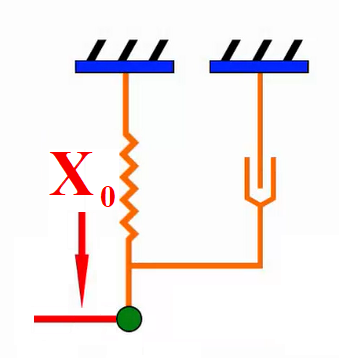

Рисунок 1. Пружинный маятник

1. Создание файла модели
~~~~~~~~~~~~~~~~~~~~~~~~

Запустите в папке PRADIS препроцессор PRADIS Qucs через его ярлык
(рисунок 2).

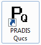

Рисунок 2. Ярлык PRADIS Qucs

В директории C:\\PRADIS создайте папку new_project . Затем откройте этот
проект в выпадающем меню *Проект \\ Открыть проект*.. (рисунок 3).

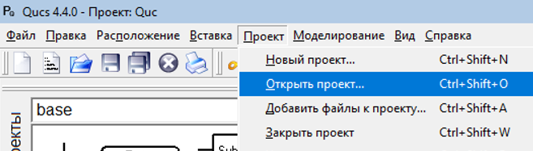

Рисунок 3. Открыть проект

В окне введите путь C:\\PRADIS и выберите папку new_project (рисунок 4).

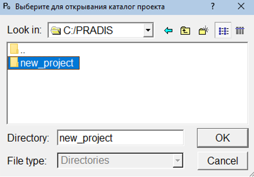

Рисунок 4. Выбор папки new_project

Создайте новый файл модели, выбрав в разделе «Файл» (рисунок 5) команду
«Создать» или нажав Ctrl+N. Далее, для сохранения этого файла, в этом же
разделе выберите команду «Сохранить» или нажав Ctrl+S.

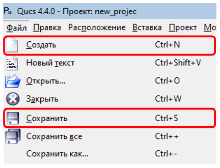

Рисунок 5. Раздел «Файл»

В появившемся окне введите имя файла «pendulum», тип файла «Схема
(*.sch)» (рисунок 6).

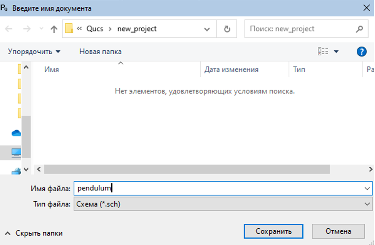

Рисунок 6. Задание имени новому файлу

2. Построение модели
~~~~~~~~~~~~~~~~~~~~
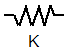

В левой части экрана, нажав на вкладку «Компоненты», активируйте меню
компонентных библиотек. Далее в этом меню из выпадающего списка выберите
библиотеку «base». Выберите компонент упругой связи «K» |tutorial_1D_problem_7| и
поместите его мышью на поле модели (рисунок 7).

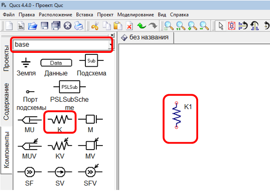

Рисунок 7. Добавление компонента упругой связи

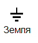
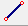
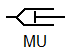

В библиотеке «base» выберете компонент «Земля» |tutorial_1D_problem_9|, поместите его
на рабочем поле модели над компонентом упругой связи, предварительно
повернув необходимым образом с помощью правой кнопки мыши, затем
соедините компоненты, используя проводник |tutorial_1D_problem_10| или нажав Ctrl + E.
Далее выберите компонент вязкости |tutorial_1D_problem_11|, поместите на рабочем поле
параллельно компоненту упругой связи и соедините (рисунок 8).

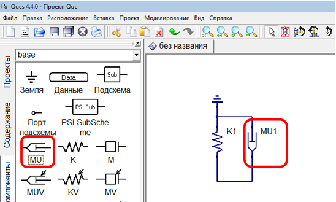

Рисунок 8. Добавление компонентов

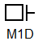

Для того чтобы добавить массу в меню компонентных библиотек из
выпадающего списка выберите библиотеку «Masses» и выберите компонент
одномерного инерционного элемента |tutorial_1D_problem_13| и поместите его на рабочем
поле модели (рисунок 9).

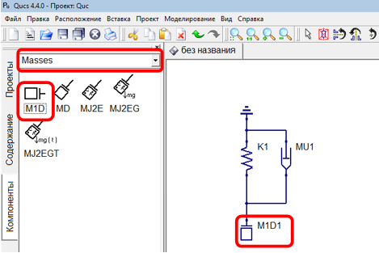

Рисунок 9. Добавление компонента одномерного инерционного элемента

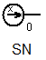

В меню компонентных библиотек из выпадающего списка выберите библиотеку
«Sources». Выберите компонент начального перемещения для одной степени
свободы |tutorial_1D_problem_15| и поместите его на рабочем поле модели (рисунок 10).

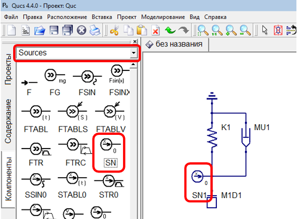

Рисунок 10. Добавление компонента начального смещения

3. Добавление индикаторов
~~~~~~~~~~~~~~~~~~~~~~~~~

Чтобы увидеть скорость, перемещение или силу элементов, необходимо
добавить индикаторы скорости, перемещения.

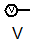
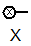

Для этого в меню компонентных библиотек из выпадающего списка выберите
библиотеку «base». Выберите индикаторы скорости (V) |tutorial_1D_problem_17| и
перемещения (X) |tutorial_1D_problem_18|, поместите на рабочем поле модели, соедините
со степенями свободы, скорость и перемещение для которых необходимо
увидеть.

Чтобы определить силу в пружине, добавьте индикатор X, не соединяя ни с
чем. Для удобства назовите его «Сила» (рисунок 11).

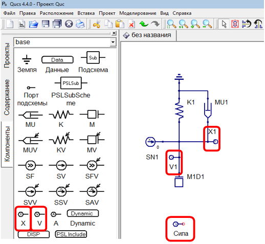

Рисунок 11. Добавление индикаторов

Для того чтобы измерить силу в пружине K1 войдите в свойства компонента
«Сила» двойным нажатием левой кнопки мыши на компонент, либо нажав
правой кнопкой мыши на компонент и в появившемся меню выбрав «Изменить
свойства». Во вкладке ПРВП нужно ввести K1.I(1) (рисунок 12), где K1 –
название компонента, I – функция для измерения потоковой переменной
(например, силы), (1) – номер степени свободы модели, через которую мы
измеряем силу.

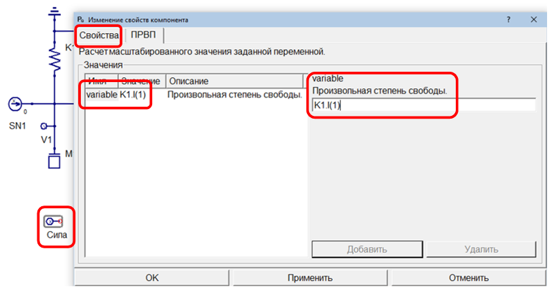

Рисунок 12. Измерение силы в пружине

4. Добавление оператора вывода диаграмм
~~~~~~~~~~~~~~~~~~~~~~~~~~~~~~~~~~~~~~~

В любой расчетной схеме PRADIS необходим оператор DISP, который служит
для создания диаграммы при выводе результатов. В операторе DISP
указываются индикаторы, которые нужно указать на этой диаграмме.
Операторов DISP может быть несколько, но нужен хотя бы один.

В библиотеке «base» выберите блок диаграмм результатов расчета DISP и
поместите его на рабочем поле модели. Откройте диалог свойств и во
вкладке «Вывод» выберите V1 в списке индикаторов. Далее нажмите кнопку
«Добавить» и нажмите кнопку «ОК» (рисунок 13).

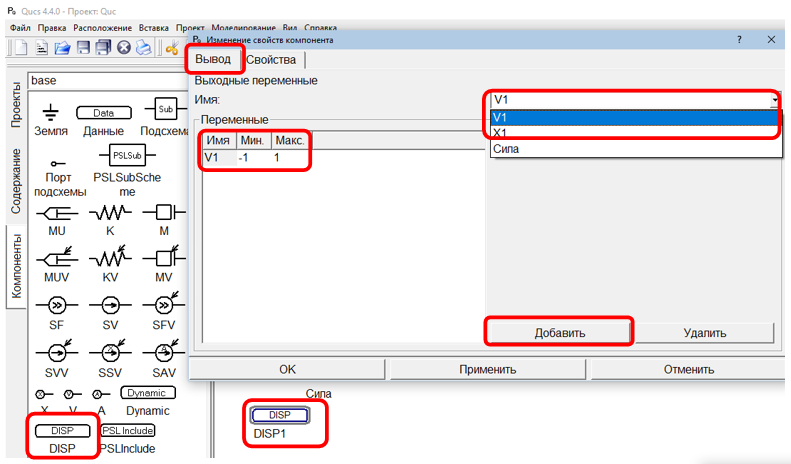

Рисунок 13. Добавление оператора вывода диаграмм

5. Добавление оператора решателя динамики
~~~~~~~~~~~~~~~~~~~~~~~~~~~~~~~~~~~~~~~~~

Для выполнения динамического анализа, необходимо добавить на схему
оператор динамического анализа Dynamic. В этом операторе описаны
параметры динамического решателя.

В библиотеке «base» выберете блок динамического анализа Dynamic и
поместите его на рабочем поле модели. Откройте диалог свойств и во
вкладке «Свойства» в поле «end» (Конечное время интегрирования)
поставьте 10 (10 секунд) и нажмите кнопку «Применить» (рисунок 14).

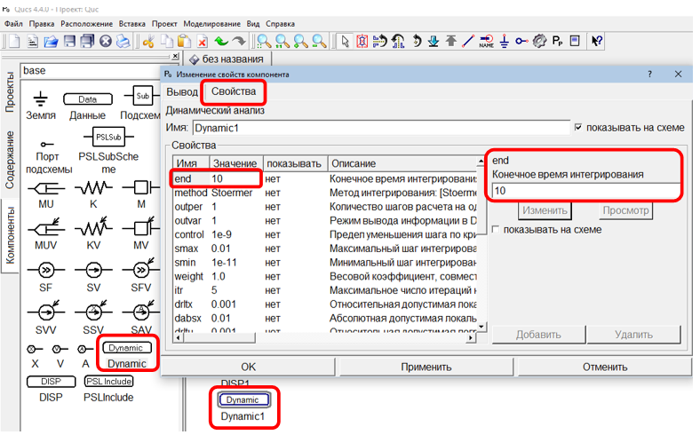

Рисунок 14. Добавление оператора решателя динамики

6. Добавление параметров модели
~~~~~~~~~~~~~~~~~~~~~~~~~~~~~~~

Чтобы поставить коэффициент вязкости, войдите в диалог свойств
компонента MU1. Во вкладке «Свойства» в поле Mu (Коэффициент вязкости)
поставьте значение 0.1 и нажмите кнопку «Применить» (рисунок 15).

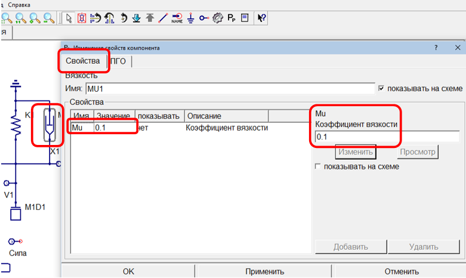

Рисунок 15. Назначение коэффициента вязкости

Чтобы поставить коэффициент жесткости пружины, войдите в диалог свойств
компонента K1. Во вкладке «Свойства» в поле K (Коэффициент) поставьте
значение 100 и нажмите кнопку «Применить» (рисунок 16).

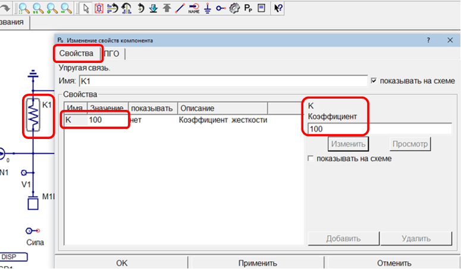

Рисунок 16. Назначение коэффициента жесткости

Чтобы поставить массу, войдите в диалог свойств компонента M1D1. Во
вкладке «Свойства» в поле M (Масса) поставьте значение 1.0 и нажмите
кнопку «Применить» (рисунок 17).

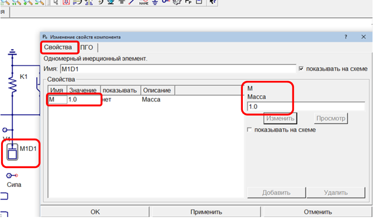

Рисунок 17. Назначение массы

Чтобы поставить начальное смещение, войдите в диалог свойств компонента
SN1. Во вкладке «Свойства» в поле S0 (Начальное смещение) поставьте
значение 1.0 и нажмите кнопку «Применить» (рисунок 18).

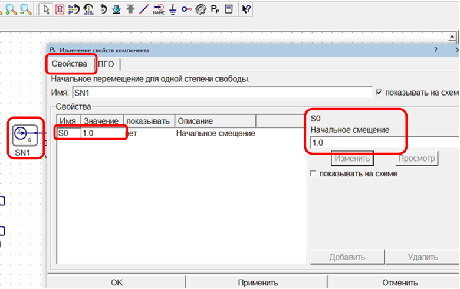

Рисунок 18. Назначение начального смещения

7. Расчет
~~~~~~~~~

Для запуска расчета нажмите на пиктограмму «Моделировать» |tutorial_1D_problem_27| или
клавишу «F2».

После запуска расчета открывается окно решателя (рисунок 19), в котором
отображаются данные о ходе выполнения расчета, а также сведения об
ошибках в случаях их возникновения.

При успешном завершении расчета в окне решателя появляется фраза «Расчет
успешно завершен», после чего автоматически открывается окно
постпроцессора и загружаются данные с результатами.

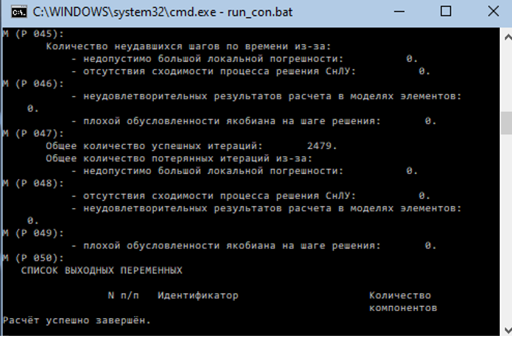

Рисунок 19. Окно решателя

8. Анализ результатов
~~~~~~~~~~~~~~~~~~~~~

Чтобы отобразить график скорости маятника, выберите в постпроцессоре
окно DISP1. Поставьте галочку «Autoscale» (рисунок 20).

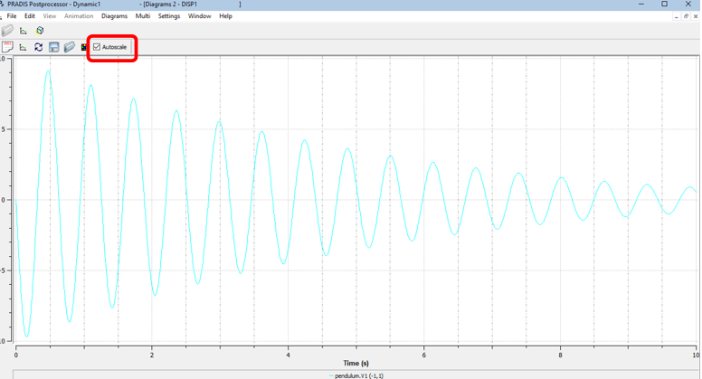

Рисунок 20. График скорости маятника

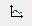

Чтобы отобразить фазовый портрет, нажмите на пиктограмму «Выбор кривой»
|tutorial_1D_problem_30| + на рисунке. В появившемся окне выберете «pendulum.X1» в
панели X-Group (рисунок 21). Результат - зависимость скорости маятника
от его перемещения - показан на рисунке 22.

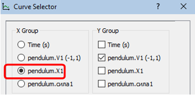

Рисунок 21. Окно выбора осей кривой

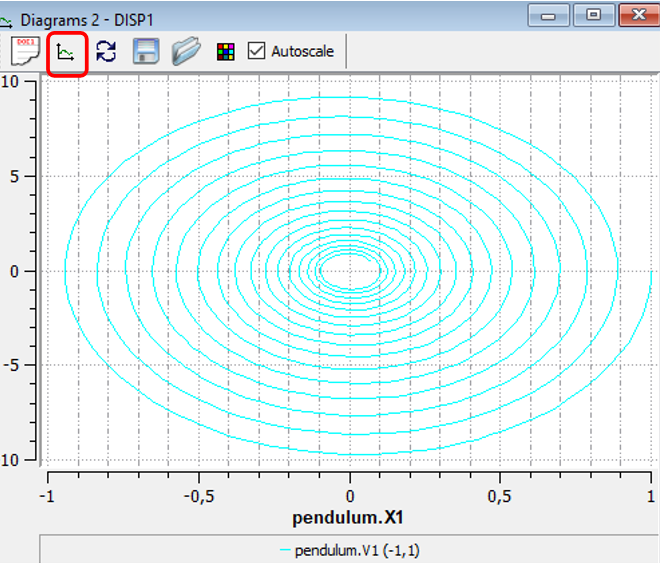

Рисунок 22. Фазовый портрет