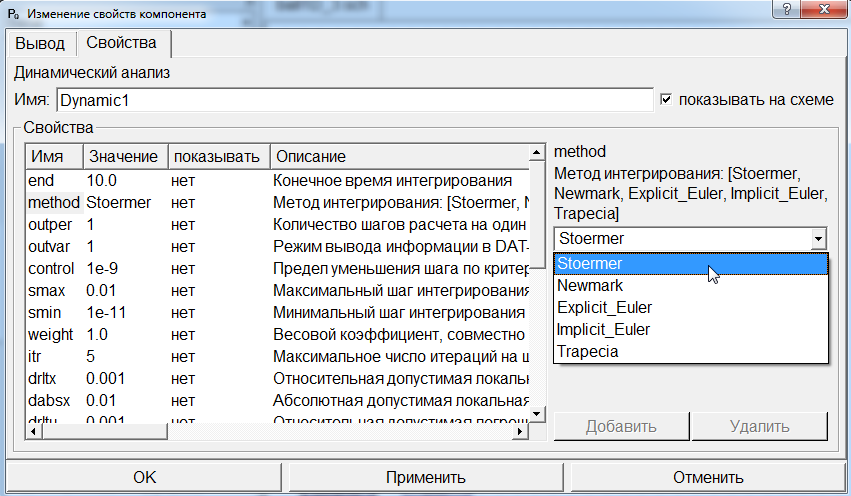

Лабораторная работа № 2. Шар.
-----------------------------

Постановка задачи:

Шар массой 1 килограмм брошен горизонтально с высоты 1 метр с начальной
скоростью 1 м/с (рисунок 23). Определить траекторию движения шара.
Считать удар шара с землей абсолютно упругим.

Исходные данные:

-  Масса шара 1 кг

-  Высота 1 м

-  Начальная скорость 1 м/с

-  Жесткость удара 10000 Н/м

Рисунок 23. Шар

Решение задачи:

Открываем проект lab1 DINAMA\\examples\\labs\\lab1 и загружаем пример
ball1D.sch (рисунок 33).

Примечание: в данном примере изначально не задана сила тяжести.

.. figure:: ./media/tutorial_1D_problem_34.png
   :scale: 60%

Рисунок 24. Схема ball1D.sch

На схеме M1D1 – шар массой 1 кг, VN1 – начальная скорость 1 м/с, SN1 –
начальная высота 1 м, UPRL – одномерное упругое контактное
взаимодействие между двумя телами (между шаром и землей), X1 – индикатор
высоты шара, V1 – индикатор скорости.

Запускаем моделирование (рисунок 25):

Рисунок 25. График скорости шара

На графике видно, что скорость не доходит до единицы, так как
автоматически задана точность интегрирования первого порядка. Для
получения более точных результатов изменим метод интегрирования в
свойствах компонента Dynamic1 (рисунок 26). Поставим вместо Stoermer
метод Newmark (точность интегрирования второго порядка), и сохраним файл
под названием ball1D_1.sch.

Рисунок 26. Изменение метода интегрирования

Запустим моделирование (рисунок 27):

Рисунок 27. График скорости и перемещения шара

На графике видно, что шар ударяется о землю и летит вверх, при этом
скорость в момент удара становится равна единице.

Далее добавим силу тяжести FG1 и уберем начальную скорость VN1 (рисунок
28), сохранив файл под названием ball1D_2.sch:

Рисунок 28. Добавление силы тяжести и деактивация начальной скорости

Запускаем моделирование (рисунок 29):

Рисунок 29. Перемещение шара с новыми параметрами

Так как учтена сила тяжести, но не учитывается потеря энергии при ударе,
видно, что шар поднимается на начальную высоту.

Нужно учесть потери энергии при ударе шара о землю (рисунок 30). Добавим
управляемую вязкость MUV1 таким образом: если центр тяжести шара ниже 0,
то должно быть определенное значение вязкости, если больше 0, то
вязкости не должно быть. Используем индикатор высоты Height.Также
добавим мультиплексор Mux1, для определения высоты: если значение меньше
0, то значение вязкости приравниваем к Const1, если больше 0, то Const2.
Для определения вязкости при высоте 0 добавим на схему сигнал VN2. Также
добавим индикатор вязкости Damper. Сохраним файл под названием
ball1D_3.sch:

Рисунок 30. Учет потери энергии при ударе шара о землю

Параметры компонента DISP2 (рисунок 31):

Рисунок 31. Параметры компонента DISP2

А также поменяем обратно метод интегрирования в свойствах компонента
Dynamic1 (рисунок 32). Поставим Stoermer:

Рисунок 32. Изменение метода интегрирования

Запустим моделирование (рисунок 33):

Рисунок 33. Перемещение шара с новыми параметрами

На графике перемещения видно, что шар после каждого удара о землю
поднимается каждый раз ниже и ниже из-за потери энергии в вязкости.