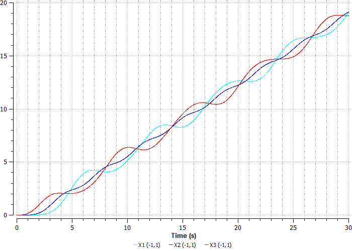

Лабораторная работа № 3. Три шара.
----------------------------------

Постановка задачи:

Три шара массой 1 кг последовательно соединены пружинами с жесткостью 1
Н/м (рисунок 34). К последнему шару приложена сила, изменяющаяся по
трапецеидальному закону. Определить траекторию движения шаров.

Примечание: В данной задаче считать начальную длину пружин равную 0,
т.е. в начальный момент времени все массы находятся в одной точке.

Исходные данные:

-  Масса шаров 1 кг

-  Жесткость пружин 1 Н/м

-  Сила 1 H

Рисунок 34. Три шара, соединенные пружинами

Решение задачи:

Открываем проект lab2 DINAMA\\examples\\labs\\lab2 и загружаем пример
threeBall1D.sch (рисунок 35).

Рисунок 35. Схема threeBall1D.sch

На схеме M1D1, M1D2, M1D3 – шары, массой 1 кг, K1, K2 – жесткости,
соединяющие шары, равные 1 Н/м, FTR1 – переменная сила с амплитудой 1 Н.
начальное положение всех шаров равно 0, т.е все шары находятся в одной
точке, X1, X2, X3 – индикаторы перемещений шаров M1D1, M1D2, M1D3
соответственно.

Запускаем моделирование (рисунок 36):

Рисунок 36. График перемещения шаров

На графике видно, что сила, приложенная к третьему шару, начинает его
перемещать, затем начинает перемещаться второй шар, соединенный пружиной
с третьим, а дальше перемещается первый шар, соединенный со вторым, и
так далее.

Закрепим первый шар с помощью пружины K3 (рисунок 37), сохранив файл под
названием threeBall1D_1.sch:

Рисунок 37. Закрепление первого шара с помощью пружины.

Так же для наглядности в свойствах компонента Dynamic1 изменим параметры
end(Конечное время интегрирования), control() и smax() так, как показано
на рисунке 38:

Рисунок 38. Изменение свойств компонента Dynamic1

Запустим моделирование (рисунок 39):

Рисунок 39. Перемещение шаров с новыми параметрами

Выделим участок от 0 до 50 секунд (рисунок 40), чтобы рассмотреть, как
именно начинают двигаться шары:

Рисунок 40. Перемещение шаров при Time = 50

Очевидно, что шары начали колебаться. Так же, как и до закрепления, под
воздействием силы движение начинает третий шар, а затем тянет остальные
за собой.

На первом графике (рисунок 39) видно, что амплитуда колебания со
временем уменьшается.

Далее уберем силу, действующую на третий шар, и добавим начальное
смещение шаров SN1, SN2 так, чтобы они находились друг от друга на
расстоянии 1 м (рисунок 41). Сохраним файл под названием
threeBall1D_2.sch.

Рисунок 41. Добавление начального смещения первого и второго шара,
деактивация силы, действующей на третий шар

Запустим моделирование (рисунок 42):

Рисунок 42. Перемещение шаров с новыми параметрами

Выделим участок от 0 до 50 секунд, чтобы рассмотреть, как именно
начинают двигаться шары (рисунок 43):

Рисунок 43. Перемещение шаров при Time = 50

На графике видно, что шары начинают колебания с разного начального
положения, каждая пружина «сжимаясь» тянет шары за собой.

На первом графике (рисунок 42) видно, что амплитуда колебания со
временем уменьшается из-за первого порядка метода интегрирования (метод
Штермера).

Далее рассмотрим ситуацию, когда второй шар может двигаться только по
направлению оси X. Для этого добавим в схему храповик HRP1 (рисунок 44).
Сохраним файл под названием threeBall1D_3.sch:

Рисунок 44. Добавление храповика

Запустим моделирование (рисунок 45):

.. figure:: ./media/tutorial_1D_problem_55.png
   :scale: 70%

Рисунок 45. График перемещения шаров с добавлением храповика

Очевидно, что второй шар колебаться не будет. Пружина K1 растянется в
тот момент, когда третий шар будет стремиться к исходному положению.