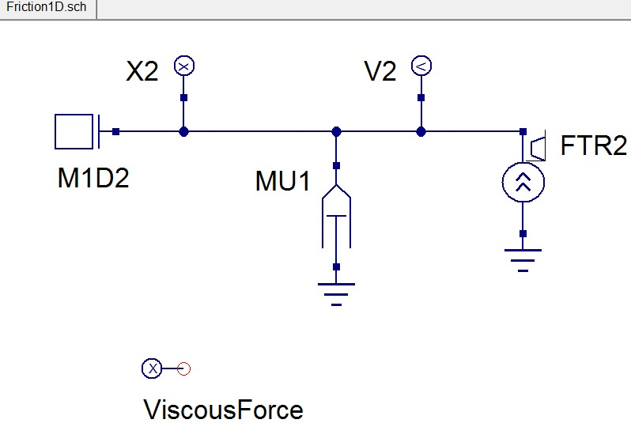
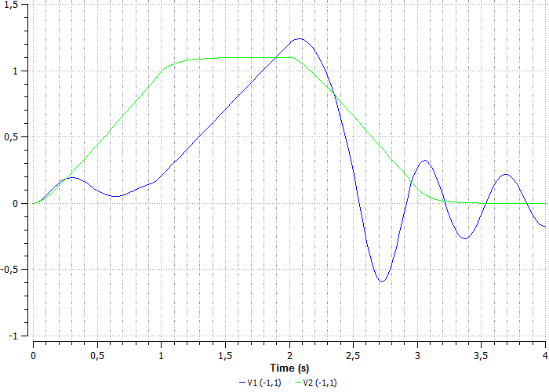

Лабораторная работа № 4. Сухое трение.
--------------------------------------

Сравним сухое (рисунок 46) и вязкое (рисунок 47) трение.

Открываем в проекте lab2 DINAMA\\examples\\labs\\lab2 пример
Friction1D.sch.

Рисунок 46. Схема сухого трения

Рисунок 47. Схема вязкого трения

На схеме масса - M1D1, M1D2, равная 1 кг, KP1 – сухое трение, MU1 -
вязкость, FTR1, FTR2 –сила 11 H, X1, V1 – индикаторы перемещения и
скорости массы M1D1, X2, V2 – индикаторы перемещения и скорости массы
M1D2, Force – индикатор силы, FrictionForce – индикатор силы сухого
трения, ViscousForce – индикатор силы вязкого трения.

Зададим свойства сухого трения KP1(рисунок 48):

Рисунок 48. Свойства сухого трения

Зададим свойства силы FTR1 (рисунок 49):

Рисунок 49. Свойства силы

Параметры индикатора Force (рисунок 50):

Рисунок 50. Параметры индикатора Force

Параметры индикатора FrictionForce (рисунок 51):

Рисунок 51. Параметры индикатора FrictionForce

Параметры индикатора ViscousForce (рисунок 52):

Рисунок 52. Параметры индикатора ViscousForce

Запустим моделирование. Графики результатов представлены на рисунках
53-55:

Рисунок 53. График перемещений

Рисунок 54. График скоростей

Рисунок 55. График сил

На графиках видна разница между сухим и вязким трением. Очевидно, что
под действием вязкой силы тело перемещается, а когда сила перестает
действовать, то тело замедляется (рисунок 53, 54). Под действием силы
сухого трения сначала происходит упругая деформация, затем сила
превышает сухое трение, происходит «вздергивание» тела (рисунок 55).
Затем тело ускоряется и замедляется под действием сухого трения.