Методические указания по решению двумерных задач
================================================

Программный комплекс для автоматизации моделирования нестационарных процессов в механических системах и системах иной физической природы

РЕШЕНИЕ ДВУМЕРНЫХ ЗАДАЧ
=======================

Сплиттеры
---------

Число степеней свободы – это число, определяющее минимальное количество
независимых переменных (обобщенных координат), необходимых для полного
описания состояния системы.

Одномерное тело – точка на плоскости – может перемещаться только
поступательно и имеет только одну степень свободы. На рисунке 1 тонкой
стрелкой показано направление, вдоль которого может перемещаться точка.

| |image1|
| Рисунок 1. Одномерное тело.

Двумерное тело может перемещаться вдоль оси X и вдоль оси Y, а также оно
может вращаться (рисунок 2). Таким образом, двумерное тело имеет три
степени свободы.

| |image2|
| Рисунок 2. Двумерное тело

Трехмерное тело может перемещаться вдоль оси X, вдоль оси Y и вдоль оси
Z, в также вращаться вокруг каждой из осей (рисунок 3). Таким образом,
трехмерное тело имеет 6 степеней свободы.

| |image3|
| Рисунок 3. Трехмерное тело

Достаточно часто при моделировании возникает необходимость приложить,
например, силу в узле вдоль какой-то одной оси, а остальные оставить без
изменений. То есть, нужно описать взаимодействие с одной или несколькими
степенями свободы какого-либо узла. Для таких случаев в ПК PRADIS
существуют сплиттеры.

Сплиттеры – инструмент в ПК PRADIS, позволяющий работать с каждой
степенью свободы узла по отдельности. Находятся в модуле splitters окна
«Компоненты» (рисунок 4).

| |image4|
| Рисунок 4. Модуль splitters

Сплиттер XY2X_Y (рисунок 5) позволяет для узла, двигающегося
поступательно и имеющего 2 степени свободы (по X и по Y) отдельно
поработать со степенью свободы по X и отдельно по Y.

| |image5|\ |image6|
| Рисунок 5. Сплиттер XY2X_Y

Сплиттер Point2d2XY_R (рисунок 6) превращает двумерный узел, имеющий 2
поступательные степени свободы и одну вращательную, в двойной узел XY и
в степень свободы вращения (угол поворота).

| |image7|\ |image8|
| Рисунок 6. Сплиттер Point2d2XY_R

Сплиттер Point2d2DOFs (рисунок 7) разделяет двумерный узел на 3
отдельные степени свободы – поступательные X и Y и вращательную R.

| |image9|\ |image10|
| Рисунок 7. Сплиттер Point2d2DOFs

Сплиттер Point2DOFs (рисунок 8) разделяет трехмерный узел типа Point на
6 отдельных степеней свободы – 3 поступательных (X, Y, Z) и 3
вращательных (Rx, Ry, Rz) (ВАЖНО! Rx, Ry, Rz не соответствуют углам
вокруг осей X, Y, Z. Для работы с 3D углами смотрите раздел «Кратко об
угловых степенях свободы, используемых в пространственных элементах
PRADIS»).

| |image11|\ |image12|
| Рисунок 8. Сплиттер Point2DOFs

Сплиттер Point2XYZs (рисунок 9) разделяет трехмерный узел отдельно на
узел с поступательными степенями свободы и отдельно на узел с
вращательными степенями свободы.

| |image13|\ |image14|
| Рисунок 9. Сплиттер Point2XYZs

Сплиттер XYZ2X_Y_Z (рисунок 10) разделяет трехмерный узел, который может
двигаться только поступательно по трем осям (не умеет вращательных
степеней свободы), на 3 отдельные поступательные степени свободы.

| |image15|\ |image16|
| Рисунок 10. Сплиттер XYZ2X_Y_Z

Лабораторная работа № 1. Качающийся маятник
-------------------------------------------

Рассмотрим применение сплиттеров на примере знакомого нам пружинного
маятника (рисунок 11, 12):

| |image17|
| Рисунок 11. Схема swing.sch

| |image18|
| Рисунок 12. Пружинный маятник

Рассмотрим подробнее по отдельности узлы A, B,C.

Узел A (рисунок 13) представляет собой двумерный узел, который жестко
закреплен в опоре, что означает, что поступательно двигаться он не
может. На схеме это отображает сплиттер Point2d2XY_R, у которого «Земля»
подсоединена к выводу XY.

| |image19|
| Рисунок 13. Узел A

Но вращательная степень свободы у узла А есть, и мы можем определять, на
какие углы поворачивается вся балка, какое ускорение при этом
развивается.

Узел С (рисунок 14) представляет собой двумерный узел, к которому
приложена вертикальная сила (вдоль оси Y). Сплиттер Point2d2DOFs1
разделяет узел, а индикаторы V1, A1 и X1 показывают у степени свободы X
скорость, ускорение и перемещение. У степени свободы Y индикаторы V2, A2
и X2 показывают скорость, ускорение и перемещение. Так же к степени
свободы Y приложена сила F1.

| |image20|
| Рисунок 14. Узел C

Модель BALKA (рисунок 15) является двумерным элементом, а модель стержня
STERG трехмерным элементом. Соединение степени свободы X и степени
свободы Y сплиттеров Point2d2DOFs и XYZ2X_Y_Z показывает, что стержень
движется строго в плоскости XY, а координата Z у него всегда равна нулю,
что показывает степень свободы Z сплиттера XYZ2X_Y_Z.

| |image21|
| Рисунок 15. Модель BALKA

Таким образом, сплиттеры позволяют максимально точно описать все
взаимодействия во всех узлах по всем степеням свободы.

Лабораторная работа № 2. Кривошипно-шатунный механизм
-----------------------------------------------------

Рассмотрим кривошипно-шатунный механизм (рисунок 16).

| |Новый точечный рисунок (4).jpg|
| Рисунок 16. Кривошипно-шатунный механизм

Открываем проект crank DINAMA\\examples\\labs\\crank и загружаем пример
crank_1.sch (рисунок 17).

| |image22|
| Рисунок 17. Схема crank_1.sch

На схеме BALKA1 – кривошип, BALKA 2 – шатун, Point1d1XY_R2 и
Point1d1XY_R3 – сплиттеры, которые соединяют две балки в одной точке
(выполняют роль шарнира), Xb,Yb – координаты шарнира по оси X и по оси Y
соответственно, Point2d2DOFs1 – сплиттер, выполняющий роль ползуна,
закрепляется по оси Y, X_ползун - индикатор перемещения ползуна по оси
Y, V_ползун - индикатор скорости ползуна, VTR01 – источник угловой
скорости кривошипа.

В блоке Data1 заданы координаты точек: A(0;0), B(1;1), C(3;0) (рисунок
18)

| |image23|
| Рисунок 18. Координаты точек в блоке Data1

Запускаем моделирование (рисунок 19):

| |image24|
| Рисунок 19. Результаты расчета

По результатам видно, что механизм работает правильно.

Попробуем изменить координаты ползуна, т.е. задать координаты точки
C(1,5;0) (рисунок 20). Очевидно, что изменится длина шатуна. Сохраним
под названием crank_2.sch.

| |image25|
| Рисунок 20. Изменение координаты точки C

Запускаем расчет (рисунок 21, 22). В процессе расчета видно, что время
растет очень медленно, шаг очень маленький, координаты практически не
изменяются. Принудительно завершим расчет и запустим постпроцессор
|image26|.

| |image27|
| Рисунок 21. График перемещений

| |image28|
| Рисунок 22. График скорости

На графике видно, что возникают колебания. Это происходит потому, что
заданная длина шатуна не позволяет кривошипу сделать оборот, тем самым
кривошип изгибается (деформируется). В точке, когда длина балки шатуна
оказывается предельной для работы механизма, его заклинивает.

Изменив некоторые параметры, можно «заставить» механизм работать. Для
этого настроим параметры решателя на высокие нагрузки, изменив параметры
компонента Dynamic1 (рисунок 23), и уменьшим упругость шатуна в 10 раз,
изменив параметры компонента BALKA2 (рисунок 24). Сохраним под названием
crank_3.sch.

| |image29|
| Рисунок 23. Изменение параметров решателя

| |image30|
| Рисунок 24. Изменение упругости шатуна

Запускаем расчет (рисунок 25, 26)

| |image31|
| Рисунок 25. График перемещений

| |image32|
| Рисунок 26. График скорости

На графике видно, шатун растягивается, и, когда он проходит «мертвую»
точку, начинает двигаться с высокой скоростью.

Следовательно, изменив настройки решателя, даже если изначально
параметры некорректные для данной кинематики, решатель PRADIS будет
выполнять расчет заданного механизма, при этом «ломая» весь механизм,
как и будет в реальности. Если с начальными настройками решателя
программа не рассчитывает модель, то, с высокой вероятностью, такой
механизм не рабочий.

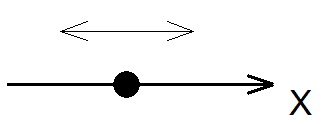

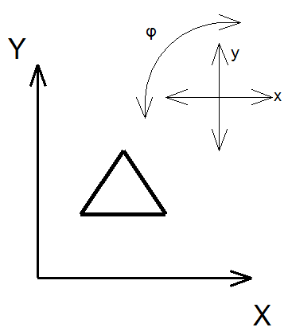
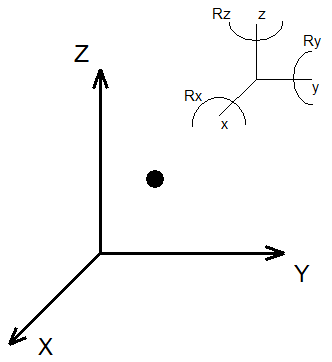
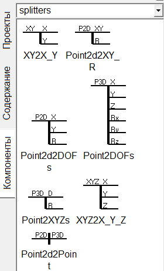
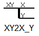
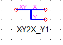
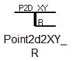
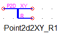
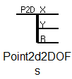
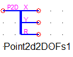
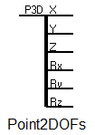
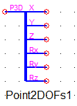
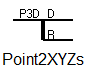
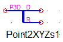
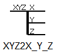
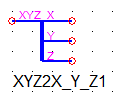
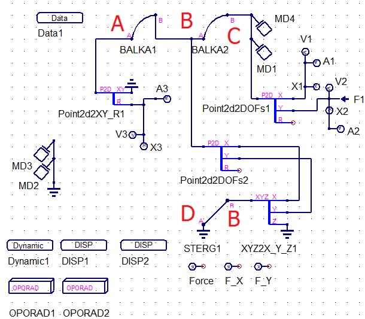
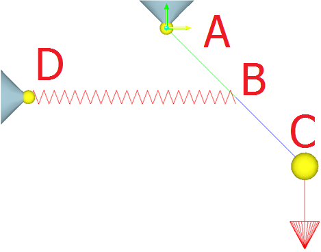
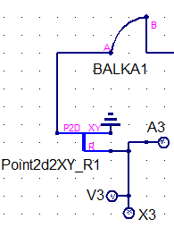
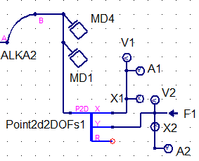
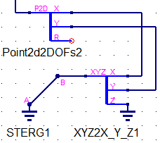
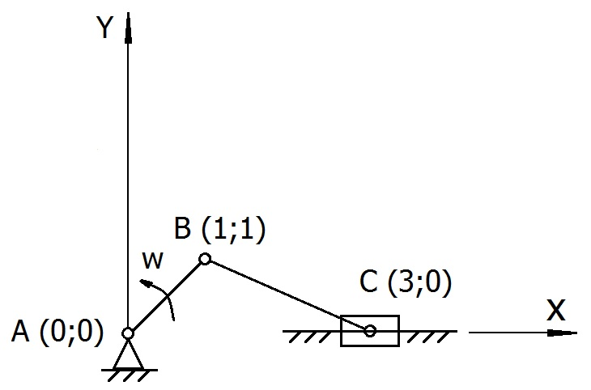
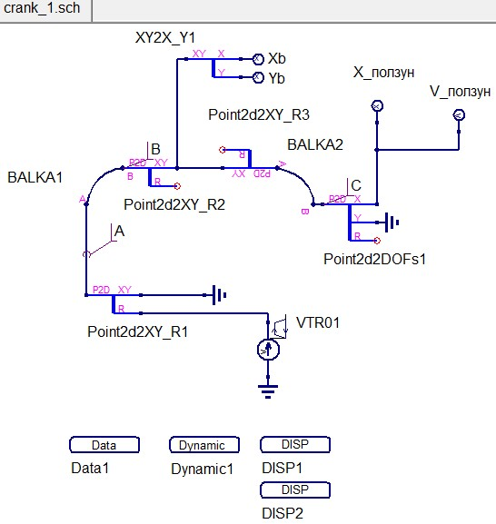
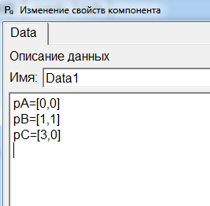
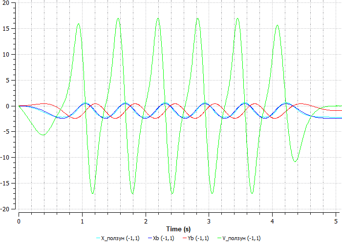
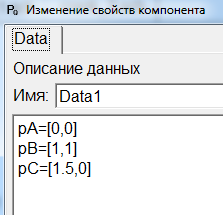

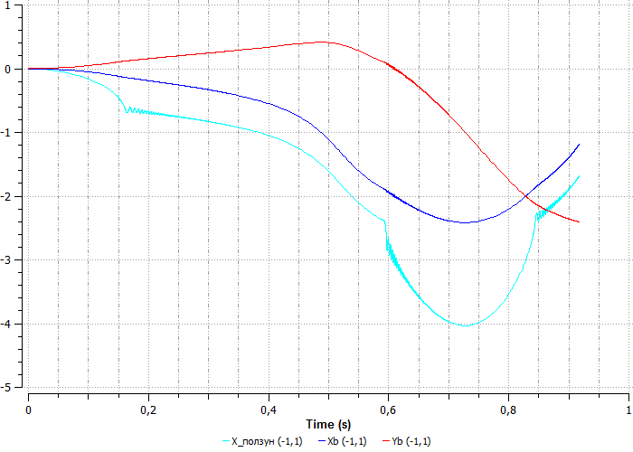
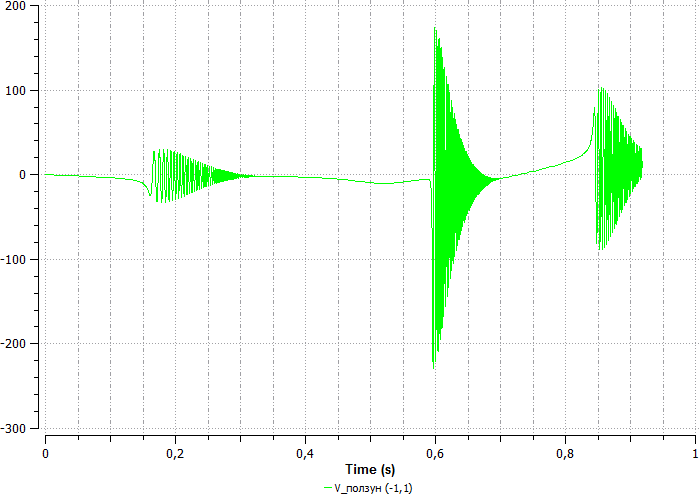
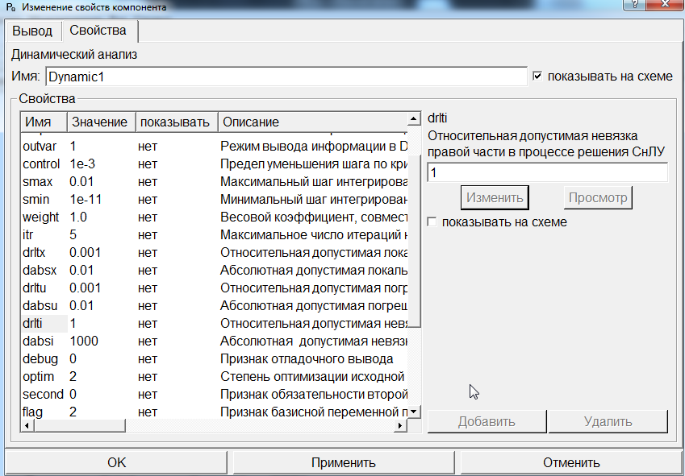
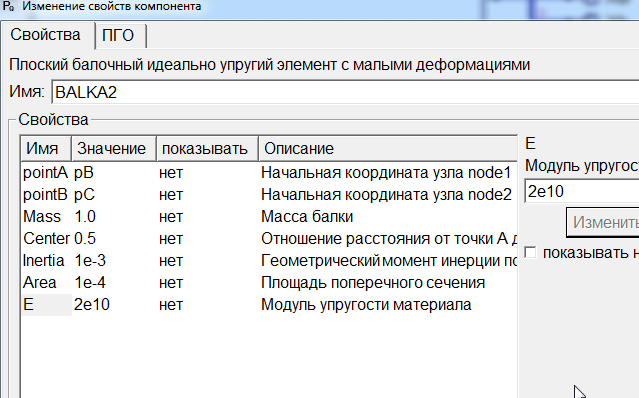
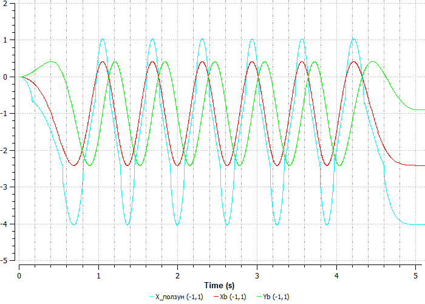
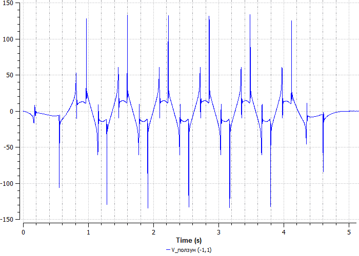
