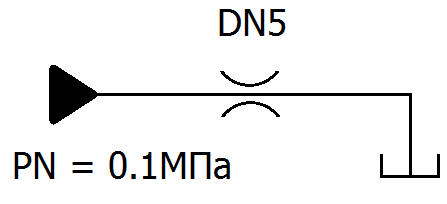
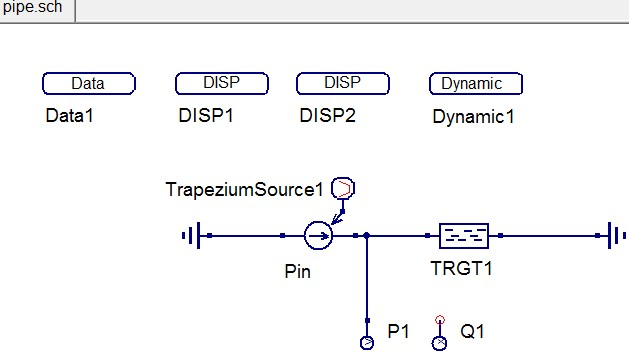
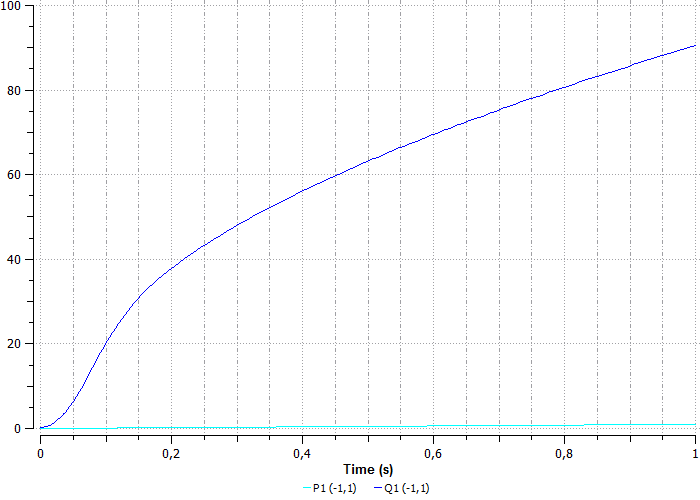

Методические указания по решению двумерных задач
================================================

Программный комплекс для автоматизации моделирования нестационарных процессов в механических системах и системах иной физической природы

ГИДРАВЛИКА
--------------

Параметры рабочей жидкости в блоке Data1 (рисунок 1):

1.  Кинематическая вязкость жидкости при атмосферном давлении и
    температуре 50°С, сСт (NU0>0)

2.  Плотность жидкости при атмосферном давлении и температуре 20°С,
    кг/м\ :sup:`3` (RO0>0)

3.  Модуль упругости жидкости при атмосферном давлении и температуре 20
    °С, МПа

4.  Пьезокоэффициент в экспоненциальной зависимости вязкости от
    давления, 1/МПа

5.  Коэффициент пропорциональности модуля упругости жидкости от давления
    , 1/МПа

6.  Относительное газосодержание жидкости при атмосферном давлении

7.  Показатель политропы процесса

8.  Термокоэффициент в экспоненциальной зависимости вязкости от
    давления, 1/°С

9.  Коэффициент объемного расширения жидкости, 1/°С

10. Температура жидкости, °С

| |image1|
| Рисунок 1. Параметры рабочей жидкости в блоке Data1

Лабораторная работа № 1. Дроссель.
----------------------------------

Рассмотрим некий участок гидролинии, например дроссель (рисунок 2).

| |дроссель.png|
| Рисунок 2. Дроссель

Открываем проект hydraulic DINAMA\\examples\\labs\\hydraulic и загружаем
пример throttle.sch (рисунок 3).

| |image2|
| Рисунок 3. Схема throttle.sch

На схеме Pin – управляемый источник давления, DRG1 – модель дросселя,
TrapeziumSource1 – сигнал трапециевидной формы (задает изменение
давления), P1 – датчик управления, Q1 – датчик расхода.

Параметры модели TrapeziumSource1 (рисунок 4):

| |image3|
| Рисунок 4. Параметры модели сигнала

Параметры модели дросселя DRG1 (рисунок 5):

| |image4|
| Рисунок 5. Параметры модели дросселя

Параметры датчика расхода Q1 (рисунок 6):

| |image5|
| Рисунок 6. Параметры датчика расхода

Запускаем моделирование. Получаем графики давления и расхода для
компонента дросселя DRG1 (рисунок 7).

| |image6|
| Рисунок 7. График давления и расхода

График расхода эквивалентен характеристике дросселя dP/dQ.

Лабораторная работа № 2. Труба.
-------------------------------

Рассмотрим пример, где вместо модели дросселя участок трубы DN10 длиной
1 м (рисунок 8).

| |труба.png|
| Рисунок 8. Гидролиния

В проекте hydraulic загружаем пример pipe.sch (рисунок 9):

| |pipe.jpg|
| Рисунок 9. Схема pipe.sch

На схеме Pin – управляемый источник давления, TRGT1 – модель
гидравлического трубопровода, TrapeziumSource1 – сигнал трапециевидной
формы (задает изменение давления), P1 – датчик управления, Q1 – датчик
расхода.

Параметры трубы TRGT1 (рисунок 10):

| |image7|
| Рисунок 10. Параметры трубы TRGT1

Запускаем расчет (рисунок 11):

| |image8|
| Рисунок 11. График давления и расхода участка трубы

Получаем расходные характеристики данного участка трубы

Лабораторная работа № 3. Демпфер.
---------------------------------

Рассмотрим пример задачи демпфирования гидроподвески.

Открываем проект hydraulic DINAMA\\examples\\labs\\hydraulic и загружаем
пример hydrasuspension.sch (рисунок 12).

| |image9|
| Рисунок 12. Схема hydrasuspension.sch

На схеме CLPDG1 – гидроцилиндр, AGG1 – гидроаккумулятор, DRG1 –
дроссель, SFV1 – управляемый источник силы, TrapeziumSource1 – источник
сигнала трапециевидной формы, X1 – датчик перемещения, который
отслеживает процесс демпфирования гидроподвески.

Параметры гидравлического цилиндра CLPDG1 (рисунок 13):

| |image10|
| Рисунок 13. Параметры гидравлического цилиндра

Параметры сигнала TrapeziumSource1 (рисунок 14):

| |image11|
| Рисунок 14. Параметры сигнала

Параметры дросселя DRG1 (рисунок 15):

| |image12|
| Рисунок 15. Параметры дросселя

Запускаем расчет (рисунок 16).

| |image13|
| Рисунок 16. График перемещения поршня в цилиндре

В начальный момент времени происходит отрицательное перемещение, это
связано с тем, что в начальный момент времени сила равна нулю. Далее
сила возрастает до максимума и гидроцилиндр в виде затухающих колебаний
демпфирует резкое возрастание усилия на поршень.

Лабораторная работа № 4. Предохранительный клапан.
--------------------------------------------------

Рассмотрим пример по моделированию работы предохранительного клапана в
составе гидролинии. Открываем проект hydraulic
DINAMA\\examples\\labs\\hydraulic и загружаем пример hydroline.sch
(рисунок 17).

| |image14|
| Рисунок 17. Схема hydroline.sch

На схеме: SVV1 – управляемый источник давления, SinusSource1 –
синусоидальный сигнал управления, TRGT1 и TRGT2 – участки модели трубы,
KPG1 – предохранительный клапан, земля справа – слив в бак с атмосферным
давлением, Pin – входное давление, P_KPG1 – датчик давления на клапане,
Q_KPG – датчик расхода воды на первом участке трубы, Q_TRGT2 – датчик
расхода воды на втором участке трубы.

Свойства сигнала управления SinusSource1 (рисунок 18). На входе подаются
колебания, которые предохранительный клапан должен будет сглаживать.

| |image15|
| Рисунок 18. Параметры сигнала управления

Параметры трубы TRGT1 (рисунок 19) и TRGT2 (такие же, как и для TRGT1).

| |image16|
| Рисунок 19. Параметры трубы

Параметры предохранительного клапана KPG1 (рисунок 20).

| |image17|
| Рисунок 20. Параметры предохранительного клапана

Параметры датчика Q_KPG (рисунок 21):

| |image18|
| Рисунок 21. Параметры датчика Q_KPG

Параметры датчика Q_TRGT2 (рисунок 22):

| |image19|
| Рисунок 22. Параметры датчика Q_TRGT2

В блоке Dynamic1 задаем время интегрирования 3 секунды (рисунок 23)

| |image20|
| Рисунок 23. Задаем время интегрирования 3 секунды

Запускаем расчет (рисунок 24, 25):

| |image21|
| Рисунок 24. График давления

На графиках видно, что предохранительный клапан отрабатывает на значении
2МПа, он начинает открываться и сбрасывать во время слива избыточный
поток.

| |image22|
| Рисунок 25. График расхода

На графике расходов (рисунок 25) видно, что растет расход на участке
второй трубы, в момент открытия предохранительного клапана расход
остается практически неизменным. Как только клапан закрывается при
снижении давления, расход в трубе начинает снижаться соответственно со
снижением давления на входе всей гидролинии.

.. |image3| image:: media/Hydraulics4.png
   :width: 6.20159in
   :height: 3.78222in

.. |image19| image:: media/Hydraulics22.png
   :width: 6.49722in
   :height: 1.78528in
.. |image20| image:: media/Hydraulics23.png
   :width: 6.49722in
   :height: 2.24646in

