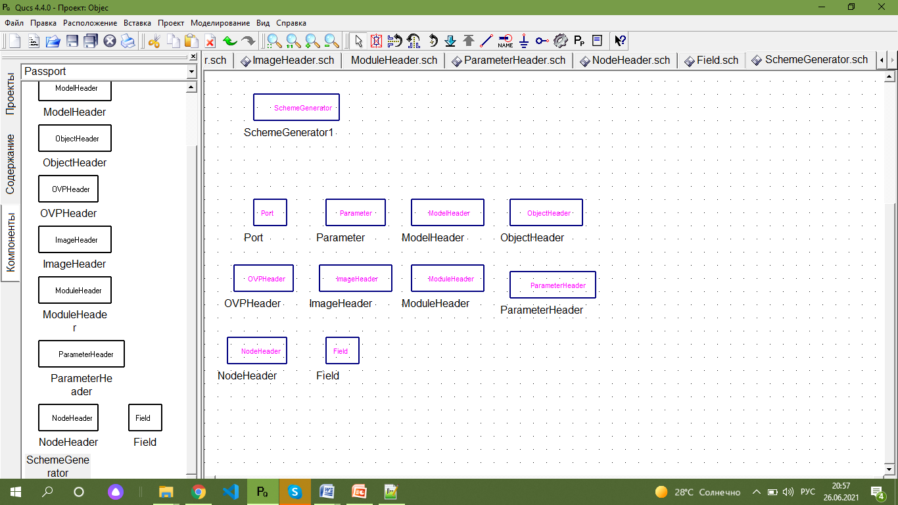
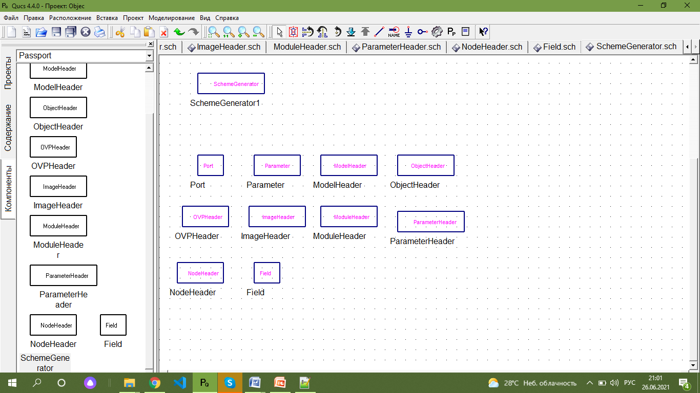

Методические указания по описанию паспортов моделей в ПК PRADIS и методика подготовки документации для применения автоматического генератора sphinx 
===============================================================================

Программный комплекс для автоматизации моделирования нестационарных процессов в механических системах и системах иной физической природы

Описание паспортов моделей ПК PRADIS
--------------------------------------

Для создания паспортов в PRADIS существуют различные объекты. Описания
свойств этих объектов представлены в таблицах 1-11.

   
Рисунок 1. Объект описания Port

Таблица 1 - Свойства объекта описания Port - Описание узла

+----+------------+-----------------+------------------------------------+
| №  |   Имя      | Значение по     | Описание                           |
|    |            | умолчанию       |                                    |
+====+============+=================+====================================+
| 1  | Name       | Node            | Имя узла                           |
+----+------------+-----------------+------------------------------------+
| 2  | English    |                 | Описание на английском             |
+----+------------+-----------------+------------------------------------+
| 3  | L          |                 | Описание на языке 2                |
|    | anguage2   |                 |                                    |
+----+------------+-----------------+------------------------------------+
| 4  | Type       | DOF1            | Тип узла                           |
|    |            |                 | [DOF1,Point,Point2d,XY,XYZ]        |
+----+------------+-----------------+------------------------------------+

Рисунок 2. Объект описания Parameter

Таблица 2 - Свойства объекта описания Parameter - Описание параметра

+----+------------+-----------------+------------------------------------+
|  № | Имя        | Значение по     | Описание                           |
|    |            | умолчанию       |                                    |
+====+============+=================+====================================+
| 1  | Name       |                 | Имя параметра                      |
+----+------------+-----------------+------------------------------------+
| 2  | English    |                 | Описание на английском             |
+----+------------+-----------------+------------------------------------+
| 3  | L          |                 | Описание на языке 2                |
|    | anguage2   |                 |                                    |
+----+------------+-----------------+------------------------------------+
| 4  | Type       | base.real       | Тип параметра                      |
+----+------------+-----------------+------------------------------------+
| 5  | Default    |                 | Значение по умолчанию              |
+----+------------+-----------------+------------------------------------+

Рисунок 3. Объект описания ModelHeader

Таблица 3 - Свойства объекта описания ModelHeader - Описание заголовка
модели

+----+------------+-----------------+------------------------------------+
|  № | Имя        | Значение по     | Описание                           |
|    |            | умолчанию       |                                    |
+====+============+=================+====================================+
| 1  | Name       |                 | Имя модели                         |
+----+------------+-----------------+------------------------------------+
| 2  | Module     |                 | Имя модуля                         |
+----+------------+-----------------+------------------------------------+
| 3  | Alias      |                 | Псевдоним модели                   |
+----+------------+-----------------+------------------------------------+
| 4  | Image      |                 | Имя ПГО модели                     |
+----+------------+-----------------+------------------------------------+
| 5  | English    |                 | Описание на английском             |
+----+------------+-----------------+------------------------------------+
| 6  | Language2  |                 | Описание на языке 2                |
+----+------------+-----------------+------------------------------------+
| 7  | Priority   | 5               | Приоритет                          |
|    |            |                 | [1,2,3,4,5,6,7,8,9,10,11,12]       |
+----+------------+-----------------+------------------------------------+
| 8  | EXT        | 1               | Число внешних степеней свободы     |
+----+------------+-----------------+------------------------------------+
| 9  | ENT        | 1               | Число внутренних степеней свободы  |
+----+------------+-----------------+------------------------------------+
| 1  | PAR        | 0               | Число параметров простого типа     |
| 0  |            |                 |                                    |
+----+------------+-----------------+------------------------------------+
| 1  | VPR        | None            | Признак переменного числа          |
| 1  |            |                 | параметров [None, Variable, Even,  |
|    |            |                 | Odd]                               |
+----+------------+-----------------+------------------------------------+
| 1  | ADR        | Displacement    | Ключ, относительно чего записан    |
| 2  |            |                 | якобиан [Displacement, Velocity,   |
|    |            |                 | Acceleration]                      |
+----+------------+-----------------+------------------------------------+
| 1  | IGN        | 0               | Ключ, какие элементы якобиана      |
| 3  |            |                 | игнорировать [None, Velocity,      |
|    |            |                 | Acceleration,                      |
|    |            |                 | VelocityAcceleration]              |
+----+------------+-----------------+------------------------------------+
| 1  | WRK        | 0               | Число рабочих переменных           |
| 4  |            |                 |                                    |
+----+------------+-----------------+------------------------------------+
| 1  | WRP        | 0               | Сколько рабочих переменных         |
| 5  |            |                 | соответствует каждому параметру    |
+----+------------+-----------------+------------------------------------+
| 1  | STR        | 0               | Число переменных состояния         |
| 6  |            |                 |                                    |
+----+------------+-----------------+------------------------------------+
| 1  | STP        | 0               | Сколько переменных состояния       |
| 7  |            |                 | соответствуют каждому параметру    |
+----+------------+-----------------+------------------------------------+
| 1  | NodeList   |                 | Список узлов                       |
| 8  |            |                 |                                    |
+----+------------+-----------------+------------------------------------+
| 1  | Par        |                 | Список параметров                  |
| 9  | ameterList |                 |                                    |
+----+------------+-----------------+------------------------------------+
| 2  | WorkList   |                 | Список рабочих переменных          |
| 0  |            |                 |                                    |
+----+------------+-----------------+------------------------------------+
| 2  | StateList  |                 | Список переменных состояния        |
| 1  |            |                 |                                    |
+----+------------+-----------------+------------------------------------+

Рисунок 4. Объект описания ObjectHeader

Таблица 4 - Свойства объекта описания ObjectHeader - Описание заголовка
объекта

+----+------------+-----------------+------------------------------------+
|  № | Имя        | Значение по     | Описание                           |
|    |            | умолчанию       |                                    |
+====+============+=================+====================================+
| 1  | Name       |                 | Имя модели                         |
+----+------------+-----------------+------------------------------------+
| 2  | Module     |                 | Имя модуля                         |
+----+------------+-----------------+------------------------------------+
| 3  | Alias      |                 | Псевдоним модели                   |
+----+------------+-----------------+------------------------------------+
| 4  | English    |                 | Описание на английском             |
+----+------------+-----------------+------------------------------------+
| 5  | Language2  |                 | Описание на языке 2                |
+----+------------+-----------------+------------------------------------+
| 6  | Priority   | 5               | Приоритет                          |
|    |            |                 | [1,2,3,4,5,6,7,8,9,10,11,12]       |
+----+------------+-----------------+------------------------------------+
| 7  | NodeList   |                 | Список узлов                       |
+----+------------+-----------------+------------------------------------+
| 8  | Par        |                 | Список параметров                  |
|    | ameterList |                 |                                    |
+----+------------+-----------------+------------------------------------+
| 9  | FieldList  |                 | Список полей                       |
+----+------------+-----------------+------------------------------------+

Рисунок 5. Объект описания OVPHeader

Таблица 5 - Свойства объекта описания OVPHeader - Описание заголовка
ПРВП

+----+------------+-----------------+------------------------------------+
|  № | Имят       | Значение по     | Описание                           |
|    |            | умолчанию       |                                    |
+====+============+=================+====================================+
| 1  | Name       |                 | Имя ПРВП                           |
+----+------------+-----------------+------------------------------------+
| 2  | Module     |                 | Имя модуля                         |
+----+------------+-----------------+------------------------------------+
| 3  | Alias      |                 | Псевдоним ПР  ВП                   |
+----+------------+-----------------+------------------------------------+
| 4  | English    |                 | Описание на английском             |
+----+------------+-----------------+------------------------------------+
| 5  | Language2  |                 | Описание на языке 2                |
+----+------------+-----------------+------------------------------------+
| 6  | Priority   | 5               | Приоритет                          |
|    |            |                 | [1,2,3,4,5,6,7,8,9,10,11,12]       |
+----+------------+-----------------+------------------------------------+
| 7  | OUT        | 1               | Число компонент ПРВП               |
+----+------------+-----------------+------------------------------------+
| 8  | SYS        | 1               | Число передаваемых в ПРВП          |
|    |            |                 | внутренних переменных свободы      |
+----+------------+-----------------+------------------------------------+
| 9  | VPS        | None            | Признак переменного числа          |
|    |            |                 | внутренних переменных [None,       |
|    |            |                 | Variable, Even, Odd]               |
+----+------------+-----------------+------------------------------------+
| 10 | PAR        | 0               | Число параметров простого типа     |
+----+------------+-----------------+------------------------------------+
| 11 | VPR        | None            | Признак переменного числа          |
|    |            |                 | параметров [None, Variable,        |
|    |            |                 | Even, Odd]                         |
+----+------------+-----------------+------------------------------------+
| 12 | WRK        | 0               | Число рабочих переменных           |
+----+------------+-----------------+------------------------------------+
| 13 | WRP        | 0               | Сколько рабочих переменных         |
|    |            |                 | соответствует каждому параметру    |
+----+------------+-----------------+------------------------------------+
| 14 | WRS        | 0               | Сколько рабочих переменных         |
|    |            |                 | соответствует каждой внутренней    |
|    |            |                 | переменной                         |
+----+------------+-----------------+------------------------------------+
| 15 | NodeList   |                 | Список узлов                       |
+----+------------+-----------------+------------------------------------+
| 16 | Par        |                 | Список параметров                  |
|    | ameterList |                 |                                    |
+----+------------+-----------------+------------------------------------+
| 17 | WorkList   |                 | Список рабочих переменных          |
+----+------------+-----------------+------------------------------------+

.. figure:: ./media/Models_Passports_and_Documentation7.png
   :scale: 30%

Рисунок 6. Объект описания ImageHeader

Таблица 6 - Свойства объекта описания ImageHeader - Описание заголовка
ПГО

+----+------------+-----------------+------------------------------------+
| №  | Имя        | Значение по     | Описание                           |
|    |            | умолчанию       |                                    |
+====+============+=================+====================================+
| 1  | Name       |                 | Имя ПГО                            |
+----+------------+-----------------+------------------------------------+
| 2  | Module     |                 | Имя модуля                         |
+----+------------+-----------------+------------------------------------+
| 3  | Alias      |                 | Псевдоним ПГО                      |
+----+------------+-----------------+------------------------------------+
| 4  | English    |                 | Описание на английском             |
+----+------------+-----------------+------------------------------------+
| 5  | Language2  |                 | Описание на языке 2                |
+----+------------+-----------------+------------------------------------+
| 6  | Priority   | 5               | Приоритет                          |
|    |            |                 | [1,2,3,4,5,6,7,8,9,10,11,12]       |
+----+------------+-----------------+------------------------------------+
| 7  | EXT        | 1               | Число степеней свободы             |
+----+------------+-----------------+------------------------------------+
| 8  | PAR        | 0               | Число параметров простого типа     |
+----+------------+-----------------+------------------------------------+
| 9  | VPR        | None            | Признак переменного числа          |
|    |            |                 | параметров [None, Variable, Even,  |
|    |            |                 | Odd]                               |
+----+------------+-----------------+------------------------------------+
| 1  | VPS        | None            | Признак переменного числа          |
| 0  |            |                 | внутренних переменных [None,       |
|    |            |                 | Variable, Even, Odd]               |
+----+------------+-----------------+------------------------------------+
| 1  | WRK        | 0               | Число рабочих переменных           |
| 1  |            |                 |                                    |
+----+------------+-----------------+------------------------------------+
| 1  | WRP        | 0               | Сколько рабочих переменных         |
| 2  |            |                 | соответствует каждому параметру    |
+----+------------+-----------------+------------------------------------+
| 1  | WRS        | 0               | Сколько рабочих переменных         |
| 3  |            |                 | соответствует каждой внутренней    |
|    |            |                 | переменной                         |
+----+------------+-----------------+------------------------------------+
| 1  | UNV        | None            | Признак связи ПГО с переменным     |
| 4  |            |                 | числом внутренних переменных [No,  |
|    |            |                 | Yes]                               |
+----+------------+-----------------+------------------------------------+
| 1  | NodeList   |                 | Список узлов                       |
| 5  |            |                 |                                    |
+----+------------+-----------------+------------------------------------+
| 1  | Par        |                 | Список параметров                  |
| 6  | ameterList |                 |                                    |
+----+------------+-----------------+------------------------------------+

.. figure:: ./media/Models_Passports_and_Documentation8.png
   :scale: 30%

Рисунок 7. Объект описания ModuleHeader

Таблица 7 - Свойства объекта описания ModuleHeader - Описание заголовка
модуля

+----+------------+-----------------+------------------------------------+
| №  | Имя        | Значение по     | Описание                           |
|    |            | умолчанию       |                                    |
+====+============+=================+====================================+
| 1  | Name       |                 | Имя модуля                         |
+----+------------+-----------------+------------------------------------+
| 2  | English    |                 | Описание на английском             |
+----+------------+-----------------+------------------------------------+
| 3  | L          |                 | Описание на языке 2                |
|    | anguage2   |                 |                                    |
+----+------------+-----------------+------------------------------------+

.. figure:: ./media/Models_Passports_and_Documentation9.png
   :scale: 30%

Рисунок 8. Объект описания ParameterHeader

Таблица 8 - Свойства объекта описания ParameterHeader - Описание
заголовка типа параметра

+----+------------+-----------------+------------------------------------+
| №  | Имя        | Значение по     | Описание                           |
|    |            | умолчанию       |                                    |
+====+============+=================+====================================+
| 1  | Name       |                 | Имя типа параметра                 |
+----+------------+-----------------+------------------------------------+
| 2  | Module     |                 | Имя модуля                         |
+----+------------+-----------------+------------------------------------+
| 3  | English    |                 | Описание на английском             |
+----+------------+-----------------+------------------------------------+
| 4  | L          |                 | Описание на языке 2                |
|    | anguage2   |                 |                                    |
+----+------------+-----------------+------------------------------------+
| 5  | F          |                 | Список полей                       |
|    | ieldList   |                 |                                    |
+----+------------+-----------------+------------------------------------+

.. figure:: ./media/Models_Passports_and_Documentation10.png
   :scale: 30%

Рисунок 9. Объект описания NodeHeader

Таблица 9 - Свойства объекта описания NodeHeader - Описание заголовка
типа параметра

+----+------------+-----------------+------------------------------------+
| №  | Имя        | Значение по     | Описание                           |
|    |            | умолчанию       |                                    |
+====+============+=================+====================================+
| 1  | Name       |                 | Имя типа узла                      |
+----+------------+-----------------+------------------------------------+
| 2  | Module     |                 | Имя модуля                         |
+----+------------+-----------------+------------------------------------+
| 3  | English    |                 | Описание на английском             |
+----+------------+-----------------+------------------------------------+
| 4  | L          |                 | Описание на языке 2                |
|    | anguage2   |                 |                                    |
+----+------------+-----------------+------------------------------------+
| 5  | F          |                 | Список полей                       |
|    | ieldList   |                 |                                    |
+----+------------+-----------------+------------------------------------+

.. figure:: ./media/Models_Passports_and_Documentation11.png
   :scale: 30%

Рисунок 10. Объект описания Field

Таблица 10 - Свойства объекта описания Field - Описание поля

+----+------------+-----------------+------------------------------------+
| №  | Имя        | Значение по     | Описание                           |
|    |            | умолчанию       |                                    |
+====+============+=================+====================================+
| 1  | Name       |                 | Имя параметра                      |
+----+------------+-----------------+------------------------------------+
| 2  | English    |                 | Описание на английском             |
+----+------------+-----------------+------------------------------------+
| 3  | L          |                 | Описание на языке 2                |
|    | anguage2   |                 |                                    |
+----+------------+-----------------+------------------------------------+
| 4  | Type       | base.real       | Тип параметра                      |
+----+------------+-----------------+------------------------------------+

.. figure:: ./media/Models_Passports_and_Documentation12.png
   :scale: 30%

Рисунок 11. Объект описания SchemeGenerator

Таблица 11 - Свойства объекта описания SchemeGenerator - Генератор

+----+------------+-----------------+------------------------------------+
| №  | Имя        | Значение по     | Описание                           |
|    |            | умолчанию       |                                    |
+====+============+=================+====================================+
| 1  | Sc         |                 | Схема                              |
|    | heme-File  |                 |                                    |
+----+------------+-----------------+------------------------------------+
| 2  | I          | yes             | Флаг опции генерации               |
|    | sDocument  |                 | документации [yes,no]              |
+----+------------+-----------------+------------------------------------+

Разработка методики подготовки паспортов моделей 
-------------------------------------------------

1. Рассмотрим создание паспорта модели на примере модели «Направляющие
2D, препятствующие вращению вокруг оси движения». Иконка представлена на
Рисунок 12.

.. figure:: ./media/Models_Passports_and_Documentation13.png
   :scale: 30%

Рисунок 12. Иконка рассматриваемого элемента

Информацию о данном элементе берем из файла с расширением XML
DINAMA\\sysarm\\XML\\Links\\Model\\NPLV.xml, содержимое выглядит
следующим образом (Рисунок 13)

.. figure:: ./media/Models_Passports_and_Documentation14.png
   :scale: 30%

Рисунок 13. Файл XML

2. В схему паспорта модели из модуля «Passport» каталога компонентов
добавляем объекты описания: ModelHeader, Port, Parameter. (Рисунок 14.)

.. figure:: ./media/Models_Passports_and_Documentation15.png
   :scale: 30%

Рисунок 14. Добавление элементов описания

3. Заполняем параметры объектов описания: всю необходимую информацию
берем из XML файла. Заполнение параметров для объекта Port с названием
Body1 на Рисунок 15.

.. figure:: ./media/Models_Passports_and_Documentation16.png
   :scale: 30%

Рисунок 15. Заполнение параметров для объекта Port с названием Body1

4. После заполнения всех параметров нужно указать их в ModelHeader.
(Рисунок 16)

.. figure:: ./media/Models_Passports_and_Documentation17.png
   :scale: 30%

Рисунок 16. Указание параметров в ModelHeader

5. Сохраняем схему NPLV.sch в директорию C:\\project\\Links\\Model
(Рисунок 17)

.. figure:: ./media/Models_Passports_and_Documentation18.png
   :scale: 30%

Рисунок 17. Сохранение схемы NPLV.sch

6. Сохраняем схему паспорта модели как xml паспорт путем применения
встроенной в Qucs утилиты «Export as passport» (Рисунок 18.а).
Необходимо создать новый фиктивный (пустой) xml файл в папке проекта.
Название файла, который требуется создать, получается из названия схемы
паспорта путем замены расширения с sch на xml, т.е. NPLV.xml. (Рисунок
18.б)

.. figure:: ./media/Models_Passports_and_Documentation19.png
   :scale: 30%

.. figure:: ./media/Models_Passports_and_Documentation20.png
   :scale: 30%

Рисунок 18. а) утилита «Export as passport», б) файл NPLV.xml

Обновление паспортов моделей на основе исходных текстов математических моделей
------------------------------------------------------------------------------

Представлены исходные тексты для 380 моделей. Из этих текстов выбраны
данные для паспортов моделей.

Подготовлено 380 xml паспортов моделей для всех текущих модулей ПК
PRADIS.

методика подготовки документации для применения автоматического генератора sphinx
------------------------------------------------------------------------------------

Существует множество генераторов документации: Asciidoc, Doxygen, Sphinx. Для
разработки общей документации был выбран Sphinx. Это генератор
документации, который преобразует файлы в формате reStructuredText в
HTML website и другие форматы.

**reStructuredText** (сокращение: **ReST**, расширение файла: **.rst**)
— облегчённый язык разметки, который может быть преобразован в различные
форматы — HTML, ePub, PDF и другие. Документы в формате .rst можно
открывать и редактировать в любом простом текстовом редакторе (например,
в Блокноте). Это позволяет работать над документацией в любых условиях,
на любых платформах, без необходимости использовать специализированное
программное обеспечение.

Самое главное, что ReST позволяет сосредоточиться исключительно на
структуре документа и не отвлекаться на его оформление. ReST аналогичен
языку разметки Markdown, но обладает более расширенным синтаксисом,
особенно вкупе с генератором документации Sphinx.

Отдельно хотелось бы отметить требования к синтаксису reStructuredText.

Основные концепции:

-  Отступы и пробелы имеют значение для команд разметки, но не имеют
   значения внутри текста;

-  В командах (директивах) используется символ обратной кавычки «`».
   Использование обычных одинарных кавычек в командах не приведет к
   желаемым результатам.

1) **Заголовки**

ReStructuredText поддерживает несколько уровней заголовков. Заголовки
первого уровня (главы) подчеркиваются символом равно =. Заголовки
второго уровня (подглавы) подчеркиваются символом короткого тире или
минуса -. Заголовки третьего уровня (подпункта) подчеркиваются символом
тильды ~. Для параграфов допускается использовать подчеркивание
символами двойных кавычек "

2) **Абзацы** в reStructuredText отделяются друг от друга пустой строкой

3) **Начертание**

Чтобы выделить текст жирным начертанием или курсивным используется
обособление звездочками:

\**жирный текст*\*

\*курсив текст\*

Не допускается наличие пробелов между выделяемым словом и звездочкой

4) **Нумерованные списки** создаются с помощью символа решетки с точкой #.

5) **Маркированные списки** создаются с помощью символа звездочки * или дефиса -. Пробелы после маркера обязательны.

6) `Вложенные списки

\* Первый уровень

\* Второй уровень

\* Третий уровень

7) **Верхние и нижние индексы** добавляются с помощью команд  :sub:  и :sup:

-  H\\ :sub:`2`\\ O - H\ :sub:`2`\ O

-  E = mc\\ :sup:`2\` - E = mc\ :sup:`2`

8) Для вставки **цитат** используется отступ, сделанный с помощью клавиши Tab.

9) Можно оставлять **комментарии**, которые отображаются только в
исходном файле ReST. Комментарии создаются с помощью двух точек в начале
предложения .. . Для создания многострочных комментариев необходимо
соблюдать отступ.

10) Для примеров частей **исходного кода (листинги)** используется команда из двух двоеточий :: .

11) `Автозамены (Подстановки)

Язык \|ReST\| — очень гибкий язык разметки (подстановки).

.. \|ReST\| replace:: \*reStructuredText\*

12) **Дата и время**

.. \|date\| date:: %d.%m.%Y

.. \|time\| date:: %H:%M

13) `Вставка текста из других файлов 

.. include:: имя_файла

14) Иногда возникает необходимость визуально отделить абзац, для этого
можно воспользоваться **чертой**, достаточно поставить подряд несколько
дефисов (не меньше 4-х), также можно воспользоваться нижним
подчеркиванием. Символы черты должны быть отбиты пустыми строками до и
после. Черта не должна завершать документ. Черта, расположенная в самом
конце документа может вызывать ошибки при сборке.

15) **Внешние ссылки** создаются так:

1. Внешние ссылки выглядят так: ссылка_.

.. \_ссылка: http://librerussia.blogspot.ru/

2. Если несколько слов, тогда так:

.. \_`ссылка в несколько слов`: http://librerussia.blogspot.ru/

3. Более компактная запись ссылок 

.. \_` http://librerussia.blogspot.ru/

16) Вставка **изображения** между слов \|кубик-рубика\| осуществляться с помощью функции автозамены:

.. \|кубик-рубика\| image:: \_static/favicon.ico

Вставка изображений между абзацами осуществляется так:

.. figure:: \_static/favicon.png

:scale: 300 %

:align: center

:alt: Альтернативный текст

Подпись изображения

Легенда изображения.

Параметр :scale: устанавливает масштаб изображений.

Параметр :align: устанавливает обтекание текстом, может принимать
опции left, center или right.

17) **Содержание**

На основе заголовков ReST автоматически создает оглавление, которое
вставляется командой .. contents::

18) `Блоки примечаний и предупреждений 

Attention! - Блок **Внимание**, команда: .. attention::

Caution! - Блок **Осторожно**, команда: .. caution::

!DANGER! - Блок **Опасно**, команда: .. danger::

Error - Блок **Ошибка**, команда: .. error::

Hint - Блок **Подсказка**, команда: .. hint::

Important - Блок **Важно**, команда: .. important::

Note - Блок **Примечание**, команда: .. note::

Tip - Блок **Совет**, команда: .. tip::

Warning - Блок **Предупреждение**, команда: .. warning::

19) Вставка **формул** осуществляется командой .. math:: . Для ввода
формул используется синтаксис LaTeX.

20) **Таблицы**

.. table:: Заголовок таблицы (Внимание! Отступ таблицы относительно

команды ..``table::`\` обязателен)

 +------------------------+------------+----------+----------+
\| Header row, column 1  \| Header 2  \| Header 3\| Header 4\|
 +========================+============+==========+==========+
\| body row 1, column 1  \| column 2  \| column 3\| column 4\|
 +------------------------+------------+----------+----------+
\| body row 2            \| Cells may \|  span   \| columns.\|
 +------------------------+------------+----------+----------+
\| body row 3            \| Cells may \| - Table \| cells   \|
 +------------------------+------------+----------+----------+ 
\| body row 4            \| - body    \| elements\|         \|
 +------------------------+------------+----------+----------+

.. figure:: ./media/Models_Passports_and_Documentation21.png
   :scale: 30%

Рисунок 19. Пример оформления таблицы

.. table:: Простая таблица

===== ===== =======

A B A and B

===== ===== =======

False False False

True False False

False True False

True True True

===== ===== =======

.. figure:: ./media/Models_Passports_and_Documentation22.png
   :scale: 30%

Рисунок 20. Пример оформления простой таблицы

| Ещё один тип таблицы — CSV-таблица:
| .. csv-table:: CSV-таблица

:header: "Treat", "Quantity", "Description"

:widths: 15, 10, 30

"Albatross", 2.99, "On a stick!"

"Crunchy Frog", 1.49, "If we took the bones out, it wouldn't be

crunchy, now would it?"

"Gannet Ripple", 1.99, "On a stick!"

.. figure:: ./media/Models_Passports_and_Documentation23.png
   :scale: 30%

Рисунок 21. Пример оформления CSV-таблицы

Ещё один тип таблицы — таблица в виде списка (та же, что и на рисунке 21):

 .. list-table:: Таблица в виде списка

:widths: 15 10 30

:header-rows: 1

\* - Treat

- Quantity

- Description

\* - Albatross

- 2.99

- On a stick!

\* - Crunchy Frog

- 1.49

- If we took the bones out, it wouldn't be crunchy, now would it?

\* - Gannet Ripple

- 1.99

- On a stick!

В качестве исходных данных используется документация, которая хранится в
формате .doc. Для дальнейшей работы конвертируем эти документы в формат
.docx.

Для работы генератора Sphinx нужны файлы в формате reStructuredText,
чтобы перевести их из .docx в .rst используем универсальный конвертер
документов *Pandoc:*

*pandoc --extract-media=. \*.docx -t rst -o index.rst*

Все изображения, которые были в файле .docx, конвертер поместил в папку media. (Рисунок 22)

.. figure:: ./media/Models_Passports_and_Documentation24.png
   :scale: 30%

Рисунок 22. Автоматическое создание папки media

Так как разрешения у изображений могут быть разные, а для преобразования
в HTML нам потребуется, чтобы формат у изображений был .png, используем
команду *python wmfToPng-2.py.* Скрипт *wmfToPng-2.py* производит
конвертирование изображений в требуемый формат.

Используем команду *sphinx-build -b html ./ ./_build* , чтобы из .rst
получить файлы с расширением .html. Результат вызова команды в командной
строке – появляется папка \_build, содержимое показано на Рисунок 23.

.. figure:: ./media/Models_Passports_and_Documentation25.png
   :scale: 30%

Рисунок 23. Содержимое папки \_build

На рисунке 24 представлен результат открытия файла index.html в браузере.

.. figure:: ./media/Models_Passports_and_Documentation26.png
   :scale: 30%

Рисунок 24. Открытие index.html в браузере

Конвертация текущей документации ПК PRADIS в формат reStructuredText
-------------------------------------------------------------------------

С помощью команды *pandoc --extract-media=. \*.docx -t rst -o
index.rst,* введенной в командной строке, было обработано 33 файла .doc,
получены файлы в формате reStructuredText.

Список обработанной документации:

1)  PRADIS.doc

2)  PRADIS_model_passport.ru.doc

3)  PRADIS_Multivaria_analysis.ru.doc

4)  PRADIS_postprocessor.ru.doc

5)  PRADIS_Qucs.ru.doc

6)  Инсталляция PRADIS.doc

7)  Многовариантный анализ.doc

8)  Общее описание PRADIS.doc

9)  Описание DAT- файла.doc

10) Описание методов PRADIS.doc

11) Описание пре- постпроцессора Pradis32.doc

12) Описание утилит PRADIS.doc

13) Описание языка PPL.doc

14) Описание языка PSL.doc

15) Постпроцессор PRADIS.doc

16) Руководство к программе PRADIS.doc

17) Справочник по моделям. Базовый модуль.doc

18) Справочник по моделям. Модуль electronics.doc

19) Справочник по моделям. Модуль hydro.doc

20) Справочник по моделям. Модуль logic.doc

21) Справочник по моделям. Модуль mechanics2.doc

22) Справочник по моделям. Модуль pneumatic.doc

23) Справочник по ошибкам.doc

24) Справочник по ПГО. Базовый модуль.doc

25) Справочник по ПРВП. Базовый модуль.doc

26) Учебное пособие по PRADIS.doc

27) Включение программ пользователя.doc

28) Использование библиотеки S000J в проекте модели.doc

29) Написание плагин объектов на языке Python.doc

30) Написание плагин объектов на языке Фортран.doc

31) Разработка ПГО на С.doc

32) Разработка ПГО на Фортране.doc

33) Утилита arm.doc

Генерация документации в формат HTML
------------------------------------

С помощью команды *sphinx-build -b html ./ ./_build* сгенерировано 33 HTML документа.

.. figure:: ./media/Models_Passports_and_Documentation27.png
   :scale: 30%

Рисунок 25. Отображение изображений и содержания HTML документа

.. figure:: ./media/Models_Passports_and_Documentation28.png
   :scale: 30%

Рисунок 26. Отображение изображений и содержания HTML документа
