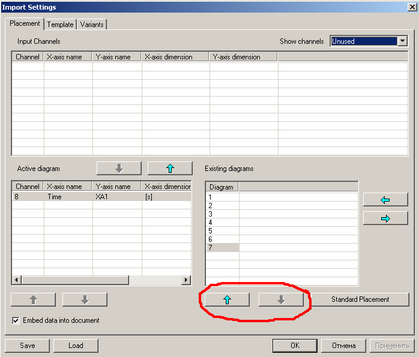

**PRADIS32**

   **Программный комплекс для автоматизации моделирования нестационарных
   процессов в механических системах и системах иной физической
   природы**

Ведение
=======

Цель данного описания, во-первых, дать начальное представление о приемах
работы с Pradis32, а во-вторых, обеспечить пользователя исчерпывающим
объемом справочной информации.

Глава 1 — своего рода вводное занятие с Pradis32, в котором дается вся
последовательность действий от создания модели до просмотра и
редактирования результатов.

Глава 2 дает перечень и описание всех типов файлов, с которыми
пользователь Pradis32 встретится в процессе работы.

В главах 3 и 4 заостряется внимание на чрезвычайно важных возможностях
программы: функциональности COM–сервера и возможности работы с большими
объемами данных.

Глава 5 — краткое справочное руководство по командам Pradis32.

1. Пример работы с Pradis32
===========================

1.1. Создание проекта
---------------------

 После запуска программы Pradis32 первым шагом должно быть
открытие существующего проекта или создание нового. Pradis-проект
строится на основе существующих VAR и TRN-файлов, из которых он получает
все начальные сведения о структуре модели. С помощью Pradis32 можно
транслировать текстовое описание модели на языке PradiSLang в VAR и
TRN-файлы. Для создания нового проекта следует:

   .. figure:: media/image1.png
     :alt: image1
                             
Рисунок 1

Выбрать в главном меню пункт **File->New** 

   .. figure:: media/image2.png
     :alt: image2
              
(воспользоваться кнопкой
на панели инструментов или акселератором Ctrl+N). В результате
откроется диалог **New Document**, предлагающий выбрать, какой тип
документа требуется создать (Рисунок 1).

В настоящее время Pradis32 может создавать документы четырех типов (см.
п.2):

**Pradis32 Document** — документ для отображения результатов расчетов в
виде графиков.

**Pradis32 Template** — шаблон документа, позволяющий сохранять
настройки отображения графиков и использовать их при создании новых
документов.

   .. figure:: media/image3.png
     :alt: image3

Рисунок 2                        

\ **Pradis32 Project** — Проект модели.

**PME Document** — Документ редактора моделей.

Присутствующее в диалоге текстовое окно **Use Document** **Template**
задает шаблон, соответствующий создаваемому документу. При создании
нового проекта можно оставить предложенное по умолчанию имя: шаблон
понадобится только на стадии отображения результатов. Кроме того, его
можно сменить в любой момент уже для существующего документа. Так как
наша цель — создание нового проекта, то следует выбрать тип документа
Pradis32 Project и нажать OK.

Создание нового Pradis-проекта требует задания дополнительных настроек.
После закрытия диалога **New** **Document** появляется диалог **Project
Setup**, позволяющий связать с новым проектом все необходимые файлы и
каталоги. В нем задаются:

Имя нового проекта (**Project Name**).

Каталог, в котором он должен быть размещен (**Location**) (допустимо
задание несуществующего каталога: при необходимости он будет создан).

Имя модели (**Model**). Это имя VAR-файла, который будет использоваться
в проекте. Предполагается, что рядом с VAR-файлом лежит соответствующий
ему файл TRN.

Если на момент создания проекта расчетная модель существует только в
виде текста на языке PradiSLang, можно воспользоваться кнопкой “Create
model from PRADISLang script” для трансляции текста в файлы VAR и TRN.
После нажатия на кнопку возникнет диалог “Translate”.

В диалоге необходимо выбрать путь к входному файлу (PradiSLang file). 
Для выбора пути к выходным файлам (“Output VAR file”) можно
воспользоваться кнопкой “Default” напротив соответствующего поля. При
этом путь к выходному файлу будет установлен как путь к входному +
“.VAR”. После выбора путей для вызова трансляции требуется нажать на
кнопку “Start translation”. При успешной трансляции икона “Status”

   .. figure:: media/image4.png
     :alt: image4
      
Рисунок 3

будет выглядеть как на рисунке выше. Если трансляция не прошла, следует
отредактировать исходный текст PradiSLang для устранения ошибок исходя
из содержимого вывода (“Translation output”) и повторить вызов “Start
translation”.

Для редактирования текста можно воспользоваться кнопкой “Edit” справа от
поля “PradiSLang file”. При этом текст модели будет открыт в текстовом
редакторе, установленном в поле “Input File Editor”. Если поле пусто –
будет предложено выбрать программу для редактирования. В поле Input File
Editor” можно установить редактор текстовых файлов по умолчанию, нажав
на кнопку “Default” справа от поля. После завершения редактирования файл
в редакторе следует сохранить, не меняя его имени.

После успешной трансляции модели следует закрыть диалог “Translate” по
“OK”. При этом в поле “Model” диалога **Project Setup** автоматически
попадет путь к VAR файлу, созданному в диалоге “Translate”.

   Для создания нового проекта в диалоге **Project Setup** необходимо
   указать все требуемые пути: пока хоть одно поле пустое, кнопка OK
   недоступна.

   При нажатии на OK Pradis32 создает, если это необходимо, каталог
   Location. В каталоге Location размещаются, во-первых, файл нового
   проекта, во-вторых, одноименный каталог результатов. В каталог
   результатов копируются файлы модели (VAR и TRN) . На этом процесс
   создания проекта заканчивается.

1.2. Подготовка проекта к решению
---------------------------------

После успешного создания проекта в окне слева появляется
строчка с именем проекта, которая по двойному щелчку мыши раскрывается в
дерево модели (Рисунок 4). Изначально это дерево содержит два узла:
набор параметров Volatile Parameters и настройки процедуры решения
Solver Settings. Узел Volatile Parameters содержит одно поддерево
Variant, внутри которого перечислены все доступные в данной модели
изменяемые параметры. В принципе модель сразу готова для выполнения
расчета. Так как она содержит только те данные, что удалось прочитать из
VAR-файла, то в ней содержится только один вариант расчета, определяемый
текущим набором изменяемых параметров. Особенностью Pradis32 является
возможность автоматизированного выполнения многовариантного расчета. Для
этого требуется добавить требуемые варианты в проект. Предусмотрено два
способа добавления новых вариантов: создание нового узла Variant и
добавление варианта изменяемого параметра.

   .. figure:: media/image5.png
     :alt: image5
                             
Рисунок 4

1.2.1. Добавление варианта изменяемого параметра
~~~~~~~~~~~~~~~~~~~~~~~~~~~~~~~~~~~~~~~~~~~~~~~~

Для добавления варианта необходимо выбрать требуемый параметр, пусть это
будет **Сила Тяжести,** и активизировать его двойным щелчком мыши или
Enter-ом. Справа от дерева модели появится окно с таблицей значений
параметра. В только что созданном проекте таблица всегда содержит одну
строку: из VAR-файла поступает только один вариант. Редактируется
таблица следующим образом:

1. **Изменение значений ячейки**.

   a. Выделите требуемую ячейку и нажмите пробел. Ячейка войдет в режим
      редактирования. Этого же эффекта можно добиться, если дважды
      щелкнуть на ячейке мышью.

   b. Введите новое значение.

   c. Для подтверждения введенного значения нажмите Enter: ячейка выйдет
      из режима редактирования, запомнив новое значение. Для отмены
      ввода вместо Enter следует нажать Esc: ячейка выйдет из режима
      редактирования, восстановив исходное значение.

2. **Добавление строки**.

Для добавления строки просто нажмите Insert: новая строка
вставится перед текущей строкой (содержащей выделенную ячейку). Для
добавления строки в конец следует выделить ячейку в последней,
неиспользуемой строке.

   .. figure:: media/image6.png
     :alt: image6
          
Рисунок 5

3. **Удаление строки**.

Для удаления строки выберите в меню команду **Edit->Clear**, кнопку на
панели инструментов 
   .. figure:: media/image7.png
     :alt: image7
или просто нажмите Delete: текущая строка
будет удалена.

**Замечание 1**. Если таблица содержит только один вариант, то есть
только одну строку со значениями, то эта строка не может быть удалена.
Также не может быть удалена замыкающая пустая строка.

**Замечание 2**. Число измерений в каждом параметре определяется из
VAR-файла и в дальнейшем не может быть изменено. Поэтому добавление
столбцов в таблицу не предусмотрено.

Итак, добавим новый вариант в параметр **Сила** **Тяжести**.
Таблица для этого параметра будет выглядеть как, например, на Рисунок 5.
Теперь параметру **Сила Тяжести** соответствуют два значения, а проект
содержит два варианта расчета. Аналогичную операцию выполним для
параметра **Точка О** (Рисунок ). Теперь проект содержит 4 варианта
расчета. При добавлении новых значений изменяемых параметров множество
вариантов расчета есть произведение множеств значений параметров. Такой
способ настройки многовариантного расчета, удобен, по-видимому, когда
следует варьировать значение одного или нескольких параметров и для
каждого варианта получить решение. Когда же требуется рассчитать
несколько принципиально различных вариантов, более предпочтительным
оказывается дублирование в модели узла Variant.
   .. figure:: media/image8.png
     :alt: image8
Рисунок 6

1.2.2. Добавление нового набора параметров (Дублирование узла Variant)
~~~~~~~~~~~~~~~~~~~~~~~~~~~~~~~~~~~~~~~~~~~~~~~~~~~~~~~~~~~~~~~~~~~~~~

Для дублирования узла **Variant** нужно

Выделить узел **Variant** в дереве модели.

Вызвать из главного или контекстного меню команду **Duplicate** **Node**
или воспользоваться акселератором Alt+Insert.

В результате в дереве появится второй узел **Variant**. Набор параметров
и их значения точно такие же, как в исходном узле: новый узел — его
точная копия.

Так как теперь дерево содержит два узла **Variant**, то во
избежание путаницы новый вариант желательно переименовать. Для этого
нужно

Выделить требуемый узел.

Щелкнуть на нем повторно мышью или вызвать пункт меню **Rename Node**
(процедура аналогична переименованию, например, файла в Windows
Explorer).

Задать новое имя узла, например, **Another Variant**.
   .. figure:: media/image9.png
     :alt: image9
Рисунок 7

В результате дерево модели примет вид, как показано на Рисунок . В
модели образовались два независимых множества вариантов расчета:
**Variant** и **Another Variant**. В обоих вариантах таблицы параметров
могут независимо редактироваться, как было показано в п.1.2.1. В
настоящей модели, если узел **Variant** был преобразован, как в п.1.2.1,
содержится 4+4=8 вариантов расчета, причем эти два набора идентичны.

Предположим, что нам нужно, кроме набора расчетов, заданных в
**Variant**, произвести вычисления и для исходного набора параметров,
тех, что были прочитаны из VAR-файла. Однако оба варианта **Variant** и
**Another Variant** содержат измененные данные. Для быстрого получения
исходных данных удобнее всего сделать следующее:

Выделить требуемый вариант, например, **Another Variant**

Вызвать из меню команду **Edit->Reset Content** (Ctrl+D).

Если теперь открыть таблицы параметров **Сила Тяжести** и **Точка О** в
**Another Variant**, то вместо таблиц на Рисунок и Рисунок будут видны
исходные таблицы параметров. По команде **Reset Content** вся структура
параметров и их значения были заново восстановлены из модели. Отметим,
что команда **Reset Content** может быть применена к любому из узлов
дерева модели (кроме узлов результатов, которых пока в дереве вообще
нет). О поведении ее в каждом конкретном случае будет рассказано позже.

1.3. Решение задачи
-------------------

Итак, модель сформирована и содержит 5 вариантов расчета (4 в Variant и
1 в Another Variant). Решение задачи запускается командой Run->New, при
этом последовательно рассчитываются все варианты. В меню Run содержится
также пункт Sequential — продолжение расчета, но в нашем случае он
недоступен: задача еще ни разу не решалась.

При запуске расчета появляются, во-первых, диалог Solution Progress,
показывающий, какая доля задачи уже решена и позволяющий прервать
решение, во-вторых, окно с анимацией процесса. Процесс решения можно
замедлять с помощью слайдера в нижней части окна анимации ().

Окно анимации в процессе решения можно закрыть: решение будет
продолжаться без анимации. В любой момент окно может быть восстановлено
c помощью команды View->Animate. Визуализация начнется с текущего этапа
решения (Animate доступна только в процессе решения).
   .. figure:: media/image10.png
     :alt: image10
Рисунок 8

После завершения расчета в каталоге выходных данных появляются 5
rsl-файлов, каждый из которых содержит результаты вычислений для одного
варианта.

В дереве модели появился новый узел Results с результатами расчета и
теперь можно перейти к их отображению.

1.4. Отображение результатов
----------------------------

1.4.1. Выбор вариантов расчета для отображения
~~~~~~~~~~~~~~~~~~~~~~~~~~~~~~~~~~~~~~~~~~~~~~

Процесс выбора вариантов чрезвычайно прост: нужно пометить
галочками интересующие узлы в дереве модели. Причем изменение статуса
поддерева приводит к автоматическому изменению статуса его ветвей.

Пусть следует отобразить вариант, соответствующий первому значению
параметра **Сила Тяжести** и второму — **Точка О** в поддереве Variant.
Выделив интересующий узел, получим картину . Теперь в меню доступна
команда **Run->Show Diagrams** (если, конечно, фокус установлен на дереве
модели).

**Примечание.** В этом пункте мы выделили только один вариант расчета.
Когда же требуется выделить несколько вариантов, изображенное на дерево
может оказаться неудобным. Например, выделение всех вариантов для
значения параметра Сила Тяжести [1] требует лишь одного действия, а для
аналогичной операции с Точка О [1] их потребуется уже два. Сложности
существенно возрастут при увеличении числа параметров или вариантов
параметра. Для облегчения выделения вариантов предусмотрена команда
Change Order, позволяющая изменить порядок следования параметров в
дереве результатов (см.5.4.7).

   .. figure:: media/image11.png
     :alt: image11
Рисунок 9

1.4.2. Создание диаграмм
~~~~~~~~~~~~~~~~~~~~~~~~

Команда **Show Diagrams** вызывает диалог импорта (**Import Settings**),
позволяющий:

Увидеть набор кривых, содержащихся в выбранных файлах.

Выбрать, какие из них следует показать.

Распределить выбранные кривые по диаграммам.

Диалог **Import Settings** состоит из трех закладок, **Placement**,
**Template** и **Variants**. На закладке **Placement** расположены три
списка:

Список входных кривых (**Input Channels**). В нем перечислены кривые,
содержащиеся в открытом файле(ах). Список имеет три режима отображения,
режим задается в combo box-е **Show** **Channels**.

Список диаграмм (**Existing Diagrams**). Это диаграммы, которые будут
созданы при нажатии на OK.

Список кривых в текущей диаграмме (**Active Diagram**). Это список
кривых в выделенной диаграмме (той, на которой стоит курсор в списке
**Existing Diagrams**).

Подробное объяснение возможностей диалога **Import Settings** и приемов
работы с ним выходит за рамки первого знакомства с Pradis32 (подробнее
см. п. и ), поэтому ограничимся самым простым случаем: покажем все
результаты, как предлагает диалог **Import Settings**. По умолчанию он
предлагает показать все кривые на отдельных диаграммах, что видно из
списка **Existing Diagrams**: он содержит 12 записей. Теперь можно
нажать на OK и приступить к обработке результатов.

1.4.3. Вызов 3D визуализации
~~~~~~~~~~~~~~~~~~~~~~~~~~~~

Кроме двумерных графиков выходных переменных, pradis32 в ходе расчета
сохраняет информацию, позволяющую с помощью плеера просматривать 3D
сцены поведения модели при расчете. Для вызова плеера и показа сцены
после окончания расчета необходимо:

- выделить левым кликом мыши (не просто пометить галочкой!) в поддереве
результатов **Project Bar** один из нижних узлов, то есть один вариант
многовариантного расчета для показа. В меню станет активным **View->Run
Visualizer** (если, фокус установлен на дереве модели);

- вызвать меню **View->Run Visualizer.** При этом должен открыться плеер
и загрузить соответствующую сцену.

1.5. Знакомство с Pradis32 Document
-----------------------------------

Как говорилось в п.1.1, Pradis32 поддерживает документы 3-х типов:
проект, документ и шаблон. При закрытии диалога Import Settings был
создан Pradis32 документ, служащий для отображения диаграмм и
предоставляющий широкий выбор средств для их редактирования.

1.5.1. Операции со страницами документа
~~~~~~~~~~~~~~~~~~~~~~~~~~~~~~~~~~~~~~~

1.5.1.1. Листание страниц
^^^^^^^^^^^^^^^^^^^^^^^^^

Получившийся документ разбит на страницы и изначально видна только
первая. На панели инструментов в настоящий момент активна кнопка
   .. figure:: media/image12.png
     :alt: image12
, при нажатии на которую программа показывает следующую
страницу. Всего в документе их получилось 6. При переходе на следующую
страницу становится активной кнопка 
   .. figure:: media/image13.png
     :alt: image13
, позволяющая вернуться на
предыдущую. Этого же эффекта можно добиться с помощью клавиш Page Up и
Page Down.

1.5.1.2. Изменение формата страницы
^^^^^^^^^^^^^^^^^^^^^^^^^^^^^^^^^^^

В настоящий момент в меню доступна команда Edit->Switch Page Format,
позволяющая изменить формат страницы с книжного на альбомный и обратно.
Для этой операции предусмотрен акселератор Ctrl+W.

1.5.1.3. Изменение масштаба отображения
^^^^^^^^^^^^^^^^^^^^^^^^^^^^^^^^^^^^^^^

Изначально при создании документ показывается в масштабе 100%, что может
оказаться не всегда удобным. В меню предусмотрена команда ViewZoom, с
помощью которой вызывается диалог настройки масштаба отображения Zoom.
Кроме предопределенных масштабов пользователь может ввести свое
собственное значение в диапазоне 5–2000%.

Кроме этого предусмотрен режим Box Zoom, включающийся с помощью команды
ViewMouse ModeBox Zoom или кнопкой 
   .. figure:: media/image14.png
     :alt: image14

на панели инструментов, в котором пользователь может выделить мышью произвольный прямоугольник на
листе и масштаб страницы изменится так, чтобы этот прямоугольник
оказался вписанным в активное окно. Двойной щелчок мыши в этом режиме
приводит к восстановлению масштаба 100%. Отключение режима Box Zoom:
выбор в меню ViewMouse Mode другого режима (лучше всего — Select) или
нажатие кнопок

   .. figure:: media/image115.png
     :alt: image115.
     
(Select) или 
   .. figure:: media/image16.png
     :alt: image16
(Scale).

1.5.2. Редактирование объектов
~~~~~~~~~~~~~~~~~~~~~~~~~~~~~~

Все диаграммы на странице, а также ее составные части, могут
быть выделены и их свойства могут быть изменены. Для выделения объектов
нужно щелкнуть на них мышью. Можно выделить несколько объектов, если при
этом держать нажатым Shift. Над выделенными объектами возможны операции
(набор операций определяется типом объекта):

1. Копирование Cut/Copy/Paste

2. Удаление без копирования в Clipboard и возможности восстановления
   (Clear)

3. Редактирование свойств.

   .. figure:: media/image17.png
     :alt: image17
Рисунок 10

Диаграмма состоит из следующих объектов: Название, Область построения,
Легенда (Рисунок 10). Разумеется, также
могут быть изменены настройки кривой и всей диаграммы целиком, просто на
рисунке они не подписаны.

В качестве простейшего упражнения можно изменить фон первой диаграммы.
Для этого дважды щелкните мышью на Области Построения Кривых в первой
диаграмме на первой странице.

На экране появился диалог Diagram Space Properties. Выберите
закладку Appearance и установите какой-нибудь другой цвет с помощью
кнопки Set Color в группе Background, или вообще уберите фон, установив
флаг No Background Color. После нажатия на OK диаграмма изменит цвет
фона на выбранный.
   .. figure:: media/image18.png
     :alt: image18
Рисунок 11

Предположим, что редактирование диаграмм на этом заканчивается.
Созданный документ с диаграммами следует сохранить. Для этого можно
воспользоваться командами File->Save(Save As). Обе они дадут одинаковый
эффект — покажут диалог Save As, так как документ сохраняется впервые.
Сохраните документ под именем, например doc1 (он нам понадобится в
дальнейшем).

1.6. Смена и обновление шаблона
-------------------------------

Создадим на основе только что сохраненного документа шаблон.
Использование шаблона позволяет один раз настроить параметры документа и
потом по его образцу создавать новые.

1.6.1. Смена шаблона
~~~~~~~~~~~~~~~~~~~~

Пока мы обладаем только одним шаблоном — default.pdt (см. п.2.1.3). На
его основе и был создан документ.

Не закрывая только что созданного документа, выберите команду File->New и
откройте уже известный диалог New Document (см. п.).

Выберите тип документа Pradis32 Template и нажмите OK. Новый
документ-шаблон сразу же создается; создание нового шаблона — самая
простая операция в New Document.

Выберите File->Save. Программа покажет диалог Save As. И предложит
сохранить шаблон в некотором каталоге DocTemplates. О том, что это за
каталог, можно узнать в п.. Изменять каталог не рекомендуется: шаблоны
следует сохранять именно в DocTemplates. Задайте имя нового шаблона,
например, template1, нажмите OK.

Закройте только что созданный шаблон.

Для исходного документа doc1 вызовите пункт меню File->Change Template. В
открывшемся диалоге видны два файла: default.pdt и template1.pdt.
Выберите template1.pdt и нажмите OK.

Теперь у документа doc1 шаблоном является template1. На документ это,
вообще говоря, никак не влияет: шаблон нужен при импорте. Кроме того,
оба шаблона default и template1 — пустые. Однако смена шаблона позволяет
быстро обновить содержимое template1. Вызовите из меню команду Overwrite
Template. Это не привело к каким-либо внешним изменениям, однако все
содержимое doc1 было скопировано в template1. Таким образом, на основе
doc1 был создан шаблон template1, являющийся его точной копией.

1.7. И снова отображение результатов
------------------------------------

Вернемся теперь к пункту 1.4.

Выберите какой-нибудь другой вариант расчета, например, Another Variant
и выполните все действия из п..

Когда появится диалог Import Settings, перейдите на закладку Template и
нажмите на кнопку Browse.

В появившемся диалоге выберите опять-таки template1 и нажмите OK.
Создание диаграмм будет происходить так же, как и для doc1, но будет
использован новый шаблон.

Нажмите OK в диалоге Import Settings. Создался документ с данными из
другого варианта расчета, но его графические настройки идентичны doc1.

Использование шаблонов иногда может существенно сэкономить время на
форматирование диаграмм.

1.8. Отображение результатов нескольких вариантов расчета
---------------------------------------------------------

В пп.1.4 и 1.7 мы отображали результаты единичного варианта
расчета. Pradis32 предоставляет возможности для одновременного
отображения результатов нескольких вариантов.

Вернитесь к п. и пометьте галочкой узел **Variant** целиком. Теперь
программа отобразит результаты вычислений из всего поддерева
**Variant**.

Вызовите диалог **Import Settings** с помощью команды **Show Diagrams**
(см п.).

Содержание закладок **Placement** и **Template** не изменилось: оно
общее для всех вариантов (все варианты расчетов одной модели в Pradis32
содержат одинаковый набор кривых). На закладке **Template** снова
установите шаблон default.pdt.

Перейдите на закладку **Variants**.

В списке **Parameter Set** выберите набор параметров **Variant**. Список
справа будет содержать параметры этого набора (Сила Тяжести и Точка О).

Установите галочку в столбце **Is Running** для обоих параметров.

Убедитесь в том, что установлен флаг **Place every variant into separate
page(s)**.

Нажмите OK.
   .. figure:: media/image19.png
     :alt: image19
Рисунок 12

Результатом этих действий будет создание документа с диаграммами.
Количество и расположение диаграмм в нем полностью аналогично тому, что
было получено в сохраненном ранее документе doc1. Однако теперь в каждой
диаграмме собраны по 4 кривые из всех вариантов.

Это один из возможных сценариев отображения многовариантного расчета.
Для подробного знакомства с заложенными возможностями следует обратиться
к описанию команд **Import** (п.5.1.4), **Show** **Diagrams** (п.5.2.3)
и **Change Order** (п.5.4.7).

2. Типы файлов Pradis32
=======================

**Таблица** **1.** Типы файлов, с которыми работает Pradis32

+------------+---------------------------------------------------------+
| Расширение | Краткое описание                                        |
+============+=========================================================+
| **ppj**    | Проект Pradis32                                         |
+------------+---------------------------------------------------------+
| **pd**     | Документ для отображения диаграмм                       |
+------------+---------------------------------------------------------+
| **pdt**    | Шаблон документа                                        |
+------------+---------------------------------------------------------+
| **pme**    | Документ редактора моделей (описан в отдельном          |
|            | руководстве)                                            |
+------------+---------------------------------------------------------+
| **rsx**    | Информация о результатах многовариантного расчета       |
+------------+---------------------------------------------------------+
| **rsl**    | Файл с результатами расчета                             |
+------------+---------------------------------------------------------+
| **sci**    | Файл с настройками импорта                              |
+------------+---------------------------------------------------------+
| **var,     | Исходные файлы модели                                   |
| trn**      |                                                         |
+------------+---------------------------------------------------------+
| **pgo**    | Графическая информация о поведении модели при расчете   |
+------------+---------------------------------------------------------+

2.1. Типы документов
--------------------

2.1.1. Проект Pradis32
~~~~~~~~~~~~~~~~~~~~~~

Данный тип документа используется для создания расчетной модели.
Создание такого документа подробно описано в п.1.1. Для создания проекта
необходимы файлы VAR и TRN, которые копируются в соответствующий проекту
каталог вывода. В настоящей версии каталог вывода создается там же, где
и файл проекта и имеет то же имя, что и проект и расширение output.
Проект запоминает относительный путь к каталогу вывода, так что проект
вместе с этим каталогом могут беспрепятственно копироваться. После
расчета в каталоге вывода создается набор RSL-файлов с результатами
расчетов и одноименный с проектом RSX-файл. Если при расчете был
установлен вывод графической информации (см. 5.6.1, подпункт 4), то с
каждым RSL файлом при расчете создастся одноименный файл с расширением
PGO, содержащий графический вывод поведения модели. Файлы проектов имеют
расширение ppj. Для отображения структуры проекта в виде дерева
предусмотрено специальное окно Project Bar. Одновременно может быть
открыт только один проект. При создании или открытии нового проекта
программа предложит предварительно закрыть текущий проект.

2.1.2. Документ
~~~~~~~~~~~~~~~

Pradis32 поддерживает также специальный тип документа для отображения
результатов расчета в виде диаграмм. Такой документ может быть создан,
во-первых, явно, по команде меню FileNew, во-вторых, при отображении
результатов расчета, как описано в п.1.4-1.4.3. Если новый документ
создан с помощью команды New, то диаграммы в него могут быть добавлены,
во–первых, копированием (Cut/Copy/Paste или Drag&Drop) из другого
документа, во–вторых, с помощью импорта из RSL-файла (см. п.5.1.4). В
последнем случае при создании новых диаграмм используется шаблон —
специальная разновидность документа для сохранения графических настроек.

Важнейшая особенность pd-документа — поддержка для него возможности
встраивания (см. п.).

Файлы документов Pradis32 имеют расширение pd.

2.1.3. Шаблон документа
~~~~~~~~~~~~~~~~~~~~~~~

Как, например, в Word, всякий pd-документ в Pradis32 основан на шаблоне.
Информация из шаблона используется при создании документа и при импорте.
По сути шаблон — обычный документ, допускающий все те операции, что
разрешены для pd-документа, но:

Он не имеет шаблона. Поэтому команды Change Template и Overwrite
Template (см. п.-) для него неприменимы.

Для сохранения шаблонов Pradis32 создает специальный подкаталог
ctm_mod/Pradis32/DocTemplates в системном каталоге текущего пользователя
Application Data (задается переменной окружения APPDATA).

Для шаблонов определены понятия:

Шаблон приложения по умолчанию default.pdt. Это аналог Normal.dot в
Word. Если приложение не находит его в стандартном каталоге шаблонов
(%APPDATA%/ctm_mod/Pradis32/DocTemplates), он создается заново.

Текущий шаблон. На основе текущего шаблона создаются новые документы.
Имя текущего шаблона можно увидеть при открытии диалога New Document.
Этот же диалог позволяет сменить текущий шаблон.

Шаблон документа. Данный шаблон используется при импорте и добавлении
страниц в документ. При создании документа в качестве шаблона документа
устанавливается текущий шаблон. Смена шаблона для уже существующего
документа возможна с помощью команды меню File->Change Template.

Определена реакция программы в случаях, когда невозможно найти или
открыть шаблон:

Невозможно открыть шаблон по умолчанию (default.pdt). В этом случае
приложение просто генерирует его заново. Это относится как к случаю,
когда файл шаблона не найден, так и к ситуации, когда файл записан в
неверном формате. Во втором случае файл перезаписывается. Программа
также пытается создать стандартный каталог шаблонов, если он
отсутствует. В случае неудачи стандартным каталогом объявляется каталог,
в котором находится pradis32.exe. Проверка наличия шаблона default.pdt
производится при каждом запуске программы.

Невозможно открыть текущий шаблон. При старте и в момент вызова диалога
New Document программа проверяет наличие и правильность формата текущего
шаблона и в случае ошибки устанавливает в качестве текущего шаблон по
умолчанию. Если пользователь выбрал шаблон с неверным форматом, то при
нажатии на OK будет выдано сообщение об ошибке и диалог не закроется.

Невозможно открыть шаблон документа. Проверка формата шаблона документа
производится непосредственно перед выполнением операции, требующей
шаблон (импорт и добавление страниц). В случае ошибки пользователю
предлагается назначить другой шаблон. Файлы шаблонов имеют расширение
pdt.

2.2. Файл управления результатами расчета
-----------------------------------------

Одновременно с созданием файла проекта в каталоге вывода создается файл
управления результатами с расширением RSX. В нем сохранены все данные,
необходимые для показа графиков из RSL-файлов последнего
многовариантного расчета (имена и число вариантов изменяемых параметров)
и текущие настройки импорта данных. С помощью данных из этого файла
программа находит все rsl-файлы, принадлежащие текущему проекту.

2.3. Файлы данных
-----------------

В качестве файлов данных используются rsl-файлы Pradis. Особенностью
формата (надо сказать — неприятной особенностью) является необходимость
использовать соответствующий VAR-файл при чтении данных. Pradis32 может
открывать rsl-файлы, если

Рядом лежит одноименный VAR-файл. Это традиционная для старого Pradis
схема работы, которая поддерживается для совместимости. Такой способ
генерации rsl-файлов в Pradis32 неприемлем, поскольку не может
сочетаться с многовариантным расчетом, когда рядом с одним VAR-файлом
должно располагаться целое семейство файлов rsl.

Рядом с rsl-файлом лежит VAR-файл, имя которого может быть получено
преобразованием имени файла rsl. При решении задачи Pradis32 генерирует
набор rsl-файлов, имена которых образуются по правилу:

   **(Имя проекта)#(Имя VAR-файла)#(идентификатор).rsl**

Из такого имени Pradis32 извлекает имя VAR-файла и получает возможность
прочитать файл rsl. Понятно, что старые средства визуализации расчетов
Pradis непосредственно не могут прочитать такой файл.

Данные из файлов rsl могут быть отображены в pd-документах (или в pdt).
Для этого нужно либо запустить процедуру отображения результатов расчета
(см. п.5.2.3), либо выполнить импорт из rsl-файла (см. п.5.1.4). Во
втором случае не обязательно, чтобы файл rsl принадлежал к какому-нибудь
проекту Pradis32, главное, чтобы рядом с ним находился соответствующий
VAR-файл (связь имен файлов может быть как 1-го, так и 2-го вида).

2.4. Сценарии импорта
---------------------

Вспомогательные файлы с расширением sci используются для сохранения
состояния диалога Import Settings (см. п. 5.1.4) и быстрой его загрузки
при последующих сеансах импорта.

2.5. Исходные файлы модели
--------------------------

Исходные файлы модели VAR и TRN нужны для нормальной работы Pradis32
проекта и ставятся ему в соответствие непосредственно при создании. Для
Pradis32 эти файлы — входные данные и он никогда их не редактирует.

2.6. Файлы с графической информацией.
-------------------------------------

Эти файлы создаются при расчете вместе с файлами данных (2.3). Они имеют
имена, совпадающие с именами RSL файлов (одноименные файлы RSL и PGO
соответствуют расчету с одинаковым набором параметров) и расширение PGO.
Эти файлы содержат в текстовом формате (упрощенный XML) информацию о
визуальном поведении модели при расчете. Файлы предполагается открывать
после расчета плеером, для просмотра 3D сцены поведения модели при
расчете.

3. Возможности Pradis32 как COM-сервера
=======================================

Разработанное приложение является full-server-ом OLE, т.е. может быть
запущено и как отдельное приложение и как редактор встроенного
Pradis32-объекта. Встроенным может быть документ с диаграммами, то есть
pd-документ. Рисунок 5 — пример такого документа. Если у Вас уже
установлен Pradis32, то его можно открыть и отредактировать.

Работа со встроенным объектом возможна в двух режимах:
in-place редактирование и редактирование в отдельном окне. Первый режим,
по-видимому, наиболее удобен при редактировании встроенного документа с
переменным форматом страницы, особенно если документ состоит из
одной-двух диаграмм. В MS Word открытие объекта in-place выполняется
командой Edit->Object->Edit. Во втором режиме внешний вид пользовательского
интерфейса максимально приближен к stand alone режиму (открытие
независимого документа) и представляется удобным для редактирования
больших объектов, в частности, встроенных документов с фиксированным
форматом страницы. В MS Word открытие объекта в отдельном окне
выполняется командой Edit->Object->Open.

Встроить Pradis32-объект в OLE контейнер можно:

-скопировав данные из документа через clipboard (cut/copy/paste или
drag&drop);

-с помощью команды Insert->Object в приложении-контейнере (в Word это
Insert->Insert Object). Название требуемого документа Pradis32 Document.

4. Дополнительные средства для работы с большими объемами данных
================================================================

Pradis32 позволяет отображать кривые, которым соответствуют достаточно
большие (теоретически — неограниченные) объемы данных. Для этого в нем
предусмотрены:

   .. figure:: media/image2200.png
     :alt: image2200

Рисунок 13

Возможность использования связанных данных.

Прореживание данных перед рисованием.

4.1. Кривые со связанными данными
---------------------------------

При импорте данные кривой обычно копируются в документ и становятся его
частью. В этом случае исходный файл данных после импорта больше не
нужен. Однако это может привести к недопустимо большим размерам файла
документа. В Pradis32 предусмотрен механизм с помощью которого документ
запоминает только ссылку на файл данных. В этом случае в документе
запоминается относительный путь к файлу данных, поэтому их можно
копировать вместе и переносить на другой компьютер: документ не потеряет
работоспособность. Способ встраивания данных в документ определяется при
импорте (см. п.5.1.4), связанные данные при необходимости могут быть
встроены в документ в дальнейшем (см. п.5.3.6).

**Замечание**. Работа со связанными данными допустима только для
отдельного документа. Встроенный документ всегда хранит в себе все свои
данные (см. п.5.6.1).

4.2. Прореживание при перерисовке
---------------------------------

При рисовании кривых программа использует не все точки. Специально
разработанный механизм предварительно создает прореженную
последовательность точек, достаточную для отображения кривой с требуемым
качеством. Качество прореживания может быть отрегулировано из диалога
Customize (см. п.5.6.1).

5. Перечень команд меню Pradis32
================================

5.1. File
---------

5.1.1. New, Open, Close, Save, Save As
~~~~~~~~~~~~~~~~~~~~~~~~~~~~~~~~~~~~~~

Эти стандартные для Windows-приложения команды осуществляют создание,
открытие, закрытие и сохранение документов.

5.1.2. Change Template
~~~~~~~~~~~~~~~~~~~~~~

Команда позволяет сменить связанный с документом шаблон, и она доступна
только для документа (pd) и проекта (ppj). Акселератор — Ctrl+T.

5.1.3. Overwrite Template
~~~~~~~~~~~~~~~~~~~~~~~~~

Эта команда позволяет обновить содержимое связанного с документом
шаблона (фактически выполняет Save Copy As в текущий шаблон документа).
Команда доступна только для документа (pd-файл) (шаблон не имеет
шаблона, а проекту (ppj-файл) он нужен только для создания
pd-документов) и только в stand-alone режиме (встроенный документ, хоть
и имеет шаблон, но никогда его не использует). Акселератор — Alt+S.

5.1.4. Import
~~~~~~~~~~~~~

Эта команда доступна для документов и шаблонов (pd и pdt-файлы) и
осуществляет импорт из внешнего файла данных в документ. Сначала
пользователю предлагается выбрать файл данных, из которого будет
осуществляться импорт. После выбора файла вызывается диалог Import
Settings отображающий список содержащихся в файле каналов и позволяющий:

Определить, какие каналы следует использовать при импорте.

Назначить количество диаграмм и распределение кривых по диаграммам.

Определить порядок следования диаграмм.

Определить порядок следования кривых в диаграмме.

Назначить шаблон документа, который будет использоваться при импорте.

Сохранить созданный сценарий импорта в файле сценария (.sci-файл)

Выполнить импорт в соответствии с настройками в sci-файле.

Диалог Import Settings выполнен в виде ведомости свойств (property
sheet) и состоит из двух страниц.

5.1.4.1. Страница Template
^^^^^^^^^^^^^^^^^^^^^^^^^^

Страница Template позволяет

Выбрать шаблон документа, с помощью которого будет выполнен импорт. Этот
шаблон становится текущим для документа (если, конечно, импорт
выполняется в документ (pd-файл), а не в шаблон (pdt): у шаблона нет
шаблона)

Установить желаемое число диаграмм на странице. При установленном флаге
Place as in Template заданные числа строк и столбцов используются только
в крайнем случае, например, когда соответствующая страница шаблона
вообще не содержит диаграмм. При снятом флажке диаграммы выстраиваются
так, как задано пользователем, информация о расположении диаграмм в
шаблоне игнорируется.

5.1.4.2. Страница Placement
^^^^^^^^^^^^^^^^^^^^^^^^^^^

На этой странице выполняется настройка размещения кривых в диаграммах.
На странице помещены три списка:

Входных каналов.

Существующих диаграмм.

Кривых активной диаграммы.

Список входных каналов имеет три режима отображения:

All. Отображаются все входные каналы.

Unused. Отображаются каналы, не включенные ни в одну из существующих
диаграмм.

Suitable. Это, во-первых, неиспользованные каналы, во-вторых, пригодные
для вставки в активную диаграмму (имеют те же размерности осей).

Активной является диаграмма, выделенная в списке диаграмм. Если не
выделено ни одной диаграммы, или выделено несколько диаграмм, активная
диаграмма не определена и список кривых активной диаграммы недоступен.
Если для входных каналов установлен режим Suitable, то в этом случае
список входных каналов будет также пуст. На вид списка входных каналов в
режимах отображения All и Unused наличие или отсутствие активной
диаграммы не влияет.

Спискам диаграмм и кривых активной диаграммы соответствуют пары кнопок
Up и Down. Эти кнопки позволяют менять порядок следования диаграмм и
кривых внутри диаграммы.

Расположенный внизу диалога флаг Embed Data Into Document определяет,
должны ли данные быть встроены в документ (установлен) или же следует
создать ссылки на файл (снят).

В тех случаях, когда не требуется вручную настраивать размещение каждой
кривой, можно воспользоваться дополнительным диалогом Standard
Placement, вызываемым с помощью одноименной кнопки на странице
Placement. Этот диалог аналогичен старому диалогу импорта и позволяет
проще, чем с помощью основного диалога:

Выделить для каждой выбранной кривой отдельную диаграмму

Рассортировать кривые по диаграммам в соответствии с размерностями осей.

5.1.4.3. Сохранение и применение сценария
^^^^^^^^^^^^^^^^^^^^^^^^^^^^^^^^^^^^^^^^^

Текущее состояние настроек диалога Import Settings может быть сохранено
в файле сценария (sci-файл) с помощью кнопки Save. В последующем
сценарий может быть загружен из файла с помощью кнопки Load. Это может
оказаться полезным в случае, когда необходимо вставить в документ данные
из нескольких файлов с одинаковым набором кривых: импорт можно настроить
один раз и в последующем применять сохраненный сценарий.

Импорт невозможен во встроенный документ и команда доступна только в
stand-alone режиме. Соответствующий команде акселератор — Ctrl+I.

5.1.5. Metafile
~~~~~~~~~~~~~~~

Сохраняет изображение текущей страницы в метафайл. Пользователю
предлагается выбрать имя метафайла. Приписывать расширение к имени файла
не обязательно: соответствующее выбранному формату расширение в случае
необходимости будет добавлено автоматически. Возможно сохранение
метафайла в форматах emf и wmf.

5.1.6. Print, Print Preview, Print Setup
~~~~~~~~~~~~~~~~~~~~~~~~~~~~~~~~~~~~~~~~

Стандартные команды печати. В настоящее время печатается только текущая
страница. Для печати альбомной страницы нужно установить требуемый
формат в меню Print Setup.

5.1.7. Translate PRADISLang
~~~~~~~~~~~~~~~~~~~~~~~~~~~

Вызывает диалог “Translate” предназначенный для трансляции описания
расчетной модели на языке PradiSLang в бинарные файлы модели .VAR и
.TRN. Эта операция необходима, поскольку проект pradis32 можно создавать
только на основе бинарных файлов. Диалог “Translate” также можно вызвать
при создании проекта, для того чтобы создать бинарные файлы из текста
PradiSLang, а затем на их основе создать проект. Здесь (в меню) диалог
вызывается отдельно, на случай если необходимо просто оттранслировать
текст PradiSLang в бинарные файлы, не создавая из них проект.

5.1.7.1 Диалог “Translate”.
^^^^^^^^^^^^^^^^^^^^^^^^^^^

Диалог содержит три блока настроек:

- External application

- Translation Settings

- Translation output

а также кнопки “Start translation”, “OK”, “Cancel”.

External application
''''''''''''''''''''

Блок описывает сторонний редактор, которым будет открыт входной файл из
поля “PradiSLang file”, секции “ Translation output ” при нажатии на
кнопку “Edit”. Поле ввода “Input File Editor” содержит путь к
исполняемому файлу редактора. По кнопке “Browse” можно выбрать путь на
диске. Кнопка “Default” установит в поле ввода путь к редактору,
ассоциированному в Windows с текстовыми файлами по умолчанию.

Translation Settings
''''''''''''''''''''

Блок описывает настройки трансляции:

- Поле ввода “PradiSLang File” содержит путь к тексту модели. Кнопкой
“Browse” можно найти путь на диске. Кнопка “Edit” открывает файл из поля
ввода в стороннем текстовом редакторе для редактирования. Путь к
редактору задается в блоке “External Application”. Если он не
установлен, при нажатии на “Edit” будет вызвано стандартное окно
Windows, позволяющее выбрать этот редактор из списка программ.

- Поле ввода “Output VAR File”, задает путь к выходным файлам
результатам трансляции. В поле задается путь к VAR файлу. Файл TRN
создастся в ходе трансляциии рядом с VAR файлом. Его имя будет таким же,
как у VAR файла (отличается расширение). Кногпка “Browse” позволяет
выбрать выходной путь на диске. Кнопка “Default” установит в поле ввода
такой же путь, как в поле “PradiSLang File”, но с добавлением расширения
“.VAR”.

Translation output
''''''''''''''''''

Блок содержит вывод результатов трансляции.

- Поле “Translation output” отображает вывод модулей pradis32,
создаваемый в ходе трансляции (файл sysprint.txt в той же директории,
что и выходной VAR файл).

- Икона “Status” показывает, успешно ли прошла последняя трансляция.
   .. figure:: media/image21.png
     :alt: image21

успешно, 
 .. figure:: media/image22.png
     :alt: image22

не успешно.

- Радио кнопка “Encoding” позволяет выбрать кодировку, в которой следует
воспринимать файл sysprint.txt при отображении (Windows/DOS).

- Кнопка “Refresh sysprint.txt” позволяет перечитать sysprint.txt в поле
“Translation output”.

OK/Cancel/Start translation
'''''''''''''''''''''''''''

Кнопка “Start translation” вызывает запуск трансляции. После ее вызова,
в случае успеха, создадутся бинарные файлы модели. В любом случае
перечитается sysprint.txt и обновится икона “Status”. OK и Cancel
закрывают диалог “Translate”. В случае OK значения настроек диалога
будут сохранены и показаны при следующем вызове диалога.

5.2. Run
--------

5.2.1. New
~~~~~~~~~~

Запускает новый расчет открытого в настоящий момент проекта. Если с
моделью связаны rsl-файлы с результатами предыдущих расчетов, то эти
файлы **уничтожаются**. Акселератор — Ctrl+U. Кнопка на панели
инструментов — 
   .. figure:: media/image23.png
     :alt: image23

5.2.2. Sequential
~~~~~~~~~~~~~~~~~

Запускает дополнительный расчет для открытого в настоящий момент
проекта. Дополнительный расчет невозможен если:

Для проекта не проводился новый расчет (ни разу не вызывалась команда
Run->New).

В процессе редактирования модели произошло изменение числа вариантов
расчета.

Вызывался Reset Content для какого-нибудь узла.

При дополнительном расчете новые результаты дописываются в существующие
rsl-файлы. Акселератор — Alt+U. Кнопка на панели инструментов —
   .. figure:: media/image24.png
     :alt: image24

5.2.3. Show Diagrams
~~~~~~~~~~~~~~~~~~~~

Запускает процедуру отображения выбранного набора результатов расчетов.
При этом в памяти создается временный pd-документ, в котором и рисуются
диаграммы. Этот документ в последующем может быть сохранен с помощью
File->Save.

Выбранными являются те варианты расчета, которые помечены галочкой в
дереве проекта (Project Bar).

По команде Show Diagrams вызывается диалог Import Settings.
В данном случае этот диалог содержит дополнительную закладку Variants
(Рисунок 14) и позволяет настроить импорт сразу из нескольких файлов
данных.

   .. figure:: media/image25.png
     :alt: image25

Рисунок 14

Смысл элементов закладок Placement и Template аналогичен
случаю импорта одиночного файла 5.1.4. Эти настройки применяются к
каждому рассматриваемому варианту расчета (структура результатов во всех
вариантах идентична, различия только в числовых значениях). Показ
диаграмм многовариантного расчета для пользователя выглядит как
последовательный перебор отдельных вариантов с применением к каждому из
них настроек из закладок Placement и Template с последующей
перегруппировкой полученных блоков с помощью настроек с закладки
Variants.

5.2.3.1. Порядок перебора вариантов
^^^^^^^^^^^^^^^^^^^^^^^^^^^^^^^^^^^

Порядок перебора вариантов также задается на закладке Variants. Для
этого нужно сначала выбрать требуемый набор изменяемых параметров в
списке Parameter Set. В списке справа отображаются имена параметров из
выбранного набора. Порядок их следования в списке определяет порядок
перебора вариантов расчета. Первыми пробегаются варианты последнего
параметра в списке, потом предпоследнего и т.д. Например, настройки на
Рисунок 6. задают следующий порядок перебора вариантов: (Сила Тяжести
[1]; Точка О [1])…(Сила Тяжести [1]; Точка О [m])…(Сила Тяжести [n];
Точка О [1])…(Сила Тяжести [n]; Точка О [m]). Порядок следования
параметров в списке может быть изменен с помощью кнопок 
   .. figure:: media/image26.png
     :alt: image26
и
   .. figure:: media/image27.png
     :alt: image27

Галочки в крайнем левом столбце (Is Running) определяют, будет ли
соответствовать параметру обычный или “бегущий” индекс. Обоим параметрам на Рисунок 6 соответствуют обычные
индексы, поэтому каждому из перечисленных выше вариантов соответствует
свой набор диаграмм. Если, например, объявить параметр “Точка О”
“бегущим” индексом, то внутри каждой диаграммы из набора,
соответствующего параметру, например, Сила Тяжести [1] параметр Точка О
будет “пробегать” все свои варианты от 1 до m.

5.2.3.2. Расположение вариантов
^^^^^^^^^^^^^^^^^^^^^^^^^^^^^^^

Чтобы понять способы группировки вариантов, удобно предположить, будто
импорт происходит по следующей схеме.

Сначала выполняется последовательный импорт данных,
соответствующих единичному расчету. Порядок перебора вариантов
определяется по схеме . Форматирование диаграмм для каждого единичного
расчета одинаковое и определяется настройками с закладок Placement и
Template. Предположим, что из каждого варианта вставляется одна
диаграмма с одной кривой. Тогда после этого шага для каждого варианта
получим страницу как на , a.

   .. figure:: media/image30.png
     :alt: image30

Рисунок 15

Объединение вариантов, соответствующих изменению “бегущего” индекса.

Теперь пришло время сгруппировать варианты.

Если этого не требуется, то документ будет состоять из страниц вида ,a.
Это соответствует способу группировки Place every variant into separate
page(s) на закладке Variants.

Если выбрать способ As a Table 1D, то все варианты, соответствующие
изменению самого “быстрого” индекса (последний не “бегущий” параметр в
списке) при фиксированных других параметрах будут собраны на одну
страницу (,b). Например, для набора параметров с таким индексом будет
Точка О.

При выборе способа As a Table 2D варианты будут собраны в двумерную
таблицу. По вертикали будет изменяться индекс, соответствующий
последнему, по горизонтали — предпоследнему параметру в списке (,с).

Для группировки вариантов As a Table 1D и As a Table 2D необходимо,
чтобы в наборе были, как минимум, один и два обычных (не “бегущих”)
индекса соответственно.

Способ группировки настраивается независимо для каждого набора
параметров (parameter set).::

5.3. Edit
---------

5.3.1. Switch Page Format
~~~~~~~~~~~~~~~~~~~~~~~~~

Команда изменяет формат текущей страницы с книжного на альбомный и
наоборот. Содержимое страницы при этом пропорционально масштабируется.
Команда продублирована в контекстном меню, для нее предусмотрен
акселератор Ctrl+W.

Команда недоступна для встроенного объекта.

5.3.2. Cut Copy Paste
~~~~~~~~~~~~~~~~~~~~~

Выполняют вырезание, копирование и вставку объектов. Копируемыми
объектами в программе являются страницы, диаграммы и отдельные кривые.
Для копирования страниц используются специальные команды
EditPageCut/Copy (см. следующий пункт). На вставку диаграмм в документ
ограничений нет, кривые могут быть вставлены только внутрь диаграммы,
причем **размерности осей диаграмм–источника и приемника должны
совпадать**. Скопированная из документа диаграмма может быть вставлена в
приложение–контейнер как встроенный pd-документ. Paste вставляет
содержимое clipboard в документ независимо от того, было ли оно получено
с помощью Cut/Copy или PageCut/Copy. Однако способ вставки в этих
случаях различен. В первом случае данные добавляются к содержимому
текущей страницы, во втором создается новая страница и вставляется перед
текущей (это верно только для отдельного документа: для встроенного
документа возможно только объединение содержимого). Все операции
продублированы в контекстном меню, появляющемся при нажатии правой
кнопки мыши в окне. Кнопки для Cut/Copy/Paste также вынесены на панель
инструментов.

5.3.3. Clear
~~~~~~~~~~~~

Выполняет удаление выделенных объектов без копирования в Clipboard.
Действие зависит от того, какой документ в настоящий момент активен. В
pd-документе возможно удаление

Отдельной кривой.

Области построения кривых. В этом случае удаляются все кривые диаграммы,
сама диаграмма не удаляется.

Диаграммы целиком.

Множественного выделения, содержащего произвольную комбинацию
перечисленных выше объектов.

При редактировании таблицы параметра в проекте команда удаляет текущую
строку. В таблице не могут быть удалены последняя строка со значениями и
замыкающая пустая строка.

При редактировании дерева модели команда удаляет выделенный узел. В
настоящей версии возможно удаление только узла варианта расчета.
Последний оставшийся вариант не может быть удален.

Акселератор — Delete. Кнопка на панели инструментов — 
   .. figure:: media/image344.png
     :alt: image344

5.3.4. Page
~~~~~~~~~~~

Субменю предназначено для копирования, вырезания и добавления страниц.
Команды Page->Cut/Copy вырезают/копируют текущую страницу в clipboard,
которая в последующем может быть вставлена с помощью команды Paste.
Команда Page->Add New вызывает диалог Add Page для добавления новой
страницы к документу. Диалог позволяет настроить параметры новой
страницы и ее положение в документе.

Команды субменю Page продублированы в контекстном меню и недоступны для
встроенного документа.

5.3.5. Properties
~~~~~~~~~~~~~~~~~

Команда вызывает диалог Properties для выделенных в настоящий момент
объектов, позволяющий редактировать их свойства. Вид диалога зависит от
того, какие объекты выделены в настоящий момент. Если выделение содержит
объекты разных типов, команда Properties недоступна. Соответствующий
акселератор — Ctrl+R.

5.3.6. Embed/Reduce
~~~~~~~~~~~~~~~~~~~

Вызывает диалог Embed/Reduce, предназначенный для прореживания и
встраивания данных и являющийся, по-видимому, инструментом для опытных
пользователей. Он позволяет:

Встроить в документ связанные данные

Изменить густоту точек/диапазон существующих данных (как связанных, так
и встроенных).

Верхний combo box диалога устанавливает одну из предопределенных
конфигураций встраивания. Это

As is. Это встраивание данных в документ целиком и без использования
прореживания. На уже встроенные данные эта команда не оказывает никакого
действия

With Current Resolution. Фактически существующие данные заменяются
последовательностями, использованными при текущем рисовании. Такой
способ преобразования данных полезен, если документ будет использоваться
в иллюстративных целях.

With Custom Resolution. Пользователю предоставляется возможность
настроить в отдельности каждый из параметров.

Важно понимать разницу между прореживанием при рисовании и при
использовании диалога Embed/Reduce. В первом случае данные не
редактируются, просто формируется специальная последовательность для
отображения их на картинке. Во втором случае имеет место редактирование
данных.

Команда Embed/Reduce выполняется для текущего выделения. При этом можно
выделять отдельные кривые, области построения диаграмм и диаграммы
целиком. В последних случаях преобразование выполняется для всех кривых
диаграммы.

Возможные сферы применения

Выделение фрагментов из большой последовательности данных. Установив
With Custom Resolution, отключив прореживание (флаг Thin Out) и задав
требуемый диапазон можно “вырезать” кусок кривой и встроить в документ.

Создание шаблонов. Так как для шаблона важны только настройки
отображения кривой, а не сами данные, то можно проредить данные шаблона
с достаточно грубым разрешением и тем самым существенно уменьшить размер
файла.

Команда доступна для pd и pdt-документов как в stand-alone, так и в
in-place. Акселератор — Ctrl+E.

5.3.7. Duplicate Node
~~~~~~~~~~~~~~~~~~~~~

Дублирует выделенный в настоящий момент в Project Bar-е узел варианта
расчета. При невидимом Project Bar-е отсутствует в меню. Акселератор —
Alt+Insert.

5.3.8. Rename Node
~~~~~~~~~~~~~~~~~~

Активизирует режим редактирования имени выделенного в Project Bar-е
узла. В настоящей версии возможно переименование только узлов вариантов
расчетов. Отсутствует в меню при невидимом Project Bar-е. Акселератор —
Ctrl+M.

5.3.9. Reset Content
~~~~~~~~~~~~~~~~~~~~

Восстанавливает из связанного с проектом VAR-файла структуру и значения
параметров выделенного в Project Bar-е узла. Результат действия зависит
от того, к какому узлу применена операция:

Отдельный изменяемый параметр (такой как Сила Тяжести в п.) или
настройки решателей Solver Settings. Текущая таблица параметра
заменяется на ту, что хранится в VAR-файле.

Узел варианта расчета Variant. Действие эквивалентно применению операции
к каждому параметру.

Узел Volatile Parameters. Удаляются все узлы вариантов кроме одного, для
которого устанавливается имя Variant. Этот узел обрабатывается как в
предыдущем пункте.

Весь проект. Узлы Volatile Parameters и Solver Settings обрабатываются,
как в предыдущих пунктах, поддерево Results удаляется.

Акселератор — Ctrl+D.

5.4. View
---------

5.4.1. Toolbar
~~~~~~~~~~~~~~

Определяет, видима ли в настоящий момент панель инструментов.

5.4.2. Project Bar
~~~~~~~~~~~~~~~~~~

Определяет, видимо ли в настоящий момент окно Project Bar, показывающее
структуру открытого в настоящий момент проекта. Некоторые пункты меню
(EditDuplicate/Rename Node, Reset Content) доступны только при видимом
Project Bar-е.

5.4.3. Zoom
~~~~~~~~~~~

Вызывает диалог Zoom для настройки масштаба отображения. Возможны
установка фиксированного масштаба (200, 150, 100, 75, 50%), by Width,
Fit to Window и назначение пользовательского масштаба. Масштаб может
изменяться в диапазоне 5-2000%.

5.4.4. Animate
~~~~~~~~~~~~~~

Восстанавливает окно визуализации процесса решения. Команда доступна
только в процессе решения и при закрытом окне визуализации. Акселератор
— Ctrl+A.

5.4.5. Mouse Mode
~~~~~~~~~~~~~~~~~

Команды субменю Mouse Mode устанавливают режим, в котором в настоящий
момент используется мышь. Версия 030928 поддерживает следующие режимы:

5.4.5.1. Select
^^^^^^^^^^^^^^^

Режим выбора объектов. В этом режиме осуществляется выделение объектов
(как mouse click-ом, так и с помощью Box Select (только для диаграмм)) и
drag&drop. Действие по double-click: выделение объекта, над которым
находится курсор и вызов диалога Properties.

5.4.5.2. Box Zoom
^^^^^^^^^^^^^^^^^

Режим масштабирования. Действие по double click: приведение масштаба к
100%.

5.4.5.3. Scale
^^^^^^^^^^^^^^

Масштабирование диаграммы. Этот режим используется для изменения
диапазона осей диаграмм в стиле Matlab. Вне области диаграммы в режиме
Scale никаких действий не выполняется. Действие по double-click: вне
диаграммы–никаких действий, внутри области диаграммы–приведение
диапазонов осей в состояние Fit to Curves Range.

Субменю Mouse Mode продублировано в контекстном меню. Режимы также могут
переключаться соответствующими кнопками на панели
инструментов(
   .. figure:: media/image115.png
     :alt: image155
   .. figure:: media/image14.png
     :alt: image14
   .. figure:: media/image166.png
     :alt: image166
)

5.4.6. Show Content
~~~~~~~~~~~~~~~~~~~

Показывает таблицу значений для выделенного в Project Bar-е параметра.
Аналогичный эффект достигается при нажатии Enter на выделенном параметре
или double click-е левой кнопкой мыши.

5.4.7. Change Order
~~~~~~~~~~~~~~~~~~~

Команда позволяет изменить порядок следования параметров в дереве
результатов и тем самым облегчить процесс выбора требуемых для
отображения вариантов расчета. По этой команде вызывается диалог
Parameter Order, в котором слева перечислены имена наборов параметров, а
справа — параметры выделенного набора. Порядок параметров в этом списке
соответствует обходу дерева результатов в направлении от корня и может
быть изменен с помощью кнопок 
   .. figure:: media/image26.png
     :alt: image26
и 
   .. figure:: media/image27.png
     :alt: image27
В результате
перестройки дерева состояние check box-ов не изменяется. Команда
доступна только если активно окно дерева проекта Project Bar и выделен
узел из поддерева результатов. Команда продублирована в контекстном меню
окна дерева проекта.

5.4.8. Run Visualizer
~~~~~~~~~~~~~~~~~~~~~

При наличии рассчитанных результатов позволяет запустить плеер показа
анимационной 3D сцены, визуализирующей поведение модели при расчете.
Становиться активным, только если в поддереве результатов **Project
Bar** выделен левым кликом мыши узел нижнего уровня (отображаемый
вариант), и фокус установлен на **Project Bar**.

5.5. Window
-----------

5.5.1. Next Page, Prev Page
~~~~~~~~~~~~~~~~~~~~~~~~~~~

Устанавливают в качестве текущей следующую/предыдущую страницу. Эти
команды продублированы кнопками 
   .. figure:: media/image13.png
     :alt: image13
   .. figure:: media/image12.png
     :alt: image12
на панели инструментов. Next/Prev Page недоступны для встроенного документа: он
всегда состоит из одной страницы.

5.6. Options
------------

5.6.1. Customize
~~~~~~~~~~~~~~~~

Команда вызывает диалог Customize, позволяющий настроить некоторые
параметры программы. Этот диалог рассчитан на опытных пользователей,
которым приходится работать с большими объемами данных, особенно, если
им приходится создавать документы со ссылками на внешние файлы данных. В
настоящее время диалог содержит две закладки

Thinning.

Определяет, следует ли использовать прореживание при отображении кривых
и если следует, то позволяет определить уровень детализации. Чем меньше
будут значения Cell Count, тем быстрее выполняется перерисовка, но,
вероятно, за счет потери качества изображения. Прореживание можно вообще
отключить, если снять флажок Enable Thinning out. В этом случае все
точки кривой будут нарисованы. Работать всегда со снятым флагом Enable
Thinning Out не рекомендуется: при рисовании весь объем данных в этом
случае будет заноситься в память, что может привести к неприемлемой
скорости работы программы (а то и к зависанию).

Linked Data.

Настройка определяет, какой объем данных копируется на Clipboard, если
исходная кривая использует связанные данные.

Whole Sequence. Вместе со ссылкой копируется вся последовательность
данных. Этот режим не рекомендуется использовать по умолчанию по тем же
причинам, что и в первом пункте.

Currently thinned sequence. Вместе со ссылкой копируется
последовательность, использованная при рисовании.

Link Only. Копируется только ссылка на файл данных.

Эти настройки актуальны только в одном случае: когда кривая со
связанными данными копируется во встроенный документ. Встроенный
документ не может содержать ссылок на внешний файл, поэтому ему нужен
какой-то набор данных. Если установлен режим Whole Sequence, то новая
кривая — точная копия исходной, с той лишь разницей, что она хранит все
данные в документе, тогда как исходная — только ссылку. В режиме
Currently Thinned Sequence новая кривая только выглядит, как исходная:
реально она содержит уже прореженный набор данных. В последнем случае в
Clipboard копируется только ссылка и такая кривая не может быть
вставлена, например, в Word, или во встроенный в Word документ Pradis32.

Следует отметить, что эти настройки не имеют никакого значения при
копировании кривых со встроенными данными и вставке кривой в независимый
pd-документ: в этих случаях данные копируются, как есть, если это
встроенные данные, то вся последовательность, если связанные — только
ссылка.

Animation Background.

Настройка фона окна анимации. По отдельности настраивается цвет каждого
угла окна. Цвета сохраняются в файле настроек программы и
восстанавливаются при последующих запусках.

Output.

Настройка вывода результатов расчета. Включить и выключить вывод
графической информации можно галкой “Write PGO file”. Переключатель
“write every” позволят выбрать частоту вывода информации – на каждом
шаге интегрирования, или на каждом N-ом шаге. Флаг Write TBL file
определяет, будут ли выводиться результаты расчета в виде таблиц. При
установленном флаге кроме бинарного RSL-файла для каждого варианта
расчета создается одноименный текстовый TBL-файл.

6. Управление размещением диаграмм на странице документа
========================================================

6.1. Как определяется размещение диаграмм на странице
-----------------------------------------------------

Количество и расположение диаграмм на странице pd-документа при импорте
(например, во время вызова “Show diagrams”, см. pradisui.doc п. 6.2.3)
определяется двумя способами:

Расположением диаграмм в выбранном для импорта шаблоне

Явным заданием числа диаграмм на странице

Выбор способа распределения осуществляется в диалоге Import Settings на
закладке Template (см. описание в pradisui.doc пп. 2.4, 2.8, 6.1.4,
6.2.3). Если установлен флаг Place As In Template, то количество и
расположение диаграмм на странице будет в точности таким, какое
установлено в используемом для импорта шаблоне (шаблон может быть также
выбран на закладке Template). Например, если страница шаблона выглядит
так:

   .. figure:: media/image399.png
     :alt: image399

   .. figure:: media/image339.png
     :alt: image339

то страница документа будет содержать две расположенные аналогичным
образом диаграммы.

Если флаг Place As In Template снят, или используемый шаблон вообще не
содержит диаграмм, то на странице создаваемого документа диаграммы
располагаются в виде таблицы. Число столбцов таблицы задается в поле
Columns, строк — в поле Rows. Например, для создания следующей страницы:

   .. figure:: media/image3339.png  
     :alt: image3339
 

использовано: Columns = 2, Rows = 3. (не забудьте снять флажок Place as
in template).

6.2. Пример: размещение кривых и диаграмм на странице для теста swing
---------------------------------------------------------------------

Пусть рассчитан тест swing в единственном варианте расчета по умолчанию.
Пометим галочкой узел Results в дереве проекта, и вызовем пункт
контекстного меню “Show diargrams”.

   .. figure:: media/image40.png  
     :alt: image40

В появившемся диалоге “Import settings” перейдем на вкладку “Template”,
и отключим галку “Place as in template”. Установим количество рядов
(Rows) диаграмм 2, а количество столбцов – 3.

   .. figure:: media/image41.png  
     :alt: image41

Теперь перейдем на вкладку “Placement”. Установим фильтр для кривых,
отображаемых в окне “Input channels” (выпадающий список “Show channels”)
в значение “Unused”. Затем удалим все существующие диаграммы, выделяя
диаграмму в списке “Existing diagrams”, и нажимая кнопку “стрелка
вправо”, справа от этого списка.

.. figure:: ./media/image42.png

Далее создадим новую, пустую диаграмму, нажав на кнопку “стрелка влево”,
справа от списка “Existing diagrams”.

Теперь выделим с помощью левого клика мыши при нажатом “Ctrl”, кривые 1
и 5 из списка “Input channels”.

.. figure:: ./media/image44.png

Затем нажмем кнопку “стрелка вниз”, над списком “Active diagram”. Кривые
переместятся в этот список, что означает, что в созданную нами диаграмму
попадут эти две кривые.

Далее создадим еще 6 новых диаграмм, нажимая кнопку на кнопку “стрелка
влево”, справа от списка “Existing diagrams”. В каждую из них поместим
по одной кривой из списка “Input channels”, выделяя сначала номер первой
пустой диаграммы в списке “Existing diagrams”, затем выделяя первую по
порядку кривую в “Input channels”, и нажимая кнопку “стрелка вниз”, над
списком “Active diagram”. Таким образом, нами будет сформирован список
из 7-ми диаграмм, а список неиспользуемых входных кривых станет пустым.

После этого можно менять порядок диаграмм в списке, выделяя диаграмму с
неким номером и перемещая ее в списке кнопками “стрелка вверх” и стрелка
вниз под списком “Existing diagrams”. Теперь нажмем на OK в диалоге
“Import settings”. Будет создан документ pd.

Как мы видим, на первой странице оказались первые шесть диаграмм,
расположенные в двумерную таблицу, согласно размерам таблицы, выбранным
во вкладе “Template” диалога “Import settings”. На вторую страницу
попала последняя, седьмая диаграмма.

Выбранную стратегию размещения кривых по диаграммам и диаграмм по
странице можно сохранять, чтобы применять затем при расчетах теста
swing. Для этого

Не закрывая документ pd (страницу с графиками на предыдущем рисунке),
создадим новый шаблон, вызвав меню File->New, установив в диалоге “New
document” тип Pradis32 Template, затем нажав OK в диалоге “New
document”.

Появиться пустая страница с шаблоном. Сохраним созданный шаблон, вызвав
меню File->Save и назначив имя файла swing.

Закроем созданный шаблон, вызвав меню File->Close.

Теперь опять станет активной страница с графиками. Загрузим наш новый
шаблон для нее, вызвав меню File->Change Template, и открыв созданный
ранее файл swing.

Теперь сохраним стратегию размещения диаграмм на странице графиков в
шаблоне swing, выбрав меню File->Overwrite template.

Закроем страницу с графиками через меню File->Close.

Заново вызовем контекстное меню “Show diagrams” для просмотра
результатов.

В появившемся диалоге “Import settings” во вкладке “Template” установим
галку “Place as in template”. Следует убедиться, что установлен шаблон
swing в поле “Use template”.

После нажатия OK в диалоге “Import settings” на странице с графиками
диаграммы будут размещены по 6 на странице в таблицах.

Отметим, что в шаблоне (template) сохраняется только стратегия
размещения диаграмм на странице, но не кривых по диаграммам. Если
поменять распределение кривых по диаграммам во вкладке “Placement”,
размещаться по странице в соответствии с шаблоном будут уже другие
диаграммы.

Все настройки диалога “Import settings” (размещение кривых по
диаграммам, имя шаблона и т.п.) можно сохранять и загружать в сценарий
импорта (файл sci) по кнопкам Load/Save. Например, один раз корректно
настроив размещение кривых по диаграммам и имя шаблона в диалоге “Import
settings”, мы сохраняем эти настройки, нажав на “Save”, и выбрав файл
swing.sci.

Теперь можно закрыть программу, заново открыть проект swing, рассчитать
его. Затем вызвать просмотр результатов (“Show diagrams”), и загрузить
по кнопке “Load” в диалог “Import settings” настройки из файла
swing.sci.

После нажатия на OK в диалоге “Import settings” страница с графиками
будет выглядеть в точности, как на предыдущем рисунке. Восстановятся и
стратегия размещения кривых по диаграммам, и стратегия расположения
диаграмм на странице.
